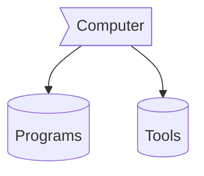

<h1 align="center">Hello Guys! We Are OSSInsight! 👁️</h1>

<div align="center">
<a href="https://ossinsight.io">
  
</div>

<h4 align="center">
  <b><a href="https://ossinsight.io/explore/">Data Explorer</a></b>
  •
  <b><a href="https://ossinsight.io/collections/open-source-database">Repo Rankings</a></b>
  •
  <b><a href="https://ossinsight.io/analyze/Ovilia">Developer Analytics</a></b>
  •
  <a href="https://ossinsight.io/analyze/pingcap/tidb">Repo Analytics</a>
  •
  <a href="https://ossinsight.io/collections/open-source-database">Collections</a>
  •
  <a href="https://ossinsight.io/docs/workshop">Workshop</a>
  •
  <a href="https://ossinsight.io/blog">Blog</a>
  •
  <a href="https://ossinsight.io/docs">API</a>
  •
  <a href="https://twitter.com/OSSInsight">Twitter</a>
</h3>

## Introduction

OSS Insight is a powerful tool that provides comprehensive, valuable, and trending insights into the open source world by analyzing 6+ billion rows of GitHub events data. 
 
[🎦 Video - OSS Insight: Easiest New Way to Analyze Open Source Software](https://www.youtube.com/watch?v=6ofDBgXh4So&t=1s)

## Embed Real-time Widget in Repo's / Personal README.md within 30s!

For all charming widgets, please [Check it out 👉](https://next.ossinsight.io/widgets?utm_source=github&utm_medium=referral), here are some examples:


| Repository Activity Trends | Collaborative Productivity - Last 28 days |
| ----------- | ----------- |
|||

| Repository Performance Stats - Last 28 days | Active Contributors - Last 28 days |
| ----------- | ----------- |
|||

| Star Geographic Distribution | Star History |
| ----------- | ----------- |
|||

| Company Affiliation | Lines of Code Changes |
| ----------- | ----------- |
|||

| Pull Request Size | Pull Request Lifecycle |
| ----------- | ----------- |
|||

| Currently Working On - Last 28 days | Top Active Contributors - Last 28 Days |
| ----------- | ----------- |
|||

| Repository Annual Ranking | Find More |
| ----------- | ----------- |
||<a href="https://next.ossinsight.io/widgets?utm_source=github&utm_medium=referral">Visit our website</a >|

## Contact us

<a href="https://twitter.com/OSSInsight" target="_blank">


<a href="https://github.com/pingcap/ossinsight/discussions" target="_blank">


<a href="mailto:ossinsight@pingcap.com" target="_blank">


## Sponsors
<a href="https://en.pingcap.com/tidb-cloud/?utm_source=ossinsight&utm_medium=referral">

</a>

<h1 align="center"><b>Hi , I'm Abdul Khalid </b></h1>
<!--  -->A
<p align="center">
  <a href="https://github.com/DenverCoder1/readme-typing-svg"></a>
</p>


<br>


	
## <picture></picture> **About me**

<picture> </picture>

<br>

- A passionate Self-taught Front-end developer
- Playing CTF's at spare time
- Currently learning Web Development by Self
- Personal website [link](https://www.0xabdulkhalid.ml)
- I’m currently open for an Intern or a new job opportunity, this is [my resume](https://read.cv/0xabdulkhalid)

<br><br>

<br><br>

## <b> Skills</b>
<br>

<p align="center">

- **Languages**:
    
    
    
    

<br>   
    
- **Front-End Development**:

   
   
   

<br>

- **Cloud Hosting**:

    
    
<br>

- **Softwares and Tools**:

    
    
    
    
     

<br>

- **Extras**:

    
       


</p>

<br>
<br>

-----

<br>


## <b> Github Stats </b>
<br>

<div align="center">

<a href="https://github.com/0xabdulkhalid/">
  
  

</a>
</div>

<br>
<br>
<br>

-----

<br>
<br>

## <b> Let's Connect..!</b>
<br>
<div align='left'>

<ul>

<li>
<a href="https://linkedin.com/in/0xabdulkhalid" target="_blank">

</a>
</li>

<br>

<li>
<a href="https://twitter.com/0xabdulkhalid" target="_blank">

</a>
</li>

<br>

<li>
<a href="mailto:0xabdulkhalid@gmail.com" target="_blank">

</a>
</li>
	
</ul>
</div>

<br>

<br>
<br>
<br>

<div align='center'>

## <b>السَّلاَمُ عَلَيْكُمْ وَرَحْمَةُ اللهِ وَبَرَكَاتُهُ...✨</b>

</div>
<br>
<br>
<br>
<br>

---

<br>

Credit: [Abdul Khalid](https://github.com/0xabdulkhalid)

Last Edited on: 09/11/2022
<h1 align="center">Hi 👋, I'm <a href="https://100rabhcsmc.github.io/Me.io/" target="blank">
Saurabh</a></h1>
<h3 align="center">A passionate Mobile App developer from Pune India &#127470;&#127475</h3>

<p align="left">  </p>

<p align="left"> <a href="https://twitter.com/100rabhcsmc" target="blank"></a> </p>

<a target="_blank" align="center">
  
</a>

- 🔭 I’m currently working in <a href="https://phoenix.tech/griffyn/" target="blank">Griffyn Robotech Private Limited</a>

- 🌱 I’m currently Working on Mobile App(React-Native)

- 🤝 I’m available for freelancing.

- 🌱 I’m currently learning Swift && SwiftUI <a href="https://github.com/100rabhcsmc/100DaysOfSwift" target="blank">100DaysOfSwift</a>

- 📝 I regularly write articles on [https://dev.to/100rabhcsmc](https://dev.to/100rabhcsmc)

- 💬 Ask me about **Reactjs & React-Native**

- 📫 How to reach me **saurabhchavan052@gmail.com**

- 📄 Know about my experiences <a href="https://github.com/100rabhcsmc/Me.io/blob/master/01SaurabhChavanReactNativeResume.pdf" target="blank">Resume</a>
<br/>
<h3 align="center" > Connect with me 🤝 </h3>

<p align="center">

 <div align="center"  class="icons-social" style="margin-left: 10px;">
        <a style="margin-left: 10px;"  target="_blank" href="https://www.linkedin.com/in/saurabhmchavan/">
			</a>
        <a style="margin-left: 10px;" target="_blank" href="https://github.com/100rabhcsmc">
		</a>
		<a style="margin-left: 10px;" target="_blank" href="https://stackoverflow.com/users/12053852/saurabh-chavan?tab=profile">
				</a>
	   <a style="margin-left: 10px;" target="_blank" href="https://dev.to/100rabhcsmc">
					</a>
        <a style="margin-left: 10px;" target="_blank" href="https://instagram.com/100rabhch">
			</a>
		<a style="margin-left: 10px;" target="_blank" href="https://twitter.com/100rabhcsmc">
			</a>
		<a style="margin-left: 10px;" target="_blank" href="https://www.youtube.com/channel/UC-ZdNkKNHC6KguDqNFKO2Nw?view_as=subscriber">
				</a>
		<a style="margin-left: 5px;" target="_blank" href="https://github.com/100rabhcsmc/Me.io/blob/master/01SaurabhChavanReactNativeResume.pdf">
					</a>
      </div>

</p>

### Blogs posts

<!-- BLOG-POST-LIST:START -->

- [Download Instagram profile picture using python](https://dev.to/100rabhcsmc/instagram-profile-picture-download-using-python-n2j)
- [Convert a image to sketch using python](https://dev.to/100rabhcsmc/convert-a-image-to-sketch-using-python-3ip1)
- [Upload your project/files in GitHub using commands](https://dev.to/100rabhcsmc/upload-your-project-files-in-github-using-commands-1hn8)
<!-- BLOG-POST-LIST:END -->

---

Credit: [Saurabh Chavan](https://github.com/100rabhcsmc)

Last Edited on: 08/08/2022

<!--horizontal divider(gradiant)-->


<!--h1 without bottom border-->
<div id="user-content-toc">
  <ul align="center">
    <summary><h1 style="display: inline-block">Hi 👋, I'm Nishant</h1></summary>
  </ul>
</div>


<!--- snake -->
<div align="center">
  </a>
</div>


<!--h2 without bottom border-->
<div id="user-content-toc">
  <ul align="center">
    <summary><h2 style="display: inline-block">Confusion is part of Programming</h2></summary>
  </ul>
</div>


<!--Intro start-->
- 🔭 I’m currently working on **AWS, React, React Native, Nodejs, MongoDB**

- 🌱 I’m currently learning **to put together multiple Hyper Beast Stack for Scalable Applications.**

- ☁️ I've keen interest in cloud computing. So,I'm learning **AWS**

- 📝 I regularly write articles on [Hashnode](https://1010nishant.hashnode.dev/)

- 💬 Ask me about **AWS, react, react-native, nodejs, mongoDB**

- 📫 Feel free to reach me out **nishantjangid6377@gmail.com**

- 🏠 Don't hesitate to drop me a **👋** on Discord –  [1010nishant](https://discordapp.com/users/957722095381540874) my username!
<!--Intro end-->


<!--- stats & Trophy (start) -->
<p align="center">
  <!--- stats (start) -->
<table align="center">
<tr border="none">
<td width="50%" align="center">
  
  
  <br></br>
   
</td>

<td width="50%" align="center">

  
  
  </td>
</tr>
</table>
<!--- stats (end) -->

<!--- trophy (start) -->
<div align=center>
  <a href="https://github.com/ryo-ma/github-profile-trophy" title="Go to Source">
      
    </a>
</div>
<!--- trophy (start) -->


</p>        
<!--- stats (end) -->


<!--h1 without bottom border-->
<div id="user-content-toc">
  <ul align="center">
    <summary><h2 style="display: inline-block">Technologies That I Know👨🏻‍💻</h2></summary>
  </ul>
</div>
<!--tech stack icons-->
<p align="center">
  <a href="https://skillicons.dev">
    
  </a>
</p>


<!-- Connect with me -->
<!--h2 without bottom border-->
<div id="user-content-toc">
  <ul align="center">
    <summary><h2 style="display: inline-block">Connect With Me🤝</h2></summary>
  </ul>
</div>

<!--icons and links-->
<p align="center">
<a href="https://www.linkedin.com/in/1010nishant/" target="blank"></a>
<a href="https://twitter.com/1010nishant" target="blank"></a> 
<a href="https://www.instagram.com/nishant.jangir.1010/" target="blank"></a>
<a href="https://1010nishant.hashnode.dev/" target="blank"></a>
<a href="https://discordapp.com/users/957722095381540874" target="blank"></a>
  
</p>


<!--profile visit count-->
<div align="center">
  
[](https://visitcount.itsvg.in)
  
</div>


<!--horizontal divider(gradiant)-->


----------------------------------------------------------------------
Credit: [1010nishant](https://github.com/1010nishant)

Last Edited on: 29/4/2023
<div align="center">
<h1 align="center">Hi , I'm Azzar</h1>
<h4 align="center">a freelance developer an also an engineering students at yogyakarta state university, see my <a href="https://github.com/1999AZZAR/1999AZZAR/blob/main/assets/doc/azzar_resume.pdf" target="_blank">resume</a> for more</h4>
</div>

<div align="center">
  <a href="https://1999azzar.github.io/1999AZZAR/">
  </a>
</div>

-----
<details>
  <summary>☎️ contact me</summary>
<div>
  <samp>
    <h2 align="center">you can reach me by:</h2>
    <p align="center">
      <br/>
      <a href="https://www.linkedin.com/in/azzar-budiyanto/" target="blank"></a>
      <a href="https://fb.com/1999AZZAR" target="blank"></a>
      <a href="mailto:azzar.mr.zs@gmail.com" target="blank"></a>
    </p>
  <p align="center">
      <a href="https://instagram.com/azzar_budiyanto" target="blank"></a>
      <a href="https://wa.me/+6282232529804" target="blank"></a>
      <a href="https://twitter.com/siapa_hayosiapa" target="blank"></a>
      <br>
    </p>
  </samp>
</div>
</details>

<details>
  <summary>🧮 about</summary>
<div>
<samp>
<h2 align="center">About this Account</h2>
 <p align="center">
  <a href="github.com/1999AZZAR" target="blank"></a>
  <a href="https://1999azzar.github.io/1999AZZAR/"></a>
  </p>
  <p align="center">
  <a href="https://www.codefactor.io/repository/github/1999azzar/1999azzar/overview/main"></a>
  <a href="github.com/1999AZZAR" target="blank"></a>
  </p>
 <p align="center">
  <a href="github.com/1999AZZAR" target="blank"></a>
  <a href="github.com/1999AZZAR"></a>
 </p>
 </samp>
</div>
</details>
  
<details> 
  <summary>💻 GitHub Profile Stats</summary>
  <div>
  <samp>
    <h2 align="center"> Github stats </h2>
      <br/>
    <details open>
  <summary><h3>Languages</h3></summary>
            <p align="center">
        <a href="https://github.com/1999AZZAR/">
          </a>
      </p>
        <p align="center">
          <a href="https://github.com/1999AZZAR/">
          
          
          </a>
        </p>
</details>
    <details open>
  <summary><h3>stasistic</h3></summary>
        <p align="center">
          <a href="https://github.com/1999AZZAR/">
          
          
          </a>
       </p>
     <br>
     </samp>
  </div>    
</details>

<details>
  <summary>📈 Latest Activity Graph</summary>
  <samp>
  <br/>
  <h2 align="center"> latest contribution </h2>
<a href="https://github.com/ashutosh00710/github-readme-activity-graph">
  </a>
<br/>
  </samp>
  </details>
  
<details>
  <summary>🌏 global</summary>
  <br/>
  <details open>
  <summary>👷‍♂️ create your own custom badge</summary>
  <div>
  <samp>
    <h2 align="center">u can try using these website for creating your own custom badge</h2>
    <p align="center">
      <a href="https://forthebadge.com/generator/" target="blank">
        </a>        
      <a href="https://badgen.net/" target="blank">
        </a>
      <a href="https://shields.io/" target="blank">
        </a>
    </p>
    </samp>
  </div>
</details> 
<details open>
  <summary>😒 random stuff</summary>
<div>
<samp>
<h2 align="center"> just an ascii art of me holding an umbrella </h2>
</samp>
</div>

```js
/*
,,,,,,,,,,,,,,,,,,,,,,,,,,,,,,,,,,,,,,,,,,,,,,,,,,,,,,,,,,,,,,,,,,,,,,,,,,,,,,,,,,,,,,,,,,,,,,,,,,,,,,,,,,,,,,,,,,,,,,,,,,
,,,,,,,,,,,,,,,,,,,,,,,,,,,,,,,,,,,,,,,,,,,,,,,,,,,,,,,,,,,,,,,,,,,,,,,,,,,,,,,,,,,,,,,,,,,,,,,,,,,,,,,,,,,,,,,,,,,,,,,,,,
,,,,,,,,,,,,,,,,,,,,,,,,,,,,,,,,,,,,,,,,,,,,,,,,,,,,,,,,,,,,,,,,,,,,,,,,,,,,,,,,,,,,,,,,,,,,,,,,,,,,,,,,,,,,,,,,,,,,,,,,,,
,,,,,,,,,,,,,,,,,,,,,,,,,,,,,,,,,,,,,,,,,,,,,,,,,,,,,,,,,,,,,,,,,,,,,,,,,,,///////,,,,,,,,,,,,,,,,,,,,,,,,,,,,,,,,,,,,,,,,
,,,,,,,,,,,,,,,,,,,,,,,,,,,,,,,,,,,,,,,,,,,,,,,,,,,,,,,,,,,,,,,((((((((((((((((((((((((,,,,,,,,,,,,,,,,,,,,,,,,,,,,,,,,,,,
,,,,,,,,,,,,,,,,,,,,,,,,,,,,,,,,,,,,,,,,,,,,,,,,,,,,,,//(((((((((((((((((((((((((((((((((((((//,,,,,,,,,,,,,,,,,,,,,,,,,,,
,,,,,,,,,,,,,,,,,,,,,,,,,,,,,,,,,,,,,,,,,,,,,,,,,,'(((((((((((((((((((((((((((((((((((((((((((((('',,,,,,,,,,,,,,,,,,,,,,,
,,,,,,,,,,,,,,,,,,,,,,,,,,,,,,,,,,,,,,,,,,,,,,,,/(((((((((((((((((((((((((((((((((((((((((((((((((((//,,,,,,,,,,,,,,,,,,,,
,,,,,,,,,,,,,,,,,,,,,,,,,,,,,,,,,,,,,,,,,,,,,'((((((((((((((((((((((((((((((((((((((((((((((((((((((((((',,,,,,,,,,,,,,,,,
,,,,,,,,,,,,,,,,,,,,,,,,,,,,,,,,,,,,,,,,,,,/((((((((((((((((((((((((((((((((((((((((((((((((((((((((((((/,,,,,,,,,,,,,,,,,
,,,,,,,,,,,,,,,,,,,,,,,,,,,,,,,,,,,,,,,,,,,((((((((((((((((((((((((((((((((((((((((((((((((((((((((((((,,,,,,,,,,,,,,,,,,,
,,,,,,,,,,,,,,,,,,,,,,,,,,,,,,,,,,,,,,,,,,,((((((((((((((((((((((((((((((((((((((((((((((((((((((((((/,,,,,,,,,,,,,,,,,,,,
,,,,,,,,,,,,,,,,,,,,,,,,,,,,,,,,,,,,,,,,,,'((((((((((((''''',,,,(((((((((((((((((((((((((((((,,,,,,,,,,,,,,,,,,,,,,,,,,,,,
,,,,,,,,,,,,,,,,,,,,,,,,,,,,,,,,,,,,,,,,,,,,,,,,,/////(((((((/,,,/(((((((((((((((((///,,,,,,,,,,,,,,,,,,,,,,,,,,,,,,,,,,,,
,,,,,,,,,,,,,,,,,,,,,,,,,,,,,,,,,,,,,,,,,,,,,,,,,,,,,(((((((((((,,,,,,,,,,(,,,,,,,,,,,,,,,,,,,,,,,,,,,,,,,,,,,,,,,,,,,,,,,
,,,,,,,,,,,,,,,,,,,,,,,,,,,,,,,,,,,,,,,,,,,,,,,,,,,,/(((((((((((//,,,,,,,,((,,,,,,,,,,,,,,,,,,,,,,,,,,,,,,,,,,,,,,,,,,,,,,
,,,,,,,,,,,,,,,,,,,,,,,,,,,,,,,,,,,,,,,,,,,,,,,,,,,,(((((((((((((,,,,,,,,,((,,,,,,,,,,,,,,,,,,,,,,,,,,,,,,,,,,,,,,,,,,,,,,
,,,,,,,,,,,,,,,,,,,,,,,,,,,,,,,,,,,,,,,,,,,,,,,,,,,,,/(((((((((/,,,,,,,,,,,(,,,,,,,,,,,,,,,,,,,,,,,,,,,,,,,,,,,,,,,,,,,,,,
,,,,,,,,,,,,,,,,,,,,,,,,,,,,,,,,,(,,,,((',,,,,,,,,,,,,,((((((((,,,,,,,,,,,(((((,,,,,,,,,,,,,,,,,,,,,,,,,,,,,,,,,,,,,,,,,,,
,,,,,,,,,,,,,,,,,,,,,,,,,,,,,,,,/((,,,(((,,,,,,,,,,,,,,((((((((,,,,,,,,,,/(((((,,,,,,,,,,,,,,,,,,,,,,,,,,,,,,,,,,,,,,,,,,,
,,,,,,,,,,,,,,,,,,,,,,,,,,,((,,,(((,,,((((,,,,,,,,,,'(((((((((((,,,,,,,,,,((((((,,,,,,,,,,,,,,,,,,,,,,,,,,,,,,,,,,,,,,,,,,
,,,,,,,,,,,,,,,,,,,,,,,,,,,((,,,(((,,,((((,,,,////((((((((((''',,,,,,,,,,,,,'(((/,,,,,,,,,,,,,,,,,,,,,,,,,,,,,,,,,,,,,,,,,
,,,,,,,,,,,,,,,,,,,,,,,,,,,((',,(((,,,((((,'((((((((((((((((((',,,,,,,,,,,,,,,(((',,,,,,,,,,,,,,,,,,,,,,,,,,,,,,,,,,,,,,,,
,,,,,,,,,,,,,,,,,,,,,,,,,,,(((,,(((/,,((((/(((((((((((((((((((((/,,,,,',,/,,,,(((((,,,,,,,,,,,,,,,,,,,,,,,,,,,,,,,,,,,,,,,
,,,,,,,,,,,,,,,,,,,,,,,,,,,(((,,(((,,,((((((((,(((((((((((((((((((',,,,,,(,,,,,(((((,,,,,,,,,,,,,,,,,,,,,,,,,,,,,,,,,,,,,,
,,,,,,,,,,,,,,,,,,,,,,,,,,,'(',,(((,,,(((('(((,,,/(((((((((((((((((,,,,,'(,,/,,((((((,,,,,,,,,,,,,,,,,,,,,,,,,,,,,,,,,,,,,
,,,,,,,,,,,,,,,,,,,,,,,,,,,,,,,,,((,,,,(((,,(',,'((((((((,(((,,,((,,,,,,,(((,,,((((((,,,,,,,,,,,,,,,,,,,,,,,,,,,,,,,,,,,,,
,,,,,,,,,,,,,,,,,,,,,,,,,,,,,,,,,((,,,,(((,,((,,(((((((((,((',,,((,,,,,,,',,,,/(((((((,,,,,,,,,,,,,,,,,,,,,,,,,,,,,,,,,,,,
,,,,,,,,,,,,,,,,,,,,,,,,,,,,,,,,,(,,,,,((,,,((,,,((((((((,,(,,,,,((,,,,,,,,,,,,,((((((,,,,,,,,,,,,,,,,,,,,,,,,,,,,,,,,,,,,
,,,,,,,,,,,,,,,,,,,,,,,,,,,,,,,,,,,,,,,(((,,(((,,((((((((,(((,,,,((,,,,,,,,,,,,,,,,,,,,,,,,,,,,,,,,,,,,,,,,,,,,,,,,,,,,,,,
,,,,,,,,,,,,,,,,,,,,,,,,,,,,,,,,,,,,,,,,,,,((((,,((((((((,((',,,,,(,,,,,,,,,,,,,,,,,,,,,,,,,,,,,,,,,,,,,,,,,,,,,,,,,,,,,,,
,,,,,,,,,,,,,,,,,,,,,,,,,,,,,,,,,,,,,,,,,,(((((,,((((((((((((,,,,,(,,,,,,,,,,,,,,,,,,,,,,,,,,,,,,,,,,,,,,,,,,,,,,,,,,,,,,,
,,,,,,,,,,,,,,,,,,,,,,,,,,,,,,,,,,,,,,,,,,(((((,,((((((((((((,,,,,((,,,,,,,,,,,,,,,,,,,,,,,,,,,,,,,,,,,,,,,,,,,,,,,,,,,,,,
,,,,,,,,,,,,,,,,,,,,,,,,,,,,,,,,,,,,,,,,,,((((,,(((((((((',((,,,,,,(,,,,,,,,,,,,,,,,,,,,,,,,,,,,,,,,,,,,,,,,,,,,,,,,,,,,,,
,,,,,,,,,,,,,,,,,,,,,,,,,,,,,,,,,,,,,,,,,((((,,((((((((((,,((,,,,,,(,,,,,,,,,,,,,,,,,,,,,,,,,,,,,,,,,,,,,,,,,,,,,,,,,,,,,,
,,,,,,,,,,,,,,,,,,,,,,,,,,,,,,,,,,,,,,,,,((((,,((((,((,((,(((,,,,,,(,,,,,,,,,,,,,,,,,,,,,,,,,,,,,,,,,,,,,,,,,,,,,,,,,,,,,,
,,,,,,,,,,,,,,,,,,,,,,,,,,,,,,,,,,,,,,,,,(((,,((((((((,((,,((,',,,,,,,,,,,,,,,,,,,,,,,,,,,,,,,,,,,,,,,,,,,,,,,,,,,,,,,,,,,
,,,,,,,,,,,,,,,,,,,,,,,,,,,,,,,,,,,,,,,,,((,,,((((((((((',,(((',,,,,,,,,,,,,,,,,,,,,,,,,,,,,,,,,,,,,,,,,,,,,,,,,,,,,,,,,,,
,,,,,,,,,,,,,,,,,,,,,,,,,,,,,,,,,,,,,,,,,((('((((((((((((((((((,,,,,,,,,,,,,,,,,,,,,,,,,,,,,,,,,,,,,,,,,,,,,,,,,,,,,,,,,,,
,,,,,,,,,,,,,,,,,,,,,,,,,,,,,,,,,,,,,,,,((((('((''''''',,,,,,,,,,,,,,,,,,,,,,,,,,,,,,,,,,,,,,,,,,,,,,,,,,,,,,,,,,,,,,,,,,,
,,,,,,,,,,,,,,,,,,,,,,,,,,,,,,,,,,,,,,,,((((,,,,,,,,,,,,,,,,,,,,,,,,,,,,,,,,,,,,,,,,,,,,,,,,,,,,,,,,,,,,,,,,,,,,,,,,,,,,,,
,,,,,,,,,,,,,,,,,,,,,,,,,,,,,,,,,,,,,,,,'(((,,,,,,,,,,,,,,,,,,,,,,,,,,,,,,,,,,,,,,,,,,,,,,,,,,,,,,,,,,,,,,,,,,,,,,,,,,,,,,
,,,,,,,,,,,,,,,,,,,,,,,,,,,,,,,,,,,,,,,,,,,,,,,,,,,,,,,,,,,,,,,,,,,,,,,,,,,,,,,,,,,,,,,,,,,,,,,,,,,,,,,,,,,,,,,,,,,,,,,,,,
,,,,,,,,,,,,,,,,,,,,,,,,,,,,,,,,,,,,,,,,,,,,,,,,,,,,,,,,,,,,,,,,,,,,,,,,,,,,,,,,,,,,,,,,,,,,,,,,,,,,,,,,,,,,,,,,,,,,,,,,,,
,,,,,,,,,,,,,,,,,,,,,,,,,,,,,,,,,,,,,,,,,,,,,,,,,,,,,,,,,,,,,,,,,,,,,,,,,,,,,,,,,,,,,,,,,,,,,,,,,,,,,,,,,,,,,,,,,,,,,,,,,,
,,,,,,,,,,,,,,,,,,,,,,,,,,,,,,,,,,,,,,,,,,,,,,,,,,,,,,,,,,,,,,,,,,,,,,,,,,,,,,,,,,,,,,,,,,,,,,,,,,,,,,,,,,,,,,,,,,,,,,,,,,
*/
```
</details>
<br/>
</details> 

-----
Credits: [1999AZZAR](https://github.com/1999AZZAR)
Last Edited on: 23/09/2022
<h1 align="center">Hi , I'm Ahmed Hossam </h1>
<p align="center">
  <a href="https://github.com/DenverCoder1/readme-typing-svg"></a>
</p>


<br>

<p align="center"> 
	 
	<!---
		<a href = "https://commits.top/egypt.html" target="_blank">
			 
		</a>
	-->
	<a href = "https://commits.top/egypt.html" target="_blank">
		 
	</a>

</p>

	
## <picture></picture> About me

<picture> </picture>

<br><br>

- :school: I am a `Junior` at [Faculty of Computers & Informatics](http://suez.edu.eg/ar/%d9%83%d9%84%d9%8a%d8%a9-%d8%a7%d9%84%d8%ad%d8%a7%d8%b3%d8%a8%d8%a7%d8%aa-%d9%88%d8%a7%d9%84%d9%85%d8%b9%d9%84%d9%88%d9%85%d8%a7%d8%aa/) at [Suez Canal University](http://suez.edu.eg/ar/).
- :trophy: 2x `ACPC` Finalist.
- :technologist: I love using Software as a solution for every `Problem`.
- :computer: I am a competitive programmer at `Codeforces`, `Atcoder`, `Leetcode`, `Codechef`, `Google Contests`.
- :student: I’m currently learning `Computer Science` and `Software Engineering`.
- :nerd_face: Always `learning new things`.
- :thinking: I’m currently open for a new `job opportunity`, this is [MY RESUME](http://lnkiy.in/Ahmed_Hossam_Resume).
- :boom: You can visit [MY WEBSITE](https://cutt.ly/Ahmed_Hossam_Website).
<br>


## <picture>  </picture> My Competitive Programming Profiles

<p align="center">
  <a href="https://codeforces.com/profile/7oSkaaa"></a>
	<a href="https://leetcode.com/7oSkaa/"></a>
	<a href="https://atcoder.jp/users/ahmed_7oSkaa"></a>
	<a href="https://www.codechef.com/users/ahmed_7oskaa"></a>
	<a href="https://icpc.global/ICPCID/IW0X0CTD0ZV9"></a>     
	<a href="https://www.codingame.com/profile/e5e56c7585fda3b457056b85180a4d636850344" >
</p>

## <picture>  </picture> Connect with me
<p align="center">
	<a href="mailto:ahmed.7oskaa@gmail.com"></a>
	<a href="https://github.com/7oSkaaa"></a>
	<a href="https://wa.me/0201208822340"></a>
	<a href="https://www.linkedin.com/in/7oskaa/"></a>
	<a href="https://www.facebook.com/7oSkaaa"></a>
	<a href="https://www.instagram.com/ahmed_7oskaa/"></a>
	<a href="https://msng.link/o/?ahmed.7oskaa=sc"></a>
</p>


## 🛠️ My Skills

### <picture>   </picture> Programming languages

<p align="center"> 
  &emsp; 
  <a href="https://www.cprogramming.com/" target="_blank"> 
    
  </a> 
  &emsp;
  <a href="https://www.w3schools.com/cpp/" target="_blank"> 
    
  </a> 
  &emsp;
  <a href="https://developer.mozilla.org/en-US/docs/Web/JavaScript" target="_blank"> 
     
   </a>
  &emsp;
  <a href="https://www.java.com" target="_blank"> 
    
  </a>
  &emsp;
   <a href="https://www.python.org" target="_blank">
    
  </a>
</p>

### <picture>   </picture> Frontend Development
<p align="center"> 
  &emsp; 
  <a href="https://www.w3.org/html/" target="_blank"> 
   
  </a>   
  &emsp;
  <a href="https://www.w3schools.com/css/" target="_blank">
    
  </a> 
  &emsp;
  <a href="https://www.python.org" target="_blank">
    
  </a>
  &emsp;
  <a href="https://developer.mozilla.org/en-US/docs/Web/JavaScript" target="_blank"> 
     
   </a>
</p>

 ### <picture>   </picture> Software & Tools
 
<p align="center">
  &emsp;
    <a href="#"></a>
  &emsp;
    <a href="#"></a>
  &emsp;
    <a href="#"></a>
  &emsp;
    <a href="#"></a>
  &emsp;
    <a href="#"></a>
  &emsp;
    <a href="#"></a>
  &emsp;
    <a href="#"></a>
  &emsp;
    <a href="#"></a>
  &emsp;
    <a href="#"></a>
    &emsp;
    <a href="#"></a>
    &emsp;
    <a href="#"></a>
    &emsp;
    <a href="#"></a>
</p>

 ### <picture>   </picture> IDEs
 
<p align="center">
  &emsp;
    <a href="#"></a>
  &emsp;
    <a href="#"></a>
  &emsp;
    <a href="#"></a>
  &emsp;
    <a href="#"></a>
</p>

 ### <picture>   </picture> Competitive Programming & Problem Solving
 
<p align="center">
  &emsp;
    <a href="#"></a>	
  &emsp;
    <a href="#"></a>
  &emsp;
    <a href="#"></a>
  &emsp;
    <a href="#"></a>
  &emsp;
    <a href="#"></a>
  &emsp;
    <a href="#"></a>
</p>

 ### <picture>   </picture> Operating Systems
 
<p align="center">
  &emsp;
    <a href="#"></a>
  &emsp;
    <a href="#"></a>
  &emsp;
    <a href="#"></a>
  &emsp;
    <a href="#"></a>
  &emsp;
    <a href="#"></a>
</p>

<br> 

---

<p align = "center">
	<a href="https://github.com/piyushsuthar/github-readme-quotes"> 
</p>

## <picture>   </picture> Github Stats

<details><summary><h3> 🔥 Streak Stats</h3></summary>

----	

<p align="center"></p>

</details>
  
<details><summary><h3>💻 GitHub Profile Stats</h3></summary>

----
	
<p align="center">
    <a href="https://github.com/anuraghazra/github-readme-stats">
	    </a>
	  
<br/>

  <b>Note:</b> Top languages is only a metric of the languages my public code consists of and doesn't reflect experience or skill level.
  </p>
</details>

<details><summary><h3>⚡ Recent GitHub Activity</h3></summary>

----
	
[](https://github.com/7oSkaaa/github-readme-activity-graph)

 
</details>

<details><summary> <h3> :trophy: Git profile Trophies </h3></summary>

----
	
<p align="center"> <a href="https://github.com/ryo-ma/github-profile-trophy"></a> </p>

[](https://holopin.io/@7oskaa)
	
</details>
	
<details><summary><h3> :open_file_folder: My Repositories </h3></summary>

----
	
<div>
  <p align="center">
	<a href="https://github.com/7oSkaaa/LeetCode_DailyChallenge_2023">
      		
    	</a>
	<a href="https://github.com/7oSkaaa/Ahmed-Hossam">
      		
    	</a>
    	<a href="https://github.com/7oSkaaa/Strees_Testing">
      		
    	</a>
    	<a href="https://github.com/7oSkaaa/CP-Templates">
      		
    	</a>
    	<a href="https://github.com/7oSkaaa/Codeforces-Polygon-Template">
      		
    	</a>
	<a href="https://github.com/7oSkaaa/Some-Linux-Commands">
      		
    	</a>
	<a href="https://github.com/7oSkaaa/Shorten-Link">
      		
    	</a>
	<a href="https://github.com/7oSkaaa/7oSkaaa">
      		
    	</a>
	<a href="https://github.com/7oSkaaa/Competitive-Programming-Session-Content">
      		
    	</a>
	<a href="https://github.com/7oSkaaa/VS-Code-for-CP">
      		
    	</a>
	<a href="https://github.com/7oSkaaa/Sorting-Algorithms">
      		
    	</a>
	<a href="https://github.com/7oSkaaa/board-link-generator">
      		
    	</a>
	<a href="https://github.com/7oSkaaa/Tic-Tac-Toe-GUI">
      		
    	</a>
	<a href="https://github.com/7oSkaaa/PhoneBook-System">
      		
    	</a>
	<a href="https://github.com/7oSkaaa/Codeforces-Sheet-Generator">
      		
    	</a>
	<a href="https://github.com/7oSkaaa/CP-Calendar">
      		
    	</a>
	<a href="https://github.com/7oSkaaa/Codeforces-Friends-Script">
      		
    	</a>
	<a href="https://github.com/7oSkaaa/vJudge-Board-Scrapper">
      		
    	</a>
	<a href="https://github.com/7oSkaaa/CP-Templates-Snippets">
      		
    	</a>
	<a href="https://github.com/7oSkaaa/Udemy-Website">
      		
    	</a>
  </p>
</div>
</details>

</br></br>
	
## 🐍 A Snake Eating my Contributions Graph
	
<p align = "center">
	
</p>
<div align="center">
<h2> 𝐇𝐞𝐥𝐥𝐨 𝐭𝐡𝐞𝐫𝐞, 𝐟𝐞𝐥𝐥𝐨𝐰 <𝚍𝚎𝚟𝚎𝚕𝚘𝚙𝚎𝚛𝚜/>! </h2>
</div>

<div align="center" width="50">


</div>

<div align="center">

You have finally discovered my Github profile. <br>
Please feel free to clone/fork projects, raise issues and submit PRs if you think something could be better. <br>
Ask me anything <a href="https://github.com/ABSphreak/ABSphreak/issues/new"><b>here</b></a><br>
or <a href="mailto:absphreak@outlook.com"><b>email</b></a> me

<i>Happy Coding!</i> 😊

</div>

<div align="center">


</br>
</br>
<i>Random dev joke for you! (create your own by clicking here ↓)</i><br>
<a href="https://readme-jokes.vercel.app"></a>

---
[](http://hits.dwyl.com/ABSphreak/ABSphreak)

<i>Follow me around the web:</i><br>

  <!-- <a target="_blank" href="https://www.linkedin.com/in/absphreak/">🇱​🇮​🇳​🇰​🇪​🇩​🇮​🇳​</a> ●
  <a target="_blank" href="https://www.instagram.com/absphreak/">🇮​🇳​🇸​🇹​🇦​🇬​🇷​🇦​🇲​</a> ●
  <a target="_blank" href="https://www.facebook.com/originalphreak/">🇫​🇦​🇨​🇪​🇧​🇴​🇴​🇰​</a> ●
  <a target="_blank" href="https://open.spotify.com/user/0170agi99s5hh187g7mtz245b">🇸​🇵​🇴​🇹​🇮​🇫​🇾​</a>
  <a target="_blank" href="https://dev.to/ABSphreak">🇸​🇵​🇴​🇹​🇮​🇫​🇾​</a> -->

<a href="https://www.linkedin.com/in/absphreak" target="_blank"></a>
<a href="https://www.instagram.com/absphreak" target="_blank"></a>
<a href="https://www.facebook.com/originalphreak" target="_blank"></a>
<a href="https://open.spotify.com/user/0170agi99s5hh187g7mtz245b" target="_blank"></a>
<a href="https://dev.to/ABSphreak" target="_blank"></a>

</div>

<!-- [🇱​🇮​🇳​🇰​🇪​🇩​🇮​🇳​](https://www.linkedin.com/in/absphreak/) ● [🇮​🇳​🇸​🇹​🇦​🇬​🇷​🇦​🇲​](https://www.instagram.com/absphreak/) ● [🇫​🇦​🇨​🇪​🇧​🇴​🇴​🇰​](https://www.facebook.com/originalphreak/) ● [🇸​🇵​🇴​🇹​🇮​🇫​🇾​](https://open.spotify.com/user/0170agi99s5hh187g7mtz245b) -->

<!--
**ABSphreak/ABSphreak** is a ✨ _special_ ✨ repository because its `README.md` (this file) appears on your GitHub profile.

Here are some ideas to get you started:

- 🔭 I’m currently working on ...
- 🌱 I’m currently learning ...
- 👯 I’m looking to collaborate on ...
- 🤔 I’m looking for help with ...
- 💬 Ask me about ...
- 📫 How to reach me: ...
- 😄 Pronouns: ...
- ⚡ Fun fact: ...
-->

-----
Credits: [ABSphreak](https://github.com/ABSphreak)

Last Edited on: 30/08/2020<h1 align="center">Hi 👋, I'm Anirudh Rai</h1>


<p align="left"> <a href="https://twitter.com/" target="blank"></a> </p>

🌱 I’m currently learning **WEB Development Full-Stack**


<br>
<h3 align="left">Languages and Tools:</h3>
<p align="left"> <a href="https://getbootstrap.com" target="_blank" rel="noreferrer">  </a> <a href="https://www.cprogramming.com/" target="_blank" rel="noreferrer">  </a> <a href="https://www.w3schools.com/cpp/" target="_blank" rel="noreferrer">  </a> <a href="https://www.w3schools.com/css/" target="_blank" rel="noreferrer">  </a> <a href="https://git-scm.com/" target="_blank" rel="noreferrer">  </a> <a href="https://www.w3.org/html/" target="_blank" rel="noreferrer">  </a> <a href="https://www.java.com" target="_blank" rel="noreferrer">  </a> <a href="https://developer.mozilla.org/en-US/docs/Web/JavaScript" target="_blank" rel="noreferrer">  </a> <a href="https://www.linux.org/" target="_blank" rel="noreferrer">  </a> <a href="https://www.mysql.com/" target="_blank" rel="noreferrer">  </a> <a href="https://nodejs.org" target="_blank" rel="noreferrer">  </a> <a href="https://www.python.org" target="_blank" rel="noreferrer">  </a> <a href="https://reactjs.org/" target="_blank" rel="noreferrer">  </a> <a href="https://tailwindcss.com/" target="_blank" rel="noreferrer">  </a> </p><br>


<hr width="36%" >

<h3>My GitHub Stats</h3>

<br>


<p></p>

<br><br><br><br><br><br><br>
<p>&nbsp;</p>
<br><br><br><br><br><br><br><br><br><br>

<p></p>
<br><br><br><br><br><br><br><br><br><br>
<hr width="60%" >
<h3 align="left">Connect with me:</h3>
<p align="left">
<a href="https://linkedin.com/in/anirudh-rai-072732220" target="blank"></a>
<a href="https://stackoverflow.com/users/21304875" target="blank"></a>
<a href="https://kaggle.com/anirudhrai693" target="blank"></a>
<a href="https://instagram.com/anii_akhil" target="blank"></a>
</p>
<br>
<p align="left">  </p>

------


[ANii693](https://github.com/ANii693)

Last Edited on: 28/02/2023<p align="center">
  
</p>
<br>

<p align="left"> 

 </p>
 <p align="center">

  
  
  
</p>
<hr>
<h1 align="center">Hi , I am Ovindu Wijethunge </h1>
<h3 align="center">Machine Learning Engineer | Data Scientist </h3>
<p align="center">
<a href="https://www.hackerrank.com/OvinduWijethunge" target="blank"></a>
<a href="https://www.linkedin.com/in/ovinduwijethunge/" target="blank"></a>  
<a href="https://www.kaggle.com/ovinduwijethunge" target="blank"></a>
<a href="https://www.instagram.com/ovindu_vesuvius/" target="blank"></a>
<a href="https://www.facebook.com/ovindu.wijethunge.7/" target="blank"></a>
 <a href = "mailto: oumw.udesh@gmail.com"></a>
</p>
</p>


<p align="center">
  <em>
    Hello, I am Ovindu Wijethunge a <b>final year</b> undergraduate from <a href="https://uom.lk/"> <b>University Of Moratuwa</b>, Sri-Lanka (" Wisdom is all wealth ")</a>. <br>
    <b>a passionate self-learner</b>  and a <b>Machine Learning Engineer</b>&nbsp;&nbsp,<br>who is <b>obsessed</b>
    with <b>Data science</b> and always looking to find patterns of which are hidden in the data 
  </em> 
  <br>
   <b><i align="center">Thought : "Life is full of choices…choose wisely!”</i></b> 
</p>
<br><br>


&nbsp;***About me ....***

✔ Callme: ***He/His*** or ***TeamWorker*** 😊 <br>
✔ I’m currently Developing a youtube spam comments filtering tool for **Sinhala language**<br>
✔ I’m currently learning about **deep learning**🥰<br>
✔ I’m looking to collaborate with any **Open - Source data science projects**<br>
✔ Ask from me anything you want, If I am alive I will answer within seconds 😉<br>
✔ Fun fact : *I Always try to learn something new and then sleep till it store in the brain* 😎<br><br><br><br>
 

&nbsp;***My working tools...***
<p align="left">
  
  <code></code>
  <code>  </code>
  <code>  </code>
  <code>  </code>
  <code>  </code>
  <code>  </code>
  <code>  </code>
  <code>  </code>
  <code>  </code>
  <code>  </code>
  <code>  </code>
  <code>  </code>
  <code>  </code>
  <code>  </code>
  <code>  </code>
  <code>  </code>
  <code>  </code>
  <code>  </code>
  <code>  </code>
  <code>  </code>
  <code>  </code>
  <hr>
  <p align="center">
 &nbsp;<i><b>Git Activeness</b></i></p>
 
<p></p>
<p>&nbsp;</p>
<br><br><br><br><br>

<hr>


<p align="center">&nbsp;Git profile Trophies</p><br>


-----
Credits: [Ovindu Wijethunge](https://github.com/OvinduWijethunge)

Last Edited on: 17/04/2021


<h2>Hey there! I'm Aditya</h2>

<!-- ## 👋 &nbsp;Hey there! I'm Aditya -->

### 👨🏻‍💻 &nbsp;About Me

💡 &nbsp;I like to explore new technologies and develop software solutions and quick hacks.\
🎓 &nbsp;I'm currently studying Computer Science and Mathematics at the University of Massachusetts Amherst.\
🌱 &nbsp;I'm on track for learning more about Artificial Intelligence, Systems Design, and Cloud Architecture.\
✍️ &nbsp;In my free time, I pursue Graphic Design and Blog Writing as hobbies/side hustles.\
💬 &nbsp;Feel free to reach out to me for pro bono consulting and volunteering, or just for some interesting discussion.\
✉️ &nbsp;You can shoot me an email at avsingh@umass.edu! I'll try to respond as soon as I can.\
📄 &nbsp;Please have a look at my [Résumé](https://www.adityavsingh.com/resume.html) for more details about me. I'm open to feedback and suggestions!


### 🛠 &nbsp;Tech Stack

&nbsp;
&nbsp;
&nbsp;
&nbsp;
&nbsp;
\
&nbsp;
&nbsp;
&nbsp;
&nbsp;
\
&nbsp;
&nbsp;
&nbsp;
&nbsp;
\
&nbsp;
&nbsp;
\
&nbsp;
&nbsp;


### ⚙️ &nbsp;GitHub Analytics

<p align="center">
<a href="https://github.com/AVS1508">
  
  
</a>
</p>

### 🤝🏻 &nbsp;Connect with Me

<p align="center">
<a href="https://www.adityavsingh.com"></a>
<a href="https://linkedin.com/in/AVS1508"></a>
<a href="mailto:avsingh@umass.edu"></a>
<a href="https://instagram.com/adityavs_"></a>
<a href="https://facebook.com/AVS1508"></a>
<a href="https://www.pinterest.ca/AVS1508"></a>
<a href="https://www.behance.net/AVS1508"></a>
</p>

-----
Credits: [Aditya Vikram Singh](https://github.com/AVS1508)

Last Edited on: 11/12/2020<div align="center">
<h2> Hi There, Welcome to my Github profile! </h2>
<a href="https://linkedin.com/in/abdoachhoubi" target="_blank">

</a>
<a href="https://twitter.com/abdo_achhoubi" target="_blank">

</a>
<a href="https://instagram.com/abdo.achhoubi" target="_blank">

</a>
<a href="https://achhoubiplus.hashnode.dev" target="_blank">

</a>
<br />
<br />

<br />
<br />

I'm a Full Stack Developer with 2+ years of hands-on experience designing, developing and implementing applications and solutions using a range of technologies and programming languages.
<br />

I'm currently based in **[Ben Guerir, Morocco.](https://www.google.com/maps/place/Ben+Guerir/@32.2307977,-7.9817398,13z/data=!3m1!4b1!4m5!3m4!1s0xdaf7a781193e37b:0x600a48af566b132a!8m2!3d32.2359364!4d-7.9538378)**

<br />
I love learning new techs and using new tools. I also love drinking Atay (Tea in Ar - Morocco) while coding.
<br />
<br />

Please feel free to clone/fork projects, raise issues and submit PRs if you think something could be better.<br />
Ask me anything **[here](https://github.com/abdoachhoubi/abdoachhoubi/issues/new)** or <a href="mailto:abdo.achhoubi3@gmail.com"><b>send me an email</b></a>.
<br />
<br />


<br />
<br />

<br />
<br />
<br />

**Happy Coding!** 😊

</div>

<div align="center">

## Tech Stack

<br />
<a margin="10" href="https://developer.mozilla.org/en-US/docs/Web/HTML" target="_blank"></a>
<a margin="10" href="https://developer.mozilla.org/en-US/docs/Web/CSS" target="_blank"></a>
<a margin="10" href="https://developer.mozilla.org/en-US/docs/Web/JavaScript" target="_blank"></a>
<a margin="10" href="https://getbootstrap.com" target="_blank"></a>
<a margin="10" href="https://tailwindcss.com" target="_blank"></a>
<a margin="10" href="https://sass-lang.com" target="_blank"></a>
<br />
<br />
<a margin="10" href="https://mui.com" target="_blank"></a>
<a margin="10" href="https://figma.com" target="_blank"></a>
<a margin="10" href="https://reactjs.org" target="_blank"></a>
<a margin="10" href="https://nextjs.org" target="_blank"></a>
<a margin="10" href="https://svelte.dev" target="_blank"></a>
<a margin="10" href="https://graphql.org" target="_blank"></a>
<br />
<br />
<a margin="10" href="https://graphcms.com" target="_blank"></a>
<a margin="10" href="https://nodejs.org" target="_blank"></a>
<a margin="10" href="https://firebase.google.com" target="_blank"></a>
<a margin="10" href="https://mongodb.com" target="_blank"></a>
<a margin="10" href="https://devdocs.io/c/" target="_blank"></a>
<a margin="10" href="https://www.ruby-lang.org" target="_blank"></a>
<a margin="10" href="https://www.jetbrains.com/youtrack/" target="_blank"></a>
<br />
<br />
<a margin="10" href="https://sanity.io" target="_blank"></a>
<a margin="10" href="https://rubyonrails.org" target="_blank"></a>
<a margin="10" href="https://expressjs.com" target="_blank"></a>
</div>
<br />
<br />

<div align="center">
<br />

## Latest Blog Posts

<a href="https://achhoubiplus.hashnode.dev/js-notes-2" target="_blank"></a>
<br />
<br />
<a href="https://achhoubiplus.hashnode.dev/js-notes-1" target="_blank"></a>
<br />
<br />
<a href="https://achhoubiplus.hashnode.dev/sass" target="_blank"></a>

</div>

---

<div align="center">
Credit: [abdoachhoubi](https://github.com/abdoachhoubi)
Last Edited on: 30/06/2022
</div>
<h1 align="center">
  <b>Abhigyan Trips</b>
</h1>

Heya! I'm Abhigyan Tripathi, a student currently living in Mumbai, India. I'm preparing for 
<a href="https://en.wikipedia.org/wiki/Joint_Entrance_Examination">JEE</a>, 
and learning programming through small projects  on the side.

<br>

<p>
<div align="center">
  
  
  
</div>
</p>

```python
class AbhigyanTrips():
    
  def __init__(self):
    self.name = "Abhigyan Tripathi";
    self.username = "abhigyantrips";
    self.location = "Mumbai, India";
    self.twitter = "@abhigyantrips";
    self.web = "https://abhigyantrips.dev";
  
  def __str__(self):
    return self.name

if __name__ == '__main__':
    me = AbhigyanTrips()
```

<div align="center">
  <a href="https://open.spotify.com/user/6s6pbtefezpookh8gwnkko15v">
    
  </a>
</div>

<!--
<div align="center">
  <a href="https://open.spotify.com/user/6s6pbtefezpookh8gwnkko15v">
    
  </a>
</div>
-->

## My Statistics

<br/>
<p align="left">
  <a href="https://abhigyantrips.dev/">
  
    
  </a>
</p>
<br>

[](https://abhigyantrips.dev)

------

Credit: [abhigyantrips](https://github.com/abhigyantrips)

Last Edited on: 24/12/2021
<h1 align="center">Hi 👋, I'm Adam Pithenwala</h1>
<h3 align="center">Student at MITS, Gwalior🌟.</h3>

<br>

<p align="right"> <h3>Profile Views :-</h3>  
  </p>

<br>

<p></p>


- 🌱 I’m currently learning Web Development and other programming languages

- 📫 How to reach me **adampithewan@gmail.com**

- ⚡ Fun fact :- Food and Music🎵 are the reasons to live.

<br>

<h3 align="left">Connect with me:</h3>
<p align="left">
  <a href="https://www.linkedin.com/in/adam-pithewan/" target="blank"></a>
  <a href="https://fb.com/adam pithen wala" target="blank"></a>
  <a href="https://instagram.com/_._.adam._" target="blank"></a>
  <a href="https://www.hackerrank.com/adampithewan" target="blank"></a>
 <a href="https://twitter.com/adam_pithenwala" target="blank"></a>
</p>

<br>

<h3 align="left">Languages and Tools:</h3>
<p align="left"> <a href="https://developer.android.com" target="_blank" rel="noreferrer">  </a> <a href="https://getbootstrap.com" target="_blank" rel="noreferrer">
     </a> <a href="https://www.cprogramming.com/" target="_blank"
    rel="noreferrer">  </a> <a href="https://www.w3schools.com/cpp/" target="_blank" rel="noreferrer">
     </a> <a href="https://www.w3schools.com/css/" target="_blank"
    rel="noreferrer">  </a> <a href="https://www.w3.org/html/" target="_blank" rel="noreferrer">  </a> <a href="https://www.adobe.com/in/products/illustrator.html"
    target="_blank" rel="noreferrer">  </a> <a href="https://www.java.com" target="_blank" rel="noreferrer">  </a> <a href="https://developer.mozilla.org/en-US/docs/Web/JavaScript" target="_blank"
    rel="noreferrer">  </a> <a href="https://kotlinlang.org" target="_blank" rel="noreferrer">
    
  </a> <a href="https://www.mysql.com/" target="_blank" rel="noreferrer">  </a> </a> <a href="https://nodejs.org" target="_blank" rel="noreferrer">  </a> <a href="https://pandas.pydata.org/" target="_blank" rel="noreferrer">
     </a> <a href="https://www.photoshop.com/en" target="_blank"
    rel="noreferrer">  </a> <a href="https://www.python.org" target="_blank" rel="noreferrer">  </a> <a href="https://reactjs.org/" target="_blank" rel="noreferrer">  </a> <a href="https://sass-lang.com" target="_blank" rel="noreferrer">  </a> </p>

<br>

<h3>Statistical Data :-</h3>
<p></p>

<br>

<p>&nbsp;</p>

<br>

<p></p>
      
<p align="left"> <a href="https://twitter.com/" target="blank"></a> </p>

[Adam-pw](https://github.com/Adam-pw)<p align="center">
    
</p>

<h1> Hello Fellow < Developers/ >!  </h1>
<p align='center'>
</p>


[](https://github.com/Aditya664)

<div size='20px'> Hi! My name is Aditya. Thank You for taking the time to view my GitHub Profile :smile: 
</div>

<h2> About Me </h2>


- 🔭 I’m currently working on  Soy Estudiante
  
- 🌱 I’m currently learning Git, Java y GitHub
  
- 👯 I’m looking to collaborate on Proyectos
  
- 💬 Ask me about Sql, Java, C#, JavaScript
  
- ⚡ Fun fact: Me gustan los girasoles.

<h2> Skills  </h2>
<a href= https://github.com/Aditya664?tab=repositories&q=&type=&language=python&sort= >  </a>
<a href= https://github.com/Aditya664?tab=repositories&q=&type=&language=reactjs&sort= >  </a>
<a href= https://github.com/Aditya664?tab=repositories&q=&type=&language=javascript&sort= >  </a>
<a href= https://github.com/Aditya664?tab=repositories&q=&type=&language=scikit&sort= >  </a>
<a href= https://github.com/Aditya664?tab=repositories&q=&type=&language=c&sort= >  </a>
<a href= https://github.com/Aditya664?tab=repositories&q=&type=&language=cpp&sort= >  </a>
<a href= https://github.com/Aditya664?tab=repositories&q=&type=&language=sqlite&sort= >  </a>
<a href= https://github.com/Aditya664?tab=repositories&q=&type=&language=pytorch&sort= >  </a>
<a href= https://github.com/Aditya664?tab=repositories&q=&type=&language=css&sort= >  </a>
<a href= https://github.com/Aditya664?tab=repositories&q=&type=&language=html&sort= >  </a>
<a href= https://github.com/Aditya664?tab=repositories&q=&type=&language=android&sort= >  </a>
<a href= https://github.com/Aditya664?tab=repositories&q=&type=&language=csharp&sort= >  </a>


<h2> Connect with me  </h2>
<a href = 'https://www.linkedin.com/in/aditya-deshmukh-561a371a8'> </a> 
<a href = 'https://www.twitter.com/NoobCoder07'> </a> 
<a href = 'https://medium.com/@adityadeshmukh7350'> </a> 
<a href = 'http://aditya664.me/'> </a> 
<a href = 'https://www.github.com/Aditya664'> </a>
  
<br>
<br>
  <br>
  
[](https://git.io/praveenscience)

|  |  |
| --- | --- |
|  |  |


<br>


-----
Credits: [Aditya Deshmukh](https://github.com/Aditya664)

Last Edited on: 04/09/2021


<h2 align="left">Hey there! I'm Aditya Kanoi</h2>

<!-- ## 👋 &nbsp;Hey there! I'm Aditya Kanoi -->

### 👨🏻‍💻 &nbsp;About Me

👨‍💻 &nbsp;I am Currently Working at Quinbay Technologies in Banglore as Backend Developer.\
💡 &nbsp;I like to explore new technologies and develop software solutions and quick hacks.\
🎓 &nbsp;I'm currently studying Computer Science and Information Technology at New Horizon College of Engineering .\
🌱 &nbsp;I'm on track for learning more about Web3, Microservice Based Architecture, Machine Learning.\
✍️ &nbsp;In my free time, I pursue Logo Designing and Blog Writing as hobbies/side hustles.\
💬 &nbsp;Feel free to reach out to me for pro bono consulting and volunteering, or just for some interesting discussion.\
✉️ &nbsp;You can shoot me an email at adityakanoi123@gmail.com! I'll try to respond as soon as I can.\
📄 &nbsp;Please have a look at my [Résumé](https://onedrive.live.com/?authkey=%21AKntgUe4LOwU4xA&id=2C11D5C642133C04%213605&cid=2C11D5C642133C04&parId=root&parQt=sharedby&o=OneUp) for more details about me. I'm open to feedback and suggestions!


### 🛠 &nbsp;Tech Stack

&nbsp;
&nbsp;
&nbsp;
&nbsp;
&nbsp;
&nbsp;
&nbsp;
&nbsp;
&nbsp;
&nbsp;
&nbsp;
&nbsp;
&nbsp;
&nbsp;
&nbsp;
&nbsp;

### 🗃 &nbsp;Databases

&nbsp;
&nbsp;
&nbsp;
&nbsp;


### 🧰 &nbsp;Version Controll & Tools 

&nbsp;
&nbsp;
&nbsp;
&nbsp;
&nbsp;

&nbsp;
&nbsp;
&nbsp;
&nbsp;
&nbsp;
&nbsp;
&nbsp;
&nbsp;
&nbsp;
&nbsp;

### ⚙️ &nbsp;GitHub Analytics

<p align="center">
  <a href="https://github.com/Adityakanoi2001">
    
  </a>
  <a href="https://github.com/Adityakanoi2001">
    
  </a>
</p>

<p align="center">
  
</p>

### 🎖 &nbsp;My Badges 

[](https://holopin.io/@adityakanoi)


### 📜 &nbsp;My Articles

[](https://medium.com/@adityakanoi123)
[](https://thedefenceengineer.quora.com/)

### 💰 &nbsp;Support My Work
[](https://buymeacoffee.com/adityakanoi) 


### 🤝🏻 &nbsp;Connect with Me

<p align="center">
<a href="adityakanoi2001.wordpress.com"></a>
<a href="https://www.linkedin.com/in/ask2001/"></a>
<a href="mailto:adityakanoiofficial@gmail.com"></a>
<a href="https://www.instagram.com/aditya_kanoi123/"></a>
<a href="https://www.facebook.com/profile.php?id=100008728234917"></a>
</p>

### 🐍 &nbsp;That's How Commits move ...

<div align="center">
  <a href="https://github.com/Adityakanoi2001/">
  </a>
</div>


### Hi there 👋


[](https://github.com/Ahmad-shaikh575?tab=followers)

[](https://git.io/typing-svg)


<h3> Here's some fun facts about me: </h3>

- 🔭 I’m currently working on Flutter Projects
- 🌱 I've 8+ months of professional experience worked at 5Gen Solutions and built three cross-platform applications in Flutter
- 👯 I’m looking to collaborate on Flutter, Machine Learning and Deep Learning Projects
- 🤔 I’m lalso working as a Freelancer at Upwork and Fiverr.
- 💬 Ask me about Programming or Machine Learning
- 📫 I am also a technical writer at Medium 
-  📰 Articles: 
	-	[Build Your Own Generative Adversarial Network (GAN) Using Pytorch](https://pub.towardsai.net/build-your-own-generative-adversarial-network-gan-using-pytorch-c367b8506987) 
	- [Dog Breed Classifier With PyTorch Using Transfer Learning](https://levelup.gitconnected.com/dog-breed-classifier-with-pytorch-using-transfer-learning-8f15af6f9010)

<p>Connect with me on
<br>	
<a target="_blank" href="https://www.linkedin.com/in/ahmadshaikhk/"></img></a>
&emsp;
<a target="_blank" href="mailto:ahmed.bilal575@gmail.com"
></img></a>
&emsp;
<a target="_blank" href="https://twitter.com/ahmadshaikhk"></img></a>
&emsp;
<a target="_blank" href="https://medium.com/@ahmedbilal575"></img></a>


<br>
</p>
- 😄 Pronouns: ... We/Us
- ⚡ Fun fact: ... I am batman. 😎🦇 

### 🔥 Streak Stats
<p align="center"></p>

<hr>
<p align="center">
 &nbsp;<i><b>Git Activeness</b></i></p>
 
<p></p>
<p>&nbsp;</p>
<br><br><br><br><br>

<hr>


## 🛠️ My Skills

### 👉 Programming languages

<p align="left"> 
  

  <a href="https://dart.dev/">
    
  </a>
&emsp;
<a href="https://python.org/">
    
  </a>
  &emsp;
<a href="https://www.java.com/en/">
    
  </a>


</p>

### 👉 Frameworks
<p align="left"> 
&emsp;
  <a href="https://flutter.dev/" target="_blank"> 
     
   </a>
  &emsp; 
  <a href="https://www.tensorflow.org/" target="_blank"> 
   
  </a>   
  &emsp;
  <a href="https://scikit-learn.org/" target="_blank">
    
  </a> 
   &emsp;
  <a href="https://keras.io/" target="_blank"> 
    
  </a>
  &emsp;
  <a href="https://pytorch.org/" target="_blank"> 
    
  </a>
</p>

### 👉 Databases & Cloud Hosting
<p align="left">
  &emsp;
    <a href="https://www.mysql.com/"></a>
  &emsp;
    <a href="https://www.sqlite.org/"></a>
  &emsp;
    <a href="https://www.github.com"></a>
  &emsp;
<a href="https://firebase.google.com/"></a>
 </p>

 ### 👉 Software & Tools
 
<p>
  &emsp;
    <a href="#"></a>
  &emsp;
    <a href="#"></a>
  &emsp;
    <a href="#"></a>
  &emsp;
    <a href="#"></a>
  &emsp;
    <a href="#"></a>
  &emsp;
    <a href="#"></a>
&emsp;
    <a href="#"></a>
    &emsp;
    <a href="#"></a>
     &emsp;
    <a href="#"></a>
     &emsp;
    <a href="#"></a>
    &emsp;
    <a href="#"></a>
    &emsp;
     <a href="#"></a>
    &emsp; <a href="#"></a>
    &emsp;
    
</p>
<p align="center">&nbsp;Git profile Trophies</p><br>


<br/>

------
Credit: [Ahmad-shaikh575](https://github.com/Ahmad-shaikh575)
Last Edited on: 08/09/2021
<div>
    <div align=center>
        
    </div>
    <div align=center>
        
    </div>
    <div align=center>
        <a href="https://www.linkedin.com/in/ahmedfathydev/"></a>
        <a href="https://www.upwork.com/freelancers/~0121ca7f3563e57c0b"></a>
        <a href="https://stackoverflow.com/users/11837259/ahmed-fathy"></a>
        <a href="https://www.quora.com/profile/Ahmed-Fathy-616"></a>
        <a href="https://t.me/ahmedfathydev"></a>
    </div>
    <div align=left>
        <br>
        <p>
            <strong>
                Computer Science Student, Back-End Engineer, Problem Solver, Freelancer, and Open-Source Enthusiast.<br><br>
                I specialize in .NET Core and Microsoft SQL Server and I have experience working with Angular. Good in Algorithms, Data Structures, Database Systems, Object-Oriented Programming, Design Patterns, and Problem Solving skills.<br><br>
                I am passionate about learning .NET, all Back-End Technologies, Web 3, Blockchain, Linux, Virtualization, Cloud Computing, and DevOps.<br><br>
                Detailed-oriented, responsible, and committed engineer, with a get-it-done, on-time, and high-quality product spirit. Self and quick learner, self-motivated, and social.
            </strong>
        </p>
        <ul>
            <li>🌱 <b>I’m currently learning</b>: Computer Science and Software Engineering.</li>
            <li>🎯 <b>I’m currently focusing on</b>: <a href="https://ahmedfathydev.github.io/Problem-Solving/">Problem-Solving</a>, ⭐️ star the projects if you like it 🤩.</li>
            <li>🤔 <b>I’m currently open for</b>: A new job opportunity, <a href="https://flowcv.io/resume/feedback/lMhKFXfgJjf8">LINK TO MY RESUME</a>.</li>
            <li>💬 <b>Ask me about anything</b>: <a href="https://github.com/ahmedfathydev/ahmedfathydev/issues">Here</a>.</li>
            <li>📫 <b>How to reach me</b>: Catch and follow me from the above links 👆, in addition to follow me here.</li>
            <li>😄 <b>Fun fact</b>: I love Cars(🚗), Codeing(💻), Traveling(🌍), and Photography(📷).</li>
            <li>👨‍💻 <b>Hire me for Full Stack Development jobs</b>: <a href="https://www.upwork.com/freelancers/~0121ca7f3563e57c0b?s=1110580755107926016">Link to my UpWork Full Stack Development Specialization</a>.</li>
            <li>👨‍💻 <b>Hire me for Back-End Development jobs</b>: <a href="https://www.upwork.com/freelancers/~0121ca7f3563e57c0b?s=1110580748673863680">Link to my UpWork Back-End Development Specialization</a>.</li>
        </ul>
    </div>
    <div align=center>
        <h1>Contribution Activity</h1>
        
        <br>
        <!--
        
        <br>
        -->
        
        <br>
        <br>
    </div>
    <div align=center>
        
        <p>Loading</p>
    </div>
</div>

------

Credit: [Ahmed Fathy](https://github.com/AhmedFathyDev)

Last edited on: 31/01/2022<p align="center">
  
</p>
<hr>
<h1 align="center">Hi , I'm Akash chowrasia</h1>
<h3 align="center">Software Engineer | Technical Content Writer | Data Analysis Enthusiast</h3>
<p align="center">
<a href="https://www.linkedin.com/in/aksia/" target="blank"></a>
<a href="https://www.facebook.com/akash.chowrasia.908/" target="blank"></a>
<a href="https://www.hackerrank.com/@chowrasia_akash1" target="blank"></a>
<a href="https://leetcode.com/Akash_Chowrasia/" target="blank"></a>
<a href="https://auth.geeksforgeeks.org/user/akash_chowrasia/profile" target="blank"></a>
 <a href = "mailto: chowrasia.akash08@gmail.com"></a>
</p>
</p>


<p align="center">
  <em>
    This is ME, Akash chowrasia, a <b>final year</b> undergraduate from <a href="https://www.acetamritsar.ac.in/"> <b>Amritsar college of engineering & technology</b>, amritsar</a>. <br>
    A budding <b>Full-Stack Software Developer</b>  and a <b>Competitive Programming Enthusiast</b>&nbsp;&nbsp,<br>who is <b>obsessed</b>
    with the idea of <b>improving</b> himself and wants a <b>platform</b> to 
    <b>grow</b> and 
    <b>excel</b> &nbsp.
  </em> 
  <br>
   <b><i>Learning while HOPING & HUSTLING!!!</i></b> 
</p>

<p align="left">  </p>


&nbsp;***Talking about Personal Stuffs...***

✔ Pronouns: ***He/His*** or ***TeamMaker***😉 <br>
✔ I’m currently Developing **Paycron** Payment Gateway **@Plaxonic**<br>
✔ I’m currently learning **ReactJS** & **NodeJS**<br>
✔ I’m looking to collaborate with any **Open - Source contribution**<br>
✔ I’m looking for help for learning **Remote Sensing**<br>
✔ I regularly write articles on [GeeksforGeeks](https://auth.geeksforgeeks.org/user/akash_chowrasia/articles) <br>
✔ I use to write coad on [leetcode](https://leetcode.com/Akash_Chowrasia/) <br>
✔ Ask me about anything, I am happy to help, only if the ball is in my court!😉<br>
✔ Fun fact : *At The time of Stress coding, I use to be in half sleeping mode*<br><br><br><br>
 

&nbsp;***Languages & Tools I Know...***
<p align="left">
  
  <code></code><code> 
   </code>
  <code>  </code>
  <code>  </code>
  <code>  </code>
  <code>  </code>
  <code>  </code>
  <code>  </code>
  <code>  </code>
  <code>  </code>
  <code>  </code>
  <code>  </code>
  <code>  </code>
  <code>  </code>
  <code>  </code>
  <code>  </code>
  <code>  </code>
  <code>  </code>
  <code>  </code>
  <code>  </code>
  <code>  </code>
  <hr>
  <p align="center">
 &nbsp;<i><b>GitHub Stats</b></i></p>
<p></p>

<p>&nbsp;</p>

<hr>

Here are some [🦜 parrots](https://cultofthepartyparrot.com):

<div>
    
    
    
    
    
    
    
    
    
    
    
    
    
    
    
    
    
    
    
    
    
    
    
    
</div>

<hr>

#### Want to Build Your Own?

Do you like my profile and want to build your own? It's very simple. GitHub recently added a new feature called **Profile Readmes**. For it to work, do the following:

1. Create a *special* GitHub repository with your username as repository name. My username is `Akash-chowrasia` so my profile readme repository has the name `Akash-chowrasia`.
1. Add a `README.md` to this repository.
1. Put some cool content about yourself (or anything you want) into `README.md`.

And that's about it. The `README.md` of your profile readme repository will be displayed on your profile page. 

-----
Credits: [Akash chowrasia](https://github.com/Akash-chowrasia)

Last Edited on: 22/02/2021

<h1 align="center">Hi 👋, I'm Akhil G Krishnan</h1>
<h3 align="center">I'm Akhil G Krishnan, a 22-year old technical enthusiast who does web development, security research and ML/DL development. Passionate to contribute open-source projects and make cool products.</h3>

<p align="left">  </p>

- 🔭 I’m currently working on [FaceMask- Access Control](https://github.com/AkhilGKrishnan/Face-Mask-Detector)

- 🌱 I’m currently learning **Ruby on Rails**

- 👯 I’m looking to collaborate on [CensorLabel](https://github.com/AkhilGKrishnan/CensorLabel)

- 👨‍💻 All of my projects are available at [https://akhilgkrishnan.me](https://akhilgkrishnan.me)

- 📫 How to reach me **info@akhilgkrishnan.me**

### Blogs posts
<!-- BLOG-POST-LIST:START -->
<!-- BLOG-POST-LIST:END -->

<p align="left">                        </p><p></p>

<p>&nbsp;</p>

<p align="center">
<a href="https://dev.to/akhilgkrishnan" target="blank"></a>
<a href="https://twitter.com/Mrakhilg" target="blank"></a>
<a href="https://linkedin.com/in/akhilgkrishnan" target="blank"></a>
<a href="https://stackoverflow.com/users/10321356" target="blank"></a>
<a href="https://kaggle.com/akhilgkrishnan" target="blank"></a>
<a href="https://fb.com/akhilgkrishnan9800" target="blank"></a>
<a href="https://instagram.com/akhilgkrishnan" target="blank"></a>
<a href="https://medium.com/@akhilgkrishnan" target="blank"></a>
</p>

----
Credit: [AkhilGKrishnan](https://github.com/AkhilGKrishnan)

Last Edited on: 23/09/2020<h1 align="center">Hello There </h1>

### :smiley_cat: I am a student at SMK Telkom Malang

### so, curently this is my first try making my readme, hope you like it 😄
### and, you can call me asthi or seta

<a href="https://www.youtube.com/watch?v=dQw4w9WgXcQ"></a>

## By the way here are some of my statistics 🚀


🌱 I’m currently learning android in dicoding.com with kotlin

<a href="https://www.youtube.com/watch?v=dQw4w9WgXcQ"></a>

## Contact me : 
📫 [](asthiseta@gmail.com)
[](https://www.instagram.com/asthi_21_/)


<h2 align="center"><a href="https://youtu.be/frszEJb0aOo?t=4">"General Kenobi"</a></h2>
<h6 align="center">Made with ❤️ by Me (probably)</h6>

------
Credit: [AkuraDiary](https://github.com/AkuraDiary)

Last Edited on: 21/08/2021
<!--
**AkuraDiary/AkuraDIary** is a ✨ _special_ ✨ repository because its `README.md` (this file) appears on your GitHub profile.

Here are some ideas to get you started:

- 🔭 I’m currently working on ...
- 🌱 I’m currently learning ...
- 👯 I’m looking to collaborate on ...
- 🤔 I’m looking for help with ...
- 💬 Ask me about ...
- 📫 How to reach me: ...
- 😄 Pronouns: ...
- ⚡ Fun fact: ...
-->
<!--suppress HtmlDeprecatedAttribute -->
[](https://t.me/voko_aleksey)


# Hey! 👋 Nice to see you. #


[](https://docs.python.org/3/library/index.html)
[](https://docs.oracle.com/en/java/)
[](https://kotlinlang.org/docs/home.html)
[](https://developer.android.com/reference)
[](https://golang.org/doc/)


[](mailto:voko.aleksey@gmail.com)
[](https://t.me/voko_aleksey)
[](https://t.me/oldcodersclub)
[](https://ru.stackoverflow.com/users/371584/aleksey-voko)
[](https://stackoverflow.com/users/13531449/aleksey-voko)
[](https://freelance.habr.com/freelancers/Voko_Aleksey)


[](https://github.com/OldCodersClub/faq)

[](https://wakatime.com/@8cc8aa38-4041-409b-9d27-a85e5b897ad4)
[](https://github.com/Aleksey-Voko?tab=repositories&q=&type=&language=&sort=stargazers)
[](https://github.com/Aleksey-Voko?tab=followers)
[](https://github.com/Aleksey-Voko/TranslatorSelenium/network/members)

------

[Aleksey-Voko](https://github.com/Aleksey-Voko)

Last Edited on: 16/11/2021
### Bonjour 🙂

I'm Alex, Holistic Devsigner 🎨

Colors and words are the runes of our Modern World. When wielded carefully, their power can help your creations shine through the noise!

|T|h|i|n|g|s||I||💚|:|
| - | - | - | - | - | - | - | - | - | - | - |
| | | |`P`| | | | | | |`W`|
| |`D`|`E`|`S`|`I`|`G`|`N`| | | |`H`|
|`M`| | |`Y`| | | | |`C`| |`I`|
|`I`| | |`C`|`O`|`D`|`E`| |`O`| |`M`|
|`N`| | |`H`| | | | |`L`| |`S`|
|`I`| |`S`|`O`|`C`|`I`|`O`|`L`|`O`|`G`|`Y`|
|`M`| | |`L`| | | | |`R`| | |
|`A`| | |`O`| | | | | | | |
|`L`|`I`|`N`|`G`|`U`|`I`|`S`|`T`|`I`|`C`| |
|`I`| | |`Y`| | |`E`| | | | |
|`S`| | | | | |`M`| | |[📸](https://www.instagram.com/alexmartinfr/)| |
|`M`| | | | | | | | | | |

- 🛠 Contributing to [ Pest ](https://github.com/pestphp/pest) & [ Collision ](https://github.com/nunomaduro/collision)
- 🔥 Working with the [ TALLStack ](https://tallstack.dev/)
- 🐦 Reach me on [ Twitter ](https://twitter.com/alexmartinfr)

-----
Credits: [AlexMartinFR](https://github.com/AlexMartinFR)

Last Edited on: 30/08/2020<!-- RAINBOW LINE TOP -->


<!-- GIF HEADER -->


<!-- VISTAS DEL PERFIL -->
<p align="left">  </p>

<!-- TROFEOS GITHUB -->
<p align="left"> <a href="https://github.com/ryo-ma/github-profile-trophy"></a> </p>

<!-- BREVE DESCRIPCION -->
- 📚 I am currently studying at [Institute Certus](https://www.certus.edu.pe/)

- 🌱 I am currently in the race **Software Design and Development**

- 🏙 Creator of the [Devs Community](https://github.com/Devs-Com) organization

- 📫 How to reach me **davidmramos30@gmail.com**

<!-- CONTACTO -->
<h3 align="left">Connect with me:</h3>
<p align="left">
<a href="https://www.linkedin.com/in/anderson-mendoza-ramos-7551141b7/" target="blank"></a>
<a href="https://discord.gg/fpUtBrbKU5" target="blank"></a>
<a href="https://twitter.com/andersonmr5302" target="blank"></a>
<a href="https://instagram.com/anderson_mend53" target="blank"></a>
</p>

<!-- LENGUAJES Y HERRAMIENTAS -->
<h3 align="left">Languages and Tools:</h3>
<p align="left"> <a href="https://azure.microsoft.com/en-in/" target="_blank" rel="noreferrer">  </a> <a href="https://www.w3schools.com/css/" target="_blank" rel="noreferrer">  </a> <a href="https://www.docker.com/" target="_blank" rel="noreferrer">  </a> <a href="https://www.figma.com/" target="_blank" rel="noreferrer">  </a> <a href="https://firebase.google.com/" target="_blank" rel="noreferrer">  </a> <a href="https://git-scm.com/" target="_blank" rel="noreferrer">  </a> <a href="https://www.w3.org/html/" target="_blank" rel="noreferrer">  </a> <a href="https://developer.mozilla.org/en-US/docs/Web/JavaScript" target="_blank" rel="noreferrer">  </a> <a href="https://www.mongodb.com/" target="_blank" rel="noreferrer">  </a> <a href="https://nodejs.org" target="_blank" rel="noreferrer">  </a> <a href="https://flutter.dev/" target="_blank" rel="noreferrer">  </a> <a href="https://developer.android.com/studio" target="_blank" rel="noreferrer">  </a> <a href="https://code.visualstudio.com/" target="_blank" rel="noreferrer">  </a></p>

<!-- STATS Y LENGUAJES MAS USADOS -->
<div style="display:grid;align-items:center;justify-content:center">
  
  
</div>

<!-- GIF FOOTER -->


<!-- RAINBOW LINE BOT -->


------

Credit: [Anderson Mendoza](https://github.com/andermendoza)

Last Edited on: 26/09/2022
# 💫 About Me:
🚀 Journeying Through: Currently diving deep into the freeCodeCamp ocean..<br>🌐 Team Ups: Open to collaboration! Frontend? Backend? Let's explore both universes.<br>📘 Current Quest: Harnessing the power of React, but feeling the allure of the backend mysteries.<br>🔍 My Specialty: Bridging the gap between frontend flair and backend brains. Curious about the blend? Let's chat!<br>🌟 Did You Know?: They say I'm 'lazy', but I have a knack for getting things done in style.


# 💻 Tech Stack:
         


# 📊 GitHub Stats:
<br/>
<br/>


## 🏆 GitHub Trophies


### 🔝 Top Contributed Repo


### ✍️ Random Dev Quote


---
[](https://visitcount.itsvg.in)

------

Credit: [Aneal07](https://github.com/Aneal07)

Last Edited on: 18/11/2023# Angel Jaime

<h2 align="center">About me</h2>

```golang
package main

import (
	"fmt"
)

type Bio map[string]string

func main() {
	for k, v := range GetBio() {
		fmt.Printf("%+v: %+v\n", k, v)
	}
}

func GetBio() Bio {
	return Bio{
		"- ⚡ Quick bio:":                    "A kind of metalHead-synthWave-cyberPunk-melomaniac-gearAddict-amateurMusician-traveler-foodLover-gamer-coder-programmer-catLover-sportsAficionado hybrid",
		"- 🔭 I’m currently working on":      "Tredicom as a Senior Software Developer --- UAdeC as a Part Time Teacher",
		"- 🌱 I’m currently learning":        "Golang, MongoDB, RabbitMQ, K8s, GCP (Tech stack from my company) --- Sharpening my Front End Skills for the MERN stack (Personal goal)",
		"- 👯 I’m looking to collaborate on": "Python, Golang and Docker related projects",
		"- 🤔 I’m looking for help with":     "Anything related to what I am currently learning 😅",
		"- 💬 Ask me about":                  "Python, PHP, Laravel, SQL, Software Design & Architecture, Web-Dev and SEO",
		"- 📫 How to reach me:":              "https://github.com/AnhellO#you-can-reach-me-at-alien",
	}
}
```

<h2 align="center">You can reach me at :alien:</h2>

<p align="center">
  <a href="https://dev.to/anhello">
    
  </a>

  <a href="https://www.linkedin.com/in/angel-santiago-jaime-zavala-601813199/">
    
  </a>

  <a href="https://stackoverflow.com/users/2946413/angel-santiago-jaime-zavala?tab=profile">
    
  </a>

  <a href="https://stackexchange.com/users/3525056/angel-santiago-jaime-zavala">
    
  </a>

  <a href="https://stackshare.io/anhello">
    
  </a>
  
  <a href="https://gitlab.com/AnhellO">
    
  </a>
  
  <a href="https://medium.com/@ajzavala">
    
  </a>
  
  <a href="https://www.youtube.com/channel/UCPUwB4x7_6Dbvwsnfbe1yiQ">
    
  </a>
</p>

<h2 align="center">My stack :man_technologist:</h2>

<p align="center">Tools that I use on a daily basis, or that I've used or worked (either much or a bit) with on the past</p>
<p align="center">
  <a href="https://stackshare.io/anhello/my-personal-stack">
    
  </a>
</p>

<h2 align="center">Github stats :bar_chart:</h2>

<h4 align="center">Visitor's count :eyes:</h4>

<p align="center"></p>

<h4 align="center">Top langs :tongue:</h4>

<p align="center"></p>

<h4 align="center">Profile stats :musical_keyboard:</h4>

<p align="center"></p>

<p align="center"></p>

----
Credit: [AnhellO](https://github.com/AnhellO)

Last Edited on: 23/09/2020<div align="center" width="50">
    
</div>
<h1 align="center">Hi , I'm Anushka Wijegoonawardana</h1>

   

## About Me :

- 🏢 I am currently working as a **Senior Software Engineer** at [HCL Technologies Lanka](https://hclsrilanka.com/contact-us/)
- 🏢 Former **Software Engineer** at [iLabs](https://www.ilabs.lk/)
- 🎓 Studies for Software Engineering at [London Metropolitan University](https://www.londonmet.ac.uk/)
- 🎓 Studies for BCS HEQ at [Matrix Institute of Information Technology](http://www.matrix-edu.com/)
- 🏡'Lives in **Dalugama Sri Lanka**
- ⚡ **Fun Facts** : 🍕 🏉 🏏 🎥 🚞

<br>

## Connect with me ☕ :

<br>

[](https://www.instagram.com/anushkawijegoonawardana97/) [](https://www.facebook.com/AnushkaWijegoonawardana97) [](https://www.linkedin.com/in/anushkawijegoonawardana97/) [](https://twitter.com/anushka_wije) [](tel:0711971313) [](anushkaduwolka123@gmail.com)

<br>

## What I am Good at 🧑‍💻 :

<br>

     

   

  


<br>

## GitHub Stats 📈 :

<br>

[](https://git.io/streak-stats) [](https://github.com/AnushkaWijegoonawardana97/github-readme-stats) [](https://github.com/AnushkaWijegoonawardana97/github-readme-stats) [](https://github.com/WinterWolf97/github-readme-stats)

<br>

## GitHub Thropies 🏆 :

<br>

[](https://github.com/AnushkaWijegoonawardana97/github-profile-trophy)

<br>

## Activity Graph 📊 :

<br>

[](https://github.com/ashutosh00710/github-readme-activity-graph)

---

Credit: [AnushkaWijegoonawardana97](https://github.com/AnushkaWijegoonawardana97)

Last edited on: 30/06/2022
# Hi there 
<p align="center">
<a href="https://twitter.com/apoorv__tyagi" target="blank"></a>&nbsp;
<a href="https://linkedin.com/in/apoorvtyagi" target="blank"></a>&nbsp;
<a href="https://hashnode.com/@apoorvtyagi" target="blank"></a>
<a href="https://www.buymeacoffee.com/apoorvtyagi"></a>
</p>


### 🤵 About Me:
- 🏦 I'm currently working for a healthcare based startup where i make financial applications using spring boot and mysql 
      
- 🤔 I use daily ```.java```,``` .py```, ```.sql```
- 🌱 I’m currently learning docker and kubernetes
- 💬 Talk to me about cricket, python (both of these are not any kind of insect or animals) and silicon valley
- 😄 Pronouns: He/Him
- 📝 I regulary write articles on [hashnode](https://apoorvtyagi.tech/) (previously on [blogger](https://apoorvtyagi133.blogspot.com/))
- 👯 We can connect on [Chess.com](https://www.chess.com/member/sweetxcyanide)♟ to play some games
- ⚡ Fun fact: Je connais un peu le français

<p align="center">
 
 


 

 
 
 

 
 

 
 
</p>

---
### 🐱My Github stats:

[](https://github.com/anuraghazra/github-readme-stats)

<!--START_SECTION:waka-->
**I'm a Night 🦉** 

```text
🌞 Morning    41 commits     ███░░░░░░░░░░░░░░░░░░░░░░   12.65% 
🌆 Daytime    83 commits     ██████░░░░░░░░░░░░░░░░░░░   25.62% 
🌃 Evening    172 commits    █████████████░░░░░░░░░░░░   53.09% 
🌙 Night      28 commits     ██░░░░░░░░░░░░░░░░░░░░░░░   8.64%

```
📅 **I'm Most Productive on Sunday** 

```text
Monday       55 commits     ████░░░░░░░░░░░░░░░░░░░░░   18.71% 
Tuesday      23 commits     ██░░░░░░░░░░░░░░░░░░░░░░░   7.82% 
Wednesday    25 commits     ██░░░░░░░░░░░░░░░░░░░░░░░   8.5% 
Thursday     14 commits     █░░░░░░░░░░░░░░░░░░░░░░░░   4.76% 
Friday       16 commits     █░░░░░░░░░░░░░░░░░░░░░░░░   5.44% 
Saturday     70 commits     ██████░░░░░░░░░░░░░░░░░░░   23.81% 
Sunday       91 commits     ███████░░░░░░░░░░░░░░░░░░   30.95%

```


<!--END_SECTION:waka-->

⏳ **Year Progress** { ███████████████████████████▁▁▁ } 90.17 % as on ⏰ 26-11-2020.

---

### 📕 My Latest Blog posts:
<!-- BLOG-POST-LIST:START -->
- [Containerize your web application & deploy it on Kubernetes](https://apoorvtyagi.tech/containerize-your-web-application-and-deploy-it-on-kubernetes)
- [Having a go at common NLP tasks using TextBlob](https://apoorvtyagi.tech/nlp-textblob)
- [Tail recursion in python 🐍](https://apoorvtyagi.tech/tail-recursion-in-python)
- [scp command in Linux 💻](https://apoorvtyagi.tech/scp-command-in-linux)
- [Different ways to authenticate your APIs](https://apoorvtyagi.tech/different-ways-to-authenticate-your-apis)
<!-- BLOG-POST-LIST:END -->
---

### 😜Here's a Joke for you:


----
Credit: [Apoorv Tyagi](https://github.com/ApoorvTyagi)

Last Edited on: 26/11/2020<p align="center">
 
 <h2 align="center">Profile</h2>
</p>

### Hi there 👋 I am [Apurv Shah](https://apurvshah007.github.io)

<a href="https://www.linkedin.com/in/apurv-shah/">
  
</a>
<a href="https://leetcode.com/apurvshah123/">
  
</a>
<a href="https://medium.com/@apurvshah2604">
  
</a>
<br />
<br />

<div>
 <p>

I am 20 years old and I double major in Computer Science and Mathematics with a concentration in Actuarial Science at University of Massachusetts, Amherst. I am fascinated by Trading and Financial Markets. I aspire to become an accomplished Quantitative Analyst and manage my own fund one day. I am deeply interested in Algorithmic and systematic trading. I am also interested in software development and API Engineering to make pwerful developer tools for others. I aspire to wrk for some company and develop software that has a positive impace pn Society. 

I am always on the lookout for new projects to work on and new people to collaborate with. Do check out my repositories and feel free to reach out if you would like to work on any of my existing projects or if you think that I would be a good fit in your project. Visit my [DEV.to](https://dev.to/apurvshah007) page.

I am a student developer [@stocksmith](https://github.com/stocksmith) where we actively manage the stocksmith package is which is an open-source power development tool for stock data analysis including msart machine-learning and NLP functions in the backend. I work on writing and maintaining the analytic and machine-learning functions. 

Do visit my Medium page where I ocassioanlly publish about my experiences exploring the world of open-source development and how this year has been so unique. 

</h4>
</div>

<div><p>My profile overview: </p></div>


<br />
<br />
<br />
<details>
<summary>
  Projects I am currently working on
</summary>

<br />

[](https://github.com/ApurvShah007/Algorithmic_trading)
[](https://github.com/ApurvShah007/portfolio-optimizer)
[](https://github.com/ChiragJhawar/ProjectReward)
[](https://github.com/stocksmith/ml-research)

<br />


</details>


Leave a ⭐️ if you like this template and want to modify it for yourself!
----
Credit: [ApurvShah007](https://github.com/ApurvShah007)

Last Edited on: 23/09/2020<p align="center">
  
</p>
<hr>
<h1 align="center">I'm <a href="https://github.com/Aryagm">Arya Manjaramkar<a></h1>
<Br>
<h1>About Me! 😎</h1>

- 🏫: I'm a grade 9, High School Student.
- 🔭: I’m currently working on many small ML projects.
- 🌱: I’m currently learning Neural Networks and Deep Learning. 🧠💻🤖
- 🤔: I’m looking for help with anything I am currently learning! 😅
- 💬: Ask me about Data Analysis, Visualization and Machine Learning algorithms. 📊📈🤖🧠
- 😄  Pronouns: He/His
- ⚡  Fun fact: I play Soccer, Tennis and the Piano! ⚽🎾🎹
  
<hr>
<Br>
<h1 align="center">Get in Touch! 📬</h1>
<Br>
<p align="center">
<a href="https://www.linkedin.com/in/arya-manjaramkar" target="blank"></a> &nbsp;&nbsp;&nbsp;  <a href="mailto:aryagm01@gmail.com" target="blank"></a>    &nbsp;&nbsp;&nbsp;       <a href="https://www.github.com/Aryagm" target="blank"></a>
</p>
  
<Br>
<hr>
<Br>
<h1 align="center">Skills I have! 🤸‍♂</h1>
<Br>
  
||||||
|---|---|---|---|---|
||||||
  
  
<Br>
<hr>
<Br>
<h1>Tools I use! 🛠️</h1>
<Br>
 
||||||
|---|---|---|---|---|
||||||
  

<Br>
<hr>
<Br>
<h1>Some of my Projects! 🎨</h1>
<Br>
  
[](https://github.com/Aryagm/California_Housing_Prices)

<Br>
<hr>
<Br>
<h1>Certifications! 🏆</h1>
<Br>
  
|[](https://raw.githubusercontent.com/Aryagm/Aryagm/main/Certificates/Introduction%20to%20Python-1.jpg)|[](https://raw.githubusercontent.com/Aryagm/Aryagm/main/Certificates/Intermediate%20Python-1.jpg)|[](https://raw.githubusercontent.com/Aryagm/Aryagm/main/Certificates/Machine%20Learning%20for%20Everyone-1.jpg)|[](https://github.com/Aryagm/Aryagm/blob/main/Certificates/Data%20Science%20Toolbox%20-%20I-1.jpg)|
|---|---|---|---|
|[](https://github.com/Aryagm/Aryagm/blob/main/Certificates/Data%20Science%20Toolbox%20-%20II-1.jpg)|[](https://raw.githubusercontent.com/Aryagm/Aryagm/main/Certificates/Statistical%20Thinking%20in%20Python-1.jpg)|[](https://raw.githubusercontent.com/Aryagm/Aryagm/main/Certificates/Supervized%20Learning%20with%20Scikit-Learn-1.jpg)|[](https://github.com/Aryagm)|
  
 

<Br>
<hr>
<Br>
<h1>GitHub Stats! 📊</h1>
<Br>
  
[](https://github.com/Aryagm/github-readme-stats) [](https://github.com/Aryagm/github-readme-stats)

 
<Br>
<hr>
<Br>
<h1>A Little Joke at the End! 🤣</h1>
<Br>
  

  
  
  
<Br>
<hr>
<Br>
<h1>Thank You! 🤵 </h1>
<Br>

------
  
Credit: [Aryagm](https://github.com/Aryagm)
Last Edited on: 22/06/2021
<p align="right">  </p>

<div align="center">


<details>
<summary>Open profile</summary>

[comment]: <> (View Counter)
<br>
<div>
  <div align=center>
      
  </div>
  <div align=center>
      <a href="https://git.io/typing-svg"></a>
  </div>
</div>

<details>
<summary>About me</summary>

[//]: # (You must have a lf before the markdown element when inside a block for it to work: https://stackoverflow.com/questions/29368902/how-can-i-wrap-my-markdown-in-an-html-div)

<div align="left">

```js
/**
 * Represents me.
 * @constructor
 * @param {string} city - Paris, France.
 * @param {string} languagues - English, French.
 * @param {string} jobTitle - Full Stack Developer.
 * @param {string} specialization - Building full-fledged web applications.
 * @param {string} interests - AI, writing & problem-solving.
 * @param {string} hobbies - Climbing, reading, triathlons & playing music.
 * @param {string} education - BSc CompSci, Lancaster University.
 * @param {string} approachable - Yes, to collaborate on exciting projects, don't hesitate to react out.
 * @param {string} stength - Resolute.
 * @param {string} weakness - Shyness.
 * @param {Date} birthday - 14th of December 2000.
 * @throws {Punch} To any and all bugs.
 * @returns {Object} Austinae.
 */
```

</div>

</details>

<details>
<summary>Tools</summary>
<div>
  <p style="display: inline-block;" align="center">
    <kbd>
      <kbd>Programming Languages</kbd>
      <br>
      <br>
       
       
       
       
    </kbd>
    <kbd>
      <kbd>Back-end</kbd>
      <br>
      <br>
      
      
      
      
    </kbd>
     <kbd>
      <kbd>Mobile</kbd>
      <br>
      <br>
      
      
      
    </kbd>
    <kbd>
      <kbd>Front-end</kbd>
      <br>
      <br>
       
       
       
      
      
    </kbd>
    <kbd>
      <kbd>Database</kbd>
      <br>
      <br>
      
      
      
      
    </kbd>
    <br>
    <br>
    <kbd>
      <kbd>Data Science & AI</kbd>
      <br>
      <br>
      
      
      
      
    </kbd>
    <kbd>
      <kbd>System, Networking & Deployment</kbd>
      <br>
      <br>
      
      
      
    </kbd>
    <kbd>
      <kbd>Terminal Scripts</kbd>
      <br>
      <br>
      
      
    </kbd>
    <kbd>
      <kbd>Tools</kbd>
      <br>
      <br>
      
      
      
      
      
      
      
  </kbd>
     <kbd>
      <kbd>Game Development</kbd>
      <br>
      <br>
      
    </kbd>
  </p>
</div>
</details>

<details>
  <summary>Quote</summary>
  <br>
  One of my favourite quotes
  <blockquote>
    “Can I say something? Um, I’m the type of person that if you ask me a question and I don’t know the answer, I’m gonna tell you that I don’t know. But I bet you what, I know how to find the answer and I will find the answer.”
    <br><strong>Chris Gardner interpreted by Will Smith in the movie "Pursuit of Happyness" (2006)</strong>
  </blockquote>
</details>

<details>
  <summary>Free DOSE hit</summary>
  <br>
  <small><i>DOSE (dopamine, oxytocin, serotonin & endorphin), refresh page if dose was ineffective.</i></small>
  <br>
  <div align="center"></div>
</details>

<details>
<summary>What can I do for you?</summary>
<table style="border: none">
  <tr>
  <td width="50%" valign="top">

[//]: # (Fighting against markdown and blocks isn't easy, indentation is catastrophic)

## Let's Work on Your Project Together!

If you have any questions about web development, writing mistake-free documentation or AI, feel free to <a href="mailto:guerrandw@gmail.com">contact me by email</a>, I won't bite, I promise.

  </td>
  <td width="50%" valign="top">

## It's not perfect, isn't it?

****

<blockquote>“I think it’s very important to have a feedback loop, where you’re constantly thinking about what you’ve done and how you could be doing it better.”
<br><strong>– Elon Musk</strong></blockquote>

  </td>
  </tr>
</table>
</details>

</details>


</div>

<div align=center>
  <a href="https://www.linkedin.com/in/william-ga/"></a>
  <a href="https://lichess.org/@/Austinae"></a>
  <a href="mailto:guerrandw@gmail.com?subject=Hi%20William%20,%20nice%20to%20meet%20you!"></a>
  <a href="https://www.williamguerrand.com/"></a>  
  <a href="https://data.typeracer.com/pit/profile?user=austinae/"></a>
</div>

-----
Credits: [Austinae](https://github.com/Austinae)
Last Edited on: 23/12/2022
# Hey all!  


[](https://github.com/AvidCoder101?tab=followers)

[](https://git.io/typing-svg)
<h3> Here's some fun facts about me: </h3>

- **I am a ***HUGE Harry Potter fan***⚡🧙🏻‍♂️**
-  **I'm a hopeful web and app developer 👩🏻‍💻**
-  **I am a true science lover 🔬**
-  **Finally, I'm a football-watching frenzy ⚽!**
-  **I'm the founder of [the CodingContributorsLair Organization](https://github.com/CodingContributorsLair/)**

### Here's my github README stats:

 
[](https://git.io/streak-stats) 
[](https://github.com/ryo-ma/github-profile-trophy)


### Yo! Look at this snake eating up my contributions!   :


### Some of my public repositories (not forks):

- **[My Profile Repo - AvidCoder101/AvidCoder101](https://github.com/AvidCoder101/AvidCoder101)**
- **[My BMI Calculator Repo - AvidCoder101/BMICalculator](https://github.com/AvidCoder101/BMICalculator)**
- **[My To-do List Repo - AvidCoder101/To-do-list](https://github.com/AvidCoder101/To-do-list)**
- **[My Harry Potter Quiz Repo - AvidCoder101/Harry-Potter-Quiz](https://github.com/AvidCoder101/Harry-Potter-Quiz)**
- **[My Drawing Repo - AvidCoder101/Drawing-App](https://github.com/AvidCoder101/Drawing-App)**
- **[My Clock Repo - AvidCoder101/Clock-App](https://github.com/AvidCoder101/Clock-App)**

#### Most of these repos are also able to contribute to on the [CodingContributorsLair](https://github.com/CodingContributorsLair/) organization. Check them out!
### Some awesome repos that people and organizations have made:

- **[Markdown-dungeon - MakeContributions](https://github.com/MakeContributions/markdown-dungeon)**
- **[Resources - zero-to-mastery](https://github.com/zero-to-mastery/resources)**
- **[Github stats - anuraghazra](https://github.com/anuraghazra/github-readme-stats)**
- **[Jobream - List-of-Learning-Resources](https://github.com/Jobream/List-of-Learning-Resources)**
- **[EddieHubCommunity - awesome-github-profiles](https://github.com/EddieHubCommunity/awesome-github-profiles)**

### Organizations that I have contributed to:

[](https://github.com/EddieHubCommunity)
[](https://github.com/zero-to-mastery)
[](https://github.com/CodingContributorsLair)
[](https://github.com/MakeContributions)
[](https://github.com/firstcontributions)
[](https://github.com/fnplus)
[](https://github.com/jobream)
[](https://github.com/App-Choreography)
[](https://github.com/chryz-hub)
[](https://github.com/devcreatives)
[](https://github.com/uncodedtech)

### Here's the languages that I am currently working on:


### Here's my Codewars stats:


### Thank you for visiting my profile 🤓 

### Feel free to fork and 🌟 this repo!!

------

Credit : [AvidCoder101](https://github.com/AvidCoder101)

Last Edited On: 31/08/2021


    
## Welcome to my world 

### Hello! I'm Brijesh Dhanani a Full Stack Developer from India.

### Portfolio: https://brdhanani.github.io

<a href="https://twitter.com/dhanani_brijesh">
  
</a>
<a href="https://www.linkedin.com/in/brijesh-dhanani-8a2061141">
  
</a>
<a href="https://www.facebook.com/people/Brijesh-Dhanani/100010798357963">
  
</a>
<a href="https://www.instagram.com/singer_brijesh_dhanani">
  
</a>
<a href="https://youtu.be/X_zgw9GojSc">
  
</a>

<br />
<br />

  
  
### 👨‍💻 Languages and Tools

<br />

[](https://github.com/BRdhanani) 
[](https://github.com/BRdhanani) 
[](https://github.com/BRdhanani) 
[](https://github.com/BRdhanani) 

[](https://github.com/BRdhanani) 
[](https://github.com/BRdhanani) 
[](https://github.com/BRdhanani) 
[](https://github.com/BRdhanani) 

[](https://github.com/BRdhanani) 
[](https://github.com/BRdhanani) 
[](https://github.com/BRdhanani) 
[](https://github.com/BRdhanani)

[](https://github.com/BRdhanani)
[](https://github.com/BRdhanani) 
[](https://github.com/BRdhanani)
[](https://gitlab.com/BRdhanani) 

[](https://github.com/BRdhanani)
[](https://github.com/BRdhanani) 
[](https://github.com/BRdhanani)
[](https://gitlab.com/BRdhanani) 

<p align='center'>
  
</p>

<p align='center'>
  
</p>

-----

Credits: [BRdhanani](https://github.com/brdhanani)

Last Edited on: 29/03/2021

<h1 align="center">Hi 👋, I'm Max</h1>

Wanna nominate me as a <a href="https://stars.github.com/">GitHub Star</a> ? <a href="https://stars.github.com/nominate/">Here, you go !!</a> (My username is: BaseMax)
[](https://github.com/BaseMax?tab=repositories)
<b>Welcome !! </b><br/>
Some things about me :<br/>
:one: Programming language developer<br/>
:two: Full stack developer and IT professional with over 10 years of experience.<br/>
:three: Proficient with PHP, JavaScript, CSS, C and Python.<br/> 
:four: Have mastered many areas of programming like Web Development and server-side programming.<br/>
:five: I’m currently working on the <a href="https://github.com/One-Language">ONE Programming Language</a><br/> 
:six: Looking for funds to complete my Compiler Project - <a href="https://github.com/One-Language/">One</a>. Support us at <a href="https://github.com/sponsors/One-Language">GitHub Sponsors</a> or <a href="https://www.patreon.com/onelanguage">Patreon</a>.<br/>
:seven: How to reach me : Mail me at <br/>
:eight: Ask me anything related to programming : <a href="https://github.com/BaseMax/BaseMax/issues/new?assignees=&labels=question&template=custom.md&title=Question%3A+%5BYour-Title%5D">here</a><br/> 
:nine: Fun fact : Have been developing softwares for most part of my life
[](https://github.com/BaseMax?tab=repositories)
<a href="https://github.com/BaseMax?tab=repositories"></a> 
[](https://github.com/BaseMax?tab=repositories)
<b>Languages and Tools:</b><br/>
<a href="https://www.cprogramming.com/" target="_blank">  </a> <a href="https://git-scm.com/" target="_blank">  </a> <a href="https://www.w3.org/html/" target="_blank">  </a> <a href="https://developer.mozilla.org/en-US/docs/Web/JavaScript" target="_blank">  </a> <a href="https://www.linux.org/" target="_blank">  </a> <a href="https://www.php.net" target="_blank">  </a>
<br>
<b>Languages Interests:</b><br/>
<a href="https://www.ruby-lang.org/" target="_blank">  </a> <a href="https://golang.org/" target="_blank">   </a>
[](https://github.com/BaseMax?tab=repositories)


------

Credit: [basemax](https://github.com/BaseMax)

Last Edited on: 30/10/2021
<h1 align="center">Hi 👋, I'm Berkeli</h1>


-------------------
&emsp;
<h3 align="left">Hi 👋, I'm Berkeli, Site Reliability Engineer based in London. I have extensive experience working in agile environment on several projects as a full stack engineer.</h3>
&emsp;

-------------------
&emsp;

- 🔭 I’m currently working on [Mentor Bot](https://mentor.love/) for CYF Products. 
- 📚 I'm also doing the [Immersive Engineering Course](https://github.com/CodeYourFuture/immersive-go-course), a program aimed at Site Reliability Engineering designed by CodeYourFuture in partnership with [Slack](https://slack.com/).

- 🌱 I’m currently learning **GO, Observability & Monitoring of Distributed Systems, Event Driven Systems**

- 💬 Ask me about **AWS, Terraform, TypeScript, SQL/NoSQL Databases**

&emsp;

## Me around the web:
-------------------


&emsp;
<a href="https://www.linkedin.com/in/berkeli/">
    
</a>
<a href="https://twitter.com/intent/follow?screen_name=halmyradov">
    
</a>
<a href="https://www.instagram.com/halmyradov/">
    
</a>
<a href="https://github.com/berkeli">
    
</a>
<a href="https://stackoverflow.com/users/14958897/berkeli">
    
</a>
<a href="https://www.codewars.com/users/BerkeliH">
    
</a>
<a href="https://www.leetcode.com/berkeli/">
    
</a>
<a href="https://codepen.io/berkeli">
    
</a>

&emsp;

## 🛠️ My Skills
-------------------
### Programming languages:
&emsp;


### Frontend development:
&emsp;


### Misc tools:
&emsp;


### Services & Frameworks: 
&emsp;


### Databases:
&emsp;


### SRE & DevOps:
&emsp;


&emsp;

## 📈 My GitHub Stats and Activity

### 💻 Profile Stats


### 🔥 Streak Stats


### 📊 Contribution Stats


------
Credit: [Berkeli](https://github.com/Berkeli)
Last Edited on: 02/01/2023# Hi there, I'm Bilgehan - aka [Bgstatic][website] 


## I'm a Computer Science and Engineering Student  

- 👨‍💻 I’m currently working on web development technologies like JavaScript, React etc.
- 📚 I’m currently learning everything about Frontend and Backend technologies 😅
- 💪🏼 Future Goals: Learn more technologies - Never stop creating new ideas.
- ⚡ Fun fact: I love to play pool and snooker 🎱.

---


### Spotify Playing 🎧

[](https://open.spotify.com/user/11153360645)

---


### Contact with me 📝

[][website]
[][linkedin]
[][instagram]
[][Spotify]

<br />

---

### Languages and Tools 🛠 


<br/>

---

<br/>

  <h2 align="center"> Github Statistics 📈 </h2>
  
  <div align="center"> 
     <a href="">
      
    </a>
    <a href="">
      
    </a>
</div

<br/>

---

### ⭐️ From [Bgstatic](https://github.com/Bgstatic) ### 

---

[website]: http://bilgehangecici.site/
[instagram]: https://www.instagram.com/bilgehangecici
[linkedin]: https://www.linkedin.com/in/bilgehan-geçici-8b368614a/
[Spotify]: https://open.spotify.com/user/11153360645


----
Credit: [Bgstatic](https://github.com/Bgstatic)

Last Edited on: 23/09/2020# Hi there 👋, Bhargavi here. 
 [](https://github.com/Bhargavi-hash?tab=followers)<br/>

<!--
**Bhargavi-hash/Bhargavi-hash** is a ✨ _special_ ✨ repository because its `README.md` (this file) appears on your GitHub profile.
-->


## &nbsp;***About me***

I am an undergraduate Computer science and Engineering student at IIIT-Hyderabad. C, C++, Python, Javascript, HTML, and Shell are the programming languages I am good at. I love to learn and build something new, productive, innovative and creative.
* **I am interested in Web designing, Android development, and digital marketing**
- 🌱 I’m currently learning ...
  - Java
  - React js
- 👯 I’m looking forward to collaborate on open source projects.
- ✔ Ask me about anything, I am happy to help, only if the ball is in my court!😉<br>
- Outside tech, 📖 I love to read novels, 🖌️ do painting and skecthing, 🎵 listen to music, and 🌴 explore nature outdoors.
- 📫 Reach out to me at: <a href="bhargavi.kurukunda@students.iiit.ac.in">bhargavi.kurukunda@students.iiit.ac.in</a>

__Check out my GitHub repository:__

<div>
  <p>
    <a href="https://github.com/Bhargavi-hash/HotelFranchiseDBMS.git">
      
    </a>
    <a href="https://github.com/Bhargavi-hash/Linux-Shell-Implementation.git">
      
    </a>
  </p>
</div>


<h2>👀 My github Stats</h2>

<div>
<!--   <p align="center">
    <b><em>Now listening to:</em></b> <br/>
    
  </p> -->
  
  <p align="center">
  <b><em>GitHub Stats:</em></b> <br/>
     <br/><br/>
  
</div>


---------------------------------------------------------------------------------------------------------------------
Credits: <a href="https://github.com/Bhargavi-hash">Bhargavi-hash</a>

Date: 18/11/2021
<h1 align="center">
Hi, I'm Bouaskaoun Mohammed!
	<a href="https://github.com/Bouaskaoun" target="_self">
		
	</a>
</h1>
<p align="center">
	<a href="https://github.com/Bouaskaoun">
		
	</a>
	<a href="https://github.com/Bouaskaoun">
		
	</a>
</p>
<br/>
<p align="center">
	<a href="https://github.com/Bouaskaoun">
		
	</a>
</p>

<hr>

<pre>
💻 I am a self taught Full Stack Developer and a Machine Learning Developer
📚 I have a Bachelors in Computer Science from the University Cadi Ayyad at Morocco
📝 I have a strong interest in Data Science and Artificial Intelligence
🔭 Working on Deep Learning & Machine Learning
🌱 Learning about Computer Vision and Machine Learning stuff
🌟 Main languages: Python, JavaScript
🚩 Interested in Full Stack Machine Learning Application development
🤔 I’m currently open for: <b>An Intern</b> or a new <b>job opportunity</b>, this is <a href="https://drive.google.com/file/d/1OL-pYjC8jb3u3bbqLswQooZkah4ExeZf/view?usp=sharing" target="_blank">MY RESUME.</a>
</pre>
<hr>

## 🤝 Connect with me
<p align="center">
	<a href="mailto:bouaskaoun.mohammed@gmail.com"></a>
	<a href="https://www.linkedin.com/in/bouaskaoun/"></a>
	<a href="https://github.com/Bouaskaoun"></a>
	<a href="https://www.kaggle.com/bouaskaounmohammed"></a>
</p>

## 🛠️ My Favorite Tools

### 👨‍💻 Programming Languages

<p>
    <a href="https://github.com/Bouaskaoun"></a>
    <a href="https://github.com/Bouaskaoun"></a>

### 🧰 Frameworks and Libraries

<p>
    <a href="https://github.com/Bouaskaoun"></a>
    <a href="https://github.com/Bouaskaoun"></a>
    <a href="https://github.com/Bouaskaoun"></a>
    <a href="https://github.com/Bouaskaoun"></a>
    <a href="https://github.com/Bouaskaoun"></a>
    <a href="https://github.com/Bouaskaoun"></a>
    <a href="https://github.com/Bouaskaoun"></a>
</p>

### 🗄️ Databases and Cloud Hosting

<p>
    <a href="https://github.com/Bouaskaoun"></a>
    <a href="https://github.com/Bouaskaoun"></a>
</p>

### 💻 Software and Tools

<p>
    <a href="https://github.com/Bouaskaoun"></a>
    <a href="https://github.com/Bouaskaoun"></a>
    <a href="https://github.com/Bouaskaoun"></a>
    <a href="https://github.com/Bouaskaoun"></a>
    <a href="https://github.com/Bouaskaoun"></a>
    <a href="https://github.com/Bouaskaoun"></a>
    <a href="https://github.com/Bouaskaoun"></a>
</p>
</br>

<!--
### 👨🏽‍💻 Workspace
<p>
    <a href="https://github.com/Bouaskaoun"></a>
    <a href="https://github.com/Bouaskaoun"></a>
</p>
-->


## <a href="https://github.com/Bouaskaoun"></a> GitHub Stats

<br/>
<summary><b>⚡ Bouaskaoun's Stats</b></summary>
<br/>
<p align="center">
	<a href="https://github.com/Bouaskaoun">
	
	
	</a>
	<br/>
</p>
<br/>
<!--
<summary><b>⚡ Activity graph</b></summary>
<br/>
<p align="center">
	<a href="https://github.com/Bouaskaoun">
		
	</a>
</p>
<br/>
-->
<summary><b>⚡ Top Languages</b></summary>
<br/>

<p align="center">
	<a href="https://github.com/Bouaskaoun">
	
	</a>
	<br/>
<br/>
<b>Note:</b> Top languages is only a metric of the languages my public code consists of and doesn't reflect experience or skill level.
</p>
<br/>

<table style="border: none">
  <tr>
  <td width="50%" valign="top">

## Let's Work on Your Project Together!

If you have any questions about front-end web development, feel free to <a href="mailto:bouaskaoun.mohammed@gmail.com">contact me through email</a> me.

You can hire me as a freelancer on <a href="https://www.fiverr.com">Fiverr</a> or <a href="https://www.linkedin.com/in/bouaskaoun/">LinkedIn</a> to deploy your machine learning project on web.

  </td>
  <td width="50%" valign="top">

## It's not perfect, isn't it?

**<a href="https://github.com/Bouaskaoun"></a>**

“I think it’s very important to have a feedback loop, where you’re constantly thinking about what you’ve done and how you could be doing it better.”
– Elon Musk

  </td>
  </tr>
</table>

------

[Bouaskaoun](https://github.com/Bouaskaoun)

Last Edited on: 19/07/2022<h1 align="center">Hi 👋, I'm Lauro </h1>
<h3 align="center">A passionate Python and Front-End (and a beginner designer) developer from Brazil</h3>

- 🔭 I’m currently working on my **Python Course**

- 🌱 I’m currently learning **Python, HTML5 and CSS3**

- 👯 I’m looking to collaborate on **front-end and back-end projects**

- 📫 How to reach me: **brantlauro@gmail.com**

- ⚡ What I like to do: **I like so much reading, basketball and skateboarding...and coding of course**

<h3 align="center">Connect with me:</h3>
<div align="center">

[](https://www.linkedin.com/in/lauro_brant-1/)
[](https://www.instagram.com/brantlauro/)
[](https://twitter.com/brantlauro)
[](mailto:produtor.brantlauro@gmail.com)
  
</div>

<h3 align="center">Languages and Tools:</h3>

<p align="center"> 
  <a href="https://www.w3.org/html/" target="_blank"> 
     
  </a>
  <a href="https://www.w3schools.com/css/" target="_blank"> 
     
  </a> 
  <a href="https://www.python.org" target="_blank"> 
     
  </a>  
  <a href="https://developer.mozilla.org/en-US/docs/Web/JavaScript" target="_blank"> 
     
  </a> 
  <a href="https://www.linux.org/" target="_blank"> 
     
  </a> 
  <a href="https://git-scm.com/" target="_blank"> 
     
  </a>
</p>

<p align= "center">
  
  
</p>

------

[BrantLauro](https://github.com/BrantLauro)

Last Edited on: 05/08/2021

<h1 align="center">Hi , I'm Candida Noronha </h1>
<p align="center">
  <a href="https://github.com/DenverCoder1/readme-typing-svg"></a>
</p>
<hr/>
<h4 align="center">I am a Junior at Fr. CRCE pursuing B.E. in CSE. I like to Code, Design, Innovate and Experiment. I am an enthusiastic and a social person who loves to take up new challenges and learn new skills. I love meeting new people, exchanging ideas and spreading knowledge and positivity.</h4>
<br>
<p align="center">  </p>

## 🔥 Streak Stats
<p align="center"></p>


## 🛠️ My Skills

### 👉 Programming languages

<p align="left"> 
  &emsp; 
  <a href="https://www.cprogramming.com/" target="_blank"> 
    
  </a> 
  &emsp;
  <a href="https://www.w3schools.com/cpp/" target="_blank"> 
    
  </a> 
  &emsp;
  <a href="https://developer.mozilla.org/en-US/docs/Web/JavaScript" target="_blank"> 
     
   </a>
  &emsp;
  <a href="https://www.java.com" target="_blank"> 
    
  </a>
  &emsp;
   <a href="https://www.python.org" target="_blank">
    
  </a>
  &emsp;
  <a href="https://www.php.net/">
    
  </a>
</p>

### 👉 Frontend Development
<p align="left"> 
  &emsp; 
  <a href="https://www.w3.org/html/" target="_blank"> 
   
  </a>   
  &emsp;
  <a href="https://www.w3schools.com/css/" target="_blank">
    
  </a> 
   &emsp;
  <a href="https://getbootstrap.com" target="_blank"> 
    
  </a>
</p>

### 👉 Databases & Cloud Hosting
<p align="left">
  &emsp;
    <a href="https://www.mysql.com/"></a>
  &emsp;
    <a href="https://www.sqlite.org/"></a>
  &emsp;
    <a href="https://www.github.com"></a>
  &emsp;
    <a href="https://www.heroku.com/"></a>  
  &emsp;
    <a href="https://firebase.google.com/"></a>
 </p>
  
### 👉Graphic Designing
<p align="left">
  &emsp;
  	
  
   <a href="https://www.adobe.com/in/products/illustrator.html" target="_blank"> 
    
  </a> 
  &emsp;
  <a href="https://www.adobe.com/in/products/indesign.html" target="_blank"> 
     
  </a> 
    &emsp;
  <a href="https://www.adobe.com/in/products/photoshop-lightroom.html" target="_blank"> 
    
  </a>
   &emsp;
  <a href="https://www.adobe.com/in/products/premiere.html" target="_blank"> 
   
  </a>
    &emsp;
  <a href="#">
  	
  </a>
 </p>

 ### 👉 Software & Tools
 
<p>
  &emsp;
    <a href="#"></a>
  &emsp;
    <a href="#"></a>
  &emsp;
    <a href="#"></a>
  &emsp;
    <a href="#"></a>
  &emsp;
    <a href="#"></a>
  &emsp;
    <a href="#"></a>
  &emsp;
    <a href="#"></a>
  &emsp;
    <a href="#"></a>
  &emsp;
    <a href="#"></a>
  &emsp;
</p>

<br/>

## 📊 Github Stats (Expand to View) 


<details> 
  <summary><b>💻 GitHub Profile Stats</b></summary>
  <br/>
  <p align="center">
    <a href="https://github.com/anuraghazra/github-readme-stats"></a>
<br/>
  &nbsp;
	  
  <br/>
  <b>Note:</b> Top languages is only a metric of the languages my public code consists of and doesn't reflect experience or skill level.
  </p>
</details>


<details>
  <summary><b>⚡ Recent GitHub Activity</b></summary>
  <br/>
   <a href="https://github.com/Candida18"></a>
  <br/>

</details>

<br/>

## 🙋‍♀️ Let's Connect
<p align="center">
  <a href="https://candida-noronha.web.app/"></a>
	<a href="mailto:candida.noronha18@gmail.com"></a>
	<a href="https://github.com/Candida18"></a>
	<a href="https://linkedin.com/in/candida-ruth-noronha-b019101ab"></a>
	<a href="https://www.facebook.com/candida.noronha.77"></a>
	<a href="https://instagram.com/candyyyy__18"></a>
	<a href="https://www.youtube.com/channel/UC7V1Gm8V0kRLp_EHB8aDj2A"></a>
	
</p>

<hr/>

* Credit: [Candida18](https://github.com/Candida18)
* Last Edited on: 20/07/2021


## I'm ChungZH! :wave:

<a href="https://github.com/ChungZH"></a>

<a href="https://t.me/skyporker_channel"></a>

🎊 Hello world!

- :hammer_and_pick: C++ / ~~Markdown~~. Qt.
- :package: Building [Notepanda](https://github.com/ChungZH/notepanda), [pedit](https://github.com/pandaos/pedit), [EasyHexo](https://github.com/EasyHexo/Easy-Hexo) and more.
- :pencil2: Arch Linux & fish & VS Code & DDE & Iosevka / JetBrains Mono.
- :memo: [Blog](https://chungzh.cn) :card_index: [Portfolio](https://chungzh.cc) :email: `chungzh07 at gmail.com` :airplane: [Telegram](https://t.me/realChungZH).
- :peach: My [Scoop](https://scoop.sh) bucket [peach](https://github.com/ChungZH/peach).


###### 💾 EOF

-----
Credits: [ChungZH](https://github.com/ChungZH)

Last Edited on: 30/08/2020<h3 align="center">
  Welcome to Code White's profile!
  
</h3>
<p align="center">
  <a href="https://github.com/CodeWhiteWeb/CodeWhiteWeb"></a>
</p>

---
<div align="center">
  
# 💫About Me :
🔭 I’m currently working on my github page : https://codewhiteweb.cf
  
🌱 I’m currently learning : Node.js

  👯 I’m looking to collaborate on my webpage

  🤔 I’m Not looking for help

  💬 Ask me about for any help

  📫 How to reach me:  
  Mail me at "web.codewhite@gmail.com" or 
  scroll to bottom of the page of "https://codewhiteweb.cf" and find CONTACT ME

⚡ Fun fact: 7 out of 10 consumers find a company via the blog


## 🌐Socials
[](https://medium.com/@CodeWhiteWeb) [](https://reddit.com/user/CodeWhiteWeb) [](https://twitch.tv/code_white_web) [](https://youtube.com/c/CodeWhiteWeb) 

# 💻Tech Stack  
                  
# 📊GitHub Stats :
<br/>
<br/>


## 🏆GitHub Trophies


### 📕 Latest Blog Posts

<!-- BLOG-POST-LIST:START -->
 [10 must have 3rd party services for all websites](https://dev.to/codewhiteweb/10-must-have-3rd-party-services-for-all-websites-584m)
  
 [Best Google Fonts for your website](https://dev.to/codewhiteweb/best-google-fonts-for-your-website-3e5k)
<!-- BLOG-POST-LIST:END -->

➡️ [more blog posts...](https://dev.to/codewhiteweb)

### ✍️Random Dev Quote


---


---

</div>


<!--
**CyrisXD/CyrisXD** is a ✨ _special_ ✨ repository because its `README.md` (this file) appears on your GitHub profile.

Here are some ideas to get you started:

- 🔭 I’m currently working on ...
- 🌱 I’m currently learning ...
- 👯 I’m looking to collaborate on ...
- 🤔 I’m looking for help with ...
- 💬 Ask me about ...
- 📫 How to reach me: ...
- 😄 Pronouns: ...
- ⚡ Fun fact: ...
-->

-----
Credits: [CyrisXD](https://github.com/CyrisXD)

Last Edited on: 30/08/2020


### Hi there 👋

## I'm Rahul Dhanola.

### 💻 &nbsp;About Me 

- 🤔 &nbsp; Exploring new technologies and developing programming insights.
- 🎓 &nbsp; Studying Computer Science & Engineering at University of Petroleum & Energy Studies Dehradun.


<br>


### 💻 Stack I Work With

<br>

<p  align="center">


  </p>
  
<p  align="center">

  
  &nbsp;

  </p>
  
  <p  align="center">

  

  &nbsp;

  &nbsp;
  
 </p>
 
 <p  align="center">

  

  &nbsp;


&nbsp;
  
  
&nbsp;
  

</p>
<p align="center">


&nbsp;
  
&nbsp;
    
&nbsp;
    
&nbsp;
  
&nbsp;
  

</p>
<br>


<p  align="center">
 
                  
  <br>

  
  
  
<table border="0" align="center">
<tr border="0">
<td width="50%" align="center">
  
  
  <br></br>
  


  
</td>

<td width="50%" align="center">

  
  
  </td>
</tr>
</table>

<br>


</p>  
                                                                                    


<br>
<p align="center">
<div align=center>
  <a href="https://github.com/ryo-ma/github-profile-trophy" title="Go to Source">
      
    </a>
</div>
</p>

<br>

 <hr>


<br>
<p align="centre">
 
  </p>


 <br> 
 
 <hr>
 
 <br>

  <div align="center">
  <h3><b>😄 Can Connect With Me On</b></h3>
  </div>
<p align="center">
<a href="https://www.linkedin.com/in/dhanola/" target="_blank">
  
</a> &nbsp;&nbsp;
<a href="https://twitter.com/_DHANOLA" target="_blank">
  
</a> &nbsp;&nbsp;
<a href="https://www.instagram.com/rahul_dhanola/" target="_blank">
  
</a> &nbsp;&nbsp;
<a href="mailto:rahuldhanola31@gmail.com" >
  
</a> &nbsp;&nbsp;
<a href="https://www.facebook.com/profile.php?id=100013628134596">
    
</a> &nbsp;&nbsp;
<p>
  
<br>
  
<div align=center>
  <h3><b>📍 Profile Visitor Count</b></h3>
</div>
    
<!-- retro visitor counter -->  
<p align="center" >   
    
</p>
   
  
  
  
  
  
  
  
  
  
  
  
  
  <br>
  <p align="center">
  </center>
</p>


------

[Rahul Dhanola](https://github.com/DHANOLA)

Last Edited on: 09/09/2021


------
# <div align="center"></img> !Bravo, </img>

</div>


<div align="center">
</img><br>
</img><br>
</img>
</div>
 <p align="center">

</p>
 
  
                  
  <br>
<div align="center">


</div>

         
  <br>
  


 <div align="center">

 <b> Languages and Tools:
 
 <code></code><code></code><code></code><code></code>
<br /><code></code><code></code><code></code><code></code>
<br />
<code></code><code></code><code></code><code></code>
<br /><code></code><code></code><code></code><code></code>
<br /><code></code><code></code><code></code><code></code>
<br />
<code></code><code></code><code></code><code></code><br />
<code></code><code></code><code></code><code></code>
<br />
<code></code><code></code><code></code><code></code>
</div>

 
  <br>
</p>

### Computer :> Programs && Tools



-  **Vscode** not for web it for everything
-  Chromium base web browser like **Firefox** 
-  <a href="https://getpaint.net">**Gimp**</a> for image manipulation
-  linux I highly prefer Arch. but, sometimes you can rely on debiun. so, **PopsOs** by (System76)

- 🌱 I’m currently learning more about **Reactjs(Nextjs)**.
- 👯 I’m looking to collaborate on [github](https://github.com/DSDarkMark/project_short "DSmark Project").
- 🤔 I’m looking for help with Nextjs documentation.
- 💬 Ask me about web Development or any tech-related stuff.
- 😄 Pronouns: He/His
- ⚡ Fun fact: I spend almost time to watch **anime**.

## Technologies 

```mermaid
flowchart 
f1[HTML]
f2[Css]
f3[javaScpit]
f4[Markdown]
fw1((ReactJs))
fw2((NextJs))
fw3((Bootstrap))
fw4((tailwind))
fw5((Scss))
fw6((mermaid))
b1{NodeJs}
b2{RestAPIs}
b3{PHP}
 subgraph  BackEnd
b1
b2
b3
 end  
 subgraph Framworks 
fw1
fw2
fw3
fw4
fw5
fw6
 end
  subgraph  FrontEnd 
 f1
 f2
 f3
 f4
 end  
 f1 --o f2
 f1 --o f3
 f1 --o f4
 f2 --> fw3
 f2 --> fw4
 f2 --> fw5
 f3 --o fw1
 f3 --o fw2
 fw2 --o b1
 f4 --> fw6
 b1 --o b2
 ```

## Touch Me  ˊ•⌔•ˋ 

|[Discord](https://discord.gg/xm4DN6JTVt)|[Github](https://github.com/DSDmark/)|[LinkIn]()|[DevToCommunity](https://dev.to/dsmark)|[Gmail](sahup3296@gmail.com)|
|:-|:-|:-|:-|:--|
---

> **Youth is a lie. It is nothing but evil.**

Those who rejoice in youth deceive themselves and those around them, accepting in full the circumstances that devour them. 
ʕ •́؈•̀ ₎
In the face of the word " **Youth**  ", they will twist any common interpretation or accepted notion out of recognition.

In their minds, lies, secrets, sins, and failure are nothing more than the spice of youth.

If failure is truly the proof of one's youth...

Then is there not something abnormal about But I am sure none of them would admit to this. It is all a double standard.

My conclusion is this All you fools who delight in youth...

> **Be Drop Dead.**

  <p align="center">
  </center>
</p>

---


Credit:[Sanskarsahu](https://github.com/DSDmark)
Last Edited on: 1/4/2022 

---

<details align="middle">
<summary>Open profile</summary>

<br />

[comment]: <> (View Counter)
<p align="middle">  </p>

---

<br />

[comment]: <> (Links to programming languages)
<h3 align="center"><b>Languages:</h3>
<p align="center"> <a href="https://www.w3schools.com/cpp/" target="_blank">  </a> <a href="https://www.w3schools.com/cs/" target="_blank">  </a> <a href="https://golang.org" target="_blank">  </a> <a href="https://kotlinlang.org" target="_blank">  </a> <a href="https://www.python.org" target="_blank">  </a> </p>

[comment]: <> (Links to other computer related stuff)
<h3 align="center"><b>Hobby Projects:</h3>
<p align="center"> <a href="https://github.com/MCCTeam/Minecraft-Console-Client" target="_blank">  </a> <a href="https://manjaro.org/" target="_blank">  </a> <a href="https://www.youtube.com/channel/UCg4XD4NzzbRNTAUoKKEa4Hw" target="_blank">  </a>

<br />
<br />

---

[comment]: <> (Extend Catistics)
<details>

[comment]: <> (Most used languages)
<summary align="center">:chart_with_upwards_trend: Catistics :chart_with_downwards_trend:</summary>
<br />
<p align="center"> </p>

[comment]: <> (Github statistics)
<p align="center">  </p>

[comment]: <> (Commit graph)
[](https://github.com/Daenges)
</details>


---

[comment]: <> (Extend trophies)
<details>
<summary align="center">:trophy: Trophies :trophy:</summary>
<p align="center"> <a href="https://github.com/ryo-ma/github-profile-trophy"></a> </p>
</details>

---

<details>
<summary align="center"><b>You've scrolled very far. Take some rest and read a joke:</b></summary>
<br />
<p align="center">  </a>
</details>

</details>

---


------
[Daenges](https://github.com/Daenges)
### Hi there 👋 I'm [Danushka!](https://github.com/Danushka2/Danushka2/)


## I'm a Associate Software Engineer at Acentura

- 👨‍💻 I’m currently working on machine learning and data mining projects using python.
- 📚 Learning everything about Frontend and Backend technologies 😅
- 💪🏼 Future Goals: Learn more technologies - Never stop creating new ideas.

---

##### Languages I use


##### Some of the technologies I have worked with


<br/>

---

Credit: [Danushka2](https://github.com/Danushka2)

Last edited on: 30/06/2022


<h3> :woman: &nbsp;About Me </h3>

- 😄 Pronouns: She/Her/Hers 
- 🔭 I’m currently working on: an NLP sentiment analysis project
- :heart: My favorite language: SQL
- 🌱 I’m currently learning: nueral nets and Mandarin
- 👯 I’m always looking to collaborate with: scientist from any field
- 💬 Ask me about: anything, I am happy to help
- 🌍 I support: Latinas in Tech, AllStar Code, The Foundation to Decrease Worldsuck
- 💜 Interests: philosophy, travel, dachshunds, internet culture, video games, Star Trek
- ⚡ Fun fact: My ultimate dream is to be on Star Trek and dawn a yellow uniform. 🖖

<br/>

<h3> 🛠 &nbsp;Tech Stack</h3>

- :space_invader:
  
   
   
- 🌐 &nbsp;
  
  
  
- ⚙️ &nbsp;
  
  
  
- 💻 &nbsp;
  
  


<br/>

<p>

## 📝 Recent Projects
### [ Using Dating Profiles to Predict Occupation: ](https://github.com/DataOnATangent/Representative_Profiles_Machine_Learning_Project)<br>
Machine learning prediction model using logistic regression to predict a users observations using the various features used on their OKCupid dating profile. Data collected from OKCupid.com in the San Francisco Area.<br>
Libraries Utilized: Scikit-Learn, Pandas, Statsmodel, Numpy, Matplotlib, Seaborn, Scipy

### [ Kings County Housing Price Prediction: ](https://github.com/DataOnATangent/Kings_County_Seattle_Housing_Project)<br>
Linear regression modeling for housing price prediction in King County, WA, USA, which is the greater Seattle Area. <br>
Libraries Utilized: Scikit-Learn, Pandas, Statsmodel, Numpy, Matplotlib, Seaborn


### [ Yelp ETL Project Analysis: ](https://github.com/DataOnATangent/Yelp_API_ETL_Project)<br>
EDA of Yelp API data for Flatiron School Data Science Immersive Program.<br>
Libraries utilized: Pandas, Numpy, Matplotlib, Seaborn

</p>


<h3> 🤝🏻 &nbsp;Connect with Me </h3> 

<p align="center">
<br>
<a href="https://www.linkedin.com/in/anjcray/"></a>&nbsp;
<a href="https://twitter.com/DataOnATangent"></a>&nbsp;
<a href="https://dataonatangent.medium.com/"></a>&nbsp;
<a href="mailto:dataonatangent@gmail.com?subject=Hola%20Jiji"></a>&nbsp;
<!--<a href="https://kkvanonymous.github.io/"></a>-->
</p>


<br/> 
<p>

<a align= "center" href="https://github.com/dataonatangent">
  
   </a>

</p>
<br/>

<p>
    
</p>

-----
Credit: [Jiji C.](https://github.com/DataOnATangent)

Last edited on: 06/03/2021
[](https://Davekibh.github.io)

### About me🧑:
I am Computer Engineering student and a Certified Java Developer by CCA(Cambridge Certification Authority).<br/>
I have done Internship as a FullStack Developer as well as Website Tester.<br/>
I am interested in learning DS,ML,AI and would 💖 to grow my knowledge in these Technologies.


- 🔭 I’m currently working on Frontend Web Development & Android Development.
- 🌱 I’m currently learning Backend Development.
- 👯 I’m looking to collaborate with Fullstack Web and Android Developers.
- 🤔 I’m looking for help with Open source Contribution.
- 💬 Ask me about Frontend and Android Development.
- 😄 Pronouns: He/Him
- ⚡ Fun fact: I 💖 to code 24x7.
- 🎢 Profile Visitors Count:  


<br/>

---

<details>
<summary>
Languages and Tools🛠:
</summary>
  <br/>
<code></code>
<code></code>
<code></code>
<code></code>
<code></code> 
<code></code>
<code></code>
<code></code>
<code></code>
<code></code>
<code></code>
<code></code>
<code></code>
<code></code>
<code></code>
<code></code>
</details>

---

<details>
<summary> Hackathons 💻: </summary>
  
<br/>

Def Hacks | Global 2.0  -  [Check out!](https://defhacks.co/hackathons/global_2.0)<br/>
Octa Hacks 3.0          -  [Check out!](https://octahacks.tech/)<br/>
HackSRM 3.0             -  [Check out!](https://hacksrm.tech/)<br/>
UniHack                 -  [Check out!](https://unihack.eu/)<br/>
NextStep Hacks          -  [Check out!](https://nextstephacks.weebly.com/)<br/>
Hack With CW            -  [Check out!](https://hackwithcw.tech/)<br/>
ThetaHacks I           -  [Check out!](https://thetahacks.tech/)<br/>

</details>

---

<details>
<summary> Connect with me🤝: </summary>  

<br/>

<a href="https://t.me/Dave_bhandari">
  
</a>

<a href="https://github.com/Davekibh">
  
</a>

<a href="https://instagram.com/Dave_bhandari/">
  
</a>

<a href="https://www.facebook.com/people/Dave-Bhandari/100005906536571">
  
</a>

<a href="https://twitter.com/dave_bhandari">
  
</a>

<a href="https://linkedin.com/in/dave-bhandari-4a74761a7/">
  
</a>

<br/>

</details>

---

### Github Activity ✔:

<a href="https://github.com/Davekibh">
  
  </a>

<a href="https://github.com/Davekibh">
 
</a>

<br/>
<br/>
<br/>

### My Projects ✨:
  
<a href="https://github.com/Davekibh/Background-generator">
  
</a>

<a href="https://github.com/Davekibh/robofriends">
 
</a>

<a href="https://github.com/Davekibh/Picture-Sharing-app">
  
</a>

<a href="https://github.com/Davekibh/Chat-app">
 
</a>

<a href="https://github.com/Davekibh/Quiz-App">
 
</a>

<a href="https://github.com/Davekibh/Quiz-Admin-App">
 
</a>

### My WakaTime Stats 📊:

<!--START_SECTION:waka-->
```text
Week: 07 January, 2021 - 14 January, 2021

HTML         2 hrs 3 mins    ████████████▒░░░░░░░░░░░░   49.78 % 
JavaScript   1 hr 55 mins    ███████████▓░░░░░░░░░░░░░   46.45 % 
Text         9 mins          █░░░░░░░░░░░░░░░░░░░░░░░░   03.66 % 
```
<!--END_SECTION:waka-->

<div align="center">
  

### Show ❤️ by 🌟 my [repositories](https://github.com/Davekibh?tab=repositories)!

</div>
-----
Credits: [Davekibh](https://github.com/Davekibh)

Last Edited on: 15/01/2021
<p align="center">

  
</p>

### Welcome to Deepuhub 👩‍💻💻

- 📱 Mobile App developer.
- 👩🏻‍ 💻 I’m currently working on ❤️Android 🔥Kotlin ❤️Java ❤️Firebase ❤️Rest API!
- 👯 I’m looking to collaborate on Android
- 🤔 I’m looking for help with AWS, Machine learning
- 💬 Ask me about kotlin, java, firebase, room, Rest Api

##  <b>Github Stats</b>

 <div align="center">

   
   <a href="https://github.com/Deepshikhayadav"></a>
  


  
     
 
  </div>
   
  ##  <b>Contribution graph</b>
  


##  <b>GitHub Streak</b>

<p align="center">  </p>
  
##  <b> Know more about me 👋</b>
  
[](mailto:deepshikhayadav2000@gmail.com)
[](https://twitter.com/Deepshi83711299)
[](https://www.linkedin.com/in/deepshikha-yadav-27-10/)
[](https://stackoverflow.com/users/12636730/deepshikha-yadav?tab=topactivity)
[](https://www.hackerrank.com/deepshikhayadav2?tab=topactivity)
[](https://www.sololearn.com/profile/18833908)


[](https://github.com/deepshikhayadav)
  
### Hi there 👋

I am Swastik Baranwal from Delhi, India who is an Open Source and V Contributor, DevOps enthusiast, Ex Pokemon Gba Rom Hacker and Pixel Artist, loves Anime and Manga, always learning new things, ready for discussions and making new projects, write blogs on Dev.to etc.

- 😄 Pronouns: He/him
- ⚡ Fun fact: [Acknowledged](https://raw.githubusercontent.com/Delta456/Delta456/master/img/solomon.png) by [Guido Van Rossum](https://github.com/gvanrossum) himself 🤯


### Programming Languages 🌐

- Know/Using

| [](https://vlang.io/)  | [](https://golang.org/)  | [](https://isocpp.org/)  |  [](http://www.open-std.org/jtc1/sc22/wg14/) |  [](https://www.python.org/) | [](https://www.gnu.org/software/bash/)  |
|---|---|---|---|---|---|

- Learning

| [](https://developer.mozilla.org/en-US/docs/Web/JavaScript)  | [](https://www.typescriptlang.org/) |  [](https://www.rust-lang.org/)|
|---|---|---|

### Tools 🛠️

- Know/Using

| [](https://github.com/features/actions) | [](https://git-scm.com/) | [](https://code.visualstudio.com/) | [](https://www.aseprite.org/) | [](https://www.gimp.org/)  |  [](https://travis-ci.org/) | [](https://www.gnu.org/software/make/manual/make.html)| Windows Terminal | WSL | many more...
|---|---|---|---|---|---|---|---|---|---|

- Learning

| [](https://www.docker.com/) |[](https://kubernetes.io/) | [](https://aws.amazon.com/) | [](https://codecov.io/)| [](https://jupyter.org/)| many more...
|---|---|---|---|---|---|

### Other Accounts 📫

You can find and get touch with me on these accounts!

| [](https://github.com/Delta456) | [](https://www.instagram.com/delta231_/) | [](https://dev.to/delta456)| [](https://www.deviantart.com/delta2318) | [](https://twitter.com/Delta2315) | [](https://stackoverflow.com/users/10053063/delta231) | [](https://gitlab.com/Delta456) | [](https://www.reddit.com/user/Delta231)
|---|---|---|---|---|---|---|---|

---
Credits: [Delta456](https://github.com/Delta456)

Last Edited on: 30/08/2020


8+ years professional experience as software developer.  Java expert.  Kotlin enthusiast. Specialised in backend development and build management.

Fast learner and eager to explore new technologies. Able to switch between perfectionism and pragmatism. Believer in agile software development, team work and Clean Code. Always questioning the status quo and wanting to improve. Able and willing to think outside the box.

Steadily growing into people management and recently into  Angular.

<!-- https://github-readme-stats.vercel.app/api?username=DennisHartrampf&show_icons=true -->
<p>
  <a href="https://www.linkedin.com/in/dennis-hartrampf"></a>
  <a href="#"></a>
  <a href="#"></a>
  <a href="#"></a>
  <a href="#"></a>
</p>

<hr>

#### Want to Build Your Own?

Do you like my profile and want to build your own? It's very simple. GitHub recently added a new feature called **Profile Readmes**. For it to work, do the following:

1. Create a *special* GitHub repository with your username as repository name. My username is `DennisHartrampf` so my profile readme repository has the name `DennisHartrampf`.
1. Add a `README.md` to this repository.
1. Put some cool content about yourself (or anything you want) into `README.md`.

And that's about it. The `README.md` of your profile readme repository will be displayed on your profile page. If you need inspiration, you can check out [this repository](https://github.com/abhisheknaiidu/awesome-github-profile-readme) which contains a curated list of nice profile readme repositories.

-----
Credits: [DennisHartrampf](https://github.com/DennisHartrampf)

Last Edited on: 30/08/2020<a href="#"></a>

<h3 align="center">Hey there, I'm <a href="https://freshidea.com/jonah/">Jonah</a> - aka DenverCoder1  </h3>

<p align="center">
  <a href="https://www.youtube.com/c/DevProTips?sub_confirmation=1"></a> 
  <a href="https://www.youtube.com/c/DevProTips"></a> 
  <a href="https://twitter.com/DenverCoder1"></a>
  <a href="https://github.com/DenverCoder1"></a>
  <a href="https://github.com/DenverCoder1"></a>
</p>

## 📖 About me

* 💻 I'm a full stack web developer
* 🎨 I'm a self-taught UI designer
* 📱 I make apps for Android and iOS
* 🎓 I'm a Computer Science student (graduating in October 2021)
* 🌐 You can see some of my projects on [my portfolio](https://freshidea.com/jonah/)
* 📺 I make web development and tech tutorials on [YouTube](https://www.youtube.com/c/DevProTips)

<p align="left">
  <a href="https://freshidea.com/jonah/"></a>
    <a href="http://eyl327.mywebcommunity.org/promos/"></a>
</p>

## 🔥 My contribution streak

<p align="center">
  <a href="https://github.com/DenverCoder1/github-readme-streak-stats">
    
  </a>
</p>

<h3 align="center">⬇ Scroll down to see <a href="https://github.com/DenverCoder1?tab=repositories">my repos</a>! ⭐ Stars are appreciated!</h3>

## 🙋‍♂️ Connect with me:

<p align="left">
  <a href="https://www.youtube.com/c/DevProTips"></a>
  <!--<a href="https://www.linkedin.com/in/jonah-lawrence/"></a>-->
  <a href="https://twitter.com/DenverCoder1"></a>
  <!-- <a href="https://www.reddit.com/user/denvercoder1/"></a> -->
  <a href="https://jonahlawrence.hashnode.dev/"></a>
  <a href="https://dev.to/denvercoder1"></a>
  <a href="https://ko-fi.com/jlawrence"></a>
</p>

<p align="left">
  <a href="https://stackexchange.com/users/16082556/eyl327">
    
  </a>
</p>

## 📘 My top open source projects

<table>
  <thead align="center">
    <tr border: none;>
      <td><b>📘 Project</b></td>
      <td><b>⭐ Stars</b></td>
      <td><b>🤝 Forks</b></td>
    </tr>
  </thead>
  <tbody>
    <tr>
      <td><a href="https://github.com/DenverCoder1/LaTeX-Gboard-Dictionary"><b>LaTeX-Gboard-Dictionary</b></a></td>
      <td></td>
      <td></td>
    </tr>
    <tr>
      <td><a href="https://github.com/DenverCoder1/github-readme-streak-stats"><b>GitHub Readme Streak Stats</b></a></td>
      <td></td>
      <td></td>
    </tr>
     <tr>
      <td><a href="https://github.com/DenverCoder1/github-readme-youtube-stats"><b>GitHub Readme YouTube Stats</b></a></td>
      <td></td>
      <td></td>
    </tr>
    <tr>
      <td><a href="https://github.com/DenverCoder1/unicode-formatter"><b>Unicode Formatter</b></a></td>
      <td></td>
      <td></td>
    </tr>
    <tr>
      <td><a href="https://github.com/DenverCoder1/Unedit-for-Reddit"><b>Unedit for Reddit</b></a></td>
      <td></td>
      <td></td>
    </tr>
  </tbody>
</table>


<p align="left">
  <a href="https://github.com/DenverCoder1?tab=repositories"></a>
</p>

## 👨‍💻 Languages and Tools:

<table>
    <tbody>
        <tr>
            <td><a href="#"></a>
            </td>
            <td><a href="#"></a>
            </td>
            <td><a href="#"></a>
            </td>
            <td><a href="#"></a>
            </td>
            <td><a href="#"></a>
            </td>
        </tr>
        <tr>
            <td><a href="#"></a></td>
            <td><a href="#"></a></td>
            <td><a href="#"></a></td>
            <td><a href="#"></a>
            </td>
            <td><a href="#"></a></td>
        </tr>
        <tr>
            <td><a href="#"></a>
            </td>
            <td><a href="#"></a>
            </td>
            <td><a href="#"></a></td>
            <td><a href="#"></a></td>
            <td><a href="#"></a>
            </td>
        </tr>
        <tr>
            <td><a href="#"></a>
            </td>
            <td><a href="#"></a></td>
            <td><a href="#"></a></td>
            <td><a href="#"></a></td>
            <td><a href="https://brave.com/eyl243"></a></td>
        </tr>
    </tbody>
</table>

<!-- https://github.com/gautamkrishnar/blog-post-workflow -->
## 📺 Latest YouTube Videos

<table>
  <tbody>
<!-- YOUTUBE:START --><tr><td><a href="https://www.youtube.com/watch?v=JdJ2VBbYYTQ"></a></td>
<td><a href="https://www.youtube.com/watch?v=JdJ2VBbYYTQ">Getting the user's location with JavaScript (Geolocation API tutorial)</a><br/>Dec 22, 2020</td></tr>
<tr><td><a href="https://www.youtube.com/watch?v=WZNG8UomjSI"></a></td>
<td><a href="https://www.youtube.com/watch?v=WZNG8UomjSI">Build a Weather App with HTML, CSS & JavaScript</a><br/>Dec 10, 2020</td></tr>
<tr><td><a href="https://www.youtube.com/watch?v=BVX7kZ4GM-g"></a></td>
<td><a href="https://www.youtube.com/watch?v=BVX7kZ4GM-g">Making a Responsive (Birthday) Card with HTML and CSS</a><br/>Dec 1, 2020</td></tr>
<tr><td><a href="https://www.youtube.com/watch?v=gU7b5Vgnalw"></a></td>
<td><a href="https://www.youtube.com/watch?v=gU7b5Vgnalw">How to Create Custom Snippets for Any Language in VS Code</a><br/>Nov 17, 2020</td></tr>
<tr><td><a href="https://www.youtube.com/watch?v=5ecM9n7A_pY"></a></td>
<td><a href="https://www.youtube.com/watch?v=5ecM9n7A_pY">How to Type HTML and CSS Faster with Emmet</a><br/>Nov 10, 2020</td></tr>
<!-- YOUTUBE:END -->
</tbody>
  </table>

[](https://www.youtube.com/c/DevProTips?sub_confirmation=1)

## 📈 Github Stats

<!-- https://github.com/anuraghazra/github-readme-stats -->
<details>
  <summary>📊 GitHub Profile Stats</summary>
  <br/>
  <a href="https://github.com/anuraghazra/github-readme-stats"></a>
</details>

<details> 
  <summary>💻 Most used languages</summary>
  <br/>
  <a href="https://github.com/anuraghazra/github-readme-stats"></a>
  <br/>
  <b>Note:</b> This chart is only a metric of which languages my public code on GitHub consists of and does not reflect my experience or skill level.
</details>


<!-- https://github.com/jamesgeorge007/github-activity-readme -->
<details>
  <summary>⚡ Recent GitHub Activity</summary>
  <br/>

<!--START_SECTION:activity-->
1. 🗣 Commented on [#43](https://github.com/DenverCoder1/jct-discord-bot/issues/43) in [DenverCoder1/jct-discord-bot](https://github.com/DenverCoder1/jct-discord-bot)
2. 🗣 Commented on [#43](https://github.com/DenverCoder1/jct-discord-bot/issues/43) in [DenverCoder1/jct-discord-bot](https://github.com/DenverCoder1/jct-discord-bot)
3. 🎉 Merged PR [#44](https://github.com/DenverCoder1/jct-discord-bot/pull/44) in [DenverCoder1/jct-discord-bot](https://github.com/DenverCoder1/jct-discord-bot)
4. ❗️ Closed issue [#42](https://github.com/DenverCoder1/jct-discord-bot/issues/42) in [DenverCoder1/jct-discord-bot](https://github.com/DenverCoder1/jct-discord-bot)
5. 💪 Opened PR [#44](https://github.com/DenverCoder1/jct-discord-bot/pull/44) in [DenverCoder1/jct-discord-bot](https://github.com/DenverCoder1/jct-discord-bot)
<!--END_SECTION:activity-->

</details>
-----
Credits: [DenverCoder1](https://github.com/DenverCoder1)

Last Edited on: 15/01/2021

## Hi there.  I'm Khai

### I'm a Software Engineer from Vietnam
### Details about me
- I’m Khai. I’m a web, mobile and blockchain developer living in Da Nang, Vietnam. I am a fan of technology, programming, and writing. I’m also interested in sports and photography.
- 😊 Pronouns: **he/him**
- 🌟 About me: <https://about.me/dinhkhai0201>
- 🎨 Portfolio: <https://standardresume.co/r/dinhkhai0201>
- 💻 Actively contributing to Open Source GitHub repositories and also focusing on my professional projects
- 📧 You can reach out to me by searching "dinhkhai0201" on [@Google](https://github.com/google.com)

<section align="center">
    <h3>Contact with me on:</h3>
    <div>
        <a href="https://linkedin.com/in/dinhkhai0201"></a>
        &nbsp;
        <a href="mailto://ndkhai.dev@gmail.com"></a>
        &nbsp;
        <a href="https://twitter.com/dinhkhai0201"></a>
        &nbsp;
        <a href="https://t.me/dinhkhai0201"></a>
        &nbsp;
    </div>
</section>

<section align="center">
    <h3>Personal stats:</h3>
    <section align="center">
      <p><b>dinhkhai0201's Profile Overview</b></p>
     <a href="https://hits.seeyoufarm.com"></a>
    </section>
    <br/>
    <div>
        
        
    </div>
</section>

------
Credits : [DinhKhai0201](https://github.com/DinhKhai0201)

Last Edited on: 19/02/2024

<h1 align="center"> Hello There 👋 </h1>


* I am [Dipto Chakrabarty](https://www.linkedin.com/in/dipto-chakrabarty/) :blush:	 . Currently I am a third year student from VIT Vellore in Computer Science with specialization in Information Security :satellite:

* I am a Devops and Python Developer Intern at @machaao :toolbox: , MicroSoft Student Partner and Projects Lead at CodeChefVIT :sparkles:.

* I have done multiple projects ranging from the field of Devops , Backend to Cloud Computing and Automation :file_cabinet: .

* I am currently brushing up my skills and plan to learn Golang and Terraform .

* I am willing to work on free-lance projects and love to  contribute to open source projects :bulb:

* :magnet: You can checkout my projects from here :fire: - [](https://github.com/DiptoChakrabarty/DiptoChakrabarty/blob/master/Projects.md)

* Connect with me on LinkeDin :fireworks: [LinkeDin Profile](https://www.linkedin.com/in/dipto-chakrabarty/) :sparkler:


## Tech Stack :computer:

<br>
<table>
<tbody>
 <tr>
<td align="center" width="20%">
<span><b><center>Ansible</center></b></span> 
 
</td>

<td align="center" width="20%">
<span><b><center>AWS</center></b></span> 
 
</td>

<td align="center" width="20%">
<span><b><center>Docker</center></b></span> 
 
</td>
</tr>

<tr>
<td align="center" width="20%">
<span><b><center>Flask</center></b></span> 
 
</td>

<td align="center" width="20%">
<span><b><center>Git</center></b></span> 
 
</td>

<td align="center" width="20%">
<span><b><center>Jenkins</center></b></span> 
 
</td>
</tr>

<tr>
<td align="center" width="20%">
<span><b><center>Kubernetes</center></b></span> 
 
</td>

<td align="center" width="20%">
<span><b><center>Linux System Administration</center></b></span> 
 
</td>


<td align="center" width="20%">
<span><b><center>Python</center></b></span> 
 
</td>
</tr>

<tr>
<td align="center" width="20%">
<span><b><center>MongoDB</center></b></span> 
 
</td>

<td align="center" width="20%">
<span><b><center>Nginx</center></b></span> 
 
</td>

<td align="center" width="20%">
<span><b><center>SQL</center></b></span> 
 
</td>
</tr>

</tbody>
</table>


 


## My Certifications :arrow_down:

- [Red Hat Certified System Administrator](https://drive.google.com/file/d/13EaKphJ3zC1vn1q-nevF6YoJuit_aeik/view?usp=sharing)
- [Red Hat Certified Specialist in Ansible Automation](https://drive.google.com/file/d/1Nf-0RHdcBAlj1-tMuMy_12cw9d3hGDgN/view?usp=sharing)
- [Red Hat Certified  Engineer](https://drive.google.com/file/d/1b2ivwSc9fu9V2E7OZ7jrk7YQMaN-T12i/view?usp=sharing) 


## My Activities :mailbox_with_mail:

| BLOGS :open_book: | WEBINARS :tv: |
| :--- | :--- |
| [How Jenkins can help build your code](https://medium.com/@diptochakrabarty/how-jenkins-can-actually-help-you-build-your-code-with-every-commit-5b9b1278f12f) | [Micorservices with Docker](https://www.youtube.com/watch?v=Xs93YLgYJis&t=1989s) |
| [Kubernetes and Docker setup using Ansible](https://medium.com/codechef-vit/docker-and-kubernetes-setup-using-ansible-3d7e8f77fbfa) | [Guide to Linux](https://www.youtube.com/watch?v=t1HOY7Rp6xU) |
| [Automation with Ansible](https://medium.com/@diptochakrabarty/automation-with-ansible-2ae27fc94947) | [Ansible Automation](https://www.youtube.com/watch?v=r2sZ_aWU8h8) |

If you like the Repository give it a :star: and also follow me on Github :grinning: , you can also see my projects here [Projects](https://github.com/DiptoChakrabarty/DiptoChakrabarty/blob/master/Projects.md)

----
Credits: [DiptoChakrabarty](https://github.com/DiptoChakrabarty)

Last Edited on: 31/08/2020
<p align="center">
  
</p>

<h1 align="center">Hi, I'm Rajarshi Kundu</h1>
<h3 font-size="20" align="center">A passionate backend developer and a student from India.</h3>


- 🌱 I’m currently learning **To be Extroverted** 

- 👯 I’m looking to collaborate on **Spring Framework**

- 🤝 I’m looking for help with **Backend Design**

- 👨‍💻 All of my projects are available [@Elanza-48](github.com/Elanza-48)

- 💬 Ask me about **System Designs and Philosophy 😆**

- ⚡ Fun fact **Coding is a passion and not profession.**


---


<h2 align="center"><u><b>Knowledge Base</b></u></h2>

<iframe src="https://giphy.com/embed/USV0ym3bVWQJJmNu3N" width="480" height="480" frameBorder="0" class="giphy-embed" allowFullScreen></iframe><p><a href="https://giphy.com/gifs/smu-ellipsis-smuellipsis-USV0ym3bVWQJJmNu3N">via GIPHY</a></p>

<p align="center">
  
</p>

<p align="center">
  
</p>

<h3 align="center">Languages</h3>
<p align="center">
  <a href="https://www.cprogramming.com/" target="_blank"> 
    
  </a>
  <a href="https://www.java.com" target="_blank"> 
     
  </a>
  <a href="https://developer.mozilla.org/en-US/docs/Web/JavaScript" target="_blank"> 
     
  </a>
  <a href="https://www.w3.org/html/" target="_blank"> 
     
  </a>
  <a href="https://www.w3schools.com/css/" target="_blank">
    
  </a>
  <a href="https://www.typescriptlang.org/" target="_blank"> 
    
  </a>
</p>

<h3 align="center">Frontend</h3>
<p align="center">
      <a href="https://getbootstrap.com" target="_blank">
    
  </a>
  <a href="https://babeljs.io/" target="_blank">
     
  </a>
  <a href="https://bulma.io/" target="_blank">
    
  </a>
  <a href="https://www.gatsbyjs.com/" target="_blank">
    
  </a>
  <a href="https://reactjs.org/" target="_blank"> 
     
  </a>
  <a href="https://redux.js.org" target="_blank"> 
     
  </a> 
  <a href="https://jquery.com/" target="_blank">
     
  </a>
  <a href="https://webpack.js.org" target="_blank">
    
  </a>
</p>

<h3 align="center">Backend</h3>
<p align="center">
  <a href="https://nodejs.org" target="_blank"> 
     
  </a>
  <a href="https://expressjs.com" target="_blank">
    
  <a href="https://hibernate.org/" target="_blank"> 
     
  </a>
    <a href="https://spring.io/" target="_blank"> 
       
  </a>
  <a href="https://spring.io/" target="_blank"> 
     
  </a>
  <a href="https://graphql.org" target="_blank">
    
  </a>
  <a href="https://kubernetes.io" target="_blank"> 
    
  </a>
  <a href="https://www.nginx.com" target="_blank"> 
     
  </a> 
</p>

<h3 align="center">Database</h3>
<p align="center">
  <a href="https://www.postgresql.org" target="_blank"> 
     
  </a>
  <a href="https://redis.io" target="_blank"> 
    
  </a>
  <a href="https://www.sqlite.org/" target="_blank"> 
     
  </a>
  <a href="https://www.mongodb.com/" target="_blank"> 
     
  </a> 
</p>

<h3 align="center">Cloud & Hosting:</h3>
<p align="center">
  <a href="https://azure.microsoft.com/en-in/" target="_blank">
     
  </a>
  <a href="https://firebase.google.com/" target="_blank">
    
  </a>
  <a href="https://netlify.com/" target="_blank">
    
  </a>
  <a href="https://heroku.com" target="_blank"> 
     
  </a> 
</p>

<h3 align="center">Testing</h3>
<p align="center"> 
  <a href="https://www.selenium.dev" target="_blank"> 
     
  </a> 
  <a href="https://junit.org/junit5/" target="_blank"> 
     
  </a> 
</p>

<h3 align="center">Version Control & CI/CD</h3>
<p align="center">
  <a href="https://git-scm.com/" target="_blank">
    
  </a>
  <a href="https://github.com/ELanza-48" target="_blank">
    
  </a>
  <a href="https://gitlab.com/Elanza-48" target="_blank">
    
  </a>
    <a href="https://www.docker.com/" target="_blank">
    
  </a>
  <a href="https://www.jenkins.io" target="_blank"> 
     
  </a>
</p>

<h3 align="center">Preferred IDEs  & Tools :</h3>
<p align="center"> 
  <a href="https://eclipse.org" target="_blank">
     
  </a>
  <a href="https://code.visualstudio.com/" target="_blank">
     
  </a>
  <a href="https://www.jetbrains.com/" target="_blank">
    
  </a>
  <a href="https://postman.com" target="_blank"> 
    
  </a>
  <a href="https://www.virtualbox.org/" target="_blank">
    
  </a>
  <a href="https://ubuntu.com/" target="_blank"> 
    
  </a>
</p>

----

<h3 align="center">Connect with me</h3>

<div style="margin-top:10px" align="center">
  <div>
    <a  href="https://dev.to/example" target="_blank">
      
    </a>
    <a href="https://medium.com/@example" target="_blank">
      
    </a>
    <a href="https://codepen.io/@example" target="_blank">
      
    </a>
  </div>
  <div>
    <a  href="https://linkedin.com/in/example" target="_blank">
      
    </a>
    <a href="https://twitter.com/example" target="_blank">
      
    </a>
    <a href="https://dribbble.com/example" target="_blank">
      
    </a>
  </div>
  <div>
    <a  href="https://www.codechef.com/users/example" target="_blank">
      
    </a>
    <a href="https://www.hackerrank.com/example" target="_blank">
      
    </a>
    <a href="https://www.leetcode.com/example" target="_blank">
      
    </a>
  </div>
</div>

<h3 align="center">Reach me</h3>

<p align="center">
  <a  href="https://t.me/example" target="_blank">
    
  </a>
  <a href="mailto:example@outlook.com?subject=Feedback%20From%20Github&body=Hello," target="_blank">
    
  </a>
</p>

----

<div align="center">
<h2 align="center" style="margin: 5px 10px;">Github stats:</h2> 

[](https://github.com/Elanza-48)
[](https://github.com/Elanza-48)
</div>

----

<p align="center">
  
</p>

------
Credit: [Elanza-48](https://github.com/Elanza-48)

Last Edited on: 09/09/2021
<!--horizontal divider(gradiant)-->


<!--h1 without bottom border-->

<div id="user-content-toc">
  <ul align="left">
    <summary><h1 style="display: inline-block">Hi there👋, I'm Elio Chiu</h1></summary>
  </ul>
</div>


<!--About Me-->

## <picture></picture> About me

<picture> </picture>

- :school: I am a `Junior` at [School of Cyber Science and Technology](https://cst.buaa.edu.cn/) in [BUAA](https://ev.buaa.edu.cn/)
- :trophy: `2022 MCM/ICM` Finalist **&** 4x `Scholarship`
- :technologist: **Currently working on** `Frontend Development` **&** `Data Science`
- :boom: You can visit [MY WEBSITE](https://eliochiu.github.io) for some frontend knowledge
- :email: Feel free to **reach me out** [](mailto:eliochiu2@gmail.com)
- :nerd_face: Always believe `"You are what you loved"`

<br>

## 🛠️ My Skills

### <picture>   </picture> Programming languages


### <picture>   </picture> Frontend Development


### <picture>   </picture> Data Analysis


### <picture>   </picture> Software & Tools


### <picture>   </picture> IDEs


### <picture>   </picture> Operating Systems


<br>

## <picture>   </picture> Github Stats

<!--- stats & Trophy (start) -->

<p align="left">
  <!--- stats (start) -->
<table align="left">
<tr border="none">
<td width="50%" align="center">
  
  <br></br>
   
</td>


<td width="50%" align="center">

  

  </td>
</tr>
</table>
<!--- stats (end) -->

<!--- trophy (start) -->

<div align=left>
  <a href="https://github.com/ryo-ma/github-profile-trophy" title="Go to Source">
      
    </a>
</div>

<!--- trophy (start) -->
</p>        
<!--- stats (end) -->

<br>

<!--profile visit count-->

<div align="center">


[](https://visitcount.itsvg.in)

</div>

<!--horizontal divider(gradiant)-->


-----------

Credit: [ElioChiu](https://github.com/ElioChiu)

Last Edited on: 10/7/2023

   ###   Hello World! :yellow_heart:


<hr>

## My Skills :computer:

- **Programming Languages**
<table>
<tbody>
 <tr>
<td align="center" width="50%">
 
</td>

<td align="center" width="50%">
 
</td>

</tr>

</tbody>
</table>


- **Web Development**
<table>
<tbody>
 <tr>
<td align="center" width="33%">
 
</td>

<td align="center" width="33%">
 
</td>

<td align="center" width="33%">
 
</td>

</tr>

 <tr>
<td align="center" width="33%">
 
</td>

<td align="center" width="33%">
 
</td>

<td align="center" width="33%">
 
</td>

</tr>

</tbody>
</table>

<hr>

## Currently Learning :beginner:

- **Data Science**

<table>
<tbody>
 <tr>
<td align="center" width="33%">
 
</td>

<td align="center" width="33%">
 
</td>

<td align="center" width="33%">
 
</td>
</tr>

</tbody>
</table>

- **Web Development**
<table>
<tbody>
 <tr>
<td align="center" width="100%">
 
</td>

</tr>

</tbody>
</table>


<hr>

## Thank you for visiting my profile. You're a gem. :gem:


<hr>

## Connect with me. :smiley:

<p>
<a href="https://github.com/EmmadiDivyaSrujana"></a>
<a href="https://www.linkedin.com/in/emmadi-divya-srujana-19baa0182/"></a>
<a href="https://instagram.com/divyasrujana?igshid=esstkghnur2d"></a>
<a href="mailto:edsrujana1@gmail.com"></a>
<a href="https://twitter.com/divya_emmadi"></a>
</p>

-----
Credits: [EmmadiDivyaSrujana](https://github.com/EmmadiDivyaSrujana)

Last Edited on: 29/11/2020<h2 align="center"> Hi 👋 , I'm Md. Fahim Bin Amin <br/></h2> 
<h3 align="center">Also known as "FBA" to other people. <br> <br>
  <a href="https://github.com/FahimFBA" target="_blank">
    
  </a> <br> <br>
  <a href="https://github.com/FahimFBA" target="_blank">
    
  </a>
  </h3> 
      
               
     
<div align="center">

[](https://github.com/vn7n24fzkq/github-profile-summary-cards)
[](https://github.com/vn7n24fzkq/github-profile-summary-cards) [](https://github.com/vn7n24fzkq/github-profile-summary-cards)
[](https://github.com/vn7n24fzkq/github-profile-summary-cards) [](https://github.com/vn7n24fzkq/github-profile-summary-cards)


</div>

<h2 align="center">
Technologies and Languages </h2>


 
<h3> + many more! </h3>

-------------------------------------------------------------------------------------------------------------------------------------------------------


<h2 align="center">
My Current Workstation Specification </h2>

<div align="center">
	


<br> 
	
 


</div>

---------------------------------------------------------------------------------------------------------------------------------------------------------------------------------

<div align="center">
  


  
  </a>

 ### ⚡ Fun fact about me: ✨ I love coding+learning+repeating✨ 
 


<h2>Connect with me!</h2>
 
[](https://www.linkedin.com/in/fahimfba/) [](https://twitter.com/Fahim_FBA/)  [](https://facebook.com/iptu.fba)
<br> <br>
🌟 STAR THE REPOS IF YOU LIKE 🌟


<p></p>


</div>


---------------------------------------------------------------------------------------------------------------------------------------------------------------------------------
<details>
	 <summary> :snowflake: Do you want to check my profile of CP related various Online Judges? Click here! 📈:</summary>
<div align="center">


:star: [Codeforces](https://codeforces.com/profile/FahimFBA) <br>
:star: [Toph](https://toph.co/u/FahimFBA) <br>
:star: [HackerRank](https://www.hackerrank.com/FahimFBA) <br>
:star: [HackerEarth](https://www.hackerearth.com/@md.fahim3) <br>
:star: [URI](https://www.urionlinejudge.com.br/judge/en/profile/436965) <br>
:star: [Dimik OJ](https://dimikoj.com/) <br>
:star: [Codechef](https://www.codechef.com/users/fahimfba)  <br>
:star: [CodingBat](https://codingbat.com/) <br>
:star: [Leetcode](https://leetcode.com/FBA/) <br>
:star: [SPOJ](https://www.spoj.com/users/fahimfba/) <br>
:star: [LightOJ](http://lightoj.com/) <br>
:star: [Timus](https://acm.timus.ru/author.aspx?id=302862)<br>
:star: [AMT](http://orac.amt.edu.au/)<br>
:star: [UVa](http://onlinejudge.org/)<br>
:star: [CodeMarshal](https://algo.codemarshal.org/users/FahimFBA) <br>
<i>Many more are coming soon...</i> :clap: </div> </details>
	
	
---------------------------------------------------------------------------------------------------------------------------------------------------------------------------


<div align="center">
	


</div>


<p align="center">

<a href="https://github.com/FahimFBA/github-readme-twitter">

</a>

</p>


------
Credit: [FahimFBA](https://github.com/FahimFBA)
Last Edited on: 01/09/2021<h1 align="center">⭐Hello, I am Feryael Justice⭐</h1>
<h2 align="center">A passionate Android & Web Developer from Spain</h3>
<h4 align="center">Besides, I'm a DJ as a hobbie and as my biggest dream</h3>

<p align="left">  </p>

- I'm a professional Android / Web developer for several years, including ethical hacking & linux knowledge.
- 📫 How to reach me: **nano9gs@hotmail.es** or **fgonzalezserrano10@gmail.com**
- [General Portfolio](https://feryael-justice.jimdosite.com/portfolio/)
- [DJ Portfolio](https://feryaeljustice.github.io/feryael-justice-dj-portfolio/)
- [Notion General Portfolio (spanish)](https://feryaeljustice.notion.site/Porfolio-de-desarrollador-b3c80a7dfe884895a534a3fc6807f681)
- [Notion DJ Portfolio (spanish)](https://feryaeljustice.notion.site/Porfolio-de-DJ-9dedae8a5e254e509e8c6744fa7a047d)

## Contact me:

- [](mailto:nano9gs@hotmail.es)
- [](https://www.linkedin.com/in/feryael-justice/)

## Experience:


<br/>
[Homerti](https://www.homerti.com/es) 
<br/>
**September 2023 - December 2023** 
<br/>
Professional training internship contract where I did web maintenance tasks with Laravel and Vue to a main product


<br/>
[Tec-Soft](https://tec-soft.es/) 
<br/>
**May 2022 - July 2022** 
<br/>
Business desktop software development in Delphi Seattle, where I did teamwork and mantain the main products of the business solving issues in real time.

## Skills:

#### Programming Languages

[](#)
[](#)
[](#)
</br>
[](#)
[](#)
[](#)
[](#)
[](#)
</br>
[](#)
[](#)
[](#)
[](#)
[](#)
</br>
[](#)
[](#)
[](#)

#### Frameworks

[](#)
[](#)
[](#)
[](#)
[](#)
[](#)
[](#)
[](#)
[](#)

#### Multimedia and Design

[](#)
[](#)
[](#)

#### Version Control

[](#)
[](#)

### Containerization

[](#)

#### DJ and Producer

<section style="display:flex; flex-direction:row;">
  
  
</section>

## Find all my links at:

[Linktr.ee](https://linktr.ee/feryaeljustice)

[](https://www.youtube.com/channel/UCTyU8XX48ICGslCl_6q9PwA)
[](https://www.twitch.tv/feryaeljustice)
[](https://twitter.com/FeryaelJustice)
[](https://instagram.com/feryaeljustice)
[](https://facebook.com/feryael99)
[](https://www.linkedin.com/in/feryael-justice)

### ⚙️ &nbsp;GitHub Analytics

<p align="center">
<a href="https://github.com/FeryaelJustice">
  
[](#)

</a>


<h1 align="center">
  
  𝐇𝐞𝐥𝐥𝐨, &lt;𝚌𝚘𝚍𝚎𝚛𝚜/&gt;!
  
</h1>

<br/>
<br/>

<p></p>


- 🔭 I’m currently working on **GRANTHAGRA-'Android Application for Students.**
- 🌱 𝙸’𝚖 𝚌𝚞𝚛𝚛𝚎𝚗𝚝𝚕𝚢 𝚕𝚎𝚊𝚛𝚗𝚒𝚗𝚐 **GoLang 𝙿𝚛𝚘𝚐𝚛𝚊𝚖𝚖𝚒𝚗𝚐.**
- 👯 𝙸’𝚖 𝚕𝚘𝚘𝚔𝚒𝚗𝚐 𝚝𝚘 𝚌𝚘𝚕𝚕𝚊𝚋𝚘𝚛𝚊𝚝𝚎 𝚘𝚗 **𝙰𝚗𝚍𝚛𝚘𝚒𝚍, Design or DevOps .**
- 💬 𝙰𝚜𝚔 𝙼𝚎 𝙰𝚋𝚘𝚞𝚝 𝙰𝚗𝚢𝚝𝚑𝚒𝚗𝚐 [here](https://github.com/GovindSingh9447/GovindSingh9447/issues/2) ! 𝙸 𝚊𝚖 𝚑𝚊𝚙𝚙𝚢 𝚝𝚘 𝚑𝚎𝚕𝚙.
- 😄 𝙿𝚛𝚘𝚗𝚘𝚞𝚗𝚜 : **𝙷𝚎/𝙷𝚒𝚖/𝙷𝚒𝚜.**
- ⚡ 𝙵𝚞𝚗 𝚏𝚊𝚌𝚝 : **𝙱𝚎𝚜𝚝 𝙿𝚊𝚛𝚝 𝙾𝚏 𝚃𝚑𝚎 𝙹𝚘𝚞𝚛𝚗𝚎𝚢 𝙸𝚜 : *𝙸𝚝 𝙴𝚗𝚍𝚜.***

<br/>
<br/>


<p align="center">
   •   
  <a href="https://user-badge.committers.top/india_private/GovindSingh9447"></a> •
   •
   •
  <a href="https://github.com/sponsors/GovindSingh9447"></a>
</p>


#


<p align="center">
  
  
  
</p>

#


<a target="_blank"></a>
<br/>

**𝙻𝙰𝙽𝙶𝚄𝙰𝙶𝙴𝚂 𝙰𝙽𝙳 𝚃𝙾𝙾𝙻𝚂:**  
<br/>
<br/>
<code></code>
<code></code>
<code></code>
<code></code>
<code></code>
<code></code>
<code></code>
<code></code>
<code></code>
<code></code>
#
<code></code>
<code></code>
<code></code>
<code></code>
<code></code>
<code></code>
<code></code>
<code></code>
<code></code>
<code></code>

<br/>

#


<details open="">
<summary>
  <g-emoji class="g-emoji" alias="chart_with_upwards_trend" fallback-src="https://github.githubassets.com/images/icons/emoji/unicode/1f4c8.png">📈</g-emoji>
  <strong>𝙶𝚒𝚝𝚑𝚞𝚋 𝚂𝚝𝚊𝚝𝚜 : </strong>
</summary>
<br>

<p align="center">
  <a href="https://github.com/GovindSingh9447">
    
  </a>
  <a href="https://github.com/GovindSingh9447">
    
  </a>
</p>
</details>
<br>


<h4 align="center">
  
```diff
+@ @ @ @ @ @ @ @ @ @ @ @ @ @ @ @ @ @ @ @ @ @ @ @ @ @ @ @+
@@       o o                                           @@
@@       | |                                           @@
@@      _L_L_                                          @@
@@   ❮\/__-__\/❯ Programming isn't about what you know @@
@@   ❮(|~o.o~|)❯  It's about what you can figure out   @@
@@   ❮/ \`-'/ \❯                                       @@
@@     _/`U'\_                                         @@
@@    ( .   . )     .----------------------------.     @@
@@   / /     \ \    | while( ! (succeed=try() ) ) |     @@
@@   \ |  ,  | /    '----------------------------'     @@
@@    \|=====|/                                        @@
@@     |_.^._|                                         @@
@@     | |"| |                                         @@
@@     ( ) ( )   Testing leads to failure              @@
@@     |_| |_|   and failure leads to understanding    @@
@@ _.-' _j L_ '-._                                     @@
@@(___.'     '.___)                                    @@
+@ @ @ @ @ @ @ @ @ @ @ @ @ @ @ @ @ @ @ @ @ @ @ @ @ @ @ @+
```

</h4>  
  


<br/>


#

<summary>
  <g-emoji class="g-emoji" alias="chart_with_upwards_trend" fallback-src="https://github.githubassets.com/images/icons/emoji/unicode/1f4c8.png">📈</g-emoji>
  <strong>𝚆𝚊𝚔𝚊𝚃𝚒𝚖𝚎 𝚂𝚝𝚊𝚝𝚜 : </strong>
</summary>


<br>
<br>

<!--START_SECTION:waka-->


**🐱 My Github Data** 

> 🏆 590 Contributions in the Year 2023
 > 
> 📦 9.1 MB Used in Github's Storage 
 > 
> 💼 Opted to Hire
 > 
> 📜 82 Public Repositories 
 > 
> 🔑 124 Private Repositories  
 > 
**I'm a Night 🦉** 

```text
🌞 Morning    93 commits     ██░░░░░░░░░░░░░░░░░░░░░░░   9.22% 
🌆 Daytime    274 commits    ██████░░░░░░░░░░░░░░░░░░░   27.16% 
🌃 Evening    396 commits    █████████░░░░░░░░░░░░░░░░   39.25% 
🌙 Night      246 commits    ██████░░░░░░░░░░░░░░░░░░░   24.38%

```


<br> <br>

## 🚀 **Work Experience** :computer_mouse: :desktop_computer: 

| 💼 Designation |  🏢Organization | ⏰Timeline  |
| :-: | :-: | :-: |
| Cloud DevOps Engineer | [Decimal Tech](https://www.linkedin.com/company/decimaltech/) | Feb 2022 - Present |
| Open source mentor | [GSsoC](https://gssoc.girlscript.tech/) | Mar 2022 - May 2022 |
| Open source mentor | [SWOC](https://swoc.scriptindia.org/) | Nov 2021 - Feb 2022 |
| Open source mentor | [WoC](https://winterofcode.com/) | Nov 2021 - Feb 2022 |
| Web Developer Intern | [Grivaa Capital](https://www.linkedin.com/company/grivaa-capital/) | Jul 2021 - Sep 2021 |


 Last Updated on 20/04/2024
<!--END_SECTION:waka-->


<p align="center">
  
  
</p>

#


<h1>
  Connect With Me
  <a target="_blank">
    
  </a>
</h1>

<p align="center">
  <br>
  <a href="https://www.linkedin.com/in/govind-singh9447/" target="_blank">
    <code></code>
  </a>
  
  <a href="https://www.instagram.com/GovindSingh9447/" target="_blank">
    <code></code>
  </a>
    
</p>
<br/>


<br/>
<br/>

<p align="center">
  <a href="https://archiveprogram.github.com/">
    
  </a>
</p>


<div align="center">

### 𝚂𝚑𝚘𝚠 𝚜𝚘𝚖𝚎 ❤️ 𝚋𝚢 𝚜𝚝𝚊𝚛𝚛𝚒𝚗𝚐 𝚜𝚘𝚖𝚎 𝚘𝚏 𝚝𝚑𝚎 𝚛𝚎𝚙𝚘𝚜𝚒𝚝𝚘𝚛𝚒𝚎𝚜!

</div>

#


-----
**Credits**: [GovindSingh9447](https://github.com/GovindSingh9447)

**Last Edited on**: 20/04/2024

<h1 align="center">Hi 👋, I'm Hridoy</h1>

I am Shahadat Hossain Hridoy Al,I am currently pursuing my Bachelors in computer science from [Metropolitan University](https://metrouni.edu.bd/). I am a tech enthusiast & a self learner.

<p align="left">  </p>

- 🌱 I’m currently learning ** Mern Stack, REST API, and MongoDB **
- 👯 I’m looking to collaborate on Web Development Related Projects **
- 🤔 I’m looking for help with Mern **
- 🥅 2021 Goals: To be profficient in MERN Stack :|
- ⚡ Fun fact: I love taking photos, playing video games.

<p align="center">
    <a href="https://github.com/HridoyHazard/github-readme-streak-stats">
        
    </a>
</p>


 </br>
[](https://github.com/HridoyHazard)
</br>
<b>Note:</b> Top languages is only a metric of the languages my public code consists of and doesn't reflect experience or skill level.

## Skills &nbsp; 

<h4> Languages </h4>
<span> 
  
  
  
  
  
  
  
</span>

<h4> Frameworks </h4>
<span>
  
  
  
  
  
  
  
</span>

<h4> Databases </h4>
<span>
  
  
  
</span>

<h4> IDE </h4>
<span>


<h4> Operating System </h4>
<span>
  
  
  
  
</span>

<h4> Other Tools and Technologies </h4>
<span>
  
  
  
  
  
  
  
  
  
  
  
  
</span>
    
## 😂 Here is a random joke that'll make you laugh!


## Connect with me 
<a href="https://fb.com/hridoy.the.hazard10" target="blank"></a>
<a href="https://instagram.com/hridoyalhazard" target="blank"></a>
<a href="https://github.com/HridoyHazard" target="blank"></a>
    
<br>


-----
Credits: [Hridoy Hazard](https://github.com/HridoyHazard)

Last Edited on: 06/12/2021
<h1 align="center">
Hi, I'm Vishal Maurya!
  </h1>
 <!---->
  <a href="https://github.com/I-am-vishalmaurya/I-am-vishalmaurya/"> </a> 
<br/>

<!-- Typing SVG by DenverCoder1 - https://github.com/DenverCoder1/readme-typing-svg -->
<p align="center">
  <a href="https://github.com/DenverCoder1/readme-typing-svg"></a>
</p>


<hr>

```
I-am-vishalmaurya@github
-------------------------
💻 I am a self taught Full Stack Developer and a Machine Learning Developer
📚 I have a Bachelors in Computer Science from the University of Mumbai at India
📝 I have a strong interest in Data Science and Artificial Intelligence
🔭 Working on Deep Learning & Machine Learning
🌱 Learning about Computer Vision and Machine Learning stuff
🌟 Main languages: Python, JavaScript
🚩 Interested in Full Stack Machine Learning Application development
💖 In a complicated relationship with Neural Networks
🎵 Love metal, lofi, jazz and soft music
```
<hr>


## 🛠️ My Favorite Tools

### 👨‍💻 Programming Languages

<p>
    <a href="https://github.com/search?q=user%3ADenverCoder1+is%3Arepo+language%3Acss"></a>
    <a href="https://github.com/search?q=user%3ADenverCoder1+is%3Arepo+language%3Ahtml"></a>
    <a href="https://github.com/search?q=user%3ADenverCoder1+is%3Arepo+language%3Ajava"></a>
    <a href="https://github.com/search?q=user%3ADenverCoder1+is%3Arepo+language%3Ajavascript"></a>
    <a href="https://github.com/search?q=user%3ADenverCoder1+is%3Arepo+language%3Ajavascript"></a>
    <a href="https://github.com/search?q=user%3ADenverCoder1+is%3Arepo+language%3Aphp"></a>
    <a href="https://github.com/search?q=user%3ADenverCoder1+is%3Arepo+language%3Apython"></a>
    <a href="https://github.com/search?q=user%3ADenverCoder1+is%3Arepo+language%3Asql"></a>

### 🧰 Frameworks and Libraries

<p>
    <a href="#"></a>
    <a href="#"></a>
    <a href="#"></a>
    <a href="#"></a>
    <a href="#"></a>
    <a href="#"></a>
    <a href="#"></a>
    <a href="#"></a>

</p>

### 🗄️ Databases and Cloud Hosting

<p>
    <a href="#"></a>
    <a href="#"></a>
    <a href="#"></a>
    <a href="#"></a>
    <a href="#"></a>
</p>

### 💻 Software and Tools

<p>
    <a href="#"></a>
    <a href="#"></a>
    <a href="#"></a>
    <a href="#"></a>
    <a href="#"></a>
    <a href="#"></a>
    <a href="#"></a>
    <a href="#"></a>
    <a href="#"></a>
    <a href="#"></a>
    <a href="#"></a>
</p>

### 👨🏽‍💻 Workspace
<p>
    <a href="#"></a>
    <a href="#"></a>
</p>


## GitHub Stats


|                                                                     Vishal's Stats                                                                     |
|:------------------------------------------------------------------------------------------------------------------------------------------------------:|
|  |
|               | 
|                     | 
    

|                                                                                                      Vishal's Stars                                                                                                       |                                                           Top Languages                                                           |      
|:-------------------------------------------------------------------------------------------------------------------------------------------------------------------------------------------------------------------------:|:---------------------------------------------------------------------------------------------------------------------------------:|
|  |  |


<table style="border: none">
  <tr>
  <td width="50%" valign="top">

## Let's Work on Your Project Together!

If you have any questions about front-end web development, feel free to <a href="mailto:vishalmaurya3112@gmail.com">contact me through email</a> me.

You can hire me as a freelancer on <a href="https://www.fiverr.com/share/QDr4mw">Fiverr</a> or <a href="https://www.linkedin.com/in/vishalmaurya/">LinkedIn</a> to deploy your machine learning project on web.

  </td>
  <td width="50%" valign="top">

## It's not perfect, isn't it?

****

“I think it’s very important to have a feedback loop, where you’re constantly thinking about what you’ve done and how you could be doing it better.”
– Elon Musk

  </td>
  </tr>
</table>

------
Credits: [I-am-vishalmaurya](https://github.com/I-am-vishalmaurya)
Last Edited On: 18/04/2022


### Hi there 👋, my name is Ibrahim 
[](https://dev.to/ihchowdhury)   [](https://www.linkedin.com/in/ibrahimchowdhury/)  [](https://stackoverflow.com/users/5032512)  [](http://ibrahimchowdhury.me/)

2+ years of experience in designing and developing scalable and highly available software­-​as­-​a­​service applications using Java stack.  I am always open in working with new tech stack. Following are my current tech stack.

Tech Stack:

- Backend: Java8, Spring MVC, Spring Boot, Hibernate, Restful Services, Microservices
- Frontend: HTML5, CSS3, Jquery
- Database: Oracle Sql, MySql
- Build tools: Maven
- Servers: Tomcat
- Cloud: AWS
- Version Control: Git
- Prototyping: JustInMind
- IDE: Intellij IDEA, VS Code, Eclips, Netbeans
- Operating System: Linux, Mac, Windows
- Project Management:Scrum

Soft Skills:

- Problem Solving, TeamWork, Communication 


----
Credit: [IhChowdhury](https://github.com/IhChowdhury)

Last Edited on: 23/09/2020<p align="center">
  
</p>

[](https://twitter.com/Isha_1321)  [](https://www.linkedin.com/in/ishagupta20/)  [](mailto:ishagupta2103@gmail.com)  [](https://devisha.me)
---------------------------------------------------------------------------------------------------------------------------------------------------------------------------------
### <i>About</i>

-  **Learning :** Full-Stack Development :zap: | Open-Source :fire:	
-  **Languages :** Python, C, JavaScript💻
-  **Hobbies :** Articles📕 & Music :headphones:
-  **Fact :** It's never late to get started 🎯:heart:
-  **Organisation :** [Technojam](https://github.com/technojam), [Developers Student Club at Galgotias University](https://github.com/DSC-Galgotias)

<p align="center">
  
</p>

<p align="center">
  
</p>

-----
Credits: [Isha Gupta](https://github.com/Isha2103)

Last Edited on: 25/11/2020<h2 align="center"> Hi 👋 , I'm Israt Jahan Khan <br/></h2> 
<h3 align="center">Also known as "Ipty" to other people. <br> <br>
  <a href="https://github.com/IsratIJK" target="_blank">
    
  </a> <br> <br>
  <a href="https://github.com/IsratIJK" target="_blank">
    
  </a>
  </h3>   
                             
                    
<details align="center"> 
  <summary>GitHub Trophies 🏆</summary>
<p align="center">
  <a href="https://github.com/ryo-ma/github-profile-trophy" target="_blank">
    
  </a>
</p>
</details>
  
  
    
  
<details>
   <summary>Github Stats of me:</summary>
<div align="center">
<a href="#"></a>
  <br>
<a href="#"></a>

</div>
</details> 
 

 
Let me introduce myself  :girl: 

- 🔭 I’m currently working on [CP](https://en.wikipedia.org/wiki/Competitive_programming#:~:text=The%20aim%20of%20competitive%20programming,mathematical%20or%20logical%20in%20nature). Sometimes I try to work on some short personal projects of mine.
- :art: <b>Hobby:</b> Attending in [CP](https://en.wikipedia.org/wiki/Competitive_programming#:~:text=The%20aim%20of%20competitive%20programming,mathematical%20or%20logical%20in%20nature), watching anime series, movies, English TV series and so on. I was a bookworm earlier even though I don't read that much nowadays. :disappointed: I love tech-related stuff whether it could be :iphone: or :computer: related stuff although I keep decent knowledge regarding :computer:  
- :high_brightness: <b>Special quality:</b> <br>
        :beginner: Problem Solving <br>
        :beginner: Tech Enthusiasts <br>
        :beginner: Web Designing <br>
        :beginner: Strategy <br>

<h2 align="center">

 Technologies and Languages 
</h2>


<h2 align="center">
My Current Workstation Specification </h2>

<div align="center">
  
 
<br>


 
  


</div>


---------------------------------------------------------------------------------------------------------------------------------------------------------------------------------

<div align="center">
  


  
  </a>

 ### ⚡️ Fun fact about me: ✨ I love coding+learning+sleeping✨ 
 


<h2>Connect with me!</h2>
 
[](https://www.linkedin.com/in/IsratIJK/) [](https://twitter.com/IsratIJK/)  


<br> <br>
🌟 STAR THE REPOS IF YOU LIKE 🌟

<p></p>

</div>


---------------------------------------------------------------------------------------------------------------------------------------------------------------------------------


- :snowflake: If you want to check my profile of CP related various Online Judges, then: <br>
:star: [Codeforces](https://codeforces.com/profile/IsratIJK) <br>
:star: [Toph](https://toph.co/u/IsratIJK) <br>
:star: [HackerRank](https://www.hackerrank.com/IsratIJK) <br>
:star: [URI](https://www.urionlinejudge.com.br/judge/en/profile/436965) <br>
:star: [Dimik OJ](https://dimikoj.com/users/6472/IsratIJK) <br>
:star: [CodeMarshal](https://algo.codemarshal.org/users/IsratIJK) <br>
<i>Many more are coming soon...</i> :cupid:

---------------------------------------------------------------------------------------------------------------------------------------------------------------------------
<br><br>


<div align="center">
  


</div>


<p align="center">

<a href="https://github.com/FahimFBA/github-readme-twitter">

</a>

</p>


----------
Credit: [IsratIJK](https://github.com/IsratIJK)
Last Edited on: 03/09/2021


## Web Developer (JS, NodeJS & Python)

🔭 Currently working at Global, a British media company. I work with great people and we are using great technologies! 

Long story short:

🥑 Eat 💻 Code 💪🏽 Train ♻️ Repeat


🌎 Check my [portfolio](https://www.ivelin.me/)

I'm always doing some side projects, but I can't be bothered to keep my portfolio up to date. 

Feel free to reach out 💬
<!--
**Iwi4a/iwi4a** is a ✨ _special_ ✨ repository because its `README.md` (this file) appears on your GitHub profile.

Here are some ideas to get you started:

- 🔭 I’m currently working on ...
- 🌱 I’m currently learning ...
- 👯 I’m looking to collaborate on ...
- 🤔 I’m looking for help with ...
- 💬 Ask me about ...
- 📫 How to reach me: ...
- 😄 Pronouns: ...
- ⚡ Fun fact: ...
-->

<div align="center" style="background:#414a50; padding: 25px 0;">
    <a href="https://twitter.com/ThisIsIvoLondon">
        
    </a>
     <a href="https://www.linkedin.com/in/ivelin-iliev-16272baa/">
        
    </a>
</div>

-----
Credits: [Ivelin Iliev](https://github.com/Iwi4a)

Last Edited on: 25/11/2020<h3 title="hehehe"> Hey 👋, I'm Jaskirat!</h3>

<a href="https://www.linkedin.com/in/jaskirat-singh-009348178">
  
</a>
<a href="https://www.instagram.com/jaskirat.mokha/">
  
</a>
<a href="https://www.facebook.com/profile.php?id=100009175092863">
  
</a>
<a href="https://twitter.com/jas_script">
  
</a>


<br />
<br />

A **WEB DEVELOPMENT** ***Enthusiast*** 🚀.
 

  

**About Me!**

- 👨🏽‍💻 I’m currently a CSE Undergrad student at GTBIT, GGSIPU
- 🌱 I’m currently exploring JAVA with a big interest in JAVA applets and Data Structures and Algorithms. 
- 🤔 My interest lies in front end web development.
- 💬 Ask me about anything, I love to answer!
- 📫 Email me at [jsmokha33@gmail.com](mailto:jsmokha33@gmail.com).


**Languages and Tools:**  


<code></code>
<code></code>

<code></code>
<code></code>
<code></code>
<code></code>

<code></code>
<code></code>


----
Credit: [Jas-Script](https://github.com/Jas-Script)

Last Edited on: 04/01/2021<h1 align="center">
  
  𝐇𝐞𝐥𝐥𝐨, &lt;𝚌𝚘𝚍𝚎𝚛𝚜/&gt;!
  
</h1>

<br/>
<br/>


- 🔭 𝙸’𝚖 𝚌𝚞𝚛𝚛𝚎𝚗𝚝𝚕𝚢 𝚠𝚘𝚛𝚔𝚒𝚗𝚐 𝚘𝚗 **𝙳𝚊𝚝𝚊 𝚂𝚌𝚒𝚎𝚗𝚌𝚎 𝚊𝚗𝚍 𝚆𝚎𝚋 𝙳𝚎𝚟𝚎𝚕𝚘𝚙𝚖𝚎𝚗𝚝.**
- 🌱 𝙸’𝚖 𝚌𝚞𝚛𝚛𝚎𝚗𝚝𝚕𝚢 𝚕𝚎𝚊𝚛𝚗𝚒𝚗𝚐 **𝙳𝚎𝚟𝙾𝚙𝚜 𝚊𝚗𝚍 𝙲𝚘𝚖𝚙𝚎𝚝𝚒𝚝𝚒𝚟𝚎 𝙿𝚛𝚘𝚐𝚛𝚊𝚖𝚖𝚒𝚗𝚐.**
- 👯 𝙸’𝚖 𝚕𝚘𝚘𝚔𝚒𝚗𝚐 𝚝𝚘 𝚌𝚘𝚕𝚕𝚊𝚋𝚘𝚛𝚊𝚝𝚎 𝚘𝚗 **𝙰𝚗𝚍𝚛𝚘𝚒𝚍, 𝙳𝚊𝚝𝚊 𝚂𝚌𝚒𝚎𝚗𝚌𝚎 𝚘𝚛 𝚆𝚎𝚋 𝙳𝚎𝚟𝚎𝚕𝚘𝚙𝚖𝚎𝚗𝚝.**
- 💬 𝙰𝚜𝚔 𝙼𝚎 𝙰𝚋𝚘𝚞𝚝 𝙰𝚗𝚢𝚝𝚑𝚒𝚗𝚐 [here](https://github.com/JayantGoel001/JayantGoel001/issues/1) ! 𝙸 𝚊𝚖 𝚑𝚊𝚙𝚙𝚢 𝚝𝚘 𝚑𝚎𝚕𝚙.
- 😄 𝙿𝚛𝚘𝚗𝚘𝚞𝚗𝚜 : **𝙷𝚎/𝙷𝚒𝚖/𝙷𝚒𝚜.**
- ⚡ 𝙵𝚞𝚗 𝚏𝚊𝚌𝚝 : **𝙱𝚎𝚜𝚝 𝙿𝚊𝚛𝚝 𝙾𝚏 𝚃𝚑𝚎 𝙹𝚘𝚞𝚛𝚗𝚎𝚢 𝙸𝚜 : *𝙸𝚝 𝙴𝚗𝚍𝚜.***

<br/>
<br/>


<p align="center">
   •  
<!--    •    -->
  <a href="https://user-badge.committers.top/india_private/JayantGoel001"></a> •
   •
   •
  <a href="https://github.com/sponsors/JayantGoel001"></a>
</p>
<!-- <p align="center">
  <code>
    
  </code>
</p> -->

#


<p align="center">
  
  
  
</p>

#


<br/>

**𝙻𝙰𝙽𝙶𝚄𝙰𝙶𝙴𝚂 𝙰𝙽𝙳 𝚃𝙾𝙾𝙻𝚂:**  

<br/>
<br/>


<code></code>
<code></code>
<code></code>
<code></code>
<code></code>
<code></code>
<code></code>
<code></code>
<code></code>

#

<code></code>
<code></code>
<code></code>
<code></code>
<code></code>
<code></code>
<code></code>
<code></code>
<code></code>


<br/>

#

<details open="">
<summary>
  <g-emoji class="g-emoji" alias="chart_with_upwards_trend" fallback-src="https://github.githubassets.com/images/icons/emoji/unicode/1f4c8.png">📈</g-emoji>
  <strong>𝙶𝚒𝚝𝚑𝚞𝚋 𝚂𝚝𝚊𝚝𝚜 : </strong>
</summary>
<br/>

<p align="center">
    
    
</p>
</details>
<br/>


<h4 align="center">
  
```diff
+@ @ @ @ @ @ @ @ @ @ @ @ @ @ @ @ @ @ @ @ @ @ @ @ @ @ @ @+
@@       o o                                           @@
@@       | |                                           @@
@@      _L_L_                                          @@
@@   ❮\/__-__\/❯ Programming isn't about what you know @@
@@   ❮(|~o.o~|)❯  It's about what you can figure out   @@
@@   ❮/ \`-'/ \❯                                       @@
@@     _/`U'\_                                         @@
@@    ( .   . )     .----------------------------.     @@
@@   / /     \ \    | while( ! (succed=try() ) ) |     @@
@@   \ |  ,  | /    '----------------------------'     @@
@@    \|=====|/                                        @@
@@     |_.^._|                                         @@
@@     | |"| |                                         @@
@@     ( ) ( )   Testing leads to failure              @@
@@     |_| |_|   and failure leads to understanding    @@
@@ _.-' _j L_ '-._                                     @@
@@(___.'     '.___)                                    @@
+@ @ @ @ @ @ @ @ @ @ @ @ @ @ @ @ @ @ @ @ @ @ @ @ @ @ @ @+
```

</h4>  
  


<br/>

#

<summary>
  <g-emoji class="g-emoji" alias="chart_with_upwards_trend" fallback-src="https://github.githubassets.com/images/icons/emoji/unicode/1f4c8.png">📈</g-emoji>
  <strong>𝚆𝚊𝚔𝚊𝚃𝚒𝚖𝚎 𝚂𝚝𝚊𝚝𝚜 : </strong>
</summary>


<br>
<br>

<!--START_SECTION:waka-->


**🐱 My GitHub Data** 

> 🏆 17,905 Contributions in the Year 2022
 > 
> 📦 9.1 MB Used in GitHub's Storage 
 > 
> 🚫 Not Opted to Hire
 > 
> 📜 240 Public Repositories 
 > 
> 🔑 0 Private Repositories  
 > 
**I'm an Early 🐤** 

```text
🌞 Morning    117 commits    ████░░░░░░░░░░░░░░░░░░░░░   18.57% 
🌆 Daytime    274 commits    ██████████░░░░░░░░░░░░░░░   43.49% 
🌃 Evening    115 commits    ████░░░░░░░░░░░░░░░░░░░░░   18.25% 
🌙 Night      124 commits    █████░░░░░░░░░░░░░░░░░░░░   19.68%

```
📅 **I'm Most Productive on Wednesday** 

```text
Monday       52 commits     ██░░░░░░░░░░░░░░░░░░░░░░░   8.25% 
Tuesday      96 commits     ███░░░░░░░░░░░░░░░░░░░░░░   15.24% 
Wednesday    183 commits    ███████░░░░░░░░░░░░░░░░░░   29.05% 
Thursday     82 commits     ███░░░░░░░░░░░░░░░░░░░░░░   13.02% 
Friday       74 commits     ███░░░░░░░░░░░░░░░░░░░░░░   11.75% 
Saturday     78 commits     ███░░░░░░░░░░░░░░░░░░░░░░   12.38% 
Sunday       65 commits     ██░░░░░░░░░░░░░░░░░░░░░░░   10.32%

```


📊 **This Week I Spent My Time On** 

```text
⌚︎ Time Zone: Asia/Kolkata

💬 Programming Languages: 
Other                    60 hrs 5 mins       ██████████████████████░░░   91.43% 
JavaScript               1 hr 46 mins        ░░░░░░░░░░░░░░░░░░░░░░░░░   2.69% 
HTML                     46 mins             ░░░░░░░░░░░░░░░░░░░░░░░░░   1.18% 
TypeScript               42 mins             ░░░░░░░░░░░░░░░░░░░░░░░░░   1.08% 
EJS                      28 mins             ░░░░░░░░░░░░░░░░░░░░░░░░░   0.73%

🔥 Editors: 
Browser                  60 hrs 4 mins       ██████████████████████░░░   91.4% 
VS Code                  3 hrs 35 mins       █░░░░░░░░░░░░░░░░░░░░░░░░   5.46% 
WebStorm                 2 hrs 3 mins        ░░░░░░░░░░░░░░░░░░░░░░░░░   3.14%

🐱‍💻 Projects: 
JayantGoel001.github.io  36 hrs 10 mins      █████████████░░░░░░░░░░░░   55.05% 
metrics                  27 hrs 10 mins      ██████████░░░░░░░░░░░░░░░   41.36% 
Jupyter-x-Docker         1 hr 48 mins        ░░░░░░░░░░░░░░░░░░░░░░░░░   2.75% 
PyGithub                 31 mins             ░░░░░░░░░░░░░░░░░░░░░░░░░   0.81% 
Unknown Project          1 min               ░░░░░░░░░░░░░░░░░░░░░░░░░   0.04%

💻 Operating System: 
Windows                  65 hrs 43 mins      █████████████████████████   100.0%

```

**I Mostly Code in Python** 

```text
Python                   20 repos            █████░░░░░░░░░░░░░░░░░░░░   20.41% 
Jupyter Notebook         18 repos            ████░░░░░░░░░░░░░░░░░░░░░   18.37% 
C++                      13 repos            ███░░░░░░░░░░░░░░░░░░░░░░   13.27% 
JavaScript               10 repos            ██░░░░░░░░░░░░░░░░░░░░░░░   10.2% 
HTML                     9 repos             ██░░░░░░░░░░░░░░░░░░░░░░░   9.18%

```


 Last Updated on 23/06/2022 02:54:40 UTC
<!--END_SECTION:waka-->

<p align="center">
  
  
</p>

#

<p align="center">
    
  <h4 align="center"><code>📊 𝙶𝚒𝚝𝙷𝚞𝚋 𝙼𝚎𝚝𝚛𝚒𝚌𝚜</code></h4>
</p>

<p align="center">
  
  
</p>

<h1>
  Connect With Me
  
</h1>

<p align="center">
  <br>
  <a href="https://www.linkedin.com/in/JayantGoel001/" target="_blank">
    <code></code>
  </a>
  <a href="https://www.facebook.com/jayant.goel.12/" target="_blank">
    <code></code>
  </a>
  <a href="https://www.instagram.com/jayantgoel001/" target="_blank">
    <code></code>
  </a>
  <a href="https://twitter.com/JayantGoel001" target="_blank">
    <code></code>
  </a>
  <a href="https://dev.to/jayantgoel001">
    <code></code>
  </a>     
</p>
<br/>

<p align="center">
  <a href="https://www.hackerrank.com/JayantGoel001/" target="_blank">
    <code></code>
  </a>

  <a href="http://www.codeforces.com/profile/JayantGoel001" target="_blank">
    <code></code>
  </a>

  <a href="https://www.hackerearth.com/@jayantgoel001" target="_blank">
    <code></code>
  </a>

  <a href="https://www.codechef.com/users/jayantgoel001" target="_blank">
    <code></code>
  </a>
  
  <a href="https://leetcode.com/JayantGoel001/" target="_blank">
    <code></code>
  </a>
</p>

<br/>
<br/>

<div align="center">

### 𝚂𝚑𝚘𝚠 𝚜𝚘𝚖𝚎 ❤️ 𝚋𝚢 𝚜𝚝𝚊𝚛𝚛𝚒𝚗𝚐 𝚜𝚘𝚖𝚎 𝚘𝚏 𝚝𝚑𝚎 𝚛𝚎𝚙𝚘𝚜𝚒𝚝𝚘𝚛𝚒𝚎𝚜!

</div>

#


-----
**Credits**: [JayantGoel001](https://github.com/JayantGoel001)

**Last Edited on**: 23/06/2022


## Who am I?

 ```python
  class WhoAmI:
    user = 'Jaydeep Yadav'
	current_edu = "CSIT"
    currently_learning = "Javascript"
    fun_fact = "I hate Chillies"
	hobbies = [
				'Music',
                         'Chilling',
			 	'Gaming',
				'Sci-Fi Movies'
			]
	
	def getCity():
		return Chhattisgarh_India()
	
	def Ambitions():
		BecomeSoftwareEngineer()
		FinishMyProjects()
	
 ```

 
## Github Stats

|
|---|---|
|

## Programming Languages

<p>
    <a href="#"></a>
    <a href="#"></a>
    <a href="#"></a>
    <a href="#"></a>
    <a href="#"></a>
    <a href="#"></a>
</p>

## Frameworks and Libraries
<p>
   <a href="#"></a>
   <a href="#"></a>
</p>

## Operating Systems
<p>
	<a href="#"></a>
	<a href="#"></a>
	<a href="#"></a>
	
</p>

## Browsers
<p>
	<a href="#"></a>
	<a href="#"></a>
	<a href="#"></a>
	<a href="#"></a>
</p>

## Databases and Cloud hosting

<p>
    <a href="#"></a>
    <a href="#"></a>
    <a href="#"></a>
</p> 

## Software and Tools
<p>
  <a href="#"></a>
	<a href="#"></a>
  <a href="#"></a>
  <a href="#"></a>
	<a href="#"></a>
	<a href="#"></a>
	<a href="#"></a>
	<a href="#"></a>
</p>

## Connect with Me


<p align="center">
  <a href="https://linkedin.com/in/jaydeepyadav"></a>
  <a href="https://github.com/Jaydeep-Yadav"></a>
  <a href="https://www.snapchat.com/add/badboy5299"></a>
  <a href="https://facebook.com/killerboy.jy"></a>
  <a href="https://instagram.com/bad_boy_official2"></a>
 </p>
 <p align="center">
  <a href="mailto:yadavjay374@gmail.com"></a>
  <a href="https://t.me/jaydeep91"></a> 
<a href="http://twitter.com/jaydeep__Yadav_"></a>
<a href="https://www.cloudskillsboost.google/public_profiles/7d84e454-3e99-4e55-95bf-5888926e1a5e"></a>
</p>

------
[Jaydeep-Yadav](https://github.com/jaydeep-yadav)
Last Edited on - 11/10/2021
# Hi I'm Jessica 👋
[](https://www.linkedin.com/in/jlim/)
[](https://medium.com/@_jessicalim)
[](https://jessicalim.me)
[](https://twitter.com/_jesslim)
[](https://instagram.com/jlim_slam)
[](mailto:jessicalim813@gmail.com)

Welcome to my profile! I'm a student interning @Microsoft, an aspiring [writer](https://medium.com/@_jessicalim), part-time coder and full-time adventure seeker. Thanks for visiting and I'd love to [connect](https://www.linkedin.com/in/jlim/)!


## Join the Community Word Cloud :cloud: :pencil2:


### :thought_balloon: [Add a word](https://github.com/JessicaLim8/JessicaLim8/issues/new?template=addword.md&title=wordcloud%7Cadd%7C%3CINSERT-WORD%3E) to see the word cloud update in real time :rocket:

A new word cloud will be automatically generated when you [add your own word](https://github.com/JessicaLim8/JessicaLim8/issues/new?template=addword.md&title=wordcloud%7Cadd%7C%3CINSERT-WORD%3E). The prompt will change frequently, so be sure to come back and check it out :relaxed:

:star2: Don't like the arrangement of the current word cloud? [Regenerate it](https://github.com/JessicaLim8/JessicaLim8/issues/new?template=shufflecloud.md&title=wordcloud%7Cshuffle) :game_die:

<div align="center">

  ## What podcast are you currently listening to? :microphone: :headphones: :notes:

  

  
  


[](https://github.com/motiontx) [](https://github.com/stingalleman) [](https://github.com/NihalV123) [](https://github.com/alrifay) [](https://github.com/a-developer-and-her-mac) [](https://github.com/SahilMund) [](https://github.com/diggerdu) [](https://github.com/UserBlackBox) [](https://github.com/reeveng) [](https://github.com/jy1263) [](https://github.com/eagleanurag) [](https://github.com/MaanavD) [](https://github.com/cdthomp1) [](https://github.com/toxicmender) [](https://github.com/hayat-tamboli) [](https://github.com/thedoodler) [](https://github.com/JonathanGin52) [](https://github.com/JessicaLim8) 

 Check out the [previous word cloud](https://github.com/JessicaLim8/JessicaLim8/blob/master/previous_clouds/previous_clouds.md#favourite/dream-company-money_with_wings-star2-chart_with_upwards_trend) to see our community's **Favourite/Dream Company? :money_with_wings: :star2: :chart_with_upwards_trend:**</div>

 ### Need inspiration for your own README? Check out [How to Stand out on GitHub using Profile READMEs](https://medium.com/better-programming/how-to-stand-out-on-github-with-profile-readmes-dfd2102a3490?source=friends_link&sk=61df9c4b63b329ad95528b8d7c00061f)
 
-----
Credits: [Jessica Lim](https://github.com/JessicaLim8)

Last Edited on: 25/11/2020
  

<hr>
<!-- MAIN PHRASE SECTION -->
<span align="center">
  <span>
    <h4 align="center">"<em>Si lo puedes imaginar, lo puedes programar</em>"
      <span align="center">Alejandro Taboada Sanchez</span>
    </h4>
</span>

<!-- ABOUT YOU -->
<hr>
<h3 align="center">I love to code, create things, solve problems and take on challenges</h3>
  <ul>
    <li>🔭 I’m currently working on <strong>CloudPay</strong></li>
    <li>🌱 I’m currently learning <strong>Spring,Electron,GraphQL,...</strong></li>
    <li>📫 How to reach me <strong>josuerojasvega@gmail.com</strong></li>
  </ul>

<!-- CONNECTION -->
<hr>      
<h3 align="center">Connect with me:</h3>
<p align="center">
  <a href="https://linkedin.com/in/www.linkedin.com/in/josué-andrey-rojas-vega-4b4a05198" target="blank"></a>
  <a href="https://fb.com/josuerv729" target="blank"></a>
  <a href="https://instagram.com/josue_rojasv" target="blank"></a>
</p>

<!-- LANGUAGES AND TOOLS -->
<hr>
<h3 align="center">Languages and Tools:</h3>
<p align="center"> 
  <a href="https://angular.io" target="_blank"> </a> 
  <a href="https://www.arduino.cc/" target="_blank">  </a> 
  <a href="https://www.gnu.org/software/bash/" target="_blank">  </a>
  <a href="https://getbootstrap.com" target="_blank">  </a>
  <a href="https://www.cprogramming.com/" target="_blank">  </a>
  <a href="https://www.chartjs.org" target="_blank">  </a> 
  <a href="https://www.w3schools.com/cpp/" target="_blank">  </a>
  <a href="https://www.w3schools.com/cs/" target="_blank">  </a> <a href="https://www.w3schools.com/css/" target="_blank">  </a>
  <a href="https://www.docker.com/" target="_blank">  </a> <a href="https://www.electronjs.org" target="_blank">  </a>
  <a href="https://expressjs.com" target="_blank">  </a>
  <a href="https://firebase.google.com/" target="_blank">  </a>
  <a href="https://cloud.google.com" target="_blank">  </a> 
  <a href="https://git-scm.com/" target="_blank">  </a> 
  <a href="https://heroku.com" target="_blank">  </a> 
  <a href="https://www.w3.org/html/" target="_blank">  </a> <a href="https://jasmine.github.io/" target="_blank">  </a> <a href="https://www.java.com" target="_blank">  </a>
  <a href="https://developer.mozilla.org/en-US/docs/Web/JavaScript" target="_blank">  </a>
  <a href="https://jestjs.io" target="_blank">  </a>
  <a href="https://www.linux.org/" target="_blank">  </a>
  <a href="https://www.mongodb.com/" target="_blank">  </a>
  <a href="https://www.microsoft.com/en-us/sql-server" target="_blank">  </a> <a href="https://www.mysql.com/" target="_blank">  </a> 
    <a href="https://nodejs.org" target="_blank">  </a> 
    <a href="https://www.postgresql.org" target="_blank">  </a> 
    <a href="https://postman.com" target="_blank">  </a> 
    <a href="https://www.python.org" target="_blank">  </a> 
    <a href="https://reactjs.org/" target="_blank">  </a> 
    <a href="https://www.selenium.dev" target="_blank">  </a> 
    <a href="https://spring.io/" target="_blank">  </a> 
    <a href="https://tailwindcss.com/" target="_blank">    </a>   
  <a href="https://www.typescriptlang.org/" target="_blank">  </a>
</p>  

<!-- SUPPORT -->
<hr>
<p>
  <h3 align="center">Support:</h3>
  <p>
    <a href="https://www.buymeacoffee.com/josuerv99">
      
    </a>
  </p>
</p>
   
<!-- GITHUB STATS -->
<hr>
<div style="display: block;">
<p>
  <h3 align="center">Stats:</h3>
<p>
    <a align="left">
      <p></p></a>
    <a align="right"><p>&nbsp;</p></a>  
  </p>
</p>
</div>
<hr>
<br>
<br>
<br>
<br>
<br>
<br>
<br>
<br>
<br>
<br>
<br>

-----
Credits: [Josue Rojas Vega](https://github.com/JOSUERV99)

Last Edited on: 23/09/2021
<!-- Greeting -->
# Hey there! :wave::smiley:

<!--Introduction -->
I'm Joykishan! I'm a **Android Developer**:iphone:, looking to solve **real-world problems**:earth_asia:. I'm passionate about making **open-source** more accessible, creating software:computer: and tools to help people, and **building a community**. Do :star2: my repository if you find my project interesting, at least your star could make someone's day:pray:.
<br>
 <em><b>I love connecting with different people</b> so if you want to say <b>hi, I'll be happy to meet you more!</b> :blush:</em>

<!-- Your badges -->
[](https://play.google.com/store/apps/developer?id=Joy+Apps+Developers+Team&hl=en_IN)
[](https://www.linkedin.com/in/JoykishanSharma)
[](mailto:joykishan120@gmail.com)
[](https://t.me/joykishan_sharma)
[](https://codepen.io/joykishan_sharma)
[](https://www.hackerrank.com/Joykishan)
[](https://medium.com/@joykishan120)
[](https://www.instagram.com/joykishan_sharma)

<!-- Profile View Count and GitStats -->

[](https://gitstats.me/JoykishanSharma)

<!-- Sample Dev class image -->


### 💼  Things that I'm currently working on: 
* Learning Front-End Web:computer: Development
* Learning some vectors drawing:art: by using Adobe Illustrator.
* Looking forward to take a Flutter:calling: course in future.
* 🔜

### 🌱 Challenges that I’m currently challenging myself:
Since the world is in the quarantine stage:earth_asia:, and I’m having lots of spare time:watch:, I decided to take this time focusing on feeding more knowledge:books: to myself. I set a couple of self-challenges in order to push myself more further.:running: 

* Learn to code:man_technologist: 3-4 hours a day with no distraction ( One or two day off a week. ) 
* Read:newspaper: Dev and UI articles daily 
* Workout:weight_lifting_man: 3 days in a row and take a day break 
* Avoid spending too much time on Youtube Entertainment:skull_and_crossbones:
* Adapting the minimalism life style
* 🔜

 ### Languages and Tools: 
<p> <!-- GitHub README Stats -->
  <a href="https://gitstats.me/JoykishanSharma">
    
   <!-- 
NOTE: Top languages does not indicate my skill level or something like that, it's a github metric of which languages i have the most code on github. -->
  </a>
 <!-- icons -->
<code><a href = "https://www.java.com/en/"></a></code>
<code><a href = "https://developer.android.com/studio"></a></code>
<code></code>
<code><a href = "https://www.android.com/intl/en_in/"></a></code>
<br>
<code><a href = "https://developer.mozilla.org/en-US/docs/Web/Guide/HTML/HTML5"></a></code>
<code><a href = "https://developer.mozilla.org/en-US/docs/Archive/CSS3"></a></code>
<code><a href = "https://developer.mozilla.org/en-US/docs/Web/JavaScript"></a></code>
<code><a href = "https://code.visualstudio.com/"></a></code>
<code><a href = "http://brackets.io/"></a></code>
<br>
<code><a href = "https://unity.com/"></a></code>
<code><a href = "https://docs.microsoft.com/en-us/dotnet/csharp/"></a></code>
<code><a href = "https://www.jetbrains.com/rider/"></a></code>
<br>
<code><a href = "https://www.json.org/json-en.html"></a></code>
<code><a href = "https://www.w3schools.com/sql/"></a></code>
<code><a href = "https://firebase.google.com/"></a></code>
<br>
<code><a href = "https://www.gnu.org/software/bash/"></a></code>
<code><a href = "https://git-scm.com/"></a></code>
<code><a href = "https://www.python.org/"></a></code>
<code><a href = "https://www.jetbrains.com/pycharm/"></a></code>
<code></code>
<br>
<code><a href = "https://inkscape.org/"></a></code>
<code><a href = "https://www.adobe.com/in/products/illustrator.html"></a></code>

</p>

<h4 align="center"> Thanks for Visiting!:innocent:</h4>

<!-- Credit -->
### Credit to 
- [**GIPHY**](https://giphy.com/) for GIFs. 


<!--
**JoykishanSharma/JoykishanSharma** is a ✨ _special_ ✨ repository because its `README.md` (this file) appears on your GitHub profile.

Here are some ideas to get you started:

- 🔭 I’m currently working on ...
- 🌱 I’m currently learning ...
- 👯 I’m looking to collaborate on ...
- 🤔 I’m looking for help with ...
- 💬 Ask me about ...
- 📫 How to reach me: ...
- 😄 Pronouns: ...
- ⚡ Fun fact: ...
-->

----
Credit: [JoykishanSharma](https://github.com/JoykishanSharma)

Last Edited on: 23/09/2020<h1 align="center">Hi visitor, I'm KasRoudra!</h1>
<p align="center">
<a href="https://kasroudra.github.io/" target="_blank"></a>
</p>
<h3 align="center">Formerly a student but passionate in programming</h3>
<h2 align="center"><u>Personal Details</u></h2>
<p align="center">

 - I'm trying to learn HTML, CSS, JavaScript, PHP, C, Python, Shell, Ruby and Java.
 
 - My hobby is reading books, listening music, playing games.

 - Sometimes, I write small poems, stories too.

 - I make ringtones, fake screenshots, memes, meme templates in my leisure time.
 
 - I love to collect apps, games, movies, songs, fonts, iso etc.

 - I've some experience in rooting, installing custom rom/OS in android and installing OS in PC.

</p>

<p style="display: inline-block;" align="center">
  <kbd>
    <kbd>Front-end</kbd>
    <br>
    <br>
     
     
     
    
  </kbd>
  <kbd>
    <kbd>Back-end</kbd>
    <br>
    <br>
    
    
    
    
  </kbd>
  <kbd>
    <kbd>Library/FrameWorks</kbd>
    <br>
    <br>
    
    
    
    
  </kbd>
  <br>
  <kbd>
    <kbd>Apps</kbd>
    <br>
    <br>
    
    
    
  </kbd>
  <kbd>
    <kbd>Terminal Scripts</kbd>
    <br>
    <br>
    
    
    
  </kbd>
  <kbd>
    <kbd>Tools</kbd>
    <br>
    <br>
    
    
    
  </kbd>
  <kbd>
    <kbd>OS</kbd>
    <br>
    <br>
    
    
    
  </kbd>
</p>

<h2 align="center"><u>My Best Works</u></h2>

| Name                  | Description                                                |
| ---------------------------------|--------------------------------------------------------------- |
| _[Repository Readme Generator](https://github.com/KasRoudra/repository-readme-generator)_            | Generate a beautiful Readme.md for your repository.             |
| _[PyPhisher](https://github.com/KasRoudra/pyphisher)_                          | Ultimate phishing tool in python with 64 website templates.     |
| _[YT-Downloader](https://github.com/KasRoudra/YT-Downloader)_                  | Download youtube audio or videos from command line.             |
| _[MusPlayer](https://github.com/KasRoudra/MusPlayer)_                         | Play music in termux by mpv.                                     |
| _[Messenger-Desktop](https://github.com/KasRoudra/messengerdesktop)_           |  Messenger in desktop mode for easy file sharing.                |
| _[K-Fuscator](https://github.com/KasRoudra/k-fuscator)_                       | Encrypt or decrypt shell script and compile python scripts       |
| _[CamHacker](https://github.com/KasRoudra/CamHacker)_                         | Hack anyone's camera with a phishing link.                       |
| _[Local2Internet](https://github.com/KasRoudra/Local2Internet)_               | Expose locally hosted website into all over internet.            |
<h4 align="center">All of these are open source!</h4>

<h2 align="center"><u>My Github Stats</u></h2>
<p align="center">

	

	

</p>

### I've little contribution in:

<a href="https://github.com/htr-tech/zphisher">Zphisher   </a>

<a href="https://github.com/rajkumardusad/Tool-X">Tool-X   </a>

<a href="https://github.com/ashutosh1919/masterPortfolio">masterPortfolio   </a>

<a href="https://github.com/rajkumardusad/onex">Onex   </a>

<a href="https://github.com/coderjojo/creative-profile-readme">Creative Profile Readme   </a>

<a href="https://github.com/jaykali/maskphish">MaskPhish   </a>

<a href="https://github.com/durgeshsamariya/awesome-github-profile-readme-templates">Awesome Github Profile Readme Templates   </a>

### Contact me:

<a href="https://github.com/KasRoudra" target="_blank"></a>

<a href="https://facebook.com/KasRoudra" target="_blank"></a>

<a href="https://m.me/KasRoudra" target="_blank"></a>

<a href="mailto:kasroudrakrd@gmail.com" target="_blank"></a>

------
Credit: [KasRoudra](https://github.com/KasRoudra)

Last Edited on: 12/12/2021
# <h1 align="center">Hi, I'm <a href="https://github.com/Kathryn-Jie">Yi Jie<a></h1>
    
<p align="center">
    
</p>

<div>
<strong>About Me:</strong><br>
💻 I’m currently working as an intern at Nicholas Actuarial Solutions<br>
📚 I’m a final year Actuarial Science undergraduate in University of Malaya<br>
📈 I experienced in Actuarial Statistics, Data Analysis, Data Visualization and Forecasting<br>
🏆 My certifications: 
<ul>
  <li>SOA: Exam FM, Exam P</li>
  <li>ICDL: Cloud Computing, Digital Marketing, Spreadsheets, Presentation and Online Collaboration</li>
  <li>Coursera: SAS Visual Business Analytics</li>
  <li>DataCamp: Shiny Fundamentals, Statistics Fundamentas and Spreadsheet Fundamentals with R Track</li>
</ul>
📫 Reach me at <a href="mailto:yijie0575@gmail.com">yijie0575@gmail.com</a><br>
😄 Find me on <a href="https://www.linkedin.com/in/yi-jie-tey/">Linkedin</a><br><br><br>

<strong>📊 My Github Stats :</strong><br><br>
<br>
<br><br>

<strong>💡 My Languages :</strong><br><br>


<br>
<br><br>

<strong>🚀 My Latest Update :</strong><br><br>
[](https://github.com/Kathryn-Jie/Kathryn-Jie)
</div>

------
Credit: [Kathryn-Jie](https://github.com/Kathryn-Jie)
Last Edited on: 15/4/2021
# Hey there👋, Welcome to my Github Profile


 
 <p>- <i>A comp-sci undergraduate student and a aspiring software developer with good problem-solving skills. Able to perform well in a team. Passionate about coding and equipped with a diverse and promising skill-set, placing a special emphasis on writing good quality code. Also regularly write technical content and articles for various popular tech sites.</i></p>


## ⚡🙋‍♂️ About Me

</br>

- 🔧 I’m currently working on ...Online Retail Community App.

- 💡 I’m curious about ...Blockchain and Crypto Currency.
- 📖 I’m currently learning ...Flask.
- ❄️ I’m looking to collaborate on ...Open Source Projects.
- 📫 How to reach me ...gkaustav57@gmail.com.

<hr>

<!---

kaustav202/kaustav202 is a ✨ special ✨ repository because its `README.md` (this file) appears on your GitHub profile.
You can click the Preview link to take a look at your changes.

--->


</br>


<table width="100%" >

 <tr>
    <td width="60%">
     
## 🛠️ Skills

#### Languages

&nbsp;
&nbsp;
&nbsp;
&nbsp;


#### Development
&nbsp;
&nbsp;
&nbsp;
&nbsp;
&nbsp;

<!--      
 -->
<!-- &nbsp; -->


#### Database

&nbsp;
&nbsp;


#### Tools and Technologies


&nbsp;
&nbsp;
&nbsp;
&nbsp;
&nbsp;


<!-- &nbsp; -->


#### Data Analytics 

&nbsp;
&nbsp;<!-- &nbsp; -->
&nbsp;

     
</td>
    <td>
  
## 📄📜 Stats


<p align="center">
  
 </br>
  
 </br>
  
</p>
     
  </td>
 </tr>
</table>


<!--
#### Cloud Infrastructures

&nbsp;
&nbsp;
&nbsp;
&nbsp;


#### Environments

&nbsp;
&nbsp;
&nbsp;
&nbsp;
&nbsp;
&nbsp;
&nbsp;
-->


<!--

<br />

<details>

  <summary><h2> 📌🏴  Coding Profiles </h2></summary>

</br>
</br>

<a href="#" ></a> &nbsp;&nbsp;&nbsp; &nbsp;&nbsp;&nbsp;&nbsp;  &nbsp; &nbsp;&nbsp;&nbsp; &nbsp; &nbsp;&nbsp;&nbsp; &nbsp;  &nbsp;
<a href = "#" > </a>


</details>

-->

</br>

<!--

<details>

  <summary> <h3> Post Links </h3> </summary>

  </br>

  <a href = "#" > </a>
 
  
 <a href = "#" > </a>
 
 
 <a href = "#" > </a>
 
 
 <a href = "#" > </a>


  
</details>

-->


<!-- 
# Featured Repositories 🚀


 &nbsp;  &nbsp; 


 -->

<!--

## Banner

## Update About

## Metrics

## Code Snippet Gif/ Anime

## Resize

## Pinned Repositories

## Open Source Programs

## Achievements Section

-->

<!-- 
Navigation Options  -->

<!-- 
Featured Repositories.
 -->


 
<!-- 

<details> 
 <summary> <h2> Here are some highlights of my open source journey </h2> </summary>
 
 
 
<details>

  <summary> <h2> <a href="#">     </a> 
 
   👆 Click To Expand!! </h2> </summary>
  
  <table>
   <h2> Section Link </h3> 
 <tr>
 <td>  </td>
 <td>  </td>
 </tr>
 </table>
  
</details>

 <details>

  <summary> Open Source Work </summary>
  
   <table>
     
   <td> </td>
   <td> </td>
     
 
 </table>
  
</details>
 
 
 <details>

  <summary> Useful Repos and Important Code </summary>
  
   <table>
     
   <td> </td>
   <td> </td>
     
 
 </table>
  
</details>
 
  <details>

  <summary> Others's collaboration my repos </summary>
  
   <table>
     
  <tr>   
      
    </tr>   
 
 </table>
  
</details>

</details>
 -->
 
 

  
<!-- ## Here are some highlights of my open source journey 

 ### - Activity Smmary and Overview

## Here are some of my works
 -->

</br>
</br>

## &nbsp; &nbsp; 🗓️&nbsp; &nbsp;   Contribution Calender and Radar

&nbsp; &nbsp; &nbsp;&nbsp; &nbsp; &nbsp;&nbsp; &nbsp; &nbsp;&nbsp; &nbsp; &nbsp; 


&nbsp; &nbsp; &nbsp;&nbsp; &nbsp; &nbsp;&nbsp; &nbsp; &nbsp;&nbsp; &nbsp; &nbsp;&nbsp; &nbsp; &nbsp;&nbsp; &nbsp; &nbsp; 


</br>

  <table  >
 <tr>
  


  <td width="75%" align = "left">

   <h3>  &nbsp; &nbsp; 📙📘 &nbsp;Recent Articles and Blog Posts  </h3>

   
<!-- BLOG-POST-LIST:START -->
- [Take your GitHub profile from zero to hero with these 10 hacks](https://medium.com/@kaustav_g/take-your-github-profile-from-zero-to-hero-with-these-10-hacks-b6b5ffe3d065?source=rss-d1e37ddd01e4------2)
- [How Open Source can be only thing you need to kickstart your journey as a software developer Part2](https://medium.com/@kaustav_g/how-open-source-can-be-only-thing-you-need-to-kickstart-your-journey-as-a-software-developer-part2-656cab3f4a82?source=rss-d1e37ddd01e4------2)
- [How Open Source can be only thing you need to kickstart your journey as a  software developer Part1](https://medium.com/@kaustav_g/how-open-source-can-be-only-thing-you-need-to-kickstart-your-journey-as-a-software-developer-part1-5529c29e3a8b?source=rss-d1e37ddd01e4------2)
<!-- BLOG-POST-LIST:END -->

  </td>
  
  <td width="600px">
   
  </td>
  
 </tr>
 </table>
 
 
 </br>
 
## &nbsp; &nbsp; &nbsp;🔥 My Motto


&nbsp; &nbsp; &nbsp; &nbsp; &nbsp; &nbsp;&nbsp; 


<div align="center">
 <b style = {font-weight: 600}>Visitors Count</b>

<p align="center"></p> 
<br>
</div>
 

 
<!-- 
<details>
  
  <summary>  <h2> &nbsp;&nbsp; 🌟Profiles  </h2> </summary>
  
  </br>

  <a href = "https://github.com/kaustav202/kaustav202/blob/main/fun.md"> <h3>🔸🎮 Lots of other cool stuffs, trivia and info about me </h3> </a>
  
  </br>
  
  <a href = "https://metrics.lecoq.io/about/kaustav202"><h3>🔸🚀  Checkout all my open source jorney and more metrics in this page </h3> </a>
  
  </br>
  
  <a href = "https://kaustav-port.web.app/"><h3>🔸🎴 My Portfolio Website</h3></a>
  
  </br>
  </br>
  
 </details>
 -->


## &nbsp; &nbsp; 📬📥 &nbsp; Connnect with Me

<br/>

&nbsp; &nbsp; &nbsp; &nbsp; <a href="https://www.linkedin.com/in/kgan31/"></a> &nbsp;&nbsp;&nbsp;
<a href="mailto:gkaustav57@gmail.com"></a> &nbsp; &nbsp; 
<a href = "https://discordapp.com/users/885073575839670302"></a>

</br>
</br>


<!--

<div style = "display: flex; align-items: center; justify-content: center;">
 
  <div>
    
<a href="https://www.buymeacoffee.com/gkaustav" target="_blank"></a>&nbsp;&nbsp;&nbsp;&nbsp;<a href = "https://ko-fi.com/F1F1BRCNJ"></a>
    
  </div>
 </div>

-->

<!--
<a href="https://hits.seeyoufarm.com"></a>  -->


<p align="center"></p>
<p align="center"></p>

<h1 align="center">Hi , I am Kevin Patel </h1>

<p align="center" width="150px"> I have just kickstarted my career as a software developer intern after completing my undergraduation in the year 2021. <br>Soon, I would be joining New York University for Masters' of Computer Science program.</p>

<p align="center"><b>Visitor's Count</b></p>
<p align="center"></p>
<p align="center"></p>
<p align="center" ></p> 
<p align="center" ></p>

### 🛠 &nbsp;Tech Stack

&nbsp;
&nbsp;
&nbsp;
&nbsp;
&nbsp;
&nbsp;
&nbsp;
&nbsp;
&nbsp;
&nbsp;
&nbsp;
&nbsp;
&nbsp;
&nbsp;
&nbsp;
&nbsp;
&nbsp;
&nbsp;
&nbsp;
&nbsp;
&nbsp;
&nbsp;
&nbsp;
&nbsp;
&nbsp;
&nbsp;
&nbsp;
&nbsp;
&nbsp;
&nbsp;
&nbsp;
&nbsp;
&nbsp;

### :link: &nbsp;Connect with me

<p align="center">
<a href="https://kevinpatel.me/blog"></a>
<a href="https://linkedin.com/in/KevinPatel04"></a>
<a href="mailto:patelkvin04@gmail.com"></a>
<a href="https://instagram.com/kevinpatel.me"></a>
<a href="https://www.leetcode.com/patelkvin04"></a>
<a href="https://twitter.com/patelkvin04"></a>
</p>

---
Credit: [KevinPatel04](https://github.com/KevinPatel04)

Last Updated On: 13/06/2021
## Hi, I am Khushi Saxena! Great to see you here! 

I am Khushi Saxena, currently pursuing my Bachelor Of Technology in Computer Science. I am a tech enthusiast. I am always open to collaborating on projects and innovative/disruptive ideas. Find out more about me & feel free to connect with me here:

[](https://www.linkedin.com/in/khushi321/)
[](mailto:khushisaxenaa32@gmail.com)
[](https://khushi0321.github.io/portfolio/#/)

[](https://git.io/khushi0321)

## ⚡ Technologies

### Language :


### Libraries & Framework :


### Tools:

<a href="#"></a> 
<a href="#"></a>


<a href="#"></a>

## 📈 Stats

<p align="center">

  
  
</p>

<br>


-----
Credits: [Khushi Saxena](https://github.com/Khushi0321)

Last Edited on: 30/11/2021
<h1 align="center">
Hello, I'm Kibwana Miruru!
	<a href="https://github.com/Bouaskaoun" target="_self">
		
	</a>
</h1>

<hr>

<pre>
💻 I am mainly a Backend Developer
📚 I have a Bachelors in Computer Science from the University of Dar Es Salaam
📝 I have a strong interest in Software Engineering and Design
🛠️ Currently working on a fintech solution with @PesaLock
🌱 Learning about efficient designs for scalable systems
🌟 Main language: Java 😁
🚩 Interested in Server Side Application development
😃 I look forward to collaborate on impactful projects
</pre>
<hr>

## 🤝 Connect with me

<p align="center">
	<a href="mailto:mirukibs12.km@gmail.com"></a>
	<a href="https://www.linkedin.com/in/kibwana-miruru-322225232/"></a>
    <a href="https://www.instagram.com/slikshotcapture/"></a>
</p>

## 💻 My Tech Stack

<p>
    <a href="https://www.java.com/"></a>
    <a href="https://spring.io/"></a>
    <a href="https://railway.app/"></a>
    <a href=""></a>
    <a href=""></a>
    <a href="https://www.mysql.com/"></a>
    <a href="https://www.postgresql.org/"></a>
    <a href="https://developer.android.com/studio"></a>
    <a href="https://www.php.net/"></a>
    <a href="https://laravel.com/"></a>
    <a href="https://redis.io/"></a>
    <a href="https://www.docker.com/"></a>
    <a href="https://www.postman.com/"></a>
</p>

[I believe in center aligned 🤲]: #

<div align="center">
  
[this is for the picture]: #	
<div id="header">

</div>
  
[badges i got it from shields.io ... anyone can copy and paste the link and change the parameters to test out, atleast thats how i did it]: #  
<div id="badges">
<a href="https://www.linkedin.com/in/shaunak-chandra-6b3363215/">
  
</a>
<a href="https://www.instagram.com/shaunak_chandra/">
  
</a>
<a href="mailto:aqchandra15@gmail.com">
  
</a>
<a href="https://leetcode.com/aqchandra15/">
  
</a>
</div>


### Hi there 👋🎉

My name is **Shaunak Chandra** and welcome to my profile.

I am currently pursuing B.Tech degree in Computer Science in Kalinga Institute of Industrial Technology. Coding and Web Designing enthusiast looking for an opportunityto show my skills. My moto is to learn from any situation, grow as an individual and always help others.


  


### :bar_chart: GitHub stats

[i got this from a github repo: anuraghazra/github-readme-stats it was nice actually big shoutout to him]: #

[](https://github.com/Kingsky1t/github-readme-stats)


 
</div>
------
Credits:[Kingsky1t](https://github.com/Kingsky1t)
Last Edited:05/04/23<!--Banner-->


<!--Night Owl image-->
<div>
  
</div>

<!--Header Name-->
#  ɪ'ᴍ ᴋɪʀᴀɴ! 
*Digital Craftsman (Developer / Programmer)*
<br /> 

<!--Start Intro-->               
<p align="left">I am a Full Stack Developer and Machine Learning Enthusiast with a huge love for Python, React.js, Node.js, Django, RDBMS, REST API and Data Visualization. </p>

- ✨ Student of life :)
- 🌱 I’m currently learning many things, I believe that everyday is a learning opportunity.
- 🏙 A lifetime insider and Mentor at [Exercism](https://exercism.org/profiles/Kiran1689).
- 💁‍♂️ Volunteer MOD at **Dev Community**.
- ✍ I write technical blogs, You can visit my blog site at [DEV](https://dev.to/dev_kiran).
- ❤ Contributing to Open Source.
- 💻 Visit my [Portfolio](https://kiran1689.github.io) for more details about me.
<!--End Intro-->

<!--Profile Count Badge-->
<p align="left">
  
</p>

---
<br />

<!--Languages and Tools Section-->       
<h2 align="center">Lᴀɴɢᴜᴀɢᴇs ᴀɴᴅ Tᴏᴏʟs</h2> 
<p align="center">

</p>
<br />


<!--Trophies Section-->   
<h2 align="center">🏆 Gɪᴛʜᴜʙ Tʀᴏᴘʜɪᴇs 🏆</h2>
<p align="center">
  <a href="https://github.com/Kiran1689/github-profile-trophy">
    
  </a>
</p>
<br />

<!--Github stats Table--> 
<h2 align="center">📊 Gɪᴛʜᴜʙ Sᴛᴀᴛs 📊</h2>

<table width="100%">
  <tr>
    <td width="50%">
      <h3 align="center"><strong>Gɪᴛʜᴜʙ Sᴛᴀᴛs</strong></h3>
      <p align="center">
        <a href="https://github.com/Kiran1689">
          
        </a>
      </p>
    </td>
    <td width="50%">
      <h3 align="center"><strong>Sᴛʀᴇᴀᴋ Sᴛᴀᴛs</strong></h3>
      <p align="center">
        <a href="https://github.com/Kiran1689">
          
        </a>
      </p>
    </td>
  </tr>
  <tr>
    <td width="50%">
      <h3 align="center"><strong>Lᴀᴛᴇsᴛ Pʀᴏᴊᴇᴄᴛ</strong></h3>
      <p align="center">
        <a href="https://github.com/Kiran1689/cryptos">
          
        </a>
      </p>
    </td>
    <td width="50%">
      <h3 align="center"><strong>Tᴏᴘ Cᴏɴᴛʀɪʙᴜᴛɪᴏɴs</strong></h3>
      <p align="center">
        <a href="https://github.com/Kiran1689">
          
        </a>
      </p>
    </td>
  </tr>
</table>
<br />

<!--Contribution Graph-->
<h2 align="center">📈 Cᴏɴᴛʀɪʙᴜᴛɪᴏɴ Gʀᴀᴘʜ 📈</h2>
<div align="center">
    
</div>

---

<!--Dynamic Quote card updated everyday at 12 PM--> 
<h2 align="center">🌟 Tʜᴏᴜɢʜᴛ ᴏғ ᴛʜᴇ Dᴀʏ 🌟</h2>

<!--STARTS_HERE_QUOTE_CARD-->
<p align="center">
    
</p>
<!--ENDS_HERE_QUOTE_CARD-->


<!--Contact Section--> 

<h2 align="center">🤝 Cᴏɴɴᴇᴄᴛ Wɪᴛʜ Mᴇ 🤝 </h2>
<div align="center">
 <a href="https://www.linkedin.com/in/kiran-a-n/" target="_blank">

</a>
  
<a href="mailto:kirannaragund197@gmail.com" target="_blank">

</a>

<a href="https://www.instagram.com/kiran_a_n" target="_blank">

</a>

<a href="https://twitter.com/kiran__a__n" target="_blank">

</a>
</div>

<!--Footer--> 
<p align="center">
  
</p>

------

Credit: [Kiran1689](https://github.com/Kiran1689)

Last Edited on: 29/11/2023# Kunal Raghav  
[](https://twitter.com/_Kunal_Raghav_) [](https://www.linkedin.com/in/kunalraghav/) [](https://medium.com/@KunalRaghav/)
[](mailto:kraghav123@gmail.com)
[](https://kunalraghav.github.io)

## Hi 👋, 
I'm Kunal Raghav, I'm a software engineer 👨‍💻 who is passionate about mobile technologies and open source. I'm also a self procliamed graphic designer and internet surfer 
🏄‍♂️. 

- 🔭 I’m currently working on Android Apps
- 🌱 I’m currently learning JavaScript
- 💬 Ask me about: tech, memes, anime
- 😄 Pronouns: he/him
-  ⚡ Languages: Java, Kotlin, Python3


> El Psy Kongroo


<!--
**KunalRaghav/KunalRaghav** is a ✨ _special_ ✨ repository because its `README.md` (this file) appears on your GitHub profile.

Here are some ideas to get you started:

- 🔭 I’m currently working on ...
- 🌱 I’m currently learning ...
- 👯 I’m looking to collaborate on ...
- 🤔 I’m looking for help with ...
- 💬 Ask me about ...
- 📫 How to reach me: ...
- 😄 Pronouns: ...
- ⚡ Fun fact: ...
-->

-----
Credits: [Kunal Raghav](https://github.com/KunalRaghav)

Last Edited on: 12/12/2020<div align="center">
  
## About
Hello, I am full stack developer, working on multiple open source projects, mainly backend using Node.JS and Mongodb. I have created a range of Discord BOT applications allowing me to become a Verified Discord Bot Developer.

-------------------

## Contact
<a href="https://www.instagram.com/LachlanDev/"></a> <a href="https://twitter.com/LachlanDev"></a> <a href="https://discord.com/invite/w7B5nKB">
</a> 

-------------------

### Languages and Tools  
                       
  
-------------------
  


 <div>

-----
Credits: [LachlanDev](https://github.com/LachlanDev)

Last Edited on: 1/10/2021## Hello World!

[](https://www.linkedin.com/in/leandra-silva-831b891ab/)
[](https://github.com/LeandraOliveiraS) 
[](https://www.instagram.com/_leandra.oliveiras)
[](mailto:leandra.silva@ccc.ufcg.edu.br)


My name is **Leandra Oliveira**, I'm 20 years old and I'm a student of **Computer Science** at Federal University of Campina Grande (**UFCG**) in Brazil.
I am currently coordinator of the organization *Elas@computação* and monitor the graph theory discipline. I am completely passionate about frontend development, graphs and also very interested in data analysis. I love listening to music :heartbeat: :notes:, watching movies, series and sharing it with my friends 


- 🌱 I’m currently learning </code>
<code></code>
<code></code>
<code>  </code>
<code></code>
<code></code>

- 💬 Ask me about programming in general, I am always <br> available to help and learn together.

- 📫 How to reach me: 
   - <a> [Discord](https://discord.com/): Leandra#1163 </a>


----
Credit: [LeandraOliveiraS](https://github.com/LeandraOliveiraS)

Last Edited on: 23/09/2020  


<br>
<details>
  <summary>Github Public Stats :computer:</summary>
<a href="https://github.com/LexxFade?tab=repositories">
  
</a>
<a href="https://github.com/LexxFade?tab=repositories">
  
</a>


  ----
</details>

------
[LexxFade](https://github.com/LexxFade) <br>
Last Edited on: 29/01/2021
# Hi, I'm Monica 👋🏾 👩🏾‍💻


I'm a software engineer who is passionate about making open-source more accessible, creating technology to elevate people, and building community. Some technologies I enjoy working with include ReactJS, Jamstack (JavaScript, APIs + Markup) and GraphQL. I recently was selected to be an inaugural <a href="https://stars.github.com/">GitHub Star 🌟</a> based on my involvement in the tech community.  My interest in the React ecosystem led me to launch <a href="https://www.meetup.com/React-Ladies/">React Ladies</a>, a community for women and non-binary ReactJS developers.


## Find me around the web 🌎: <a href="https://github.com/sponsors/M0nica"></a>
- Learning in public on <a href="https://www.twitch.tv/blacktechdiva">Twitch</a> or <a href="https://www.monica.dev">monica.dev</a> 📹 ✍🏾
- Tinkering with interactions on <a href="https://codepen.io/m0nica"> Codepen</a> 🏓
- Sharing updates on <a href="https://www.linkedin.com/in/monicampowell/">LinkedIn</a> 💼

-----
Credits: [Monica Powell](https://github.com/M0nica)

Last Edited on: 12/12/2020<!--
**MuhammadFaizanHaidar/MuhammadFaizanHaidar** is a ✨ _special_ ✨ repository because its `README.md` (this file) appears on your GitHub profile.

Here are some ideas to get you started:

- 🔭 I’m currently working on ...
- 🌱 I’m currently learning ...
- 👯 I’m looking to collaborate on ...
- 🤔 I’m looking for help with ...
- 💬 Ask me about ...
- 📫 How to reach me: ...
- 😄 Pronouns: ...
- ⚡ Fun fact: ...
-->
<p align="center">
  
</p>
<br>

<p align="left"> 

 </p>
 <p align="center">

  
  
  
</p>
<hr>
<h1 align="center">Hi , I am Muhammad Faizan </h1>
<h3 align="center">WordPress Plugins | Themes Engineer </h3>
<h4 align="center">4 years of experience in WP Plugins Development.</h4>
<p align="center">
<a href="https://profiles.wordpress.org/muhammadfaizanhaidar/" target="blank"></a>
<a href="https://www.upwork.com/freelancers/~01c9487f998e65bbee" target="blank"></a>
<a href="fiverr.com/users/faizanhaider570/" target="blank"></a>
<a href="https://www.hackerrank.com/faizanhaider594" target="blank"></a>
<a href="https://www.linkedin.com/in/muhammad-faizan-haidar-963161150/" target="blank"></a>  
<a href="https://www.instagram.com/muhammad_faizan_haidar/" target="blank"></a>
<a href="https://www.facebook.com/profile.php?id=100004267392010" target="blank"></a>
 <a href = "mailto: faizanhaider594@gmail.com"></a>
</p>

<p align="center">
  <em>
    Hello, I am Muhammad Faizan Haidar a <b>2018</b> undergraduate from <a href="https://qau.edu.pk/"> <b>Quaid-i-Azam University</b>, Pakistan Islamabad (" Quaidian Once Quaidian Forever ")</a>. <br>
    <b>a passionate self-learner</b>  and a <b>WordPress Engineer</b>&nbsp;&nbsp,<br>who is <b>obsessed</b>
    with <b>development</b> and always looking to find new solutions for <b> plugins/themes </b> to learn and develop. 
  </em> 
  <br>
   <b><i align="center">Thought : "Life is full of choices…choose wisely!”</i></b> 
</p>
<br><br>

<hr>


&nbsp;***About me ....***

✔ Callme: ***He/His*** or ***TeamWorker*** 😊 <br>
✔ I’m currently Developing a Gutenberg Block Plugin **Html, CSS, React.js,Js & Php language**<br>
✔ I’m currently learning about **React**🥰<br>
✔ An open source contributor. Please find my free plugin on 
  **wordpress.org <a href="https://wordpress.org/plugins/attendance-management-for-lifterlms/">Attendance Managment &nbsp;&nbsp;&nbsp;&nbsp;&nbsp;&nbsp;For LifterLMS</a>**<br>
✔ A continuous language transaltion contributor 
  **<a href="https://profiles.wordpress.org/muhammadfaizanhaidar/#content-translations">Translations</a>** <br>
✔ I’m looking to collaborate with any **Open - WordPress Plugins Projects**<br>
✔ Ask me anything you want, If I am there I will answer within seconds 😉<br>
✔ Fun fact : *I Always try to learn something new and then sleep till it stores in my brain* 😎<br><br><br><br>

## 🛠️ My Skills

### 👉 Programming languages

<p align="left"> 
  &emsp;
  <a href="https://developer.mozilla.org/en-US/docs/Web/JavaScript" target="_blank"> 
     
   </a>
  &emsp;
  <a href="https://www.php.net/">
    
  </a>
</p>

### 👉 Frontend Development
<p align="left"> 
  &emsp; 
  <a href="https://www.w3.org/html/" target="_blank"> 
   
  </a>   
  &emsp;
  <a href="https://www.w3schools.com/css/" target="_blank">
    
  </a> 
   &emsp;
  <a href="https://getbootstrap.com" target="_blank"> 
    
  </a>
  &emsp;
  <a href="https://reactjs.org/" target="_blank"> React
    
  </a>
</p>

### 👉 Databases & Cloud Hosting
<p align="left">
  &emsp;
    <a href="https://www.mysql.com/"></a>
  &emsp;
    <a href="https://www.sqlite.org/"></a>
  &emsp;
    <a href="https://www.github.com"></a>
  &emsp;
    <a href="https://closte.com/" style="background-color:white"></a>  
  &emsp;
    <a href="https://firebase.google.com/"></a>
 </p>

 ### 👉 Software & Tools
 
<p>
  &emsp;
    <a href="#"></a>
  &emsp;
    <a href="#"></a>
  &emsp;
    <a href="#"></a>
  &emsp;
    <a href="#"></a>
  &emsp;
    <a href="#"></a>
  &emsp;
    <a href="#"></a>
  &emsp;
</p>

<br/>

&nbsp;***Tools & technologies I use...***
<p align="left">
  
  <code></code>
  <code></code>
  <code></code>
  <code></code>
  <code></code>
  <code></code>
  <code>  </code>
  <code>  </code>
  <code>  </code>
  <code>  </code>
  <code>  </code>
  <code>  </code>
  <code>  </code>
  <code>  </code>
  <code>  </code> </p>
  <hr>

### 🔥 Streak Stats
<p align="center"></p>

<hr>
<p align="center">
 &nbsp;<i><b>Git Activeness</b></i></p>
 
<p></p>
<p>&nbsp;</p>
<br><br><br><br><br>

<hr>

<p align="center">&nbsp;Git profile Trophies</p><br>


-----
Credits: [Muhammad Faizan Haidar](https://github.com/muhammadfaizanhaidar)

Last Edited on: 05/08/2021


<p align="center">
<a href="https://medium.com/@maartengrootendorst" target="blank"></a>
<a href="https://www.linkedin.com/in/mgrootendorst/" target="blank"></a>
<a href="https://twitter.com/maartengr" target="blank"></a>

</p>

I'm a psychologist turned data scientist who is passionate about using artificial
intelligence to make the world a slightly better place. Typically, I like to 
work on projects involving machine learning, nlp or 
any analyses involving human behavior. In my spare time, you will often
find me working on personal [projects](https://github.com/MaartenGr/Projects) 
or writing articles on [medium](http://medium.com/@maartengrootendorst) which typically reside on the intersection of AI and human behavior. 

<details>
<summary>Projects</summary>
  
  <!---
  | Command | Description |
| --- | --- |
| [Vectors of Locally Aggregated Concepts](https://github.com/MaartenGr/VLAC) |  |
| ... | ... |
  --->
  
| Project | Tags |
| --- | --- |
| [**BERTopic**: Topic Modeling with BERT](https://github.com/MaartenGr/BERTopic) |      |
| [**KeyBERT**: Keyword Extraction with BERT](https://github.com/MaartenGr/KeyBERT) |    |
| [**SoAn**: Analyzing WhatsApp Messages](https://github.com/MaartenGr/soan) |    |
| [**VLAC**: Vectors of Locally Aggregated Concepts](https://github.com/MaartenGr/VLAC) |     |
| [**c-TF-IDF**: Class-based TF-IDF](https://github.com/MaartenGr/cTFIDF) |    |
| [**ReinLife**: Artificial Life with Reinforcement Learning](https://github.com/MaartenGr/ReinLife) |    |
| [**Reviewer**: Character Popularity](https://github.com/MaartenGr/Reviewer) |      |
| [Board Game Exploration](https://github.com/MaartenGr/boardgame) |     |
| [Statistically Generated Disney Tournament](https://github.com/MaartenGr/DisneyTournament) |     |
| [Pothole Detection](https://github.com/MaartenGr/PotholeDetection) |    |
| [Optimizing Emté Routes](https://github.com/MaartenGr/Projects/blob/master/Notebooks/RouteOptimization.ipynb) |    |
| [Exploring Explainable ML](https://github.com/MaartenGr/InterpretableML) |    |
| [Deploying a Machine Learning Model](https://github.com/MaartenGr/ML-API) |    |
| [Retro Games Reinforcement Learning](https://github.com/MaartenGr/ReinforcementLearning) |   |
| [Statistical Cross-Validation Techniques](https://github.com/MaartenGr/validation) |    |
| [Cluster Analysis: Creating Customer Segments](https://github.com/MaartenGr/CustomerSegmentation/blob/master/Customer%20Segmentation.ipynb) |    |
| [Exploring Advanced Feature Engineering Techniques](https://github.com/MaartenGr/feature-engineering) |    |
| [Predicting and Optimizing Auction Prices](https://github.com/MaartenGr/Projects/blob/master/Notebooks/AuctionAnalysis.ipynb) |    |
| [Statistical Analysis using the Hurdle Model](https://github.com/MaartenGr/Projects/blob/master/Notebooks/AppStoreAnalysis.ipynb) |    |
| [Predict and optimize demand](https://github.com/MaartenGr/Projects/blob/master/Notebooks/simulation.ipynb) |    |
| [Analyzing Google Takeout Data](https://github.com/MaartenGr/Projects/blob/master/Notebooks/GoogleTakeout.ipynb) |   |
| [Cars Dashboard](https://github.com/MaartenGr/cars_dashboard) |     |
| [Qwixx Visualization](https://github.com/MaartenGr/Projects/blob/master/Notebooks/Scorecard.ipynb) |   |
| [Academic Journey Visualization](https://github.com/MaartenGr/Projects/blob/master/Notebooks/Grades.ipynb) |   |
| [Predicting Housing Prices](https://github.com/MaartenGr/Projects/blob/master/Notebooks/HousingPrices.ipynb) |    |
| [Analyzing FitBit Data](https://github.com/MaartenGr/fitbit/) |   |

</details>  

----

#### Recent Posts
<!-- BLOG-POST-LIST:START -->
- [String Matching with BERT, TF-IDF, and more!](https://towardsdatascience.com/string-matching-with-bert-tf-idf-and-more-274bb3a95136?source=rss-22405c3b2875------2)
- [Keyword Extraction with BERT](https://towardsdatascience.com/keyword-extraction-with-bert-724efca412ea?source=rss-22405c3b2875------2)
- [Creating a class-based TF-IDF with Scikit-Learn](https://towardsdatascience.com/creating-a-class-based-tf-idf-with-scikit-learn-caea7b15b858?source=rss-22405c3b2875------2)
- [Topic Modeling with BERT](https://towardsdatascience.com/topic-modeling-with-bert-779f7db187e6?source=rss-22405c3b2875------2)
<!-- BLOG-POST-LIST:END -->


<!--


<p align="left">  </p>

-->

-----
Credits: [Maarten Grootendors](https://github.com/MaartenGr)

Last Edited on: 30/11/2020
<p align="center">
<a href="https://git.io/typing-svg"></a>
</p>
<p align="left"> 

 </p>
	
## <picture></picture> **About me**

<picture> </picture>
 <p align="left">
  
  
</p>

- 🔭 I’m currently working on my side projects
- 🌱 I’m currently learning software architecture
- 👯 I’m looking to collaborate on your open source projects
- 💬 Ask me about C#
- 📫 How to reach me: Contact part
- 😄 Pronouns: She/Her
- ⚡ Fun fact: I never thought I would become a .net programmer!

<br>

## <b> Skills</b>

<p align="center">

- **Languages**:
    
     
  
- **Front-End Development**:

   
   
   


- **Softwares and Tools**:

    
    
    
    


 

<br>
</p>


## <b> Github Stats </b>
<br>

<div align="center">

<br/>
<br/>

	
</a>
</div>


-----

<h3 align="center" >Connect with me 🤝 </h3>

<p align="center">

 <div align="center"  class="icons-social" style="margin-left: 10px;">
        <a   target="_blank" href="https://www.linkedin.com/in/">
			</a>
        <a style="margin-left: 10px;" target="_blank" href="">
		</a>
           <a style="margin-left: 10px;" target="_blank" href="https://">
		</a>
		<a style="margin-left: 10px;" target="_blank" href="">
				</a>
		<a style="margin-left: 5px;" target="_blank" href="">
					</a>
      </div>

</p>


	

</div>


------
[Mahdiiye](https://github.com/Mahdiiye)
Last Edited on: 19/01/2023

# Olá👋, Bem-vindo ao meu perfil do GitHub


 <p>- <i>Estudante de Ciência da Computação apaixonada por tecnologia e inovação. Desenvolvendo habilidades em programação, algoritmos e análise de dados. Interessado em inteligência artificial, aprendizado de máquina e Ciência de Dados. Comprometida com a aprendizagem contínua e em busca de oportunidades para aplicar meu conhecimento e contribuir para soluções tecnológicas inovadoras.</i></p>


## ⚡🙋‍♂️ Sobre mim

</br>

- 🌱 Estudando Ciência de Dados com Python
- 😄 Pronouns: ela/dela
- 📫 Como chegar até mim: gabybonifacio2@gmail.com

<hr>

<!-- [](https://github.com/ashutosh00710/github-readme-activity-graph) -->
<p align="center">
  
</p>
<div>
<div align="center">  
   
  
</div>
<div>

<div align="center"> 
<a href="https://www.instagram.com/marcy_bonifacio/" target="_blank">
<a href = "mailto:cmp.1a.gabybonifacio2@gmail.com"> </a>
<a href="https://www.linkedin.com/in/marcia-oliveira-956994205/" target="_blank"></a> 
 </div>
 
### Main skills:


### Studying in this moment:

<p align="center">
  
</p>

<div align="center">
<br><p align="centre"><b>Visitors Count</b></p>  

<p align="center"></p> 
<br>
</div>

 ------
 Credit: [MarciaGabrielle](https://github.com/MarciaGabrielle)
 Last Edited on: 24/08/2023
 


### Hey,[Haany here!](https://www.youtube.com/channel/UCietjxpksncMdOUkycv5nqA)


[](https://www.linkedin.com/in/haany-ali) [](mailto:asterp04@gmail.com) [](https://www.youtube.com/channel/UCietjxpksncMdOUkycv5nqA)
<p align="left">  </p>

Welcome to my humble abode in the Digital World.. There are 10 types of people in the world. Those who get Binary and those who don't.

## :computer: Technologies I Love
* Flutter
* Machine Learning
* Data Science
* Frontend and Backend Web Development


## Programming Languages
           
  
 
 ## Who am I?
 ```python
 class WhoAmI:
 	user = 'Haany Ali'
	current_edu = "St. Mary's Group of Institutions"
	hobbies = [
				'Drawing',
				'Watching Anime',
				'Reading Sci-Fi Novels'
				'Being up all Night chasing that ONE BUG...'
			]
	
	def getCity():
		return Hyderabad_India()
	
	def Ambitions():
		LearnJapanese()
		CreateSkyNet()
		FinishMyNovel()
		# Assume 10 more awesome ambitions here  ;)
	
 ```
 
## Current Works
 * I'm currently working on 🔭 building **Mobile Apps using Flutter** and working up on polishing my skills 🌱 in **Competitive Programming**.
 * Also, I've got a **Youtube Channel, [The Broke Coder](https://www.youtube.com/channel/UCietjxpksncMdOUkycv5nqA)**. Be sure to check it out as I keep posting videos about a variety of things, ranging from *DIY Projects to Tutorials* about various Technologies.
 
## Other Stuff
  - :octocat: [My Resume](https://drive.google.com/file/d/1r12H21TzxERUdxrNbbqBRdv1hQOcU2ko/view?usp=sharing)
  - If you have any suggestions to this README, feel free to inform me. And if you liked, you are free to use it for yourself.(P.S. Star it too!!:grimacing: )


 
 -------
Credits: [MarikIshtar007](https://github.com/MarikIshtar007)

Last Edited on: 18/12/2020


-----
Credits: [MasonSlover](https://github.com/MasonSlover)

Last Edited on: 30/08/2020###  Hi there, I'm [MikeOwino!](https://mikeowino.com) 👋


<a href="https://codesandbox.io/u/mikeeowino">
  
</a>
<a href="https://twitter.com/mikeeowino">
  
</a>
<a href="https://discord.gg/VK4k3Br">
  
</a>

Hi, I'm Mike Owino, a passionate self-taught frontEnd web developer.

- 🔭 I’m currently working on my project [GadgetsMag](https://github.com/gadgetsmag.github.io) 
- 🌱 I’m currently learning Javascript, CSS,  Python & Jekyll
- 👯 I’m looking to collaborate on [GadgetsMag](https://github.com/gadgetsmag.github.io)
- 💬 Ask me about anything [here](https://github.com/MikeOwino/MikeOwino/issues)
<br>
<br>
<br>

### Skills 👨‍💻


<br>
<br>

[](https://github.com/mikeowino/)


-----
Credits: [MikeOwino](https://github.com/MikeOwino)

Last Edited on: 27/12/2020## Hi there 👋, meet Amos
I am a Javascript developer who is really passionate of its technologies

Skills: REACT / JS / HTML / CSS

- 🔭 I’m currently working on Wasify 
- 🌱 I’m currently learning React Native 
- 📫 How to reach me: mogaka.amo254@gmail.com 
- 😄 Pronouns: he/him 
- ⚡ Fun fact: I love art. 


[](https://github.com/Mogakamo)  [](https://dev.to/mogaka_dev)  [](https://www.instagram.com/mogaka_dev/)  [](https://twitter.com/m_ogakadev)  [](https://stackoverflow.com/users/mogaka_dev)  

<a href='https://archiveprogram.github.com/'></a> <a href='https://docs.github.com/en/developers'></a> <a href='https://github.com/pricing'></a> <a href='https://stars.github.com/'></a> <a href='https://docs.github.com/en/github/supporting-the-open-source-community-with-github-sponsors'></a> 

[](https://github.com/ryo-ma/github-profile-trophy)

[](https://github.com/anuraghazra/github-readme-stats)

[](https://github.com/anuraghazra/github-readme-stats)


  

  

  

------
Credit: [Mogakamo](https://www.github.com/Mogakamo)

Last Edited on: 05/12/2020
### Olá, meu nome é Mike! :shipit:

[](https://github.com/Mr-maike)
[](https://www.linkedin.com/in/maike-heris-do-amaral-belarmino-643483205/)
[](mailto:maike.h.belarmino@gmail.com)

Seja bem-vindo à minha página do GitHub! Eu sou o Mike e atualmente estou terminando o Ensino Médio


#### 🌱 Coisas que estou trabalhando atualmente:
  - Finalização do Ensino médio;
  - Estudando as linguagens de programação C, C++ e Python;
  - Trabalhando em projetos de automação 🚀

#### :computer: Linguagens de programação e ferramentas: 
<p>
  
  
  
  <code></code>
  <code></code>
  <code></code>
  <br />
  <code></code>
  <code></code>
  <code></code>
  <br />
  <code></code>
  <code></code>
  <code></code>
</p>
<br />
:construction: Perfil em obras... Vamos tomar um café? :construction:

-----------------------------------------
Credit: [Mr-maike](https://github.com/Mr-maike)
<br />
Last edited on: 27/10/2021<p align="center">
  <h1 align="center">Welcome to <a href="https://github.com/MrBlueBird2">Badri Vishal</a>'s Profile 👋</h1>
</p>
<p align="center">
  <a align="center" href="https://github.com/DenverCoder1/readme-typing-svg"></a>
</p>
<p>I am a front-end developer, I'm a Competitive Programmer, I also like to create projects in Flask.</p>

<ul>
  <li>👋 Hi, I’m @MrBlueBird2</li>
  <li>❤️ I love Creating websites and Programming in Python.</li>
  <li>🌱 I’m currently learning Web Development, Android Development, C++, Java, Python, and JS.</li>
  <li>💼 I'm a Front end developer at Crediometer.</li>
  <li>🧐 Portfolio Website, https://mrbluebird2.github.io</li>
</ul>

#### A little more about me
```javascript
const badri = {
  pronouns: "He" | "Him",
  code: ["Javascript", "Python", "HTML", "CSS", "C++"],
  askMeAbout: ["web dev", "frontend dev", "python", "flask"],
  technologies: {
      frontend: ["HTML", "CSS", "JS", "Bootstrap"],
      backend: ["Flask", "JS"],
  }
}
```

#### My GitHub Data :octocat:
> 🏆 420+ Contributions in the Year 2021
 > 
> 📜 400+ Commits on GitHub
 > 
> 🔑 200+ Contribution in Private Repos
 > 

#### Popular Projects
<a href="https://github.com/MrBlueBird2/to-do-list-flask">
  <!-- Change the `github-readme-stats.anuraghazra1.vercel.app` to `github-readme-stats.vercel.app`  -->
  
</a>    
<a href="https://github.com/mrbluebird2/mrbluebird2.github.io">
  <!-- Change the `github-readme-stats.anuraghazra1.vercel.app` to `github-readme-stats.vercel.app`  -->
  
</a>

#### Trophies

<p align="left"> <a href="https://github.com/ryo-ma/github-profile-trophy"></a></p>

#### Stats
<a href="https://github.com/anuraghazra/github-readme-stats">
  
</a>
<a href="https://github.com/anuraghazra/github-readme-stats">
  <!-- Change the `github-readme-stats.anuraghazra1.vercel.app` to `github-readme-stats.vercel.app`  -->
  
</a>
<br />
<br />
<p align="center">
  
</p>

#### Contribution Graph
[](https://github.com/MrBlueBird2/github-readme-activity-graph)
<!---
MrBlueBird2/MrBlueBird2 is a ✨ special ✨ repository because its `README.md` (this file) appears on your GitHub profile.
You can click the Preview link to take a look at your changes.
--->

#### I'm an Early 🐤
```text
🌞 Morning    54 commits     ████░░░░░░░░░░░░░░░░░░░░░   12.5% 
🌆 Daytime    205 commits    ████████████░░░░░░░░░░░░░   54.5% 
🌃 Evening    82 commits     ██████░░░░░░░░░░░░░░░░░░░   20.5% 
🌙 Night      36 commits     ███░░░░░░░░░░░░░░░░░░░░░░   13.5%
```

#### I Spent My Time On
```text
💬 Programming Lanuages:
HTML                     3 hr 50 mins        ███████████░░░░░░░░░░░░░░   46% 
CSS                      1 hr 5 mins         █████████░░░░░░░░░░░░░░░░   30% 
Python                   59 mins             ██░░░░░░░░░░░░░░░░░░░░░░░   10% 
GitHub & Git             57 mins             █░░░░░░░░░░░░░░░░░░░░░░░░   9.5%

🔥 Editors:
VS Code                  4 Hours            ██████████████░░░░░░░░░░░   50% 
Atom                     1 Hour             ██████████████░░░░░░░░░░░   50%

💻 Operating System:
Linux Ubuntu             14 hrs 2 mins      █████████████████████████   100.0%
```
------
Credit: [MrBlueBird2](https://github.com/MrBlueBird2)
Last Edited on: 25/09/2021.
<p>
  
  <p>
    
    
    
    
    
    
    
    
    
    <br/>
    
    
    
    
    
    
    
    
    
    
    
    
  </p>
</p>
<p>
  📣 Besoin de me contacter ? Retrouvez-moi ici :<br/>
  <a href="mailto:contact@daniels-roth-stan.fr?subject=[GitHub]%20🔥%20Prise%20de%20contact&body=Bonjour%20Stan%2C%0A%0AJe%20viens%20vers%20toi%20aujourd%27hui%20apr%C3%A8s%20avoir%20vu%20ton%20profil%20GitHub%20pour%20..."></a>
  <a href="https://instagram.com/mrstandu33"></a>
  <a href="https://twitch.tv/mrstandu33"></a>
  <a href="https://linkedin.com/in/stan-daniels-roth-278478127"></a>
  <a href="https://twitter.com/mrstandu33"></a>
</p>
<p>
  🎶Now playing ...🎶<br/>
  <a href="http://spotify-informer.daniels-roth-stan.fr/">
    
  </a><br/>
  <a href="https://github.com/MrStanDu33/spotify-informer"></a><br/>
</p>


<h3>⚡️ Partenaire de vos projets ⚡️</h3><br/>
<p>
  🧔 Moi c'est <bold>Stan</bold>. 21 ans, barbu et un amateur de code et de ☕.<br/>
  💼 J'habite à <a href="https://www.google.com/maps?q=bordeaux">Bordeaux</a>, en France.<br/>
  💻 Développeur Web <bold>T-Shaped</bold><em>(<a href="https://letslearnabout.net/blog/what-it-is-a-t-shaped-developer-and-why-you-should-be-one">?</a>)</em> <bold><a href="https://vuejs.org">Vue.js</a></bold> × <bold><a href="https://laravel.com">Laravel</a></bold>.<br/>
  🎥 Je fais de temps en temps des lives sur <a href="https://twitch.tv/mrstandu33">Twitch</a>, vous pourrez me voir développer des projets Open Source. <br/>
  🎓 Mentor sur la plateforme <a href="https://github.com/OpenClassrooms">@OpenClassrooms</a> depuis 3 ans
</p>
<p>
  🔗 Vous souhaitez me contacter ? Alors envoyez-moi un <a href="mailto:contact@daniels-roth-stan.fr?subject=[GitHub]%20🔥%20Prise%20de%20contact&body=Bonjour%20Stan%2C%0A%0AJe%20viens%20vers%20toi%20aujourd%27hui%20apr%C3%A8s%20avoir%20vu%20ton%20profil%20GitHub%20pour%20...">mail</a>, ou passez par mon <a href="https://daniels-roth-stan.fr">site</a> !
</p><br/>

<details>
  <summary>Quelques statistiques ...</summary><br/>

<!--START_SECTION:waka-->


**🐱 My Github Data** 

> 🏆 351 Contributions in the Year 2020
 > 
> 📦 0 Bytes Used in Github's Storage 
 > 
> 💼 Opted to Hire
 > 
> 📜 18 Public Repositories
 > 
> 🔑 0 Private Repository 
 > 
**I'm an Early 🐤** 

```text
🌞 Morning    58 commits     ██░░░░░░░░░░░░░░░░░░░░░░░   8.0% 
🌆 Daytime    364 commits    ████████████░░░░░░░░░░░░░   50.21% 
🌃 Evening    256 commits    ████████░░░░░░░░░░░░░░░░░   35.31% 
🌙 Night      47 commits     █░░░░░░░░░░░░░░░░░░░░░░░░   6.48%

```
📅 **I'm Most Productive on Monday** 

```text
Monday       143 commits    █████░░░░░░░░░░░░░░░░░░░░   19.72% 
Tuesday      111 commits    ███░░░░░░░░░░░░░░░░░░░░░░   15.31% 
Wednesday    139 commits    ████░░░░░░░░░░░░░░░░░░░░░   19.17% 
Thursday     110 commits    ███░░░░░░░░░░░░░░░░░░░░░░   15.17% 
Friday       73 commits     ██░░░░░░░░░░░░░░░░░░░░░░░   10.07% 
Saturday     78 commits     ██░░░░░░░░░░░░░░░░░░░░░░░   10.76% 
Sunday       71 commits     ██░░░░░░░░░░░░░░░░░░░░░░░   9.79%

```


📊 **This Week I Spent My Time On** 

```text
⌚︎ Time Zone: Europe/Paris

💬 Programming Languages: 
Other                    1 hr 44 mins        ███████████░░░░░░░░░░░░░░   46.25% 
JavaScript               1 hr 12 mins        ████████░░░░░░░░░░░░░░░░░   32.02% 
Vue.js                   35 mins             ████░░░░░░░░░░░░░░░░░░░░░   15.86% 
HTML                     3 mins              ░░░░░░░░░░░░░░░░░░░░░░░░░   1.63% 
Markdown                 3 mins              ░░░░░░░░░░░░░░░░░░░░░░░░░   1.51%

🔥 Editors: 
VS Code                  2 hrs 1 min         █████████████░░░░░░░░░░░░   53.94% 
Bash                     1 hr 20 mins        █████████░░░░░░░░░░░░░░░░   35.76% 
Zsh                      23 mins             ██░░░░░░░░░░░░░░░░░░░░░░░   10.31%

💻 Operating System: 
Linux                    3 hrs 45 mins       █████████████████████████   100.0%

```

**I Mostly Code in PHP** 

```text
PHP                      10 repos            ██████████░░░░░░░░░░░░░░░   43.48% 
HTML                     5 repos             █████░░░░░░░░░░░░░░░░░░░░   21.74% 
CSS                      3 repos             ███░░░░░░░░░░░░░░░░░░░░░░   13.04% 
JavaScript               2 repos             ██░░░░░░░░░░░░░░░░░░░░░░░   8.7% 
Vue                      2 repos             ██░░░░░░░░░░░░░░░░░░░░░░░   8.7%

```


**Timeline**

 


<!--END_SECTION:waka-->
</details>

-----
Credits: [MrStanDu33](https://github.com/MrStanDu33)

Last Edited on: 30/08/2020<!-- TODO: Add class that explains all the tools you use -->

<!-- <a target="blank"></a> -->

### Hi there 👋

<p align="left">
 
</p>

<!-- <a target="blank"></a> -->


I'm **`Nedal Abudllah`** an 23 y.o. Electronic-Communication engineering student from 🇱🇾 "Libya",
and a self-taught developer with deep passion for Computer-Science and Technologies.

- 👀 I’m looking to collaborate on **Open-Source** Projects.
- 🐍 I’m looking to collaborate on **Python** projects.
- 👨‍💻 All of my projects are available at [https://github.com/N3dal](https://github.com/N3dal)
- 💬 Ask me about **Electromagnetic** or **Python**.
- 🐧 I like **GNU/Linux**.
- 📫 How to reach me **nedalxzo@gmail.com**
- 😄 Pronouns: He/Him.


<!-- to print thick horizontal line -->
---

```python
class N3dal(Abdullah):
   """self-taught developer that love to learn more about Computer-Science and Technologies"""
   
   def __init__(self):
     
      self.name = "Nedal Abdullah"
      self.age = 23
      self.role = "Student"

      self.TOOLS = {
          "ScriptingLanguages" : ("Python", "Bash-Script", "matlab"),
          "ProgrammingLanguages" : ("C", "C++"),
          "MarkupLanguages" : ("Html", "markdown"),
          "OtherLanguages" : ("json", ),
          "Editors" : ("VsCode", "Sublime"),
          "Platform" : ("GNU/LINUX",),
          "OtherTools" : ("GIMP", "Git", "Arduino")
         }

      self.INTERESTS = [
         "Computer Sciences",
         "Electrical & Electronic Engineering",
         "Computer Networks and Networking",
         "Electromagnetic & Antenna Design"
         ]

   def use(self, tool):
      """use one of my tools or use bunch of them."""
      return self.tools[tool]


   def work(self):
      """"""
      while not WORK_DONE:
         # keep work.
         self.use(tool)

      return WORK_DONE


   def __len__(self):
      """Fun Fact"""
      return 181 # cm


   def __repr__(self):
      """"""
      return f"{self.name} an {self.age} y.o self-taught developer and {self.role}"

```
<!-- to print thick horizontal line -->
---

[](https://github.com/anuraghazra/github-readme-stats)

**CodeWars Stats**: 


<!-- to draw horizontal line -->
#
## Where to find me
[](https://www.codewars.com/users/N3dal)
[](mailto:n3dal.abdullah@gmail.com)
[](https://t.me/N3dal_Abdullah)

#
<p align="center">
<a href="https://n3dal.github.io/" target="blank"></a>
</p>

# 

Thank you for taking the time to read my profile 🤣🤣


------
Credit: [N3dal](https://github.com/N3dal)
Last Edited: 08/05/2023
<p align="center">

 <p/>
<h1 align="center"> Hi! I'm Navodya </h1>

I'm Navodya Pasqual, a passionate Software Engineering student 💻.

<!-- TODO: Add last video link -->

- :seedling: I’m currently learning about TypeScript.
- :computer: Most used line of code `git commit -m "Initial Commit"`.
- 🤔 I’m looking for an internship.
- :speech_balloon: Ask me about anything.
- 😄 Pronouns: She/Her.

🤝 &nbsp; Connect with Me

[](https://www.linkedin.com/in/navodya-pasqual-11ba801b1/)


<hr>

### 🛠 &nbsp; Tech Stack

| |  |  |  |  |  |  |   |   |  |  |  |  |  | 
|:-:|:-:|:-:|:-:|:-:|:-:|:-:|:-:|:-:|:-:|:-:|:-:|:-:|:-:|
| |  |  |  |  |  |  |  |  |

<hr>

### ⚙️ &nbsp; Git Analytics
 
<p></p>
<p>&nbsp;</p>

------
Credit: [NavodyaPasqual](https://github.com/NavodyaPasqual)

Last Edited on: 21/09/2021
### Hi there 👋


<div align="center">
    
</div>

<br/>

- 🌱 My name is niefee, I am Chinese, welcome to my GitHub home page
- ⚡ I know HTML
- 😄 And a little bit of CSS, JavaScript, ReactJS, NodeJS, Vue.js, etc.
- 💖 Love the beautiful code and photos
- 🔥 One is never too old to learn.

<br/>

<p align="center" style="height: 180px;">
    
    
</p>

<div align="center">
    <picture align="center">
      <source media="(prefers-color-scheme: dark)" srcset="https://raw.githubusercontent.com/Niefee/niefee/master/assets/github-contribution-grid-snake.svg">
      <source media="(prefers-color-scheme: light)" srcset="https://raw.githubusercontent.com/Niefee/niefee/master/assets/github-contribution-grid-snake.svg">
      
    </picture>
</div>


<p align="center"> 
  <div align="center">Visitor count</div>
  <div align="center">
    
  </div> 
</p>

------

Credit: [Niefee](https://github.com/Niefee)
Last Edited on 03/02/2023
## <div align="center">I'm Indra Niko Saputra </div>

<br>
<div style ="display:flex;" align="center">
  
  
  
</div>

### <div align="center">I'm a Student of Diponegoro University, Indonesia. Still in the process of learning in the world of Web Development</div>


- 🔭 I’m currently looking for internship


- 🌱 I’m currently learning ReactJS and NodeJS


- ❓ You can Email Me Through [Here](mailto:indraniko20@gmail.com)


- ⚡ Fun fact: My Waifu is a Snek 


<br/>  

<br/>

## Tech Stack

<table align="center">
<tr><td align="top" width="33%">

<h3 align="center">Frontend </h3>
<div align="center">  
<a href="https://reactjs.org/" target="_blank"></a>  
<a href="https://getbootstrap.com/docs/3.4/javascript/" target="_blank"></a>  
<a href="https://www.w3schools.com/css/" target="_blank"></a>  
<a href="https://en.wikipedia.org/wiki/HTML5" target="_blank"></a>  
<a href="https://www.tailwindcss.com/" target="_blank"></a>  
</div>

</td><td valign="top" width="33%">


<h3 align="center">Backend </h3>
<div align="center">  
<a href="https://nodejs.org/" target="_blank"></a>  
<a href="https://www.mongodb.com/" target="_blank"></a>
 <a href="https://expressjs.com/" target="_blank"></a>  
<a href="https://www.mysql.com/" target="_blank"></a>  
</div>

</td><td valign="top" width="33%">


<h3 align="center">Language </h3>
<div align="center">  
<a href="https://www.javascript.com/" target="_blank"></a>  
<a href="https://www.php.net/" target="_blank"></a>  
<a href="https://www.cplusplus.com/" target="_blank"></a>  
<a href="https://www.python.org/" target="_blank"></a>  
</div>

</td></tr></table>

<br/>  


## Connect with me
<div align="center">
<a href="https://github.com/Niko-Cloud" target="_blank">

</a>
<a href="https://twitter.com/Yuki_Hime_Shira" target="_blank">

</a>
<a href="https://www.facebook.com/indra.niko.714" target="_blank">

</a>  
<a href="https://linkedin.com/in/yuki-hime" target="_blank">

</a>
</div>  
<br/>
<div align="center" style="display:inline-block;flex-wrap:nowrap";>


</div>


#
<div align="center"></div>  

<br/>  

<div align="center">

</div>   

<br />

------

[Niko-Cloud](https://github.com/Niko-Cloud)
Last Edited 07/11/2022# Hello There!

I am nish. I am a beginner developer, here some info about me
- 🙃 Pronouns: He/Him/They/Them
- 👀 I’m interested in [Java](https://www.oracle.com/in/java/). I know JavaScript, HTML and CSS (self-taught, so it is likely that i don't about know something)
- 💞️ I’m looking to collaborate on nothing... You can contact me for collaboration though!
#### 📫 How to reach me
- Discord: [`Nishant1500#9735`](https://discord.com/users/908563963392958464)
- Email: [`Click To Mail!`](mailto:nishant.behera0607@gmail.com) or copy **`nishant.behera0607@gmail.com`**
- Or Contact me in this discord server: [Bee Hub!](https://discord.com/invite/xckZRGyDrM)

[](https://discord.gg/xckZRGyDrM)
 
> You can know if i am active on Discord, by looking at my GitHub status. It updates when i become online on discord and when i am sleeping.

---
<p align="center">
<a href="https://open.spotify.com/user/31hua33mg5ia3eqe3z4xlheomphi?si=dVa8irCrROCs36V8SXDClA&utm_source=copy-link&dl_branch=1">

</a>
</p>

```diff
@@        Extra Contacts        @@
```

</p>

---
<p align="center">
<a href="https://github.com/Nishant1500">

</a>
</p>

Listed on [**durgeshsamariya/awesome-github-profile-readme**](https://github.com/durgeshsamariya/awesome-github-profile-readme-templates)

<h3 align="left">Languages and Tools:</h3>

<!--
<p align="left"> <a href="https://www.gnu.org/software/bash/" target="_blank">  </a> <a href="https://www.blender.org/" target="_blank">  </a> <a href="https://getbootstrap.com" target="_blank">  </a> <a href="https://www.w3schools.com/css/" target="_blank">  </a> <a href="https://www.electronjs.org" target="_blank">  </a> <a href="https://expressjs.com" target="_blank">  </a> <a href="https://firebase.google.com/" target="_blank">  </a> <a href="https://git-scm.com/" target="_blank">  </a> <a href="https://heroku.com" target="_blank">  </a> <a href="https://www.w3.org/html/" target="_blank">  </a> <a href="https://www.java.com" target="_blank">  </a> <a href="https://developer.mozilla.org/en-US/docs/Web/JavaScript" target="_blank">  </a> <a href="https://www.linux.org/" target="_blank">  </a> <a href="https://www.mongodb.com/" target="_blank">  </a> <a href="https://www.mysql.com/" target="_blank">  </a> <a href="https://nodejs.org" target="_blank">  </a><a href="https://www.php.net" target="_blank">  </a> <a href="https://www.python.org" target="_blank">  </a> <a href="https://www.typescriptlang.org/" target="_blank">  </a> <a href="https://code.visualstudio.com/" target="_blank">  </a> <a href="" target="_blank">  </a></p>
<br />
-->
<code></code>
<code></code>
<code></code>

More Info?

## GitHub Statistics
[](https://github.com/Nishant1500?tab=overview)
<br>
<a href="https://github.com/Nishant1500?tab=overview">

<p></p>
</a>

## 🎵 Spotify status
I listen to a lot of songs on Spotify, so here my Spotify now playing status. You can see my Spotify now playing on Discord too!
**(If Something is not playing, it just shows static info of the previous played song)**

<p align="center">
<a href="https://readme-new.vercel.app/api/song/?opened">
  
</a>
  </p>


------

[Nishant1500](https://github.com/Nishant1500)
<br>
Last Edited: 17/02/2022, Time: 16:20:27 IST
## Hi, I’m Ifeanyi Nneji  
<p>
  <a href="https://github.com/DenverCoder1/readme-typing-svg"></a>
</p>

<p align ="center">
  <a  href="https://ifeanyi-nneji.netlify.app" target="_blank">
    
  </a>
  <a href="https://ifeanyinneji.hashnode.dev/" target="_blank">
      
  </a>	
  <a href="mailto:ifeanyinneji777@gmail.com?subject=Feedback%20From%20Github&body=Hello," target="_blank">
    
  </a>
   <a href="https://www.linkedin.com/in/ifeanyi-nneji-719989235" target="_blank">
    
  </a>   
 
  </a>  
  <a href="https://twitter.com/Neji_14" target="_blank">
      
    </a>
  </p>


<p >I specialize in the use of Python Programming Language and its' various frameworks and libraries such as Numpy, Pandas, SciKit Learn, OpenCV, TensorFlow, Pytorch etc to create analytical and machine models from data which can be used for data visualization and optimisation in business's and other fields of interest.
</p>


## Tech Stack 

<p align="center">
  <a href="https://www.python.org" target="_blank">
    
  </a>
  
  <a href="" target="_blank">
    
  </a>
  
   <a href="" target="_blank">
    
  </a>

   <a href="https://scikit-learn.org/" target="_blank">
    
  </a>

   <a href="https://keras.io/" target="_blank">
    
  </a>

   <a href="https://numpy.org/" target="_blank">
    
  </a>

   <a href="https://pandas.pydata.org/" target="_blank">
    
  </a>

   <a href="https://plotly.com/" target="_blank">
    
  </a>

   <a href="https://streamlit.io/" target="_blank">
    
  </a>
<a href="https://www.mysql.com/"></a>

   <a href="https://opencv.org/" target="_blank">
    
  </a>
   <a href="https://www.selenium.dev/" target="_blank">
    
  </a>
   <a href="https://jupyter.org/" target="_blank">
    
  </a>
  <a href="https://git-scm.com/" target="_blank">
    
  </a>
  <a href="https://github.com/ELanza-48" target="_blank">
    
  </a>
  <a href="https://code.visualstudio.com/" target="_blank">
     
  </a>
  <a href="https://www.jetbrains.com/" target="_blank">
    
  </a>
</p>

## Projects

<a href="https://github.com/Nneji123/Website-Blocker">

  <!-- Change the `github-readme-stats.anuraghazra1.vercel.app` to `github-readme-stats.vercel.app`  -->

  

</a>  

<a href="https://github.com/Nneji123/Alien-Shooter">

  <!-- Change the `github-readme-stats.anuraghazra1.vercel.app` to `github-readme-stats.vercel.app`  -->

  

</a> 


## Github Stats 


<details> 
  <summary><b>💻 GitHub Profile Stats</b></summary>
  <br/>
  <p align="center">
    <a href="https://github.com/anuraghazra/github-readme-stats"></a>
<br/>
  &nbsp;
	  
  <br/>
  </p>
</details>


<details>
  <summary><b>⚡ Recent GitHub Activity</b></summary>
  <br/>
   <a href="https://github.com/nneji123"></a>
  <br/>

</details>

<br/>

## 🏆GitHub Trophies


----

<p align="center">
  
</p>

-----
Credits: [Nneji123](https://github.com/Nneji123)

Last Edited on: 4/30/2022### Hi there 👋

[](https://omkarpathak.in)

-----
Credits: [OmkarPathak](https://github.com/OmkarPathak)

Last Edited on: 30/08/2020<a href="https://www.overleaf.com/read/cjnxndmzzmxq"></a>

<p align="center">
<a href="https://github.com/Parply/profile-wordcloud">
<!--START_SECTION:wordcloud-->
 <p align='center'></p> 
 <!--END_SECTION:wordcloud-->
</a>
</p>

<h3>  Hi there </h3> 

I'm Alex, a recent MSci Mathematics graduate 🎓 from <a href="https://www.imperial.ac.uk/">Imperial College London</a>. Primarily interested in statistics and machine learning applied to finance and banking. 

You can see my masters dissertation and accompanying source code <a href="https://github.com/Parply/PDFEmulators">here</a>.


<h3> 👨‍💻 Languages I use</h3>

<!--START_SECTION:colourise-->
<p align=center>


</p>
<!--END_SECTION:colourise-->

<details>
<summary> <b>📊 Some GitHub stats </b></summary>
<p align="center">
  

</p>
</details>

<details>
<summary> <b>📊 Weekly Stats</b> </summary>

<!--START_SECTION:waka-->


**🐱 My Github Data** 

> 🏆 357 Contributions in the Year 2020
 > 
> 📦 147.2 kB Used in Github's Storage 
 > 
> 💼 Opted to Hire
 > 
> 📜 33 Public Repositories
 > 
> 🔑 3 Private Repositories 

**I'm a Night 🦉** 

```text
🌞 Morning    57 commits     ████░░░░░░░░░░░░░░░░░░░░░   17.65% 
🌆 Daytime    87 commits     ██████░░░░░░░░░░░░░░░░░░░   26.93% 
🌃 Evening    42 commits     ███░░░░░░░░░░░░░░░░░░░░░░   13.0% 
🌙 Night      137 commits    ██████████░░░░░░░░░░░░░░░   42.41%

```
📅 **I'm Most Productive on Thursday** 

```text
Monday       42 commits     ███░░░░░░░░░░░░░░░░░░░░░░   13.0% 
Tuesday      52 commits     ████░░░░░░░░░░░░░░░░░░░░░   16.1% 
Wednesday    57 commits     ████░░░░░░░░░░░░░░░░░░░░░   17.65% 
Thursday     80 commits     ██████░░░░░░░░░░░░░░░░░░░   24.77% 
Friday       25 commits     ██░░░░░░░░░░░░░░░░░░░░░░░   7.74% 
Saturday     41 commits     ███░░░░░░░░░░░░░░░░░░░░░░   12.69% 
Sunday       26 commits     ██░░░░░░░░░░░░░░░░░░░░░░░   8.05%

```


📊 **This Week I Spent My Time On** 

```text
⌚︎ Time Zone: Europe/London

💬 Programming Languages: 
Python                   16 hrs 14 mins      ███████████████████░░░░░░   78.85% 
Other                    3 hrs 54 mins       ████░░░░░░░░░░░░░░░░░░░░░   19.0% 
VimL                     25 mins             ░░░░░░░░░░░░░░░░░░░░░░░░░   2.08% 
YAML                     0 secs              ░░░░░░░░░░░░░░░░░░░░░░░░░   0.08%

🔥 Editors: 
Vim                      16 hrs 59 mins      ████████████████████░░░░░   82.5% 
Zsh                      3 hrs 36 mins       ████░░░░░░░░░░░░░░░░░░░░░   17.5%

🐱‍💻 Projects: 
High-Frequency-Crypto    16 hrs 20 mins      ███████████████████░░░░░░   79.29% 
Unknown Project          2 hrs 37 mins       ███░░░░░░░░░░░░░░░░░░░░░░   12.76% 
Terminal                 1 hr 37 mins        ██░░░░░░░░░░░░░░░░░░░░░░░   7.9% 
Arbitrage-Crypto         0 secs              ░░░░░░░░░░░░░░░░░░░░░░░░░   0.05%

💻 Operating System: 
Linux                    20 hrs 36 mins      █████████████████████████   100.0%

```

**I Mostly Code in Python** 

```text
Python                   11 repos            ████████░░░░░░░░░░░░░░░░░   35.48% 
C++                      6 repos             ████░░░░░░░░░░░░░░░░░░░░░   19.35% 
R                        5 repos             ████░░░░░░░░░░░░░░░░░░░░░   16.13% 
Shell                    3 repos             ██░░░░░░░░░░░░░░░░░░░░░░░   9.68% 
HTML                     2 repos             █░░░░░░░░░░░░░░░░░░░░░░░░   6.45%

```


**Timeline**

 


<!--END_SECTION:waka-->

</details>
 
<details>
<summary> <b>📫 Contact me </b></summary>
<p align="center">
<a href="https://www.linkedin.com/in/alexander-pinches-52b099165/"></a>
<a href="https://www.kaggle.com/giraffey"></a>
<a href="mailto:alex_pinches@btinternet.com"></a>
</p>
</details>

------

<p align="center">
  
    <a href="https://github.com/Parply/"></a>
  <a href="https://github.com/Parply/"></a>
</p>

-----
Credits: [Alexander John Pinches](https://github.com/Parply)

Last Edited on: 05/12/2020<div>
🔴🟡🟢

<br>

</div>


<div align="center">
  
</div>

<p align="center">
  
  &nbsp;
  <a href="https://github.com/Pepyn0?tab=followers">
    
  </a>
</p>


<div>

  ## 🧭 &nbsp;About Me

  - 📚 Information System student at UFPI.
  <!-- - 🔭 I'm currently working on <a href="#">MyJob</a> -->

  - 🌱  I’m always studying **JavaScript**, **TypeScript**, **ReactJS**, **NodeJS**, **Dart**, **Flutter** and **Python**.

  - 💬 Ask me about **any technology**.

  - ⚡ Fun fact: I'm a <a href="https://en.wikipedia.org/wiki/Potato">potato</a>

  <br>
  

</div>


<div align="center">

  `Developer and IT enthusiast`
  <br>

  `=========================`
  <br>

  `¯\_(ツ)_/¯`
</div>


<div>

  ## 📚 &nbsp;Currently studying

  - Figma
  - Microservices architecture
  - Clean architecture
  - TDD

</div>


<div>

  ## 🛠️ &nbsp;My Tech Stacks

  &nbsp;
  &nbsp;
  &nbsp;
  &nbsp;
  &nbsp;
  &nbsp;
  &nbsp;
  &nbsp;
  &nbsp;
  &nbsp;
  &nbsp;
  &nbsp;
  &nbsp;
  &nbsp;
  &nbsp;
  &nbsp;
  &nbsp;
  &nbsp;
  

</div>


<div>

  ## 📊 &nbsp;My activities
  <a href="https://github.com/Pepyn0">
    
  </a>
  <a href="https://github.com/Pepyn0">
    
  </a>
</div>

<div>

  ## 📫 &nbsp;My Contacts

  <!-- [](https://pepyn0.github.io/)&nbsp; -->
  [](https://www.linkedin.com/in/pablodsilva/)&nbsp;
  [](mailto:pablo.pds100@gmail.com)&nbsp;
  [](https://www.instagram.com/pepyn0_/)&nbsp;
  [](https://twitter.com/Pepyn0)&nbsp;
  [](https://anilist.co/user/Pepyn0/)

</div>


<!--  -->

<div>
  </center>
</div>

<!-- ## 📚 &nbsp;My Projects -->


------
Credits: [Pepyn0](https://github.com/Pepyn0)

Last Edited on: 26/05/2022


<br>
<h2 align="center">Introduction</h2>

My name is Peyton Bechard and I am a self-taught developer with about 2 years of experience. I'm currently looking to make the transition from CS education to a software developer role. Have a look through my repositories and feel free to reach out if you want to discuss anything that you see here.

<br>
<div align="center">
  
</div>
<br>

- 🔭 I’m currently working on expanding my knowledge of full-stack web development.
- 🌱 I’m currently learning advanced Javascript leading into more about Node.js and then React.
- 💬 Ask me about my experience teaching CS in China and working as a tour manager in North Korea!
- ⚡ Fun fact: I'm also a synthesizer enthusiast and try to make at least one short track every day.


<br>
<h2 align="center">Frequently Used Technologies</h2>


<div align="center">
                    
</div>

<br>
<div align="center">
  
</div>
<br>

  
<br>
<h2 align="center">Check out some of my recent projects:</h2>

- An online library system made with HTML, CSS, and JavaScript: [Live](https://pmbechard.github.io/Library/) [Repo](https://github.com/pmbechard/Library)
- A sample sign up page made with HTML, CSS, and JavaScript: [Live](https://pmbechard.github.io/Sign-Up-Page/) [Repo](https://github.com/pmbechard/Sign-Up-Page)
- A sample admin dashboard page made with HTML, CSS, and JavaScript: [Live](https://pmbechard.github.io/Admin-Dashboard/) [Repo](https://github.com/pmbechard/Admin-Dashboard)
- A GUI that displays a daily aphorism from Kim Jong-un: [Repo](https://github.com/pmbechard/KimJongUnAphorisms)
- A site for making pixel art made with HTML, CSS, and JavaScript: [Live](https://pmbechard.github.io/Pixton/) [Repo](https://github.com/pmbechard/Pixton)
- A list of solutions to LeetCode and CodeWars challenges in Python: [Repo](https://github.com/pmbechard/CodingChallenges)
- A site a made for a student of mine to practice his English vocabulary made with HTML, CSS, and JavaScript: [Live](https://pmbechard.github.io/sampsons-vocabulary/) [Repo](https://github.com/pmbechard/sampsons-vocabulary)
- Another hangman game, but made with Python and Tkinter with adjustable difficulty and word lengths: [Repo](https://github.com/pmbechard/Tk-Hangman)
- An iOS calculator replica made with HTML, CSS, and JavaScript: [Live](https://pmbechard.github.io/iOS-Calculator-Replica/) [Repo](https://github.com/pmbechard/iOS-Calculator-Replica)
- One of my first big projects; a GUI that streamlines the report card-making process for Rosedale GHS Classroom Teachers. It uses Python with several libraries including Kivy and BeautifulSoup4: [Repo](https://github.com/pmbechard/Rosedale-GHS-Reporting-System)


<br>
<h2 align="center">Feel free to reach out using the links below. Thanks for visiting!</h2>
<p align="center">
  <a href="https://www.linkedin.com/in/peyton-bechard/"></a>
  <a href="https://www.instagram.com/peytonbechard/"></a>
</p>
# Hola!:wave: Mucho Gusto.:blush:

 
Hi, I'm Kelechi, a Project Manager with Finance background & love for anything Data or Tech. Open-source documentation & translation contributor, working on using data for good, big team player. Python is my first language, loving Markdown too. Igbo native, cartoon freak, chocolate, good food, and karaoke.


## More About Me:woman:

:purple_heart: Kind people are my kinda people

:100: Radical for Jesus

:star: Uniquely naive tho independent

:apple: Beginner mindset (**open to learning**)

:sparkles: Child at heart (**i see the world as magical**)


>*I love to race in where angels fear to tread. Committed to face fears & overcome them. In order to escape any feeling of being stuck, i often travel.*


## Find me around the WWW🌎:

<p align="center"> 


- Contributing on: <a href="https://github.com/PluckyPrecious"></a>


- Trying to be up to good on: <a href="https://twitter.com/PluckyPrecious"></a> 


- Lazy curating pluckyspiration on: <a href="https://www.youtube.com/channel/UC2-U73E-uyf_lNCDO0yENlQ?view_as=subscriber">YouTube</a> or <a href="https://pluckys.home.blog/2019/11/01/the-journey-begins/">WordPress</a>

-----
Credits: [PluckyPrecious](https://github.com/PluckyPrecious)

Last Edited on: 30/08/2020### Hey 👋, I'm [Prudhvi Garapati!](https://github.com/PrudhviGNV)


<a href="https://www.linkedin.com/in/prudhvignv/">
  
</a>
<a href="https://www.instagram.com/prudhvi_gnv/">
  
</a>
<br />
 <a href="https://prudhvignv.github.io/" align="left" > My portfolio : prudhvignv.github.io </a> 
<br />
<br />

Hi, I'm Prudhvi GNV,a passionate engineering graduate specialised in computer science. Enthusiastic in Data science and web development. Looking for opportunities to work in Reputed Innovative Companies. Fascinated in solving problems and accepting new challenges.Intern at TheSmartbridge in Machine learning and deep learning and experienced real time Industry projects.


"Imagination is more important than knowledge. For knowledge is limited, whereas imagination embraces the entire world, stimulating progress, giving birth to evolution." 


 

**Talking about Education/Skills:**

- 🎓 Graduating in 2021 from Gudlavalleru Enginering College
-  python 
-  Data Science , Machine Learning, Deep Learning and Web development
- Python , Java, JavaScript, C, C#
-  Html, CSS, Java Script, JQuery, BootStrap, React
-  DBMS, MySQL, MongoDB
-  libraries: Keras, OpenCv, Scikit-learn, Numpy, Pandas, Matplotlib

- 💬 Ask me about anything, I am happy to help
- 📫 How to reach me: prudhvi.gnv@gmail.com

&nbsp;


:pushpin: Star and Fork this [README](https://github.com/PrudhviGNV/PrudhviGNV) :pencil:

💻 Recent projects in which I have contributed in my [github](https://github.com/PrudhviGNV/)


<a href="https://github.com/PrudhviGNV/FacialEmotionRecognition-usingCNN">
    
</a>

<a href="https://github.com/PrudhviGNV/FaceRecognisationBasedAttendence">
  
</a>

<a href="https://github.com/PrudhviGNV/pathFinderVisualizer">
  
</a>

<a href="https://github.com/PrudhviGNV/SpeechEmotionRecognization">
  
</a>

-----
Credits: [PrudhviGNV](https://github.com/PrudhviGNV)

Last Edited on: 30/08/2020<h2> 𝐇𝐞𝐥𝐥𝐨 GEEKERS</h2>

[](https://www.linkedin.com/in/pushpneet-singh-155a9015a/) 
[](mailto:pushpneetsingh99@gmail.com)


## 😃 Talk to me about!!

- Front-end development using **HTML, Javascript, CSS, Bootstrap, Vue JS**
- Backend development using **Node Js**
- Machine Learning
- Portfolio site: [Portfolio](https://pushpneetsingh.netlify.com/)


-----
Credits: [Pushpneet Singh](https://github.com/PushpneetSingh)

Last Edited on: 08/12/2020<h1><p align="center">Hello, I'm Rahul Mahesh! <a href="https://rahulmahesh.me/"></h1></a></p>

<p align="center" ></p>


<p align="center">I'm a student developer.<br/>I specialize in Web-Development and Flutter.<br> I also love writing Tech-blogs, Graphic Design etc.<br></p><br/>

<p align = "center"><a href="https://www.buymeacoffee.com/rahulmahesh62"> </a></p><br><br>

<summary><h2> What I currently do</h2></summary>

- 🔭 I'm working on some secret stuff.
- 🌱 I’m currently learning React and Flutter.
- 👯 I’m looking to collaborate on Frontend-Web and Flutter projects.
- 🤔 I’m looking for help with React.
- 💬 Ask me about Flutter, Front-end Web Development, Any tech-related stuff.

<summary><h2> To connect with me</h2></summary>

<p align = "center">
 
[](https://rahulmahesh.me/)
[](https://twitter.com/rahulmahesh62) 
[](https://www.linkedin.com/in/rahulmahesh/)
[](https://www.instagram.com/_rahulmahesh62_/)
[](https://www.facebook.com/rahul.mahesh.948/) 
[](https://github.com/RahulMahesh62)

</p>

<summary><h2> My Github Stats</h2> </summary>

<br>

<p align = "center">
  
  
</p>

<summary><h2> My Tools</h2></summary>

<br>

<div align="center">  
  
  
  
  
  
  
  
  
  
  
  
  
  
  
  
  
  
  
  
  
  
  
  
  
  
  
  
  
</div>  
-----
Credits: [RahulMahesh62](https://github.com/RahulMahesh62)

Last Edited on: 15/01/2021
<h1 align="center">Hi 👋, I'm Raviraj Solanki</h1>
<h3 align="center">I'm an Engineer and a 22-year old technical enthusiast who does web development, Blogging and Designing. Passionate to contribute open-source projects and create cool content.</h3>

---

- 🔭 I’m currently working on [Portfolio website]()

- 🌱 I’m currently learning **M E R N**

- 📫 How to reach me **ravisolanki9322@gmail.com**

---

<h1 align="center">TECHNOLOGY</h1>

<p align="center">


</p>

---

<h1 align="center">STATS</h1>

<p align="center">  </p>

<p align="center">&nbsp;


</p>


---
<h1 align="center">PROJECTS</h1>

<h4>1. Todo app using ReactJS </h4>

<a href="https://ravisolanki27.github.io/React-Project/" target="blank"></a>


<h4>2. Random Quote generator using NodeJs </h4>

<a href="https://ravisolanki27.github.io/Quote-Generator/" target="blank"></a>

---

<h1 align="center">BLOGS</h1>
<a href="https://www.linkedin.com/pulse/what-5-things-you-must-do-your-first-paycheck-raviraj-solanki/" target="blank">
</a>


---

<h1 align="center">SOCIAL</h1>

<div align="center">
<a href="https://www.linkedin.com/in/ravirajsolanki27/" target="blank"></a>
<a href="https://twitter.com/Ravirajsolanki_" target="blank">
</a>

<a href="https://codepen.io/ravisolanki27" target="blank">

</a>

<a href="https://www.instagram.com/ravi_27.01" target="blank">

</a>

<a href="https://www.youtube.com/channel/UCpBGxQbi-wahJ7wRaG80E6w" target="blank">

</a>

</div>

---
<h6 align="center">Made with ❤️ by Me (probably)</h6>

---


Credit: [RaviSolanki27](https://github.com/RaviSolanki27)
Last Edited on: 06/02/2022

<!---
Please consider starring the repo if you find this useful in any manner
or use it. It helps me a lot.
-->

<a href="https://www.rishit.tech"></a>


[](https://medium.com/@rishit.dagli)
[](https://stackoverflow.com/users/11878567/rishit-dagli)

> Note: This is not my real contribution graph :laughing:

Hi, I'm [Rishit Dagli](https://www.rishit.tech) a high school student and an AI enthusiast from 
[Mumbai, India](https://www.google.com/maps/place/Rishit+Dagli/@19.2115497,72.8411235,15z/data=!4m5!3m4!1s0x0:0xf3ed3bb225394f3c!8m2!3d19.2115497!4d72.8411235) :india:

### My top 10 technologies-

||||||
|---|---|---|---|---|
||||||

### Tech communities

|Organizer|Organizer|Mentor|
|---------|---------|------|
|<a href="https://kotlinmumbai.tech"></a>|<a href="https://community.mozilla.org/groups/mozilla-mumbai/"></a>|<a href="https://www.meetup.com/tfugmumbai/"></a>|


<!---
If you like what I do and want me to build more such projects, maybe considering supporting me on PayPal or buying me a coffee :pleading_face:

<a href="http://paypal.me/alpadagli" target="_blank"></a> &nbsp;&nbsp;
<a href="https://www.buymeacoffee.com/rishitdagli" target="_blank"></a>
-->

-----
Credits: [Rishit-dagli](https://github.com/Rishit-dagli)

Last Edited on: 30/08/2020## Hi there 👋, I'm Sabiha Shaik!
#### Android App Developer, UI/UX Developer and maker for social good!


 ### What I'm doing: 
 
- 🔭 I’m currently working on WeConnect, an android app as a personal project 
- 🌱 I’m currently learning Kotlin, Accessibility for Mobile Apps, Jira and Discrete Math! 
- 👯 I’m looking to collaborate on Android apps and conference events 
- 📫 How to reach me: sabiha.shaik121@gmail.com 
- ⚡ Fun fact: I'm a Gold Microsoft Learn Student Ambassador. Love spreading knowledge and teaching others! I also believe accessibility should always be built in and not bolted in! 

### Upcoming Events 🌐
- 🏆 I've been recently been selected as the finalist for 'IT Graduate of the Year' Award by Women Tech, Vote [here](https://www.womentech.net/nominee/Sabiha/Shaik/46664)


<h3 align="left">Languages and Tools:</h3>
<h6> Languages </h6>
<p align="left"> <a href="https://www.cprogramming.com/" target="_blank">  </a> <a href="https://www.w3schools.com/cpp/" target="_blank">  </a> <a href="https://www.java.com" target="_blank">  </a> <a href="https://developer.mozilla.org/en-US/docs/Web/JavaScript" target="_blank">  </a> <a href="https://kotlinlang.org" target="_blank">  </a> <a href="https://www.php.net" target="_blank">  </a> <a href="https://www.python.org" target="_blank">  </a>  


### Stats

  
 
### Reach me
[](https://github.com/Sabihashaik)  [](https://sabiha.hashnode.dev/)  [](https://www.linkedin.com/in/sabiha-shaik/)  [](https://twitter.com/sabiha_shaik_)  
 
-----
Credits: [Sabiha Shaik](https://github.com/Sabihashaik)

Last Edited on: 30/11/2020<h2 title="hehehe"> Hey 👋, I'm Sanskar!</h2>

<a href="https://www.linkedin.com/in/sanskar-jaiswal-102b661a3/">
  
</a>
<a href="https://www.instagram.com/j.sanskarr/">
  
</a>
<a href="https://twitter.com/TitanWithKagune">
  
</a>


<br />
<br />


 

  

**About Me!**

- 👨🏽‍💻 I’m currently a ISE Undergrad student at RNS Institute of Technology, Bangalore
- 🌱 I’m currently exploring Blockchain with a big interest in Smart Contracts. 
- 💬 Ask me about anything, I love to answer!
- 📫 Email me at [phoenix2810@protonmail.com](mailto:phoenix2810@protonmail.com).


**Languages and Tools:**  


<code></code> Python
<code></code> Solidity

<code></code> C++
<code></code> MySQL

<code></code> GIT


-----
Credits: [Sanskarjaiswal2001](https://github.com/sanskarjaiswal2001)

Last Edited on: 20/06/2021


# Hi there 👋, 
### My name is Sayantani Deb
#### Computer Science Sophomore


I love learning new languages and implementing them in various projects. Currently engrossed with Frontend and hoping to learn a lot more!

Skills: HTML / CSS

[](https://github.com/anuraghazra/github-readme-stats)


[](https://github.com/https://github.com/SayantaniDeb)  [](https://www.linkedin.com/in/https://www.linkedin.com/in/sayantani-deb-035794200//)  [](https://www.facebook.com/https://www.facebook.com/sayantani.deb2)  [](https://www.instagram.com/https://www.instagram.com/ringarde.bish//)  [](https://www.codecademy.com/profiles/sayantaniDeb9721323838)  

------
Credit: [SayantaniDeb](https://github.com/SayantaniDeb)
Last Edited on: 21/09/2021 
<p align="center"><picture align="center"></picture></p>
<h1 align="center">Hi 👋, I'm Kaveen Dinethma</h1>
<h3 align="center">Passionate IT Student | Exploring the Boundless World of Technology</h3>
<p align="center">  </p>

<table align="center">
<tr border="none">
<td width="50%" align="left">
  
- 🌱 I’m currently learning **OOP with Java**

- 🧑‍🎓 I’m an Undergraduate at **SLIIT**

- 💬 Ask me about **Web development | OOC**

- 📫 How to reach me **kaveen.dinethma@gmail.com**
  
- ⚡ Fun fact **Call me as KD**

</td>
<td width="50%" align="center">

  

  
  </td>
</tr>
</table>

---

<h3 align="center">My Statistics:</h3>
<p align="center">
<table align="center">
<tr border="none">
<td width="50%" align="center">
  
  
  <br></br>
   
</td>
<td width="50%" align="center">

  
  
  </td>
</tr>
</table>

---

<h3 align="center">Connect with me:</h3>
<p align="center">
<a href="https://www.youtube.com/channel/UCJPRbxNjnavUCE1oKtLjwrQ" target="blank"></a>
<a href="https://linkedin.com/in/kaveendinethma" target="blank"></a>
<a href="https://stackoverflow.com/users/22345746/kaveen-dinethma" target="blank"></a>
<a href="https://fb.com/kaveen dinethma" target="blank"></a>
<a href="https://instagram.com/kavee_dineth" target="blank"></a>
</p>

---

<h3 align="center">Languages and Tools:</h3>
<p align="center"> <a href="https://getbootstrap.com" target="_blank" rel="noreferrer">  </a> <a href="https://www.cprogramming.com/" target="_blank" rel="noreferrer">  </a> <a href="https://www.w3schools.com/cpp/" target="_blank" rel="noreferrer">  </a> <a href="https://www.w3schools.com/css/" target="_blank" rel="noreferrer">  </a> <a href="https://git-scm.com/" target="_blank" rel="noreferrer">  </a> <a href="https://www.w3.org/html/" target="_blank" rel="noreferrer">  </a> <a href="https://www.java.com" target="_blank" rel="noreferrer">  </a> <a href="https://developer.mozilla.org/en-US/docs/Web/JavaScript" target="_blank" rel="noreferrer">  </a> <a href="https://www.microsoft.com/en-us/sql-server" target="_blank" rel="noreferrer">  </a> <a href="https://www.mysql.com/" target="_blank" rel="noreferrer">  </a> <a href="https://www.photoshop.com/en" target="_blank" rel="noreferrer">  </a> <a href="https://www.php.net" target="_blank" rel="noreferrer">  </a> <a href="https://tailwindcss.com/" target="_blank" rel="noreferrer">  </a> </p>

---

<h3 align="center">Support:</h3>
<p align="center"><a href="https://www.buymeacoffee.com/scar2001"> </a></p>
# Hi there 👋 I'm Schleidens


**Enthusiast web developer** 
<br>
<br>
   
<br>


  
  
  ## About me &#128513;
  <p>
  <b>
  I am Schleidens a lover of technology &#128525; passionate about front end development, I work on my projects with Vue/Nuxt a front framework that I really like.
  I'm currently learning reactjs and nodejs (wooaaahh fullstack JS &#128526;).
  i like to learn new technology and update myself. i also like to contribute in open sources projects


  working with you is already a pleasure for me &#128519;
  </b>
  </p>

- 🔭 I’m currently Hacking with ReactJs/NodeJs/Express/TS
- 🌱 I’m currently learning ReactJS && Node/express && TS

<br>

## Keep in touch with me 😊
<a href="https://twitter.com/schleidens_dev">

</a>
<a href="https://instagram.com/schleidens.dev">

</a>
<a href="https://linkedin.com/in/alectineschleidens">

</a>
<a href="https://facebook.com/elhermano.dejesus">

</a>
<a href="https://dev.to/schleidens">

</a>
<a href="https://discord.gg/fAuyjtSR">
  
</a>

<br />
<br />

## StreakStats 🚀

[](https://git.io/streak-stats)


-----
<br />


Credit: [Schleidens.Dev](https://github.com/Schleidens)

Last Edited on: 27/11/2022
<div align="center">
  </img>
</div>

## </img> About Me

- :credit_card: My full name is **Shourya Sharma** 
- :school: I'm currently the Final year student at **IIT Kharagpur**
- :books: My major is **Software Engineering**
- :earth_asia: I'm living now in **Kharagpur, West Bengal, India**
- :sweat_smile: I'm a intermediate in coding :penguin:
- :monocle_face: I'm interested in coding, sleeping, and watching film
- :sunglasses: My quote is **_"It's never too late - never too late to start over, never too late to be happy"_**
- :ok_hand: Fun fact: have problem :point_right: sleep, happy :point_right: sleep, sad :point_right: sleep ~~ everything :point_right: sleep

##  Some Languages and Tools

<br>

<p  align="center">


  </p>
  
<p  align="center">

  
  &nbsp;

  </p>
  
  <p  align="center">


  &nbsp;

  &nbsp;
  
 </p>
 
 <p  align="center">


  &nbsp;


&nbsp;
  
  
&nbsp;
  

</p>
<p align="center">


&nbsp;
  
&nbsp;
    
&nbsp;
    
&nbsp;
  
&nbsp;
  

</p>
<br>

##  For More Information, Please Check Out or Connect Me Via

<p align="center">
  <a href="sshourya17@gmail.com" >
    
  </a> &nbsp;&nbsp;
  
  <a href="https://www.linkedin.com/in/shourya-sharma-65b5351a7/" target="_blank">
    
  </a> &nbsp;&nbsp;
  
  <a href="https://profile-summary-for-github.herokuapp.com/user/Shourya742" target="_blank">
    
  </a> &nbsp;&nbsp;
  
<p>

<div align="center">
  :heart_eyes: Thanks for watching my profile! Have a nice day! :wink: <br/>
  &copy; 2023 Shourya Sharma
</div>

---

Credits: [Shourya Sharma](https://github.com/Shourya742)

Last Edited on: 22/01/2023
### Hello World, I'm Shreya :purple_heart:


-----
#### I am an individual with a keen eye for details, seeking to advance my growing tech career as a Software Developer and bringing my trouble shooting skills to engineer responsive solutions along with like-minded peers.

### My skills :woman_technologist:
- **Competitive Coding**
<table>
<tbody>
 <tr>
<td align="center" width="50%">
 
</td>

<td align="center" width="50%">
 
</td>
</tr>
</tbody>
</table>

- **Web Development**
<table>
<tbody>
 <tr>
<td align="center" width="33%">
 
</td>

<td align="center" width="33%">
 
</td>

<td align="center" width="33%">
 
</td>

</td>

</tr>


<td align="center" width="33%">
 
 
<td align="center" width="33%">
 
</td>

<td align="center" width="33%">
 
</td>
<tr>
 
 </tr>
</tbody>
</table>

- **Data Science**
  - Data Visualization
  - Data Analysis
 <table>
<tbody>
 <tr>
<td align="center" width="50%">
 
</td>

<td align="center" width="50%">
 
</td>
</tr>
</tbody>
</table>

### I'm currently learning :open_book:
- **Competitive Coding**
    - Dynamic Programming
    
- **Web Development**
<table>
<tbody>
 <tr>
<td align="center" width="50%">
 
</td>
<td align="center" width="50%">
 
</td>
</tr>
</tbody>
</table>

 - **Data Science**
   - Machine Learning
   - Artificial Intelligence
    
<br>
<p align="center">


</p>

<br> <br>
 <a href="https://twitter.com/shreyaaaaaaaaa_">
  
</a>
<a href="https://www.linkedin.com/in/shreyachatterjee05/">
  
</a>
<a href="https://github.com/Shreya549">
  
</a>
<a href="https://www.instagram.com/the_strange_concoction/">
  
</a>
<a href="https://www.facebook.com/shreya.chatterjee.31105674">
  
</a>
<a href="https://www.hackerrank.com/shreyachatterje2">
  
</a>
<br><br>

#### Thanks for visiting :heart:


<br>
<br>

<!--
<table>
<tbody>
 <tr>
<td align="center" width="50%">
 
</td>
<td align="center" width="50%">
 
</td>
</tr>
</tbody>
</table>
<br>
<p align="center">
  

</p>
<a href="https://github.com/Shreya549">
  
</a>
**Shreya549/Shreya549** is a ✨ _special_ ✨ repository because its `README.md` (this file) appears on your GitHub profile.

Here are some ideas to get you started:

- 🔭 I’m currently working on ...
- 🌱 I’m currently learning ...
- 👯 I’m looking to collaborate on ...
- 🤔 I’m looking for help with ...
- 💬 Ask me about ...
- 📫 How to reach me: ...
- 😄 Pronouns: ...
- ⚡ Fun fact: ...
-->

----
Credit: [Shreya549](https://github.com/Shreya549)

Last Edited on: 23/09/2020<h2 align="center">Hey  , I'm <a href="https://shwetang550.github.io/profile/">Shwetang</a></h2>
<p align="center">
  <a href="https://www.linkedin.com/in/shwetang-3335b896/">LinkedIN</a> •
  <a href="https://www.instagram.com/shwetang_singh/">Instagram</a> •
  <a href="https://twitter.com/Shwetang550">Twitter</a>
</p>


**Talking about Personal Stuffs:**

- 👨🏽‍💻  I’m currently working on something cool :wink:.
- 🌱  I’m currently learning Python. 
- 💬  Ask me about anything, I am happy to help.
- 📫  How to reach me: shwetangsingh5@gmail.com.

***

 <br>

📈 My Github stats <br />
<p align="center">
    
  <br />
  <br />
  
</p>

*NOTE: 'Most Used Languages' does not indicate my skill level or something like that, it's a github metric of which languages i have the most code on github, it's a new feature of [github-readme-stats](https://github.com/anuraghazra/github-readme-stats)*

<br>

**Languages and Tools**

<code></code>
<code></code>
<code></code>
<code></code>
<code></code>
<code></code>
<code></code>
<code></code>
<code></code>
<code></code>

***

<br />

<p align="center"> 
  Visitor count<br>
  
</p>

-----
Credits: [Shwetang550](https://github.com/Shwetang550)

Last Edited on: 15/01/2021###

  
  
  <h1 align="center">Heyy wasupp? I'm Sumanth 🤙<width="30px"></h1>

[](https://git.io/typing-svg)
  
  
<!---->


<!--
**SumanthBajjuri07/SumanthBajjuri07** is a ✨ _special_ ✨ repository because its `README.md` (this file) appears on your GitHub profile.

Here are some ideas to get you started:

- 🔭 I’m currently working on ...
- 🌱 I’m currently learning ...
- 👯 I’m looking to collaborate on ...
- 🤔 I’m looking for help with ...
- 💬 Ask me about ...
- 📫 How to reach me: ...
- 😄 Pronouns: ...
- ⚡ Fun fact: ...
-->
  
  
  
  <hr>
<p align="center">
  <br>
</p>
 
  
  ## 🔥 Languages:

<p align="left"> 
    <a href="https://www.cprogramming.com/" target="_blank">  </a>
    <a href="https://www.java.com" target="_blank">  </a>
    <a href="https://developer.mozilla.org/en-US/docs/Web/JavaScript" target="_blank">  </a> 
    <a href="https://www.w3.org/html/" target="_blank">  </a> 
    <a href="https://www.w3schools.com/css/" target="_blank">  </a> 
     <a href="https://www.php.net/" target="_blank">  </a>
    <a href="https://www.python.org" target="_blank">  </a> 
    <a href="https://isocpp.org/" target="_blank">  </a> 
    <a style="padding-right:8px;" href="https://www.mysql.com/" target="_blank">  </a>  
</p>

  
   
  ## ⭐️ Libraries and Frameworks:

<p align="left"> 
     <a href="https://www.tensorflow.org" target="_blank">  </a> 
     <a href="https://numpy.org/" target="_blank">  </a>
    <a href="https://matplotlib.org/" target="_blank">  </a> 
    <a href="https://www.anaconda.com/" target="_blank">  </a> 
    <a href="https://seaborn.pydata.org/" target="_blank">  </a> 
    <a href="https://scikit-learn.org/" target="_blank">  </a>
    <a href="https://pytorch.org/" target="_blank">  </a> 
    <a href="https://getbootstrap.com" target="_blank">  </a> 
     <a href="https://pandas.pydata.org/" target="_blank">  </a>
  <a href="https://www.scipy.org/">  </a>
     <a href="https://spacy.io/" target="_blank">  </a> 
    <a href="https://keras.io/" target="_blank">  </a>   
    <a href="https://opencv.org/" target="_blank">  </a> 
</p>

  
  
   ##  💥  Tools, IDEs and Softwares:

<p align="left"> 
    <a href="https://www.spyder-ide.org/" target="_blank">  </a> 
    <a href="https://atom.io/">  </a>
    <a href="https://jupyter.org/" target="_blank">  </a> 
  <a href="https://colab.research.google.com/notebooks/intro.ipynb?utm_source=scs-index#recent=true" target="_blank">  </a> 
   <a href="https://www.codeblocks.org/" target="_blank">  </a> 
  <a href="https://www.jetbrains.com/pycharm/">  </a>
  <a href="https://www.eclipse.org/ide/">  </a>
  <a href="https://powerbi.microsoft.com/en-us/" target="_blank">  </a>  
  <a href="https://uneecops.com/lpage/tableau-software-landing-page/?lead=Marketing%20Team&data=Pay%20per%20Click%20Ads&leadtype=BI&service=Tableau&utm_term=tablu&utm_campaign=Tableau+BI&utm_source=adwords&utm_medium=ppc&hsa_acc=8552612374&hsa_cam=1615962432&hsa_grp=61145525276&hsa_ad=518466757380&hsa_src=g&hsa_tgt=kwd-301142873929&hsa_kw=tablu&hsa_mt=e&hsa_net=adwords&hsa_ver=3&gclid=Cj0KCQjw_8mHBhClARIsABfFgpjsZ7xm6kFh91pMncn7q1OAIqVApO9Uae5JTl9YNamEy5dnCO3C9TQaAmS_EALw_wcB" target="_blank">  </a> 
  <a href="https://www.mathworks.com/products/matlab.html"> </a>
  <a href="https://tzutalin.github.io/labelImg/">  </a>
  
  
</p>

 
  <br>
  <br>
  <br>
  

  
  <a href="https://github.com/SumanthBajjuri07/android-app-market-on-Gplay">
  
</a>
<a href="https://github.com/SumanthBajjuri07/clear-date-predictor">
  
</a>

  <a href="https://github.com/SumanthBajjuri07/project-football-matches">
  
</a>
<a href="https://github.com/SumanthBajjuri07/investigating-the-netflix-movies">
  
</a>

  <a href="https://github.com/SumanthBajjuri07/disney-movies-and-box-office-success">
  
</a>
<a href="https://github.com/SumanthBajjuri07/collab">
  
</a>
  
  
 
  <br>
  <br>
  
  
  
  
  
  
  
  
  
  
  
  
  
  
  
  
  
  
  [](https://github.com/anuraghazra/github-readme-stats)


  
  
   
 <!-- <a href="https://github.com/anuraghazra/github-readme-stats">
  
</a>
-->
  
   <br>
  <br>
  
  
  
  
  <p align="center">
  <!-- <br>-->
  
</p>
  
  

  
  
  <br>
  <br>
 
  
  
  
  
  
  ## ⚡️ Let's talk more:

<p align="left"> 
    <a href="https://www.linkedin.com/in/sumanth-bajjuri/" target="_blank">  </a>
    <a href="sumanth.bajjuri8121@gmail.com" target="_blank">  </a>
   <a href="https://twitter.com/SumanthBajjuri?s=08" target="_blank">  </a>
    <a href="https://wa.link/3fjxvn" target="_blank">  </a>  
</p>
  
  
  
  
  
  
  
  
  
  
  
  
  
  
  
  
-----------------------------------------------------------------------------------------------------------------------------------------------------------------------------------
Credit: [SumanthBajjuri07](https://github.com/SumanthBajjuri07)
Last Edited on: 31/08/2021 format.

  
  
  
<a target="_blank" align="center">
  
  
</a>

[](https://git.io/typing-svg)
[](https://git.io/typing-svg)

# <a href="https://github.com/SophieNguyen113"></a> How do you do? I’m Sophie Nguyen 🌻 

🙋‍♂️ Thank you for visiting my GitHub profile! 

💻 SWE Intern @ CodeDay Labs || DEV @ Google Developer Student Club || CS @ GSU || Full Stack Web Dev

<hr>

## 🚀💻 Technologies & Tools

### <u> Languages: </u>

<br>

<span></span>
&nbsp;
<span></span>
&nbsp;
<span></span>
&nbsp;
<span></span>
&nbsp;

</span>
&nbsp;
<span>

</span>
&nbsp;
<br>

### <u> Frontend Development Technologies and Tools: </u>

<br>

<span></span>
&nbsp;
<span></span>
&nbsp;
<span></span>
&nbsp;
<span></span>
&nbsp;
<span></span>

### <u> Backend Development + Database + DevOps + Deployment Technologies & Tools: </u>

<br>

<span></span>
&nbsp;
<span></span>
&nbsp;
<span></span>
&nbsp;
<span></span>
&nbsp;
<span></span>
&nbsp;
<span>
<span></span>
&nbsp;
<span>

</span>
&nbsp;
<span></span>
&nbsp;

### <u> Mobile App Development Technologies & Tools: </u>

<br>

<span>

</span>
&nbsp;


### <u> Version Control and Tools:</u>

<br>

<span></span>
&nbsp;
<span></span>
&nbsp;

### <u> Operating Systems and Others:</u>

<br>

<span>

</span>
&nbsp;
<span>

</span>
&nbsp;
<span>

</span>
&nbsp;
<span></span>
&nbsp;
<span></span>
&nbsp;
<span></span>

<br>
<br>

<i> Recently, I'm also learning: </i>

<span></span>
&nbsp;

<br>

<hr>


## Contact me 🌻

<br>
<div align="center">
  <a href="https://www.linkedin.com/in/sophienguyen113/" target="_blank"  rel="noopener noreferrer">
    
  </a>
  <a href="mailto:sophiengocnguyen113@gmail.com" target="top" rel="noopener noreferrer">
  
  </a>
</div>

<br>
<div align="center">
<a href="https://github.com/SophieNguyen113">

</a>

</div>


<br>


-----
Credits: [Sophie Nguyen](https://github.com/SophieNguyen113)

Last Edited on: 10/07/2023
# Hello :wave:, I am Sreevishnu 😃 
- A Computer Science Engineer :sparkles:
- A Web Developer :computer:
- Cyber Security Guy :new_moon_with_face:
- A pythonista 🐍
- A full time Astrophile :rocket: :milky_way:

# About me
I am currently pursuing my Bachelors in Computer Science Engineering from Sahyadri College of Engineering and Management, Mangalore. I love to code, watch movies and find vulnerabilities in websites.

# Technologies used

<code></code>
<code></code>
<code></code>
<code></code>
<code></code>
<code></code>
<code></code>
<code></code>
<code></code>


# My Github stats

[](https://github.com/anuraghazra/github-readme-stats)

<a href="https://wakatime.com"></a>


<p>Connect with me on
<br>	
<a target="_blank" href="https://www.linkedin.com/in/sreevishnu-t-84b335173/"></img></a>
<a target="_blank" href="https://mail.google.com/mail/u/0/?tab=rm&ogbl#inbox"></img></a>
<a target="_blank" href="https://twitter.com/t_sreevishnu"></img></a>

<br>
</p>

------

Credit: [sreevishnu-ux](https://github.com/sreevishnu-ux)

Last Edited on: 17/07/2021
<div>
  <h1 align="center"> 
    <strong> I am <mark>Srishti Singh</mark></strong>
    <br> <strong> I’m currently learning  Machine Learning   and brushing up my basics. </strong>
    <br> <strong> I believe in learning anything the FeYmAnN WaY :writing_hand: :arrows_counterclockwise: :woman_teacher:</strong> 
  </h1>
</div>

---

<div>
  <div align="right">
    
  </div>
  
  <div align="left">
    <p align="center">  
      <h3 align="center">
        
        
        
        
        
        
      </h3>
      <p align="center"></p>
      <p align="center">
        <code><a href="https://www.python.org/" target="_blank"></a></code>
        <code><a href="https://jupyter.org/" target="_blank"></a></code>
        <code><a href="https://numpy.org/" target="_blank"></a></code>
        <code><a href="https://pandas.pydata.org/" target="_blank"></a></code>
        <code><a href="https://matplotlib.org/" target="_blank"></a></code>
        <code><a href="" target="_blank"></a></code>
      </p>
    </p>
   </div>
 </div>
  
---

<div>
<p align="left">
  
   
  
</p></div>
<br>

---

<p align="center">
  
  
  
  
  
  
  
  
  
  
  
  
  
  
  
  
  
  
  
  
  
  
  
  
  
</p>

<h3 align="center">THRIVING TO GET BIGGER, BETTER & STRONGER EVERYDAY</h3>
<!-- For making transition -->
<p align="center">


</p>

<p align="center">
  
  
  
  
  
  
  
  
  
  
  
  
  
  
  
  
  
  
  
  
  
  
  
  
  
</p>


## ⭐️ From [@Srishti](https://github.com/SrishtiSinghD) 
<h3 align="right">Appreciate your feedbacks </h3>
<!--
**SrishtiSinghD/SrishtiSinghD** is a ✨ _special_ ✨ repository because its `README.md` (this file) appears on your GitHub profile.

Here are some ideas to get you started:

- 🔭 I’m currently working on ...
- 🌱 I’m currently learning ...
- 👯 I’m looking to collaborate on ...
- 🤔 I’m looking for help with ... N : https://media.giphy.com/media/TlK63EVn3kVP0H0oQ7u/giphy.gif
- 💬 Ask me about ...
- 📫 How to reach me: ...
- 😄 Pronouns: ...
- ⚡ Fun fact: ...https://media.giphy.com/media/dB0lH3k3AE96259Exh/giphy.gif
-->

----
Credit: [SrishtiSinghD](https://github.com/SrishtiSinghD)

Last Edited on: 23/09/2020<h1 align="center"> Hi there 👋, I'm Stefanos</h1>

<a target="_blank" href="https://www.stefanosst.gr"></a>

<p align="center">
	<a href="https://github.com/Bouaskaoun">
		
	</a>
</p>

<pre>
💻 I am developing my skills as a Frontend Developer | Enthuastic about new technologies
📚 I have a Bachelors in Computer Science and a Masters in Artificial Intelligence & Deep Learning
📝 I have a strong interest in building Frontend Uis for ML applications
🔭 Working on Shopify Themes and React websites using Gatsby.js
🌱 Focusing on Learning about customer needs and making their lives easier
🌟 Main languages: Javascript, Python
🚩 Interested in Full Stack Machine Learning Application development
</pre>

# 💻Tech Stack 

               
   

<div align="center">
  <h3><b>Let's get in touch! </b></h3>
  </div>
<p align="center">
<a href="https://www.linkedin.com/in/stefanos-stamoulis/" target="_blank">
  
</a> &nbsp;&nbsp;
<a href="https://www.instagram.com/steve.frontdev/" target="_blank">
  
</a> &nbsp;&nbsp;
<a href="mailto:sstamoulis.wd@gmail.com" >
  
</a> &nbsp;&nbsp;
<p>
<p align="center">
  
</p>

---

[StefanosSt](https://github.com/StefanosSt)
Last Edited on : 13/08/2023
<h1 align="center">Hi , I'm Subhadeep Chakraborty</h1>
<h3 align="center">I'm an Aspiring Developer and Student from India</h3>

<p align="left">  </p>


[](https://twitter.com/intent/follow?original_referer=https%3A%2F%2Fgithub.com%2Fsubhadeepzilong&screen_name=subhadeepzilong)

 <a href="https://github.com/DenverCoder1/readme-typing-svg"></a>

<p></p>


##  Connect with me
<p align="left">
<a href="https://twitter.com/subhadeepzilong" target="blank"></a>
<a href="https://linkedin.com/in/subhadeep-chakraborty-b341a8191" target="blank"></a>
<a href="https://fb.com/subhadeep.chakraborty.555" target="blank"></a>
<a href="https://instagram.com/subhadeepzilong" target="blank"></a>
<a href="https://www.hackerrank.com/subhadeepchakra3" target="blank"></a>
<a href="https://auth.geeksforgeeks.org/user/subhadeepchakraborty555" target="blank"></a>
<a href="https://leetcode.com/subhadeepchakraborty555/" target="blank"></a>
</p>


#  Languages and Tools:

<p align="left"> <a href="https://www.java.com" target="_blank" rel="noreferrer">  </a> <a href="https://www.python.org" target="_blank" rel="noreferrer">  </a> <a href="https://developer.android.com" target="_blank" rel="noreferrer">  </a> <a href="https://git-scm.com/" target="_blank" rel="noreferrer">  </a> <a href="https://www.w3.org/html/" target="_blank" rel="noreferrer">  </a> <a href="https://developer.mozilla.org/en-US/docs/Web/JavaScript" target="_blank" rel="noreferrer">  </a> <a href="https://www.w3schools.com/css/" target="_blank" rel="noreferrer">  </a> <a href="https://www.gnu.org/software/bash/" target="_blank" rel="noreferrer">  </a> <a href="https://www.cprogramming.com/" target="_blank" rel="noreferrer">  </a> <a href="https://www.adobe.com/in/products/illustrator.html" target="_blank" rel="noreferrer">  </a> <a href="https://www.photoshop.com/en" target="_blank" rel="noreferrer">  </a> </p>

##


</a>

## 🔥 Streak Stats
<p align="center"></p>

</a>

 <summary><b>💻 GitHub Profile Stats</b></summary>
  <br/>
  <p align="center">
    <a href="https://github.com/anuraghazra/github-readme-stats"></a>
<br/>
  &nbsp;
	  
  <br/>
  <b>Note:</b> Top languages is only a metric of the languages my public code consists of and doesn't reflect experience or skill level.
  </p>

</a>

  <summary><b>⚡ Recent GitHub Activity</b></summary>
  
   <a href="https://github.com/SubhadeepZilong"></a>
   
   </a>

## :trophy: Git profile Trophies

<p align="center"> <a href="https://github.com/ryo-ma/github-profile-trophy"></a> </p>

-----
Credits: [SubhadeepZilong](https://github.com/SubhadeepZilong)

Last Edited on: 12/03/2022  [](https://www.youtube.com/watch?v=SDkAGkd4NLc) 
<p>
  <h1 align="center"><b>Hello there, I'm Sumanth 👋</b></h1>
</p>

<p>
  <h4 align="center"><b>"Talk is cheap. Show me the code"</b></h4>
</p>

<p align="center">
    
</p>

<p align="center">
<br>
<a href="https://www.facebook.com/smarty.saisumanth"></a>&nbsp;
<a href="https://instagram.com/the.cs.geek?igshid=1mamru7aa53b2"></a>&nbsp;
<a href="https://www.linkedin.com/in/tv-sai-sumanth-3b7811141/"></a>&nbsp;
<a href="mailto:tallurisaisumanth77@gmail.com?subject=Hola%20Sumanth"></a>&nbsp;
<!--<a href="https://kkvanonymous.github.io/"></a>-->
</p>

<br>


### I am a Systems Engineer Specialist at Infosys
- 🔭 I’m currently working on my Portfolio Website :grin:
- 🌱 I’m currently learning MERN Stack Development.
- 👯 I’m looking to collaborate with other Developers :wink:
- 🥅 2020 Goals: Contribute to Open Source projects
- 💬 Ask me about anything, I am happy to help :smile:
- 📬 How to reach me: [Let's get in touch!][linkedin]
- 🧗 I try to: Go beyond and push the bounds
- ⚡ Fun fact: I love connecting with different people :raised_hands:

<br>

### Languages and Tools: 


<!-- 


-->


<!---->


<br>
<br>
<br>
<br>

<!--
<details>
  <summary>:zap: Github Stats</summary>
<p align='center'>
  
</p>
<br>
<p align='center'>
  
</p>
</details> -->


### :zap: Github Stats

  
  


<!-- stats

-->

<!-- repos
<a href="https://github.com/Sumanth-Talluri/Readers-Cabin">
  
</a>
<a href="https://github.com/Sumanth-Talluri/JPMorgan-Chase-Virtual-Internship">
  
</a>
<a href="https://github.com/Sumanth-Talluri/Python-for-Everybody-Specialization">
  
</a>
-->

<br>

### :zap: Recent Github Activity
  
<!--START_SECTION:activity-->
1. ❌ Closed PR [#1](https://github.com/codeSTACKr/goal-manager-react/pull/1) in [codeSTACKr/goal-manager-react](https://github.com/codeSTACKr/goal-manager-react)
2. 💪 Opened PR [#1](https://github.com/t-satwik/Python-programs/pull/1) in [t-satwik/Python-programs](https://github.com/t-satwik/Python-programs)
3. 🗣 Commented on [#143](https://github.com/dwyl/start-here/issues/143) in [dwyl/start-here](https://github.com/dwyl/start-here)
<!--END_SECTION:activity-->

<br>

### 📊 &nbsp; STATS

<!--START_SECTION_LINES_OF_CODE:readme-info-->
**From Hello World I have written 1.4 million Lines of Code ✍️**


<!--END_SECTION_LINES_OF_CODE:readme-info-->

<!--START_SECTION_DAILY_COMMIT:readme-info-->
**I'm an early 🐤** 

| | | | |
| --- | --- | --- | --- |
|🌞 Morning                |132 commits         ||27.5%|
|🌆 Daytime                |176 commits         ||36.67%|
|🌃 Evening                |147 commits         ||30.63%|
|🌙 Night                  |25 commits          ||5.21%|
| | | | |

<!--END_SECTION_DAILY_COMMIT:readme-info-->

<!--START_SECTION_WEEKLY_COMMIT:readme-info-->
📅 **I'm Most Productive on Thursdays** 

| | | | |
| --- | --- | --- | --- |
|Monday                   |89 commits          ||14.61%|
|Tuesday                  |62 commits          ||10.18%|
|Wednesday                |91 commits          ||14.94%|
|Thursday                 |110 commits         ||18.06%|
|Friday                   |82 commits          ||13.46%|
|Saturday                 |72 commits          ||11.82%|
|Sunday                   |103 commits         ||16.91%|
| | | | |

<!--END_SECTION_WEEKLY_COMMIT:readme-info-->

<!--START_SECTION_LANGUAGE:readme-info-->
**My 💖 languages Python** 

| | | | |
| --- | --- | --- | --- |
|Python                   |10 repos|            |55.56%|
|HTML                     |7 repos|             |38.89%|
|JavaScript               |1 repos|             |5.56%|
| | | | |

<!--END_SECTION_LANGUAGE:readme-info-->

<br>

<div align="center">
<h3 align="center">Show some &nbsp;❤️&nbsp; by starring some of the repositories!</h3>
</div>

<!--[website]: -->
[twitter]: https://twitter.com/sumanth_98?s=09
<!--[youtube]: https://www.youtube.com/channel/UC40R8Rvwjhu08Z0MFffNfsg-->
[instagram]: https://instagram.com/the.cs.geek?igshid=1mamru7aa53b2
[linkedin]: https://www.linkedin.com/in/tv-sai-sumanth-3b7811141/
-----
Credits: [SumanthTalluri](https://github.com/Sumanth-Talluri)

Last Edited on: 12/12/2020###

<h1 align="center">Heyy wasupp? I'm Sumanth 🤙<width="30px"></h1>

[](https://git.io/typing-svg)
  
  
<!---->

<!--
**SumanthBajjuri07/SumanthBajjuri07** is a ✨ _special_ ✨ repository because its `README.md` (this file) appears on your GitHub profile.

Here are some ideas to get you started:

- 🔭 I’m currently working on ...
- 🌱 I’m currently learning ...
- 👯 I’m looking to collaborate on ...
- 🤔 I’m looking for help with ...
- 💬 Ask me about ...
- 📫 How to reach me: ...
- 😄 Pronouns: ...
- ⚡ Fun fact: ...
-->
  
  
  
  <hr>
<p align="center">
  <br>
</p>
 
  
  ## 🔥 Languages:

<p align="left"> 
    <a href="https://www.cprogramming.com/" target="_blank">  </a>
    <a href="https://www.java.com" target="_blank">  </a>
    <a href="https://developer.mozilla.org/en-US/docs/Web/JavaScript" target="_blank">  </a> 
    <a href="https://www.w3.org/html/" target="_blank">  </a> 
    <a href="https://www.w3schools.com/css/" target="_blank">  </a> 
     <a href="https://www.php.net/" target="_blank">  </a>
    <a href="https://www.python.org" target="_blank">  </a> 
    <a href="https://isocpp.org/" target="_blank">  </a> 
    <a style="padding-right:8px;" href="https://www.mysql.com/" target="_blank">  </a>  
</p>

  
   
  ## ⭐️ Libraries and Frameworks:

<p align="left"> 
     <a href="https://www.tensorflow.org" target="_blank">  </a> 
     <a href="https://numpy.org/" target="_blank">  </a>
    <a href="https://matplotlib.org/" target="_blank">  </a> 
    <a href="https://www.anaconda.com/" target="_blank">  </a> 
    <a href="https://seaborn.pydata.org/" target="_blank">  </a> 
    <a href="https://scikit-learn.org/" target="_blank">  </a>
    <a href="https://pytorch.org/" target="_blank">  </a> 
    <a href="https://getbootstrap.com" target="_blank">  </a> 
     <a href="https://pandas.pydata.org/" target="_blank">  </a>
  <a href="https://www.scipy.org/">  </a>
     <a href="https://spacy.io/" target="_blank">  </a> 
    <a href="https://keras.io/" target="_blank">  </a>   
    <a href="https://opencv.org/" target="_blank">  </a> 
</p>

  
  
   ##  💥  Tools, IDEs and Softwares:

<p align="left"> 
    <a href="https://www.spyder-ide.org/" target="_blank">  </a> 
    <a href="https://atom.io/">  </a>
    <a href="https://jupyter.org/" target="_blank">  </a> 
  <a href="https://colab.research.google.com/notebooks/intro.ipynb?utm_source=scs-index#recent=true" target="_blank">  </a> 
   <a href="https://www.codeblocks.org/" target="_blank">  </a> 
  <a href="https://www.jetbrains.com/pycharm/">  </a>
  <a href="https://www.eclipse.org/ide/">  </a>
  <a href="https://powerbi.microsoft.com/en-us/" target="_blank">  </a>  
  <a href="https://uneecops.com/lpage/tableau-software-landing-page/?lead=Marketing%20Team&data=Pay%20per%20Click%20Ads&leadtype=BI&service=Tableau&utm_term=tablu&utm_campaign=Tableau+BI&utm_source=adwords&utm_medium=ppc&hsa_acc=8552612374&hsa_cam=1615962432&hsa_grp=61145525276&hsa_ad=518466757380&hsa_src=g&hsa_tgt=kwd-301142873929&hsa_kw=tablu&hsa_mt=e&hsa_net=adwords&hsa_ver=3&gclid=Cj0KCQjw_8mHBhClARIsABfFgpjsZ7xm6kFh91pMncn7q1OAIqVApO9Uae5JTl9YNamEy5dnCO3C9TQaAmS_EALw_wcB" target="_blank">  </a> 
  <a href="https://www.mathworks.com/products/matlab.html"> </a>
  <a href="https://tzutalin.github.io/labelImg/">  </a>
  
  
</p>

 
  <br>
  <br>
  <br>
  

  
  <a href="https://github.com/SumanthBajjuri07/android-app-market-on-Gplay">
  
</a>
<a href="https://github.com/SumanthBajjuri07/clear-date-predictor">
  
</a>

  <a href="https://github.com/SumanthBajjuri07/project-football-matches">
  
</a>
<a href="https://github.com/SumanthBajjuri07/investigating-the-netflix-movies">
  
</a>

  <a href="https://github.com/SumanthBajjuri07/disney-movies-and-box-office-success">
  
</a>
<a href="https://github.com/SumanthBajjuri07/collab">
  
</a>
  
  
 
  <br>
  <br>
  

  
  
  
  
  
  
  
  [](https://github.com/anuraghazra/github-readme-stats)


  
  
   
 <!-- <a href="https://github.com/anuraghazra/github-readme-stats">
  
</a>
-->
  
   <br>
  <br>

  
  
  <p align="center">
  <!-- <br>-->
  
</p>

  
  <br>
  <br>

  ## ⚡️ Let's talk more:

<p align="left"> 
    <a href="https://www.linkedin.com/in/sumanth-bajjuri/" target="_blank">  </a>
    <a href="sumanth.bajjuri8121@gmail.com" target="_blank">  </a>
   <a href="https://twitter.com/SumanthBajjuri?s=08" target="_blank">  </a>
    <a href="https://wa.link/3fjxvn" target="_blank">  </a>  
</p>

-----------------

Credit: [SumanthBajjuri07](https://github.com/SumanthBajjuri07)
  
Last Edited on:  30/08/2021 


何以解忧，唯有暴富。💰

[](https://github.com/anuraghazra/github-readme-stats) [](https://github.com/anuraghazra/github-readme-stats)

-----
Credits: [SuperSupeng](https://github.com/SuperSupeng)

Last Edited on: 30/08/2020### Hi there 👋

## I'm Taban Soleymani

<table>
  <tr>
    <td>
      <h2> 💻 &nbsp;About Me </h2>
       <ul>
        <li>🎓 &nbsp; B.Sc of Electrical Engineering at <a href="https://ut.ac.ir/en">UT</a></li>
        <li>📚 &nbsp; Studying M.Sc of Communication Networks at <a href="https://ut.ac.ir/en">UT</a></li>
        <li>👑 &nbsp; Junior Java Back-end Developer </li>
        <li>🤔 &nbsp; Interested in Machine Learning and Optimization</li>
       </ul>
       <p align="center">
         <br>
        
        </p>
    </td>
    <td>
     <p align="center">
        
     </p>
    </td>
  </tr>
  <tr>
   <td>
     <h2> 🛠 &nbsp;Tech Stack</h2>
     
     
     
     
     <br>
     
     
     
     <br>
     
     
     
     
     
     
     <br>
     
     
     
     
     
     <br>
     
     
     
     <br>
     
     
     <br>
     
     
     
   </td>
   <td>
    <div align="center">
      <h2><b>How to Reach Me</b></h2>
      <br>
      <p>Please don't hesitate to contact me 
        <br>if you need further information or help.
      </p>
      <br>
      <a href="https://www.instagram.com/taabannn/" target="_blank">
      
      </a> &nbsp;&nbsp;
      <a href="mailto:tabansly78@gmail.com" >
      
      </a> &nbsp;&nbsp;
      <a href="https://join.skype.com/invite/oJPb3eoBcLa3" >
      
      </a> &nbsp;&nbsp;
      <a href="https://www.linkedin.com/in/TabanSoleymani/" >
      
      </a> &nbsp;&nbsp;
      <br>
    </div>
   </td>
  </tr>
</table>

------

Credit: [Taabannn](https://github.com/Taabannn)

Last Edited on: 07/08/2022


<table>
  <tr>
    <td></td>
    <td>
      <ul>
        <li>Hey there, I am <strong>Tahanima Chowdhury</strong></li>
        <li>I’m a <em>Software Engineer II, QA</em> at <a href="https://therapbd.com/">Therap (BD) Ltd.</a> and a <em>Freelance Technical Writer</em> at  <a href="https://draft.dev/">Draft.dev</a></li>
        <li>I have a <a href="https://tahanima.github.io/">personal blog</a> where you can find a lot of recruitment-related content in the context of Bangladesh.</li>
        <li>If you love solving <a href="https://leetcode.com/">LeetCode</a> problems, don't forget to look into <a href="https://github.com/Tahanima/leetcode-solution-curation">this</a> repository.</li>
      </ul>
      <h4>Connect with me:</h4>
      <a href="mailto:tahanimachowdhury@gmail.com"></a>
      <a href="https://tahanima.github.io/"></a>
      <a href="https://twitter.com/TahanimaC"></a>
      <a href="https://www.linkedin.com/in/tahanima-chowdhury/"></a>
    </td>
  </tr>
  <tr>
    <td align="center" colspan="2">
      <p><i>If you appreciate what I do and wish to support my work, you can consider buying me a coffee ☕</i></p>
      <a href="https://www.buymeacoffee.com/tahanima" target="_blank"></a>
    </td>
  </tr>
</table>

------

Credit: [Tahanima](https://github.com/Tahanima)

Last Edited on: 22/05/2022<p align="center">
  <br>
  <samp>
    Hello there! I'm <b><a rel="nofollow noopener noreferrer" target="_blank" href="https://tanx.dev">Tan</a></b>.
    <br>I'm a Computer Engineering Undergraduate Student from Mexico.<br>

</samp>

  

</p>


<details align="center">

<summary> <b> <samp> Light bonfire </samp></b></summary>
<samp>
 <b><h2 style="color: #fc6203">B O N F I R E &nbsp; L I T !</h2> </b>


Current Project: <a href="https://github.com/TanZng/dijkstras-shortest-path">Dijkstra's shortest path visualizer.</a>

<p align="center">
  <a rel="nofollow noopener noreferrer" target="_blank" href="https://www.linkedin.com/in/tania-r-zuniga/">
  </a>
  &nbsp; 
  &nbsp;
  <a rel="nofollow noopener noreferrer" target="_blank" href="https://twitter.com/tanx_dev">
  </a>
  &nbsp; 
  &nbsp;
  <a rel="nofollow noopener noreferrer" target="_blank" href="https://www.youtube.com/channel/UCbBb1mcQ3nG-5B5Md5wJXzw">
  </a>
  &nbsp;
  &nbsp;
  <a rel="nofollow noopener noreferrer" target="_blank" href="https://tanx.dev/estus-flask">
  </a>
</p> 


</samp>
</details>

----
Credits: [TanZng](https://github.com/TanZng)

Last Edited on: 31/08/2020
<a href="https://www.fethitekyaygil.com">
 
 </a>

**About Me!**

- 👨🏽‍💻  I’m currently AI Team Lead @ Global AI Hub
- 🌱 I’m currently developing .NET Core projects and Data Science projects
- 🤔 My interest lies in back-end web development, Data Science, Machine Learning, Deep Learning and Flutter
- 💬 Ask me about anything from [contact@fethitekyaygil.com](mailto:contact@fethitekyaygil.com), I love to answer!
- 🌐 You can see my personal website through [here](https://www.fethitekyaygil.com)


<p style="display: inline-block;" align="center">
  <kbd>
    <kbd>Programming Languages</kbd>
    <br>
    <br>
     
     
     
     
  </kbd>
  <kbd>
    <kbd>Back-end</kbd>
    <br>
    <br>
    
    
    
    
  </kbd>
   <kbd>
    <kbd>Mobile</kbd>
    <br>
    <br>
    
    
  </kbd>
  <kbd>
    <kbd>Front-end</kbd>
    <br>
    <br>
     
     
     
    
    
    
  </kbd>
  <kbd>
    <kbd>Database</kbd>
    <br>
    <br>
    
    
    
  </kbd>
  <br>
  <br>
  <kbd>
    <kbd>Data Science & AI</kbd>
    <br>
    <br>
    
    
    
  </kbd>
 
  <kbd>
    <kbd>System, Networking & Deployment</kbd>
    <br>
    <br>
    
    
    
    
  </kbd>
  <kbd>
    <kbd>Terminal Scripts</kbd>
    <br>
    <br>
    
    
  </kbd>
  <kbd>
    <kbd>Tools</kbd>
    <br>
    <br>
    
    
    
    
  </kbd>
   <kbd>
    <kbd>Game Development</kbd>
    <br>
    <br>
    
  </kbd>
</p>


<h2 align="center"><u>My Github Stats</u></h2>
<p align="center">

<br>
<br>
	
<br>
<br>

</p>


-----
Credits: [Fethi Tekyaygil](https://github.com/TekyaygilFethi)

Last Edited on: 20/01/2022
<h2> Hi, I'm Thai Braga! </h2>

<p><em>Software Enginner at <a href="http://www.unb.br">University of Brasilia</a></br>Developer Consultant at <a href="https://www.thoughtworks.com">ThoughtWorks</a> 
</em></p>

[](https://twitter.com/ThaiiBraga)
[](https://www.linkedin.com/in/thaianebraga/)
[](https://github.com/Thaiane)


###  A little more about me...  

```javascript
const thai = {
  pronouns: "she" | "her",
  code: [Javascript, Typescript, HTML, CSS, Ruby, Python, Java],
  tools: [React, Redux, Node, Storybook, Styled-Components, Jest, Docker],
  architecture: ["microservices", "event-driven", "design system pattern"],
  techCommunities: {
                        coorganizer: "AfroPython",
                        speaker: "Latinity",
                        mentor: "EducaTRANSforma"
                      },
 challenge: "I am doing the #100DaysOfCode challenge focused on react and typescript"
}
```

 <em><b>I love connecting with different people</b> so if you want to say <b>hi, I'll be happy to meet you more!</b> :)</em>

-----
Credits: [Thaiane](https://github.com/Thaiane)

Last Edited on: 30/08/2020


### Hi there 👋 I'm Thomas George Thomas,

A data engineer passionate about Data Science :bar_chart:. I like automating things, building pipelines, exploring scalability problems and improving efficiency and performance. Strong Advocate for 📜 open source, :cloud: Cloud computing, 🚀 DevOps, :new: Innovation and Automation :robot: 


- ⚡ **Fun fact:** I believe in the *Chaos theory*: Even in unpredictable environments with seemingly random oddities and irregularities lies a predictable & sensible pattern not seen initially.
- 🔭 I’m currently working on:
	- Linear regression on Health data
	- Twitter Sentimental Analysis using NLP and clustering
- :bulb: I'm interested in all things data: **Big Data, Cloud, Machine Learning and Data Science**
- 💬 Talk to me about Formula 1 :racing_car:, Memes, anything that interests you.
- 🌱 I’m currently pursuing **Machine learning**.

### My skills include

<p align="center">
	
	
	
	
	
	
	
		
	
	
	
</p>

<!--
**Thomas-George-T/Thomas-George-T** is a ✨ _special_ ✨ repository because its `README.md` (this file) appears on your GitHub profile.
T
Here are some ideas to get you started:

- 🔭 I’m currently working on ...
- 🌱 I’m currently learning ...
- 👯 I’m looking to collaborate on ...
- 🤔 I’m looking for help with ...
- 💬 Ask me about ...
- 📫 How to reach me: ...
- 😄 Pronouns: ...
- ⚡ Fun fact: ...
-->


### My Recent post on Medium!
<a target="_blank" href="https://github-readme-medium-recent-article.vercel.app/medium/@thomas_george_thomas/0"></img></a>   
    
    
**If you find my work good, consider giving it a :star: or fork-ing to show some :heart:. It helps me stay on track and be motivated.**
<hr>
<p align="center">
   <i>A problem can be solved in a 100 different ways and There's always an easier way to solve a problem.</i>
   <br>
   <i>You miss 100% of the shots you don't take.</i>
   <br>
<br>	
<a target="_blank" href="https://www.linkedin.com/in/thomasgeorgethomas"></img></a>
<a target="_blank" href="mailto:thomasgeorgethomas@gmail.com"></img></a>
<a target="_blank" href="https://medium.com/@thomas_george_thomas"></img></a>
<a target="_blank" href="https://twitter.com/Thomas_George_T"></img></a>
<br>
</p>

-----

Credits: [Thomas-George-T](https://github.com/Thomas-George-T)

Last Edited on: 31/08/2020
<h1 align="center">Hi there! I'm Ujjwal Sharma 👋</h1>

<p align="center">
  
</p>

<blockquote style="font-size: 24px;">
  <p align="center">
    <strong>"Empowering the Future: Innovating for a Better World"</strong>
  </p>
</blockquote>

Welcome to my GitHub profile! I'm a passionate and enthusiastic student with a drive to create real-life, human-centric projects that make a positive impact. I believe in the power of innovation and technology to shape a better future.

### 🚀 Expertise

- Programming Languages: C++, C, Python
- Web Development: Currently learning and exploring
- Soft Skills: Excellent communication, collaboration, and public speaking

### 💡 Interests

I'm deeply interested in:

- Building real-life projects that solve meaningful problems.
- Exploring the fascinating field of AI and experimenting with different datasets and models.

### 📚 Hobbies

Apart from coding, I enjoy:

- Writing and expressing my thoughts through words.
- Reading books and expanding my knowledge.

### 🌱 Future Goals

My ultimate goal is to build a startup that positively impacts the lives of millions. I'm excited about the possibilities that lie ahead and eager to learn and grow on this journey.

### Let's Connect

<p align="center">
  You can find me on:
</p>

<p align="center">
  <a href="https://linkedin.com/in/ujjwalsharma01">
    
  </a>&nbsp;&nbsp;&nbsp;
  <a href="https://instagram.com/sharma_ujjwal01">
    
  </a>
</p>

### Other Profiles

<p align="center">
  <a href="https://www.codechef.com/users/ujjwalsharma01">
    
  </a>&nbsp;&nbsp;
  <a href="https://www.hackerrank.com/ujjwalsharma01">
    
  </a>&nbsp;&nbsp;
  <a href="https://codeforces.com/profile/sharma_ujjwal">
    
  </a>&nbsp;&nbsp;
  <a href="https://www.leetcode.com/sharma_ujjwal">
    
  </a>&nbsp;&nbsp;
  <a href="https://auth.geeksforgeeks.org/user/sharma_ujjwal/profile">
    
  </a>
</p>

Feel free to reach out to me for collaborations, discussions, or just to say hello! 😄

<p align="center">
  
</p>

<p align="center">
       


<details align="center">
  <summary>GitHub Trophies 🏆</summary>
  <br>
  <p align="center">
    
  </p>
</details>


------

Credit: [UjjwalSharma01](https://github.com/UjjwalSharma01)
Last Edited on:19/07/2023
<a target="_blank" align="center">
  
</a>
<h1 align="center">Hi 👋, I'm Ujjwal</h1>
<h3 align="center">A passionate Software Developer from India</h3>

<p align="left">  </p>

<p align="left"> <a href="https://twitter.com/ujjwalbhatt09" target="blank"></a> </p>

- 🔭 I’m currently working on: **My side projects**

- 🌱 I’m currently learning: **MERN stack**

- 👯 I’m looking to collaborate on: **Interesting open source projects**

- 💬 Ask me about: **Java, SpringBoot, Express**

- 📫 How to reach me: **Drop me an email at ujjwalbhatt09@gmail.com**

- ⚡ Fun fact: **Debugging was coined after removing bugs from computer hardware.**

<h3 align="left">Connect with me:</h3>
<p align="left">
<a href="https://twitter.com/ujjwalbhatt09" target="blank"></a>
<a href="https://linkedin.com/in/ujjwal-bhatt-b256271a3" target="blank"></a>
<a href="https://instagram.com/_ujjwalbhatt" target="blank"></a>
<a href="https://www.leetcode.com/ujjwalbhatt09" target="blank"></a>
</p>

<h3 align="left">Languages and Tools:</h3>
<p align="left"> <a href="https://getbootstrap.com" target="_blank" rel="noreferrer">  </a> <a href="https://www.w3schools.com/css/" target="_blank" rel="noreferrer">  </a> <a href="https://www.docker.com/" target="_blank" rel="noreferrer">  </a> <a href="https://expressjs.com" target="_blank" rel="noreferrer">  </a> <a href="https://firebase.google.com/" target="_blank" rel="noreferrer">  </a> <a href="https://git-scm.com/" target="_blank" rel="noreferrer">  </a> <a href="https://www.w3.org/html/" target="_blank" rel="noreferrer">  </a> <a href="https://www.java.com" target="_blank" rel="noreferrer">  </a> <a href="https://developer.mozilla.org/en-US/docs/Web/JavaScript" target="_blank" rel="noreferrer">  </a> <a href="https://www.linux.org/" target="_blank" rel="noreferrer">  </a> <a href="https://www.mongodb.com/" target="_blank" rel="noreferrer">  </a> <a href="https://www.mysql.com/" target="_blank" rel="noreferrer">  </a> <a href="https://nextjs.org/" target="_blank" rel="noreferrer">  </a> <a href="https://nodejs.org" target="_blank" rel="noreferrer">  </a> <a href="https://www.postgresql.org" target="_blank" rel="noreferrer">  </a> <a href="https://postman.com" target="_blank" rel="noreferrer">  </a> <a href="https://reactjs.org/" target="_blank" rel="noreferrer">  </a> <a href="https://redis.io" target="_blank" rel="noreferrer">  </a> <a href="https://spring.io/" target="_blank" rel="noreferrer">  </a> <a href="https://tailwindcss.com/" target="_blank" rel="noreferrer">  </a> <a href="https://www.typescriptlang.org/" target="_blank" rel="noreferrer">  </a> </p>

<p></p>

<p>&nbsp;</p>

<p></p>
 <!--
**UjwalKandi/UjwalKandi** is a ✨ _special_ ✨ repository because its `README.md` (this file) appears on your GitHub profile.
-->


<h2 align="left">Hi there, I'm <a href="https://www.linkedin.com/in/ujwalkandi" target="_blank" rel="noopener noreferrer">Ujwal Kandi</a> 
 
<a href="https://github.com/UjwalKandi"></a></h2>

- 🎓 I'm a Computer Engineering undergrad  
- 💻 I’m currently working at [Epsilon](https://www.epsilon.com/us) 
- ⭐ 2021's Objective: Contribute more to open source 
- ⚡ I love photography, programming, data science and books 


#### Languages and Tools 
<p>
  <code></code>
  <code></code>
  <code></code>
  <code></code>
  <code></code>
  <code></code>
  <code></code>
  <code></code>
  <code></code>
  <code></code>
  <code></code>
  <code></code>
  <code></code>
  <code></code>
  <code></code>

</p>

<br />

[](https://github.com/UjwalKandi?tab=repositories)&nbsp;&nbsp;[](https://github.com/UjwalKandi)

<!-- <a href="https://www.adamalston.com/">wi*quL3fcV</a> -->


#### Find me on  
<!--
<p align='left'>
   <a href="https://www.linkedin.com/in/ujwalkandi" target="_blank"></a>&nbsp;&nbsp;
 <a href="https://twitter.com/UjwalKandiii" target="_blank"></a>&nbsp;&nbsp;
 <a href="https://instagram.com/ujwal_kandi" target="_blank"></a>&nbsp;&nbsp;
 <a href="https://www.kaggle.com/ujwalkandi" target="_blank"></a>&nbsp;&nbsp;
 <a href="https://public.tableau.com/profile/ujwal.kandi#!/" target="_blank"></a>&nbsp;&nbsp;
 <a href="https://github.com/UjwalKandi" target="_blank"></a>&nbsp;&nbsp;
 
 </p>
 -->

 <p align='left'>
   <a href="https://www.linkedin.com/in/ujwalkandi" target="_blank"></a>&nbsp;&nbsp;
 <a href="https://twitter.com/UjwalKandiii" target="_blank"></a>&nbsp;&nbsp;
 <a href="https://instagram.com/ujwal_kandi" target="_blank"></a>&nbsp;&nbsp;
 <a href="https://www.kaggle.com/ujwalkandi" target="_blank"></a>&nbsp;&nbsp;
 <a href="https://public.tableau.com/profile/ujwal.kandi#!/" target="_blank"></a>&nbsp;&nbsp;
 <a href="https://dev.to/ujwalkandi" target="_blank"></a>&nbsp;&nbsp;
 <a href="https://github.com/UjwalKandi" target="_blank"></a>&nbsp;&nbsp;
 
 </p>


-----
Credits: [UjwalKandi](https://github.com/UjwalKandi)

Last Edited on: 10/14/2021
# Welcome 🙋🏻‍♂️

### I'm Vatana Chhorn,

A sophomore at  <a href="http://www.hdu.edu.cn">Hangzhou Dianzi University</a>, China, pursuing bachelor’s degree in Software Engineering.

<h3>💼 Things that I'm currently working on:</h3>
<details>
  <summary>I'm currently working on a couple of things besides the college. </summary>
  <ul>
    <br>
    <li>Taking a Swift Online Course, and looking forward to contribute to any iOS open source project.</li>
    <li>Learning editing photos by using Adobe Lighroom, as well as drawing some vectors in Adobe Illustrator.</li>
    <li>Looking forward to take a Web Development Course in future besides school curriculum.</li>
    <li>AInquiring more about UX/UI.</li>
    <li>🔜</li>
  </ul>
</details>

### 🌱 Challenges that I’m currently challenging myself:
<details>
  <summary> Since the world is in the quarantine stage, and I’m having tremendous of spare time, I decided to take this time focusing on feeding more knowledge to myself. I set a couple of self-challenges in order to push myself more further. </summary>
  <ul>
    <br>
    <li>Learn to code 3-4 hours a day with no distraction ( One or two day off a week. )</li>
    <li>Avoid over using social media</li>
    <li>Read more books</li>
    <li>Adopting the minimalism life style</li>
    <li>🔜</li>
  </ul>
</details>


**Languages and Frameworks:**
<p align="left">
  <code></code>&nbsp;
  <code></code>&nbsp;
  <code></code>&nbsp;
  <code></code>&nbsp;
  <code></code>&nbsp;
  <code></code>&nbsp;
</p>

**Connect with me:**
<p align="left">
  <a href="https://www.instagram.com/vatana.chhorn/" target="blank"></a> &nbsp;&nbsp;
  <a href="https://twitter.com/vatana_chhorn" target="blank"></a> &nbsp;&nbsp;
  <a href="https://www.facebook.com/vatan4c" target="blank"></a> &nbsp;&nbsp;
  <a href="https://open.spotify.com/user/onlyvatana23?si=-McUZw0zTj-a8SvbVe1qZA" target="blank"></a>
  &nbsp;&nbsp;
  <a href="https://www.goodreads.com/user/show/83098234-vatana-chhorn" target="blank"></a> &nbsp;&nbsp;
  <a href="https://unsplash.com/@vatanachhorn" target="blank"></a> &nbsp;&nbsp;
</p>


Do ⭐ my repository if you find my project interesting, at least your star could make someone's day.

---


<details>
  <summary>✨ Github Stats</summary>
  <br>
  
  <br>
  <br>
  <br>
  <br>
  <br>
  <br>
  <br>
  <br>
  <br>
</details>
<details>
  <summary>🔥 Top languages</summary>
  <br>
   <br>
  <br>
  <br>
  <br>
  <br>
  <br>
  <br>
  <br>
</details>

-----
Credits: [VatanaChhorn](https://github.com/VatanaChhorn)

Last Edited on: 03/09/2020<div align = "center">
  
  
 </div>
 <div align = "center"> 
</div>


### Hey there! 

- 🔭 I’m currently working on a COVID prediction model with my brother Kartikeya Bector
- 🌱 I’m currently learning: predictions using ML(python) and about cryptocurrency 
- 👯 I’m looking to collaborate on making <a href ="https://vinayakbector2002.github.io/Zoom-Virtual-Backgrounds/"> Zoom Virtual Background website </a>
- 🤔 I’m looking for help with <a href = "https://vinayakbector2002.github.io/"> MY WEBSITE! </a>
- 💬 Ask me about Python! 🐍
- 📫 How to reach me: <a href ="mailto:bector.vinayak02@gmail.com"></a>

- ⚡ Fun fact: I can solve a rubiks cube in 30 seconds 
<!--Got the trophies from https://github.com/ryo-ma/github-profile-trophy#margin-width -->
<div align = "center">
  
</div>
<p></p>
<div align = "center">
  <p></p><p><!----></p>
  
</div>
<div align="center">

### Show some ❤️ by starring the repos!

</div>

<div align = "center">
  
</div>

-----
Credits: [Vinayak Bector](https://github.com/VinayakBector2002)

Last Edited on: 05/12/2020<h1 align="center">Hi 👋, I'm Alex</h1>
<h3 align="center">I am a developer, Full-Stack enthusiast, Vue aficionado, Azure ninja, Microservice builder.</h3>
</br>


- 📝 I regulary write articles on: [https://medium.com/@visualbean](https://medium.com/@visualbean)
- 💬 Ask me about: **Vue, Powershell, C#, Architecture, Azure**
- 📫 How to reach me: **Find me on [](https://www.linkedin.com/in/alexcarlsen/)**
- ⚡ Fun fact: **I love to go climbing, even though I am afraid of heights.**

---


### Spotify Playing 🎧
[](https://open.spotify.com/user/1112981871)

---

### Blogs posts

<!-- BLOG-POST-LIST:START -->
- [Optimizing Nodejs Docker build times — Layering explained.](https://medium.com/@visualbean/optimizing-nodejs-docker-build-times-layering-explained-185d60a56e99?source=rss-35f0ba80b9cd------2)
- [Keeping up with trends](https://medium.com/@visualbean/keeping-up-with-trends-19f9a7274577?source=rss-35f0ba80b9cd------2)
- [5 Quick NodeJS tips](https://medium.com/@visualbean/5-quick-nodejs-tips-fadbcd513d65?source=rss-35f0ba80b9cd------2)
- [C# String Concatenation](https://medium.com/@visualbean/c-string-concatenation-8873c9871240?source=rss-35f0ba80b9cd------2)
- [Documenting role based authentication with Swagger](https://medium.com/@visualbean/documenting-role-based-authentication-with-swagger-fa1d6c835cfd?source=rss-35f0ba80b9cd------2)
<!-- BLOG-POST-LIST:END -->

<p align="left">
<h3 align="left">Connect with me:</h3>
<a href="https://codepen.io/visualbean" target="blank"></a>
<a href="https://linkedin.com/in/alekcarlsen" target="blank"></a>
<a href="https://stackoverflow.com/users/1841212" target="blank"></a>
<a href="https://medium.com/@visualbean" target="blank"></a>
</p>

<h3 align="left">Languages and Tools:</h3>
<p align="left"> <a href="https://azure.microsoft.com/en-in/" target="_blank">  </a> <a href="https://babeljs.io/" target="_blank">  </a> <a href="https://www.gnu.org/software/bash/" target="_blank">  </a> <a href="https://bulma.io/" target="_blank">  </a> <a href="https://www.chartjs.org" target="_blank">  </a> <a href="" target="_blank"  </a> <a href="https://www.w3schools.com/cs/" target="_blank">  </a> <a href="https://www.w3schools.com/css/" target="_blank">  </a> <a href="https://d3js.org/" target="_blank">  </a> <a href="https://www.docker.com/" target="_blank">  </a> <a href="https://dotnet.microsoft.com/" target="_blank">  </a> <a href="https://www.elastic.co" target="_blank">  </a> <a href="https://www.electronjs.org" target="_blank">  </a> <a href="https://expressjs.com" target="_blank">  </a> <a href="https://www.figma.com/" target="_blank">  </a> <a href="https://git-scm.com/" target="_blank">  </a> <a href="https://golang.org" target="_blank">  </a> <a href="https://graphql.org" target="_blank">  </a> <a href="https://www.w3.org/html/" target="_blank">  </a> <a href="https://developer.mozilla.org/en-US/docs/Web/JavaScript" target="_blank">  </a> <a href="https://www.jenkins.io" target="_blank">  </a> <a href="https://kafka.apache.org/" target="_blank">  </a> <a href="https://kubernetes.io" target="_blank">  </a> <a href="https://www.linux.org/" target="_blank">  </a> <a href="https://mochajs.org" target="_blank">  </a> <a href="https://www.mongodb.com/" target="_blank">  </a> <a href="https://www.mysql.com/" target="_blank">  </a> <a href="https://www.nginx.com" target="_blank">  </a> <a href="https://nodejs.org" target="_blank">  </a> <a href="https://www.photoshop.com/en" target="_blank">  </a> <a href="https://www.postgresql.org" target="_blank">  </a> <a href="https://www.rabbitmq.com" target="_blank">  </a> <a href="https://redis.io" target="_blank">  </a> <a href="https://sass-lang.com" target="_blank">  </a> <a href="https://www.sketch.com/" target="_blank">  </a> <a href="https://www.typescriptlang.org/" target="_blank">  </a> <a href="https://vuejs.org/" target="_blank">  </a> <a href="https://www.adobe.com/products/xd.html" target="_blank">  </a> </p>

-----
Credits: [Alex](https://github.com/VisualBean)

Last Edited on: 30/11/2020###  :man_technologist:  [WangNingkai](https://wangningkai.github.io)

👋 Hi, I'm WangNingkai,a passionate self-taught backend developer from China 🚀. 

[](https://github.com/WangNingkai)

### About

-  **Learning :** Full-Stack Development :zap: | Open-Source :fire:    
-  **Languages :** PHP, JavaScript, Python, Go
-  **Hobbies :** Basketball :basketball: & Music :headphones:
-  **Fact :** First solve the problem, then write the code :heart:
-  **Contact me :** [WangNingkai](mailto:i@ningkai.wang)


### Languages and Tools

<code></code>
<code></code>
<code></code>
<code></code>
<code></code>
<code></code>
<code></code>
<code></code>
<code></code>
<code></code>


 <em><b>I love to make friends.</b> so if you want to say <b>hi, I'll be happy to meet you more!</b> 😊</em>


-----
Credits: [WangNingkai](https://github.com/WangNingkai)

Last Edited on: 31/08/2020
# Hi, I'm Waren Gonzaga (:coffee::computer::bulb::heart:)

I'm a part time open source developer and cybersecurity researcher from the Philippines!

[](https://facebook.com/warengonzagaofficial) [](https://twitter.com/warengonzaga) [](https://linkedin.com/in/warengonzagaofficial) [](https://youtube.com/warengonzaga) [](https://dev.to/warengonzaga) [](https://buymeacoff.ee/warengonzaga)

- :muscle: Currently working as a freelance developer.
- :gift_heart: Author of multiple open source projects.
- :moneybag: Looking for new clients who wants to work with me, [contact me](mailto:business@warengonzaga.co) please.
- :coffee: Coffee lover, turning it into code, [you can buy me a coffee](https://buymeacoff.ee/warengonzaga)!
- :trophy: 2020 Goals: Contribute and publish more open source projects.
- :dart: Wasting my time to save other people's time.

## :headphones: Spotify Playing

[](https://open.spotify.com/playlist/1FWq5Cu05LmtSHgFEXRnZO?si=FozGJF9nRXq2wTv_JpN2wQ) [](https://open.spotify.com/playlist/2DFExFNWYOwQMZy6wUeCxX?si=s1Ndgj8hTg-r8zLlvRgv1Q) [](https://open.spotify.com/playlist/58bZKfJFpUl2CwWET1QJ3X?si=259YV8_VRS-IKHsFZMmPTQ)

[](https://open.spotify.com/user/vmt7lpqdatuelp2chw7ur2p2l)

## :wrench: Technologies


## :earth_asia: My Community

Wanna see some of my future projects? Join today!

[](https://bmc.xyz/warengonzaga)

---

<!-- markdownlint-disable MD033 -->

<details>
    <summary>&#128240 <b>Latest Blogs Posts</b></summary><br/>

<!-- BLOG-POST-LIST:START -->
- [GitHub Codespaces](https://dev.to/warengonzaga/github-codespaces-1i8k)
- [Animate.css v4 Update!](https://dev.to/warengonzaga/animate-css-v4-update-18m8)
- [An open-source curl-based command line tracker for coronavirus or covid-19 with historical chart.](https://dev.to/warengonzaga/an-open-source-curl-based-command-line-tracker-for-coronavirus-or-covid-19-with-historical-chart-3op9)
- [CURL request without protocol on expressJS server?](https://dev.to/warengonzaga/curl-request-without-protocol-on-expressjs-server-32op)
- [Coding Style?](https://dev.to/warengonzaga/coding-style-3p36)
<!-- BLOG-POST-LIST:END -->

</details>

<details>
    <summary>&#128187 <b>GitHub Activities</b></summary><br/>

<!--START_SECTION:activity-->
1. 🗣 Commented on [#3095](https://github.com/24pullrequests/24pullrequests/issues/3095) in [24pullrequests/24pullrequests](https://github.com/24pullrequests/24pullrequests)
2. ❗️ Opened issue [#9](https://github.com/WarenGonzaga/fork-corner/issues/9) in [WarenGonzaga/fork-corner](https://github.com/WarenGonzaga/fork-corner)
3. ❗️ Opened issue [#8](https://github.com/WarenGonzaga/fork-corner/issues/8) in [WarenGonzaga/fork-corner](https://github.com/WarenGonzaga/fork-corner)
4. ❗️ Opened issue [#3095](https://github.com/24pullrequests/24pullrequests/issues/3095) in [24pullrequests/24pullrequests](https://github.com/24pullrequests/24pullrequests)
5. 🗣 Commented on [#82](https://github.com/benawad/vscode-stories/issues/82) in [benawad/vscode-stories](https://github.com/benawad/vscode-stories)
<!--END_SECTION:activity-->

</details>

<details>
    <summary>&#127942 <b>GitHub Awards</b></summary><br/>


</details>

<details>
    <summary>&#9889 <b>GitHub Stats</b></summary><br/>

[](https://github.com/warengonzaga/github-readme-stats) [](https://github.com/warengonzaga/github-readme-stats)

</details>

<!-- markdownlint-enable MD033 -->

---

:computer: Made with :heart: by **Waren Gonzaga** with **YHWH** :pray:

[personal website]: https://warengonzaga.com
[business website]: https://warengonzaga.co
[facebook]: https://facebook.com/warengonzagaofficial
[twitter]: https://twitter.com/warengonzaga
[instagram]: https://instagram.com/warengonzagaofficial
[youtube]: https://youtube.com/warengonzaga

----
Credits: [WarenGonzaga](https://github.com/WarenGonzaga)

Last Edited on: 17/11/2020

# [](https://waylonwalker.com)

<p>
  <a href="https://waylonwalker.com/latest-story.png"></a>
</p>

<p align='center'>
<a href="https://dev.to/waylonwalker"></a>&nbsp;&nbsp;
<a href="https://twitter.com/_waylonwalker"></a>&nbsp;&nbsp;
<a href="https://instagram.com/_waylonwalker"></a>&nbsp;&nbsp;
<a href="https://www.buymeacoffee.com/bBdtMQO"></a>
<a href="https://www.linkedin.com/in/waylonwalker/"></a>
</p>


Hey there 👋,

I create blog posts and open source packages mainly about python and data engineering.  I have a passion for learning and sharing my knowledge with others a public as possible.  You can see a full list of what I am up to on [waylonwalker.com](waylonwalker.com).  If you found value in something I have created, please feel free to send a [tip](https://www.buymeacoffee.com/bBdtMQO), give me a shout out [@_waylonwalker](https://twitter.com/_waylonwalker), give some ♥ on [DEV.to/waylonwalker](https://dev.to/waylonwalker), or sign up for my newsletter  at waylonwalker.com/newsletter  I would love to see you join.


  ---
 
 <p>
  
</p>
 
### Boy Scout Rule

I love open source.  I am not a heavy maintainer of any large libraries, but I really like the boyscout rule.  I contribute to things as I come across issues that I think other people might struggle with.  This may be things that are overlooked by someone who is deep into the library.  I 💕 a good onboarding readme with good example.

 ---

<p>
  <a href="https://waylonwalker.com/latest"></a>
</p>

### My Digital Garden 🌱

I write regular blog posts, most of which you will find on my personal website [waylonwalker.com](https://waylonwalker.com) and [dev.to/waylonwalker](https://dev.to/waylonwalker).

I write about things I am familiar with, things that trip up folks that I mentor, and things that I am learning.  Day to day I make things with **data** using **python** and **javascript**. 

[Latest Post 👉](https://waylonwalker.com/latest)

<details>
 <summary><strong>other favorite posts</strong></summary>
 <a href="https://waylonwalker.com/blog/eight-years-cat/"></a>
 <a href="https://waylonwalker.com/blog/keyboard-driven-vscode/"></a>
 <a href="https://waylonwalker.com/blog/what-are-github-actions/"></a>
 
</details>

💌 Sign up for my [newsletter](https://waylonwalker.com/newsletter/)

---

###  Latest Followers


<!--
##  Latest Followers _258_

<a href='https://twitter.com/natterstefan'>
  
</a>

<a href='https://twitter.com/natterstefan'>
    Stefan Natter 🇦🇹👋🏻
</a>

I am interested in and talking about JavaScript, ReactJS, CSS, and Software Engineering ♥️ | 📧 https://t.co/Jpwh9TFgNx (🐈🐈 🤵👰🏻 🇦🇹)

<h2></h2><a href='https://twitter.com/commanderquest'>
  
</a>

<a href='https://twitter.com/commanderquest'>
    Commander Quest
</a>

On a mission to the furthest frontiers of tech and talent. 
Follow my adventures at Club Freelance's Mission Control Center 👉 https://t.co/D4k36nU2at

<h2></h2><a href='https://twitter.com/benjaminwardcom'>
  
</a>

<a href='https://twitter.com/benjaminwardcom'>
    Benjamin Ward
</a>

software engineer, dev coach, Star Wars fanatic, learning enthusiast, host of the Download Knowledge Podcast https://t.co/V2bIR93cQW

<h2></h2><a href='https://twitter.com/tucker_dev'>
  
</a>

<a href='https://twitter.com/tucker_dev'>
    James Tucker
</a>

software engineer at @soonastudios. career switcher. vue + rails. tweeting about tech, books, startups, and big ideas. writing @ https://t.co/SPyap1XFWD. he/him

<h2></h2><a href='https://twitter.com/BenGuthmiller'>
  
</a>

<a href='https://twitter.com/BenGuthmiller'>
    Ben Guthmiller
</a>

Data and Analytics Leader @IBM | Minnesota State Alum | #Technologist | #Investor | Tweets are my own opinions

<h2></h2>
-->
<p align='center'>
<!--  -->
 <p/>
<div align="center">
	<br>
	<a href="https://raw.githubusercontent.com/WaylonWalker/waylonwalker/main/follower.svg">
		
	</a>
</div>

## Stargazers

[](https://github.com/waylonwalker/waylonwalker/stargazers)

----
Credits: [WaylonWalker](https://github.com/waylonwalker)

Last Edited on: 31/08/2020
# Konichiwa 👋

<div align="center">

</div>

</br>
</br>
</br>


# About ME 💬 :

### - I'm 18 years  old Machine Learning & Artificial Intelligence Enthusiast from India.


### - Learning :
- ✨ Tensorflow
- ✨ Neural Style Transfer
- ✨ Julia

### - Hobbies : 
- ✨ Gaming
- ✨ Watching Anime
- ✨ Reading Light Novels
- ✨ Badminton (Neighbourhood Professional XD)

</br>
</br>
</br>


# Languages & Tools 👨‍💻 🛠:
</br>

<p align="center">

<!-- For more icons please follow  https://github.com/MikeCodesDotNET/ColoredBadges -->


</br>


</br>


</p>
</br>
</br>
</br>


# Contact Me :

<p>
 </br>


If you want to reach out to me about anything, be it some doubt or just to hangout and talk or want to game together just ping me 😉.

<a href="mailto:ashutosh.saxena.2001@gmail.com">
 
</a>
<a href="https://www.linkedin.com/in/ashutosh-saxena-7b326817b/">
  
</br>
</br>
</br>
</a>
<a href="https://www.reddit.com/user/X_Ashutosh_X">
  
</a>
<a href="https://steamcommunity.com/profiles/76561198182224539/">
  
</a>
 </p>
 

</br>
</br>
</br>
</br>
</br>
</br>
</br>


<p align="center" >  
  <a href="https://github.com/anuraghazra/github-readme-stats"> 

  </a>
  </p>

-----
Credits: [Xx-Ashutosh-xX](https://github.com/Xx-Ashutosh-xX)

Last Edited on: 30/08/2020


  

- 📚 I'm a sophomore studying Psychology, Computer Science and Mathematics at the University of Toronto 
- 🧠 Currently learning about computational neuroscience and artificial intelligence
- 👩‍💻 Lead as the Director Of Event Operations (Computational Sciences Division) in the Women in Science and Computing Club
- 🧪 In search of neuroscience and decision intelligence research opportunities


<br />

### My Podcast

[](https://open.spotify.com/show/48DzS7x134TsQuE7uvz9Wi)


### Languages and Tools:


<br />

### Connect with me:


<br />
<br />


[](https://github.com/YasPHP/github-readme-stats)

[](https://github.com/YasPHP/github-readme-stats)


  
  

-----
Credits: [Yasmeen Brain](https://github.com/YasPHP)

Last Edited on: 04/12/2020<div id="header" align="center">
  
</div>
<div id="badges" align="center">
    <a href="https://www.linkedin.com/in/yasin-alhadi/">
      
    </a>
    <a href="https://www.twitter.com/yasin_elhadi">
      <br />
    </a>
    
  </div>
  <h1>
    Hello, I'm Yasin Alhadi
    
  </h1>
  <div align="center">
    
  </div>
  
  ---

### :man_technologist: About Me :
I am a Full Stack Developer from Sudan.
- :seedling: Exploring Technical Content Writing.
- :mailbox:How to reach me: [](https://www.linkedin.com/in/yasin-alhadi/)
<div>
    <h2 align="center">Languages and Tools</h2>
    &nbsp;
    &nbsp;
    &nbsp;
    &nbsp;
    &nbsp;
    &nbsp;
    &nbsp;
    &nbsp;
    &nbsp;
    &nbsp;
    &nbsp;
    
    &nbsp;
  </div>

  ---

### :fire: My Stats :
[](https://git.io/streak-stats) <br />
[](https://github.com/anuraghazra/github-readme-stats)

---

Credit: <a herf="https://github.com/YasinAlhadi"> Yasin Alhadi </a><br />
Last Edited on: 10/02/2023<!-- 欢迎界面并展示访问次数 -->
<h2 align="center">👋Thank You For Your Visit</h2>
<div align="center">

</div>
</br>


<!-- 反996运动 https://996.icu  https://github.com/996icu -->
<div align="center">
    <strong>Guido van Rossum, Python之父:<a href="https://twitter.com/gvanrossum/status/1111628076801236993">"996"工作制是不人道的.</a></strong>
    </br>
    </br>
    <table border="0">
  <tr>
    <td><a href="https://996.icu"></a></td>
    <td><a href="https://996tsc.netlify.app/#/sticker"></a></td>
    <td><a href="https://github.com/top996/top.996"></a></td>
    <td><a href="https://fengt-t.github.io/996_list/"></a></td>
    <td><a href="https://github.com/it-job-blacklist/996ICU.job.blacklist_company"></a></td>
  </tr>
  <tr>
    <td><a href="https://github.com/zxpsuper/IT-blacklist"></a></td>
    <td><a href="https://github.com/996icu/996.ICU/tree/master/whitelist"></a></td>
    <td><a href="https://github.com/996icu/996.ICU/blob/master/LICENSE"></a></td>
    <td><a href="https://github.com/996icu/996.ICU/blob/master/LICENSE"></a></td>
    <td><a href="https://github.com/YuZhangWang/YuZhangWang/blob/master/LICENSE"></a></td>
  </tr>
</table> 
</div>


<!-- 关于我的一些编程信息,例如Github状态,Github仓库内编程语言使用情况统计,常用的编程语言,常用的编程框架和IDE工具,Github粉丝点赞访客 -->
## :star2: Github Status
<div align="center">
<table>
    <tr>
        <!-- Github状态 -->
        <td>
            <a href="https://github.com/anuraghazra/github-readme-stats#gh-light-mode-only">
            
            </a>
            <a href="https://github.com/anuraghazra/github-readme-stats#gh-dark-mode-only">
            
            </a>
        </td>
        <!-- Github仓库内编程语言使用情况统计 -->
        <td>
            <a href="https://github.com/anuraghazra/github-readme-stats#gh-light-mode-only">
            
            </a>
            <a href="https://github.com/anuraghazra/github-readme-stats#gh-dark-mode-only">
            
            </a>
        </td>
    </tr>
</table>
</div>


</br>

<!-- 常用的编程语言和常用的编程框架和IDE工具 -->
<div align="center">
<table>
<tr>
<td>
:basecamp: Languages
</td>
<td>
<code></code>
<code></code>
<code></code>
<code></code>
<code></code>
<code></code>
<code></code>
<code></code>
</td>
</tr>
    
<tr>
<td>
:fishsticks: Tools
</td>
<td>
<code></code>
<code></code>
<code></code>   
<code></code>
<code></code>
<code></code>
<code></code>
<code></code>
<code></code>
<code></code>
<code></code>
<code></code>
<code></code>
<code></code>
</td>
</tr>
</table>
</div>

<!-- 关于我的一些信息 -->
## :wink: About Me
> - YuZhangWang(豫章望)
> - 励志成为一名算法工程师，研究深度学习、机器学习，达到算法工程落地的要求，同时前端后端掌握一些内容   
> - 合作邮箱<a href="mailto:YuZhangWang233@163.com">YuZhangWang233@163.com</a>   
> - 个人博客[https://yuzhang.wang](https://yuzhang.wang)   
> - 博客备份[YuZhangWang的领域](https://flowus.cn/yuzhangwang/share/7df66bdd-907c-4023-803c-b8c5cfe06d4a)   
> - RSS订阅[https://yuzhang.wang/rss2.xml](https://yuzhang.wang/rss2.xml)   


<table width="100%" align="center" padding="0" margin="0">
<tr>
<td valign="top" width="50%">
:mortar_board:  <a href="https://yuzhang.wang" target="_blank">Recent Blog</a> 
  
<!-- START_SECTION:blog -->
| Date | Title |
| :-: | :---: |
| 2023-06-08 | <a href='https://yuzhang.wang/134-past-pesent-future/' target='_blank'>过去 现在 未来</a> |
| 2023-06-07 | <a href='https://yuzhang.wang/133-best-template/' target='_blank'>你应该为自己创建一个Github仓库模板</a> |
| 2023-06-06 | <a href='https://yuzhang.wang/132-github-introduction/' target='_blank'>如何拥有一个Awesome的Github介绍页面</a> |
| 2023-06-05 | <a href='https://yuzhang.wang/131-remote-friend-linking/' target='_blank'>Butterfly主题中远程友链实操</a> |
| 2023-06-04 | <a href='https://yuzhang.wang/130-domain-name-issue/' target='_blank'>域名的小问题导致网站关闭了很久</a> |
| 2023-06-03 | <a href='https://yuzhang.wang/129-genshin-progress-planning/' target='_blank'>原神进度以及未来规划</a> |
| 2023-06-02 | <a href='https://yuzhang.wang/128-exam-935/' target='_blank'>考研935记忆点</a> |
| 2023-06-01 | <a href='https://yuzhang.wang/127-exam-politics/' target='_blank'>考研政治记忆点</a> |
| 2023-05-31 | <a href='https://yuzhang.wang/126-exam-mathematics/' target='_blank'>考研数学记忆点</a> |
| 2023-05-30 | <a href='https://yuzhang.wang/125-aopic-dermatitis/' target='_blank'>原来我的皮肤生病了</a> |
<!-- END_SECTION:blog -->
</td>
    
<td valign="top" width="50%"> 
:tada:  <a href="https://yuzhang.wang" target="_blank">Funny Soul</a> 
    
<!-- START_SECTION:douban -->
| Date | Title |
| :-: | :---: |
| 2023-08-03 | 在看👀 <a href='http://movie.douban.com/subject/35326277/' target='_blank'>潜行者</a> ⭐⭐⭐⭐ |
| 2023-08-03 | 看过😎 <a href='http://movie.douban.com/subject/35891808/' target='_blank'>欢颜</a> ⭐ |
| 2023-08-02 | 看过😎 <a href='http://movie.douban.com/subject/30345127/' target='_blank'>少年歌行</a> ⭐⭐⭐⭐ |
| 2023-08-02 | 看过😎 <a href='http://movie.douban.com/subject/35679806/' target='_blank'>君有云</a> ⭐⭐⭐⭐ |
| 2023-07-29 | 在看👀 <a href='http://movie.douban.com/subject/36139980/' target='_blank'>凡人修仙传：星海飞驰</a> ⭐⭐⭐⭐⭐ |
| 2023-07-29 | 看过😎 <a href='http://movie.douban.com/subject/36017435/' target='_blank'>凡人修仙传：初入星海</a> ⭐⭐⭐⭐⭐ |
| 2023-07-29 | 在看👀 <a href='http://movie.douban.com/subject/35346290/' target='_blank'>永生</a> ⭐⭐⭐⭐ |
| 2023-07-28 | 最近 <a href='https://book.douban.com/subject/36190074/' target='_blank'>在读金榜题名之后</a> ⭐⭐⭐⭐ |
| 2023-07-28 | 最近 <a href='https://book.douban.com/subject/30397750/' target='_blank'>在读论语三百讲（全三册）</a> ⭐⭐⭐⭐⭐ |
| 2023-07-27 | 看过😎 <a href='http://movie.douban.com/subject/35417825/' target='_blank'>石纪元 第三季</a> ⭐⭐⭐⭐⭐ |
<!-- END_SECTION:douban -->
</td>
</tr>
    
<!-- START_SECTION:github-xxx -->
<!-- END_SECTION:github-xxx -->
    
</table>


<!-- 各种平台联系方式 -->
## :mailbox: Get In Touch
<div align="center">
<table border="0">
  <tr>
    <td>
        <!-- StackOverFlow -->
        <a href="https://stackoverflow.com/users/16347524/yuzhangwang" target="_blank"> 
        
        </a>
    </td>
    <td>
        <!-- CSDN -->
        <a href="https://blog.csdn.net/qq_43616274" target="_blank"> 
        
        </a>
    </td>
    <td>
        <!-- 掘金 -->
    <a href="https://juejin.cn/user/4476867080633319" target="_blank"> 
    
    </a>
    </td>
    <td>
        <!-- 知乎 -->
        <a href="https://www.zhihu.com/people/YuZhangWang" target="_blank"> 
        
        </a>
    </td>
  </tr>
  <tr>
    <td>
        <!-- Github -->
        <a href="https://github.com/YuZhangWang" target="_blank"> 
        
        </a>
    </td>
    <td>
        <!-- Gitee -->
        <a href="https://gitee.com/YuZhangWang233" target="_blank"> 
        
        </a>
    </td>
    <td>
        <!-- LeetCode -->
        <a href="https://leetcode-cn.com/u/yuzhangwang/" target="_blank"> 
        
        </a>
     </td>
    <td>
        <!-- bilibili -->
        <a href="https://space.bilibili.com/19474542" target="_blank"> 
        
        </a>
    </td>
  </tr>
  <tr>
    <td>
        <!-- 酷安 -->
        <a href="http://www.coolapk.com/u/1670757" target="_blank"> 
        
        </a>
     </td>
    <td>
        <!-- 网易云 -->
        <a href="https://music.163.com/#/user/home?id=340104770" target="_blank"> 
        
        </a>
    </td>
    <td>
        <!-- QQ -->
        <a href="https://cdn.jsdelivr.net/gh/YuZhangWang/Creative_pictures01@main/2021/03/09/qrcode_1615295622746.jpg" target="_blank"> 
        
        </a>
    </td>
    <td>
        <!-- 微信 -->
        <a href="https://cdn.jsdelivr.net/gh/YuZhangWang/Creative_pictures01@main/2021/03/09/mmqrcode1615295634051.png" target="_blank"> 
        
        </a>
    </td>
  </tr>
</table>
</div>
<!-- <h3 title="hehehe"> Hi there! 👋</h3> -->

<!--
**ZamranxD/ZamranxD** is a ✨ _special_ ✨ repository because its `README.md` (this file) appears on your GitHub profile.

Here are some ideas to get you started:

- 🔭 I’m currently working on ...
- 🌱 I’m currently learning ...
- 👯 I’m looking to collaborate on ...
- 🤔 I’m looking for help with ...
- 💬 Ask me about ...
- 📫 How to reach me: ...
- 😄 Pronouns: ...
- ⚡ Fun fact: ...
-->
<h3 title="hehehe"> Hey 👋, I'm Zamran!</h3>

<a href="https://www.linkedin.com/in/zamranxd/">
  
</a>
<a href="https://www.instagram.com/zamranxd/">
  
</a>
<a href="https://www.facebook.com/ZamranxD">
  
</a>


<br />
<br />

A **Software Engineering Student** 🚀 from Lahore, Pakistan.
 <!-- Currently, I'm a Community Team Member 🙍🏽‍♂️ [@CallmeMehdi](https://github.com/CallmeMehdi), Kaggler 👨🏽‍💻 [@Kaggle](https://www.kaggle.com/mehdimabrouki), and an Artificial Intelligence intern 👨🏽‍💼.  -->

  

**About Me!**

- 👨🏽‍💻 I’m currently working as a TSA at Nixxe Solutions.
- 🌱 I’m currently exploring Python with a big interest in Web Scraping and Data Visualization. 
- 🤔 My interests are web-automation, video processing and developing some useful and cool stuff xD
- 💼 I’m pursuing a Bachelor's degree in Computer Science.
- 💬 Ask me about anything, I love to answer!
- 📫 Email me at [zamran.butt.1@gmail.com](mailto:zamran.butt.1@gmail.com).
- 📝 See my [Curriculum Vitae](https://drive.google.com/file/d/1PxlxLA6vGXslYmwybcA_dlr4uQhq-tkm/view?usp=sharing) to get more info.


**Languages and Tools:**  


<code></code>
<code></code>

<code></code>
<code></code>
<code></code>
<code></code>

<code></code>
<code></code>


⭐️ From [ZamranxD](https://github.com/ZamranxD)


----
Credit: [ZamranxD](https://github.com/ZamranxD)

Last Edited on: 23/09/2020## Hi , I am Aadit Kamat, a final year student at the NUS School of Computing

- 🏢 I'm currently interning at [Atomionics](https://www.sginnovate.com/investments/atomionics) under the SGInnovate programme
- 👯 I'm happy to collaborate on any web development or data science project
- 💬 Ask me about my experiences as a Computer Science student at NUS and my previous internships
- 📫 How to reach me: 
     - Personal: aadit.k12@gmail.com
     - School: aadit_kamat@u.nus.edu

### Social media profiles
<p align="left">
<a href="https://twitter.com/@K12Aadit"></a>
<a href="https://facebook.com/aaditkamat"></a>
<a href="https://linkedin.com/in/aaditkamat"></a>
<a href="https://discordapp.com/users/541515000926306316"></a>
<a href="https://open.spotify.com/user/21w5qrmgsdsccbhg24a2x3fhi"></a>
<a href="https://www.quora.com/profile/Aadit-Kamat"></a>
</p>

### Languages and Tools
<p align="left">


     


</p>
 
### Spotify Playing 🎧
[](https://spotify-github-profile.vercel.app/api/view?uid=21w5qrmgsdsccbhg24a2x3fhi&redirect=true)

### My GitHub stats 

[](https://github.com/ryo-ma/github-profile-trophy)


<!--START_SECTION:waka-->


**🐱 My Github Data** 

> 🏆 575 Contributions in the Year 2020
 > 
> 📦 163.2 kB Used in Github's Storage 
 > 
> 💼 Opted to Hire
 > 
> 📜 62 Public Repositories 
 > 
> 🔑 9 Private Repositories  
 > 
**I'm an Early 🐤** 

```text
🌞 Morning    164 commits    ████████░░░░░░░░░░░░░░░░░   33.33% 
🌆 Daytime    159 commits    ████████░░░░░░░░░░░░░░░░░   32.32% 
🌃 Evening    125 commits    ██████░░░░░░░░░░░░░░░░░░░   25.41% 
🌙 Night      44 commits     ██░░░░░░░░░░░░░░░░░░░░░░░   8.94%

```
📅 **I'm Most Productive on Saturday** 

```text
Monday       68 commits     ███░░░░░░░░░░░░░░░░░░░░░░   13.82% 
Tuesday      47 commits     ██░░░░░░░░░░░░░░░░░░░░░░░   9.55% 
Wednesday    39 commits     ██░░░░░░░░░░░░░░░░░░░░░░░   7.93% 
Thursday     77 commits     ████░░░░░░░░░░░░░░░░░░░░░   15.65% 
Friday       70 commits     ███░░░░░░░░░░░░░░░░░░░░░░   14.23% 
Saturday     119 commits    ██████░░░░░░░░░░░░░░░░░░░   24.19% 
Sunday       72 commits     ███░░░░░░░░░░░░░░░░░░░░░░   14.63%

```


📊 **This Week I Spent My Time On** 

```text
⌚︎ Time Zone: Asia/Singapore

💬 Programming Languages: 
Python                   15 hrs 39 mins      ████████████████████░░░░░   82.87% 
Docker                   49 mins             █░░░░░░░░░░░░░░░░░░░░░░░░   4.39% 
Text                     46 mins             █░░░░░░░░░░░░░░░░░░░░░░░░   4.08% 
Git Config               30 mins             ░░░░░░░░░░░░░░░░░░░░░░░░░   2.73% 
Markdown                 29 mins             ░░░░░░░░░░░░░░░░░░░░░░░░░   2.61%

🔥 Editors: 
PyCharm                  18 hrs 53 mins      █████████████████████████   100.0%

💻 Operating System: 
Windows                  14 hrs 19 mins      ███████████████████░░░░░░   75.81% 
Mac                      4 hrs 34 mins       ██████░░░░░░░░░░░░░░░░░░░   24.19%

```

**I Mostly Code in JavaScript** 

```text
JavaScript               16 repos            █████████░░░░░░░░░░░░░░░░   39.02% 
Python                   10 repos            ██████░░░░░░░░░░░░░░░░░░░   24.39% 
Java                     4 repos             ██░░░░░░░░░░░░░░░░░░░░░░░   9.76% 
CSS                      2 repos             █░░░░░░░░░░░░░░░░░░░░░░░░   4.88% 
TypeScript               2 repos             █░░░░░░░░░░░░░░░░░░░░░░░░   4.88%

```


**Timeline**

 


<!--END_SECTION:waka-->
-----
Credits: [aaditkamat](https://github.com/aaditkamat)

Last Edited on: 27/12/2020<h1> Hello Fellow < Developers/ >!  </h1>
<p align='center'>
</p>

<p>
  <a href="https://github.com/DenverCoder1/readme-typing-svg"></a>
</p>

   <a href="https://www.linkedin.com/in/aastha-jha-805001106/" target="_blank">
    
  </a>   
   <a href="https://stackoverflow.com/users/11911694/aastha-jha" target="_blank">
    
  </a>  
  <a href="https://www.kaggle.com/aastha124" target="_blank">
    
  </a>  
 <a href="https://www.hackerrank.com/aasthajha123/hackos" target="_blank">
    
  </a>

- 👋 Hi, I’m Aastha
- 💼 I'm a Data Scientist at Dubai Holding
- 💬 Talk to me about freelancing opportunities in data science and software engineering
- 👯 I’m looking to collaborate on backend software engineering projects

<h2> Skills  </h2>
<a href="https://www.java.com" target="_blank"> 
    
  </a>

   <a href="https://www.python.org" target="_blank">
    
  </a>

   <a href="https://scikit-learn.org/" target="_blank">
    
  </a>

   <a href="https://keras.io/" target="_blank">
    
  </a>

   <a href="https://numpy.org/" target="_blank">
    
  </a>

   <a href="https://pandas.pydata.org/" target="_blank">
    
  </a>

   <a href="https://plotly.com/" target="_blank">
    
  </a>

   <a href="https://streamlit.io/" target="_blank">
    
  </a>
<a href="https://www.mysql.com/"></a>

   <a href="https://opencv.org/" target="_blank">
    
  </a>
   <a href="https://www.selenium.dev/" target="_blank">
    
  </a>
   <a href="https://jupyter.org/" target="_blank">
    
  </a>
<a href="https://www.heroku.com/"></a>
<a href="https://www.docker.com/"></a>
<a href="https://www.flask.com/"></a>

<h2> Github Stats (Expand to View)  </h2>

<details> 
  <summary><b>💻 GitHub Profile Stats</b></summary>
  <br/>
  <p align="center">
    <a href="https://github.com/anuraghazra/github-readme-stats"></a>
<br/>
  &nbsp;
	  
  <br/>
  </p>
</details>


<details>
  <summary><b>⚡ Recent GitHub Activity</b></summary>
  <br/>
   <a href="https://github.com/aastha12"></a>
  <br/>

</details>

<br/>

## Popular Projects
<a href="https://github.com/aastha12/MDX-Food-Safety-Hackathon">
  <!-- Change the `github-readme-stats.anuraghazra1.vercel.app` to `github-readme-stats.vercel.app`  -->
  
</a>  


<a href="https://github.com/aastha12/Loan_Prediction">
  <!-- Change the `github-readme-stats.anuraghazra1.vercel.app` to `github-readme-stats.vercel.app`  -->
  
</a> 

----------------------------------------------------------------------
Credit: [aastha12](https://github.com/aastha12)

Last Edited on: 19/10/2021<h1 align="center"> Hi there 👋 </h1>
<p align="center"> I am aayushi Sharma. I Love ❤️ programming and currently working as Machine learning engineer. </p>

<h3 align="center"> Language & Skills </h3>

- Python
- C++
- JavaScipt
- Web Development
- Machine Learning
- Deep learning
- Natural language processing
- App Development

<h4 align="center">Things got bugs, gonna smash them one by one</h4>


[](https://github.com/ryo-ma/github-profile-trophy)
- 📝 I regulary write articles on [Aayushi's Blog](http://aayushi-droid.github.io/)

<p align="center">
<a href="https://dev.to/aayushidroid" target="blank"></a>
</p>

-----
Credits: [aayushi-droid](https://github.com/aayushi-droid)

Last Edited on: 27/12/2020
<h1 align="center"> Hello, I'm Abhinav Dubey</h1>
<h3 align="center">🚀 Full Stack Developer 🚀</h3>

<p align="left">  </p>

- 🔭 I’m currently working on TravelGram App
- 🌱 I’m currently learning Angular & deno
- 👯 I’m looking to collaborate on MERN stack projects
- 💬 Ask me about Web dev related Stuff
- 📫 How to reach me:[](https://www.linkedin.com/in/abhinav-dubey-26823316a/) 
, [](mailto:dubey.abhinav76@gmail.com)

- ⚡ Fun fact: I like 

## Some Statistics About Me
<br>

----
Credits: [abhinavdubeyad9](https://github.com/abhinavdubeyad9)

Last Edited on: 31/08/2020
### Hey there 
<a href="https://discord.gg/qUbApEc">
  
</a>
<a href="https://twitter.com/geeky_abhiz">
  
</a>
<a href="https://www.linkedin.com/in/abhisheknaiidu/">
  
</a>
<a href="https://t.me/abhisheknaiidu">
  
</a>
<a href="https://www.instagram.com/abhisheknaiidu/">
  
</a>
<a href="https://www.reddit.com/user/geekyabhi/">
  
</a>
<a href="https://leetcode.com/abhisheknaiidu/">
  
</a>


<br />

Hi, I'm [Abhishek Naidu](https://abhisheknaidu.tech), a Full Stack Developer 🚀 from India, currently, I'm a Community Team Member 🙍🏽‍♂️ [@CreativeCommons](https://github.com/creativecommons), Freelancer 👨🏽‍💻 [@Upwork](https://www.upwork.com/), Mentor 👨🏽‍💼[@BITSoC](https://github.com/BITSoC) and a Former Research Intern [@IIT Hyderabad](https://iith.ac.in/). Beside's programming, I enjoy eating food and traveling.

  
  
**Talking about Personal Stuffs:**

- 👨🏽‍💻 I’m currently working on something cool :wink:;
- 🌱 I’m currently learning GraphQL and C++; 
- 💬 Ask me about anything, I am happy to help;
- 📫 How to reach me: [@geeky_abhiz](https://twitter.com/geeky_abhiz);
- 📝[Resume](https://drive.google.com/file/d/10GKdScol1BXsMQmSVO30rswZ8lqkakmy/view)

**Languages and Tools:**  

<code></code>
<code></code>
<code></code>
<code></code>
<code></code>
<code></code>
<code></code>
<code></code>
<code></code>
<code></code>

📊 **This Week I Spent My Time On:**
<!--START_SECTION:waka-->
```text
Vue.js       7 hrs 41 mins   ████████████▓░░░░░░░░░░░░   50.67 % 
C++          4 hrs 42 mins   ███████▓░░░░░░░░░░░░░░░░░   31.04 % 
Markdown     52 mins         █▒░░░░░░░░░░░░░░░░░░░░░░░   05.73 % 
JavaScript   42 mins         █░░░░░░░░░░░░░░░░░░░░░░░░   04.64 % 
Git Config   36 mins         █░░░░░░░░░░░░░░░░░░░░░░░░   04.01 % 
```
<!--END_SECTION:waka-->

<details>
<summary>📈 My GitHub Stats</summary>

<p align="center"> 

</details>

-----
Credits: [abhisheknaiidu](https://github.com/abhisheknaiidu)

Last Edited on: 30/08/2020\
[](https://forum.xda-developers.com/member.php?u=4561985)[](https://www.youtube.com/acervenky)[](https://www.linkedin.com/in/venkateshsurve/)[](https://www.keytechvk.com/)

## Work Featured On :
<a href="https://www.xda-developers.com/customize-aod-color-miui-11-trinity-substratum-theme/"></a> <a href="https://beebom.com/download-motorola-razr-retro-app-live-wallpapers-here/"></a> <a href="https://www.bgr.in/news/oneplus-6-mod-turns-the-earpiece-into-second-stereo-speaker-657336/" target="_blank"></a> <a href="https://www.firstpost.com/tech/news-analysis/oneplus-6-mod-may-convert-the-earpiece-speaker-into-an-external-stereo-speaker-4714621.html" target="_blank"></a> 

## Github Badges :
<a href="https://docs.github.com/en/developers" target="_blank"></a>  <a href="https://archiveprogram.github.com/" target="_blank"></a> 


## Github Stats :
[](https://github.com/anuraghazra/github-readme-stats)

<p href="https://github.com/arturssmirnovs/github-profile-views-counter" align="center"></p>
----
Credit: [acervenky](https://github.com/acervenky)

Last Edited on: 19/11/2020[](https://www.youtube.com/watch?v=dQw4w9WgXcQ)

[](https://www.adamalston.com/)

**Languages I have used**


**Some of the technologies I have worked with**


<!-- wi*quL3fcV -->

**Web/Full Stack projects**

[](https://github.com/adamalston/v2)
[](https://github.com/adamalston/COVID-19-Dashboard)
[](https://github.com/adamalston/Summarizer)
[](https://github.com/adamalston/Poker)
[](https://github.com/adamalston/PokemonGo-Map)

**Cybersecurity projects**

[](https://github.com/adamalston/Heartbleed)
[](https://github.com/adamalston/SYN-Flood)
[](https://github.com/adamalston/Packet-Sniffing-and-Spoofing)
[](https://github.com/adamalston/SQL-Injection)
[](https://github.com/adamalston/Meltdown-Spectre)

**Other projects**

[](https://github.com/adamalston/Clean-My-Mac)
[](https://github.com/adamalston/SMTP)
[](https://github.com/adamalston/Network-Tools)
[](https://github.com/adamalston/CacheSimulator)
[](https://github.com/adamalston/rgbTextColorizer)

<h1>
    <a href="">
        
    </a>
</h1>

-------
Credits: [adamalston](https://github.com/adamalston)

Last Edited on: 30/08/2020


----
Credit: [afc163](https://github.com/afc163)

Last Edited on: 19/11/2020<h1> Hi there!  </h1>
<p align='center'>

</p>
	 

</img>


- 🌱 I’m currently learning **Backend Development**

- 👨‍💻 Explore my projects at [ahmadpiracha.netlify.app](https://ahmadpiracha.netlify.app)

- 💬 Ask me about **React,React Native, Next.js, Node.js**

- 📫 Reach me at **ahmadpiracha3@gmail.com**

- 📄 Learn more about my experiences at [ahmadpiracha.netlify.app](https://ahmadpiracha.netlify.app)


### Connect with me 🔗 :
<br>
<p align='center'>
<a href="mailto:ahmadpiracha3@gmail.com" target="_blank">

</a>&nbsp;&nbsp;
<a href="https://www.instagram.com/ahmadpiracha" target="_blank">
</a>&nbsp;&nbsp;
<a href="https://www.linkedin.com/in/ahmad-waseem-piracha" target="_blank">
</a>&nbsp;&nbsp;
</p>
<br>

## Skills 

<!-- Programming Languages -->

<a href="https://developer.mozilla.org/en-US/docs/Web/JavaScript" target="_blank">
  
</a>
<a href="https://www.python.org/" target="_blank">
  
</a>

<a href="https://www.cplusplus.com/" target="_blank">
  
</a>

<a href="https://www.microsoft.com/en-us/sql-server" target="_blank">
  
</a>

<!-- Web Development -->


<a href="https://www.mongodb.com/" target="_blank">
  
</a>
<a href="https://expressjs.com/" target="_blank">
  
</a>

<a href="https://reactjs.org/" target="_blank">
  
</a>
<a href="https://nodejs.org/" target="_blank">
  
</a>

<!-- Mobile Development -->
<a href="https://reactnative.dev/" target="_blank">
  
</a>
<a href="https://expo.dev/" target="_blank">
  
</a>

<!-- Frontend Frameworks/Libraries -->
<a href="https://tailwindcss.com/" target="_blank">
  
</a>

<a href="https://material-ui.com/" target="_blank">
  
</a>

<a href="https://getbootstrap.com/" target="_blank">
  
</a>

<!-- Database -->
<a href="https://www.mysql.com/" target="_blank">
  
</a>

<!-- Version Control and Collaboration -->
<a href="https://github.com/" target="_blank">
  
</a>

<a href="https://git-scm.com/" target="_blank">
  
</a>

<!-- Design Tools -->
<a href="https://www.figma.com/" target="_blank">
  
</a>

<!-- Tools and Platforms -->


## Github Contribution Streak 🔥 
<br>
<p align='center'></p>

<hr><br>

## Github Stats &nbsp;📊
<br>
<p align='center'>

</p>
<hr>
<br>

## Most Used Languages 📚
<br>
<p align='center'>

</p>

<hr>
<br>

------
Credit: [Ahmad Piracha](https://github.com/ahmadpiracha)

Last Edited on: 01/01/2024<h3 align="center"> Hi there 👋</h3>

<p align="center">
I'm Akas, a self-motivated tech enthusiast and full stack web developer.
</p>

<h4 align="center">
💻 full stack developer <a href="https://github.com/machnetinc">@Machnet</a> | 🌱 building <a href="https://github.com/akasrai/daily-quiz-mobile">Daily Quiz</a> | 💬 connect <a href="https://twitter.com/akaskyiar">@akaskyiar</a>
</h4>
<p  align="center">
<a href="https://akasrai.github.io/">https://akasrai.github.io</a>
</p>

<br/>
<h3 align="center">
My Tech Stacks
</h3>

<h3 align="center">

</h3>

----
Credit: [akasrai](https://github.com/akasrai)

Last Edited on: 19/11/2020# Hello, folks! 


Meticulous and motivated undergraduate student , indulged in competitive programming,my field of interest is Computer Vision and my B-Tech is focused in Computer Science.I am an open-source enthusiast. I have worked as project admin/mentor in various organisation.

  

🔭 I have  worked as a 

Project admin at StudentCode-in program 2020, Mentor at HakinCodes 2020, Mentor at SLOP'2020, Mentor at NJACK NWoC 2020(IIT Patna), Project admin at Script, Winter of code 20-21, DevScript Winter of Code S01, Project Mentor at Winter of Code 1.0, Mentor at UAceIt Winter of Mentorship and GSSOC 2021.


🌟 STAR THE REPOS IF YOU LIKE 🌟

	
	
</br>
	
  <summary><h2><b>🥇 Open Source Projects open for contributions.</b></h2></summary>


  <br />
  <table>
    <thead align="center">
      <tr border: none;>
        <td><b>💻 Projects</b></td>
        <td><b>🌟 Stars</b></td>
        <td><b>🍴 Forks</b></td>
        <td><b>🐛 Issues</b></td>
        <td><b>🔔 Pull Requests</b></td>
        <td><b>👨‍💻 Language</b></td>
      </tr>
    </thead>
    <tbody>
      <tr>
	      <td><a href="https://github.com/akshitagupta15june/lane_detection_opencv"><b>🚀 Lane Detection (OpenCV)</b></a></td>
        <td></td>
        <td></td>
        <td></td>
        <td></td>
        <td></td>
      </tr>
      <tr>
	      <td><a href="https://github.com/akshitagupta15june/vehicle_speed_estimator"><b>💻 Vehicle Speed Estimator</b></a></td>
        <td></td>
        <td></td>
        <td></td>
        <td></td>
        <td></td>
      </tr>
      <tr>
	      <td><a href="https://github.com/akshitagupta15june/Face-X"><b>👨 Face-X</b></a></td>
        <td></td>
        <td></td>
        <td></td>
        <td></td>
        <td></td> 
      </tr>
    </tbody>
  </table>

<br/>  
  


<div align="center">
  


</div>

<div align="center">
  


  
  </a>
  
  

 ### ⚡ Fun fact about me: ✨ I love coding+eating+repeating✨ 
 

<h2>Connect with me!  </h2>
 
[](https://www.linkedin.com/in/akshita-gupta-a4a895187/) [](https://twitter.com/Akshita_archer/)
[](https://medium.com/@akshitagupta15june)   [](https://akshita1506.home.blog) 


</div>


<br/>
<br/>
<br/>

<h1 align = 'Center'>Watch a 🐍 eating my contribution graph</h1>
<p align="center">
  </center>
</p>

<!-- https://github.com/Ayan-thecodeking/akshitagupta15june/blob/output/github-contribution-grid-snake.gif?raw=true -->


--------------------------------------------------------------------------------------------------------------------------------------------
Credit: [akshitagupta15june](https://github.com/akshitagupta15june)

Last Edited on: 23/09/2021
<div id="header" align="center">
  
</div>

<div id="hey" align="center">
  <h1>
    Hi!
    I'm Ali Shan
    
  </h1>
</div>

<div id="badges" align="center">
  <a href="mailto:alishandev@proton.me">
    
  </a>
  <a href="https://t.me/al3shan">
    
  </a>
  <a href="https://al3sha9.github.io/portfolio/">
    
  </a>
  <a href="https://twitter.com/alishxn_">
    
  </a>
</div>

<div id="profile-views" align="center">
  
</div>


## :man_technologist: About Me:
As a seasoned web developer with expertise in HTML, CSS, JavaScript, React, Git, and Jest testing, I have honed my skills through hands-on experience in various organizations. Having worked as a web developer in two companies, I bring a wealth of knowledge and practical insights to my current role as a blockchain developer. In my current position, I am working on cutting-edge blockchain technologies like Cardano and Algorand Defi Projects, which has allowed me to expand my skill set and stay at the forefront of the latest advancements in the industry. I am passionate about using my skills to create innovative solutions that drive business growth and help organizations achieve their objectives.

As a 19-year-old university student studying Software Engineering, I am enthusiastic about exploring new technologies and pushing the boundaries of what is possible through programming. I am committed to producing high-quality work and delivering results that exceed expectations. If you're looking for a motivated and dedicated software developer, I would love to connect and discuss potential opportunities!

- 🔭 I’m currently working on DeFi Project on Cardano.
- 🌱 I’m currently learning more about advanced DeFi and exploring more DeFi protocols, Testing, Solidity etc.
- 💬 ping me about anything blockchain related :smile:.
- 📫 How to reach me: email me [alishandev@proton.me](mailto:alishandev@proton.me), you can also contact me from my [website](https://al3sha9.github.io/portfolio/).


## :hammer_and_wrench: Languages and Tools:
<div>
  &nbsp;
  &nbsp;
  &nbsp;
  &nbsp;
  &nbsp;
  &nbsp;
  &nbsp;
  
    &nbsp;
    &nbsp;
</div>
 

  
## :fire: My Stats:
[](https://git.io/streak-stats)


[](https://github.com/anuraghazra/github-readme-stats)

[)](https://github.com/al3sha9/github-readme-stats)


------

Credit: [al3sha9](https://github.com/al3sha9)

Last Edited on: 3/7/2023


<h1 align="center">Hi!,  I'm Alamin </h1>

<div align="center" style="border: px solid #000000;>

[](https://git.io/typing-svg)
</div>
<p align="center" >
 
 </p>

##   <b>About Me</b>
I am Al-Amin, a student and tech enthusiast with a passion for software development. Constantly exploring new technologies and embracing challenges, I thrive in the dynamic world of technology. With a focus on collaboration and community support, I strive to inspire others to push their boundaries and pursue greatness. Let's create innovative solutions together!

<br>

  


 -  🔭 I’m currently working on something cool 😉

- 👯 I’m looking forward to collaborate on python projects.

- 🌱 Learning about Computer Vision and Machine Learning stuff


- 💬 Ask me about anything, I am happy to help, only if the ball is in my court!😉


<br>

##  <b>Connect with Me</b>

 
 
<br>

<p align="center"><!-----Social Accounts------>

<p align="center">
 <a href="">
 
 </a>

 <a href="https://www.linkedin.com/in/alamin20/">
 
 
 </a>

 <a href="https://twitter.com/">
 
 </a>

 <a href="https://www.instagram.com/">
 
 </a>

 <a href="https://t.me/alamin2me">
 
 </a>

 <a href="https://discord.com/invite/5RmW6dZKpe6">
 
 </a>
 <a href="mailto:alamin.contact24@gmail.com">
 
 </a>
</p>

<br>

##   <b>Competitive Programming</b>
<br>


<p align="left"> 
  <a href="https://www.hackerrank.com/Alamin972731?hr_r=1" target="_blank"> 
    
  </a>
  
  <a href="https://www.codechef.com/users/Alamin972731" target="_blank"> 
   
  </a>
  
  <a href="https://codeforces.com/profile/alamin.ai" target="_blank">
    
  </a> 
  
  <a href="https://www.hackerearth.com/@al107" target="_blank"> 
    
  </a>
  
  <a href="https://leetcode.com/alamin11/" target="_blank"> 
    
  </a>
</p>


<br>


## <b> Skills</b>

### 📋 Programming languages

<p align="left"> 
  <a href="https://www.cprogramming.com/" target="_blank"> 
    
  </a> 

  <a href="https://www.w3schools.com/cpp/" target="_blank"> 
    
  </a> 

  <a href="https://www.java.com" target="_blank"> 
    
  </a>

  <a href="https://developer.mozilla.org/en-US/docs/Web/JavaScript" target="_blank"> 
    
  </a>

  <a href="https://www.python.org" target="_blank">
    
  </a>

  <a href="https://www.php.net/" target="_blank">
    
  </a>

  <a href="https://www.gnu.org/software/bash/" target="_blank">
    
  </a>
</p>


### 📋 Frontend Development

<p align="left"> 
  <a href="https://www.w3.org/html/" target="_blank"> 
   
  </a>   
  
  <a href="https://www.w3schools.com/css/" target="_blank">
    
  </a> 
  
  <a href="https://getbootstrap.com" target="_blank"> 
    
  </a>
  
  <a href="https://tailwindcss.com" target="_blank"> 
    
  </a>
</p>


### ☁️ Cloud

<p align="left"> 
  <a href="https://aws.amazon.com/" target="_blank"> 
   
  </a>   
  
  <a href="https://azure.microsoft.com/" target="_blank">
    
  </a> 
  
 <a href="https://cloud.google.com/" target="_blank"> 
    
  </a>
  
</p>


    


### ♾️ DevOps

<p align="left"> 
  <a href="https://www.docker.com/" target="_blank"> 
   
  </a>   
  
  <a href="https://kubernetes.io/" target="_blank">
    
  </a> 
  
 <a href="https://bitbucket.org/" target="_blank"> 
    
  </a>

 <a href="https://git-scm.com/" target="_blank"> 
    
  </a>
 
 <a href="https://about.gitlab.com/" target="_blank"> 
    
  </a>
  
 <a href="https://github.com/" target="_blank"> 
    
  </a>
</p>


### 💾 Databases

<p align="left"> 

  <a href="https://www.mysql.com/" target="_blank"> 
   
  </a>   
   <a href="https://www.mongodb.com/" target="_blank"> 
   
  </a>  
  
   <a href="https://www.sqlite.org/" target="_blank"> 
   
  </a>   
  <a href="https://aws.amazon.com/dynamodb/" target="_blank">
    
  </a> 
  
 <a href="https://www.microsoft.com/en-us/sql-server/" target="_blank"> 
    
  </a>

 <a href="https://firebase.google.com/" target="_blank"> 
    
  </a>
  
</p>


### 🎛️ Operating Systems

<p align="left"> 
  <a href="https://www.centos.org/" target="_blank"> 
   
  </a>   
  
  <a href="https://www.debian.org/" target="_blank">
    
  </a> 
  
 <a href="https://www.kali.org/" target="_blank"> 
    
  </a>
  
  <a href="https://www.linux.org/" target="_blank"> 
    
  </a>

 <a href="https://ubuntu.com/" target="_blank"> 
    
  </a>

 <a href="https://www.microsoft.com/en-us/windows/" target="_blank"> 
    
  </a>
</p>

    
    
### 💻 IDEs/Editors

<p align="left"> 
  <a href="https://code.visualstudio.com/" target="_blank"> 
   
  </a>   
  
  <a href="https://developer.android.com/studio" target="_blank">
    
  </a> 
  
 <a href="https://www.qt.io/" target="_blank"> 
    
  </a>

 <a href="https://www.rstudio.com/" target="_blank"> 
    
  </a>

 <a href="https://www.jetbrains.com/idea/" target="_blank"> 
    
  </a>

 <a href="https://netbeans.apache.org/" target="_blank"> 
    
  </a>

 <a href="https://www.jetbrains.com/pycharm/" target="_blank"> 
    
  </a>

 <a href="https://www.sublimetext.com/" target="_blank"> 
    
  </a>
  
  <a href="https://visualstudio.microsoft.com/" target="_blank"> 
    
  </a>
</p>


    
    

  
  
  
### 🥅 Others:

<a href="https://wordpress.org" target="_blank"></a>
<a href="https://www.atlassian.com/software/jira" target="_blank"></a>
<a href="https://httpd.apache.org" target="_blank"></a>
<a href="https://tomcat.apache.org" target="_blank"></a>
<a href="https://nginx.org" target="_blank"></a>
<a href="https://www.selenium.dev" target="_blank"></a>
<a href="https://www.anaconda.com" target="_blank"></a>
<a href="https://kafka.apache.org" target="_blank"></a>
<a href="https://www.djangoproject.com" target="_blank"></a>
<a href="https://opencv.org" target="_blank"></a>
<a href="https://numpy.org" target="_blank"></a>
<a href="https://pandas.pydata.org" target="_blank"></a>
<a href="https://www.adobe.com/products/photoshop.html" target="_blank"></a>
<a href="https://www.adobe.com/products/premiere.html" target="_blank"></a>
<a href="https://www.canva.com" target="_blank"></a>
<a href="https://www.sketch.com" target="_blank"></a>
<a href="https://www.office.com" target="_blank"></a>
<a href="https://www.microsoft.com/en-us/microsoft-365/excel" target="_blank"></a>
<a href="https://www.figma.com" target="_blank"></a>
<a href="https://flutter.dev" target="_blank"></a>


<br> 

##  <b>Github Stats</b>


<p align="center"></p>

<p align="center"></p>

<br>

## <b>💪Quote || Fact</b>
<br>

[](https://git.io/typing-svg)

<br>

#### <p align="center"><b>Thank you for taking the time to read my profile 🤣🤣</b></p>


-----
Credits: [Alamin](https://github.com/alamin2731)

Last Edited on: 27/06/2023<p align="center">

  
  
</p>

# Hi guys 👋  I'm Ashfaque Ali


- 🔭 At that movement I am doing BCA (Bachelors of Computer Application)
- 🌱 I’m currently learning React JS
- 👯 open source contributor
- 💬 Ask me about **MongoDB** **Express** **React JS** **Node JS**
- 📫 How to reach me: aliashfak178@gmail.com
- 😄 Pronouns: Pronouns: I, you, he, it, they, this
- ⚡  Fun fact: I spend almost 5-6 hours Learning everyday


<h3 align="left">Languages and Tools:</h3>
<p align="left"> <a href="https://getbootstrap.com" target="_blank">  </a> <a href="https://www.w3schools.com/css/" target="_blank">  </a> <a href="https://git-scm.com/" target="_blank">  </a> <a href="https://www.w3.org/html/" target="_blank">  </a>      <a href="https://developer.mozilla.org/en-US/docs/Web/JavaScript" target="_blank">  </a>      <a href="https://www.mongodb.com/" target="_blank">  </a>        <a href="https://nodejs.org" target="_blank">  </a>         <a href="https://www.python.org" target="_blank">  </a>        <a href="https://reactjs.org/" target="_blank">  </a>                  <a href="https://redux.js.org" target="_blank">  </a>             <a href="https://sass-lang.com" target="_blank">  </a>              <a href="https://www.tensorflow.org" target="_blank">  </a> 
  
<p align="left"> 
  <a href="https://scikit-learn.org/" target="_blank">  </a>  
<a href="https://www.cprogramming.com/" target="_blank">  </a> 
<a href="https://www.w3schools.com/cs/" target="_blank">  </a> <a href="https://www.w3schools.com/css/" target="_blank">  
  <a href="https://www.php.net" target="_blank">  </a> 
  <a href="https://www.linux.org/" target="_blank">  </a> 
  
</p>

----
Credit: [aliashfak178](https://github.com/aliashfak178)

Last Edited on: 26/01/2021
### Hi there 👋, I'm [Aman](https://github.com/aman-atg) 👨‍💻

<br/>

<a href="https://www.linkedin.com/in/aman-atg/">
  
</a>

<a href="https://t.me/amanatg0">
  
</a>

<a href="https://twitter.com/aman_atg">
  
</a>

<a href="mailto:aman.atg001@gmail.com">
  
</a>


<br />

<br/>

<p>
A Skilled FullStack JavaScript Developer 🚀 from India. Always working on some project or learning something new!
<br/>
Stacks I have worked with : MERN , React+Firebase , Meteor+React , Next+React.
<br/>  
Things I am currently experimenting with : jest , enzyme , typescript, ...
<br/>
Want to become a full-time Freelancer 💸 and an Open Source Contributor ❤️.
</p>


  
  
### ✨ Quick Facts

- 👨🏽‍💻 I’m currently working as a freelancer.
- 🌱 I’m currently learning Unit-Testing and TypeScript.
<!--- 🤔 I’m looking for help for my future MERN projects.-->
- 💬 Ask me about anything related to JS, React, Redux, Firebase.(After googling it 😜😌)
<!--- ⚡️ Fun-Fact: I sleep at 6am 🙃. -->
- 🎿 Hobbies other than coding : Reading blogs or about History , Playing Chess , Playing games.
- 📫 How to reach me: aman.atg001@gmail.com
- 📝 [Resume](https://drive.google.com/drive/folders/1VxDtIflu5nThxTtm8COG_eh_1FkjF3Jj)

### 🛠️ Languages and Tools:


### 👣 Next Steps

_Since you don't want to leave my profile just yet! Here are some things you can do :_

❤️ Offer work : Send the offer on [](https://www.linkedin.com/in/aman-atg/)
or [](mailto:aman.atg001@gmail.com)

<!--❤️ Follow : You can follow me here on [](https://github.com/aman-atg/?tab=follow) and [](https://twitter.com/aman_atg)
if you are on a similar path as mine.
-->

❤️ Connect with me : [](https://www.linkedin.com/in/aman-atg/)
----
Credit: [aman-atg](https://github.com/aman-atg)

Last Edited on: 19/11/2020 
<br />
<h2> Hi There, Welcome to my Github profile! </h2>

<p> 
I am Amardeep Kesharwani, a passionate self-taught full stack web developer, working in both backend and frontend programming. 
I love solving problems.
I have experience in backend as well as frontent development and also
Love competitive programming.
I am also confident with Data Structures and
Algorithms, Object-Oriented Programming, Database
Management Systems, Operating Systems
</p>

## <b> Skills</b>

<p align="center">

- 📋 Languages: 
    
    
    
    
    
    
    
    
    
   
    
- 🎨 Frameworks

   
   
   
   
   
   
   
   
   
   
   
   
   
   
   
   
   
    
- 💾 Databases:

    
     
    
     
    
    
- 🎛️ Application and Tools:

    
    
    
    
    
    
    
    
    
     
    
    
    
</p>

<br> 

##  <b>Github Stats</b>


<p align="center">
<a href="https://github.com/AmardeepKesharwani/">
  
</a>
 
<a href="https://github.com/AmardeepKesharwani">
  
</a>
</p>

</a>

<p align="center">
    <a href="https://github.com/AmardeepKesharwani"></a>
<a href="https://github.com/AmardeepKesharwani"></a>
</p>

## Connect with me 

<a href="https://www.instagram.com/anuj_kesharwani_/" target="_blank">

</a>
 <a href="https://www.facebook.com/anuj.kesharwani.397" target="_blank">

</a>
 <a href="https://www.sololearn.com/Profile/9151475/?ref=app" target="_blank">

</a>   

 <!--
  <a href="https://linkedin.com/in/" target="_blank">

</a>
<a href="https://twitter.com/" target="_blank">

</a>

<a href="" target="_blank">

</a>   
-->      

I'm a high school student who lives in the United States. I'm learning how to code. I love making and designing webpages with HTML and CSS (and possible JavaScript in the future).  It's fun to code something that anyone on the web can easily see. I also enjoy programming in C++ and Python because they challenge me more. I love it when I can finally solve a difficult problem.

For my programming projects, I usually only upload to Github once I make significant progress. For markdown files, I make commits much more often. Feel free to create a pull request to contribute to any of my repositories.

- 🌱 I’m currently learning HTML, CSS, Python, and C++.
- 🔭 I’m currently working on creating webpages and learning how to progam.
- 😀 I like to crochet, code, read, and draw in my free time.
- 💬 Ask me about fountain pens.
- ⚡ Fun fact: My first line of code was not "Hello World!"

[](https://github.com/anuraghazra/github-readme-stats)

-----
Credits: [amxchang](https://github.com/amxchang)

Last Edited on: 30/08/2020hello! here's a little about me:

<h1>
  i really like music :headphones:
</h1>

<!-- Nothing weird to see here -->
<p align="center">
  <a href="https://andyruwruw.vercel.app/api/now-playing?open">
    <!-- Music bars move to the beat and are colored based on the track's happiness, danceability and energy! -->
    
  </a>
</p>

<p align="center">
  
</p>
 
<p align="center">
  <!-- He came up with the idea of HOW to show React components as an img on a README.md and the now playing component! -->
  <i>inspired by <a href="https://github.com/natemoo-re">natemoo-re</a></i>
</p>

<p></p>

<h1>
  i was a frontend intern at chess.com ♟️
</h1>

<p align="center">
  <a href="https://www.chess.com/member/andyruwruw">
    
  </a>
</p>

<p align="center">
  <i>luckily being good at chess wasn't a pre-req to the job</i>
</p>

<p></p>

<h1>
  i'm a vue.js fanboy, but i do some other stuff too :hammer:
</h1>

<p align="center">
  
</p>

-----
Credits: [andyruwruw](https://github.com/andyruwruw)

Last Edited on: 08/01/2021## Hi , I'm [Ankit Warbhe!](https://ankitwarbhe.github.io) 
 
 
 


 <a href="https://dev.to/ankitwarbhe">
  
</a>
<a href="https://twitter.com/ankitwarbhe">
  
</a>
<a href="https://www.linkedin.com/in/ankit-warbhe/">
  
</a>
<a href="https://www.instagram.com/ankit.warbhe/">
  
</a>
<a href="https://devfolio.co/@ankitwarbhe/">
  
</a><br><br>


- :telescope: I'm currently studying BTech in CSE 💻;
- :hourglass_flowing_sand: Learning ML and DL;
- 💬 I love connecting with different people so if you want any help, I'll be happy to meet you more! :) ;
- 📫 How to reach me: ankitwarbheofficial@gmail.com;
<br><br><br><br>

     <a href="https://github.com/ankitwarbhe">
  
</a>

<br><br><br><br>


----
Credit: [ankitwarbhe](https://github.com/ankitwarbhe)

Last Edited on: 23/09/2020<h2>नमस्ते (Namaste)🙏🏻, I'm Anmol Pratap Singh! </h2>

<p><em>Software Engineer at <a href="http://www.cleartax.in">ClearTax</a> 
</em></p>


[](https://www.linkedin.com/in/anmol-p-singh/)


👇 Hit in your console or terminal to connect with me.

```bash
npx anmol
```

###  A little more about me...  

```javascript
const anmol = {
    pronouns: "He" | "Him",
    code: ["Javascript", "Typescript", "Python", "Java", "php"],
    askMeAbout: ["web dev", "tech", "app dev", "photography"],
    technologies: {
        mobileApp: ["Android App"],
        frontEnd: {
            js: ["Vue", "Nuxt"],
            css: ["materialize", "vuetify", "bootstrap"]
        },
        backEnd: {
            js: ["node", "express", "SuiteScript"],
            python: ["flask"]
        },
        devOps: ["AWS", "Docker🐳", "Route53", "Nginx"],
        databases: ["mongo", "MySql", "sqlite"],
        misc: ["Firebase", "Socket.IO", "selenium", "open-cv", "php", "SuiteApp"]
    },
    architecture: ["Serverless Architecture", "Progressive web applications", "Single page applications"],
    currentProject: "I am developing Extension for NetSuite using SuiteScript2.0",
    funFact: "There are two ways to write error-free programs; only the third one works"
};
```

 <em><b>I love connecting with different people</b> so if you want to say <b>hi, I'll be happy to meet you more!</b> 😊</em>

---
<!--START_SECTION:waka-->


**🐱 My Github Data** 

> 🏆 598 Contributions in the Year 2020
 > 
> 📦 340.7 kB Used in Github's Storage 
 > 
> 💼 Opted to Hire
 > 
> 📜 33 Public Repositories
 > 
> 🔑 16 Private Repositories 

**I'm a Night 🦉** 

```text
🌞 Morning    71 commits     ███░░░░░░░░░░░░░░░░░░░░░░   14.64% 
🌆 Daytime    153 commits    ████████░░░░░░░░░░░░░░░░░   31.55% 
🌃 Evening    150 commits    ███████░░░░░░░░░░░░░░░░░░   30.93% 
🌙 Night      111 commits    █████░░░░░░░░░░░░░░░░░░░░   22.89%

```
📅 **I'm Most Productive on Sunday** 

```text
Monday       75 commits     ███░░░░░░░░░░░░░░░░░░░░░░   15.46% 
Tuesday      55 commits     ██░░░░░░░░░░░░░░░░░░░░░░░   11.34% 
Wednesday    52 commits     ██░░░░░░░░░░░░░░░░░░░░░░░   10.72% 
Thursday     77 commits     ████░░░░░░░░░░░░░░░░░░░░░   15.88% 
Friday       66 commits     ███░░░░░░░░░░░░░░░░░░░░░░   13.61% 
Saturday     59 commits     ███░░░░░░░░░░░░░░░░░░░░░░   12.16% 
Sunday       101 commits    █████░░░░░░░░░░░░░░░░░░░░   20.82%

```


📊 **This Week I Spent My Time On** 

```text
⌚︎ Time Zone: Asia/Kolkata

💬 Programming Languages: 
Vue.js                   5 hrs 35 mins       ████████░░░░░░░░░░░░░░░░░   34.87% 
JavaScript               4 hrs 7 mins        ██████░░░░░░░░░░░░░░░░░░░   25.69% 
Python                   3 hrs               ████░░░░░░░░░░░░░░░░░░░░░   18.72% 
JSON                     1 hr 22 mins        ██░░░░░░░░░░░░░░░░░░░░░░░   8.55% 
Markdown                 47 mins             █░░░░░░░░░░░░░░░░░░░░░░░░   4.96%

🔥 Editors: 
WebStorm                 12 hrs 36 mins      ███████████████████░░░░░░   78.58% 
PyCharm                  3 hrs 5 mins        ████░░░░░░░░░░░░░░░░░░░░░   19.27% 
Android Studio           20 mins             ░░░░░░░░░░░░░░░░░░░░░░░░░   2.16%

💻 Operating System: 
Windows                  16 hrs 2 mins       █████████████████████████   100.0%

```

**I Mostly Code in Vue** 

```text
Vue                      11 repos            ███████░░░░░░░░░░░░░░░░░░   28.21% 
JavaScript               8 repos             █████░░░░░░░░░░░░░░░░░░░░   20.51% 
Java                     6 repos             ███░░░░░░░░░░░░░░░░░░░░░░   15.38% 
Dart                     3 repos             ██░░░░░░░░░░░░░░░░░░░░░░░   7.69% 
PHP                      3 repos             ██░░░░░░░░░░░░░░░░░░░░░░░   7.69%

```


**Timeline**

 


<!--END_SECTION:waka-->

**These Readme stats are generated using github action [awesome-readme-stats](https://github.com/anmol098/waka-readme-stats)**

-----
Credits: [anmol098](https://github.com/anmol098)

Last Edited on: 30/08/2020# **<p> </p>**


**[](https://git.io/typing-svg)**


[](https://github.com/username_here/#-contact)


---
<br>

## Stats


<br>


### TryHackMe
blob/master/templates/Ahmad-shaikh575.md
<br>


### Top Languages


<br>


<!-- Skills ############################ 
-->

## <b>  Tech Stack</b><br>

### 📋 Programming Languages

<p align="left"> 
  <a href="https://www.cprogramming.com/" target="_blank"> 
    </a> 
  <a href="https://www.w3schools.com/cpp/" target="_blank"> 
    </a> 
  <a href="https://developer.mozilla.org/en-US/docs/Web/JavaScript" target="_blank"> 
    </a>
  <a href="https://www.python.org" target="_blank">
    </a>
  <a href="https://www.gnu.org/software/bash/" target="_blank">
    </a>
</p>
<br>


### 🌐 Frontend Technologies

<p align="left"> 
  <a href="https://www.w3.org/html/" target="_blank"> 
   </a>  
  <a href="https://www.w3schools.com/css/" target="_blank">
    </a> 
  <a href="https://getbootstrap.com" target="_blank"> 
    </a>
  <a href="https://tailwindcss.com" target="_blank"> 
    </a>
</p>
<br>


### ♾️ DevOps

<p align="left"> 


 <a href="https://git-scm.com/" target="_blank"> 
    </a>
 <a href="https://github.com/" target="_blank"> 
    </a>
</p>
<br>


### 🎛️ Operating Systems

<p align="left"> 

 <a href="https://www.microsoft.com/en-us/windows/" target="_blank"> 
    </a>
  <a href="https://www.linux.org/" target="_blank"> 
    </a>
 <a href="https://www.kali.org/" target="_blank"> 
    </a>
 <a href="https://ubuntu.com/" target="_blank"> 
    </a>
</p>
<br>

    
    
### 💻 IDEs/Editors

<p align="left"> 
  <a href="https://code.visualstudio.com/" target="_blank"> 
   </a>   
  <a href="https://developer.android.com/studio" target="_blank">
    </a>
 <a href="https://www.replit.com" target="_blank"> 
    </a>
</p>
<br>


    
    

  
  
  
### 👨‍💻 Others

<a href="https://wordpress.org" target="_blank"></a>
<a href="https://www.adobe.com/products/photoshop.html" target="_blank"></a>
<a href="https://www.gimp.com" target="_blank"></a>


---
## 📧 Contact

[](https://x.com/your_username)

[](mailto:example@example.com)


------
Credit: `[anonfaded](https://github.com/anonfaded)
Last Edited on: 26/11/2023
### Hi there, I'm [Anurag!](https://anuraghazra.github.io) 👋

<a href="https://codesandbox.io/u/anuraghazra">
  
</a>
<a href="https://twitter.com/anuraghazru">
  
</a>
<a href="https://discord.gg/VK4k3Br">
  
</a>

<br />
<br />

Hi, I'm Anurag Hazra, a passionate self-taught frontEnd web developer from India.

- 🔭 I’m currently working on [renderless-components](https://github.com/timelessco/renderless-components)
- 🌱 I’m currently learning Typescript
- 👯 I’m looking to collaborate on [Github Readme Stats](https://github.com/anuraghazra/github-readme-stats)
- 💬 Ask me about anything [here](https://github.com/anuraghazra/anuraghazra/issues)

**Languages and Tools:**  

<code></code>
<code></code>
<code></code>
<code></code>
<code></code>    

<!--- 
  if you have forked this to use on your profile, 
  Change the `github-readme-stats.anuraghazra1.vercel.app` to `github-readme-stats.vercel.app` 
--->

<!-- Change the `github-readme-stats.anuraghazra1.vercel.app` to `github-readme-stats.vercel.app`  -->

*NOTE: Top languages does not indicate my skill level or something like that, it's a github metric of which languages i have the most code on github, it's a new feature of [github-readme-stats](https://github.com/anuraghazra/github-readme-stats)*


<a href="https://github.com/anuraghazra/github-readme-stats">
  
</a>
<a href="https://github.com/anuraghazra/github-readme-stats">
  <!-- Change the `github-readme-stats.anuraghazra1.vercel.app` to `github-readme-stats.vercel.app`  -->
  
</a>

<a href="https://github.com/anuraghazra/github-readme-stats">
  <!-- Change the `github-readme-stats.anuraghazra1.vercel.app` to `github-readme-stats.vercel.app`  -->
  
</a>    
<a href="https://github.com/anuraghazra/anuraghazra.github.io">
  <!-- Change the `github-readme-stats.anuraghazra1.vercel.app` to `github-readme-stats.vercel.app`  -->
  
</a>

----
Credit: [anuraghazra](https://github.com/anuraghazra)

Last Edited on: 19/11/2020[]()

# Hello there! 👋🏻 I am Arjun Meena! 

I am Arjun Meena 🙋🏻‍♂️, a Cat Lover, Self taught front end developer, Web Designer.
I am looking to collaborate with others on Reactjs.
I am learning and contributing more to Open Source projects.
I am currenty working on React Project.

## Connect with Me 🤝🏻

[]() []() [](https://github.com/arjunMee) [](https://www.facebook.com/arjun.bu12/) [](https://www.instagram.com/arjun.meena12/) []()


<!-- |  | -->


---

[arjunMee](https://github.com/arjunMee)

Last Edited on: 20/05/2021
[](https://arjuncvinod.github.io)
<h1 align="center">Hi  I'm Arjun C Vinod</h1>
 
<div align=center>
        
    </div>  
<p align="center"><a href="https://arjuncvinod.github.io">Portfolio↗️</a></p>


 

<picture></picture> <br> **About Me**


 🔭 I’m currently working on [My portfolio website](https://arjuncvinod.github.io)

 🌱 I’m currently learning **React.js**

 💬 Ask me about **Node.js, MongoDB, PHP, MySQL**

 📫 Reach out to me: **arjuncvinod7@gmail.com**

 ✍ You can find my resume [here](https://drive.google.com/file/d/1ekHjHAyfKdtdQfXo_kETWMtlcA3wSV5g/view?usp=sharing)

 ⚡ Fun fact: **My first line of code was not "Hello World!"**

 <p  align="center">
             
<br>

## Socials
[](https://discord.gg/https://discord.com/invite/wXPEmYjn) [](https://facebook.com/arjuncvinod.3) [](https://instagram.com/arjun.c.vinod) [](https://linkedin.com/in/arjun-c-vinod) [](https://pinterest.com/acvinodvzr) [](https://twitter.com/arjuncvinod7) [](https://youtube.com/@arjuncvinod3793) [](https://codepen.io/arjun-c-vinod) 


##  <b>  Skills</b> 
                      	    


<p  align="center">
             
<br>

## <b> Github Stats </b>
<!--- stats & Trophy (start) -->
<p align="center">
  <!--- stats (start) -->
<table align="center">
<tr border="none">
<td width="50%" align="center">
  
  
  <br></br>
   
</td>

<td width="50%" align="center">

  
  
  </td>
</tr>
</table>
<!--- stats (end) -->

<!--- trophy (start) -->
<p align="center"> <a href="https://github.com/ryo-ma/github-profile-trophy"></a> </p>
<!--- trophy (end) -->


</p>        
<!--- stats (end) -->

<p  align="center">
             
<br>

## 😂 Here is a random joke that'll make you laugh!


<p  align="center">
             
<br>

## Here are some 🦜Parrots😂:

<div>
    
    
    
    
    
    
    
    
    
    
    
    
    
    
    
    
    
    
    
    
    
    
    
    
   
</div>
<br>
<p align="center"">

</p>

<p  align="center">
             
<br>
<!---### 🔝 Top Contributed Repo
--->


---
<!---[](https://visitcount.itsvg.in) -->


Credit: [arjuncvinod](https://github.com/arjuncvinod)

Last Edited on: 04/07/2023


 <h1 align="center">Hi 👋, I'm Arjun Singh</h1>
<h3 align="center">A passionate full Stack developer from India</h3>


<p align="left">  </p>

- 🌱 I’m currently learning ** React **

- 📫 How to reach me **arjunsingh15102003@gmail.com**

<h3 align="left">Connect with me:</h3>
<p align="left">
<a href="https://linkedin.com/in/arjun-singh-27-" target="blank"></a>
<a href="https://www.youtube.com/c/arjunchaudhary27" target="blank"></a>
<a href="https://www.hackerrank.com/@arjunsingh10" target="blank"></a>
</p>

<h3 align="left">Languages and Tools:</h3>
<p align="left"> <a href="https://www.arduino.cc/" target="_blank" rel="noreferrer">  </a> <a href="https://getbootstrap.com" target="_blank" rel="noreferrer">  </a> <a href="https://www.w3schools.com/cpp/" target="_blank" rel="noreferrer">  </a> <a href="https://www.w3schools.com/css/" target="_blank" rel="noreferrer">  </a> <a href="https://git-scm.com/" target="_blank" rel="noreferrer">  </a> <a href="https://www.w3.org/html/" target="_blank" rel="noreferrer">  </a> <a href="https://www.java.com" target="_blank" rel="noreferrer">  </a> <a href="https://developer.mozilla.org/en-US/docs/Web/JavaScript" target="_blank" rel="noreferrer">  </a> <a href="https://www.linux.org/" target="_blank" rel="noreferrer">  </a> </p>

<p></p>

<p>&nbsp;</p>

<p></p>


------
Credit: [arjunsingh27](https://github.com/arjunsingh27)
Last Edited on: 19/01/2024<h1 align="center"> Hey  What's up?</h1>
<span align="center">

[](https://git.io/typing-svg)
<span/>

###
 ✨ Am here, Arshad, <br>
 :zap: Forging bug-free pathways since 2020<br>
 :speech_balloon: Driving MERN projects to success.
###
## I code with


<a href="https://github.com/arshadakl?tab=repositories"> 

<div align="left">
  
  
  
  
  
  
  
  
  
  
  
  
  
  
  
  
  
  
  
  
  
  
  
  
  
  
  
  
  
  
  
  
  
  
  
  
  
</div>
<a/>

###
<br>
<div align="center">
  
  
</div>

###

------
Credits : [arshadakl](https://github.com/arshadakl)

Last Edited on: 13/02/2024
<div align="center">

<p></p>

<h3>@Codetrophs(CEO) @Feetwings(CTO) | ML Enthusiast | Inter College SIH2020 Winner | UI/UX Designer</h3>

<p></p>

<p><a href="https://github.com/ryo-ma/github-profile-trophy"></a></p>

<p><a href="https://twitter.com/aryasoni98" target="blank"></a></p>

</div>

- 🔭 I’m currently working on [AI Interview Test](https://github.com/CodeTrophs/AI-Interview-Test)

- 🌱 I’m currently learning **ML,DL,AI,Docker,Kubernetes**

- 👨‍💻 All of my projects are available at [aryasoni98.github.io](aryasoni98.github.io)

- 📝 I regularly write articles on [blog.aryasoni.com](blog.aryasoni.com)

- 💬 Ask me about **Javascript, Python, React.js, Node.js, ML, Debugging**

- 📫 How to reach me **aryasoni98@gmail.com**

- 📄 Know about my experiences [drive.google.com/file/d/151YRl--xspZP0OFy90V1nj7om_ZPkmoH/view?usp=sharing](drive.google.com/file/d/151YRl--xspZP0OFy90V1nj7om_ZPkmoH/view?usp=sharing)

<h3 align="center">Connect with me:</h3>
<p align="center">
<a href="https://dev.to/aryasoni98" target="blank"></a>
<a href="https://twitter.com/aryasoni98" target="blank"></a>
<a href="https://linkedin.com/in/aryasoni" target="blank"></a>
<a href="https://fb.com/aryasoni1998" target="blank"></a>
<a href="https://instagram.com/arya_soni98" target="blank"></a>
<a href="https://medium.com/@aryasoni98" target="blank"></a>
<a href="https://www.youtube.com/c/codetrophs" target="blank"></a>
<a href="https://discord.gg/#8991" target="blank"></a>
</p>

<h3 align="center">Languages and Tools:</h3>
<p align="center"> <a href="https://aws.amazon.com" target="_blank">  </a> <a href="https://www.w3schools.com/css/" target="_blank">  </a> <a href="https://www.docker.com/" target="_blank">  </a> <a href="https://expressjs.com" target="_blank">  </a> <a href="https://www.figma.com/" target="_blank">  </a> <a href="https://firebase.google.com/" target="_blank">  </a> <a href="https://flask.palletsprojects.com/" target="_blank">  </a> <a href="https://cloud.google.com" target="_blank">  </a> <a href="https://git-scm.com/" target="_blank">  </a> <a href="https://heroku.com" target="_blank">  </a> <a href="https://www.w3.org/html/" target="_blank">  </a> <a href="https://developer.mozilla.org/en-US/docs/Web/JavaScript" target="_blank">  </a> <a href="https://kubernetes.io" target="_blank">  </a> <a href="https://www.linux.org/" target="_blank">  </a> <a href="https://www.mongodb.com/" target="_blank">  </a> <a href="https://nodejs.org" target="_blank">  </a> <a href="https://opencv.org/" target="_blank">  </a> <a href="https://postman.com" target="_blank">  </a> <a href="https://www.python.org" target="_blank">  </a> <a href="https://pytorch.org/" target="_blank">  </a> <a href="https://reactjs.org/" target="_blank">  </a> <a href="https://scikit-learn.org/" target="_blank">  </a> <a href="https://developer.apple.com/swift/" target="_blank">  </a> <a href="https://www.tensorflow.org" target="_blank">  </a> <a href="https://www.adobe.com/products/xd.html" target="_blank">  </a> </p>

<div align="center">


<p>&nbsp;</p>

<p></p>

[](https://github.com/aryasoni98/github-readme-activity-graph)

<h3>Support:</h3>
<p><a href="https://www.buymeacoffee.com/aryasoni98"> </a></p><br><br>


## 😂 Here is a random joke that'll make you laugh!


</div>
```php
<?php

namespace AshBaker;

class About extends Me
{
    public function getCurrentWorkplace()
    {
        return [
            'workplace' => [
                'company' => 'Qquicker',
                'position' => 'Product Owner'         
            ]
        ];
    }

    public function getDailyKnowledge()
    {
        return [
            Php::class,
            Javascript::class,
            Laravel::class,
            Vuejs::class,
            Angular::class,
            ReactNative::class,
            TailwindCss::class,
            Aws::class,
        ];
    }

    public function getFutureGoal()
    {
        return 'To contribute to open source.';
    }
}
```

-----
Credits: [ashbakernz](https://github.com/ashbakernz)

Last Edited on: 30/08/2020# 👨🏻‍💻 [Anurag Singh](https://anuragsingh.dev) [@ashleymavericks](https://anuragsingh.dev)

[](https://www.linkedin.com/in/ashlyemavericks/) [](https://twitter.com/ashlyemavericks) [](https://medium.com/@ashleymavericks) [](https://github.com/ashleymavericks/?tab=follow) [](mailto:singhanurag024@gmail.com) 


<!-- :man_technologist: Personal Site: [anuragsingh.dev](https://anuragsingh.dev) ╼╾ 🐦 Twitter: [ashleymavericks](https://twitter.com/ashlyemavericks) ╼╾ :mailbox_with_mail: Linkedin: [ashlyemavericks](https://www.linkedin.com/in/ashlyemavericks/) -->

:wave: Hello! I've been buliding things since I was a kid. I love hardware tweaking and prime numbers - they are just so intriguing. Got my first Raspberry Pi in high school, since then my collection is increasing by every fall. In October 2019, I started a programming club in my college, [@hackclubnmit](https://github.com/hackclub-nmit) with the support of [@hackclub](https://hackclub.com/). You should definitely check it out. I've always been fascinated with programming, trying to learn as much as possible considering myself :spades: jack of all trades. I try to stick by this one-liner - *Implementing Science Fiction*. Besides programming I enjoy :swimmer: swimming, :video_game: gaming and :badminton: professional badminton.

## 💻 My Tech Stack

<!-- START OF PROFILE STACK, DO NOT REMOVE -->
| 💻 **Technology** | 🚀 **Projects** |
|-|-|
| [](https://www.python.org/) | [](https://github.com/HackClub-NMIT/hackbout-certificate-generator) |
| [](https://developer.mozilla.org/en-US/docs/Web/JavaScript) | [](https://github.com/ashleymavericks/Speaking-Geo-Assistant-Backend) |
| [](https://nodejs.org/en/) | [](https://github.com/ashleymavericks/Civil-Services-Assistant) [](https://github.com/ashleymavericks/Dietary-Care) |
| [](https://kotlinlang.org/) | [](https://github.com/ashleymavericks/Hospital-Droid) [](https://github.com/ashleymavericks/Speaking-Geo-Assistant-Frontend) |
| [](https://developer.mozilla.org/en-US/docs/Web/Guide/HTML/HTML5) | [](https://github.com/ashleymavericks/Portfolio-Site) |
<!-- END OF PROFILE STACK, DO NOT REMOVE -->

Here are some [🦜 parrots](https://cultofthepartyparrot.com):

<div>
    
    
    
    
    
    
    
    
    
    
    
    
    
    
    
    
    
    
    
    
    
    
    
    
</div>

-----
Credits: [ashleymavericks](https://github.com/ashleymavericks)

Last Edited on: 30/08/2020

## नमस्ते 🙏, I'm ASHRAF K.M 
## Full Stack Developer 👨‍💻

<!--
**ashrafkm/ashrafkm** is a ✨ _special_ ✨ repository because its `README.md` (this file) appears on your GitHub profile.

Here are some ideas to get you started:

- 🔭 I’m currently working on ...
- 🌱 I’m currently learning ...
- 👯 I’m looking to collaborate on ...
- 🤔 I’m looking for help with ...
- 💬 Ask me about ...
- 📫 How to reach me: ...
- 😄 Pronouns: ...
- ⚡ Fun fact: ...
-->


[](https://www.linkedin.com/in/ashraf-k-m-149a3494/)
[](mailto:ashrafkm010@gmail.com)


###  A little more about me...  

```javascript
const ashraf = {
    pronouns: "He" | "Him",
    askMeAbout: ["app dev", "web dev", "tech"],
    technologies:{
        backEnd: ["nodejs", "express", "python"],
        fronEnd: ["angular"],
        mobileApp: ["ionic","angular"],
        database: ["mongo","mySql"],
        serverless: ["mongo-realm","aws-lambda"],
        devOps: ["AWS", "Nginx", "Jenkins"],
        misc: ["Firebase", "Socket.IO"]
    },
    architecture: ["Serverless Architecture", "microservices", "event-driven", "Single page applications"],
}
```

---
⭐️ From [@ashrafkm](https://github.com/ashrafkm)


----
Credit: [ashrafkm](https://github.com/ashrafkm)

Last Edited on: 08/09/2020<p align="center">
  
</p>

<!--
**Aveek-Saha/aveek-saha** is a ✨ _special_ ✨ repository because its `README.md` (this file) appears on your GitHub profile.

Here are some ideas to get you started:

- 🔭 I’m currently working on ...
- 🌱 I’m currently learning ...
- 👯 I’m looking to collaborate on ...
- 🤔 I’m looking for help with ...
- 💬 Ask me about ...
- 📫 How to reach me: ...
- 😄 Pronouns: ...
- ⚡ Fun fact: ...
-->

-----
Credits: [aveek-saha](https://github.com/aveek-saha)

Last Edited on: 30/08/2020<h1 align="center">Hey there, I'm Avinash</h1>

<h3 align="center">AI Enthusiast, Open-source Contributor and Life-Long Learner</h3>

## Dynamic Quotes 📜:


<br>
<b> "Sleep😴 To Program Your Subconscious Space"</b>


<p>
  
- Computer Science & Engineering - 3rd year @ Mepco Schlenk Engineering College. 🎓
- Currently working with <a href="https://www.deepsphere.ai/" target="_black">DeepSphere.AI</a> as a Data Science Intern. 🏥
- Looking for opportunities and collaborations in the field of data science. ✅
- Seeking opportunities to work in a challenging environments and push my boundaries. 💪
- Planning to Blog in the near future. 📝
</p>

<div align="center">

## **Scan Me**
<a href="https://avinash-218.github.io/avinash-portfolio-2/"></a>
</div>


<h3 align="left">Interests:</h3>

- Data Science 📊
- Data Structures And Algorithms 💻
- Database 

<h3 align="left">Languages:</h3>

- English 🔤
- Tamil

<br><br>

## **Tech Toolbox🧰**<br>

<p align='center'>
</img></p>

<p align="left">
<a href="https://www.cprogramming.com/" target="_blank">  </a>
<a href="https://isocpp.org/std/the-standard" target="_blank">  </a>
<a href="https://www.java.com" target="_blank">  </a>
<a href="https://netbeans.apache.org/" target="_blank">  </a>  
<a href="https://www.python.org" target="_blank">  </a>
<a href="https://www.jetbrains.com/pycharm/" target="_blank"> </a>
<a href="https://git-scm.com/" target="_blank">  </a>
<a href="https://github.com/" target="_blank"> 
<a href="https://www.linux.org/" target="_blank">  </a>
<a href="https://www.oracle.com/" target="_blank">  </a>
<a href="https://colab.research.google.com/notebooks/" target="_blank">  </a>
<a href="https://jupyter.org/" target="_blank">  </a>
<a href="https://docs.anaconda.com/anaconda/user-guide/tasks/integration/spyder/#:~:text=Spyder%2C%20the%20Scientific%20Python%20Development,%2C%20debugging%2C%20and%20introspection%20features.&text=Spyder%20is%20also%20pre%2Dinstalled,which%20is%20included%20in%20Anaconda." target="_blank">  </a>
<a href="https://numpy.org/" target="_blank"> </a>
<a href="https://pandas.pydata.org/" target="_blank"> </a>
<a href="https://opencv.org/" target="_blank"> </a>
<a href="https://pytorch.org/" target="_blank">  </a>
<a href="https://scikit-learn.org/" target="_blank">  </a>
<a href="https://www.tensorflow.org" target="_blank">  </a>
  
## **Badges🥇**<br>


  
# Achievements :
  - 58th Rank in Hexaware Data Science Engineer Challenge - TechGig
  - Eligible for Seed-Funding from Mepco Schlenk Engineering College
  - Got selected to meet-up with Angel Investors.

  
## &#x1f4c8; My GitHub Stats🎯
 
<h3 align="left">Profile Views: 🧐</h3>
  


[](https://github.com/anuraghazra/github-readme-stats)
  
<details><summary>Contribution Graph</summary>
<p align="left">
</p>
</details>

  
<details><summary>Trophies</summary>
<p align="left">

</details>
  

<p align="left">
   
  
</p>  

<a href="https://gitstalk.netlify.app/avinash-218/" target="_blank"> See My Latest Activities Here</a>
  


<div>
<h2  > Connect with me</h2>
  
[](http://www.linkedin.com/in/avinash-r-2113741b1)
<br><br>
[](https://www.kaggle.com/ravinash218)
<br><br>
[](https://www.instagram.com/_ravinash/)
<br><br>
[](https://stackoverflow.com/users/11452026/avinash?tab=profile)
<br><br>
[](https://dev.to/avinash218)
<br><br>
[](https://medium.com/@ravinash218)
<br><br>
  
## Just a Snake 🐍 Eating away my Contributions...😭


## Have a Smiley Day...😃 :<br>

  
<h2 align='center'>Support Me By Starring ⭐ Some Of My Repositories</h2>
<br>
<p align='center'>
</img></p>
<br>
-----
Credits: avinash-218(https://github.com/avinash-218)
Last Edited on: 12/01/2022### Hi there, 👋  I'm Avneesh
I'm a FullStack Web Developer.
I like to learn about new tech and blog about it on [Hashnode](https://hashnode.com/). If you want to read my blogs, click [here](https://avneesh0612.hashnode.dev/)

* 📫 How to reach me?
Feel free to reach me out on any platforms [here](https://avneesh-links.vercel.app)

[](https://github.com/avneesh0612)

[](https://github.com/avneesh0612)

------
  
Credit: [Avneesh Agarwal](https://github.com/avneesh0612)
Last Edited on: 22/08/2021
<h1 align="center">Hi , I'm Rafael </h1>
<p align="center">
  <a href="https://github.com/DenverCoder1/readme-typing-svg"></a>
</p>

<!--
**azizovrafael/azizovrafael** is a ✨ _special_ ✨ repository because its `README.md` (this file) appears on your GitHub profile.

Here are some ideas to get you started:

- 🔭 I’m currently working on ...
- 🌱 I’m currently learning ...
- 👯 I’m looking to collaborate on ...
- 🤔 I’m looking for help with ...
- 💬 Ask me about ...
- 📫 How to reach me: ...
- 😄 Pronouns: ...
- ⚡ Fun fact: ...
-->

### 🛠 &nbsp;Tech Stack

&nbsp;


&nbsp;
&nbsp;
&nbsp;
&nbsp;
&nbsp;
&nbsp;
&nbsp;
&nbsp;


&nbsp;


### ⚙️ &nbsp;GitHub Analytics

<p align="center">
<a href="https://github.com/azizovrafael">
  
  
</a>
</p>


<summary><b>⚡ Recent GitHub Activity</b></summary>
  <br/>
   <a href="https://github.com/azizovrafael"></a>
  <br/>
  
  
  ### 🤝🏻 &nbsp;Connect with Me

<p align="center">
<a href="https://www.linkedin.com/in/rafael-azizov-3612391b2/"></a>
<a href="mailto:rafael.jr077@gmail.com"></a>
<a href="https://www.instagram.com/rafael.azizovv/"></a>
<a href="https://www.facebook.com/rafael.azizov.503/"></a>
</p>


# 🖖 Hey! Welcome to my profile 

I'm a front-end developer!

I am 24 years old, I live and work in Russia Crimea Evpatoria. 
I've been doing IT since I was 16, I've been creating websites for 3 years, now I'm actively studying game development and game design. 

I also study Python and write bots for Telegram

If you want you can visit my [portfolio](https://b4dcat404.github.io/)

## 👨🏻‍💻 About me

<br>


- 🌎 I'm from Russia / Crimea
- 👨🏻‍💻 Love programming and gaming
- 🧠 I like to learn something new
- 💭 I dream of developing the IT sector in my region
- 📧 Reach me via vitalii.redka.dev@gmail.com

<br>
<br>
<br>
<br>
<br>

## 💻 Tech stack
<div style="display: inline-block">


</div>

<br>

## 📊 Take a look in my stats

<a href="https://github.com/b4dcat404" >


</a>

<br>
<br>
<br>
<br>
<br>
<br>
<br>
<br>

---

<p align="center" > 
  <i>Thanks for passing by</i><br><br>
  <i>Feel free to connect with me</i><br><br>
  <a href="https://twitter.com/b4dcat404" target="_blank">
  <code></code>
</a>
<a href="https://instagram.com/b4dcat404" target="_blank">
<code></code>
</a>
<a href="mailto:vitalii.redka.dev@gmail.com" target="_blank">
<code></code>
</a>
</p>
------
Credit: [username](https://github.com/b4dcat404)
Last Edited: 11/02/2022

# 🍕 bdougie's Top 8 Page🍕

## bdougie has 647 followers

[@aprilspeight](https://github.com/aprilspeight) | [@Brawrdon](https://github.com/Brawrdon) | [@dayhaysoos](https://github.com/dayhaysoos) | [@ifiokjr](https://github.com/ifiokjr)
--- | --- | --- | ---
 |  |  | 

[@m0nica](https://github.com/m0nica) | [@Prophen](https://github.com/Prophen) | [@kjaymiller](https://github.com/kjaymiller) | [tom](#https://wittenbrock.github.io/toms-myspace-page/)
--- | --- | --- | ---
 |  |  | 

----
Credit: [bdougie](https://github.com/bdougie)

Last Edited on: 19/11/2020<h1 align="center"> Hi!  <a href="https://emoji.gg/emoji/2696-hellokitty-sparkle"></a>, I'm YOUR NAME! </a></h1>
<h3 align="center">A passionate Computer Engineering Student and a beginner Unity developer from YOUR COUNTRY</h3>

- <a href="https://emoji.gg/emoji/9691-hellokittyarrowr"></a> I’m currently working on **Paribu Hub - Smart Contract & Solidity Practicum**

- <a href="https://emoji.gg/emoji/9691-hellokittyarrowr"></a> I’m currently learning **TypeScript, Solidity and Unity**

- <a href="https://emoji.gg/emoji/9691-hellokittyarrowr"></a> What I like to do: **I like gaming, handcrafts and fashion...and coding of course!**

<h3 align="center">Connect with me:</h3>
<div align="center">

[](https://www.linkedin.com/in/)
[](https://www.instagram.com/)
[](mailto:)
  
</div>

<h3 align="center">Languages and Tools:</h3>

<p align="center"> 
  <a href="https://www.w3.org/java/" target="_blank"> 
 <a href="https://emoji.gg/emoji/java"></a>
 </a>
  <a href="https://www.w3schools.com/typescript/" target="_blank"> 
  <a href="https://emoji.gg/emoji/8584-typescript"></a>
  </a>  
  <a href="https://developer.mozilla.org/en-US/docs/Web/JavaScript" target="_blank"> 
     
  </a> 
  <a href="https://www.python.org" target="_blank"> 
     
  </a> 
  <a href="https://www.w3schools.com/csharp" target="_blank"> 
    
  </a>
 
</p>

<p align= "center">
  
  
</p>

<p align= "center">
  <a href="https://emoji.gg/emoji/5349-hellokittybyebye"></a>
</p>

------

Credit: [Beyza Erfidan](https://github.com/beyzaerf)

Last Edited on: 01/03/2023

Hello there, I'm Bhavesh Lohana! I am currently completing my Bachelors in Computer Science. And when I am not working, you'll find me reading a sci-fi novel.

## Currently I'm:

- Working on several AI/ML projects
- Competitve Programming in JS, Python and C++
- Starting UI/UX
- Learning App Development


## Languages I use:


## Technologies I know:


----
Credit: [bhaveshlohana](https://github.com/bhaveshlohana)

Last Edited on: 23/09/2020<h1 align="center">Hello World! , I'm Bhumika 👩‍💻</h1>
<br>

I am an Undergraduate Student
pursuing my B.Tech from Heritage Institute of Technology, Kolkata

<br>


- ✍ You can find my resume here [Resume]
- 🌱 I’m currently learning Data Structures and Algorithms
- 👯 I’m looking to collaborate on open source
- 📫 Reach out to me: bhumikatewary49@gmail.com
- ⚡ Fun fact: I know how to play a piano

<br>


### 🚀 My Tech Stack:

<p align="left">
    <a href="https://www.w3.org/html/" target="_blank">  </a>
    <a href="https://www.w3schools.com/css/" target="_blank">  </a>
    <a href="https://getbootstrap.com" target="_blank">  </a>
    <a href="https://developer.mozilla.org/en-US/docs/Web/JavaScript" target="_blank">  </a>
    <a href="https://en.wikipedia.org/wiki/C%2B%2B"></a>
    <a href="https://www.python.org" target="_blank">  </a>
    <a href="https://jquery.com/"></a>
    <a style="padding-right:8px;" href="https://nodejs.org" target="_blank">  </a>
    <a href="https://www.android.com/intl/en_in/" target="_blank"></a>
    <a href="https://wordpress.com/"></a>
</p>

<br>

##### I am currently listening to:

[](https://github.com/kittinan/spotify-github-profile)

<br>

### 📊 My Github Stats:
<br/>

 <a href="https://github.com/SubhamRaoniar28/github-readme-stats"></a>

[](https://git.io/streak-stats)
<br>


### Lets connect through:
<a href="https://www.facebook.com/tewaryb/"></a>
<a href="https://twitter.com/bhumika_tewary"></a>
<a href="https://www.linkedin.com/in/bhumika-tewary-6673681a4/"></a>
<a href="https://in.pinterest.com/"></a>


[resume]: https://drive.google.com/file/d/1ryZi4rw91dM1LL62zYgHpemjKuxkWHdx/view?usp=sharing
<h1> Hey, Nice to see you.</h1>

I'm Bill Chan😉, technology consultant 👨🏻‍💻 from Hong Kong. I'm an open-source profession and mostly develop in Python 🐍.

[](https://git.io/typing-svg)

### How to reach me: 
<a href="mailto: billpwchan@hotmail.com">
</a>  <a  href="https://www.instagram.com/billpwchan/">   </a>  <a href="https://www.linkedin.com/in/billpwchan1998/"></a>  <a  href="https://www.billpwchan.com/"></a>

### Current Status Quo:

- 💼 I’m pursuing a <strong>MSc Computing degree in Management and Finance</strong>.
- 🔭 I’m currently working on <strong>FinTech (NLP and DLT)</strong> and <strong>Algorithmic Trading</strong>
- 🌱 I’m currently learning <strong>PyTorch</strong> and <strong>Hybrid Cloud</strong>
- 🤔 My research interests are with <strong>Blockchain Systems, Natural Language Processing</strong>, etc
- 🔍 I’m looking for career opportunities in the <strong>banking</strong> industry
- 💬 Feel free to discuss with me about <strong>Privacy Engineering, Blockchain in Trade Finance and NLP</strong>
- 👀 See my [Personal Portfolio](https://www.billpwchan.com) to get more info

### Tools I work upon : 🛠

                  
                

### Stats Overview : :cyclone:


### GitHub Highlights: :blossom:
<a href="">
  
</a>
<a href="">
  
</a>

### Github Activity: 🔥 


-----
Credits: [billpwchan](https://github.com/billpwchan)

Last Edited on: 22/07/2021

## Hey there ... I am Bharat 👋

 

- 🔭 I'm currently working as Manager of Engineering with GoLang, Docker and Kubernetes
- 🧓 I'm a seasoned programmer in Java, Spring and MongoDB 
- 🌱 I'm currently learning AWS Cloud along with K8s and other tech.
- 👯 I'm looking to collaborate on system designing and writing code for microservices. 
- 🤔 I'm looking for help with Kubernetes on cloud platforms, and gaining AWS proficiency.  
- 💬 Ask me about Java, SQL or NoSQL (MongoDB) database, System designing problems. 
- 📫 How to reach me: bharatv [at] outlook.in or on twitter [@bharat](https://twitter.com/bindian0509)
- 😄 Pronouns: He/Him/His


<h2 align="center"><u><b>Knowledge Base</b></u></h2>
<h3 align="center">Languages</h3>
<p align="center">
  <a href="https://www.java.com" target="_blank"> 
     
  </a>
  <a href="https://developer.mozilla.org/en-US/docs/Web/JavaScript" target="_blank"> 
     
  </a>
  <a href="https://www.w3.org/html/" target="_blank"> 
     
  </a>
  <a href="https://www.typescriptlang.org/" target="_blank"> 
    
  </a>
</p>
<h3 align="center">Backend</h3>
<p align="center">
<a href="https://spring.io/" target="_blank"> 
     
  </a>
  <a href="https://hibernate.org/" target="_blank"> 
     
    </a>
  <a href="https://graphql.org" target="_blank">
    
  </a>
  <a href="https://kubernetes.io" target="_blank"> 
    
  </a>
    <a href="https://kubernetes.io" target="_blank"> 
    
  </a>
</p>
<h3 align="center">Database</h3>
<p align="center">
  <a href="https://www.mongodb.com/" target="_blank"> 
     
  </a> 
  <a href="https://www.mysql.org" target="_blank"> 
     
  </a>
  <a href="https://redis.io" target="_blank"> 
    
  </a>
  <a href="https://cassandra.apache.org/_/index.html" target="_blank"> 
     
  </a>
</p>
<h3 align="center">Cloud & Hosting:</h3>
<p align="center">
  <a href="https://aws.amazon.com/" target="_blank">
     
  </a>
  <a href="https://cloud.google.com/" target="_blank">
     
  </a>
</p>
<h3 align="center">Version Control & CI/CD</h3>
<p align="center">
  <a href="https://git-scm.com/" target="_blank">
    
  </a>
  <a href="https://github.com/bindian0509" target="_blank">
    
  </a>
  <a href="https://gitlab.com/bindian0509" target="_blank">
    
  </a>
    <a href="https://www.docker.com/" target="_blank">
    
  </a>
  <a href="https://www.jenkins.io" target="_blank"> 
     
  </a>
</p>
<h3 align="center">Connect with me</h3>
<div style="margin-top:10px" align="center">
  <div>
    <a  href="https://dev.to/bindian0509" target="_blank">
      
    </a>
    <a href="https://bharatv90s.medium.com/" target="_blank">
      
    </a>
    <a  href="https://www.linkedin.com/in/bharatverma/" target="_blank">
      
    </a>
    <a href="https://twitter.com/bindian0509" target="_blank">
      
    </a>
  </div>
  <div>
    <a href="https://leetcode.com/bindian0509/" target="_blank">
      
    </a>
        <a href="https://bharatv.hashnode.dev/" target="_blank">
      
    </a>
    <a  href="https://stackoverflow.com/users/723817/bharat" target="_blank">
      
    </a>
  </div>
</div>
<h3 align="center">Reach me</h3>
<p align="center">
  <a  href="https://t.me/PhoneixPerson" target="_blank">
    
  </a>
  <a href="mailto:bharatv@outlook.in?subject=Feedback%20From%20Github&body=Hello," target="_blank">
    
  </a>
</p>
<div align="center">
<h2 align="center" style="margin: 5px 10px;">Github stats:</h2> 

<a href="https://github.com/bindian0509/bindian0509">
  
</a>
<br><br>
<a href="https://github.com/bindian0509/bindian0509">
  
</a>
<h3>Longest vs Current Streak </h3>
<a href="https://github.com/bindian0509/bindian0509">
  
</a>
<br><br>
<a href="https://github.com/bindian0509/bindian0509">
  
</a>
</div>


## Credit: [BHARAT V](https://linktr.ee/bharatv)


------
[bindian0509](https://github.com/bindian0509)
Last Edited on: 25/09/2022

### Hi there 👋
* Welcome to my pond, feel free to check out my 🌐 [website](https://bluexguardian.com) :P.

#### Current Working on
* [Real-InfoState](https://github.com/UTS-ASD2020-G1/real-infostate) - *A new concept on real-estate and lifestyle coded in ReactJS*
* [SimPlan](https://github.com/blue-1ms/Simplan) - *A C# WPF Program to assist student's with their semester planning.*
* [Tekh](https://github.com/ShaanCoding/Tekh) - *A discord bot written in Java*
* [the24 by vicr123](https://github.com/vicr123/the24) | [theDesk by vicr123](https://github.com/vicr123/thedesk) | [theBeat by vicr123](https://github.com/vicr123/theBeat) *Translation for Slovak and Simplified Chinese*

#### I work with
* ☁ AWS EC2 
* 💻 Python | C# | C++ | Java | React

#### Some Completed Stuff
* [Pay Roll Calculator](https://github.com/blue-1ms/Simple-Pay-Roll-Calculator) - *A simple payroll calculator written in Python*
* [bluexguardian.com](https://bluexguardian.com) - *My domain hosted on GitHub*
* [PigeonTracker](https://github.com/blue-1ms/PigeonTracker) - *A C# Program to help keep track of your owned games :P (made in 2018 so needs update)*

 #### Stats
[](https://github.com/blue-1ms)

#### Other Social Medias
🐦 [Twitter](https://twitter.com/rainlink) | 💼 [LinkedIn](https://www.linkedin.com/in/oscar-1ms/) | 📧 [Email](mailto:blue@bluexguardian.com)
 

<!--
**blue-1ms/blue-1ms** is a ✨ _special_ ✨ repository because its `README.md` (this file) appears on your GitHub profile.
-->
-----
Credits: [blue-1ms](https://github.com/blue-1ms)

Last Edited on: 19/11/2020

<p align="center">
A software engineer loves building tools, design, typography and Vocaloid.<br>
<br>
<a href="https://1a23.com">Portfolio Site</a>
 · <a href="https://blog.1a23.com">Blog</a>
 · <a href="https://twitter.com/blueset">Twitter</a>
<br>
<br>
<br>
<br>
</p>

-----
Credits: [Eana Hufwe](https://github.com/blueset)

Last Edited on: 25/11/2020<div align="center">
   <h1>Hi there, I'm <a href="https://hemant.codes">Hemant</a>  </h1>
   
   
    
</div>

<p align='center'>
   <a href="https://www.linkedin.com/in/hemant-j-85518a195/"></a>&nbsp;&nbsp;
<a href="https://twitter.com/8bithemant"></a>&nbsp;&nbsp;
<a href="https://dev.to/hemant"></a>&nbsp;&nbsp;
<a href="https://www.facebook.com/trinnwin"></a>&nbsp;&nbsp;
 <a href="https://www.coffee.com/hemant"></a>&nbsp;&nbsp;
 </p>


<div align="center">
<h3> 🙎 Hemant Joshi | 💻 Full Stack Developer | 🛸 India , UK </h3>
</div>


<p align="center">
   <a href="https://twitter.com/_born_may"></a>
   <a href="https://badges.pufler.dev/visits/bornmay/bornmay">  </a>
 </p>
 
 <h5 align="center">
   <i>⚡️I don’t trust people who don’t write SQL queries in uppercase⚡️</i>
  </h5>
 
 
<br />

<p align="center">
  <h3> I'm 18 years old Self-taught Full-Stack developer from India.</h3>
</p>

 - 🥀 Learning GraphQl NextJs  & Typescript
 
 - <i>with Javascript, Typescript, React and 69 others.</i>
   
 - 🔭 SpaceX FanBoi, Vanilla in Space😼

 - 🛸 Into High Energy Physics and Astrophysics, i love shotting stars too.
 
 - I do ReactJS and Typescript with *Redux Caching* and a lot of love :heart:
 
 - Graphql Exhaust
 
 - 💬 Connect? lets get social 👉🏼[](https://twitter.com/_born_may/)
 
 <p align="center">
  <h4> SQL | Full Stack | Typescript | Competitive Programming </h4>
   </p>


<!--  -->

<p align="center" >
<a href="https://github.com/anuraghazra/github-readme-stats"> 
    
  </a>

</p>

<br />

### - Languages and Tools...

<p align="center">
  <!-- For more icons please follow  https://github.com/MikeCodesDotNET/ColoredBadges -->
      
  
  
  
  
  
  
  
  
  
  
  
  
  
</p>

<!--
### - Blogs 🌱
-->
<!--
<p align="center">
  <a href="https://dev.to/hemant">
     
  </a>
</p>
-->

### - Podcast ⚡️

<p align="center">
   
</p>


 ### - What i do

<br />

<p align="center">
   
   </p>
   
   
<br />

<h1 align='center'>⚡️<i>Stay awesome!</i>⚡️</h1>

-----
Credits: [bornmay](https://github.com/bornmay)

Last Edited on: 25/12/2020<h1 align="center">Hi Geeks, I'm Bright </h1>

I am really love to code and learning about programming.

<a target="_blank" align="center">
  
</a>

### :boy: About Me
#

- :office: I’m currently working on [Accenture](https://www.accenture.com/th-en/about/company/thailand).
- 🌱 I’m currently Working on Backend Developer (SpringBoot and Nodejs)
- 🤝 I’m available for freelancing.
- :coffee: [Dev7Days](https://dev7days.gitbook.io/dev7days/) This is my website to summarize what I'm learning about
  programming.
- 📫 How to reach me **dsorn2@gmail.com**
- 📄 Know about my experiences <a href="https://github.com/brightkut/brightkut/blob/main/resumev8.pdf" target="blank">
  Resume</a>

### :open_book: Skills 
#
<div/>
📋 Languages and Framework:
<br/>
<br/>
<!-- html -->
<a margin="20" href="https://developer.mozilla.org/en-US/docs/Web/HTML" target="_blank"></a>
<!-- css -->
<a margin="20" href="https://developer.mozilla.org/en-US/docs/Web/CSS" target="_blank"></a>
<!-- js -->
<a margin="20" href="https://developer.mozilla.org/en-US/docs/Web/JavaScript" target="_blank"></a>
<!-- bootstrap -->
<a margin="20" href="https://getbootstrap.com" target="_blank"></a>
<!-- saas -->
<a margin="20" href="https://sass-lang.com" target="_blank"></a>

<br/>
<!-- react -->
<a margin="20" href="https://reactjs.org" target="_blank"></a>
<!-- mat-ui -->
<a margin="20" href="https://mui.com" target="_blank"></a>
<!-- nodejs -->
<a margin="20" href="https://nodejs.org" target="_blank"></a>
<!-- express -->
<a margin="20" href="https://expressjs.com" target="_blank"></a>
<!-- ts -->
<a margin="20" href="https://www.typescriptlang.org" target="_blank"></a>

<br/>
<!-- java -->
<a margin="20" href="https://www.java.com/en/" target="_blank"></a>
<!-- springboot -->
<a margin="20" href="https://spring.io/projects/spring-boot" target="_blank"></a>
<!-- nestjs -->
<a margin="20" href="https://nestjs.com/" target="_blank"></a>
<!-- python -->
<a margin="20" href="https://www.python.org/" target="_blank"></a>
<!-- C# -->
<a margin="20" href="https://learn.microsoft.com/en-us/dotnet/csharp/" target="_blank"></a>

<br/>
<!-- R -->
<a margin="20" href="https://www.r-project.org/" target="_blank"></a>
<!-- kotlin -->
<a margin="20" href="https://kotlinlang.org/" target="_blank"></a>
<!-- Shell Script -->
<a margin="20" href="https://www.shellscript.sh/" target="_blank"></a>
<!-- Linux -->
<a margin="20" href="https://www.linux.org/" target="_blank"></a></div>
<br/>

<div/>
☁️ Cloud:
<br/>
<br/>
<!-- AWS -->
<a margin="20" href="https://aws.amazon.com/th/" target="_blank"></a>
<!-- Heroku -->
<a margin="20" href="https://www.heroku.com/" target="_blank"></a></div>
<br/>
♾️ Tools/DevOps:
<br/>
<br/>
<!-- Docker -->
<a margin="20" href="https://www.docker.com/" target="_blank"></a>
<!-- Terraform -->
<a margin="20" href="https://www.terraform.io/" target="_blank"></a>
<!-- K8s -->
<a margin="20" href="https://kubernetes.io/" target="_blank"></a>
<!-- Openshift -->
<a margin="20" href="https://www.redhat.com/en/technologies/cloud-computing/openshift" target="_blank"></a>
<br/>
<!-- Jenkins -->
<a margin="20" href="https://www.jenkins.io/" target="_blank"></a>
<!-- Github -->
<a margin="20" href="https://github.com/" target="_blank"></a>
<!-- Gitlab -->
<a margin="20" href="https://about.gitlab.com/" target="_blank"></a>
<!-- Kafka -->
<a margin="20" href="https://kafka.apache.org/" target="_blank"></a>
<!-- Kibana -->
<a margin="20" href="https://www.elastic.co/what-is/kibana" target="_blank"></a></div>
<br/>

<div/>
💾 Databases:
<br/>
<br/>
<!-- MongoDB -->
<a margin="20" href="https://www.mongodb.com/" target="_blank"></a>
<!-- Mysql -->
<a margin="20" href="https://www.mysql.com/" target="_blank"></a>
<!-- MariaDB -->
<a margin="20" href="https://mariadb.org/" target="_blank"></a>
<!-- Postgres -->
<a margin="20" href="https://www.postgresql.org/" target="_blank"></a>
<!-- Sqlite -->
<a margin="20" href="https://www.sqlite.org/index.html" target="_blank"></a>
<br/>
<!-- DynamoDB -->
<a margin="20" href="https://aws.amazon.com/th/dynamodb/" target="_blank"></a>
<!-- Redis -->
<a margin="20" href="https://redis.io/" target="_blank"></a>
<!-- Elastic -->
<a margin="20" href="https://www.elastic.co" target="_blank"></a></div>
<br/>
<div/>
🥅 Testing:
<br/>
<br/>
<!-- RobotFramework -->
<a margin="20" href="https://robotframework.org/" target="_blank"></a></div>

<div/>
<br/>
💻 IDEs/Editors:
<br/>
<br/>
<!-- Notion -->
<a margin="20" href="https://www.notion.so/" target="_blank"></a>
<!-- Postman -->
<a margin="20" href="https://www.postman.com/downloads/" target="_blank"></a>
<!-- Sublime -->
<a margin="20" href="https://www.sublimetext.com/" target="_blank"></a>
<!-- Vscode -->
<a margin="20" href="https://code.visualstudio.com/" target="_blank"></a>
<!-- Visual studio -->
<a margin="20" href="https://visualstudio.microsoft.com/" target="_blank"></a>
<br/>
<!-- Datagrip -->
<a margin="20" href="https://www.jetbrains.com/datagrip/" target="_blank"></a>
<!-- Pycharm -->
<a margin="20" href="https://www.jetbrains.com/pycharm/" target="_blank"></a>
<!-- Webstorm -->
<a margin="20" href="https://www.jetbrains.com/webstorm" target="_blank"></a>
<!-- InteliJ -->
<a margin="20" href="https://www.jetbrains.com/idea/" target="_blank"></a></div>


<br/>
<br/>
<br/>
<br/>

###

<h3 align="center" > Contact  me 🤝 </h3>
<p align="center">

 <div align="center"  class="icons-social" style="margin-left: 10px;">
        <a style="margin-left: 10px;"  target="_blank" href="https://www.linkedin.com/in/disorn-thitikornkovit-565526186/">
			</a>
        <a style="margin-left: 10px;" target="_blank" href="https://github.com/brightkut">
		</a>
        <a style="margin-left: 10px;" target="_blank" href="https://www.instagram.com/brighteloy/">
			</a>
		<a style="margin-left: 5px;" target="_blank" href="https://github.com/brightkut/brightkut/blob/main/resumev8.pdf">
					</a>
</div>


<br/>

### Reference:

https://github.com/100rabhcsmc

https://github.com/sarath-pm

https://github.com/abdoachhoubi

------
Credit: [brightkut](https://github.com/brightkut)
Last Edited on: 24/01/2023# Hi there! 👋 😃
 
*A README made with **Markdown**, [great ideas](https://github.com/bugahontas/bugahontas/blob/main/third-party-links.md) and ♥!*

### <🌹> About me </🌹>

My name is Helena and I'm a Brazilian **front-end developer**. I'm here on GitHub to:
- Share my codes;
- Learn more about front-end technologies;
- Contribute to third-party projects;
- Get inspiration and new ideas!

Feel free to visit [my repositories](https://github.com/bugahontas?tab=repositories). Doubts or suggestions, please open an issue and let's talk!

---

### <🛠> Tech Stack </🛠>

       

---

### <📊> GitHub stats </📊>


[](https://github.com/bugahontas) | [](https://github.com/bugahontas) 
| ----------- | ------------ |

---

### <📫> How to reach me </📫>

[](https://github.com/bugahontas) [](mailto:contatohelmaqui@gmail.com)

---

[](https://git.io/typing-svg)

------

Credit: [Candida18](https://github.com/Candida18)
Last Edited on: 25/12/2021.
### Hi there 👋


#### I'm a Full-Stack Developer working in Lisbon, Portugal.

- 🏢 I'm currently working at **Medicare Portugal**
- ⚙️ I use daily: `.php`, `.js`, `.html`, `.css`, `.svg`, `.psd`, `.ai`
- 🌍 I'm mostly active within the **Laravel Community**
- 💅 Designed: @pestphp, [NorthMeetsSouth.audio](https://www.northmeetssouth.audio), [ThenPing.me](https://thenping.me), [HappydDev.fm](https://www.happydev.fm), etc…
- 🌱 Learning all about **Open Source**
- 🎙 Currently hosting [Laravel Live Portugal – Season 2](https://www.youtube.com/playlist?list=PLLXPV3-YsvzTSuYYr6EkIQyvbzbvIQjkh)
- 💬 Ping me about **design**, **branding**, **laravel**, **development**, **design thinking**
- 📫 Reach me: [twitter.com/caneco](https://twitter.com/caneco)
- ⚡️ Fun fact: I'm a huge fan of Harry Potter

-----
Credits: [caneco](https://github.com/caneco)

Last Edited on: 30/08/2020### Hi there 👋

<h2>I'm Cameron.</h2>

<h3> 💻 &nbsp;About Me </h3>

- 🤔 &nbsp; Exploring new technologies and developing software solutions to our worlds tech problems.
- 🎓 &nbsp; Studying Software Enginering at Brigham Younh University Idaho.


<h3> 🛠 &nbsp;Tech Stack</h3>

- 🌐 &nbsp;
  
  
  
  
  
  
- 🛢 &nbsp;
  
- ⚙️ &nbsp;
  
  
  
- 🔧 &nbsp;
  


<p>
<a href="https://github.com/AVS1508">
  
  
</a>
</p>


<h3> 🤝🏻 &nbsp;Connect with Me </h3>

<p align="center">
<a href="https://cameronthompson.io"></a>
<a href="https://www.linkedin.com/in/cameron-thompson96"></a>
<a href="mailto:camthomp96@gamil.com"></a>

<!--
**cdthomp1/cdthomp1** is a ✨ _special_ ✨ repository because its `README.md` (this file) appears on your GitHub profile.


----
Credit: [cdthomp1](https://github.com/cdthomp1)

Last Edited on: 19/11/2020

<h1 align ="center">Hi, I'm Chaitanya Pratap Singh</h1>
<h3 align = "center"></h3>

<div align = "left" width = 50%>
<h2> About ME </h2>
<ul>
<li>I love to learn to code in differnt languages</li>
<li>I am looking forward to contribute on Open Source Projects💻</li>
<li>Ask me about <a href ="https://www.java.com/en/" target = "_blank">Java</a> </li>
<li>📭 Reach me at my mail @chaitanyapratapsingh24@gmail.com</li>
<ul>
</div>

<br>
<h2 style="font-size:30px" align ="left" width = 100%><u>Tools and Technologies</u></h2>
<p align="left"> <a href="https://developer.android.com" target="_blank">  </a> <a href="https://getbootstrap.com" target="_blank">  </a> <a href="https://www.w3schools.com/css/" target="_blank">  </a> <a href="https://git-scm.com/" target="_blank">  </a> <a href="https://www.w3.org/html/" target="_blank">  </a> <a href="https://www.java.com" target="_blank">  </a> <a href="https://kotlinlang.org" target="_blank">  </a>  </a> <a href="https://www.python.org" target="_blank">  </a> <a href="https://tailwindcss.com/" target="_blank">  </a> </p>

<br>

<div>
<h2  > Connect with me</h2>

[](https://www.linkedin.com/in/chaitanyapratapsingh)
<br>  
[](https://stackoverflow.com/users/16525992/chaitanya-pratap-singh)
<br>  
[](https://www.facebook.com/profile.php?id=100015141066687)
<br>  
[](https://chaitanyapratapsingh.blogspot.com/)
<br>  
[](https://www.instagram.com/chaitanya._24/)
<br>  

</div>
 <br>
 <br>

## 📊 My Github Stats

<br/>
    <a href="https://github.com/Chaitanya-Pratap-Singh/github-readme-stats"></a>
  <a href="https://github.com/Chaitanya-Pratap-Singh/github-readme-stats"></a>
  <br/>
  <b>Note:</b> Top languages is only a metric of the languages my public code consists of and doesn't reflect experience or skill level.

## ❤ Views and Followers

<a href="https://github.com/Meghna-DAS/github-profile-views-counter">
    
</a>
<a href="https://github.com/chaitanya-pratap-singh?tab=followers"></a>

----

Credit: [Chaitanya-Pratap-Singh](https://github.com/chaitanya-pratap-singh)  
Last Edited on: 31/1/2022<h1 align="center">Hi, I'm Chakravarthi </h1>

<p align="center">
  <a href="https://www.linkedin.com/in/chakravarthi-v/">
   
    </a><span>&nbsp;</span>
  <a href="https://twitter.com/ChakriVV">
    
  </a><span>&nbsp;</span>
  <a href="https://www.instagram.com/___chakri_/">
    
  </a><span>&nbsp;</span>
  <a href="mailto:chakravarthiviswanath@gmail.com">
    
  </a><span>&nbsp;</span>
  <a href="https://github.com/chakravarthi-v">
    
  </a><span>&nbsp;</span>
</p>
<h3 align="center">A Junior Computer Science Undergrad at SRM Institute of Science and Technology who is currently learning MERN stack web development</h3>

<br>

<br>

  <a href="https://github.com/chakravarthi-v">
    
  </a>
  <a href="https://github.com/chakravarthi-v">
   
  </a>


------

Credit: [chakravarthi-v](https://github.com/chakravarthi-v)

Last Edited on: 20/09/2021
<h1> Hello Fellow < Coders/ >!  </h1>
<p align='center'>

</p>
<p align='center'>
</img></p>
<hr>
<br>
<p align='center'>
&nbsp;&nbsp;&nbsp;&nbsp;
&nbsp;&nbsp;&nbsp;&nbsp;
<!--  -->
</p>
<br>

## Github Contribution Streak 🔥 
<br>
<p align='center'></p>

<hr><br>

## Github Stats &nbsp;📊
<br>
<p align='center'>

</p>
<hr>
<br>

## Most Used Languages 📚
<br>
<p align='center'>

</p>
<p align='center'>
<h6>Note : Does not indicate my skill level or anything like that, it's a GitHub metric of which languages have the most code on GitHub.</h6>
</p>

<hr>
<br>

## Technology Stack 💻

<p align='center'>
</img></p>

### Programming Languages 👨‍💻 :
<br>
<p align='center'>
&nbsp;&nbsp;
&nbsp;&nbsp;
&nbsp;&nbsp;
&nbsp;&nbsp;
&nbsp;&nbsp;
&nbsp;&nbsp;
&nbsp;&nbsp;
</p>
<br>

### Frameworks & Libraries 📦 :
<br>
<p align='center'>
&nbsp;&nbsp;
&nbsp;&nbsp;
&nbsp;&nbsp;
&nbsp;&nbsp;
</p>
<br>

### Design 🎨 :
<br>
<p align='center'>
&nbsp;&nbsp;
&nbsp;&nbsp;
</p>
<br>

### IDEs/Editors 👨‍🔧 :
<br>
<p align="center">
&nbsp;&nbsp;
&nbsp;&nbsp;
&nbsp;&nbsp;
&nbsp;&nbsp;
&nbsp;&nbsp;
&nbsp;&nbsp;
</p>
<br>

### Version Control 🔧 :
<br>
<p align='center'>
&nbsp;&nbsp;
&nbsp;&nbsp;
</p>
<br>

### Social Media 🔗 :
<br>
<p align='center'>
<a href="mailto:chinmaysonawane57@gmail.com" target="_blank">

</a>&nbsp;&nbsp;
<a href="https://www.instagram.com/chinmay29hub" target="_blank">
</a>&nbsp;&nbsp;
<a href="https://www.linkedin.com/in/chinmay-sonawane-38474019a/" target="_blank">
</a>&nbsp;&nbsp;
<a href="mailto:chinmaysonawane57@protonmail.com" target="_blank">
</a>&nbsp;&nbsp;
<a href="https://www.reddit.com/user/chinmay29hub" target="_blank">
</a>&nbsp;&nbsp;
<a href="https://www.youtube.com/channel/UCfc0iDwzZi7CLKIBWBCJNWw">

</a>&nbsp;&nbsp;
</p>
<br>

### Hosting 🌎 :
<br>
<p align='center'>
</img></p>
<br>
<p align='center'>
&nbsp;&nbsp;
&nbsp;&nbsp;
&nbsp;&nbsp;
</p>
<br>

### Server 🗃️ :
<br>
<p align='center'>

</p>
<br>

### Database 💾 :
<br>
<p align='center'>

</p>
<br>

### ML/DL 🤖/🧠 :
<br>
<p align='center'>
</img></p>
<br>
<p align='center'>
&nbsp;&nbsp;
&nbsp;&nbsp;
&nbsp;&nbsp;
</p>
<br>

### IOT 🔌 :
<br>
<p align='center'>
</img></p>
<br>
<p align='center'>

</p>
<br>

### Operating Systems 🐧 :
<br>
<p align='center'>
</img></p>
<br>
<p align='center'>
&nbsp;&nbsp;
&nbsp;&nbsp;
&nbsp;&nbsp;
&nbsp;&nbsp;
&nbsp;&nbsp;
&nbsp;&nbsp;
&nbsp;&nbsp;
</p>
<hr>
<br>

## Github Contributions 📈
<br>
<p align='center'>

<p>

<hr>
<br>

## Just a snake eating my contributions 🐍
<p align='center'>

</p>

<hr>
<br>

## Waka Time Stats 🕰
<br>
<p align='center'>

</p>

<hr>
<br>

<h2 align='center'>Support Me By Starring ⭐ Some Of My Repositories</h2>
<br>

<p align='center'>
</img></p>
<br>

<h2 align='center'>Thank You!!!!!</h2>
<br>

------
Credit : [chinmay29hub](https://github.com/chinmay29hub)

Last Edited on : 20/12/2021### Hi, I'm Chip 👋

<!--
**chiphuyen/chiphuyen** is a ✨ _special_ ✨ repository because its `README.md` (this file) appears on your GitHub profile.
-->

I'm a writer and computer scientist. I grew up chasing grasshoppers in a small rice-farming village in Vietnam. I spend a lot of time with chickens and [alpacas](https://www.instagram.com/p/Bsjo44ThRRv/).

- 🎓 I'll be teaching [Machine Learning Systems Design](https://huyenchip.com/2020/10/27/ml-systems-design-stanford.html) at Stanford in Jan 2021.
- 🔭 I'm currently with [Snorkel AI](https://snorkel.ai), a data-first end-to-end platform for developing AI applications.
- 📝 I write a lot! I'm the author of [four bestselling Vietnamese books][goodreads]. I'm working on an English book on [machine learning interviews][ml-interviews].
- 😅 Fun fact: After high school, I went to Brunei for a 3-day vacation which turned into a 3-year trip through Asia, Africa, and South America. During my trip, I worked as a Bollywood extra, a casino hostess, and a street performer.

I'm best reached via [email](https://huyenchip.com/communication). I'm always open to interesting conversations and collaboration.

[goodreads]: https://www.goodreads.com/author/show/4675230.Huy_n_Chip
[ml-interviews]: https://huyenchip.com/2019/07/21/machine-learning-interviews.html

---
[](https://twitter.com/chipro)

----
Credit: [chiphuyen](https://github.com/chiphuyen)

Last Edited on: 06/01/2021### Hello World ! 👋

##


<samp><p align=”justify” style="text-indent:40px;"> I'm <b>Kawtar CHOUBARI</b>, a Web & Mobile Engineering Student from ENSIAS <i>(National School of Computer Science in Rabat, Morocco 🇲🇦)</i> and chair of 
<a href="https://ieee-ensias.tech/">IEEE ENSIAS Student Branch</a>. I'm a highly motivated person, dynamic, persevering and rigorous. Ready to learn new skills and start new adventures.</p></samp>

##

### **Languages and Technologies:**

<p float="left">
 <a href="https://www.java.com/">

 </a>
 <a href="https://www.android.com/">

 </a>
 <a href="https://www.python.org/">

 </a>
 <a href="https://en.wikipedia.org/wiki/HTML">

 </a>
 <a href="https://en.wikipedia.org/wiki/CCS3">

  </a>
 <a href="https://en.wikipedia.org/wiki/JavaScript">

  </a>
 <a href="https://reactjs.org/">

  </a>
 <a href="https://nodejs.org/en/">

  </a>
 <a href="https://dart.dev/">

  </a>
 <a href="https://kotlinlang.org/">

  </a>
 <a href="https://git-scm.com/">

  </a>
 <a href="https://code.visualstudio.com/">

  </a>
<a href="https://www.adobe.com/products/photoshop.html">

  </a>
 <a href="https://www.adobe.com/products/illustrator.html">

  </a>
</p>

##

### 💬 Find me [elsewhere on the internet](https://linktr.ee/choubari).

##


<!--
- :trophy: **My GitHub trophies :**  
-->
<br>
<br>
<br>
<br>
<br>
<br>
<br>
<br>
<br>

---

Credit: [Kawtar CHOUBARI](https://github.com/choubari)

Last edited on: 23/02/2021
# Seja bem vindo ao meu Perfil! 💻  

### Sobre mim :

- 🏢 Estagiário na SEDUC do Estado de Rôndonia;
- 🎓 Estudante de Sistemas de Informação na [Faculdade Sapiens;](https://faculdadesapiens.edu.br/)
- 💻 Desenvolvedor Web;
- 👨🏽‍💻 Atualmente focado em aprender C# e Javascript

<a href="https://www.youtube.com/watch?v=dQw4w9WgXcQ"></a>

### A propósito, aqui estão algumas das minhas estatísticas
<div align="center">


</div>
<div align="center">

</div>

<a href="https://www.youtube.com/watch?v=dQw4w9WgXcQ"></a>

#### Linguagens e Ferramentas
<p>


</p>

### Contatos: 
<p align='left'>
   <a href="https://www.linkedin.com/in/christian-roberto40/" target="_blank"></a>&nbsp;&nbsp;      
 <a href="https://github.com/UjwalKandi" target="_blank"></a>&nbsp;&nbsp;
 </p>

 ------

Credit: [chrix40](https://github.com/chrix40) 
Last edited on: 15/09/2022

## Heyo :wave: Devs, 

<p align="center">
  
  <br><br>
  <samp>
    I'm <a href="https://coderjojo.github.io/">Vedant</a> currently a Third Year CSE student at <a href="http://www.viit.ac.in/">@VIIT :school: </a> and aspiring software developer:computer:. Interested in working on backend, API's, Databases and currently learning about Distributed Ledger Technology. Occasionaly I do participate in Hackathons :bulb: and I have a love/hate relationship with Programming :neutral_face:
  </samp>
</p>

### Programming Languages  :rocket:
| |  |  |
|:---:|:---:|:---:|


### Tools :fire:
| |  |  |
|:---:|:---:|:---:|

### Connect with me :smiley:
<a href="https://twitter.com/cs_vedant">
  
</a>
<a href="https://dev.to/coderjojo">
  
</a>
<a href="#">
  
</a>
<a href="https://www.linkedin.com/in/vedant-jajoo-89a366171/">
  
</a>
<a href="https://medium.com/@mail2vedj">
  
</a>
<a href="https://www.quora.com/profile/Vedant-Jajoo-1">
  
</a><br/><br/>
<p align="center">
<a target="_blank" href="https://github.com/kittinan/spotify-github-profile">
</p>
<br/><br/>


<!--   -->


-----
Credits: [coderjojo](https://github.com/coderjojo)

Last Edited on: 03/09/2020

### Hi everyone! 👋

My name is Andrea, I am a Computer Vision Engineer currently working as a Machine Learning Engineer. I am passionate about photography and data-driven technologies. In my spare time you will probably find me doing sports or building fun (and partially useless) software programs.

I was born in 🇻🇪, I was raised in 🇪🇸, I live in 🇩🇰, and I work in 🇸🇪. I share my knowledge through different platforms:

<p align="center">
  <a href="https://www.instagram.com/ai.coding/"></a>
  <a href="https://twitter.com/aicoding_"></a>
  <a href="https://www.youtube.com/channel/UC8FB3UGeHITLOoxb_1F085Q?view_as=subscriber"></a>
</p>

💪🏼 Support me through Patreon: https://www.patreon.com/aicoding 💪🏼

-----
Credits: [coding-ai](https://github.com/coding-ai)

Last Edited on: 30/08/2020

| <a href="https://github.com/anuraghazra/github-readme-stats"></a> | <a href="https://github.com/anuraghazra/github-readme-stats"></a> |
| ------------- | ------------- |

|  |
| ------------- |

**Languages and Tools**

<code></code>
<code></code>
<code></code>
<code></code>
<code></code>
<code></code>
<code></code>
<code></code>
<code></code>
<code></code>
<code></code>
<code></code>
<code></code>
<code></code>
<code></code>
<code></code>
<code></code>
<code></code>

**Contact**

[👔 LinkedIn](https://linkedin.com/in/danieldanielecki) · [🐦 Twitter](https://twitter.com/ddanielecki)


### 👋 Hi I'm Nikita

- 🌱 I’m currently learning **JS and HTML & CSS**
- 👯 I’m looking to collaborate on **[karan/Projects](https://github.com/karan/Projects)**
- 🤔 I’m looking for help with **learning GitHub Actions**
- 💬 Ask me about **Python and Telegram bots development**
- 😄 Pronouns: **he/him/his**
- ⚡ Fun fact: **I like solving puzzles**

### 📐 Languages and Tools


<br/>

### 📕 Latest Blog Posts

<!-- BLOG_POSTS:START -->
<ul>
<li>🎯 <a href="https://dev.to/dartcoder/maze-generator-on-python-ci">Maze Generator on Python!</a></li>
<li>🔥 <a href="https://dev.to/dartcoder/day-13-created-my-personal-site-4fk8">Day 13: Created my Personal Site</a></li>
<li>🚀 <a href="https://dev.to/dartcoder/day-12-still-trying-to-make-a-beautiful-web-page-2ege">Day 12: Still trying to make a beautiful web page...</a></li>
<li>💯 <a href="https://dev.to/dartcoder/day-11-how-do-you-write-websites-so-they-look-the-same-on-smartphones-4n5j">Day 11: How do you write websites so they look the same on smartphones?</a></li>
<li>⚡️ <a href="https://dev.to/dartcoder/day-9-i-made-a-simple-website-4j3j">Day 9 - 10: I made a simple website</a></li>
</ul>
<!-- BLOG_POSTS:END -->

### ⭐ GitHub Stats


<a href="https://dev.to/dartcoder">
  
</a>

<a href="https://t.me/nikita_pshenichny">
  
</a>
-----
Credits: [dart-coder](https://github.com/dart-coder)

Last Edited on: 15/01/2021

<!--
<p align=center ></p>
<p align=center><a href="https://imgur.com/9cyvBLo"></a></p>

!-->

<p align=center><a href="https://github.com/deep5050"></a></p>

<p align=center><a href="https://imgur.com/XJpcu1U"></a></p>


<!--
<div>
cpp  
                                    void life(void)
                                    {
                                      printf("Hi 👋, I'm Dipankar \n");
                                      printf("A passionate kernel hacker from India \n");
                                      char currentlyLearning[] = "openWRT";
                                      char AskMeAbout[] = "Linux";
                                      char ReachMeAt[] = "d.pal5050@gmail.com";
                                      char FunFact[]  = "I don't have a girlfriend 😭";
                                    }


</div>
!-->


<div align=center>
  <!--
   
   
   
   
   
   
   
   
   
  !--> 
  
   <p align=center><a href="https://github.com/deep.5050"></a></p>


   <p align="center">  </p>
  </div>
 


 <!--
<p align="center">          </p><p align="center">  </p>
!-->

<p align=center>                           
                       
</p>

<p align="center">
<a href="https://instagram.com/dipankarpal5050/" target="blank"></a>
<a href="https://fb.com/deep.neon" target="blank"></a>
</p>

-----
Credits: [Dipankar Pal](https://github.com/deep5050)

Last Edited on: 12/12/2020### Hi there, I'm [QUAN (aka DEREK)](https://github.com/dereknguyen269) 👋

🏠 I’m currently living at HCM City, Vietnam 🇻🇳. <br/>
👨‍💻 I’m currently working as a Full-stack Developer.<br/>
🔭 I’m currently working on my pet projects.<br/>
🌱 I’m currently learning English 🤦‍♂.<br/>
☕️ I’m coffeer. <br/>
⚡ Bla bla bla...

**Back-end**

<code></code>
<code></code>
<code></code>
<code></code>
<code></code>
<code></code>

**Front-end**

<code></code>
<code></code>
<code></code>
<code></code>

**Databases**

<code></code>
<code></code>
<code></code>

**Cloud Servers**

<code></code>
<code></code>
<code></code>

**Tools**

<code></code>
<code></code>
<code></code>

[](https://github.com/dereknguyen269)

-----
Credits: [dereknguyen269](https://github.com/dereknguyen269)

Last Edited on: 30/08/2020<h2 align="center">
   
  Hello,World!
  
</h2>

<h2 align="center">
    I'm
    
    Akshat Tamrakar
     
</h2>


<p align="left">
  <samp>
    <br><br>
    Full stack developer
    <br><br>
     & mobile developer...
    <br><br>
    Focusing on building beautiful
    <br><br> 
    & native applications...
  </samp>
</p>

<hr/>

<h2 align="center">About</h2>

- **Plateforms :** **_Web, Desktop, , Server_**
- **Languages :** , , , , , 

- **Frameworks :** , , , , 

- **Databses :** , , 

- **Hobbies :** **_Manga📜Reading_,** **_, Watching👀Anime_**

<hr/>

<p align="left" >
<h3 align="left">FAVOURITE LANGUAGES</h3>
  
 
  
  <br />
  <br />
  
</p>
<br/>
<br/>
<p  align="right" >
  
  <br/>
  <br/>
  <h3 align="right">FAVOURITE FRAMEWORKS</h3>
  
  
  
  <br />
  <br />
  
  <br />
  <br />
</p>

<hr/>

<p align="center">
  
  Me as a code... 
  
</p>

```javascript
import { Akshat } from "Awesome";

const languages = ["Python", "Typescript", "Javascript", "Dart", "Java", "C++"];
const frameworks = ["Flutter", "Angular", "React", "Django", "NestJS"];
const databases = ["PostgreSQL", "CloudFireStore", "Oracle"];

Akshat.skills.push(...languages, ...frameworks, ...databases);
```

<hr/>

<p align="center">
  <a href="https://github.com/dev-akshat/state-of-matter">
    
  </a>
  <a href="https://github.com/dev-akshat/HackerNews">
    
  </a>
</p>

<hr/>

<p align="center">
  
  
</p>

<br/>

<p align="center"> 
  <samp>
    Profile Views Count
  </samp>
</p>

<p align="center"> 
   
</p>

<hr/>

<h2 align="center">Find me on</h2>

<p align="center">

  <a href="https://www.linkedin.com/in/akshat-tamrakar">
    
  &nbsp&nbsp&nbsp&nbsp
  <a href="https://www.hackerrank.com/dev_akshat">
    
  </a>
  &nbsp&nbsp&nbsp&nbsp
  <a href="https://github.com/dev-akshat">
    
  </a>
  &nbsp&nbsp&nbsp&nbsp
  <a href="https://www.instagram.com/a.k.s.h.a.t">
    
  </a>
  &nbsp&nbsp&nbsp&nbsp
  <a href="https://www.facebook.com/i.am.akshat.tamrakar">
    
  </a>
  &nbsp&nbsp&nbsp&nbsp
  <a href="https://twitter.com/AkshatTamraka12">
    
  </a>

</p>

<hr/>

<p align="center">
  
</p>

<p align="center">
  Made with ❤️ in Bhopal
</p>

-----
Credits: [Akshat Tamrakar](https://github.com/dev-akshat)

Last Edited on: 05/12/2020
        
<h2> Hey there! I'm souvik. </h2>


<h3> 👨🏻‍💻 About Me </h3>

- 🔭 &nbsp; I’m currently learning Flutter Application Development
- 🤔 &nbsp; Exploring new technologies and developing software solutions and quick hacks.
- 🎓 &nbsp; Studying Computer Science, computer programming and Mathematics.
- 💼 &nbsp; Android developer and front-end web developer.
- 🌱 &nbsp; Enthusiast in cyber Security and Artificial Intelligence .
- ✍️ &nbsp; Watching Anime and trying out latest design trends as hobbies/side hustles.
- ☕ &nbsp; I belive, a perfect cup of coffee can be the ultimate solution for any stress. 

<h3>🛠 Tech Stack</h3>

- 💻 &nbsp; Python | Dart | Java | C++ | HTML | CSS | JavaScript 
- 🌐 &nbsp; Android | flutter | J2EE
- 🛢 &nbsp; MySQL | Firebase | Xampp
- 🔧 &nbsp; Android Studio | PyCharm | Visual Studio code | Eclipse | Git
- 🖥 &nbsp; Adobe Xd | Adobe Illustrator | Adobe Photoshop | OpenShot

<br>

<!--  -->


</br>


[](https://github.com/devSouvik/github-readme-stats)

<h3> 🤝🏻 Connect with Me </h3>

<p align="center">
&nbsp; <a href="https://twitter.com/_souvik_guria" target="_blank" rel="noopener noreferrer"></a>  
&nbsp; <a href="https://www.instagram.com/the_caffeine__addict/" target="_blank" rel="noopener noreferrer"></a>  
&nbsp; <a href="https://www.linkedin.com/in/souvik-guria-/" target="_blank" rel="noopener noreferrer"></a>
&nbsp; <a href="mailto:souvikguria98@gmail.com" target="_blank" rel="noopener noreferrer"></a>
</p>


----
Credit: [devSouvik](https://github.com/devSouvik)

Last Edited on: 23/09/2020
<h1 align="center">Hi 👋, I'm Arif</h1>
<h3 align="center">I am a Full Stack Web Developer from Dhaka, Bangladesh. I'm working on Laravel, vue.js, nuxt.js & REST API.</h3>

<p align="left">  </p>

- 🔭 I’m currently working on [Zakirsoft](https://github.com/zakirsoft)

- 🌱 I’m currently learning **Cloud Server, Typescript,**

- 👨‍💻 All of my projects are available at [https://devarif.co/portfolio](https://devarif.co/portfolio)


- 📫 How to reach me **devboyarif@gmail.com**

<h3 align="left">Connect with me:</h3>
<p align="left">
<a href="https://dev.to/devboyarif" target="blank"></a>
<a href="https://twitter.com/devboyarif" target="blank"></a>
<a href="https://linkedin.com/in/in/devboyarif" target="blank"></a>
<a href="https://fb.com/devboyarif" target="blank"></a>
  <a href="https://join.skype.com/invite/YVywcVEB1lql" target="blank"></a>
</p>

<h3 align="left">Languages and Tools:</h3>

<table align="center">
  <tr>
      <td align="center" width="96">
      <a href="#html5">
        
      </a>
      <br>Html5
    </td>
    <td align="center" width="96">
      <a href="#css3">
        
      </a>
      <br>CSS3
    </td>
     <td align="center" width="96">
      <a href="#bootstrap">
        
      </a>
      <br>Bootstrap
    </td>
     <td align="center" width="96">
      <a href="#js">
        
      </a>
      <br>Javascript
    </td>
     <td align="center" width="96">
      <a href="#vuejs">
        
      </a>
      <br>Vue JS
    </td>
     <td align="center" width="96">
      <a href="#suhailkakar-tech">
        
      </a>
      <br>Nuxt JS
    </td>
  </tr>

  <tr>
     <td align="center" width="96">
      <a href="#nuxtjs" >
        
      </a>
      <br>PHP
    </td>
      <td align="center" width="96">
      <a href="#laravel">
        
      </a>
      <br>Laravel
    </td>
      <td align="center" width="96">
      <a href="#laravel">
        
      </a>
      <br>MySQL
    </td>
     <td align="center" width="96">
      <a href="#ts">
        
      </a>
      <br>TypeScript
    </td>
     <td align="center" width="96">
        <a href="#livewire">
            
        </a>
        <br>Livewire
    </td>
    <td align="center" width="96">
        <a href="#alpinejs">
            
        </a>
        <br>Alpine JS
    </td>
  </tr>
   <tr>
      <td align="center" width="96">
      <a href="#ubuntu" >
        
      </a>
      <br>Ubuntu
    </td>
     <td align="center" width="96">
      <a href="#digitalocean">
        
      </a>
      <br>Digital Ocean
    </td>
      <td align="center" width="96">
      <a href="#git" >
        
      </a>
      <br>Git
    </td>
      <td align="center"  width="96">
      <a href="#vscode">
        
      </a>
      <br>VS Code
    </td>
      <td align="center" width="96">
      <a href="#postman" >
        
      </a>
      <br>Postman
    </td>
      <td align="center" width="96">
      <a href="#vuepress" >
        
      </a>
      <br>VuePress
    </td>
  </tr>
</table>

---
<details>
  <summary> ✌️ My GitHub Analytics </summary>
<p></p>
<p>&nbsp;</p>
<p></p>
<p></p>
</details>

----
Credits: [devboyarif](https://github.com/devboyarif)

Last Edited on: 3/09/2021
<h1 align="center">Hi 👋, I'm Ketan @deprexxtion</h1>
<h3 align="center">Flutter developer from Kolkata, India &#127470;&#127475</h3>


<p align="left">  </p>

<br>

[](https://github.com/anuraghazra/github-readme-stats)
[](https://github.com/anuraghazra/github-readme-stats)


## <b> Skills</b>
<br>

<p align="center">

- **Languages**:
  
  
  
  
  <br>
  
- **Frameworks**:
  
  
  
- **Software**:
  
  
  
  
  
  
  
  
- **Hardware**:
  
  
  
  
  
  

 
  
   <div align="center"  class="icons-social" style="margin-left: 10px;">
     <a style="margin-left: 10px;" target="_blank" href="https://github.com/dexprexxtion">
		</a>
     <a style="margin-left: 10px;" target="_blank" href="https://twitter.com/dexprexxtion">
			</a>
     <a style="margin-left: 10px;" target="_blank" href="mailto://ketanchowdhury@protonmail.com">
       

------

<br>

Credit: [Ketan Chowdhury](https://github.com/dexprexxtion)

Last Edited on: 27/02/2023### Hi, I'm Thi 👋 — looking for a job as a Data Scientist in Île-de-France 🔭

[](https://www.linkedin.com/in/dinhanhthi/)
[](https://dinhanhthi.com/notes)
[](https://ko-fi.com/dinhanhthi)

I'm a Vietnamese guy who has a curious mind. I'd like to learn something new everyday. I'm a **PhD in Applied Maths** and currently a **Data Scientist**.

- 🌱 I’m currently learning *Advanced Machine Learning* & *Data Science* (and enjoying _Web Dev_).
- 🔥 Most proud of -- [Math2IT](http://math2it.com/), a Vietnamese site for intuitive knowledge (maths, education and technology).
- 📚 My notes of learning at [dinhanhthi.com/notes](http://dinhanhthi.com/notes).
- 😍 My hobbies are [drawing](https://photos.app.goo.gl/9OVEkdTjmtRPg7vC3), [reading](https://www.goodreads.com/user/show/19630622-thi-dinh) and [cooking](https://goo.gl/photos/yQXdQws1LLS16x5v5).
- 💌 Contact me at [dinhanhthi@gmail.com](mailto:dinhanhthi@gmail.com).

Technologies I've been learning and using so far :

- Programming languages : <br />
    [](https://dinhanhthi.com/notes#python)
    [](https://dinhanhthi.com/notes#web_development)
    [![Matlab](http://img.shields.io/badge/-Matlab-eee?style=flat-square&logo=data:image/png;base64,iVBORw0KGgoAAAANSUhEUgAAAA4AAAANCAMAAACuAq9NAAAB4FBMVEUAAABEUFBEKSliKB+uKg+pJQ9EgoJEior4ew+lJA9Enp5E7OxEenqsJg+kJA9EUVFEpKRERkawJw+qJQ9t185ttq1rx75iycIAAA+oJQ9t3NNt1s2rJg+vJw9tzcRr0sptv7Ztx75uuK9xfXDzdQ/EOw9bFA/faQ///w/4gA/2ew+yKA+xJw/CUQ/73Q/i1g/6ig/qcQ+tJg9Tb2qWQB+5Kwo7k5ddWU3CQA9Dl5dCgILJSQ+hFg9Efn5EhYVGYGDRUA+sIg9DmZlEhYVDY2OwJw9v1ctpsahMW1q1Kw+pIw9t3NNt2dBtzsVtvLO7MQ+sJQ9t2M9t0smvJg93FA9t0sltyL9tv7Vqsqn3dQ/NRQ+yKQ+qJQ9svLNdqqRbKiXvdA/8fA/LQQ+zKQ+uJg+KHgquQQ/lbg/rcQ+xJg+vJg/2pA/7lg/0fA+pJQ//6Q//6w//yA/MdBBuPirnkg2ELRLwjg9RLiyXMA7zhA/bWA9ENTVFMzJjGhOkOA/yfA/kYQ9mkYpNREJOIB53Gw6vQA/xdw/saQ9tyL9tuK9rpZ1TVFFiFhCIIw+6SA/vdA/zcA/EOw9XdHBaHhl6Gw6bMA/HUw/wdA94Gw6VLA+1RQ/WYA/MWg/cZw/8sA/////ZsN0CAAAAcnRSTlMAAAAAAAAAAAAAAAAAAAAAAAAAAAAAAAAAAAAAAAAAAAAAAAAAAAAAAAAAAAAAAAAAAABnxiEh1HwGl9EXGoT4+VA90P6YDErS1hkjZr71+U+A9JkBCWLh/uzj2yczWrHIOyGTciri1zANTpLiRQFFzE1molHMAAAAe0lEQVQI1zXHq4oCAQAF0HvKBovFtEEmWVQUhAEVBB/NZPBvxSDswxHfX7BfscFimtOOJAmGXL0kST4MTL9v/iVp0Df2407SpEepcqeFLiOcnnzW4ehhrZ5fZxul2oEtJnVomzHGFyiwUKrsrEg6LEcXOywk6Zuz56/IGyJAGp/iP+53AAAAAElFTkSuQmCC&logoColor=4951aa)](https://dinhanhthi.com/notes)
    [](https://dinhanhthi.com/notes#web_development)
    [](https://dinhanhthi.com/notes#r)
    [](https://dinhanhthi.com/notes#web_development)
    [](https://dinhanhthi.com/notes)
- Machine Learning / Deep Learning frameworks : <br />
    [](https://dinhanhthi.com/tags#tensorflow)
    [](https://dinhanhthi.com/notes#machine_learning)
    [](https://dinhanhthi.com/tags#pytorch)
    [![Jupyter Notebook](http://img.shields.io/badge/-Jupyter%20Notebook-eee?style=flat-square&logo=data:image/png;base64,iVBORw0KGgoAAAANSUhEUgAAAA4AAAAQCAMAAAARSr4IAAACGVBMVEVhYmJdYWT/fBfzdyaqdlV2dnfcdC9udnz5dyKUaU3wdicCO2CzZzVdUkpOTk5MTk60ZzUAAP/XcC3fcivgciv/lArAajLqdSifYjrydyajnJjEjWifnp3FjGcAAACenp52dnd2dnd2dndhYmJhYmIxW3bzdybzdybzdybzdybzdyb/dxpydnl2dnd2dndhYmJgYmOda0r0dyXzdybzdybzdybudymQdmZldoJQYGmRaU7ydyfzdybzdybzdybzdybzdybzdybzdyb1dyX9dx/2dyXzdybzdybzdyb+eiPzdybzdybzdyb/ghz8eSQ3SFT/tABNTk5HTFBMTk5OTk5OTk5OTk5OTk5OTk5OTk5OTk5OTk5NTk5GTFBOTk5OTk5OTk5OTk5OTk5OTk5OTk5OTk5OTk5OTk5OTk5OTk5OTk5OTk5OTk5NTk5OTk5OTk5OTk5OTk5OTk5OTk5OTk5OTk5NTk5NTk5UUEx5WUMAOGRMTU9OTk5OTk5OTk5OTk5OTk5FTFAXQFvBajK8aTP2eCX0dyb0dyb0dybzdyb4eCXzdybzdybzdybzdybzdybzdybzdybzdybzdyb6dB3zdyXzdybzdybzdybzdybzdybzdybzdyaenp6cn6HKimD0dyXzdybzdybzdybzdybzdybzdyaenp6enp6dn6Dzdybzdyaenp6enp6enp6enp7zdyaenp7///9F1GYlAAAAsHRSTlMAAAAAAAAAAAAAAAAAAAAAAAAAAAAAAAAAAAAAAAAAADHCVho4Ax1RcnFOFz/ibFmwHXPc/thwKwkKJpfbqn1oaX+uighRdSIDAyV6TAQcAgIVHBMbKjIgEzBTHCsbLUBdQlhiTWBlR1xkaEVIR1tPbFEvF0pJNR9AFAQIMwgfKQUDBwgDBEsuMkcCLLSUKBsqT5iwNcX47N/g7cAxPmUqZq/OzaxiExPJYgQPCJjcP9lVnrgAAAClSURBVAjXVcyxSoIBAEXh+xkhEkFr6hD0AM5BkbQ3ODaEY4uDSENCS1BThI/h4v4TERG0NzZHvoAQ0SDV8FvkmS6cw5UgSTR5s83rlgUvWuA8l/Bs59eYbXhS28VdUt1H4dA9Eu1HexUdS3T/7Y81vXJ9rQicLcxoAK64hvd1fWwOeDgoy+JW3bCs56tOonnxd3ycGKt9nt7I91GShgn60yRJI/kBP8EfEEdOa6sAAAAASUVORK5CYII=&logoColor=F37626)](https://dinhanhthi.com/jupyter-notebook)
- Frontend : <br />
    [](https://dinhanhthi.com/notes#web_development)
    [](https://dinhanhthi.com/notes#web_development)
    [](https://dinhanhthi.com/tags#react)
    [](https://dinhanhthi.com/tags#gatsbyjs)
    [](https://dinhanhthi.com/jekyll-tips)
    [](https://dinhanhthi.com/notes#web_development)
    [](https://dinhanhthi.com/11ty-nunjucks)
    [](https://dinhanhthi.com/tags#wordpress)
- Backend : <br />
    [![Airflow](https://img.shields.io/badge/-Airflow-eee?style=flat-square&logo=data:image/png;base64,iVBORw0KGgoAAAANSUhEUgAAAA4AAAAOCAMAAAAolt3jAAACAVBMVEXoPibmXEHuYkYAxtMAx9TwTTP/Sx3hOCCXjIDiOCHhNx8InPAAxv9hdaQGkuoEkPgCgvEBydYG0+AQyNQJzLEd8v8Mz9wAqkUAq0UCsIYArEUBeeoE5SUCvk4BeuoBeusCv08Cuk0AsEfgOCDjOSHjOSHjOSHiOSHhOCHfOCAAx9MAxdLfOCDjOSHkOSHjOSHjOyMAxtMAx9QAxtPeNyDjOSHkOSHnQin3aU0Ax9UAx9QAxtPiNBviOSHaPyv8bVDdgGcAx9QAx9QAxtMgqug7m8+/incIxNAAxdIKqPgKrf0Ax9QAxdEBfewCg/AAxtMAws4BeekBfO0CytcBxdIBe+sBfO4P3esO2eYBe+wBgOcDw3gN1MUP2dgBe+0BfO4Be+0EzWUD0FYBr0sArEUAp0IBfO0BfO4Be+0BdukDylQAskgArUYArEYAqUQBe+0Be+wBeOYArUYArUYArUYArUYArUYBeuoBeegAq0UArEUArEYArEYArEYArEYArEXkOSHlOSAAx9TkOCDoQimcY2vqRSz/cFEHtP8hquqxVlX2UDTjfmVOrq4Ax9UCg/ADhvECk/pJgK+ffnE4trkBfO4Be+4BlMcIrXoOw7AE1OMDzNkCy9gCnbgEz2QBvkkEunAP3N8Q4O8E1FUBtEkArEYGvn4AskgArUYArUX///+CCWXoAAAAgHRSTlMAAAAAAAAAAAAAAAAAAAAAAAAAAAAAAAAAAAAAAAAAAAAAAInj2sKaWxYYiBOY+MM9EKDbDZP93UQOm9ALjfvfU5X+t1j09PyOS+T1UUPiuxIZyNg3XvnaPZz58fBLxPuFT9/6jQvb/osIRN39kw3ikAo8wPaYFH8QFFSRudHaf4Ujfm8AAACdSURBVAjXJcyxSgIBGADg/6uhQgjfIXDSwQgOqjNDAsFJRKLF0dWxN2qICBH06CQisMBAcInewqlZHW7+4HMG/EGFql7EK7+2NRzV6Owis65rvzlxTuvAHM1PJRLN7aEPV/Ht1KVG0f0vKaduwSZiRVdLFJp513cTx2Aq5+E6vrQxk2GQ/OCOnAlDjLvSiAUvRjzT5yJixaMnuC/yPQUrJDDTZ2+sAAAAAElFTkSuQmCC&logoColor=E43921)](https://dinhanhthi.com/airflow-k8s-101)
    [](https://dinhanhthi.com/tags#docker)
    [](https://dinhanhthi.com/notes)
    [](https://dinhanhthi.com/notes)
    [](https://dinhanhthi.com/notes)
    [](https://dinhanhthi.com/notes)
    [](https://dinhanhthi.com/nodejs-npm)
    [](https://dinhanhthi.com/notes)
    [](https://dinhanhthi.com/notes)
    [](https://dinhanhthi.com/notes)
- OS & IDE & Tools : <br />
    [](https://dinhanhthi.com/visual-studio-code)
    [](https://dinhanhthi.com/tags#linux)
    [](https://dinhanhthi.com/tags#bash)
    [](https://dinhanhthi.com/git)
    [](/sphinx-restructuredtext)


More about me 👉 [dinhanhthi.com](https://dinhanhthi.com).

-----
Credits: [dinhanhthi](https://github.com/dinhanhthi)

Last Edited on: 25/11/2020<p align="center">
  
</p>
<hr>
<h1 align="center">AHOY! ,I'm Divyansh Ojha</h1>
<h3 align="center">CYBER Enthusiast || WEB & Software Developer </h3>
<p align="center">
<a href="https://www.linkedin.com/in/astrohere/" target="blank"></a>
<a href="https://twitter.com/the_astro99" target="blank"></a>
<a href="https://www.instagram.com/the_astro_fire/" target="blank"></a>
<a href="https://www.facebook.com/divyansh.ojha.4/" target="blank"></a>
<a href="https://www.hackerrank.com/divyanshojha99" target="blank"></a>
<a href="https://devpost.com/divyanshojha1099?ref_content=user-portfolio&ref_feature=portfolio&ref_medium=global-nav" target="blank"></a>
<a href="https://leetcode.com/divyanshojha99/" target="blank"></a>
<a href = "mailto: divyanshojha2003@gmail.com"></a>
</p>
</p>


<p align="center">
  <em>
    Divyansh here, a <b>Sophomore</b> undergraduate from <a href="https://vitbhopal.ac.in/"> <b>Vellore Institute of Technology</b>,BHOPAL(MP) </a>. <br>
    A budding <b>Full-Stack Software Developer & CYBER Security analyst,</b>  and Also a <b>Competitive Programming Enthusiast</b>&nbsp;&nbsp,<br>who is <b>obsessed</b>
    with the idea of <b>improving</b> himself and wants a <b>platform</b> to 
    <b>grow</b> and 
    <b>excel</b> &nbsp.
  </em> 
  <br>
   <b>𝒮𝓅𝑜𝑜𝓃 𝒻𝑒𝑒𝒹𝒾𝓃𝑔 𝒾𝓃 𝓉𝒽𝑒 𝓁𝑜𝓃𝑔 𝓇𝓊𝓃 𝓉𝑒𝒶𝒸𝒽𝑒𝓈 𝓊𝓈 𝓃𝑜𝓉𝒽𝒾𝓃𝑔 𝒷𝓊𝓉 𝓉𝒽𝑒 𝓈𝒽𝒶𝓅𝑒 𝑜𝒻 𝓉𝒽𝑒 𝓈𝓅𝑜𝑜𝓃...</b> 
</p>

<p align="left">  </p>


&nbsp;***LITTLE ABOUT MYSELF❤️***

✔ Abbreviation AA : ***ALPHA AQUARIUS***😉 <br>
✔ I’m currently Developing **HDSSA** Hydrid Security Software <br>
✔ I’m currently learning **Cloud Computing** & **Blender**<br>
✔ I’m Working to develop a community of Some leads and Members with many Advanced Technical and non Technical Skills **Open-Source contribution**<br>
✔ Sometimes I write blog articles,Check out on <a href="https://astrofire40299681.wordpress.com/" target="blank"></a><br>
✔ Inner Fact : *When I feel boring or in stress,I start writing quotes and video editing,Check out that stuffs on my Instagram-page*<a href="https://www.instagram.com/beatz.felt/" target="blank"></a><br>
✔ Ask me about anything, I am happy to help, only if the ball is in my court!😉<br><br><br><br>
 

&nbsp;***Languages & Tools I Know...***
<p align="left">
  
  <code>  </code>
  <code>  </code>
  <code>  </code>
  <code>  </code>
  <code>  </code>
  <code>  </code>
  <code>  </code>
  
  <hr>
  <p align="center">
 &nbsp;<i><b>GitHub Stats</b></i></p>

<a href="https://github.com/divyanshojha99"></a>
<a href="https://github.com/divyanshojha99"></a>

<hr>

Here are some [🦜 parrots](https://cultofthepartyparrot.com)😂:

<div>
    
    
    
    
    
    
    
    
    
    
    
    
    
    
    
    
    
    
    
    
    
    
    
    
</div>

<hr>


-----
Credits: [Divyansh Ojha](https://github.com/divyanshojha99)
   

                    


                       
<span align="center">


<h1>Hi 👋, I'm (don) Pablo</h1>

<h3>A passionate Software Nomad and Digital Engineer.</h3>
</span>
<span align="center">


██████████████████████████╗░░█████╗░██████╗░██╗░░░░░░█████╗░<br/>
██████████████████████╔══██╗██╔══██╗██╔══██╗██║░░░░░██╔══██╗<br/>
██████████████████████████╔╝███████║██████╦╝██║░░░░░██║░░██║<br/>
█▄─▄▄▀█─▄▄─█▄─▀█▄─▄███╔═══╝░██╔══██║██╔══██╗██║░░░░░██║░░██║<br/>
██─██─█─██─██─█▄▀─████║░░░░░██║░░██║██████╦╝███████╗╚█████╔╝<br/>
▀▄▄▄▄▀▀▄▄▄▄▀▄▄▄▀▀▄▄▀╚═╝░░░░░╚═╝░░╚═╝╚═════╝░╚══════╝░╚════╝░<br/>


 


 
 <br /><br/>


<br />
<h1>Hello World, my name is (don) </h1>
</span>
<span align="center">
<br />
<a href="https://twitter.com/donpablonow" target="blank"></a>
 <br />
</span><span align="center">
<br />

 🔭 I’m currently working on The Mean Operating System - The first decentralized, artificially intelligent, MEAN.js stack, operating system. Mean OS is the only operating system hosted anonymous using a P2P network and a suite of non-standard in-browser delivery mechanisms. Mean OS proudly supports Brave and Tor, be free!
<br />
 <br />
 🌱 I’m currently learning Kubenetes, Crypto, Distributed Storage 
 
 
<br/><br/>

 👯 I’m looking to collaborate on Various Projects, give me a holla! 
 
 💬 Talk to me about Anything, very interested in a wide range of topics :) 
 


 🔭 I’m currently working on [MeanOS](https://github.com/donPabloNow/MeanOs)

 👨‍💻 All of my projects are available at [https://github.com/donPabloNow](https://github.com/donPabloNow)
 


 📝 I regularly write articles on [https://www.medium.com/donPabloNow](https://www.medium.com/donPabloNow)
 

 
 

 💬 Ask me about **anything**

 📫 How to reach me **@donPabloNow**

 📄 Know about my experiences [https://www.linkedin.com/in/donPabloNow](https://www.linkedin.com/in/donPabloNow)

 ⚡ Fun fact **I am a funny guy and love making music**

<br/>
<p>"No matter how brilliant your mind or strategy, if you're playing a solo game, you'll always lose out to a team" ~ Reid Hoffman</p>
<br/>
 

 
</span><span align="center">
 


 
 <br/>
 <h2> Blog posts </h2>
 <br/>
 
 
 

 
 
<!-- BLOG-POST-LIST:START -->
- [Gentoo in 60 seconds — GO!](https://systemweakness.com/gentoo-in-60-seconds-go-9fde4af4ce5e?source=rss-73f028f71fcb------2)
- [Nvidia Geforce Rtx 3070 Ti Review](https://donpablonow.medium.com/nvidia-geforce-rtx-3070-ti-review-13608057a8ea?source=rss-73f028f71fcb------2)
- [Optimize your VM performance in VMware Workstation.](https://medium.com/donpublic/optimize-your-vm-performance-in-vmware-workstation-1470704ba228?source=rss-73f028f71fcb------2)
- [The best new feature in macOS Big Sur 11.3 i](https://medium.com/donpublic/the-best-new-feature-in-macos-big-sur-11-3-i-ae2f9513db4?source=rss-73f028f71fcb------2)
<!-- BLOG-POST-LIST:END --> 
 
 </span>
 
<br/>


<span align="center">
 

<br />
<h3 align="left">Connect with me: </h3>

<p align="left">
 <br/>
 
<a href="https://codepen.io/donpablonow" target="blank"></a>
<a href="https://dev.to/donpablonow" target="blank"></a>
<a href="https://twitter.com/donpablonow" target="blank"></a>
<a href="https://linkedin.com/in/donpablonow" target="blank"></a>
<a href="https://stackoverflow.com/users/donpablonow" target="blank"></a>
<a href="https://codesandbox.com/donpablonow" target="blank"></a>
<a href="https://kaggle.com/donpablonow" target="blank"></a>
<a href="https://fb.com/donpablonow" target="blank"></a>
<a href="https://instagram.com/donpablonow" target="blank"></a>
<a href="https://dribbble.com/donpablonow" target="blank"></a>
<a href="https://www.behance.net/donpablonow" target="blank"></a>
<a href="https://medium.com/@donpablonow" target="blank"></a>
<a href="https://www.youtube.com/c/donpablonow" target="blank"></a>
<a href="https://www.codechef.com/users/donpablonow" target="blank"></a>
<a href="https://www.hackerrank.com/donpablonow" target="blank"></a>
<a href="https://codeforces.com/profile/donpablonow" target="blank"></a>
<a href="https://www.leetcode.com/donpablonow" target="blank"></a>
<a href="https://www.hackerearth.com/donpablonow" target="blank"></a>
<a href="https://auth.geeksforgeeks.org/user/donpablonow" target="blank"></a>
<a href="https://www.topcoder.com/members/donpablonow" target="blank"></a>
<a href="https://discord.gg/donpablonow" target="blank"></a>
<a href="/https://www.donpablonow.com/rss" target="blank"></a>
</p>
<br/>
 
 <br/>
<h2 align="left"> Skills  </h2>
 <br/><br/>
<a href= https://github.com/donPabloNow?tab=repositories&q=&type=&language=python&sort= >  </a>
<a href= https://github.com/donPabloNow?tab=repositories&q=&type=&language=reactjs&sort= >  </a>
<a href= https://github.com/donPabloNow?tab=repositories&q=&type=&language=javascript&sort= >  </a>
<a href= https://github.com/donPabloNow?tab=repositories&q=&type=&language=scikit&sort= >  </a>
<a href= https://github.com/donPabloNow?tab=repositories&q=&type=&language=c&sort= >  </a>
<a href= https://github.com/donPabloNow?tab=repositories&q=&type=&language=cpp&sort= >  </a>
<a href= https://github.com/donPabloNow?tab=repositories&q=&type=&language=sqlite&sort= >  </a>
<a href= https://github.com/donPabloNow?tab=repositories&q=&type=&language=pytorch&sort= >  </a>
<a href= https://github.com/donPabloNow?tab=repositories&q=&type=&language=11ty&sort= >  </a>
<a href= https://github.com/donPabloNow?tab=repositories&q=&type=&language=amplify&sort= >  </a>
<a href= https://github.com/donPabloNow?tab=repositories&q=&type=&language=android&sort= >  </a>
<a href= https://github.com/donPabloNow?tab=repositories&q=&type=&language=angularjs&sort= >  </a>
<a href= https://github.com/donPabloNow?tab=repositories&q=&type=&language=apachecordova&sort= >  </a>
<a href= https://github.com/donPabloNow?tab=repositories&q=&type=&language=arduino&sort= >  </a>
<a href= https://github.com/donPabloNow?tab=repositories&q=&type=&language=azure&sort= >  </a>
<a href= https://github.com/donPabloNow?tab=repositories&q=&type=&language=aws&sort= >  </a>
<a href= https://github.com/donPabloNow?tab=repositories&q=&type=&language=backbonejs&sort= >  </a>
<a href= https://github.com/donPabloNow?tab=repositories&q=&type=&language=bash&sort= >  </a>
<a href= https://github.com/donPabloNow?tab=repositories&q=&type=&language=behance&sort= >  </a>
<a href= https://github.com/donPabloNow?tab=repositories&q=&type=&language=blender&sort= >  </a>
<a href= https://github.com/donPabloNow?tab=repositories&q=&type=&language=blogger&sort= >  </a>
<a href= https://github.com/donPabloNow?tab=repositories&q=&type=&language=bootstrap&sort= >  </a>
<a href= https://github.com/donPabloNow?tab=repositories&q=&type=&language=bulma&sort= >  </a>
<a href= https://github.com/donPabloNow?tab=repositories&q=&type=&language=cassandra&sort= >  </a>
<a href= https://github.com/donPabloNow?tab=repositories&q=&type=&language=clojure&sort= >  </a>
<a href= https://github.com/donPabloNow?tab=repositories&q=&type=&language=canvasjs&sort= >  </a>
<a href= https://github.com/donPabloNow?tab=repositories&q=&type=&language=cockroachdb&sort= >  </a>
<a href= https://github.com/donPabloNow?tab=repositories&q=&type=&language=circleci&sort= >  </a>
<a href= https://github.com/donPabloNow?tab=repositories&q=&type=&language=codepen&sort= >  </a>
<a href= https://github.com/donPabloNow?tab=repositories&q=&type=&language=codeigniter&sort= >  </a>
<a href= https://github.com/donPabloNow?tab=repositories&q=&type=&language=couchdb&sort= >  </a>
<a href= https://github.com/donPabloNow?tab=repositories&q=&type=&language=csharp&sort= >  </a>
<a href= https://github.com/donPabloNow?tab=repositories&q=&type=&language=coffeescript&sort= >  </a>
<a href= https://github.com/donPabloNow?tab=repositories&q=&type=&language=css&sort= >  </a>
<a href= https://github.com/donPabloNow?tab=repositories&q=&type=&language=cypress&sort= >  </a>
<a href= https://github.com/donPabloNow?tab=repositories&q=&type=&language=dart&sort= >  </a>
<a href= https://github.com/donPabloNow?tab=repositories&q=&type=&language=django&sort= >  </a>
<a href= https://github.com/donPabloNow?tab=repositories&q=&type=&language=d3js&sort= >  </a>
<a href= https://github.com/donPabloNow?tab=repositories&q=&type=&language=docker&sort= >  </a>
<a href= https://github.com/donPabloNow?tab=repositories&q=&type=&language=dotnet&sort= >  </a>
<a href= https://github.com/donPabloNow?tab=repositories&q=&type=&language=dribbble&sort= >  </a>
<a href= https://github.com/donPabloNow?tab=repositories&q=&type=&language=chartjs&sort= >  </a>
<a href= https://github.com/donPabloNow?tab=repositories&q=&type=&language=dropbox&sort= >  </a>
<a href= https://github.com/donPabloNow?tab=repositories&q=&type=&language=elasticsearch&sort= >  </a>
<a href= https://github.com/donPabloNow?tab=repositories&q=&type=&language=discord&sort= >  </a>
<a href= https://github.com/donPabloNow?tab=repositories&q=&type=&language=elixir&sort= >  </a>
<a href= https://github.com/donPabloNow?tab=repositories&q=&type=&language=envato&sort= >  </a>
<a href= https://github.com/donPabloNow?tab=repositories&q=&type=&language=ember&sort= >  </a>
<a href= https://github.com/donPabloNow?tab=repositories&q=&type=&language=electron&sort= >  </a>
<a href= https://github.com/donPabloNow?tab=repositories&q=&type=&language=erlang&sort= >  </a>
<a href= https://github.com/donPabloNow?tab=repositories&q=&type=&language=babel&sort= >  </a>
<a href= https://github.com/donPabloNow?tab=repositories&q=&type=&language=express&sort= >  </a>
<a href= https://github.com/donPabloNow?tab=repositories&q=&type=&language=figma&sort= >  </a>
<a href= https://github.com/donPabloNow?tab=repositories&q=&type=&language=facebook&sort= >  </a>
<a href= https://github.com/donPabloNow?tab=repositories&q=&type=&language=flutter&sort= >  </a>
<a href= https://github.com/donPabloNow?tab=repositories&q=&type=&language=gatsby&sort= >  </a>
<a href= https://github.com/donPabloNow?tab=repositories&q=&type=&language=flask&sort= >  </a>
<a href= https://github.com/donPabloNow?tab=repositories&q=&type=&language=geeks-for-geeks&sort= >  </a>
<a href= https://github.com/donPabloNow?tab=repositories&q=&type=&language=gcp&sort= >  </a>
<a href= https://github.com/donPabloNow?tab=repositories&q=&type=&language=framer&sort= >  </a>
<a href= https://github.com/donPabloNow?tab=repositories&q=&type=&language=git&sort= >  </a>
<a href= https://github.com/donPabloNow?tab=repositories&q=&type=&language=github&sort= >  </a>
<a href= https://github.com/donPabloNow?tab=repositories&q=&type=&language=graphql&sort= >  </a>
<a href= https://github.com/donPabloNow?tab=repositories&q=&type=&language=gridsome&sort= >  </a>
<a href= https://github.com/donPabloNow?tab=repositories&q=&type=&language=gtk&sort= >  </a>
<a href= https://github.com/donPabloNow?tab=repositories&q=&type=&language=grafana&sort= >  </a>
<a href= https://github.com/donPabloNow?tab=repositories&q=&type=&language=gulp&sort= >  </a>
<a href= https://github.com/donPabloNow?tab=repositories&q=&type=&language=hackerearth&sort= >  </a>
<a href= https://github.com/donPabloNow?tab=repositories&q=&type=&language=hackerrank&sort= >  </a>
<a href= https://github.com/donPabloNow?tab=repositories&q=&type=&language=haskell&sort= >  </a>
<a href= https://github.com/donPabloNow?tab=repositories&q=&type=&language=google&sort= >  </a>
<a href= https://github.com/donPabloNow?tab=repositories&q=&type=&language=facebook-alt&sort= >  </a>
<a href= https://github.com/donPabloNow?tab=repositories&q=&type=&language=heroku&sort= >  </a>
<a href= https://github.com/donPabloNow?tab=repositories&q=&type=&language=html&sort= >  </a>
<a href= https://github.com/donPabloNow?tab=repositories&q=&type=&language=hive&sort= >  </a>
<a href= https://github.com/donPabloNow?tab=repositories&q=&type=&language=hadoop&sort= >  </a>
<a href= https://github.com/donPabloNow?tab=repositories&q=&type=&language=illustrator&sort= >  </a>
<a href= https://github.com/donPabloNow?tab=repositories&q=&type=&language=instagram&sort= >  </a>
<a href= https://github.com/donPabloNow?tab=repositories&q=&type=&language=hugo&sort= >  </a>
<a href= https://github.com/donPabloNow?tab=repositories&q=&type=&language=ionic&sort= >  </a>
<a href= https://github.com/donPabloNow?tab=repositories&q=&type=&language=hexo&sort= >  </a>
<a href= https://github.com/donPabloNow?tab=repositories&q=&type=&language=jekyll&sort= >  </a>
<a href= https://github.com/donPabloNow?tab=repositories&q=&type=&language=jest&sort= >  </a>
<a href= https://github.com/donPabloNow?tab=repositories&q=&type=&language=jenkins&sort= >  </a>
<a href= https://github.com/donPabloNow?tab=repositories&q=&type=&language=kafka&sort= >  </a>
<a href= https://github.com/donPabloNow?tab=repositories&q=&type=&language=java&sort= >  </a>
<a href= https://github.com/donPabloNow?tab=repositories&q=&type=&language=kaggle&sort= >  </a>
<a href= https://github.com/donPabloNow?tab=repositories&q=&type=&language=invision&sort= >  </a>
<a href= https://github.com/donPabloNow?tab=repositories&q=&type=&language=kibana&sort= >  </a>
<a href= https://github.com/donPabloNow?tab=repositories&q=&type=&language=kotlin&sort= >  </a>
<a href= https://github.com/donPabloNow?tab=repositories&q=&type=&language=laravel&sort= >  </a>
<a href= https://github.com/donPabloNow?tab=repositories&q=&type=&language=linked-in&sort= >  </a>
<a href= https://github.com/donPabloNow?tab=repositories&q=&type=&language=karma&sort= >  </a>
<a href= https://github.com/donPabloNow?tab=repositories&q=&type=&language=kubernetes&sort= >  </a>
<a href= https://github.com/donPabloNow?tab=repositories&q=&type=&language=jasmine&sort= >  </a>
<a href= https://github.com/donPabloNow?tab=repositories&q=&type=&language=leet-code&sort= >  </a>
<a href= https://github.com/donPabloNow?tab=repositories&q=&type=&language=linux&sort= >  </a>
<a href= https://github.com/donPabloNow?tab=repositories&q=&type=&language=go&sort= >  </a>
<a href= https://github.com/donPabloNow?tab=repositories&q=&type=&language=mariadb&sort= >  </a>
<a href= https://github.com/donPabloNow?tab=repositories&q=&type=&language=medium&sort= >  </a>
<a href= https://github.com/donPabloNow?tab=repositories&q=&type=&language=matlab&sort= >  </a>
<a href= https://github.com/donPabloNow?tab=repositories&q=&type=&language=messenger&sort= >  </a>
<a href= https://github.com/donPabloNow?tab=repositories&q=&type=&language=middleman&sort= >  </a>
<a href= https://github.com/donPabloNow?tab=repositories&q=&type=&language=materialize&sort= >  </a>
<a href= https://github.com/donPabloNow?tab=repositories&q=&type=&language=mongodb&sort= >  </a>
<a href= https://github.com/donPabloNow?tab=repositories&q=&type=&language=mysql&sort= >  </a>
<a href= https://github.com/donPabloNow?tab=repositories&q=&type=&language=myspace-alt&sort= >  </a>
<a href= https://github.com/donPabloNow?tab=repositories&q=&type=&language=meteor&sort= >  </a>
<a href= https://github.com/donPabloNow?tab=repositories&q=&type=&language=nextjs&sort= >  </a>
<a href= https://github.com/donPabloNow?tab=repositories&q=&type=&language=nativescript&sort= >  </a>
<a href= https://github.com/donPabloNow?tab=repositories&q=&type=&language=nodejs&sort= >  </a>
<a href= https://github.com/donPabloNow?tab=repositories&q=&type=&language=myspace&sort= >  </a>
<a href= https://github.com/donPabloNow?tab=repositories&q=&type=&language=nuxtjs&sort= >  </a>
<a href= https://github.com/donPabloNow?tab=repositories&q=&type=&language=openresty&sort= >  </a>
<a href= https://github.com/donPabloNow?tab=repositories&q=&type=&language=opencv&sort= >  </a>
<a href= https://github.com/donPabloNow?tab=repositories&q=&type=&language=oracle&sort= >  </a>
<a href= https://github.com/donPabloNow?tab=repositories&q=&type=&language=objectivec&sort= >  </a>
<a href= https://github.com/donPabloNow?tab=repositories&q=&type=&language=perl&sort= >  </a>
<a href= https://github.com/donPabloNow?tab=repositories&q=&type=&language=nginx&sort= >  </a>
<a href= https://github.com/donPabloNow?tab=repositories&q=&type=&language=photoshop&sort= >  </a>
<a href= https://github.com/donPabloNow?tab=repositories&q=&type=&language=path&sort= >  </a>
<a href= https://github.com/donPabloNow?tab=repositories&q=&type=&language=picasa&sort= >  </a>
<a href= https://github.com/donPabloNow?tab=repositories&q=&type=&language=php&sort= >  </a>
<a href= https://github.com/donPabloNow?tab=repositories&q=&type=&language=pinterest&sort= >  </a>
<a href= https://github.com/donPabloNow?tab=repositories&q=&type=&language=postman&sort= >  </a>
<a href= https://github.com/donPabloNow?tab=repositories&q=&type=&language=postgresql&sort= >  </a>
<a href= https://github.com/donPabloNow?tab=repositories&q=&type=&language=photo&sort= >  </a>
<a href= https://github.com/donPabloNow?tab=repositories&q=&type=&language=qt&sort= >  </a>
<a href= https://github.com/donPabloNow?tab=repositories&q=&type=&language=puppeteer&sort= >  </a>
<a href= https://github.com/donPabloNow?tab=repositories&q=&type=&language=quasar&sort= >  </a>
<a href= https://github.com/donPabloNow?tab=repositories&q=&type=&language=rabbitmq&sort= >  </a>
<a href= https://github.com/donPabloNow?tab=repositories&q=&type=&language=reactnative&sort= >  </a>
<a href= https://github.com/donPabloNow?tab=repositories&q=&type=&language=pug&sort= >  </a>
<a href= https://github.com/donPabloNow?tab=repositories&q=&type=&language=rails&sort= >  </a>
<a href= https://github.com/donPabloNow?tab=repositories&q=&type=&language=reddit&sort= >  </a>
<a href= https://github.com/donPabloNow?tab=repositories&q=&type=&language=rss&sort= >  </a>
<a href= https://github.com/donPabloNow?tab=repositories&q=&type=&language=redux&sort= >  </a>
<a href= https://github.com/donPabloNow?tab=repositories&q=&type=&language=rust&sort= >  </a>
<a href= https://github.com/donPabloNow?tab=repositories&q=&type=&language=redis&sort= >  </a>
<a href= https://github.com/donPabloNow?tab=repositories&q=&type=&language=ruby&sort= >  </a>
<a href= https://github.com/donPabloNow?tab=repositories&q=&type=&language=realm&sort= >  </a>
<a href= https://github.com/donPabloNow?tab=repositories&q=&type=&language=sass&sort= >  </a>
<a href= https://github.com/donPabloNow?tab=repositories&q=&type=&language=sapper&sort= >  </a>
<a href= https://github.com/donPabloNow?tab=repositories&q=&type=&language=mocha&sort= >  </a>
<a href= https://github.com/donPabloNow?tab=repositories&q=&type=&language=scully&sort= >  </a>
<a href= https://github.com/donPabloNow?tab=repositories&q=&type=&language=skype&sort= >  </a>
<a href= https://github.com/donPabloNow?tab=repositories&q=&type=&language=selenium&sort= >  </a>
<a href= https://github.com/donPabloNow?tab=repositories&q=&type=&language=solidworks&sort= >  </a>
<a href= https://github.com/donPabloNow?tab=repositories&q=&type=&language=sculpin&sort= >  </a>
<a href= https://github.com/donPabloNow?tab=repositories&q=&type=&language=snapchat&sort= >  </a>
<a href= https://github.com/donPabloNow?tab=repositories&q=&type=&language=soundcloud&sort= >  </a>
<a href= https://github.com/donPabloNow?tab=repositories&q=&type=&language=spring&sort= >  </a>
<a href= https://github.com/donPabloNow?tab=repositories&q=&type=&language=spotify&sort= >  </a>
<a href= https://github.com/donPabloNow?tab=repositories&q=&type=&language=sketch&sort= >  </a>
<a href= https://github.com/donPabloNow?tab=repositories&q=&type=&language=scala&sort= >  </a>
<a href= https://github.com/donPabloNow?tab=repositories&q=&type=&language=svelte&sort= >  </a>
<a href= https://github.com/donPabloNow?tab=repositories&q=&type=&language=swift&sort= >  </a>
<a href= https://github.com/donPabloNow?tab=repositories&q=&type=&language=tailwind&sort= >  </a>
<a href= https://github.com/donPabloNow?tab=repositories&q=&type=&language=symfony&sort= >  </a>
<a href= https://github.com/donPabloNow?tab=repositories&q=&type=&language=team&sort= >  </a>
<a href= https://github.com/donPabloNow?tab=repositories&q=&type=&language=tensorflow&sort= >  </a>
<a href= https://github.com/donPabloNow?tab=repositories&q=&type=&language=tumblr&sort= >  </a>
<a href= https://github.com/donPabloNow?tab=repositories&q=&type=&language=twitch&sort= >  </a>
<a href= https://github.com/donPabloNow?tab=repositories&q=&type=&language=stack-overflow&sort= >  </a>
<a href= https://github.com/donPabloNow?tab=repositories&q=&type=&language=twitter&sort= >  </a>
<a href= https://github.com/donPabloNow?tab=repositories&q=&type=&language=twitter-alt&sort= >  </a>
<a href= https://github.com/donPabloNow?tab=repositories&q=&type=&language=typescript&sort= >  </a>
<a href= https://github.com/donPabloNow?tab=repositories&q=&type=&language=unity&sort= >  </a>
<a href= https://github.com/donPabloNow?tab=repositories&q=&type=&language=vagrant&sort= >  </a>
<a href= https://github.com/donPabloNow?tab=repositories&q=&type=&language=travisci&sort= >  </a>
<a href= https://github.com/donPabloNow?tab=repositories&q=&type=&language=vimeo&sort= >  </a>
<a href= https://github.com/donPabloNow?tab=repositories&q=&type=&language=vk&sort= >  </a>
<a href= https://github.com/donPabloNow?tab=repositories&q=&type=&language=viddler&sort= >  </a>
<a href= https://github.com/donPabloNow?tab=repositories&q=&type=&language=vuejs&sort= >  </a>
<a href= https://github.com/donPabloNow?tab=repositories&q=&type=&language=vine&sort= >  </a>
<a href= https://github.com/donPabloNow?tab=repositories&q=&type=&language=vuepress&sort= >  </a>
<a href= https://github.com/donPabloNow?tab=repositories&q=&type=&language=vuetify&sort= >  </a>
<a href= https://github.com/donPabloNow?tab=repositories&q=&type=&language=whatsapp&sort= >  </a>
<a href= https://github.com/donPabloNow?tab=repositories&q=&type=&language=webpack&sort= >  </a>
<a href= https://github.com/donPabloNow?tab=repositories&q=&type=&language=wordpress&sort= >  </a>
<a href= https://github.com/donPabloNow?tab=repositories&q=&type=&language=xd&sort= >  </a>
<a href= https://github.com/donPabloNow?tab=repositories&q=&type=&language=yahoo&sort= >  </a>
<a href= https://github.com/donPabloNow?tab=repositories&q=&type=&language=xamarin&sort= >  </a>
<a href= https://github.com/donPabloNow?tab=repositories&q=&type=&language=unreal&sort= >  </a>
<a href= https://github.com/donPabloNow?tab=repositories&q=&type=&language=wxwidgets&sort= >  </a>
<a href= https://github.com/donPabloNow?tab=repositories&q=&type=&language=solr&sort= >  </a>
<a href= https://github.com/donPabloNow?tab=repositories&q=&type=&language=linked-in-alt&sort= >  </a>
<a href= https://github.com/donPabloNow?tab=repositories&q=&type=&language=firebase&sort= >  </a>
<a href= https://github.com/donPabloNow?tab=repositories&q=&type=&language=zapier&sort= >  </a>
<a href= https://github.com/donPabloNow?tab=repositories&q=&type=&language=youtube&sort= >  </a>
 <br/><br/><br/>
 <table  align="center" width="100%">
    <tr>
        <td></td>
        <td></td>
        <td></td>
        <td></td>
        <td></td>
        <td></td>
        <td></td>
    </tr>
</table>
  <br/>

 <br/>
<h3 align="left">Support:</h3>
 <br/>
 
<a href="https://www.buymeacoffee.com/donpablonow">
 
 </a>
 <br/>
<a href="https://github.com/ryo-ma/github-profile-trophy"></a>

<span align="center">
 


</span>
 
<hr />
 
[References (99+)](https://za.linkedin.com/in/donPabloNow "LinkedIn") | Director (BGIS) President (Rock Hammer) Project Manager (Philips) Director (Jago®) Tech Lead (Property24) Tech Lead (Allan Gray) Project Lead (Auto Trader)...  [](https://za.linkedin.com/in/donPabloNow "LinkedIn")/[](https://www.freelancer.com/u/uxdev "Freelancer") | [Endorsements (99+)](https://za.linkedin.com/in/donPabloNow "LinkedIn")| C# (25), PHP (16), JavaScript (19), Software Development (38), Agile Methodologies (26), Graphic Design (8), Web Services (9), Scrum (25), SQL (30), ASP.NET (9)...[](https://za.linkedin.com/in/donPabloNow "LinkedIn") | [Certifications (21)](https://za.linkedin.com/in/donPabloNow "LinkedIn") | Six Sigma (CSSC), eBSI Academy, Google Academy, LinkedIn Academy, BitDegree...[](https://za.linkedin.com/in/donPabloNow "LinkedIn") | [Jobs (11)](https://za.linkedin.com/in/donPabloNow "LinkedIn") | Handy Cats, Property24, Naked Snacks, Naspers Limited, Korbitec, Jago®...[](https://za.linkedin.com/in/donPabloNow "LinkedIn") | [Education (9)](https://za.linkedin.com/in/donPabloNow "LinkedIn") | Harvard University, Kiron, eBSI Export Academy, Damelin, Waldorf...[](https://za.linkedin.com/in/donPabloNow "LinkedIn") | [Awards (3)](https://za.linkedin.com/in/donPabloNow "LinkedIn") | Kiron University, Awwwards...[](https://za.linkedin.com/in/donPabloNow "LinkedIn")
 
 <hr />
 
 🅲🅴🆁🆃🅸🅵🅸🅴🅳 Google™ Sigma™ PMEC™ Udemy™ Hubspot™ LinkedIn™ Microsoft™ - MEAN.js, WAMP.net(C#), LAMP.php stack and Agile, CC, S.O.L.I.D, DRY and TDD practitioner with 15+ years of experience.

“Master programmers think of systems as stories to be told rather than programs to be written” - Robert C. Martin, aka, Uncle Bob

This email and any files transmitted with it are confidential and intended solely for the use of the individual or entity to whom they are addressed. If you have received this email in error, please notify the system manager. This message contains confidential information and is intended only for the individual named. If you are not the named addressee, you should not disseminate, distribute or copy this email. Please notify the sender immediately by email if you have received this email by mistake and delete this email from your system. If you are not the intended recipient, you are notified that disclosing, copying, distributing or taking any action in reliance on the contents of this information is strictly prohibited.

♚ ♛ ♜ ♝ ♞ ♟ ♔ ♕ ♖ ♗ ♘ ♙

© All Rights Reserved (don) Pablo Brincat
൫

------

Credit:[donPabloNow](https://github.com/donPabloNow)
Last Edited on: 27/10/2021
### Hi there, I'm [Durgesh Samariya](https://durgeshsamariya.github.io) 👋

I am a third year Machine Learning Ph.D. candidate at [Federation University](https://federation.edu.au), Australia. Apart from that I am seasonal ML developer that loves writing articles (on Machine Learning, Data Science, Productivity and PhD Tips) and contributing to open source.


- 💻 Currently working on PyML, a python toolkit for building some of machine learning models and state-of-the-art algorithms without using any libraries. The aim of this project is to learn machine learning algorithms from scratch.
- 👨🏽‍💻 Currently growing my skillset in [Machine Learning](https://github.com/themlphdstudent/100DaysofMachineLearning) and [Data Science](https://github.com/themlphdstudent/100DaysofDataScience).

**My Reseach Interest**:
- Classification
- Clustering
- Anomaly Detection
- Similarity Measure

 **I am open to**:

- any collobration work,
- machine learning projects(development or research),
- research internships and
- available to become reviewer or PC member for Machine Learning/Data mining journals or conferences.

**Recent Update**:
- **January 2021**: MLGenerator web app is live. [[Website]](https://ml-generator.herokuapp.com).
- **July 2020**: Our paper [A new effective and efficient measure for outlying aspect mining](https://link.springer.com/chapter/10.1007/978-3-030-62008-0_32) has been accepted at the 21st International Conference on Web Information Systems Engineering 2020 ([WISE 2020](http://wasp.cs.vu.nl/WISE2020/)).

**Service to research comunity**:
- PC Member, at The European Conference on Machine Learning and Principles and Practice of Knowledge Discovery in Databases 2020 ([ECML/PKDD 2020](https://ecmlpkdd2020.net/organisation/programcommittee/)), Ghent [2020].

## My Latest Blog Posts
<!-- BLOG-POST-LIST:START -->
- [Generate Machine Learning Code in Few Clicks Using Machine Learning Code Generator](https://medium.com/towards-artificial-intelligence/generate-machine-learning-code-in-few-clicks-using-machine-learning-code-generator-62e4a4f30b23)
- [20+ Data Science Projects with Code](https://medium.com/@themlphdstudent/20-data-science-projects-with-code-f447ac5b444d)
- [Campus Recruitment: EDA and Classification — Part 2](https://medium.com/towards-artificial-intelligence/campus-recruitment-eda-and-classification-part-2-ff8bdc634e7)
- [Campus Recruitment: EDA and Classification — Part 1](https://medium.com/towards-artificial-intelligence/campus-recruitment-eda-and-classification-part-1-ca07945f3e47)
- [Data Analysis and Visualization using Pandas, Matplotlib and Seaborn](https://medium.com/python-in-plain-english/data-analysis-and-visualization-using-pandas-matplotlib-and-seaborn-5bc27e8d00c3)
- [Analysing and Visualising the Country wise Population from 1955 to 2020 with Pandas, Matplotlib, Seaborn and Plotly](https://towardsdatascience.com/analysing-and-visualising-the-country-wise-population-from-1955-to-2020-with-pandas-matplotlib-70b3614eed6b)
- [More..](https://medium.com/@themlphdstudent)
<!-- BLOG-POST-LIST:END -->

## What I am Reading:

**My Monthly Reading List**
- [September 2020 monthly Machine Learning Reading List](https://medium.com/ai-in-plain-english/september-2020-monthly-machine-learning-reading-list-d6ced1f62829)
- [August 2020 monthly Machine Learning Reading List](https://medium.com/the-innovation/august-2020-monthly-machine-learning-reading-list-by-durgesh-samariya-20028aa1d5cc)

**My Weekly Reading List**
- [Weekly Machine Learning Research Paper Reading List — #12](https://medium.com/@themlphdstudent/weekly-machine-learning-research-paper-reading-list-12-9b8c58e8f845)
- [Weekly Machine Learning Research Paper Reading List — #11](https://medium.com/@themlphdstudent/weekly-machine-learning-research-paper-reading-list-11-3967a60041a2)
- [Weekly Machine Learning Research Paper Reading List — #10](https://medium.com/@themlphdstudent/weekly-machine-learning-research-paper-reading-list-10-f4b487dd3e6a)
- [Weekly Machine Learning Research Paper Reading List — #9](https://medium.com/towards-artificial-intelligence/weekly-machine-learning-research-paper-reading-list-9-ebe4e60da57b)
- [More..](https://medium.com/@themlphdstudent)

## Connect with me:

<p align = "center">

[](https://www.kaggle.com/themlphdstudent)
[](https://durgeshsamariya.github.io)
[](https://twitter.com/themlphdstudent) 
[](https://www.linkedin.com/in/durgeshsamariya/)
[](https://medium.com/@themlphdstudent)
[](https://instagram.com/themlphdstudent)

</p>

<!-- 
----
[](https://github.com/ryo-ma/github-profile-trophy)
[](https://github.com/anuraghazra/github-readme-stats)
[](https://github.com/DenverCoder1/github-readme-streak-stats)
[](https://github.com/anuraghazra/github-readme-stats)
 -->

<!--
**themlphdstudent/themlphdstudent** is a ✨ _special_ ✨ repository because its `README.md` (this file) appears on your GitHub profile.

Here are some ideas to get you started:

- 🔭 I’m currently working on ...
- 🌱 I’m currently learning ...
- 👯 I’m looking to collaborate on ...
- 🤔 I’m looking for help with ...
- 💬 Ask me about ...
- 📫 How to reach me: ...
- 😄 Pronouns: ...
- ⚡ Fun fact: ...
-->
----

[](https://github.com/anuraghazra/github-readme-stats)
<!-- 
[](https://github.com/anuraghazra/github-readme-stats)
 -->
-----
Credits: [durgeshsamariya](https://github.com/durgeshsamariya)

Last Edited on: 5/01/2021
<div align="center">
<picture></picture> 
 <h3> About me</hr>
</div>

<p align="center">
  <a href="https://github.com/DenverCoder1/readme-typing-svg"></a>
</p>

If you would like to know more about me, may I suggest visiting the [About](https://www.dzenis.tech/about) section of my personal website.

<br><br>


<br><br><h2 align="center">Contact:</h2><br>

<div align="center">

💌 Contact ➖ contact.dzenis.h@gmail.com (for a general-purpose contact) <br>
📩 Development ➖ developer.dzenis@icloud.com (for a specific development-related request)

<p align="center">

 <div align="center"  class="icons-social" style="margin-left: 10px;">
 <a style="margin-left: 10px;" target="_blank" href="https://www.dzenis.tech" >
			</a>
        <a style="margin-left: 10px;"  target="_blank" href="https://www.linkedin.com/in/dzenis-h//">
			</a>
        <a style="margin-left: 10px;" target="_blank" href="https://github.com/dzenis-h">
		</a>
		<a style="margin-left: 10px;" target="_blank" href="https://stackoverflow.com/users/8146571/dzenis-h?tab=profile">
				</a>
					<a style="margin-left: 10px;" target="_blank" href="https://twitter.com/BiggaHd">
			</a>
			
			
</p>

</div><br>

<br><br>

<br><h2 align="center">Skills:</h2><br>

<p>
<div align="center">
  


</div>
</p><br>

<br><br>


<div align="center">

## <b> Github Stats </b>
<br>


[]([https://github.com/jrmydix](https://github.com/dzenis-h))
  


</div><br>

---

<h1> Hey 👋, I'm Ebru!</h1>
</h1>

### A little about me...
I'm a **Software Engineer** at **[Trendyol](https://github.com/Trendyol)**. I'm a *Tech Enthusiast* passionate about learning and working with new technologies.<br/>

### A few quick facts
- 🔭 &nbsp; I’m currently working with Nodejs, Express, React,
Graphql, Mongodb, Javascript, Java etc.
- 🌱 &nbsp; I’m currently learning Full Stack Development.
- 😄 &nbsp; Pronouns: developer, dancer and day dreamer
- 💬 &nbsp; Ask me about anything, I am happy to help

### Projects and dev stuffs:

<details>	
  <summary><b>⚡ Github Stats</b></summary>
</details>

<details>
  <summary><b>👩‍💻 &nbsp; Open Source Projects</b></summary>
</details>

### So, let's meet!
You can check out my projects and also you can find me on [Linkedin](https://tr.linkedin.com/in/glcebru)
-----
Credits: [ebrugulec](https://github.com/ebrugulec)

Last Edited on: 15/01/2021## Hi there 👋
I'm EdgyCoder previously known as Kawaaii (Programming).  
- 👨‍💻 I'm some sort of a full-stack developer? If [this](https://www.w3schools.com/whatis/whatis_fullstack.asp) description makes me a full-stack developer.
- 🌱 I work a lot with Javascript especially with NodeJS and I'm afraid for languages such as C++
- 🎮 I like gaming but I never know which games I wanna play and never play a game for long!
- 👯‍♀️ While I don't work much with others, I like to discuss coding with others and learn more.
- 📫 I do not write blog posts and my twitter is mostly used when I'm bored or waiting for something.
- ❓ Want to know more about me? You can always contact me via serval social medias!

## Social media
[](https://discord.gg/44yKPxm)
‎‎ [](https://twitter.com/EdgyCoder)
‎‎ [](https://stackoverflow.com/users/12418331/kawaaii)
‎‎ [](https://www.reddit.com/user/Kawaaii-Programming)  
‎‎ [](https://keybase.io/kawaaii)
‎‎ [](https://hub.docker.com/u/kawaaii)
‎‎ [](https://gitter.im/edgy-irrelevant/community)

## Current projects
- [DiscordWhois](https://discordwhois.xyz) ━ A provider to lookup discord users / guilds!
- [RandomAPI](https://random.rest) (RaPI) ━ A small API that gives random everything from images to quotes
- Some other small side-projects that are not important enough to mention

## My weekly Waka stats
<!--START_SECTION:waka-->


**🐱 My Github Data** 

> 🏆 178 Contributions in the year 2020
 > 
> 📦 126.5 kB Used in Github's Storage 
 > 
> 🚫 Not Opted to Hire
 > 
> 📜 48 Public repositories
 > 
> 🔑 12 Private repositories 

**I'm an Early 🐤** 

```text
🌞 Morning    10 commits     █░░░░░░░░░░░░░░░░░░░░░░░░   6.67% 
🌆 Daytime    74 commits     ████████████░░░░░░░░░░░░░   49.33% 
🌃 Evening    45 commits     ███████░░░░░░░░░░░░░░░░░░   30.0% 
🌙 Night      21 commits     ███░░░░░░░░░░░░░░░░░░░░░░   14.0%

```
📅 **I'm Most Productive on Tuesday** 

```text
Monday       13 commits     ██░░░░░░░░░░░░░░░░░░░░░░░   8.67% 
Tuesday      40 commits     ██████░░░░░░░░░░░░░░░░░░░   26.67% 
Wednesday    16 commits     ██░░░░░░░░░░░░░░░░░░░░░░░   10.67% 
Thursday     32 commits     █████░░░░░░░░░░░░░░░░░░░░   21.33% 
Friday       8 commits      █░░░░░░░░░░░░░░░░░░░░░░░░   5.33% 
Saturday     7 commits      █░░░░░░░░░░░░░░░░░░░░░░░░   4.67% 
Sunday       34 commits     █████░░░░░░░░░░░░░░░░░░░░   22.67%

```


📊 **This Week I Spend My Time On** 

```text
⌚︎ Time zone: Europe/Amsterdam

💬 Programming Languages: 
Python                   14 hrs 15 mins      ████████████░░░░░░░░░░░░░   48.08% 
JavaScript               9 hrs 6 mins        ███████░░░░░░░░░░░░░░░░░░   30.72% 
Vue.js                   3 hrs 4 mins        ██░░░░░░░░░░░░░░░░░░░░░░░   10.35% 
Markdown                 52 mins             ░░░░░░░░░░░░░░░░░░░░░░░░░   2.92% 
Docker                   44 mins             ░░░░░░░░░░░░░░░░░░░░░░░░░   2.51%

🔥 Code Editors: 
VS Code                  15 hrs 11 mins      ████████████░░░░░░░░░░░░░   51.21% 
PyCharmCore              14 hrs 28 mins      ████████████░░░░░░░░░░░░░   48.79%

🐱‍💻 Projects: 
Coffee-Tracker           14 hrs 38 mins      ████████████░░░░░░░░░░░░░   49.34% 
CoffeeTrackerServer      5 hrs 44 mins       ████░░░░░░░░░░░░░░░░░░░░░   19.36% 
edgyblog                 5 hrs 34 mins       ████░░░░░░░░░░░░░░░░░░░░░   18.78% 
Coffee-Tracker-Receiver  2 hrs 39 mins       ██░░░░░░░░░░░░░░░░░░░░░░░   8.94% 
Coffee-Tracker-Tool      29 mins             ░░░░░░░░░░░░░░░░░░░░░░░░░   1.64%

💻 Operating System: 
Windows                  29 hrs 40 mins      █████████████████████████   100.0%

```

**I Mostly Code in JavaScript** 

```text
JavaScript               8 repos             ███████░░░░░░░░░░░░░░░░░░   30.77% 
Python                   6 repos             █████░░░░░░░░░░░░░░░░░░░░   23.08% 
Java                     4 repos             ███░░░░░░░░░░░░░░░░░░░░░░   15.38% 
Vue                      3 repos             ███░░░░░░░░░░░░░░░░░░░░░░   11.54% 
HTML                     2 repos             ██░░░░░░░░░░░░░░░░░░░░░░░   7.69%

```


<!--END_SECTION:waka-->

## Credits
- The stats are generated using [waka-readme-stats](https://github.com/anmol098/waka-readme-stats)
- The icons/badges are provided by [Shields.io](https://shields.io/)

----
Credit: [edgycoder](https://github.com/edgycoder)

Last Edited on: 23/09/2020<p align="center">
  <a href="https://www.edisonlee55.com"></a>
</p>

<h1 align="center">Hi, I'm <a href="https://www.edisonlee55.com">Edison Lee</a>!</h1>
<h1 align="center">Welcome to my GitHub profile~ OwO</h1>

<p align="center">
  <a href="https://github.com/edisonlee55"></a>
</p>

<p align="center">
  <strong><a href="https://www.edisonlee55.com">Official Website</a></strong> |
  <strong><a href="https://twitter.com/edisonlee55">Twitter</a></strong> |
  <strong><a href="https://discord.gg/nYXzaUS">Discord</a></strong> |
  <strong><a href="https://www.linkedin.com/in/edisonlee55">LinkedIn</a></strong> |
  <strong><a href="https://www.twitch.tv/edisonlee55">Twitch</a></strong>
</p>

<p align="center">❤ I'm currently working on Software, Anime / Manga, Game Dev, and Content Creation.</p>

<!--
**edisonlee55/edisonlee55** is a ✨ _special_ ✨ repository because its `README.md` (this file) appears on your GitHub profile.

Here are some ideas to get you started:

- 🔭 I’m currently working on ...
- 🌱 I’m currently learning ...
- 👯 I’m looking to collaborate on ...
- 🤔 I’m looking for help with ...
- 💬 Ask me about ...
- 📫 How to reach me: ...
- 😄 Pronouns: ...
- ⚡ Fun fact: ...
-->

-----
Credits: [edisonlee55](https://github.com/edisonlee55)

Last Edited on: 30/08/2020# Hi, this is emrah!
A multipotentialite research assistant who is currently working on Fog Computing and Blockchain scalability at NMSU. Besides them, I have a great interest in Cybersecurity and Machine Learning! I love to use these skills to solve challenging research problems.


-----
Credits: [emrahsariboz](https://github.com/emrahsariboz)

Last Edited on: 30/08/2020<h1>Welcome!</h1>

<h3><b>About me</b></h3>

<p>I'm Federico, a researcher and entrepreneur currently living in  <b>Bern, Switzerland</b>. My work combines  <b>genomics</b> (more in general, high-throughput technologies) with  <b>data science</b> to answer fundamental questions in  <b>biomedicine</b>. I describe myself as a generalist. However, as for every person, no single label can be sufficiently accurate. I enjoy breaking communication barriers and have an aversion to silos. I have a long-standing passion for  <b>machine learning</b> and  <b>applied statistics</b>. In particular, I find Bayesian methods closest to my mindset, interpretable and effective. Finally, a few things I am convinced about:

- The problem chooses the tool, not the other way around
- Investing into people pays the highest dividends
- Innovation requires the right mix of diversity and collaboration

</p>

<h3><b>Toolkit</b></h3>

The core components of my daily data science toolkit are:

<!--
Icons from https://simpleicons.org/
-->

<p>


</p>


<h3><b>Where to find me</b></h3>
<p>
<a href="https://github.com/FedericoComoglio" target="_blank"></a> 
<a href="https://www.linkedin.com/in/fcomoglio" target="_blank">
</a>
<a href="https://twitter.com/FederiComoglio" target="_blank"></a> 
</p>


<details>
<summary>GitHub stats</summary>


----
</details>

-----
Credits: [federicocomoglio](https://github.com/federicocomoglio)

Last Edited on: 07/02/2021

<!--
Inspired by [thmsgbrt](https://github.com/thmsgbrt)
-->
<!--
**felippegh/felippegh** is a ✨ _special_ ✨ repository because its `README.md` (this file) appears on your GitHub profile.
-->

<h1 align="center"> Hi <𝚍𝚎𝚟𝚜/>, I'm Felippe </h1>
<h3 align="center">A passionate Software Developer  from Brazil    </h3>

<div align="center">
You have finally discovered my Github profile, I was waiting for you! <br>
Feel free to clone/fork projects, raise issues and submit PRs if you think something could be better. <br>

<i>Happy Coding!</i> 🚀
</br>
</br>
</br>
</div>

<div>

</div>

<br>
<br>
<br>
<br>

  <div>

- 👨‍💻 All of my projects are available  [here](https://github.com/felippegh?tab=repositories)

- 💬 Ask me about anything <a href="https://github.com/felippegh/felippegh/issues/new"><b>here</b></a>

- 📫 Also, you may send a nice letter to **felippegeorge@utexas.edu**

</div>
<br>
<br>
<br>
<br>
<br>
</br>
</br>
</br>
</br>
</br>
<div>
<details>
<summary align="left">How about some stats?

</summary>
<p align="center">
    
    <br>
    
<p>
<i>
*NOTE: Most used languages does not indicate my skill level or something like that, it's a github metric of which languages I have the most code on github.
</i>
</p>
</details>
</div>

<div align="center">
<h3>Where to find me</h3>
<p>
<a href="https://github.com/felippegh" target="_blank"></a> 
<a href="https://www.linkedin.com/in/felippegeorge/" target="_blank"></a> 
<a href="https://www.instagram.com/felippegh" target="_blank"></a> 
</p>
</div>

<br/>

<div align="center">
<h3>Technologies and Tools I use</h3> 

<a href="https://laravel.com" target="_blank">  </a> 
<a href="https://www.php.net/" target="_blank">  </a> 
    <a href="https://www.w3.org/html/" target="_blank">  </a> 
    <a href="https://www.w3schools.com/css/" target="_blank">  </a> 
    <a href="https://developer.mozilla.org/en-US/docs/Web/JavaScript" target="_blank">  </a> 
    <a href="https://postgres.com" target="_blank">  </a>   
    <a style="padding-right:8px;" href="https://www.mysql.com/" target="_blank">  </a>
    <a href="https://www.python.org" target="_blank">  </a> 
    <a href="https://getbootstrap.com" target="_blank">  </a> 
<a href="https://sass-lang.com" target="_blank">  </a>
   <a href="https://cloud.google.com/" target="_blank">  </a>
    <a style="padding-right:8px;" href="https://nodejs.org" target="_blank">  </a> 
    <a href="https://postman.com" target="_blank">  </a>
       <a href="https://code.visualstudio.com/" target="_blank">  </a>
       <a href="https://www.jetbrains.com/phpstorm/" target="_blank">  </a>

</div>

<br>
<div align="center">
<h3>Support</h3>
<p><a href="https://www.buymeacoffee.com/felippegh"> </a></p>
</div>

-----
Credits: [felippegh](https://github.com/felippegh)

Last Edited on: 08/07/2021

<h1 align="center">Hi 👋, I'm  Ferdi Özer!</h1>
<br>

<p>
   <a href="https://github.com/ferdiozer?tab=repositories">
   
   </a>
    <a href="https://github.com/ferdiozer/hetzner-cloud-api-js">
   
   </a>

   <br>
   <br>
    👇 Visit my NpmJs profile<br>
   <a target="_blank" href="https://www.npmjs.com/~ferdiozer">
      
   </a>
  
  <br>
    👇 Visit my Docker Hub profile<br>
   <a target="_blank" href="https://hub.docker.com/u/ferdiozer">
      
   </a>
   
</p>


<div><a target="_blank" rel="noopener noreferrer nofollow" href="https://www.npmjs.com/~ferdiozer"><svg viewBox="0 0 27.23 27.23"><rect fill="#333333" width="27.23" height="27.23" rx="2"></rect><polygon fill="#fff" points="5.8 21.75 13.66 21.75 13.67 9.98 17.59 9.98 17.58 21.76 21.51 21.76 21.52 6.06 5.82 6.04 5.8 21.75"></polygon></svg></a></div>

<h3> 👨🏻‍💻 &nbsp;Me </h3>

- 🎓 &nbsp; Graduated in Computer Engineering
- :rocket: &nbsp; Learning; Deep Learning for NLP in Python
- 💼 &nbsp; I live in Istanbul/TURKEY 

<h3>🛠 Tech Stack</h3>

- 🌐 &nbsp; JavaScript | TypeScript | ECMAScript | NodeJS | ReactJS | ElectronJS | React NATIVE
- 🌐 &nbsp; HTML | CSS  | Bootstrap | Php | Nest.JS
- 🛢 &nbsp; MongoDB | MySQL | SQL Server
- 🔧 &nbsp; Git | Github | Gitlab | Vscode | Linux
- ⚡ &nbsp; RabbitMQ  | Mqtt | Kafka | ElasticSearch | Redis | Microservices
- ⚡ &nbsp; Docker | Web Socket | Nginx | DevOps
- 🖥 &nbsp; Illustrator| Photoshop | InDesign


<br />
<br />

<p>
   <h3> 🤝🏻 Connect with me </h3>
  <a href="mailto:hi@ferdiozer.com?subject=[GitHub]%20🔥%20profile%20contact&body=Hello"></a>
  <a href="https://instagram.com/ferdi.ozer"></a>
  <a href="https://linkedin.com/in/ferdiozer"></a>
</p>

<br>
<p align="center">
  
   
   
   
   <br><br>
  <br><br>
</p>
<br>
<br>

<h2 align="center">
   I ❤ Open Source.
</h2>

<!--
<br/>
📣
<br/>
**ferdiozer/ferdiozer** is a ✨ _special_ ✨ repository because its `README.md` (this file) appears on your GitHub profile.

Here are some ideas to get you started:

- 🔭 I’m currently working on ...
- 🌱 I’m currently learning ...
- 👯 I’m looking to collaborate on ...
- 🤔 I’m looking for help with ...
- 💬 Ask me about ...
- 📫 How to reach me: ...
- 😄 Pronouns: ...
- ⚡ Fun fact: ...
-->


-----
Credits: [ferdiozer](https://github.com/ferdiozer)

Last Edited on: 18/08/2021# Hi everyone :wave:

I'm a 15-year-old web developer from the Czech Republic, who loves open source.
I mainly code in Python and JavaScript, but I am always learning. I am currently
working on a couple of open-source projects, including my own
[Interclip](https://github.com/aperta-principium/Interclip), which is a tool
that can be used to share links across devices. I also just started contributing
to [Open Sauced](https://github.com/open-sauced/open-sauced), which is a site to
manage your future open-source contributions.

## Quick overview
* GitHub stats:  
<a href="https://github.com/anuraghazra/github-readme-stats">
  <!-- Change the `github-readme-stats.anuraghazra1.vercel.app` to `github-readme-stats.vercel.app`  -->
  
</a>
<a href="https://github.com/anuraghazra/github-readme-stats">
  
</a>  

 (also from a project I'm contributing to, [anuraghazra/github-readme-stats](https://github.com/anuraghazra/github-readme-stats)
* Latest blog post: <a class="post" href="https://blog.trnck.dev/all-the-timely-matters/">All the time(ly) matters (published on December 4, 2020)</a>
* Latest tweet: [](https://twitter.com/filiptronicek)
script made by [@zhiiiyang](https://github.com/zhiiiyang/)

Biggest supporters of my OSS work ($25 or more in [my tiers](https://github.com/sponsors/filiptronicek/)):
* [Brian Douglas](https://github.com/bdougie) 
* [Kyle Daigle](https://github.com/kdaigle)

<details>
<summary>
  More stuff about me
</summary>

### What I do

I do Open Source. In fact, I do Open Source so much, that 95% of my work on
GitHub is free and open to everyone. I am really passionate about doing web
development, it is in my opinion the best combination of logical programming and
(sometimes) beautiful design.

## My skills 📜

### Web technologies

- JavaScript
  ([LinkedIn Assesments Certified](https://www.linkedin.com/in/filiptronicek/))
- HTML, CSS
  ([Microsoft Certified](https://www.youracclaim.com/badges/6d5a4a58-c895-4d7e-a725-db1441e9d979/public_url))
- SCSS
- Node.js ([LinkedIn Assesments Certified](https://www.linkedin.com/in/filiptronicek/))
- Deno
- WordPress
  ([LinkedIn Assesments Certified](https://www.linkedin.com/in/filiptronicek/))
- PHP
- MySQL

### Application Development

- Python ([Microsoft Certified](https://www.youracclaim.com/badges/46b260a8-ef2c-41a3-9f61-aa0920eab84a/public_url))
- C++ (sort of)

### Productivity utilities

- Microsoft Office - I am a Certified
  [Excel](https://www.youracclaim.com/badges/36154164-82b5-4fbf-b65c-c152af720245/public_url)
  and
  [Word](https://www.youracclaim.com/badges/6f4eee1d-3379-4a8b-b846-35762708d4b8/public_url)
  Expert

### Languages 🌐

| Language      | Proficiency                                                               |
| ------------- | ------------------------------------------------------------------------- |
| English (duh) | C2 ([EFSET certified](https://www.efset.org/cert/5P5Pp1))                 |
| German        | B1 ([DSD Certificate](https://www.goethe.de/en/spr/kup/prf/prf/gb1.html)) |
| Czech         | Native language                                                           |

## What I'm currently learning 📚

- TypeScript
- React.js
- React Native
- Ruby

## Projects I'm the most proud of

| Name            | Description                                                          | Language      | Repo                                                             |
| --------------- | -------------------------------------------------------------------- | ------------- | ---------------------------------------------------------------- |
| Interclip       | A clipboard and file sharing tool                                    | PHP           | [aperta-principium/Interclip](https://s.trnck.dev/interclip-git) |
| Open Sauced     | 🍕 This is a project to identify your next open source contribution. | JS / React.js | [open-sauced/open-sauced](https://s.trnck.dev/sauced-git)        |
| gitpy           | A Python wrapper for git                                             | Python        | [filiptronicek/gitpy](https://s.trnck.dev/gitpy)                 |
| Dataset Creator | Simple Flickr Image Scraper and compression script                   | Python        | [filiptronicek/dataset-creator](https://s.trnck.dev/a831c)       |

## In the works

Stuff that is looking forward to be shipped :shipit: 
| Name of project | Current State | Version |
|-----------------|---------------|---------|
|[Interclip mobile](https://github.com/filiptronicek/iclip-mobile) | Shipping MVP | [v0.2.0](https://github.com/filiptronicek/iclip-mobile/releases/tag/v0.2.0) |
|[Open Sauced](https://github.com/open-sauced/open-sauced/) | Fixing bugs and adding key features | [v0.18.2](https://github.com/open-sauced/open-sauced/releases/tag/v0.18.2) |
| [Taskord mobile](https://github.com/filiptronicek/taskord-mobile/) | Trying to get to MVP | -not release yet-

## My own dictionary 📕:

| Word / abreviation | Meaning                                                | Note                                             |
| ------------------ | ------------------------------------------------------ | ------------------------------------------------ |
| FFO                | Fífa Friendly Office (a place where I can work safely) | Idea by [@aellopos](https://github.com/aellopos) |

## Website subdomains 🔌

My website has quite a few of them, here's a list of the public ones:

- [thanks.trnck.dev](https://thanks.trnck.dev) - my thanks page to my sponsors
- [download.trnck.dev](http://download.trnck.dev) - download some important
  assets, which I personally use
- [status.trnck.dev](https://status.trnck.dev) - status page for my sites
- [btc.trnck.dev](https://btc.trnck.dev) - track the price of Bitcoin - data
  from [filiptronicek/btc-tracker](https://github.com/filiptronicek/btc-tracker)
- [qr.trnck.dev](https://qr.trnck.dev) - create a QR code in 2 seconds
</details>
-----
Credits: [filiptronicek](https://github.com/filiptronicek)

Last Edited on: 25/12/2020
<header align="left">
    <h1 align="left">Hi everyone </h1>
    <h3 align="left">
        <ul>
            <li>🔭 I'm currently figuring out what to specialize in</li>
            <li>👨‍🎓 I'm learning Django at the moment</li>
            <li>💬 Ask me about anything you want</li>
            <li>📫 How to reach me: fjcopati@gmail.com</li>
            <li>💼 I had a 4-month internship at the company GIRE S.A.</li>
        </ul>
    </h3>
</header>
<hr>
<div align="center">
    <h2 align="center">Used Technologies</h2>
    <div align="center">
        
        
        
        
        
        
        
        
    </div>
    <h2 align="center">Used IDE's</h2>
    <div align="center">
        
        
    </div>
</div>
<hr>
<footer align="center">
    <p align="center">
        
        
    </p>
</footer>

------

Credit: [francojimenezcopati](https://github.com/francojimenezcopati)
Last Edited on: 10/01/2024<h1 align="center">Hi 👋, I'm Furkan Güngör</h1>
<h3 align="center">I want to change the world, give me the source code.</h3>
<h4 align="center">I ❤ Open Source.</h4>

<p align="left">  </p>

- 🔭 Bilge Adam Technologies [Bilge Adam Technologies](http://bilgeadamtechnologies.com)

- 🌱 I’m currently learning **dotnetcore,xamarin,flutter,angularJS**

- 👨‍💻 All of my projects are available at [https://github.com/furkandeveloper?tab=repositories](https://github.com/furkandeveloper?tab=repositories)

- 📝 I regulary write articles on [https://medium.com/@furkan.dvlp](https://medium.com/@furkan.dvlp)

- 💬 Ask me about **dotnet, dotnetcore, microservice architecture, clean architecture, C#, gRPC, RabbitMQ and backend ecosystem**

- 📫 How to reach me **furkan.dvlp@gmail.com**

### Blogs posts
<!-- BLOG-POST-LIST:START -->
- [Teknik Muhabbetler #7 (Cron Job — IHostedService)](https://medium.com/devopsturkiye/teknik-muhabbetler-7-cron-job-ihostedservice-a6eff22e49ff?source=rss-b7df331a97d0------2)
- [.Net 6 ve Yenilikleri #2 (Preview 4)](https://medium.com/devopsturkiye/net-6-ve-yenilikleri-2-preview-4-e9456e4a9920?source=rss-b7df331a97d0------2)
- [Teknik Muhabbetler #6 (Dependency Injection, Reflection & Abstraction)](https://medium.com/batech/teknik-muhabbetler-6-dependency-injection-reflection-abstraction-63592fae5b6b?source=rss-b7df331a97d0------2)
- [.Net 6 ve Yenilikleri #1 (Preview 1 & Preview 2)](https://medium.com/devopsturkiye/net-6-ve-yenilikleri-1-preview-1-preview-2-6fd1b7667843?source=rss-b7df331a97d0------2)
- [Teknik Muhabbetler #5 (Jwt-Authentication-Gerçek Senaryolar)](https://medium.com/mobiroller-tech/teknik-muhabbetler-5-jwt-authentication-ger%C3%A7ek-senaryolar-e987387d2197?source=rss-b7df331a97d0------2)
- [.Net 5 ve Yenilikleri #2](https://medium.com/devopsturkiye/net-5-ve-yenilikleri-2-851b11e4b097?source=rss-b7df331a97d0------2)
- [Teknik Muhabbetler #4 (Entity Framework Core & ORM)](https://medium.com/mobiroller-tech/teknik-muhabbetler-4-entity-framework-core-orm-8c5f12f578d5?source=rss-b7df331a97d0------2)
- [Teknik Muhabbetler #3 (CQRS)](https://medium.com/mobiroller-tech/teknik-muhabbetler-3-cqrs-dfc32f44280e?source=rss-b7df331a97d0------2)
<!-- BLOG-POST-LIST:END -->

### :zap: Recent Activity

<!--START_SECTION:activity-->
1. 💪 Opened PR [#26](https://github.com/devnotcom/devnot-mentor-back-end/pull/26) in [devnotcom/devnot-mentor-back-end](https://github.com/devnotcom/devnot-mentor-back-end)
2. ❗️ Closed issue [#65](https://github.com/furkandeveloper/EasyProfiler/issues/65) in [furkandeveloper/EasyProfiler](https://github.com/furkandeveloper/EasyProfiler)
3. ❗️ Closed issue [#66](https://github.com/furkandeveloper/EasyProfiler/issues/66) in [furkandeveloper/EasyProfiler](https://github.com/furkandeveloper/EasyProfiler)
4. 🎉 Merged PR [#75](https://github.com/furkandeveloper/EasyProfiler/pull/75) in [furkandeveloper/EasyProfiler](https://github.com/furkandeveloper/EasyProfiler)
5. ❌ Closed PR [#69](https://github.com/furkandeveloper/EasyProfiler/pull/69) in [furkandeveloper/EasyProfiler](https://github.com/furkandeveloper/EasyProfiler)
6. 🗣 Commented on [#69](https://github.com/furkandeveloper/EasyProfiler/issues/69) in [furkandeveloper/EasyProfiler](https://github.com/furkandeveloper/EasyProfiler)
7. 🎉 Merged PR [#74](https://github.com/furkandeveloper/EasyProfiler/pull/74) in [furkandeveloper/EasyProfiler](https://github.com/furkandeveloper/EasyProfiler)
8. 💪 Opened PR [#74](https://github.com/furkandeveloper/EasyProfiler/pull/74) in [furkandeveloper/EasyProfiler](https://github.com/furkandeveloper/EasyProfiler)
9. 🎉 Merged PR [#73](https://github.com/furkandeveloper/EasyProfiler/pull/73) in [furkandeveloper/EasyProfiler](https://github.com/furkandeveloper/EasyProfiler)
10. ❗️ Closed issue [#68](https://github.com/furkandeveloper/EasyProfiler/issues/68) in [furkandeveloper/EasyProfiler](https://github.com/furkandeveloper/EasyProfiler)
<!--END_SECTION:activity-->

<hr/>
<p align="center">&nbsp;Git profile Trophies</p><br>
<p align="left"> <a href="https://github.com/ryo-ma/github-profile-trophy"></a> </p>

<p align="left"> <a href="https://twitter.com/code_engineerr" target="blank"></a> </p>

<h3 align="left">Connect with me:</h3>
<p align="left">
<a href="https://twitter.com/code_engineerr" target="blank"></a>
<a href="https://medium.com/@furkan.dvlp" target="blank"></a>
</p>

<h3 align="left">Languages and Tools:</h3>
<p align="left"> <a href="https://angular.io" target="_blank">  </a> <a href="https://circleci.com" target="_blank">  </a> <a href="https://www.w3schools.com/cs/" target="_blank">  </a> <a href="https://www.docker.com/" target="_blank">  </a> <a href="https://dotnet.microsoft.com/" target="_blank">  </a> <a href="https://www.elastic.co" target="_blank">  </a> <a href="https://grafana.com" target="_blank">  </a> <a href="https://graphql.org" target="_blank">  </a> <a href="https://heroku.com" target="_blank">  </a> <a href="https://www.w3.org/html/" target="_blank">  </a> <a href="https://kafka.apache.org/" target="_blank">  </a> <a href="https://www.elastic.co/kibana" target="_blank">  </a> <a href="https://mariadb.org/" target="_blank">  </a> <a href="https://www.mongodb.com/" target="_blank">  </a> <a href="https://www.microsoft.com/en-us/sql-server" target="_blank">  </a> <a href="https://www.mysql.com/" target="_blank">  </a> <a href="https://www.postgresql.org" target="_blank">  </a> <a href="https://www.rabbitmq.com" target="_blank">  </a> <a href="https://redis.io" target="_blank">  </a> </p>

<p></p>

<p>&nbsp;</p>

<p></p>

## To see the 2020 summary
<a href="https://profile.codersrank.io/year-in-review-2020/user/724b3e96db60a7e7fc29229f0728ce93/" target="_top">Summary</a>

-----
Credits: [furkandeveloper](https://github.com/furkandeveloper)

Last Edited on: 01/08/2021


    
<h1 align="left">Hi 👋🏽, I'm Gabriel Bittencourt</h1>


<h3 align="left">I have a passion for programming and tecnology! 🚀</h3>

<div align="left">
    <h3>👨🏽‍💻 About me:</h3>
        <p>• 📚 I’m currently learning: <b>Front-end development with React.js and Typescript, trying to get my first experience as a developer.</b></p>
        <p>• ℹ️ Hobbies: <b>Games 🎮 | Music 🎧 | Exercise 🏃 | NBA 🏀</b></p>
        <p>• 💬 Ask me about: <b>Anything, honestly, I love knowledge and learning new things</b></p>
        <p>• 📫 How to reach me: <b>gabrielbittencourt57@gmail.com</b></p>
</div><br>

<div align="center">
    
    
</div>
    
---

<div>
  <h3>🧰 Languages and tools I'm learning until now:</h3><br>
    <a href="https://"></a>
    <a href="https://"></a>
    <a href="https://"></a>
    <a href="https://"> </a>
    <a href="https://"></a>
    <a href="https://"></a>
    <br><br>
    <a href="https://"></a>
    <a href="https://"></a>
    <a href="https://"></a>
</div>

___

<div>
  <h3>📱 Social Medias:</h3><br>
    <a href="https://www.linkedin.com/in/gabrielbittencourtpenteado/" target="_blank"></a>
    <a href="https://codepen.io/gabrlcj" target="_blank"></a>
    <a href="https://dev.to/gabrlcj"></a>
    <a href="https://www.instagram.com/gabrlcj/" target="_blank"></a>
</div>

------

Credit: [gabrlcj](https://github.com/gabrlcj)

Last Edited on: 23/10/2021<h1 style="text-align: center;margin-bottom: 5px;">Hi, I'm Marcelo Garbin</h1>
<h3 style="font-size: 1.2rem; text-align: center;margin: 0 0 20px 0;">Full stack web developer, Laravel, Vue.js and all the technology behind it...</h3>

<ul style="list-style: none;">
<li>:seedling: I'm in constant learning (currently Inertia.js with Laravel 8 / Nuxt / Tailwind CSS)</li>
<li>:octocat: I’m looking to collaborate projects that make use of <strong>PHP, JavaScript, HTML, CSS, Translations</strong></li>
<li>:brazil: From Rio Grande do Sul, Rodeio Bonito, Brazil</li>
<li>:rocket: I'm looking for new projects and work opportunities</li>
<li>:metal: Let's Rock n' Roll and Code, baby.</li>
</ul>
<div align="center">
<h3>Contact Me :handshake:</h3>
<a href="https://github.com/garbinmarcelo" target="_blank"></a>
<a href="https://www.linkedin.com/in/garbinmarcelo" target="_blank"></a>
<a href="https://www.instagram.com/garbinmarcelo" target="_blank"></a>
<a href="https://twitter.com/marcelo_garbin" target="_blank"></a>
<a href="mailto:marcelo@garbin.dev"></a>
<br/><br/>
<a href="https://www.buymeacoffee.com/garbinmarcelo" target="_blank"></a>
</div>


---

<div align="center">
<h2>Knowledge Base :hammer_and_wrench:</h2>

<h3>Back-end & Front-end</h3>

<a href="https://php.net" target="_blank"></a>
<a href="https://developer.mozilla.org/en-US/docs/Web/JavaScript" target="_blank"></a>

<a href="https://laravel.com" target="_blank"></a>
<a href="https://vuejs.org/" target="_blank"></a>
<a href="https://nuxtjs.org/" target="_blank"></a>
<a href="https://inertiajs.com/" target="_blank"></a>

<a href="https://getbootstrap.com/" target="_blank"></a>
<a href="https://tailwindcss.com/" target="_blank"></a>
<a href="https://html.spec.whatwg.org/multipage/" target="_blank"></a>
<a href="https://www.w3.org/Style/CSS" target="_blank"></a>
<a href="https://jquery.com/" target="_blank"></a>


<a href="https://getcomposer.org/" target="_blank"></a>
<a href="https://webpack.js.org/" target="_blank"></a>
<a href="https://gulpjs.com/" target="_blank"></a>
<a href="https://www.npmjs.com/" target="_blank"></a>
<a href="https://yarnpkg.com/" target="_blank"></a>

<a href="https://wordpress.com/" target="_blank"></a>
<a href="https://www.opencart.com/" target="_blank"></a>
<a href="https://www.algolia.com/" target="_blank"></a>

<h3>Database</h3>

<a href="https://www.postgresql.org/" target="_blank"></a>
<a href="https://www.mysql.com/" target="_blank"></a>
<a href="https://mariadb.org/" target="_blank"></a>
<a href="https://redis.io/" target="_blank"></a>

<h3>Testing</h3>

<a href="https://phpunit.de/" target="_blank"></a>
<a href="https://pestphp.com/" target="_blank"></a>
<a href="https://jestjs.io/" target="_blank"></a>

<h3>Version Control & CI/CD</h3>
<a href="https://git-scm.com/" target="_blank"></a>
<a href="https://github.com/" target="_blank"></a>
<a href="https://github.com/features/actions" target="_blank"></a>
<a href="https://gitlab.com/" target="_blank"></a>
<a href="https://bitbucket.org/" target="_blank"></a>
<a href="https://www.docker.com/" target="_blank"></a>

<h3>Cloud & Hosting</h3>

<a href="https://aws.amazon.com" target="_blank"></a>
<a href="https://cpanel.net/" target="_blank"></a>
<a href="https://httpd.apache.org/" target="_blank"></a>
<a href="https://www.nginx.com/" target="_blank"></a>

<h3>IDE & Tools</h3>

<a href="https://www.jetbrains.com/phpstorm/" target="_blank"></a>
<a href="https://www.sublimetext.com/" target="_blank"></a>
<a href="https://www.pgadmin.org/" target="_blank"></a>
<a href="https://www.mysql.com/products/workbench/" target="_blank"></a>
<a href="https://www.phpmyadmin.net/" target="_blank"></a>
<a href="https://www.postman.com/" target="_blank"></a>
<a href="https://filezilla-project.org/filezilla_pro.php" target="_blank"></a>
<a href="https://www.microsoft.com/en-us/windows" target="_blank"></a>
<a href="https://github.com/microsoft/terminal" target="_blank"></a>
<a href="https://ubuntu.com/" target="_blank"></a>
<a href="https://trello.com/" target="_blank"></a>
<a href="https://slack.com/" target="_blank"></a>
</div>

<small><strong>*</strong> Studying and improving technology skills.</small>

---

<div align="center">
<h2 style="margin: 5px 10px;">GitHub Statistics :chart_with_upwards_trend:</h2> 
<div style="display: flex; align-items: center; justify-content: center;">

[](https://github.com/garbinmarcelo)
[](https://github.com/garbinmarcelo)

</div>
</div>

<div align="center">


</div>


------

Credit: [garbinmarcelo](https://github.com/garbinmarcelo)

Last Edited on: 18/10/2021

## Hi there 👋

I am **Ghazi Khan** working as **Tech Lead @ HCL Technologies**. I am an Experienced **Fullstack Developer** with a demonstrated history of working in the information technology and services industry. **Skilled in React JS, Angular, React Native, NodeJS, MongoDB, Mean Stack, RESTfull API’s, PSD to WordPress, PSD to HTML, User Experience, PHP, and WordPress.** Strong engineering professional with a Bachelor of Computer Application focused in UI UX Developer / Front End Developer / Web Designer from Sikkim Manipal University – Distance Education.

**[Blog](https://codewithghazi.com/blog) - [YouTube](https://www.youtube.com/channel/UCio7gIFilw6wsgbTZAVOBrg)**

Author of NPM Package: [Formify React](https://www.npmjs.com/package/formify-react)

---

- 🔭 I’m currently working as **Technical Lead @ HCL Technologies**
- 🌱 I’m currently learning **Python - Blockchain**
- 👯 I’m looking to collaborate on open source/commercial projects
- 🤔 I’m looking for help with digital marketing to drive traffic to my blog
- 💬 Ask me about **Web Development**
- 📫 How to reach me:
  [Twitter](https://twitter.com/codewithghazi), [Instagram](https://instagram.com/codewithghazi)


-----
Credits: [gkhan205](https://github.com/gkhan205)

Last Edited on: 30/08/2020[](https://github.com/guilyx/guilyx/actions)
[](https://github.com/guilyx/guilyx/actions)


<p align="center">
<br/>
<a href="https://twitter.com/spida_rwin">
  
</a>
<a href="https://www.linkedin.com/in/erwinlejeune-lkn">
  
</a>
<a href="https://www.facebook.com/erwin.lejeune">
  
</a>
<a href="https://www.instagram.com/spid_erwin">
  
</a>
<a href="https://open.spotify.com/user/11147618695?si=zZFn6uAGRLyoU02lsG50GA">
  
</a>
</p>

I'm a Graduate Student in **Robotics, Real-Time Systems [@ECN](https://www.ec-nantes.fr)** in France. I also work as a **Web Developer / Embedded Software Engineer [@Hiventive](https://www.hiventive.com)**. I will start interning **[@CM-Robotics](https://cm-robotics.com) in Robotics Software Engineering** in March 2021.

<p align="center">

</p>

<p align="center">
  
</p>


**:zap: Recent Activity:**

<!--START_SECTION:activity-->
1. 🎉 Merged PR [#78](https://github.com/APLA-Toolbox/PythonPDDL/pull/78) in [APLA-Toolbox/PythonPDDL](https://github.com/APLA-Toolbox/PythonPDDL)
2. 💪 Opened PR [#79](https://github.com/APLA-Toolbox/PythonPDDL/pull/79) in [APLA-Toolbox/PythonPDDL](https://github.com/APLA-Toolbox/PythonPDDL)
3. 💪 Opened PR [#78](https://github.com/APLA-Toolbox/PythonPDDL/pull/78) in [APLA-Toolbox/PythonPDDL](https://github.com/APLA-Toolbox/PythonPDDL)
4. ❗️ Closed issue [#7](https://github.com/APLA-Toolbox/PythonPDDL/issues/7) in [APLA-Toolbox/PythonPDDL](https://github.com/APLA-Toolbox/PythonPDDL)
5. ❗️ Opened issue [#77](https://github.com/APLA-Toolbox/PythonPDDL/issues/77) in [APLA-Toolbox/PythonPDDL](https://github.com/APLA-Toolbox/PythonPDDL)
<!--END_SECTION:activity-->

<!--START_SECTION:waka-->


**I'm a Night 🦉** 

```text
🌞 Morning    147 commits    ██░░░░░░░░░░░░░░░░░░░░░░░   8.51% 
🌆 Daytime    627 commits    █████████░░░░░░░░░░░░░░░░   36.31% 
🌃 Evening    568 commits    ████████░░░░░░░░░░░░░░░░░   32.89% 
🌙 Night      385 commits    █████░░░░░░░░░░░░░░░░░░░░   22.29%

```
📅 **I'm Most Productive on Monday** 

```text
Monday       357 commits    █████░░░░░░░░░░░░░░░░░░░░   20.67% 
Tuesday      297 commits    ████░░░░░░░░░░░░░░░░░░░░░   17.2% 
Wednesday    308 commits    ████░░░░░░░░░░░░░░░░░░░░░   17.83% 
Thursday     162 commits    ██░░░░░░░░░░░░░░░░░░░░░░░   9.38% 
Friday       220 commits    ███░░░░░░░░░░░░░░░░░░░░░░   12.74% 
Saturday     223 commits    ███░░░░░░░░░░░░░░░░░░░░░░   12.91% 
Sunday       160 commits    ██░░░░░░░░░░░░░░░░░░░░░░░   9.26%

```


📊 **This Week I Spent My Time On** 

```text
⌚︎ Time Zone: Europe/Paris

💬 Programming Languages: 
Python                   10 hrs 58 mins      ██████████░░░░░░░░░░░░░░░   41.95% 
Go                       7 hrs 58 mins       ███████░░░░░░░░░░░░░░░░░░   30.44% 
Julia                    3 hrs 53 mins       ███░░░░░░░░░░░░░░░░░░░░░░   14.89% 
Other                    1 hr 43 mins        █░░░░░░░░░░░░░░░░░░░░░░░░   6.59% 
Markdown                 30 mins             ░░░░░░░░░░░░░░░░░░░░░░░░░   1.93%

```


<!--END_SECTION:waka-->

**Languages and Tools:**  

<code></code>
<code></code>
<code></code>
<code></code>
<code></code>
<code></code>
<code></code>
<code></code>
<code></code>
<code></code>
<code></code>

<p align="center">

</p>

<p align="center">
<a href="https://www.buymeacoffee.com/dq01aOE" target="_blank"></a>
</p>

-----
Credits: [guilyx](https://github.com/guilyx)

Last Edited on: 27/12/2020# Hello there 👋


I make elegantly professional **💻 Distributed Systems, 📱 iOS apps and 🌐 Website** for a living and also **Write some blogs**. 🌈    

* 🧐   Interested in full stack. Recent focus on backend.
* 💼   Senior Back End Engineer at Alibaba Group.
* 🎓   Bachelor of Engineering in Computer Science and Engineering, Major GPA 3.90/4.0, GPA 3.75/4.0, TOP 3%.
* 🌱   Currently learning Math & Philosophy.
* 📚   Reading more about Apple, Harry Potter and how the computer works.
* 💻   With 4 years' computer science and technology education and 5 years' development working experience.
* ⛵   Encouraging people for open source collaborations.
* ✍🏻   I write my personal thoughts on Programming & Tech in my [Personal Blog](https://halfrost.com/)(Cumulative 3.28 million PV / 0.84 million UV).

<details>
  <summary>Some other achievements about me~e~e</summary>
  <br>

* 🎉   Professional Membership of ACM / IEEE / IEEE-CS / CCF.
* 🍎   Apple Developer.👨🏻‍💻 & Apple Teacher.🤪

<p align="center">
<a href= "https://img.halfrost.com/certificate/ACM_memcert0104000A02030A_00.pdf"></a>
<a href= "https://img.halfrost.com/certificate/IEEE_MEM500_97002879.pdf"></a>
<a href= "https://img.halfrost.com/certificate/IEEE_CS_MEMC016_97002879.pdf"></a>

<a href= "https://img.halfrost.com/certificate/AppleTeacher.pdf"></a>
<a href= "https://www.youracclaim.com/badges/b6257c8a-6906-4555-9951-3b92f8918052/public_url"></a>
</p>

<p align="center">


</p>

</details>
  
<hr>
<p align="center">
  <i>Take a look at my repositories and let's get in touch!</i>

<p align="center">
<a href= "https://github.com/halfrost/Halfrost-Field/"></a>
<a href= "https://www.linkedin.com/in/halffrost/"></a>
<a href= "https://twitter.com/halffrost"></a>
<a href= "https://halfrost.com"></a>
</p>

<p  align="center">
<!---->
       
</p>

</p>

---

<!--
<p align="center">
  
  <br><br>
  <samp>
  </samp>
</p>

<p float="left">
  <a href="https://golang.org/" target="_blank" >
    
  </a>
  <a href="https://www.docker.com/" target="_blank" >
     
  </a>
  <a href="https://kubernetes.io/" target="_blank" >
    
  </a>
  <a href="https://docs.gitlab.com/ee/ci/" target="_blank" >
    
  </a>
  <a href="https://www.terraform.io/" target="_blank" >
    
  </a>
  <a href="https://helm.sh/" target="_blank" >
    
  </a>
  <a href="https://grpc.io/" target="_blank" >
    
  </a>
  <a href="https://www.w3.org/wiki/The_web_standards_model_-_HTML_CSS_and_JavaScript" target="_blank" >
    
  </a>
 </p>
  
### CSPs
  
 <p float="left">
  <a href="https://bit.ly/2W7a91W" target="_blank" >
    
  </a> 
  <a href="https://aws.amazon.com/" target="_blank" >
    
  </a>
 </p>
  
### Monitoring
  
 <p float="left">
  <a href="https://grafana.com/" target="_blank" >
    &nbsp;&nbsp;
  </a>
  <a href="https://prometheus.io/" target="_blank" >
    
  </a>
  <a href="https://www.influxdata.com/" target="_blank" >
    
  </a>
</p>

### Databases
  
 <p float="left">
  <a href="https://www.postgresql.org/" target="_blank" >
    &nbsp;&nbsp;
  </a>
  <a href="https://www.timescale.com/" target="_blank" >
    
  </a>&nbsp;&nbsp;
  <a href="https://www.mongodb.com/" target="_blank" >
    
  </a>
</p>

-->

<!--
**halfrost/halfrost** is a ✨ _special_ ✨ repository because its `README.md` (this file) appears on your GitHub profile.

Here are some ideas to get you started:

- 🔭 I’m currently working on ...
- 🌱 I’m currently learning ...
- 👯 I’m looking to collaborate on ...
- 🤔 I’m looking for help with ...
- 💬 Ask me about ...
- 📫 How to reach me: ...
- 😄 Pronouns: ...
- ⚡ Fun fact: ...
-->

-----
Credits: [halfrost](https://github.com/halfrost)

Last Edited on: 25/11/2020<h2> 𝐇𝐞𝐥𝐥𝐨 𝐭𝐡𝐞𝐫𝐞, 𝐟𝐞𝐥𝐥𝐨𝐰 <𝚌𝚘𝚍𝚎𝚛𝚜/>! </h2>


[](https://twitter.com/Harshkhatri24) [](https://www.linkedin.com/in/harshkumarkhatri/) [](https://medium.com/harsh-kumar-khatri)
[](mailto:mailharshkhatri@gmail.com)

I am Harsh Kumar Khatri 😃. I am from Kota, Rajasthan and currently doing my B.Tech from Career Point University,Alniya 🏫.I love to explore and learn about new things.
## 👯 Communities
* DSC Lead
* Mentor at HackItShipIt(MLH), Hack for the people, HackinCodes
* Microsoft Student Learn Ambassador(MSP/MLSA)
* Deeplearning.ai event ambassador
* Management Team Lead at Voice Of Code
* CSE Club at CPU
* CamPus Ambassador at Coding Ninja and Humanity Welfare Council
* Internshala Student Partner-16
## ⚡ Technologies
Talk to me about
- Front-end development using **HTML, Javascript,CSS,Bootstrap**
- Backend development using **Flask,Django**
- Making for **Relational Database Management Systems**
- Robust full-stack system design implementation
- Desktop application development using **Flutter**(Still learning)
- Mobile application development using **Flutter and Kotlin**
- Creating scalable cloud architecture using **AWS Cloud**
- Solving Data structure and algorithm questions in **Java and Python**
## Hello World!! 🤔
- 💬 Ask me about anything an everything.
- 📫 Read my blogs: [Harsh Blog](https://harshblog.xyz)
- 🎯 Portfolio site: [Portfolio](https://harshkumarkhatri.github.io/Portfolio-Site/index.html)
- 🔔 Subscribe:- [Harsh Kumar Khatri](https://www.youtube.com/channel/UCKNtMU9M559bmXxKoT6YeJw)
- ⚡ Fun fact: Internet users blink less than usual.


----
Credit: [harshkumarkhatri](https://github.com/harshkumarkhatri)

Last Edited on: 08/09/2020<h1 align="center">Hi 👋,  <a href="http://harshsoni.me/Portfolio2022" target="blank">Harsh-hashfx</a> here...</h1> 
<h3 align="center">A passionate developer from India</h3>  
  
  
<!-- Social Media Handles -->

<h3 align="left">Connect with me:</h3>  
<p align="left">
<a href="https://instagram.com/hash.prog" target="blank"></a>  
<a href="https://github.com/hashfx" target="blank"></a>
<a href="https://stackoverflow.com/users/14162484/hash-fx" target="blank"></a>
<a href="https://www.linkedin.com/in/hashprog/" target="blank"></a>
<a href="http://harshsoni-dev.tech" target="blank"></a>

  
<!-- Social Media Banners -->
  
<a href="https://github.com/hashfx" target="_blank"> </a>
<a href="http://harshsoni.me/Portfolio2022"></a>
<a href="https://www.linkedin.com/in/hashprog"></a>
<a href="https://www.instagram.com/hash.prog"></a>
<a href="https://stackoverflow.com/users/14162484/hash-fx" target="_blank"> </a>


  
<!-- Skillset Icons -->
  
<!--  -->
  
</p>
  

<!-- Language and Tools -->

<h3 align="left">Languages and Tools:</h3>

<p align="left"> <a href="https://developer.android.com" target="_blank">  </a> <a href="https://angular.io" target="_blank"> 
 </a> <a href="https://aws.amazon.com" target="_blank">  </a> <a href="https://azure.microsoft.com/en-in/" target="_blank">  </a> <a href="https://getbootstrap.com" target="_blank">  </a> <a href="https://www.cprogramming.com/" target="_blank">  </a> <a href="https://www.w3schools.com/cpp/" target="_blank">  </a> <a href="https://www.w3schools.com/css/" target="_blank">  </a> <a href="https://www.djangoproject.com/" target="_blank">  </a> <a href="https://www.docker.com/" target="_blank">  </a> <a href="https://flask.palletsprojects.com/" target="_blank">  </a> <a href="https://flutter.dev" target="_blank">  </a> <a href="https://cloud.google.com" target="_blank">  </a> <a href="https://git-scm.com/" target="_blank">  </a> <a href="https://hadoop.apache.org/" target="_blank">  </a> <a href="https://heroku.com" target="_blank">  </a> <a href="https://www.w3.org/html/" target="_blank">  </a> <a href="https://www.java.com" target="_blank">  </a> <a href="https://developer.mozilla.org/en-US/docs/Web/JavaScript" target="_blank">  </a> <a href="https://kotlinlang.org" target="_blank">  </a> <a href="https://kubernetes.io" target="_blank">  </a> <a href="https://www.linux.org/" target="_blank">  </a> <a href="https://www.mathworks.com/" target="_blank">  </a> <a href="https://www.mongodb.com/" target="_blank">  </a> <a href="https://www.microsoft.com/en-us/sql-server" target="_blank">   </a> <a href="https://opencv.org/" target="_blank">  </a> <a href="https://www.oracle.com/" target="_blank">  </a> <a href="https://www.photoshop.com/en" target="_blank">  </a> <a href="https://www.php.net" target="_blank">  </a> <a href="https://postman.com" target="_blank">  </a> <a href="https://www.python.org" target="_blank">  </a> <a href="https://www.typescriptlang.org/" target="_blank">  </a> <a href="https://unity.com/" target="_blank">  </a>
<a href="https://www.torproject.org/" target="_blank">  </a>
</p>  
  


<!-- Github Statistics Cards -->


  


[](https://github.com/hashfx/github-readme-stats) 


<!-- OS, Language, Website Banners -->

                 <a href="http://harshsoni.me/Portfolio2022/">
   
</a>
<!--  -->

<!--
<a href="https://github.com/hashfx/todo-app">
 
</a>

<a href="https://github.com/hashfx/FlaskMarket">

</a>

<a href="https://github.com/hashfx/GALAXY-game">

</a>

<a href="https://github.com/hashfx/DSApython">

</a>
-->

[](https://git.io/streak-stats)

[](https://github.com/ashutosh00710/github-readme-activity-graph)


[](https://github.com/ryo-ma/github-profile-trophy)

<p align="left">  </p> 


------
Credit: [hashfx](https://github.com/hashfx) <br />
Last Edited On: 10/07/2022
<p align="center">
 
 <h2 align="center">Mahendra - @Hendrasob</h2>
 <p align="center">Front end and Web Developer</p>
</p>

<p align="center">

</p>

```kotlin
object Mahendra {
 val name = "Mahendra"
 val birth = "25th-august"
 
 val primarySkillset = listOf("Front-End", "Web developer")
 val languages = listOf("React", "PHP")
 val learning = "Kotlin"

 val contact = "@hendrasob".apply {
   twitter = this
   facebook = this
   instagram = this
 }

}
```
## Hello, there

My name is Mahendra and I'm a Front-End and Web Developer. I'm form Indonesia, living in Denpasar. And now I'm currently deepening android development with kotlin.

## My first kotlin app

[](https://github.com/hendrasob/FoodApp)

## Github Stats

<details> 
  <summary>💻 GitHub Profile Stats</summary>
  <br/>
    
  
  <br/>
  <b>Note:</b> Top languages is only a metric of the languages my public code consists of and doesn't reflect experience or skill level.
</details>


-----
Credits: [Mahendra](https://github.com/hendrasob)

Last Edited on: 24/03/2021
<p align = center ><!-- Optional banner goes here--> </p>

<div>


<h2> // About me </h2>

- 👨‍💻 Currently working as a **front-end developer**
- 🤓 Seeking to become a **full-stack developer**
- 🎓 I'm also pursuing a bachelors degree in **software engineering**

<h2>  // Skills  </h2>
  
- <h3> programming & markup languages </h3>
  
  
  
  
  
  
  
  - <h4> currently learning </h4>
    
    
  
- <h3>  frameworks & libraries </h3>
  
  
  
  
- <h3> tools </h3>
    
    
  
  
  
  - <h4> currently learning </h4>
  
    


<!---

--->

---

[username](https://github.com/henrymedeiros)
Last Edited on: 05/05/2023 format.
<h1>Hi there, I'm Sandakalum </h1>   

I’m a Software Engineering Undergraduate who is interested in front-end development. Currently, I am working mainly on MERN stack projects. Also, I am working as a freelance graphic designer.

Want to know more about me? 

  <p>
    <a href="https://www.linkedin.com/in/hgdsandakalum/" target="_blank"></a>
  <a href="https://www.hackerrank.com/h_g_d_sandakalum" target="_blank"></a>
    <a href="https://www.instagram.com/_.sanda._/" target="_blank"></a>
    <a href="https://www.facebook.com/h.g.d.sandakalum" target="_blank"></a>
    <a href="https://stackoverflow.com/users/16900340/dananjaya-sandakalum"></a>
  </p>

## Skills 


## Github Stats 
<a href="https://github.com/hgdsandakalum">
  
</a>
<a href="https://github.com/hgdsandakalum">
 
</a>

## Github Trophies 


------

##### Credit: [hgdsandakalum](https://github.com/hgdsandakalum) | Last Edited on: 17/10/2021

<!--
==================== Header session ========================
-->

<div align="center">
<h2> 👋 𝐇𝐞𝐥𝐥𝐨 𝐭𝐡𝐞𝐫𝐞, 𝐟𝐞𝐥𝐥𝐨𝐰 <𝚍𝚎𝚟𝚎𝚕𝚘𝚙𝚎𝚛𝚜/>! </h2>
</div>

<div align="center" width="50">


</div>

<!--
==================== Body session ========================
-->

<p align="center">
<a href="https://twitter.com/nhh_plus" target="blank"></a>&nbsp;
<a href="https://www.linkedin.com/in/hhpr98/" target="blank"></a>&nbsp;
<a href="https://www.youtube.com/channel/UCu4l-eJrIEknLQBjhRR_qDw" target="blank"></a>&nbsp;
<a href="https://github.com/hhpr98" target="blank"></a>
<a href="https://www.facebook.com/nguyenhuuhoa15.04.1998/"></a>
</p>


### 🤵 About Me:
- 🏦 I'm currently working as a Software Engineer
      
- 🤔 I use daily ```.js```,``` .cs```. Sometime is ```.java```, ```.cpp```
- 💬 Can be working on ReactJS, NodeJS, ReactNative, AngularJS, Java, C#
- 🌱 I’m currently learning in some front-end language (Vue.js)
- 📝 We can connect on [Facebook](https://www.facebook.com/nguyenhuuhoa15.04.1998/) or [Twitter](https://twitter.com/nhh_plus)
- ⚡ Quote: No code no life

<!--
==================== Stat session ========================
-->
<p  align="center">
 
                  
  <br>

  
  
  
<table border="0" align="center">
<tr border="0">
<td width="50%" align="center">
  
  
  <br></br>
  


  
</td>

<td width="50%" align="center">

  
  
  </td>
</tr>
</table>

<br>


</p>  
                                                                                    


<br>
<p align="center">
<div align=center>
  <a href="https://github.com/ryo-ma/github-profile-trophy" title="Go to Source">
      
    </a>
</div>
</p>

<br>


<br>
<p align="centre">
 
  </p>


 <br> 
 

 
 <br>


<div align=center>
  <h3><b>📍 Profile Visitor Count</b></h3>
</div>
    
<!-- retro visitor counter -->  
<p align="center" >   
    
</p>

<!--
==================== End session ========================
-->

<div align="center">

You have finally discovered my Github profile. <br>
Please feel free to clone/fork projects, raise issues and submit PRs if you think something could be better. <br>
Ask me anything <a href="https://github.com/hhpr98/hhpr98/issues/new"><b>here</b></a><br>
or <a href="mailto:nguyenhuuhoa1998@gmail.com"><b>email</b></a> me

<i>Happy Coding!</i> 😊
</div>

------
Credit: [hhpr98](https://github.com/hhpr98)
Last Edited on:  29/09/2022
### Hey 👋
## This is **hijal** 👋

<p align="center">
<a href="https://app.daily.dev/imh1j4l"></a>
</p>

In my spare time, I am mostly adding new skills to my repertoire and sometimes open-sourcing.

### ⚙️ &nbsp;GitHub Analytics
<p align="">
<a href="https://github.com/AVS1508">
  
  
</a>
</p>
<hr />

[](https://www.linkedin.com/in/hijikesh-hijal-6115a5135/)
[](https://twitter.com/hiijal)

<hr />

#### About me:
- 👯 I’m looking to collaborate on C, C++, Node.js, React, JavaScript

-----
Credits: [hijal](https://github.com/hijal)

Last Edited on: 07/10/2021<h1>Hi there ,  Hiren Namera here</h1>
<p>

⏳ Year progress { ███████████████████▁▁▁▁▁▁▁▁▁▁▁ } 66.05 % I still have time to learn more Techs this year

</p>

<h1>Popular Repos created by me</h1>
<table>
  <thead align="center">
    <tr >
      <td><b>🎁 Projects</b></td>
      <td><b>⭐ Stars</b></td>
      <td><b>📚 Forks</b></td>
    </tr>
  </thead>
  <tbody>
    <tr>
	    <td><a href="https://github.com/hrnbot/Basic-Mathematics-for-Machine-Learning"><b>Basic-Mathematics-for-Machine-Learning</b></a></td>
      <td></td>
      <td></td>
         </tr>
	  </tr>
  </tbody>
</table>


<h1>GitHub Stats</h1>
<p></p>
<p></p>


<h11>Where to find me</h1>
<p><a href="https://github.com/hrnbot" target="_blank"></a> <a href="https://www.linkedin.com/in/hiren-namera-83520ab4" target="_blank"></a> <a href="https://www.instagram.com/the_artificial_intel_developer/" target="_blank"></a>
</p>

<p><a href="https://github.com/hrnbot" target="_blank"></a></p>
<p>⏰ Updated on Sat, 29 Aug 2020 18:08:51 GMT</p>

-----
Credits: [hrnbot](https://github.com/hrnbot)

Last Edited on: 30/08/2020##  Hey Everyone, This is Hrugved😃 

<hr style="height:2px;border-width:1;border-radius: 5px;color:gray;background-color:#8080ff">

- 👋🏻 Hiya, I’m <a href="https://hrugved06.github.io/Portfolio-Hrugved-Kolhe/">HrugVed</a> ✌🏻 <br/> 
- 👀 I’m interested in Machine Learning, DSA, Open Source and Many more 😄<br/>
- 🌱 Trying to learn new technologies and try to keep myself busy 🤵🏻 <br/>
- 👨🏻‍💻 Currently exploring Open Source field 📱</br>
- 💞️ I’m open for collaboration on every interesting project/stuff ✌🏻<br/>
- 📫 You can contact me through these socials IDs 😁👇🏻  <br/>

<!-----Social Accounts------>

<p align="center">
<a href="https://hrugved06.github.io/Portfolio-Hrugved-Kolhe/">

</a>

<a href="https://www.linkedin.com/in/hrugved-kolhe-364881193/">

</a>

<a href="https://twitter.com/HrugVed_">

</a>

<a href="https://www.instagram.com/_hrugved_/">

</a>

<a href="https://t.me/Dev1ce_06">

</a>

<a href="https://discord.com/channels/@me/862133669510250506">

</a>

<a href="mailto:hskolhe666@gmail.com">

</a>
</p>

<!--  <a href="https://tawk.to/chat/61001d75d6e7610a49ad3be2/1fbk764uk">

</a> -->
 
<hr style="height:2px;border-width:1;border-radius: 5px;color:#8080ff;background-color:#8080ff">

<!-----Contribution figures------>

## General Stats :


<hr style="height:2px;border-width:1;border-radius: 5px;color:gray;background-color:#8080ff">

<!------------ Streak Display -------------->

## Contribution Stats :

<div>
<p></p>
</div>

<hr style="height:2px;border-width:1;border-radius: 5px;color:#8080ff;background-color:#8080ff">


<!-------------Projects---------------->

## Repository Overview :

<a href="https://github.com/hrugved06/Playing-TRex-game-using-facial-recognition">
 
</a>

<a href="https://github.com/hrugved06/Discbot_ai">
 
</a>

<a href="https://github.com/hrugved06/Face-Blurring-and-Deblurring">
 
</a>

<a href="https://github.com/hrugved06/ML-DL-Projects">
 
</a>


</br>
<hr style="height:2px;#8080ffborder-width:0;border-radius: 5px;color:gray;background-color:#8080ff">

<!--------------- Hrugved's Contribution Graph ---------------->

## Contribution Graph :

 </div>
 
 <hr style="height:2px;border-width:1;border-radius: 5px;color:#8080ff;background-color:#8080ff">
 
 </br>
 
<!------------------- Languages used by me ----------------------->

## Programming Languages used in the Project:


<a href="https://www.python.org/">

</a>

<a href="https://jupyter.org/">

</a>

<a href="https://html.com/#What_is_HTML">

</a>

<a href="https://en.wikipedia.org/wiki/CSS">

</a>

<a href="https://www.javascript.com/">

</a>


</br>
<hr style="height:2px;#8080ffborder-width:0;border-radius: 5px;color:gray;background-color:#8080ff">
</br>

Credits: [Hrugved Kolhe](https://github.com/hrugved06)

Last edited on: 13/09/2021

---<div align=center>
    
</div>
<div align=center>
    <a href="https://git.io/typing-svg"></a>
</div>

<p align="center">
	<a href="https://github.com/hungpham3112">
		
	</a>
	<a href="https://github.com/hungpham3112">
		
	</a>
</p>

## ♑ About me

- I'm currently a sophomore at FPT University located at Hanoi, Vietnam. I'm into the Julia programming language and on the way to study the foundations of machine learning with this language.

- On the daily basis, I try to sharpen my knowledge by reading books, technical blogs, references and scientific documents. Interested in machine learning, deep learning, and all the computer science terminology, especially applications of command line interface (CLI).

<br/>

## 🛠️ Tools

<p align=center>
 <kbd>
      <kbd>Operating Sytem</kbd>
      <br>
      <br>
        <a href="https://www.microsoft.com/en-us/windows" target="_blank"></a>
        <a href="https://pop.system76.com/" target="_blank"></a>
        <a href="https://ubuntu.com/" target="_blank"></a>
        <a href="https://archlinux.org/" target="_blank"></a>
    </kbd>
      <br>
    <kbd>
      <kbd>Programming and Markup Languages</kbd>
      <br>
      <br>
        <a href="https://julialang.org" target="_blank"></a>
        <a href="https://www.python.org/" target="_blank"></a>
        <a href="https://www.r-project.org/" target="_blank"></a>
        <a href="https://www.rust-lang.org/" target="_blank"></a>
        <a href="https://www.cprogramming.com/" target="_blank"></a>
        <a href="https://www.lua.org/" target="_blank"></a>
        <a href="https://html.com/html5/" target="_blank"> </a>
        <a href="https://www.markdownguide.org/" target="_blank"></a>
    </kbd>
      <br>
    <kbd>
      <kbd>Data Science & AI</kbd>
      <br>
      <br>
      <a href='https://www.tensorflow.org/' target="_blank"></a>
      <a href="https://fluxml.ai/" target="_blank"></a>
      <a href="https://numpy.org/" target="_blank"></a>
      <a href="https://pandas.pydata.org/" target="_blank"></a>
      <a href="https://matplotlib.org/" target="_blank"></a>
      <a href="https://scikit-learn.org/stable/" target="_blank"></a>
      <a href="https://opencv.org/" target="_blank"></a>
    </kbd>
    <kbd>
      <kbd>Backend</kbd>
      <br>
      <br>
        <a href="https://www.djangoproject.com/" target="_blank"></a>
    </kbd>
    <kbd>
      <kbd>Database</kbd>
      <br>
      <br>
      <a href="https://www.mysql.com/" target="_blank"></a>
      <a href="https://www.postgresql.org/" target="_blank"></a>
      <a href="https://www.microsoft.com/en-us/sql-server/sql-server-downloads" target="_blank"></a>
    </kbd>
      <br>
    <kbd>
      <kbd>System, Networking & Deployment</kbd>
      <br>
      <br>
      <a href="https://www.heroku.com/" target="_blank"></a>
      <a href="https://git-scm.com/" target="_blank"></a>
      <a href="https://www.docker.com/" target="_blank"></a>
      <a href="https://railway.app/" target="_blank"></a>
    </kbd>
    <kbd>
      <kbd>Terminal Scripts</kbd>
      <br>
      <br>
        <a href="https://www.gnu.org/software/bash/" target="_blank"></a>
        <a href="https://learn.microsoft.com/en-us/powershell/" target="_blank"></a>
    </kbd>
    <kbd>
      <kbd>Text editor, IDE, Notebook</kbd>
      <br>
      <br>
      <a href="https://www.vim.org/" target="_blank"></a>
      <a href="https://plutojl.org/" target="_blank"></a>
      <a href="https://jupyter.org/" target="_blank"></a>
      <a href="https://code.visualstudio.com/" target="_blank">
      <a href="https://www.jetbrains.com/pycharm/" target="_blank"></a>
      </kbd>
</p>

<br/>

## 📈 Github Profile Stats

<p align="center">
    <a href="https://github.com/hungpham3112">
        
        
        
    </a>
</p>

<br/>

## 🏆 Github Profile Trophy

<p align="left">
    <a href="https://github.com/hungpham3112">
        
</a>
</p>

## 📬 Contact me

<p align=center>
    <a href="https://github.com/hungpham3112" target="_blank">
        
    </a>
    <a href="https://linkedin.com/in/hungpham3112" target="_blank">
        
    </a>
    <a href="https://www.facebook.com/phamhung311202" target="_blank">
        
    </a>
    <a href="mailto:phamhung20022015@gmail.com" target="_blank">
        
    </a>
</p>


---

Credit: [hungpham3112](https://github.com/hungpham3112)
Last edited on: 28/08/2023
 
```
                \||/           
                |  @___oo                            ██╗░░██╗███████╗██╗░░░██╗  ████████╗██╗░░██╗███████╗██████╗░███████╗
      /\  /\   / (__,,,,|                            ██║░░██║██╔════╝╚██╗░██╔╝  ╚══██╔══╝██║░░██║██╔════╝██╔══██╗██╔════╝
     ) /^\) ^\/ _)                                   ███████║█████╗░░░╚████╔╝░  ░░░██║░░░███████║█████╗░░██████╔╝█████╗░░
     )   /^\/   _)                                   ██╔══██║██╔══╝░░░░╚██╔╝░░  ░░░██║░░░██╔══██║██╔══╝░░██╔══██╗██╔══╝░░
     )   _ /  / _)                                   ██║░░██║███████╗░░░██║░░░  ░░░██║░░░██║░░██║███████╗██║░░██║███████╗
 /\  )/\/ ||  | )_)                                  ╚═╝░░╚═╝╚══════╝░░░╚═╝░░░  ░░░╚═╝░░░╚═╝░░╚═╝╚══════╝╚═╝░░╚═╝╚══════╝
<  >      |(,,) )__)
 ||      /    \)___)\
 | \____(      )___) )___
  \______(_______;;; __;;;


                                                                                        _   __,----'~~~~~~~~~`-----.__
                                                                                 .  .    `//====-_             ___,-' `
                                                                 -.            \_|// .   /||\\  `~~~~`---.___./
██╗██╗███╗░░░███╗  ██╗░░██╗░█████╗░██████╗░██╗             ______-==.       _-~o~  \/    |||  \\           _,'`
██║╚█║████╗░████║  ██║░░██║██╔══██╗██╔══██╗██║       __,--'   ,=='||\=_    ;_--~/_-'|-   |`\   \\        ,'
██║░╚╝██╔████╔██║  ███████║███████║██████╔╝██║    _-'        '    |  \\`.   '-'~7  /-   /  ||   `\.     /
██║░░░██║╚██╔╝██║  ██╔══██║██╔══██║██╔══██╗██║ .'    //// ||     |   \\ \_    /  /-   /   ||      \   /
██║░░░██║░╚═╝░██║  ██║░░██║██║░░██║██║░░██║██║ / ____  O-O--=     |     \\.`-_/  /|- _/   ,||       \ /
╚═╝░░░╚═╝░░░░░╚═╝  ╚═╝░░╚═╝╚═╝░░╚═╝╚═╝░░╚═╝╚═╝,-'     ( ^ _/\_ --_ \     `==-/  `| \'--===-'       _/`
                                                      /\~-\/  \   `-|      /|    )-'\~'      _,--~'
                                                     /|`/ _ \_ \    '-~~\_/ |    |   `\_   ,~             /\
                                                    / | : U_/  /         /  \     \__   \/~               `\__
                                                    \(__:__ \_/      _,-' _/'\ ,-'~____-'`-/                 ``===\
                                                      =@=====       ((->/'    \|||' `.     ~`-/ ,                _||
                                                     |       |                 \_     ~\      `^---|__i__i__\--~'_/
                                                    /   |   |                 __-^-_    `)  \-.______________,-~'
```
------
Credits: [hxrii](https://github.com/hxrii)
Last Edited on: 11/01/2023<!-- Greeting -->
# Greetings, I'm Junda! :wave:

[](https://www.linkedin.com/in/izzuddinahsanujunda/)
[](mailto:izzuddin.ahsanujunda@gmail.com)
[](https://iahsanujunda.github.io)

<!--Introduction -->
I'm a **Lead Data Scientist** at [DANA Indonesia](https://dana.id), a digital payment provider in Indonesia, where I build production ready modules that leveraged statistical and learning models mainly to combat payment fraud and provide personalised experience to DANA users. Outside of work, I run freelance web development projects.

- 📚 I’m currently learning causal inference extensively for work
- 🐝 I have worked on several side projects on a web development using MERN stack that is deployed to Heroku
- 🔭 I'm doing a personal research project on realtime embedded systems for waste management
- 🌱 I'm looking to get more familiar with GCP ecosystems
- 🍰 Fun fact: Me and my wife is a surprisingly good baker, a hobby that we both picked up due to COVID-19 pandemic and turned into business

---

### Skills for Work
<code><a href="https://www.python.org/"></a></code>
<code><a href="https://www.scala-lang.org/"></a></code>
<code><a href="https://spark.apache.org/"></a></code>
<code><a href="https://scikit-learn.org/"></a></a></code>
<code><a href="https://pytorch.org/"></a></code>
<code><a href="https://jupyter.org/"></a></code>
<code><a href="https://www.alibabacloud.com/product/maxcompute"></a></code>
<code><a href="https://www.tableau.com/"></a></code>

### Skills for Side Projects
<code><a href="https://www.typescriptlang.org/"></a></code>
<code><a href="https://www.javascript.com/"></a></code>
<code><a href="https://nodejs.org/en/"></a></code>
<code><a href="https://reactjs.org/"></a></code>
<code><a href="https://redis.io/"></a></code>
<code><a href="https://www.mongodb.com/"></a></code>
<code><a href="https://www.docker.com/"></a></code>

### Currently Getting Familiar
<code><a href="https://isocpp.org/"></a></code>
<code><a href="https://www.arduino.cc/"></a></code>
<code><a href="https://www.raspberrypi.org/"></a></code>

---

Credit [iahsanujunda](https://github.com/iahsanujunda)

Last Edited on: 14/02/2021

<p align="center">
  
  <br />
  <br />
  <samp>
   <!-- I'm Aadi :wave: -->
    <a href="https://dev.to/iamirulofficial">
  
</a>
    <br />
    <br />
    Software Engineering !
    <br />
    <br />
    * #DevCommunity * #100DaysOfCode * #100DaysOfMLCode * ML/DL/RL Enthusiasts * Flutter * ReactJs * MySql *
                  <br> || Can code in c++, python, Java || <br>
                        Loving Life🌼♥️🥰
  </samp>
</p> 
 <!-- -->


<p align="center">
<a href="https://github-readme-stats.vercel.app/api?username=iamirulofficial&show_icons=true&title_color=fff&icon_color=79ff97&text_color=9f9f9f&bg_color=151515">
  
</a>
<br />
<br />
<a href="https://twitter.com/aadicodes"></a></p>
<br />


<p align="center">
  Made with :heart: &nbsp;using GitHub Markdown by Aadi
  <br />
  <br />
  
</p>
----
Credit: [iamirulofficial](https://github.com/iamirulofficial)

Last Edited on: 23/09/2020## Hi there, I'm Akash Patel 

<p align="center">

</p>


- I'm **Developer** | **Programmer** | **Learner**
- Currently Learning **Java**, **Python**, **Web Development** And **Machine Learning**
- Willing to contribute more and more in **Open Source Projects**


### Feel Free to Contact me.....

<p align="center">
	<a href="https://github.com/imakash3011"></a>
	<a href="https://www.linkedin.com/in/imakash3011/"></a>
	<a href="https://www.facebook.com/imakash3011/"></a>
	<a href="https://www.instagram.com/imakash3011/"></a>
	<a href="https://twitter.com/imakash3011"></a>
</p>

### Programming Languages....

<p align="center">
	
	
	
</p>

#### Profile views counter


----
Credit: [imakash3011](https://github.com/imakash3011)

Last Edited on: 19/11/2020

[](https://twitter.com/malekianIman)
[](mailto:imanmalekian31@gmail.com)
[](https://www.instagram.com/malekianiman)
[](https://github.com/imanmalekian31)


## 🧐 About

- 📫 How to reach me: imanmalekian31@gmail.com
- 🌱 Languages and Tools:

    <div>
        <code>
        
        </code>
        <code>
        
        </code>
        <code>
        
        </code>
        <code>
        
        </code>
        <code>
        
        </code>
        <code>
        
        </code>
        <code>
        
        </code>
        <code>
        
        </code>
        <code>
        
        </code>
        <code>
        
        </code>
        <code>
        
        </code>
        <code>
        
        </code>
        <code>
        
        </code>
        <code>
        
        </code>
        <code>
        
        </code>
        <code>
        
        </code>
        <code>
        
        </code>
    </div>
    <div>
        
    </div>

## 🐱My Github stats:

<div align = "center">
  
</div>

---

Credit: [imanmalekian31](https://github.com/imanmalekian31)
Last Edited on: 05/10/2021
<div align="center">

</div>

##  About me
Non binary person • Brazilian • Back-end Software Engineer/DevOps • Computer Science undergraduate 

##  I like these technologies
Python • Rust • Functional programming • CI/CD • Ansible • Cloud computing

##  I love
Powerful women • Learning, exploring and challenging myself • Design, customization and colors • Games and animations • Linux

##  On my free time I like to
Watch anime • Customize my Arch installation • Code • Listen to music • Play games

##  Links
[](http://linkedin.com/in/ingridrosselis)
[](https://twitter.com/itsinnng)
[](https://www.meetup.com/members/262353843/)
[](https://resume.io/r/zUDFmwciy)
[](https://www.youracclaim.com/users/ingridrosselis/badges)

-----
Credits: [innng](https://github.com/innng)

Last Edited on: 30/08/2020<h1 align="center">Hi 👋, I'm Isra!</h1>
<div align="center">
  <a href="https://github.com/israelhp">
  
  
</div>
<br>
<div align ="center"> 
  <a href="https://www.instagram.com/isra_legend" target="_blank"></a>
 <a href="https://www.facebook.com/israel.pinto.505/" target="_blank"></a> 
  <a href = "mailto:israelhurtarte@gmail.com"></a>
  <a href="https://www.linkedin.com/in/israel-hurtarte-pinto-738245218" target="_blank"></a> 
</div>

-----
Credit: [israelhp](https://github.com/israelhp)

Last Edited on: 26/09/2021```python
class ReadMe:
    def __init__(self, username="israelias", year=2020):
        self.username = username
        self.name = 'Joem Elias Sanez'
        self.education = {
            'programming': ['Full Stack Software Development', 'Code Institute'],
            'architecture': ['Master of Architecture', 'Columbia University'],
            'art': ['Bachelor of Fine Arts', 'Otis College of Art and Design']
        }
        self.employment = {
            'developer': ['company', 'city'],
            'architect': ['Foster + Partners', ['Singapore', 'New York']],
            'designer': ['Herzog & de Meuron', ['New York', 'Basel']],
        }

    def doing(self, now=2020):
        today = self.year

        if now < today:
            experience = self.employment['architect']
            return """
            I was a design architect with {large_firms} in {big_cities}.
            """.format(large_firms=experience[0], big_cities=experience[1])

        elif now = today:
            dream = self.education['programming']
            return """
            I am currently learning {code} at {code_institute}.
            """.format(code=dream[0], code_institute=dream[1])

        elif now > today:
            goal = self.employment['developer']
            return """
            I am eager to collaborate with {teams} on {projects}.
            """.format(teams=goal[0], projects='software development')
        else:
            return """
            ### Hi there 👋
            """
        
    def collaborate(self, role, organization, location):
        opportunity = self.employment
        opportunity[role] = [organization, location]

me = ReadMe(2020)
```

----
Credit: [israelias](https://github.com/israelias)

Last Edited on: 08/09/2020# Hi, I'm Shibin  

 <a href="https://www.github.com/itsmeshibintmz" target="_blank" rel="noreferrer"></a>

[](https://discord.com/users/shibin*23#9991)
[](https://www.instagram.com/itsme_shibintmz/)
[](https://twitter.com/intent/follow?original_referer=https%3A%2F%2Ftwitter.com%2Fitsmeshibintmz&screen_name=itsmeshibintmz)
[](https://www.linkedin.com/in/shibin-thomas-343615206/)
[](
https://www.quora.com/profile/Shibin-Thomas-70)
[](https://www.youtube.com/c/ShibinThomas)

🔗 &nbsp;**Connect with me**
<p align="left">
<a href="https://discordapp.com/channels/@me/itsme_shibintmz#0009/">
  
</a>
<a href="https://www.instagram.com/itsme_shibintmz/">
  
</a>
<a href="https://twitter.com/itsmeshibintmz">
  
</a>
<a href="https://open.spotify.com/user/cel9za9j8u6619mx74lmopapg">
  
</a>
<a href="https://www.linkedin.com/in/shibin-thomas-343615206">
  
</a>
<a href="https://stackoverflow.com/users/11188203/shibin-thomas" target="_blank" rel="noreferrer" >
</a>
<a href="https://steamcommunity.com/profiles/76561199031932477/"> 
  
</a>
<a href="https://www.youtube.com/channel/UCTm_fmEE-cRBjyqM_noDEZA">
  
</a>

<br />
</h1>

<p align='center'><em><b>Coming together is a beginning; keeping together is progress; working together is success.</b></em>
<br/>
 <em><b>- Henry Ford</b></em>
<br><br/>

<p align="center">
  <a href="https://github.com/DenverCoder1/readme-typing-svg"></a>
</p>

Hi, I'm [Shibin Thomas](https://github.com/itsmeshibintmz), a passionate self-taught web developer and tech enthusiast from India. My passion for software lies in dreaming up ideas and making them come true with elegant interfaces. I take great care in the experience, architecture, and code quality of the things I build.

I'm 23 years old and graduated with a degree in Bachelor of Computer Applications at [St.George's College](https://www.sgcaruvithura.ac.in/public/course-details.html?id=bkVDd0pXUEdHTVc5V1RlVk9vSG80dz09"). 

I'm also an open-source enthusiast. I learned a lot from the open-source community and I love how collaboration and knowledge sharing happened through open-source.
              
- 💼 &nbsp; any freelance work? do reach, [email](mailto:josephthomas948@gmail.com) :) 
- 💬 &nbsp; ask me about anything, i am happy to help;

# 🛠 **&nbsp;languages and tools:** 
<i>Tools, languages, and other things that I like to work with.</i> 

<a href="https://docs.microsoft.com/en-us/cpp/?view=msvc-170" target="_blank" rel="noreferrer"></a>
<a href="https://docs.microsoft.com/en-us/cpp/?view=msvc-170" target="_blank" rel="noreferrer"></a>
<a href="https://www.w3.org/TR/CSS/#css" target="_blank" rel="noreferrer"></a>
<a href="https://developer.mozilla.org/en-US/docs/Glossary/HTML5" target="_blank" rel="noreferrer"></a>
<a href="https://www.oracle.com/java/" target="_blank" rel="noreferrer"></a>
<a href="https://www.mysql.com/" target="_blank" rel="noreferrer"></a>
<a href="https://desktop.github.com/" target="_blank" rel="noreferrer"></a>
<a href="https://git-scm.com/" target="_blank" rel="noreferrer"></a>
<a href="https://code.visualstudio.com/" target="_blank" rel="noreferrer"></a>


<br>

<p align='center'>
  💻 &nbsp;My workspace<br/><br/>
  <!--  -->
  
  
  
  
  
  
</p>

<p align='center'>
  ⚙️ &nbsp;Softwares I'm Familiar with :<br><br>


</p>

📊 **&nbsp;this week i spent my time on:** 

<!--START_SECTION:waka-->

```text
Markdown   1 hr 52 mins    ████████████████████▓░░░░   82.32 %
YAML       24 mins         ████▒░░░░░░░░░░░░░░░░░░░░   17.68 %
```

<!--END_SECTION:waka-->

### :muscle: &nbsp;Things I'm currently challenging myself with:
- Code exercises everyday!
- Trying to wake up earlier to make good use of the day

📈 &nbsp; My Github Stats
<p align="left"> <a href="https://github.com/ryo-ma/github-profile-trophy"></a> </p>

<p>  

<a href="http://www.github.com/itsmeshibintmz"></a>

📺&nbsp; Latest YouTube Videos

<!-- YOUTUBE:START -->
- [Shadow Of The Tomb Rider - Gameplay](https://www.youtube.com/watch?v=fidPw7JxubQ)
- [GTA V ONLINE](https://www.youtube.com/watch?v=3Cfa4GA-ox4)
- [GTA V ONLINE GAMEPLAY](https://www.youtube.com/watch?v=Y1tTX4ku8Cg)
- [NFS HEAT FREE ROAM ONE NIGHT](https://www.youtube.com/watch?v=0vwZBWEy_bA)
- [CREW 2 ONLINE GAMEPLAY](https://www.youtube.com/watch?v=OdV6aC4TIT4)
<!-- YOUTUBE:END -->

➡️ [more videos...](https://www.youtube.com/channel/UCTm_fmEE-cRBjyqM_noDEZA)

<!--
  ---
-->
### Support Me

if you like what i do, maybe consider buying me a coffee/tea 🥺👉👈

<a href="https://www.buymeacoffee.com/itsmeshibintmz"></a>
  
## Contribution Graph
  <br/>
   <a href="https://github.com/itsmeshibintmz"></a>
  <br/>

<br/>


<p align="center">  </p>

<details>
  <summary>📃 &nbsp;Resume</summary>

## Work Experience


- 📖 **&nbsp;Graduate Trainee**\
📆 &nbsp;2021-Present\
📍 **&nbsp;Tata Consultancy Services** - Infopark, Kochi, Kerala


- 📖 **&nbsp;Customer Service Assistant**\
📆 &nbsp;2021-2021\
📍 **&nbsp;Ifix Computers** - Palai, Kerala
## Education


- 📖 **&nbsp;Bachelor of Computer Application**\
📆 &nbsp;2018 - 2021\
📍 **&nbsp;St.George's College Aruvithura** - Aruvithura, Kottayam, Kerala


- 📖 **&nbsp;Plus Two Science**\
📆 2015 - 2017\
📍 **CMS HSS Melukavu** - Melukavu, Kottayam, Kerala


- 📖 **&nbsp;THSLC**\
📆 &nbsp;2012 - 2015\
📍 **&nbsp;Technical Higher Secondary School** - Muttom, Kerala

## Volunteering


- 👨‍💻 **&nbsp;Volunteer Secretary**\
📆 &nbsp;2019 - 2020\
📍 **&nbsp;National Service Scheme** - St.George's College Aruvithura, Kerala


- 👨‍💻 **&nbsp;Volunteer**\
📆 &nbsp;2017 - 2018\
📍 **&nbsp;Palliative Care Unit** - St.Joseph's College Arakulam, Kerala
## Personal Projects
  
- [Admission Applicant System](https://github.com/itsmeshibintmz/Admission-Applicant-System) 
- [Organic Shopping Website](https://github.com/itsmeshibintmz/Organic-Shopping-Webstore) 

## Programming Languages
<br>


<br>

## Operating Systems
<br>


</details>
  
<details>
  <summary><b>📈&nbsp;&nbsp;Language&nbsp;/&nbsp;Framework stats</b></summary>
  <br/>
  <a href='https://profile.codersrank.io/user/itsmeshibintmz/'>
  
  </a>

</details>

<details>
    <summary><b>📈&nbsp;&nbsp;Activity History</b></summary>
  <br>
  <a href='https://profile.codersrank.io/user/itsmeshibintmz/'>
    
  </a>
</details>

#### To reach me: just send an email, or a message on discord , all links are above! 

------
Credit: [itsmeshibintmz](https://github.com/itsmeshibintmz)
Last Edited on: 01/08/2022
<p align = 'center'>

</p>
<p align = 'center'>
<a href ="https://spotify-recently-played-readme.vercel.app/api?user=31r2llf3nbejagocguypnqjouo5u" target="https://open.spotify.com/user/31r2llf3nbejagocguypnqjouo5u"></a>

</p>
 


- 🔭 I’m currently working on **Desktop apps using Python**

- 🌱 I’m currently learning about **Desktop apps using Python**

- 👨‍💻 My key projects are available at [my website](https://jaivardhan.netlify.app/)

<br>
<br>
<h2 align="left">Connect with me</h2>

<p align="center">
<a href="https://twitter.com/bholajaivardhan" target="blank"></a>
<a href="https://linkedin.com/in/jaivardhan-bhola-773944214" target="blank"></a>
<a href="https://stackoverflow.com/users/17393492" target="blank"></a>
<a href="https://fb.com/jaivardhan.bhola" target="blank"></a>
<a href="https://instagram.com/jaivardhan-b" target="blank"></a>
<a href="https://www.leetcode.com/jaivardhan-bhola" target="blank"></a>
<a href="https://auth.geeksforgeeks.org/user/jaivardhanbhola/profile" target="blank"></a>
</p>
<br>
<br>
<h2 align="left">Languages and Tools</h2>
<p align="left"> <a href="https://www.w3schools.com/css/" target="_blank" rel="noreferrer">  </a> <a href="https://git-scm.com/" target="_blank" rel="noreferrer">  </a> <a href="https://www.w3.org/html/" target="_blank" rel="noreferrer">  </a> <a href="https://developer.mozilla.org/en-US/docs/Web/JavaScript" target="_blank" rel="noreferrer">  </a> <a href="https://www.microsoft.com/en-us/sql-server" target="_blank" rel="noreferrer">  </a> <a href="https://www.mysql.com/" target="_blank" rel="noreferrer">  </a> <a href="https://nodejs.org" target="_blank" rel="noreferrer">  </a> <a href="https://www.python.org" target="_blank" rel="noreferrer">  </a> <a href="https://sass-lang.com" target="_blank" rel="noreferrer">  </a> <a href="https://www.sqlite.org/" target="_blank" rel="noreferrer">  </a> </p>
<br>
<br>
<h2>Stats</h2
<p></p>

<p></p>

<p></p>
<p>  </p>
<br>
<br>
<h2>Hackthons I have Been to</h2>

| Name|Date|Track|Position|
| ------------- | ------------- | -------- | --------- |
| Tech Optimum Hacks 2022| July 17, 2022|General|3rd|
| Learnathon22 |July 30, 2022|Game Dev|1st|
| KU HackFest 2022|August 7, 2022|Open Innovation|Participant|
| Funathon|September 17, 2022|Art/Entertainment|TBD|

<br>
<br>
<h2 align="left">Buy me a coffee</h2>
<p><a href="https://www.buymeacoffee.com/jaivardhan"> </a></p>
<hr>
<p align="center">  </p>


 ------
 Credit: [jaivardhan-bhola](https://github.com/jaivardhan-bhola)
 Last edited on: 15/09/2022
<h2 align="center">👋 Hello! I'm Jatin.</h2>
<p align="center">
  <a href="https://jatinrao.dev">Blog</a> •
  <a href="https://twitter.com/iamjatinrao">Twitter</a>
</p>

- 🌱 I’m currently learning **JavaScript and Python**
- 💬 Ask me about **Python, JavaScript, Content Creation**
- 📫 How to reach me: [@iamjatinrao](https://twitter.com/iamjatinrao) on Twitter

-----

### 📝 Latest Blog Posts

<!-- BLOG-POST-LIST:START -->
- [4 Games to Level Up Your CSS Skills](https://jatinrao.dev/4-games-to-level-up-your-css-skills)
- [Beginners Guide To Markdown](https://jatinrao.dev/beginners-guide-to-markdown)
- [12 HTML Tags You Don't Know](https://jatinrao.dev/12-html-tags-you-dont-know)
- [Monthly Reflection - August 2020](https://jatinrao.dev/monthly-reflection-august-2020)
- [Fear Of Missing Out As A Developer](https://jatinrao.dev/fear-of-missing-out-as-developer)
<!-- BLOG-POST-LIST:END -->

-----


<p align="center"> 
  Visitor count<br>
  
</p>

-----
Credits: [Jatin Rao](https://github.com/jatin2003)

Last Edited on: 30/11/2020<h1 align="center">Hi 👋, I'm Jay</h1>
<h3 align="center">I Love to Build Android App Ui And More.</h3>

<p align="left">  </p>

- 🔭 I’m currently working on **Collage Project**

- 🌱 I’m currently learning **About Android Database**

- 💬 Ask me about **Flutter Android XML**

- 📫 How to reach me **https://www.instagram.com/_jay_367/**

<p align="left">  </p>


<p>&nbsp;</p>

<p align="center">
<a href="https://instagram.com/_jay_367" target="blank"></a>
</p>

----
Credit: [jay078](https://github.com/jay078)

Last Edited on: 23/09/2020

I like experimenting with new technologies, building small projects, and occassionally joining hackathons. ✨

Here's a list of things I currently keep myself busy with:

- 👩🏻‍💻 Working as a software engineer over at **[Rounded](https://rounded.io)**
- ☀️ Maintaining **[Letra](https://github.com/jayehernandez/letra-extension)**, an open-source project I created (feel free to contribute, this is beginner friendly!)
- ✍️ Writing tech blog posts over at **[dev.to](https://dev.to/jayehernandez)**.
- 🛠 Getting myself into JAMStack. Trying out [11ty](https://www.11ty.dev/) and [Nuxt.js](https://nuxtjs.org/) in my spare time.

<details>
  <summary>Some other facts about me-e-e</summary>
  <br>
  <p><i>Siri play ME! by Taylor Swift ft. Brendon Urie 🎶</i><p>

  - I post random photos and trip snippets at **[VSCO](https://vsco.co/jayehernandez)**. (Look at the Journal's tab!)
  - My go to jam when coding: musicals. Non-stop. ⭐️
  - I absolutely adore Eevee, the best Pokemon.
  

  
  <br><br>
</details>

<hr>
<p align="center">
  <i>Let's connect and chat! Open to anything under the sun.</i>

  <p align="center">
    <a href="https://twitter.com/jayehernandez_" alt="Twitter"></a>
    <a href="https://www.linkedin.com/in/jayehernandez/" alt="Linkedin"></a>
    <a href="mailto:jaye@jayehernandez.com" alt="Contact me"></a>
    <a href="https://jayehernandez.com" alt="My site"></a>
  </p>

  <p align="center">
    <a href="http://hits.dwyl.com/jayehernandez/jayehernandez">
      
    </a>
  </p>
</p>


-----
Credits: [Jaye Hernandez](https://github.com/jayehernandez)

Last Edited on: 25/11/2020

<h1 align="center">Hi , I'm Jay </h1>
<p align="center">
  <a href="https://github.com/jaypavasiya"></a>
</p>
<hr/>
<!-- I am a Junior at Fr. CRCE pursuing B.E. in CSE. I like to Code, Design, Innovate and Experiment. I am an enthusiastic and a social person who loves to take up new challenges and learn new skills. I love meeting new people, exchanging ideas and spreading knowledge and positivity. -->

<h4 align="center">
I'm a Front End Developer based in India 🙏, I am passionate about open-source, coding, and web technologies❤️. <br />
	Besides my job, I like to create and contribute to open source projects. It helps me learn a lot and grow as a developer while also supporting other open source projects.
</h4>
<br>
<!--<div align="center">
  <a href="https://open.spotify.com/user/6s6pbtefezpookh8gwnkko15v">
    
  </a>
</div> -->
<hr/> 

## 🔥 Streak Stats & Languages
<p align="center"></p>
<p align="center"></p>

<br>
<hr/>

## 🏆 Trophies
<p align="center"> <a href="https://github.com/jaypavasiya"></a>  </p>

<!-- algolia -->
<br>
<hr/>

## ⚡ Recent GitHub Activity
<a href="https://github.com/jaypavasiya"></a>


<hr/>

## 🐍
  <br>
  <p align="center">
  </center>
</p>

<hr/>

## 🙋‍♀️ Let's Connect
<p align="center">
  <!-- <a href=""></a> -->
	<a href="mailto:jaypavasiya7@gmail.com"></a>
	<a href="https://github.com/jaypavasiya"></a>
	<a href="https://in.linkedin.com/in/jay-pavasiya-22520516b"></a>
	<a href="https://twitter.com/jay_pavasiya"></a>
	<a href="https://stackoverflow.com/users/13516564/jay"></a>
	<!-- <a href=""></a>
	<a href=""></a> -->
	
</p>

----
Credit: [jaypavasiya](https://github.com/jaypavasiya)

Last Edited on: 04/15/2022
<!-- You can create your own header images using Canva, it has a lot of templates. If you do, use the following link https://www.canva.com/join/celeriac-tread-jellyfish -->
I'm a tech enthusiast who loves to learn about new things. Connect with me on LinkedIn.


[](https://www.linkedin.com/in/jayraj-roshan/)
[](https://www.instagram.com/roshanjayraj/)
[](https://jayraj.co.in/)
[](mailto:mail@jayraj.co.in)
## ⚡ Domains:
- Internet of Things
- Blockchain
- Web Development

-----
Credits: [jayrajroshan](https://github.com/jayrajroshan)

Last Edited on: 30/08/2020[](https://visitcount.itsvg.in)<br>
#  <b>Hi, I'm Jeferson Ferreira<sub style="font-size: 15px; font-style: italic">, a programming enthusiast.</sub><br> [](https://linkedin.com/in/jeffdevx) [](https://instagram.com/jeffdevx) [](https://twitter.com/jeffdevx) [](https://t.me/jeffdevx)</b>

⚡Backend developer by nature, but with a curious eye for the frontend, always looking to learn and expand my skills.<br>

#  <b>Skills</b>

- ## Languages
    
    
    
    
    
    
     
     

- ## Frameworks
    
     
    
    
     
     
    

- ## Databases     
    
     
     
     
     
    
     

- ## Version Controls & CI/CD
    
    
    
    
     
    
    

- ## Clouds & Hostings
     
     
     
    

- ## IDEs & Tools
    
    
    
    
    
    
    
    
    
    
    
    
    
    
    
    
    

\* Skills in study and improvement.
#  <b>Github Stats</b>

<br/>
<br/>


------
Credit: [jeffdevx](https://github.com/jeffdevx)

Last Edited on: 23/07/2023

```diff
hi, im jd 🔮.

@@advanced programming student.@@
+ living in tel aviv, israel.
- 17 years old
! program engineer, web developer and shitposter
# 📖 reverse engineering, computer science
```
------
[jewdev](https://github.com/jewdev)
Last Edited on: 03/09/2021[](https://www.jason.af)

Hi. I’m Jason. I build lots of demos on this account and the [@learnwithjason](https://github.com/learnwithjason) organization. Most of them are built live on [_Learn With Jason_](https://www.learnwithjason.dev), a live-streamed pair programming show where super smart people join to teach us something new in 90 minutes.

I work at [Netlify](https://www.netlify.com/?utm_source=github&utm_medium=gh-profile-jl&utm_campaign=devex) as a Principal Developer Experience Engineer. For more information about me (and a whole lot of shenanigans), check out [jason.af](https://www.jason.af/).

-----
Credits: [Jason Lengstorf](https://github.com/jlengstorf)

Last Edited on: 25/11/2020
<h1 align="center">Hi 👋, I'm Joe Tan</h1>
<h3 align="center">I build applications and fix bugs. I learn photography in my free time.</h3>

<p align="center">
<a href="https://dev.to/joetancy" target="blank"></a>
<a href="https://twitter.com/joetancy" target="blank"></a>
<a href="https://linkedin.com/in/joetancy" target="blank"></a>
<a href="https://fb.com/joetancy" target="blank"></a>
<a href="https://instagram.com/joetancy" target="blank"></a>
</p>

- 🌱  I’m currently learning **Amazon Web Services**

- 📝  I irregularly write articles on [https://dev.to/joetancy](https://dev.to/joetancy)

## My Dev.to Activity
<!-- BLOG-POST-LIST:START -->
- [AWS Cognito with React reCaptcha v2](https://dev.to/joetancy/aws-cognito-with-react-recaptcha-v2-3bn2)
- [A brief introduction to microservices](https://dev.to/joetancy/a-brief-introduction-to-microservices-1d5n)
- [PHP-FPM with Apache2](https://dev.to/joetancy/php-fpm-with-apache2-2mk0)
<!-- BLOG-POST-LIST:END -->


## My StackOverflow Activity
<!-- STACKOVERFLOW:START -->
- [Answer by Joe Tan for get value from array of object](https://stackoverflow.com/questions/63155406/get-value-from-array-of-object/63155483#63155483)
- [Answer by Joe Tan for I want to put data into a new file using shell](https://stackoverflow.com/questions/63154805/i-want-to-put-data-into-a-new-file-using-shell/63154878#63154878)
- [Answer by Joe Tan for Timestamp YYYY-MM-DDThh:mmTZD python](https://stackoverflow.com/questions/63154080/timestamp-yyyy-mm-ddthhmmtzd-python/63154256#63154256)
- [Answer by Joe Tan for Selenium split webelement text and use to click](https://stackoverflow.com/questions/63153999/selenium-split-webelement-text-and-use-to-click/63154083#63154083)
- [Answer by Joe Tan for Passing command from python file to shell script (Linux)](https://stackoverflow.com/questions/63153688/passing-command-from-python-file-to-shell-script-linux/63153770#63153770)
<!-- STACKOVERFLOW:END -->


<!--START_SECTION:waka-->


**🐱 My Github Data** 

> 🏆 1,329 Contributions in the Year 2020
 > 
> 📦 93.3 kB Used in Github's Storage 
 > 
> 🚫 Not Opted to Hire
 > 
> 📜 15 Public Repositories
 > 
> 🔑 0 Private Repository 
 > 
**I'm an Early 🐤** 

```text
🌞 Morning    315 commits    ████████░░░░░░░░░░░░░░░░░   34.65% 
🌆 Daytime    540 commits    ██████████████░░░░░░░░░░░   59.41% 
🌃 Evening    54 commits     █░░░░░░░░░░░░░░░░░░░░░░░░   5.94% 
🌙 Night      0 commits      ░░░░░░░░░░░░░░░░░░░░░░░░░   0.0%

```


📊 **This Week I Spent My Time On** 

```text
⌚︎ Time Zone: Asia/Singapore

💬 Programming Languages: 
JavaScript               3 hrs 47 mins       ████████████░░░░░░░░░░░░░   50.07% 
Java                     1 hr 57 mins        ██████░░░░░░░░░░░░░░░░░░░   25.83% 
RobotFramework           1 hr 1 min          ███░░░░░░░░░░░░░░░░░░░░░░   13.62% 
Python                   23 mins             █░░░░░░░░░░░░░░░░░░░░░░░░   5.15% 
Docker                   11 mins             ░░░░░░░░░░░░░░░░░░░░░░░░░   2.64%

💻 Operating System: 
Mac                      7 hrs 34 mins       █████████████████████████   100.0%

```


<!--END_SECTION:waka-->


<p align="center">              </p>

<p align="left">  </p>


----
Credit: [joetancy](https://github.com/joetancy)

Last Edited on: 23/09/2020<h1 align="center">Hi! I'm Jérémy 🙂</h1>
<h4 align="center">I'm a 20 years old junior web developer based in France.</h4>

<br><br><h2 align="center">Contact:</h2><br>

<div align="center">
<a href="https://www.linkedin.com/in/jeremy-cusinmermet/">&nbsp;&nbsp;&nbsp;&nbsp;&nbsp;&nbsp;&nbsp;&nbsp;</a>
<a href="https://github.com/jrmydix"></a>

<br><br>
📧 Mail : jeremy.cusinmermet@pm.me

🔗 Personnal website : [jeremy-cusinmermet.xyz](https://jeremy-cusinmermet.xyz)

</div><br>

<hr>

<br><h2 align="center">Skills:</h2><br>

<p>
<div align="center">
  
  
  <br>&nbsp;&nbsp;&nbsp;&nbsp;&nbsp;&nbsp;&nbsp;&nbsp;
  &nbsp;&nbsp;&nbsp;&nbsp;&nbsp;&nbsp;&nbsp;&nbsp;
  

<br>&nbsp;&nbsp;&nbsp;&nbsp;&nbsp;&nbsp;&nbsp;&nbsp;


<br>&nbsp;&nbsp;&nbsp;&nbsp;&nbsp;&nbsp;&nbsp;&nbsp;


<br>&nbsp;&nbsp;&nbsp;&nbsp;&nbsp;&nbsp;&nbsp;&nbsp;


</div>
</p><br>

<hr>

<br><h2 align="center">Stats:</h2><br>

<div align="center">


[](https://github.com/jrmydix)


</div><br>

---

Credits: [jrmydix](https://github.com/jrmydix)

Last edited on: 31/01/2022
<div align="center">
  <h1 align="center">
    Hi, I'm Amy! 👋 <br>
    <br>
    
    <a href="https://twitter.com/jy126orjy126">
      
    </a>
    
    <a href="https://open.spotify.com/artist/15HdoPMP89EsIfIvN1coko?si=w_DgHRz_QJmHusiByrQWxw">
      
    </a>
    <a href="https://soundcloud.com/owotter">
      
    </a>
    <a href="https://ayanamy.bandcamp.com">
      
    </a>
    <a href="https://ko-fi.com/ayanamy">
      
    </a>
  </h1>
  
</div>

<h2 align="center"> I make things! <br>
   <br>
  (Specifically Software and Music...) <br><br>
</h2>

<div align="center">
    Here are some things I've helped with/made I guess:
    <ul>
      <li><a href="https://spin-board.herokuapp.com">Spin-Board (Code is closed source due to cheating concerns, sorry...)</a></li>
      <li><a href="https://ayanamy.is-a.dev/">About me SPA</a></li>
      <li><a href="https://github.com/SpinShare/client">SpinSha.re Client</a></li>
      <li><a href="https://jy1263.github.io/note-trainer/">Note Trainer</a></li>
      <li><a href="https://github.com/jy1263/TapeSync">TapeSync</a></li>
      <li><a href="https://jy1263.github.io/impatient-eta/">Impatient ETA</a></li>
    </ul>
    <br>
</div>

<div align="center">
    What I do in my spare time:
    <ul>
      <li>Learning and Programming Stuff</li>
      <li>Make Music (Mostly Lofi lol)</li>
      <li>Study</li>
      <li><strike>cry</strike></li>
      <li>Slep</li>
    </ul>
    <br>
</div>

<div align="center">
  Stuff I Know: <br>
  
  
  
  
  
  
  
  
</div>
<br>
<div align="center">
  Teams: <br>
  
  
</div>

-----
Credits: [jy1263](https://github.com/jy1263)

Last Edited on: 27/12/2020### Data Scientist, Python Developer, Accountant and Data Platforms & Products Specialist


I'm an accountant and a full-stack Data Scientist; I'm used to develop data product (dashboards with ML / explanability, powerful NLP solutions with state-of-art results, and much more) as end-to-end engineer.  <br><br>
I'm the Lead Data Scientist and Python Developer on https://trich.ai;<br>
Also, I have achieved some badges that are very important to me, like:
- Kaggle Notebooks Grandmaster (best ranked at 12th over more than 150k+ other data scientists, with 17 gold medals and 8 silver medals)
- Top Rated Plus on Upwork (It's a badge delivered only to 1% of the professionals on this platform)
<br>

You can visit some of my projects on:<br>
[](https://kaggle.com/kabure/notebooks)
[](https://portfolio.trich.ai)
[](https://github.com/kaburelabs?tab=repositories)<br>
<br>
Part of my content is now part incorpored by Oreilly Learning & Courses platform to they use it on their courses and books. <br>
<br>
🔭 I’m currently working on Upwork Platform as TOP RATED PLUS freelancer.<br>
🌱 I’m currently learning more about Web Development (Dash and Flask) with focus in Data Products<br>
👯 I’m looking to collaborate on Open-Source projects mainly Vaex.io and some Dash Components;<br>
<br>
📫 How to reach me: <br>
[](https://www.linkedin.com/in/leonardoferreirads/)
[](https://www.upwork.com/fl/leonardoferreiradasilva)

<br>


<!--
**kaburelabs/kaburelabs** is a ✨ _special_ ✨ repository because its `README.md` (this file) appears on your GitHub profile.

Here are some ideas to get you started:

- 🔭 I’m currently working on ...
- 🌱 I’m currently learning ...
- 👯 I’m looking to collaborate on ...
- 🤔 I’m looking for help with ...
- 💬 Ask me about ...
- 📫 How to reach me: ...
- 😄 Pronouns: ...
- ⚡ Fun fact: ...

-->
-----
Credits: [kaburelabs](https://github.com/kaburelabs)

Last Edited on: 06/01/2021<p align="right">
  
</p>

<p align="center">
  
</p>

<div align="center">
  <h2>Aspiring Software Engineer</h2>
  <p>
   🚀 I am currently a third-year college student majoring in <strong>Bachelor Of Science In Information Technology</strong>
  </p>
</div>

<div align="center">
  <p>🌱 I’m currently learning <strong>MERN Stack</strong></p>
  <p>💬 Ask me about <strong>Javascript, C, C++, PHP... or anything <a href="https://github.com/kad-f">here</a></strong></p>
</div>

<div align="center">
  <a href="mailto:keyanandydelgado@gmail.com">
    
  </a>
  <a href="https://www.facebook.com/keyandelgado.fajanoy">
    
  </a>
  <a href="https://www.instagram.com/https.keyan/">
    
  </a>
</div>

<hr/>

<h2 align="center">⚒️ Languages-Frameworks-Tools ⚒️</h2>

<div align="center">
  <br>
  
</div>

<hr/>

<h2 align="center">⚡ Stats ⚡</h2>

<div align="center">
  
  
  <br/>
  
</div>

<hr/>

<h3 align="center">
  
</h3>
<p align="center" ></p>

<h3 align="center">Connect with me</h3>
<p align="center">
  <a href= "https://www.linkedin.com/in/bayrem-gharssellaoui/"></a>
  <a href= "https://medium.com/@garssallaoui.bayrem"></a>
  <a href= "https://twitter.com/kaizoku_ouh"></a>
  <a href= "https://signal.org"></a>
  <a href= "https://www.youtube.com/channel/UCj_aGuryykHGnmFXHa5kzLQ"></a>
</p>

<p>
  
  <a href="https://github.com/anuraghazra/github-readme-stats">
    
  </a>
  <p>
    
    <a href="https://github.com/kaizoku-oh/"></a>
    <a href="https://github.com/kaizoku-oh?tab=repositories"></a>
    <a href="https://github.com/Naereen/badges"></a>
    <a href="mailto:garssallaoui.bayrem@gmail.com?subject=[GitHub]%20🔥%20Ask%20me%20anything&body=Hello%20Bayrem%2C%0A%0AI am%20sending%20you%20this%20mail%20after%20seeing%20your%20GitHub profile%20to..."></a>
    
  </p>
</p>
<br/><br/>

<!--
**kaizoku-oh/kaizoku-oh** is a ✨ _special_ ✨ repository because its `README.md` (this file) appears on your GitHub profile.
-->

- 🔭 I’m currently working on embedded systems, mainly programming and connecting tiny devices to the internet
- 🌱 I’m currently learning python and docker
- 👯 I’m looking to collaborate on IoT projects
- 💬 Ask me about IoT solutions and connecting devices to the cloud
- 📫 How to reach me: you can reach me from the social media links above
- 😄 Pronouns: he/him
- ⚡ Languages: C, Python, Java
----
Credit: [kaizoku-oh](https://github.com/kaizoku-oh)

Last Edited on: 19/11/2020
 
# Hello!! 
<br/>
I'm a 2024 CS undergrad. Currently learning Data Structures and Algorithms, while understanding and implementing the fundamentals of computer engineering and learning web development - React. I love exploring and learning new tech stack. 
<br/>
<br/>
<p align="center">
 <b><i align="center">Thought : "Life is full of choices…choose wisely!”</i></b> 
 </p>


&nbsp;***About me ....***

✔  🔭 &nbsp; I’m currently working on Web Development using Node.js and Express.
✔  🤝 &nbsp;  I’m looking to collaborate on exciting projects which helps us to make our lives more efficient.<br>
✔  💬 Ask me about Java, HTML, CSS, Bootstrap, React<br>
✔  📫 &nbsp;How to reach me, you can email me at [Gmail](kajalkumari@gmail.com)<br>
✔  📫 &nbsp; Feel free to ping me on [LinkedIn](https://www.linkedin.com/in/kajal-k-a217511ba/),If I am alive I will answer within seconds 😉<br>
✔  📚 &nbsp; When I am free, I read finance and Buisness books.<br>
✔ ⚡ &nbsp; Fun fact: I started investing after watching scam 1992.😉
<br>

<!-- contact me -->
<details>
 <summary>&nbsp;Contact me ....</summary>
<div>
  <samp>
    <h2 align="center">you can reach me by:</h2>
    <p align="center">
      <br/>
      <a href="https://www.linkedin.com/in/kajal-k-a217511ba/" target="blank"></a>
      <a href="https://fb.com/kajalkumari23" target="blank"></a>
      <a href="mailto:kajalkumari2303@gmail.com" target="blank"></a>
    </p>
  <p align="center">
      <a href="https://instagram.com/hiii.kajal" target="blank"></a>
      <a href="https://twitter.com/__kajal___" target="blank"></a>
      <br>
    </p>
  </samp>
</div>
</details>

<details>
 <summary>&nbsp;Language and Tools ....</summary>
 <div>
 <samp>
<p align="center">


 
 
 
</p> 
 </samp> 
 </div>
 </details>
<!-- ### 📊 Github Stats -->
<details>
<summary>&nbsp;Github Stats ....</summary>
<div>
<samp>
  <p align="center">
 &nbsp;<i><b>Git Activeness</b></i></p>
 
<p align="center">
 
[](https://github.com/kajalkumari23)
 
[](https://github.com/anuraghazra/github-readme-stats)
 
[](https://github.com/ryo-ma/github-profile-trophy)


 
<!--  # Productivity Stats📈: -->
<table>
  <tr>
    <td></td>
   </tr>
</table>
 </p>
 </samp>
 </div>
 </details>
 <br>
 
 <h3 align="center">Visitor Count</h3>
<a align="center" href="https://profile-counter.glitch.me/{kajalkumari23}/count.svg">
  
   
  
</a>


 
 <div align="center">
  <a href="https://1999azzar.github.io/1999AZZAR/">
  </a>
</div>
 
<p align="center">🤍 If you like my projects, Give them ⭐ and Share it with friends!</p>
</p>
<p align="center">Made with ❤️ by Kajal</p>


<p align="center">
        
</p>

Credit: [Kajal Kumari](https://github.com/kajalkumari23)

Last Edited on: 14/01/2023
<div align='center'><h1> जय माता दी (JAI MATA DI) :pray:</h1></div>
<div align="center">
<a href="https://twitter.com/Keshavsingh4522" target="_blank" rel="nofollow"></a><a href="https://www.linkedin.com/in/keshavsingh4522" target="_blank" rel="nofollow"></a><a href="https://www.instagram.com/keshavsingh3197" target="_blank" rel="nofollow"></a>
</div>


### Hi  👋  
- :school: I'm [Keshav Singh](https://keshavsingh4522.github.io/) currently a Fourth Year CSE student at <a href="https://jecrcfoundation.com/">@JECRC  </a>
- 🔭 I’m currently working on  **Competitive Programming**
- :neutral_face: I have a **love/hate** relationship with **Programming**
- 🌱 I’m currently learning **Data Analyasis with Python**
- 🤔 I’m looking for help with Data Structures and Algorithms 😭
- 💬 Ask me about anything, I am happy to help
- 😄 Pronouns: **Coder, Leader** and **Kind Hearted**
- :bulb: Occasionaly I do participate in **Hackathons**
- 👨 Know more about me at [Sourcerer](https://sourcerer.io/keshavsingh4522) 
- 🌐 Visit my [porfolio website](https://keshavsingh4522.github.io/) for complete background and contact.
- :boom: awesome octoprofile : [Keshav Singh](https://octoprofile.now.sh/user?id=keshavsingh4522)
<!-- - ⚡ Languages: **Python3 | SQL | HTML | CSS |** -->

<br />
<br />

<!-- start work experience section -->
<details>
<summary><b> My Work Experience :point_right: </b></summary>
<table>
  <thead>
    <tr>
      <th>Job Name</th>
      <th>Roles & responsibilities</th>
      <th>Duration</th>
    </tr>
  </thead>
  <tbody>
    <tr>
      <td><b>Problem Setter(Procode)</b></td>
      <td>Setting Problems ranging from easy to medium and hard levels</td>
      <td>March 2020 - Present</td>
    </tr>
  </tbody>
</table>
</details>
<!-- end work experience section -->

<!-- start work project section -->
<details>
<summary><b> My Work Project :point_right:</b></summary>
<table>
  <thead>
    <tr>
      <th>Project Name</th>
      <th>Skills used</th>
      <th>Description</th>
    </tr>
  </thead>
  <tbody>
    <tr>
      <td><a href='https://keshavsingh4522.github.io/Projects/Calculator/'>Calculator</a></td>
      <td>Html,Css</td>
      <td>It is a simple calculator which do +,-,\*,/  operation</td>
    </tr>
    <tr>
      <td><a href="https://keshavsingh4522.github.io/Projects/CodeEditor/">CodeEditor</a></td>
      <td>HTML,CSS,Javascript</td>
      <td>write html cod here and result will display there</td>
    </tr>
    <tr>
      <td><a href='https://keshavsingh4522.github.io/Projects/Wordpad/'>Wordpad</a></td>
      <td>Html,Css,Javascript</td>
      <td>its functionality look like as wordpad</td>
    </tr>
    <tr>
      <td><a href='https://keshavsingh4522.github.io/Projects/address%20maker/'>Address Maker</a></td>
      <td>Html,Css,Javascript</td>
      <td>it generates address in desing format by fiiling the details</td>
    </tr>
    <tr>
      <td><a href="https://keshavsingh4522.github.io/Projects/switcher-app/">Switcher app</a></td>
      <td>HTML,CSS,jQuery</td>
      <td>It changes  the text color by drag and drp color on text</td>
    </tr>
    <tr>
      <td><a href='https://keshavsingh4522.github.io/music-player/'>Music Player</a></td>
      <td>HTML,HTML5,CSS,CSS3,Javascript,jQuery</td>
      <td>add songs and play music,it also uses to store data in  INDEXEDB Database by which we can play songs,if we not clear the catch then song will remain stored in database.</td>
    </tr>
  </tbody>
</table>
</details>
<!-- end work project section -->

<!-- start statics fun section -->
<details>
<summary><b> Some Statistics Fun </b></summary>


[](https://github.com/ryo-ma/github-profile-trophy)

</details>
<!-- end statics fun section -->


<details> 
 <summary>🤖 <b>My programming stats</b>: </summary>
<br>

<!--START_SECTION:waka-->
**I'm an Early 🐤** 

```text
🌞 Morning    118 commits    ████░░░░░░░░░░░░░░░░░░░░░   18.32% 
🌆 Daytime    214 commits    ████████░░░░░░░░░░░░░░░░░   33.23% 
🌃 Evening    234 commits    █████████░░░░░░░░░░░░░░░░   36.34% 
🌙 Night      78 commits     ███░░░░░░░░░░░░░░░░░░░░░░   12.11%

```
📅 **I'm Most Productive on Sunday** 

```text
Monday       65 commits     ██░░░░░░░░░░░░░░░░░░░░░░░   10.09% 
Tuesday      94 commits     ███░░░░░░░░░░░░░░░░░░░░░░   14.6% 
Wednesday    75 commits     ███░░░░░░░░░░░░░░░░░░░░░░   11.65% 
Thursday     101 commits    ████░░░░░░░░░░░░░░░░░░░░░   15.68% 
Friday       82 commits     ███░░░░░░░░░░░░░░░░░░░░░░   12.73% 
Saturday     107 commits    ████░░░░░░░░░░░░░░░░░░░░░   16.61% 
Sunday       120 commits    ████░░░░░░░░░░░░░░░░░░░░░   18.63%

```


📊 **This Week I Spent My Time On** 

```text
💬 Programming Languages: 
Markdown                 34 mins             ████████████████████████░   97.77% 
YAML                     0 secs              ░░░░░░░░░░░░░░░░░░░░░░░░░   2.23%

```

**I Mostly Code in Jupyter Notebook** 

```text
Jupyter Notebook         10 repos            █████████████████░░░░░░░░   71.43% 
C++                      2 repos             ███░░░░░░░░░░░░░░░░░░░░░░   14.29% 
HTML                     1 repo              █░░░░░░░░░░░░░░░░░░░░░░░░   7.14% 
JavaScript               1 repo              █░░░░░░░░░░░░░░░░░░░░░░░░   7.14%

```


<!--END_SECTION:waka-->

</details>


<!-- start dynamic spotify spngs API -->
### i really like music :headphones:

<!-- Nothing weird to see here -->
<p align="center">currently jamming to</p>
<p align="center">
  <a href="https://spotify-now-playing-song.vercel.app/api/now-playing?open">
    <!-- Music bars move to the beat and are colored based on the track's happiness, danceability and energy! -->
    
  </a>
</p>

<p align="center">
  <!-- He came up with the idea of HOW to show React components as an img on a README.md and the now playing component! -->
  <i>inspired by <a href="https://github.com/natemoo-re">natemoo-re</a> for song api</i>
</p>
<!-- end dynamic spotify spngs API -->

<!-- start footer section -->

****
[](http://hits.dwyl.com/keshavsingh4522/keshavsingh4522) 

-----
Credits: [Keshav Singh](https://github.com/keshavsingh4522)

Last Edited on: 29/11/2020

<h1>hi human! :wave:</h1>

<h3>who am i?</h3>


<h3>things i code with</h3>

&nbsp;&nbsp;&nbsp;&nbsp;&nbsp;&nbsp;&nbsp;&nbsp;&nbsp;&nbsp;&nbsp;&nbsp;&nbsp;&nbsp;&nbsp;&nbsp;&nbsp;&nbsp;&nbsp;&nbsp;&nbsp;&nbsp;&nbsp;&nbsp;&nbsp;&nbsp;&nbsp;&nbsp;&nbsp;&nbsp;&nbsp;&nbsp;&nbsp;&nbsp;&nbsp;&nbsp;&nbsp;&nbsp;&nbsp;&nbsp;&nbsp;&nbsp;&nbsp;&nbsp;&nbsp;&nbsp;&nbsp;&nbsp;&nbsp;&nbsp;&nbsp;&nbsp;&nbsp;&nbsp;&nbsp;&nbsp;&nbsp;&nbsp;&nbsp;&nbsp;&nbsp;&nbsp;&nbsp;&nbsp;&nbsp;&nbsp;&nbsp;&nbsp;&nbsp;&nbsp;&nbsp;&nbsp;&nbsp;&nbsp;&nbsp;&nbsp;&nbsp;&nbsp;&nbsp;&nbsp;&nbsp;&nbsp;&nbsp;&nbsp;&nbsp;&nbsp;&nbsp;&nbsp;&nbsp;&nbsp;&nbsp;&nbsp;&nbsp;&nbsp;&nbsp;&nbsp;&nbsp;&nbsp;


<h3>things i am learning </h3>

<br>

&nbsp;&nbsp;&nbsp;&nbsp;&nbsp;&nbsp;&nbsp;&nbsp;&nbsp;&nbsp;&nbsp;&nbsp;&nbsp;&nbsp;&nbsp;&nbsp;

<h3>open source projects</h3>


| Project  🚧 | Stars :star: | Forks 🍴 | Issues ❌ | Pull Requests 🌿 |
|---------|-------|-------|--------|---------------|
| Jsoning |  |  |  |  |
| MarkMe |  |  |  |  |
| GlitchyPastePen |  |  |  |  |
| REHeader |  |  |  |  |
| personal-website |  |  |  |  |

<h3>my dev.to posts</h3>

<!-- BLOG-POST-LIST:START -->
- [My Favourite Web Development Tools!](https://dev.to/khalby786/my-favourite-web-development-tools-16af)
- [Create a custom 404 page for your Vue 2 app](https://dev.to/khalby786/create-a-custom-404-page-for-your-vue-app-1d0a)
- [REHeader - GitHub Profile README Header Image Generator](https://dev.to/khalby786/reheader-github-profile-readme-header-image-generator-45pe)
- [Jsoning - A simple key-value JSON-based persistent lightweight database.✨](https://dev.to/khalby786/jsoning-a-simple-key-value-json-based-persistent-lightweight-database-51c0)
- [Creating a Markdown Blog with EJS & Express](https://dev.to/khalby786/creating-a-markdown-blog-with-ejs-express-j40)
<!-- BLOG-POST-LIST:END -->

<h3>my github activity</h3>

<!--START_SECTION:activity-->
1. 💪 Opened PR [#3](https://github.com//tinkerhub-org/triviator/pull/3) in [tinkerhub-org/triviator](https://github.com//tinkerhub-org/triviator)
2. ❗️ Closed issue [#6](https://github.com//khalby786/TheRadBot/issues/6) in [khalby786/TheRadBot](https://github.com//khalby786/TheRadBot)
3. 🗣 Commented on [#6](https://github.com//khalby786/TheRadBot/issues/6) in [khalby786/TheRadBot](https://github.com//khalby786/TheRadBot)
4. 🎉 Merged PR [#9](https://github.com//khalby786/getxkcd/pull/9) in [khalby786/getxkcd](https://github.com//khalby786/getxkcd)
5. 💪 Opened PR [#9](https://github.com//khalby786/getxkcd/pull/9) in [khalby786/getxkcd](https://github.com//khalby786/getxkcd)
<!--END_SECTION:activity-->

<h3>my wondeful stats</h3>

```json
{
  "joined": "2 years ago",
  "repos": "45",
  "repos_contributed_to": "33",
  "commits": "1210",
  "stars": "168",
  "issues": "16",
  "pull_requests": "117"
}
```

<h3>my weekly development breakdown</h3>

<!--START_SECTION:waka-->
<!--END_SECTION:waka-->

<br><br>

<div align="center">
  
</div>


<hr>

<div align="center">
  <a href="https://buymeacoffee.com/khaleelgibran">Buy Me a Donut</a> · <a href="https://twitter.com/khalby786">Chat with me on Twitter</a> ·  khalby786#1531 · <a href="mailto:khalby786@gmail.com">Email</a> 
</div>

-----
Credits: [Khaleel Gibran](https://github.com/khalby786)

Last Edited on: 26/11/2020<p align="center">
  
</p>

<p align="center">
  
</p>

<h1 align="left">🚀 About Me</h1>

<p align="justify">As a seasoned <b>full stack web developer</b> hailing from India, I possess an unwavering passion for creating bespoke digital solutions from scratch, fueled by my insatiable appetite for coding. My current focus is on perfecting the art of <b>React.js</b>, a framework that has captured my heart and ignited my creativity. With over <b>3+ years of programming experience</b> under my belt, I bring a wealth of technical expertise to every project I undertake. Moreover, my innate ability to seamlessly blend design aesthetics with cutting-edge technology, allows me to deliver intricate applications as well as simplistic yet elegant websites. So if you're looking for <b>a proficient developer who takes pride in delivering quality results</b>, look no further.</p>

<h1 align="left">🧠 Skills Showcase</h1>

### ☕️Languages


![Python](https://img.shields.io/badge/Java%20-%23E34F26.svg?style=for-the-badge&logo=data:image/svg+xml;base64,PCFET0NUWVBFIHN2ZyBQVUJMSUMgIi0vL1czQy8vRFREIFNWRyAxLjEvL0VOIiAiaHR0cDovL3d3dy53My5vcmcvR3JhcGhpY3MvU1ZHLzEuMS9EVEQvc3ZnMTEuZHRkIj4KDTwhLS0gVXBsb2FkZWQgdG86IFNWRyBSZXBvLCB3d3cuc3ZncmVwby5jb20sIFRyYW5zZm9ybWVkIGJ5OiBTVkcgUmVwbyBNaXhlciBUb29scyAtLT4KPHN2ZyBmaWxsPSIjZmZmZmZmIiB3aWR0aD0iODAwcHgiIGhlaWdodD0iODAwcHgiIHZpZXdCb3g9Ii0zIDAgMjQgMjQiIHhtbG5zPSJodHRwOi8vd3d3LnczLm9yZy8yMDAwL3N2ZyIgc3Ryb2tlPSIjZmZmZmZmIj4KDTxnIGlkPSJTVkdSZXBvX2JnQ2FycmllciIgc3Ryb2tlLXdpZHRoPSIwIi8+Cg08ZyBpZD0iU1ZHUmVwb190cmFjZXJDYXJyaWVyIiBzdHJva2UtbGluZWNhcD0icm91bmQiIHN0cm9rZS1saW5lam9pbj0icm91bmQiLz4KDTxnIGlkPSJTVkdSZXBvX2ljb25DYXJyaWVyIj4KDTxwYXRoIGQ9Im01LjcwMSAxOC41NjFzLS45MTguNTM0LjY1My43MTRjLjU3NS4wODUgMS4yMzkuMTM0IDEuOTEzLjEzNCAxLjA4NCAwIDIuMTM4LS4xMjUgMy4xNDktLjM2M2wtLjA5My4wMThjLjM3NC4yMjguODA5LjQ0NSAxLjI2Mi42MjRsLjA1OS4wMmMtNC42OTggMi4wMTQtMTAuNjMzLS4xMTctNi45NDItMS4xNDh6Ii8+Cg08cGF0aCBkPSJtNS4xMjcgMTUuOTMzcy0xLjAyOS43NjIuNTQyLjkyNGMuNjg3LjA4NiAxLjQ4Mi4xMzYgMi4yODkuMTM2IDEuNDYxIDAgMi44ODQtLjE2MiA0LjI1Mi0uNDY4bC0uMTI5LjAyNGMuMjc1LjI1OC42MDQuNDYzLjk2OC41OTZsLjAyLjAwNmMtNS42OCAxLjY2MS0xMi4wMDguMTMxLTcuOTQyLTEuMjE4eiIvPgoNPHBhdGggZD0ibTkuOTY2IDExLjQ3NWMxLjE1OCAxLjMzMy0uMzA0IDIuNTMyLS4zMDQgMi41MzJzMi45MzktMS41MiAxLjU5LTMuNDE4Yy0xLjI2MS0xLjc3Mi0yLjIyOC0yLjY1MyAzLjAwNi01LjY4OCAwIDAtOC4yMTYgMi4wNTItNC4yOTIgNi41NzR6Ii8+Cg08cGF0aCBkPSJtMTYuMTggMjAuNTA1cy42NzguNTYtLjc0Ny45OTJjLTIuNzEyLjgyMi0xMS4yODcgMS4wNy0xMy42Ny4wMzMtLjg1Ni0uMzczLjc1LS44OSAxLjI1NC0uOTk4LjIzMi0uMDU5LjQ5OS0uMDkzLjc3NC0uMDkzaC4wNTctLjAwM2MtLjk1Mi0uNjcxLTYuMTU1IDEuMzE4LTIuNjQgMS44ODYgOS41NzkgMS41NTQgMTcuNDYyLS43IDE0Ljk3OC0xLjgyeiIvPgoNPHBhdGggZD0ibTYuMTQyIDEzLjIxcy00LjM2MiAxLjAzNi0xLjU0NSAxLjQxMmMuNzU5LjA2MyAxLjY0NC4wOTggMi41MzYuMDk4IDEuMTM5IDAgMi4yNjQtLjA1OCAzLjM3Mi0uMTcxbC0uMTM5LjAxMmMxLjgwNS0uMTUyIDMuNjE4LS40OCAzLjYxOC0uNDgtLjQyNS4xODYtLjc4NS4zODItMS4xMjYuNjA1bC4wMjktLjAxOGMtNC40MyAxLjE2NS0xMi45ODYuNjIzLTEwLjUyMy0uNTY5IDEuMDg2LS41NjMgMi4zNzItLjg5MyAzLjczNC0uODkzaC4wNDYtLjAwMnoiLz4KDTxwYXRoIGQ9Im0xMy45NjYgMTcuNTg1YzQuNTAyLTIuMzQgMi40MjEtNC41ODguOTY3LTQuMjg2LS4xOTkuMDM3LS4zNzIuMDg1LS41MzkuMTQ2bC4wMjMtLjAwN2MuMDk1LS4xMzQuMjI2LS4yMzcuMzc5LS4yOTVsLjAwNi0uMDAyYzIuODc0LTEuMDEgNS4wODYgMi45ODEtLjkyOCA0LjU2LjAzNy0uMDMzLjA2Ny0uMDcyLjA4OS0uMTE1bC4wMDEtLjAwMnoiLz4KDTxwYXRoIGQ9Im0xMS4yNTIgMHMyLjQ5NCAyLjQ5NC0yLjM2NiA2LjMzYy0zLjg5NiAzLjA3Ny0uODg5IDQuODMxIDAgNi44MzYtMi4yNzQtMi4wNTItMy45NDMtMy44NTgtMi44MjQtNS41NCAxLjY0NC0yLjQ2OCA2LjE5Ny0zLjY2NCA1LjE5LTcuNjI3eiIvPgoNPHBhdGggZD0ibTYuNTg1IDIzLjkyNWM0LjMyLjI3NyAxMC45Ni0uMTU0IDExLjEyLTIuMTk4IDAgMC0uMzAyLjc3NS0zLjU3MiAxLjM5MS0xLjgwNi4zMjYtMy44ODUuNTEyLTYuMDA4LjUxMi0xLjczOSAwLTMuNDQ4LS4xMjUtNS4xMjEtLjM2NmwuMTkxLjAyM3MuNTUzLjQ1OCAzLjM5My42NHoiLz4KDTwvZz4KDTwvc3ZnPg==&logoColor=white)


### ⚛️Frameworks


### 📝Software


### 🐬Database


### 📘Libraries


### 🐙Others


<div align="center">


</div>

<h1 align="left">🔥 Some Statistics</h1>
<div align="center">
<table>
  <tr>
    <td valign="top"></td>
    <td valign="top">
     
    
    
    </td>
  </tr>
</table>
</div>

<div align="center">

</div>
### Hi there 👋 I am Kourtney Lee
:house_with_garden: I live in Taipei, Taiwan.<br>
:computer: I am currently working for a global VR company as a senior backend engineer.<br>

### Skill-set
<p align="center">
  
  
  
  
  
  
  
  
  
  
  
  
  
</p>

### Github States
<p align="center"> 
   
  <br>
  
</p>

### Interests
- Backend Engineering
- System Design
- Cryptocurrency
- GameFi
- VR/AR

### Contact
<a href="https://www.linkedin.com/in/kuo-hsiu-lee-5928b9a6/" target="_blank">
  
</a><br>
<a href="mailto:kourtneylee1611@gmail.com" target="_blank">
  
</a><br>
<a href="https://github.com/klee1611">
  
</a><br>

------
Credits: [klee1611](https://github.com/klee1611)

Last Edited on: 24/04/2022


<!-- visitor counter -->
<p align="center"> 
  
</p>

<!-- welcome message -->
<h2>Hi there </h2>

<h3>Glad to see you here!</h3>

<!-- About me -->
<p>
I'm K M H Mubin. I'm a final year student pursuing Bachelors's in Computer Science 🎓 from North South University 🏛. I'm a passionate learner who's always willing to learn and work across technologies. I love to explore new technologies and try to solve real-life problems ✨. Apart from that I also love to guide and mentor newbies 👨🏻‍💻. I'm currently into Full stack Development 🕸️ and working on Machine Learning 🤓.
</p>

<!-- Personal Stuffs -->
<h3> Talking about personal stuffs:</h3>

- 👨🏽‍💻 I’m currently working on something cool 😉

- 🌱 I’m currently learning Full stack development and UI design.

- 📝 I regulary write articles on **[Mubin's Odysse](https://mubinsodyssey.com)**

- 💬 Ask me about anything **[here](https://t.me/kmhmubin)** ! I am happy to help.

- 📫 How to reach me **[Twitter](http://twitter.com/kmhmubin)**

<!-- Connect with me -->
<h3 align="left">Connect with me:</h3>
<p align="left">

<a href="https://twitter.com/kmhmubin" target="blank"></a>
<a href="https://linkedin.com/in/kmhmubin" target="blank"></a>
<a href="https://fb.com/kmhmubin" target="blank"></a>
<a href="https://instagram.com/kmhmubin" target="blank"></a>
<a href="https://hashnode.com/@kmhmubin" target="blank"></a>
<a href="https://dev.to/kmhmubin" target="blank"></a>
<a href="https://mubinsodyssey.com" target="blank"></a>
</p>

<!-- Languages and tools -->
<h3 align="left">Languages and Tools:</h3>
<p align="left"> <a href="https://getbootstrap.com" target="_blank">  </a> <a href="https://www.w3schools.com/css/" target="_blank">  </a> <a href="https://www.djangoproject.com/" target="_blank">  </a> <a href="https://firebase.google.com/" target="_blank">  </a> <a href="https://git-scm.com/" target="_blank">  </a> <a href="https://heroku.com" target="_blank">  </a> <a href="https://www.w3.org/html/" target="_blank">  </a> <a href="https://developer.mozilla.org/en-US/docs/Web/JavaScript" target="_blank">  </a> <a href="https://www.mysql.com/" target="_blank">  </a> <a href="https://nodejs.org" target="_blank">  </a> <a href="https://opencv.org/" target="_blank">  </a> <a href="https://www.postgresql.org" target="_blank">  </a> <a href="https://www.python.org" target="_blank">  </a> <a href="https://reactjs.org/" target="_blank">  </a> <a href="https://sass-lang.com" target="_blank">  </a> <a href="https://scikit-learn.org/" target="_blank">  </a> <a href="https://www.figma.com/" target="_blank">  </a> <a href="https://www.adobe.com/in/products/illustrator.html" target="_blank">  </a> <a href="https://www.photoshop.com/en" target="_blank">  </a> <a href="https://www.adobe.com/products/xd.html" target="_blank">  </a>
</p>

---

<!-- Latest articles -->

### 📕 Latest Articles
<!-- BLOG-POST-LIST:START -->
- [How To Choose A Programming Language Guide 2021](https://mubinsodyssey.com/how-to-choose-a-programming-language-guide-2021)
- [Add Hashnode Blog On Google Search Console](https://mubinsodyssey.com/add-hashnode-blog-on-google-search-console)
- [Install Google Analytics On Your Hashnode Blog](https://mubinsodyssey.com/install-google-analytics-on-your-hashnode-blog)
- [Set Up Your Own Blog on Hashnode](https://mubinsodyssey.com/set-up-your-own-blog-on-hashnode)
- [Getting Started with Hashnode](https://mubinsodyssey.com/getting-started-with-hashnode)
<!-- BLOG-POST-LIST:END -->

---
<!-- Stats -->
<h3>📈 My Dev Statistics: </h3>

<br />
<!-- waka time stats-->

<!--START_SECTION:waka-->
📊 **This Week I Spent My Time On** 

```text
⌚︎ Time Zone: Asia/Dhaka

💬 Programming Languages: 
Python                   10 mins             ███████████████████░░░░░░   76.58% 
Other                    3 mins              █████░░░░░░░░░░░░░░░░░░░░   23.42%

🔥 Editors: 
VS Code                  13 mins             █████████████████████████   100.0%

💻 Operating System: 
Linux                    13 mins             █████████████████████████   100.0%

```


<!--END_SECTION:waka-->
<br />

<!-- GitHub stats -->
<b>⚡ My GitHub Statistics</b>

<p>
<!-- GitHub Stats -->


<!-- Most Used Languages -->

</p>

---

### :sparkles: My followers
<!--START_SECTION:top-followers-->
<table>
  <tr>
    <td align="center">
      <a href="https://github.com/xSomoy">
        
      </a>
      <br />
      <a href="https://github.com/xSomoy">Somoy</a>
    </td>
    <td align="center">
      <a href="https://github.com/ankushbanik1">
        
      </a>
      <br />
      <a href="https://github.com/ankushbanik1">Ankush Banik</a>
    </td>
    <td align="center">
      <a href="https://github.com/mgmgpyaesonewin">
        
      </a>
      <br />
      <a href="https://github.com/mgmgpyaesonewin">Pyae Sone Win</a>
    </td>
    <td align="center">
      <a href="https://github.com/ZoeDreams">
        
      </a>
      <br />
      <a href="https://github.com/ZoeDreams">Kara Rawson</a>
    </td>
    <td align="center">
      <a href="https://github.com/hoannc54">
        
      </a>
      <br />
      <a href="https://github.com/hoannc54">Nguyễn Công Hoan</a>
    </td>
    <td align="center">
      <a href="https://github.com/smithg09">
        
      </a>
      <br />
      <a href="https://github.com/smithg09">Smith Gajjar</a>
    </td>
    <td align="center">
      <a href="https://github.com/fikritrader">
        
      </a>
      <br />
      <a href="https://github.com/fikritrader">fikritrader</a>
    </td>
  </tr>
  <tr>
    <td align="center">
      <a href="https://github.com/iwancilibur">
        
      </a>
      <br />
      <a href="https://github.com/iwancilibur">Iwan Cilibur</a>
    </td>
    <td align="center">
      <a href="https://github.com/sheheryar17">
        
      </a>
      <br />
      <a href="https://github.com/sheheryar17">Sheheryar Afzal</a>
    </td>
    <td align="center">
      <a href="https://github.com/Yusuf1n">
        
      </a>
      <br />
      <a href="https://github.com/Yusuf1n">Yusuf Naheem</a>
    </td>
    <td align="center">
      <a href="https://github.com/XuanToa">
        
      </a>
      <br />
      <a href="https://github.com/XuanToa">Xuan-Toa Tran</a>
    </td>
    <td align="center">
      <a href="https://github.com/SourabhSaha71">
        
      </a>
      <br />
      <a href="https://github.com/SourabhSaha71">Sourabh Saha</a>
    </td>
    <td align="center">
      <a href="https://github.com/ARAV0411">
        
      </a>
      <br />
      <a href="https://github.com/ARAV0411">ARAVINDHAN R</a>
    </td>
    <td align="center">
      <a href="https://github.com/abhi36rai">
        
      </a>
      <br />
      <a href="https://github.com/abhi36rai">abhi36rai</a>
    </td>
  </tr>
</table>
<!--END_SECTION:top-followers-->


---
 <b>Need inspiration for your own README? Check out [Create A Badass GitHub Profile READMEs](https://mubinsodyssey.com/create-a-badass-github-profile-readmes)</b>

---
 <em><b>I love connecting with different people from around the world, so if you want to be my friend, feel free to <a href="https://twitter.com/kmhmubin">reach out</a> and introduce yourself and don’t just say hi, tell me about yourself</b> 😊 💜</em>

-----
Credits: [K M H Mubin](https://github.com/kmhmubin)

Last Edited on: 03/12/2020
<h3 align="center">👋 Hi there! I'm Gift Egwuenu</h3>
<p align="center">
  <a href="https://giftegwuenu.com">Website</a> •
  <a href="https://twitter.com/lauragift_">Twitter</a>
</p>

---
✨ I'm a frontend engineer and technical writer based in Lagos Nigeria. I’m passionate about making the web accessible to everyone and also an advocate for building open-source projects. 

I’m also a big advocate for building open and inclusive communities which led me to start the Vue Vixens chapter in Nigeria and the JAMstack community in Lagos. I'm a co-organizer of the Concatenate Conference, a Media Developer Expert at Cloudinary, and an Auth0 Ambassador. When I'm not coding you can find me geeking about photography and exploring different ways of documenting stories using photography and cooking delicious delicacies.

- 😄 My Pronouns: She/Her   
- 💬 Ask me about: Vue, Jamstack 
- 📫 How to reach me: [@lauragift_](https://twitter.com/lauragift_)
- ⚡ Fun fact: I enjoy cooking and I'm known as the Mistress of Nigerian Jollof. If you don't know what that is [check it out here](https://www.youtube.com/watch?v=kQs5lX91h98)

<!--
**lauragift21/lauragift21** is a ✨ _special_ ✨ repository because its `README.md` (this file) appears on your GitHub profile.

Here are some ideas to get you started:

- 🔭 I’m currently working on ...
- 🌱 I’m currently learning ...
- 👯 I’m looking to collaborate on ...
- 🤔 I’m looking for help with ...
- 💬 Ask me about ...
- 📫 How to reach me: ...
- 😄 Pronouns: ...
- ⚡ Fun fact: ...
-->

-----
Credits: [lauragift21](https://github.com/lauragift21)

Last Edited on: 30/08/2020<!DOCTYPE html>
<html lang="en">

<head>
    <meta charset="UTF-8">
    <meta name="viewport" content="width=device-width, initial-scale=1.0">
    <!--     <title>README</title> -->
</head>

<body>
    <div align="center">
        
    </div>
    <div align ="center">
        <p>
        
        
        <!-- </p>
        <p> -->
        
        
        </p>
    </div>
    <div align="center">
        
    </div>
    <hr width="100%">
    <a href="https://app.daily.dev/lebathang">
    <div>
            <h3>Hi 👋 my name is Thang 😎</h3>
    </a>
    <ul>
        <li>
            🤗 I'm a newbie in Github 🥳
        </li>
        <li>
            👉 I'm a man student 👨‍🎓
        </li>
        <li>
            📝 And I'm studying English but I'm very lazy 😅
        </li>
        <li>
            🏡 I'm living in a small city in <code>Việt Nam</code> 🇻🇳 👈 🏙️
        </li>
        <li>
            ✍️ I want to study <code>code</code> and <code>how to write a program</code> 👀
        </li>
        <li>
            💯 I'm very happy when you read my profile but I don't think my profile is professtion 🙄
        </li>
        <li>
            💬 this is the first time I create a repository so I hope you will like my profile 👍
        </li>
        <li>
            ❤️ thank you so much for reading it ❤️
        </li>
    </ul>
    </div>
    <!-- <div>
        <h3 align="left">Languages and Tools:</h3>
        <p align="left"> <a href="https://azure.microsoft.com/en-in/" target="_blank" rel="noreferrer">  </a> <a href="https://www.w3schools.com/cpp/" target="_blank"
                rel="noreferrer">  </a> <a href="https://www.w3schools.com/css/"
                target="_blank" rel="noreferrer">  </a> <a href="https://www.docker.com/" target="_blank"
                rel="noreferrer">  </a> <a href="https://git-scm.com/" target="_blank"
                rel="noreferrer">  </a> <a href="https://heroku.com" target="_blank" rel="noreferrer">  </a> <a href="https://www.w3.org/html/" target="_blank" rel="noreferrer">  </a> <a href="https://www.java.com" target="_blank"
                rel="noreferrer">  </a> <a href="https://www.linux.org/" target="_blank"
                rel="noreferrer">  </a> <a href="https://www.microsoft.com/en-us/sql-server"
                target="_blank" rel="noreferrer">  </a>
            <a href="https://getbootstrap.com" target="_blank" rel="noreferrer">  </a>
            <a href="https://nodejs.org" target="_blank" rel="noreferrer">  </a>
            <a href="https://cloud.google.com" target="_blank" rel="noreferrer">  </a>
        </p>
    </div> -->
    <div>
        <h3>Languages:</h3>
        <p style="text-align: left;">
            
            
            
            
            
            
            
        </p>
        <h3>Tools:</h3>
        <p>
            
            
            
            
            
            
            
        </p>
    </div>
    <br>
    <hr width="100%">
    <div>
        <p align=center>
        <div align=center>
            <a href="https://github.com/lebathang/lebathang" title="Go to Source">
                
            </a>
            <a href="https://github.com/lebathang/lebathang" title="Go to Source">
                
            </a>
        </div>
        <br><br><br><br><br><br><br><br><br>
        <div align="center">
            
            </p>
        </div>
        <!-- <div>
            <h2 align="center">📝 Extras 📝</h2>
            <details>
                <summary>Click to expand!</summary>
                <br>
                <p>
                </p>
                <br>
                <p>
                    
                </p>
                <br>
                
            </details>
        </div> -->
        <!-- phần repo -->
        <div >
            <p align="center">
                <a href="https://github.com/lebathang/QuanLiThuVien"></a>
                <a href="https://github.com/lebathang/Webside-An-Vat"></a>
                <a href="https://github.com/lebathang/lebathang"></a>
            </p>
        </div>
        <hr width="100%">
        <div>
            <h3 align="center"> 🥰 Connect with me:</h3>
            <p align="center">
                <a href="https://discord.com/channels/@me/835488546897920021">
                    
                </a>
            </p>
            <p align="center">
                ❤️
                <a href="https://www.facebook.com/profile.php?id=100016824016369" target="blank"></a>
                <a href="https://twitter.com/Thang_pr0vjp123" target="blank"></a>
                <a href="https://www.instagram.com/lebathang10a6/" target="blank"></a>
                <a href="https://medium.com/@lebathang" target="blank"></a>
                <a href="https://stackoverflow.com/users/19120952" target="blank"></a>
                ❤️
            </p>
        </div>
        <hr width="100%">
        <div>
            <h2 align="center"> 💻 Github Contributions :electron: </h2>
            <br>
            <div align="center">
                
            </div>
</body>

</html>
<p align="center"></p>

<p align="center">

</p>

<p  align="center">
             
<br>

### 📈 &nbsp;Contribution Statistics

<br/>
<p align="left">
  <a href="https://lia0wang.dev/">
  
    
  </a>
</p>
<br>

[](https://lia0wang.dev)

<p  align="center">
             
<br>

### 🛠 &nbsp;Tech Stack

&nbsp;
&nbsp;
&nbsp;
&nbsp;
&nbsp;
&nbsp;
&nbsp;
&nbsp;
&nbsp;
&nbsp;
&nbsp;
&nbsp;
&nbsp;
&nbsp;
&nbsp;
&nbsp;
&nbsp;
&nbsp;
&nbsp;
&nbsp;
&nbsp;
&nbsp;
&nbsp;

<p  align="center">
             
<br>

### :link: &nbsp;Contact Info

<p align="center">
<a href="https://lia0wang.com/"></a>
<a href="https://www.linkedin.com/in/wang-liao-280571213/"></a>
<a href="https://github.com/lia0wang"></a>
</p>

<p align="center"><b>Profile Visitor Count</b></p>
<p align="center"></p>

------
Credit: [lia0wang](https://github.com/lia0wang)

Last Edited on: 26/03/2000# Hi everyone, i'm Kevin Allioli aka (@linitio)

<p width="45%">
Hi, nice to meet you. Let me introduce my profile in a few lines.
  <ul>
    <li>👨‍🔧 I'm an <b>IT engineer</b></li>
    <li>📍 Based near <b>Geneva</b></li>
    <li>🏢 I'm working for <b>Infomaniak Network</b> & <b>LinIT</b></li>
    <li>🌱 I'm currently learning <b>COA Certification</b> and <b>Python</b></li>
    <li>💬 You can ask me about <b>OpenStack, Docker, Cloud Architecture...</b></li>
    <li>📮 You can contact me directly here : <b>kevin@linit.io</b>
  </ul>
Passionate IT engineer and trainer, I am always looking for new challenges.
<br>For a few years now I've been focusing on cloud architecture and deployment, especially with <b>OpenStack</b> and <b>AWS</b> solutions as well as <b>containerization technologies</b>. I'm also working on <b>learning contents</b> on these same topics.<br>
If you want to discuss about it, feel free to contact me.
</p>

## 🌐 You can find me on :
<p align="center">
  <a href="https://www.linkedin.com/in/kevinallioli/" target="_blank"></a>
  <a href="https://twitter.com/linit_io/" target="_blank"></a>
  <a href="https://www.openstack.org/community/members/profile/139244/kevin-allioli" target="_blank"></a>
  <a href="https://www.youtube.com/channel/UCprX4LgBZkGr6hcyy5NSgoQ"></a>
</p>

## 🖥️ My tech stacks :

<p align="right">
  <h3><i>Hosting providers:</i></h3>
  <table>
  <tr border: none;>
    <td align="center" width="110">
      <a href="#%EF%B8%8F-my-tech-stacks-">
        
      </a>
      <br>AWS
    </td>	  
    <td align="center" width="110">
      <a href="#%EF%B8%8F-my-tech-stacks-">
        
      </a>
      <br>IPC
    </td>
    <td align="center" width="110">
      <a href="#%EF%B8%8F-my-tech-stacks-">
        
      </a>
      <br>Netlify
    </td>
    <td align="center" width="110">
      <a href="#%EF%B8%8F-my-tech-stacks-">
        
      </a>
      <br>OpenStack
    </td>
  </tr>
</table>
<p>
  <h3><i>Languages:</i></h3>
  <table>
  <tr border: none;>
   <td align="center" width="110">
      <a href="#%EF%B8%8F-my-tech-stacks-">
        
      </a>
      <br>Bash
    </td>
    <td align="center" width="110">
      <a href="#%EF%B8%8F-my-tech-stacks-">
        
      </a>
      <br>CSS 3
    </td>
    <td align="center" width="110">
      <a href="#%EF%B8%8F-my-tech-stacks-">
        
      </a>
      <br>HTML 5
    </td>
    <td align="center" width="110">
      <a href="#%EF%B8%8F-my-tech-stacks-">
        
      </a>
      <br>Markdown
    </td>
    <td align="center" width="110">
      <a href="#%EF%B8%8F-my-tech-stacks-">
        
      </a>
      <br>Python
    </td>
    <td align="center" width="110">
      <a href="#%EF%B8%8F-my-tech-stacks-">
        
      </a>
      <br>YAML
    </td>
  </tr>
</table>
</p>
<p>
  <h3><i>Operating Systems:</i></h3>
  <table>
  <tr border: none;>
    <td align="center" width="110">
      <a href="#%EF%B8%8F-my-tech-stacks-">
        
      </a>
      <br>Debian
    </td>	  
    <td align="center" width="110">
      <a href="#%EF%B8%8F-my-tech-stacks-">
        
      </a>
      <br>macOS
    </td>
    <td align="center" width="110">
      <a href="#%EF%B8%8F-my-tech-stacks-">
        
      </a>
      <br>Red Hat
    </td>
    <td align="center" width="110">
      <a href="#%EF%B8%8F-my-tech-stacks-">
        
      </a>
      <br>Ubuntu
    </td>
    <td align="center" width="110">
      <a href="#%EF%B8%8F-my-tech-stacks-">
        
      </a>
      <br>Windows
    </td>
  </tr>
</table>
</p>
<p>
  <h3><i>Other tools:</i></h3>
  <table>
  <tr border: none;>
    <td align="center" width="110">
      <a href="#%EF%B8%8F-my-tech-stacks-">
        
      </a>
      <br>Action
    </td>	  
    <td align="center" width="110">
      <a href="#%EF%B8%8F-my-tech-stacks-">
        
      </a>
      <br>Ansible
    </td>
    <td align="center" width="110">
      <a href="#%EF%B8%8F-my-tech-stacks-">
        
      </a>
      <br>Ceph
    </td>
    <td align="center" width="110">
      <a href="#%EF%B8%8F-my-tech-stacks-">
        
      </a>
      <br>CI/CD
    </td>
    <td align="center" width="110">
      <a href="#%EF%B8%8F-my-tech-stacks-">
        
      </a>
      <br>Cloud-Init
    </td>
    <td align="center" width="110">
      <a href="#%EF%B8%8F-my-tech-stacks-">
        
      </a>
      <br>Docker
    </td>
  </tr>
  <tr>
    <td align="center" width="110">
      <a href="#%EF%B8%8F-my-tech-stacks-">
        
      </a>
      <br>Git
    </td>	  
    <td align="center" width="110">
      <a href="#%EF%B8%8F-my-tech-stacks-">
        
      </a>
      <br>Grafana
    </td>
    <td align="center" width="110">
      <a href="#%EF%B8%8F-my-tech-stacks-">
        
      </a>
      <br>InfluxDB
    </td>
    <td align="center" width="110">
      <a href="#%EF%B8%8F-my-tech-stacks-">
        
      </a>
      <br>Terraform
    </td>
    <td align="center" width="110">
      <a href="#%EF%B8%8F-my-tech-stacks-">
        
      </a>
      <br>Vault
    </td>
    <td align="center" width="110">
      <a href="#%EF%B8%8F-my-tech-stacks-">
        
      </a>
      <br>VS Code
    </td>
  </tr>
</table>
</p>

## 🚧 Projects and Dev Stuffs:

<details>	
  <summary><b>⚡ Github Stats</b></summary>
	
  <br />
  
  
</details>

<details>	
  <summary><b>☄️ Github Streaks</b></summary>

  <br />
  
</details>

<details>
  <summary><b>🧑‍🚀 Open Source Projects</b></summary>

  <br />
  <table>
    <thead align="center">
      <tr border: none;>
        <td><b>💻 Projects</b></td>
        <td><b>🌟 Stars</b></td>
        <td><b>🍴 Forks</b></td>
        <td><b>🐛 Issues</b></td>
        <td><b>🔔 Pull Requests</b></td>
        <td><b>👨‍💻 Language</b></td>
      </tr>
    </thead>
    <tbody>
      <tr>
	      <td><a href="https://github.com/iampavangandhi/Gitwar"><b>📦 openstack-alpine-images</b></a></td>
        <td></td>
        <td></td>
        <td></td>
        <td></td>
        <td></td>
      </tr>
      <tr>
	      <td><a href="https://github.com/linitio/docker-apps-collection"><b>🐳 docker-apps-collection</b></a></td>
        <td></td>
        <td></td>
        <td></td>
        <td></td>
        <td></td>
      </tr>
      <tr>
	      <td><a href="https://github.com/linitio/aws-resume"><b>👨🏻‍💻 aws-resume</b></a></td>
        <td></td>
        <td></td>
        <td></td>
        <td></td>
        <td></td> 
      </tr>
      <tr>
	      <td><a href="https://github.com/linitio/linitio"><b>🤓 linitio</b></a></td>
        <td></td>
        <td></td>
        <td></td>
        <td></td>
        <td></td> 
      </tr>
    </tbody>
  </table>
  <br />
</details>
 
<details>	
  <br />
  <summary><b>⚙️ Things I use to get stuff done</b></summary>
  	<ul>
  	    <li><b>OS:</b> macOS Monterey</li>
	    <li><b>Laptop: </b> MacBook Pro M1 13" & MacBook Pro M1 Pro 16"</li>
  	    <li><b>Browser: </b> Firefox Web Browser</li>
	    <li><b>Terminal: </b> ZSH: Oh My Zsh (PowerLevel10k)</li>
	    <li><b>Code Editor:</b> VSCode</li>
	    <li><b>To Stay Updated:</b> linit.io, Medium, Linkedin, Twitter and Youtube.</li>
	</ul>	
</details>

#

<div align="center">

### Show some ❤️ by starring some of the repositories!

</div>

------
[linitio](https://github.com/linitio)
Last Edited on: 27/06/2022 
<hr>
<h1 align="center">𝐇𝐞𝐥𝐥𝐨, 𝐟𝐞𝐥𝐥𝐨𝐰 <𝚌𝚘𝚍𝚎𝚛𝚜/>! 
<br>
<a href="https://www.linkedin.com/in/falgunisarkar">
  
</a>
  <a href="mailto:falgunisarkar526@gmail.com">
  
</a>
<a href="https://twitter.com/lostgirlvintage">
  
</a>
<a href="https://www.instagram.com/lostgirlvintage_">
  
</a>
<a href="https://google.qwiklabs.com/public_profiles/25c28abe-885e-4ec6-b75f-73f1d429ec08">
  
</a>
<a href="https://www.hackerrank.com/lostgirljourney">
  
</a>
<a href="https://www.codechef.com/users/falgunisarkar">
  
</a>
<a href="https://dev.to/lostgirljourney">
  
</a>
</h1>

<p align="center">
  <em>
    This is ME, Falguni Sarkar, a 2nd year undergraduate from <a href="http://sittechno.org/"> <b>Siliguri Institute of Technology</b>, Siliguri</a>. <br>
    A budding <b>Full-Stack Developer</b>  and a <b>Competitive Programming Enthusiast</b>&nbsp;&nbsp,<br>who is <b>obsessed</b>
    with the idea of <b>improving</b> herself and wants a <b>platform</b> to 
    <b>grow</b> and 
    <b>excel</b> &nbsp.
  </em> 
  <br>
   <b><i>Learning while HOPING & HUSTLING!!!</i></b> 
</p>


> &nbsp;***Talking about Personal Stuffs:***

- &nbsp;Pronouns: ***She/Her*** or ***CoderGirl***😉
- &nbsp;I’m currently working on Competitive Programming...
- &nbsp;I’m currently learning  and &nbsp;! 
- &nbsp;I’m looking to collaborate in an Open - Source Project `(newbie)` 🤝...
- &nbsp;I’m looking for help with Cyber Security 😭!
- &nbsp;Ask me about anything, I am happy to help, only if the ball is in my court!
- &nbsp;Fun-Fact: I've ***13 Reasons Why***▶️&nbsp;to live **Happy** & *Money* is a one of them...

<hr>
<p align="center">
&nbsp;<i><b>GitHub Stats...</b></i><br><br>


</p>
<!--
<hr>
<details align="center">
<summary>
  Projects I am currently working on
</summary>

<br />

[](https://github.com/ApurvShah007/Algorithmic_trading)
[](https://github.com/ApurvShah007/portfolio-optimizer)
[](https://github.com/ChiragJhawar/ProjectReward)
[](https://github.com/stocksmith/ml-research)

<br />
</details>
-->

<hr>

<p align="center"> 
  <i><b>Profile Visitor Count...</b></i><br><br>
  <br><br>
  
</p>

<hr>

<p align="center"> 
  <b>Currently Playing🎶...</b><br><br>
  
</p>
<hr>
<!-- can't stop myself from editing🤷... -->

----
Credit: [lostgirljourney](https://github.com/lostgirljourney)

Last Edited on: 23/09/2020<!-- Intro -->

<a href="https://mahiiverse-portfolio.000webhostapp.com/" target="_blank"></a>
<h1 align="center">Hi  !! I'm Mahii.</h1>
<h3 align="center">About Me :</h3>  
 <p>
 👩‍🎓  A Sophomore year CSE undergrad at Terna Engineering College.
<br>🐱 I'm 19 y/o, go by she/her pronouns.
<br>💫 I’m a front-end web developer, currently learning React, Python and ML/AI.
<br>⭐ Besides all that I love reading books, sometimes writing them(lol), cats, BTS & all things aesthetic.
<br>👩‍💻 Constantly learning. I'm very interested in Open Source!
 <br> <p align="center"><i>✨(Click on the header to know more!)✨</i></p>
 </p>

<!-- Socials --> 

<h3 align="center">Let's Connect! :</h3>  
<div align="center">
<a href="https://www.linkedin.com/in/mahii-variar-9865711b3/" target="blank"></a>

<a href="https://codepen.io/mahiiverse" target="blank">

</a>

<a href="mailto:mahiivariar26@gmail.com" target="blank">

</a>

</div>

<!-- Tech Stack --> 

<h3 align="Center">Languages and Tools:</h3>  
<p align="center">


</p>


<!-- Visitor count -->
<div align="center">
<h3 align="center">Visitor Count: </h3> 


 </div>

<!-- Catto gifs -->

<h2 align="center">Cheers if you've read till here. So here's a cute catto 🐱 for you:</h2>

<div align="center">
    
      
</div>

<h1 align="center">
 👋 Hi, I'm mahmoud miehob!
</h1>
 

<p align="center">
 
</p>


</br> 

<a href="#"></a>

</br>


>✔  I’m currently working on freelancer job  <br>
✔  I’m currently learning Everything related with software engineering .. <br>
✔  All of my projects are available at https://github.com/MahmoudMiehob <br>
✔  I regularly write articles on : https://www.facebook.com/profile.php?id=100010194910703 <br>
✔  Ask me about php,laravel framework and all about learning IT in albaath university <br>
✔  How to reach me: <br> &nbsp; &nbsp; * [Facebook-@mahmoudmiehob](https://www.facebook.com/profile.php?id=100010194910703) <br>
                         &nbsp; &nbsp; * [Email-@mahmoudmiehob](mahmoudmiehob@gmail.com) <br>
                         &nbsp; &nbsp; * [linkedIn-@mahmoudmiehob](https://www.linkedin.com/in/mahmoud-miehob-937064187) <br>
✔  Know about my experiences : https://www.linkedin.com/in/mahmoud-miehob-937064187 <br>


  <summary><b>⚡ Recent GitHub Activity</b></summary>
  <br/>
   <a href="https://github.com/mahmoudmiehob"></a>
  <br/>


<p align="center"><a href="https://github.com/ryo-ma/github-profile-trophy"></a></p>


<p align='center'>
</img></p>
<br>

```php

<?php


class About extends Me
{

    public function getInfo($name , $age)
    {
	echo "my name is " . $name . " and my age is " . $ago ;
    }
    
    
    public function getCurrentWorkplace()
    {
        return [
            'workplace' => [
                'company' => 'freelancer',
                'position' => 'Home'         
            ]
        ];
    }

    public function getKnowledge()
    {
        return [
	    Html::class,
	    Css::class,
            Php::class,
            Javascript::class,
            Laravel::class,
            Bootstrap::class,
        ];
    }

    public function getFutureGoal()
    {
        return 'To contribute to open source.';
    }
}

?>


```


 <h2> 📊 Github Stats ....</h2>
<p align="center">


	
</p>


<h2 align="left"> 💻 Languages and Tools:</h2>

<table align="center">
  <tr>
      <td align="center" width="96">
      <a href="#html5">
        
      </a>
      <br>Html5
    </td>
    <td align="center" width="96">
      <a href="#css3">
        
      </a>
      <br>CSS3
    </td>
     <td align="center" width="96">
      <a href="#bootstrap">
        
      </a>
      <br>Bootstrap
    </td>
     <td align="center" width="96">
      <a href="#js">
        
      </a>
      <br>Javascript
    </td>
     <td align="center" width="96">
      <a href="#vuejs">
        
      </a>
      <br>Vue JS
    </td>
  </tr>

  <tr>
      <td align="center" width="96">
      <a href="#laravel">
        
      </a>
      <br>Laravel
    </td>
    <td align="center" width="96">
        <a href="#livewire">
            
        </a>
        <br>Livewire
    </td>
      <td align="center" width="96">
      <a href="#laravel">
        
      </a>
      <br>MySQL
    </td>
  </tr>
   <tr>
      <td align="center" width="96">
      <a href="#ubuntu" >
        
      </a>
      <br>Ubuntu
    </td>
      <td align="center" width="96">
      <a href="#git" >
        
      </a>
      <br>Git
    </td>
      <td align="center"  width="96">
      <a href="#vscode">
        
      </a>
      <br>VS Code
    </td>
      <td align="center" width="96">
      <a href="#postman" >
        
      </a>
      <br>Postman
    </td>

  </tr>
</table>


## 📊 My Github Stats

<p align="left" style="margin-right:0px;padding-right:0px">


</p>


## Connect with me:

<p align="center">
  <a href="https://www.linkedin.com/in/mahmoud-miehob-937064187"></a>
   <a href="https://www.facebook.com/profile.php?id=100010194910703"></a>
   <a href="mailto:mahmoudmiehob@gmail.com?subject=[GitHub]%20🔥%20profile%20contact&body=Hello"></a>
  <a href="https://www.youtube.com/channel/UCuGcIO6rrQkwZr4ex5oaB3w"></a>

</p>

## ❤ Views and Followers

<p align='center'>  </p>


<h2 align='left'>Thank You ❤</h2>
<p align="center">
  
</p>	
 
<br>


# Hello, folks! 


- 🔭 I’m currently working on will be sharing once done .
- 🌱 I’m currently learning OpenCv and Deep Learning concpets and implementations.
- 👯 I’m looking to collaborate on OpenCv projects .
- 💬 Ask me about Learning path for Machine Learning and Data Analyst.
- 📫 How to reach me: mail at prajakta916mane1@gmail.com

## Can Help You With :star: :star:  :
- Provinding Complete insight of you Data including EDA.
- Applaying Machine Learning Concepts to Solve real life Problem.
- Complete Data Manipulation starting from scrapping to dataframe.


## Github STATS :cyclone: !


<br>

## Some Repos to Visit :blossom: !


## Open For Oppurtunities :purple_heart: !

-----
Credits: [maneprajakta](https://github.com/maneprajakta)

Last Edited on: 30/08/2020
# 👋 Hi there! I'm Manibarathi  
I am a Computer Science student, who is currently exploring **JavaScript** and its Ecosystem. Apart from coding, I practise **Speedcubing**.

### Technologies and Tools


<br />

### Connect with me
[](https://manibarathi.web.app/)
[](https://www.linkedin.com/in/mani-bharathi-08/)

#### Feel free to create a pull request to contribute to any of my repositories.💙

------
Credit: [mani-barathi](https://github.com/mani-barathi)
Last Edited on: 11/4/2021## Hi there, I'm manoj - aka [Manoj Uppala][github] </h2>

[](https://www.youtube.com/channel/UCX93oEN0tza6KfuAWfI61vQ)
[](https://medium.com/@uppala0863)
[](https://www.linkedin.com/in/manojuppala/)
[](https://twitter.com/intent/follow?original_referer=https%3A%2F%2Fgithub.com%2FManoj_0863&screen_name=Manoj_0863)

### 👨🏻‍💻 About Me


- 📈 I'm a Data science and AI Enthusiast!
- 💻 I am a 3rd year computer science undergrad at Lovely Professional University.
- 🔭 Currently pursuing a course on coursera [Data analysis with python][coursera]!
- 🌱 I’m currently learning to learn.
- 🥅 API's are fun, i like to play with twitter,youtube Apis.
- ⚡ Learning something new everyday keps my dopamine levels high.

---

### 📌Pinned Repositories

<p align="left">
<a href="https://github.com/manojuppala/IBM-Applied-Data-science-specialization">
  
</a>
<a href="https://github.com/manojuppala/Hadoop-MapReduce">
  
</a>
<a href="https://github.com/manojuppala/R-programming">
  
</a>
<a href="https://github.com/manojuppala/Pygame">
  
</a>
</p>

---

### 🛠 Languages and Tools

[&nbsp;][python]
[&nbsp;][java]
[&nbsp;][vscode]
&nbsp;
&nbsp;
&nbsp;
&nbsp;
[&nbsp;][c]
[&nbsp;][c++]
[&nbsp;][rlang]\
&nbsp;
[&nbsp;][git]
[&nbsp;][github]

&nbsp;
&nbsp;
&nbsp;
&nbsp;
&nbsp;\
&nbsp;
&nbsp;
[&nbsp;][html]
[&nbsp;][css]
&nbsp;
&nbsp;
&nbsp;

---

[](https://open.spotify.com/user/mv93pmcxxemfvpc9bpxq72m0l)

[](https://open.spotify.com/user/mv93pmcxxemfvpc9bpxq72m0l)

<details>
<summary>✅ GitHub Analytics</summary>
<p align="left">
<a href="https://github.com/manojuppala">
  
  

</a>
</p>
</details>

<details>
  <summary>✅ Recent Github Activity</summary>
  <h2>Comming soon..</h2>
<!--START_SECTION:activity-->

<!--END_SECTION:activity-->

</details>

---

### 🏄follow me on

[](https://github.com/manojuppala)
[](https://stackoverflow.com/users/11874811/manoj?tab=profile)
[](https://www.reddit.com/user/manoj_0863)

<p align="center"> 
  <b>Visitor count</b><br>
  
  </br>
      
</p>

[github]: https://github.com/manojuppala
[twitter]: https://twitter.com/Manoj_0863
[youtube]: https://www.youtube.com/channel/UCX93oEN0tza6KfuAWfI61vQ
[linkedin]: https://www.linkedin.com/in/manoj-uppala-1a8b33169/
[coursera]: https://www.coursera.org/learn/data-analysis-with-python
[vscode]: https://code.visualstudio.com/
[python]: https://www.python.org/doc/
[java]: https://docs.oracle.com/en/java/
[rlang]: https://github.com/manojuppala/R-programming
[matlab]: https://www.mathworks.com/products/matlab.html
[tableau]: https://www.tableau.com/
[git]: https://git-scm.com/doc
[github]: https://github.com/
[c++]: https://devdocs.io/cpp/
[c]: https://devdocs.io/c/
[css]: https://developer.mozilla.org/en-US/docs/Web/CSS#:~:text=Cascading%20Style%20Sheets%20(CSS)%20is,speech%2C%20or%20on%20other%20media.
[html]: https://devdocs.io/html/

-----
Credits: [manoj_uppala](https://github.com/manojuppala)

Last Edited on: 05/12/2020## Hey 👋, I'm [Manoj Boddu!](http://manumanoj.me/)


 [](mailto:manumanoj0010@gmail.com) [](https://manumanoj.me) [](https://twitter.com/manumanoj0010) [](https://instagram.com/m.a.n.u.m.a.n.o.j) [](https://facebook.com/manumanoj0010)

### Glad to see you here! &nbsp;   

I'm a final year student pursuing Bachelors's in Computer Science 🎓 from VIT University 🏛. I'm a passionate learner who's always willing to learn and work across technologies and domains 💡. I love to explore new technologies and leverage them to solve real-life problems ✨. I'm currently into Web Development 🕸️ and Computer Vision 👀.

### More about me:

- 👨💻 Currently working, learning and growing my skillset in deep learning, competitive coding, data structures and algorithms.
- 🤝 Open for collaborations in web development 🕸️
- 💻 &nbsp; I love exploring new tech stack and building cool stuffs
- 🌐 Visit my [porfolio website](https://manumanoj.me) for complete background and contact.
- 📝 &nbsp; Checkout my [Resume](https://manumanoj.me/Resume.pdf).

<h2> 🛠 &nbsp;My Tech Stack</h2>

 <a href="https://www.python.org" target="_blank">  </a><a href="https://developer.mozilla.org/en-US/docs/Web/JavaScript" target="_blank">  </a>   <a href="https://www.typescriptlang.org/" target="_blank">  </a> <a href="https://www.php.net" target="_blank">  </a> <a href="https://angular.io" target="_blank"> </a> <a href="https://getbootstrap.com" target="_blank">  </a> <a href="https://www.w3schools.com/css/" target="_blank">  </a><a href="https://www.w3.org/html/" target="_blank">  </a>  <a href="https://nodejs.org" target="_blank">  </a>  <a href="https://flutter.dev" target="_blank"> </a>  <a href="https://www.mysql.com/" target="_blank"> </a><a href="https://www.postgresql.org" target="_blank">  </a> <a href="https://flask.palletsprojects.com/" target="_blank">  </a><a href="https://www.djangoproject.com/" target="_blank">  </a>  <a href="https://firebase.google.com/" target="_blank">  </a> <a href="https://heroku.com" target="_blank">  </a> <a href="https://git-scm.com/" target="_blank">  </a>  <a href="https://www.linux.org/" target="_blank">  </a> <a href="https://opencv.org/" target="_blank">  </a><a href="https://unity.com/" target="_blank">  </a> 

<details>	
  <summary><b>Programming Languages</b></summary>
 <a href="https://www.python.org" target="_blank">  </a><a href="https://developer.mozilla.org/en-US/docs/Web/JavaScript" target="_blank">  </a>   <a href="https://www.typescriptlang.org/" target="_blank">  </a> <a href="https://www.php.net" target="_blank">  </a> 
</details>

<details>	
  <summary><b>Frontend Development</b></summary>
  <a href="https://angular.io" target="_blank"> </a> <a href="https://getbootstrap.com" target="_blank">  </a> <a href="https://www.w3schools.com/css/" target="_blank">  </a><a href="https://www.w3.org/html/" target="_blank">  </a>  
</details>

<details>	
  <summary><b>Mobile App Developement (beginner)</b></summary>
  <a href="https://flutter.dev" target="_blank"> </a><i></i>
</details>

<details>	
  <summary><b>Backend Developement</b></summary>
  <a href="https://nodejs.org" target="_blank">  </a>
</details>

<details>	
  <summary><b>Databases</b></summary>
 <a href="https://www.mysql.com/" target="_blank"> </a><a href="https://www.postgresql.org" target="_blank">  </a>
</details>

<details>	
  <summary><b>Frameworks</b></summary>
   <a href="https://flask.palletsprojects.com/" target="_blank">  </a><a href="https://www.djangoproject.com/" target="_blank">  </a> 
</details>

<details>	
  <summary><b>Backend as a Service (BaaS) </b></summary>
   <a href="https://firebase.google.com/" target="_blank">  </a> <a href="https://heroku.com" target="_blank">  </a>
  </details>

<details>	
  <summary><b>Others</b></summary>
  <a href="https://git-scm.com/" target="_blank">  </a>  <a href="https://www.linux.org/" target="_blank">  </a> <a href="https://opencv.org/" target="_blank">  </a><a href="https://unity.com/" target="_blank">  </a> 
</details>

<h2>ℹ️ &nbsp;Github Info</h2>
<details>	
  <summary><b>⚡ Github Stats</b></summary>


</details>

<details>
 <summary><b>🔥 Github Streaks</b></summary>
<p align="center"></p>
</details>

<details>
 <summary><b>🏆 Github Achievements</b></summary>
<p align="center"> <a href="https://github.com/ryo-ma/github-profile-trophy"></a> </p>
</details>

<details>
 <summary><b>💥 Github Activity</b></summary>

<!--START_SECTION:activity-->
1. 🎉 Merged PR [#4](https://github.com/Sahiti-Dev/Website/pull/4) in [Sahiti-Dev/Website](https://github.com/Sahiti-Dev/Website)
2. 🎉 Merged PR [#2](https://github.com/Sahiti-Dev/Website/pull/2) in [Sahiti-Dev/Website](https://github.com/Sahiti-Dev/Website)
3. ❌ Closed PR [#1](https://github.com/Sahiti-Dev/Website/pull/1) in [Sahiti-Dev/Website](https://github.com/Sahiti-Dev/Website)
4. ❗️ Opened issue [#15](https://github.com/santhoopa/Hospital-Management-System/issues/15) in [santhoopa/Hospital-Management-System](https://github.com/santhoopa/Hospital-Management-System)
4. ❗️ Opened issue [#15](https://github.com/santhoopa/Hospital-Management-System/issues/15) in [santhoopa/Hospital-Management-System](https://github.com/santhoopa/Hospital-Management-System)
4. 🎉 Merged PR [#2](https://github.com/manumanoj0010/Real-EState-Website/pull/2) in [manumanoj0010/Real-EState-Website](https://github.com/manumanoj0010/Real-EState-Website)
5. 🎉 Merged PR [#3](https://github.com/manumanoj0010/Javascript-Applications/pull/3) in [manumanoj0010/Javascript-Applications](https://github.com/manumanoj0010/Javascript-Applications)
<!--END_SECTION:activity-->

</details>

<details>
 <summary><b>💻Work Time</b></summary>
<!--START_SECTION:waka-->


**🐱 My Github Data** 

> 🏆 14 Contributions in the Year 2021
 > 
> 📦 965.4 kB Used in Github's Storage 
 > 
> 💼 Opted to Hire
 > 
> 📜 30 Public Repositories 
 > 
> 🔑 10 Private Repositories  
 > 
**I'm an Early 🐤** 

```text
🌞 Morning    31 commits     ██░░░░░░░░░░░░░░░░░░░░░░░   8.56% 
🌆 Daytime    174 commits    ████████████░░░░░░░░░░░░░   48.07% 
🌃 Evening    98 commits     ██████░░░░░░░░░░░░░░░░░░░   27.07% 
🌙 Night      59 commits     ████░░░░░░░░░░░░░░░░░░░░░   16.3%

```
📅 **I'm Most Productive on Thursday** 

```text
Monday       52 commits     ███░░░░░░░░░░░░░░░░░░░░░░   14.36% 
Tuesday      51 commits     ███░░░░░░░░░░░░░░░░░░░░░░   14.09% 
Wednesday    50 commits     ███░░░░░░░░░░░░░░░░░░░░░░   13.81% 
Thursday     71 commits     █████░░░░░░░░░░░░░░░░░░░░   19.61% 
Friday       44 commits     ███░░░░░░░░░░░░░░░░░░░░░░   12.15% 
Saturday     45 commits     ███░░░░░░░░░░░░░░░░░░░░░░   12.43% 
Sunday       49 commits     ███░░░░░░░░░░░░░░░░░░░░░░   13.54%

```


📊 **This Week I Spent My Time On** 

```text
⌚︎ Time Zone: Asia/Kolkata

💬 Programming Languages: 
HTML                     15 hrs 31 mins      █████████████░░░░░░░░░░░░   53.45% 
CSS                      4 hrs 59 mins       ████░░░░░░░░░░░░░░░░░░░░░   17.2% 
TypeScript               4 hrs 45 mins       ████░░░░░░░░░░░░░░░░░░░░░   16.36% 
Markdown                 1 hr 11 mins        █░░░░░░░░░░░░░░░░░░░░░░░░   4.12% 
Python                   1 hr 4 mins         █░░░░░░░░░░░░░░░░░░░░░░░░   3.68%

🔥 Editors: 
VS Code                  29 hrs 2 mins       █████████████████████████   100.0%

🐱‍💻 Projects: 
Carezy-Hospital-Web      12 hrs 27 mins      ██████████░░░░░░░░░░░░░░░   42.91% 
UI                       12 hrs 15 mins      ██████████░░░░░░░░░░░░░░░   42.2% 
Django-ToDo-App          1 hr 26 mins        █░░░░░░░░░░░░░░░░░░░░░░░░   4.96% 
manumanoj0010            49 mins             ░░░░░░░░░░░░░░░░░░░░░░░░░   2.85% 
Python_DSA               47 mins             ░░░░░░░░░░░░░░░░░░░░░░░░░   2.73%

💻 Operating System: 
Windows                  29 hrs 2 mins       █████████████████████████   100.0%

```

**I Mostly Code in Python** 

```text
Python                   10 repos            ███████░░░░░░░░░░░░░░░░░░   31.25% 
HTML                     7 repos             █████░░░░░░░░░░░░░░░░░░░░   21.88% 
CSS                      4 repos             ███░░░░░░░░░░░░░░░░░░░░░░   12.5% 
PHP                      3 repos             ██░░░░░░░░░░░░░░░░░░░░░░░   9.38% 
Dart                     3 repos             ██░░░░░░░░░░░░░░░░░░░░░░░   9.38%

```


**Timeline**

 


<!--END_SECTION:waka-->
</details> 

<div align="center">

### Show some ❤️ by starring some of the repositories!

</div>

------
Credits: [manumanoj0010](https://github.com/manumanoj0010)

Last Edited on: 15/01/2021
### Hi there 👋

<!--
**manvimadan12/manvimadan12** is a ✨ _special_ ✨ repository because its `README.md` (this file) appears on your GitHub profile.-->

<h3 align="center">I am Manvi Madan. I am a Data Scientist working in Aucland,NZ.</h3>

<p align="left">  </p>

<p align="left"> <a href="https://github.com/ryo-ma/github-profile-trophy"></a> </p>

- 🔭 I’m currently working on [#100DaysOfDeepLearning](https://www.instagram.com/ml.newzealand/) Challenge
- 🌱 I’m currently learning about Computer Vision with Deep Learning
- 💬 Ask me about : Business, Neuroscience, Data Science, FinTech, Machine Learning, AI Ethics, Job search in NZ....
- 📫 How to reach me: [LinkedIn](https://nz.linkedin.com/in/manvimadan?challengeId=AQFP41gYUVTWXgAAAXTdLTLUD1ouI-Slkj6j1vSVIpFSPFDELixPuQAPkSBK4_beV-6747rXSKjHK4dkQeuwCiK23vil0RopCg&submissionId=172312d1-e273-3916-9781-05335d3a4409), DM on [Instagram](https://www.instagram.com/ml.newzealand/) or email me at manvimadan@outlook.com


**Languages and Tools:**  
<code></code>
<code></code>
<code></code>
<code></code>
<code></code>
<code></code>  
<code></code>  
<code></code>
<code></code>
<code></code>
<code></code>
<code></code>
<code></code>  
<code></code>  


<a href="https://github.com/manvimadan12/github-readme-stats">
  
</a>

<a href="https://github.com/manvimadan12/github-readme-stats">
  
</a> 

<a href="https://github.com/manvimadan12/Becoming-ML_engineer">
  
</a>


<a href="https://github.com/manvimadan12/ML-Research-Papers-">
  
</a>   

<a href="https://github.com/manvimadan12/Computer_Vision_Roadmap">
  
</a>   

<a href="https://github.com/manvimadan12/workout-training-using-ml">
  
</a>   

-----
Credits: [Manvi Madan](https://github.com/manvimadan12)

Last Edited on: 30/11/2020# <p align="center">Hi , I'm Marcos!</p>

**Welcome to my profile!**

 

## ⚙️ My skills


##  Github stats

<p align="center">
     <br>
    
</p>

## Contact me

<a href="mailto:marcosvaas@gmail.com-">

</a>

-------
Credits: [marcos-inja](https://github.com/marcos-inja)

Last Edited on: 26/10/2021
```ts
export class Info {

  name: string = 'Marton Lederer'
  age: number = 17
  nationality: string[] = ['Hungarian', 'Brazilian']
  languages: Record<string, string>[] = [{ 'Spanish': 'B2' }, { 'English': 'C1' }, { 'Hungarian': 'native' }]
  school: string = 'Alternatív Közgazdasági Gimnázium'
  occupation: string = 'Web Developer and Designer, Student'
  freetime: string[] = ['Gym', 'Reading', 'Hanging out with friends']
  musical_interest_years: number[] = [70, 80, 90]

}

export class Programming {

  languages: string[] = ['TypeScript', 'JavaScript', 'PHP']
  stylesheets: string[] = ['CSS', 'SASS', 'SCSS', 'Stylus']
  frameworks: string[] = ['Vue', 'Svelte', 'React']
  runtimes: string[] = ['Deno', 'Node']
  databases: string[] = ['MySQL', 'RethinkDB', 'Mongo']
  learning: string[] = ['Rust', 'Go', 'Angular']
  projects: string[] = ['nest.land', 'verto.exchange', 'Agrigo.farm/Cubilog', 'BetterAntispam', 'BloomAlts', 'Evolution X']

}

export class Social {

  website: string = 'https://marton.lederer.hu'
  github: string = 'martonlederer'
  instagram: string = '@martonlederer'
  discord: string = 'Marton#6513'
  spotify: string = 'https://spoti.fi/2ZEq3CN'

}
```

-----
Credits: [martonlederer](https://github.com/martonlederer)

Last Edited on: 30/08/2020

<h2 align="center">
    Olá, Mundo 👋
</h2>

<p align="center">
    <b>Eu sou o Matheus, um desenvolvedor apaixonado por diversas áreas desse maravilhoso mundo da tecnologia.</b>
</p>

<p align="center">
    Seja bem-vindo a meu github, aqui você vai encontrar meus projetos e minhas colaborações para o mundo open source.
</p>

<br />

<p align="center">
    <i>Você pode me encontrar ou entrar em contato comigo por essas redes:</i>
    <br/><br/>
    <a href="https://github.com/matheusfelipeog" target="_blank">
        
    </a>
    <a href="https://t.me/matheusfelipeog" target="_blank">
        
    </a>
    <a href="https://www.linkedin.com/in/matheusfelipeog" target="_blank">
        
    </a>
    <a href="mailto:matheusfelipeog@protonmail.com" target="_blank">
        
    </a>
</p>

---

<details>
    <summary>Mais Sobre Mim</summary>
    <p>
        Sou um estudante autodidata, introvertido e bem observador. <br />
        Atualmente venho contribuindo com o mundo open source para colocar em prática os conhecimentos adquiridos em meus estudos. Também ajudo a galera que está iniciando na programação nas comunidades.
    </p>
    <ul>
        <li>🎓 Tecníco em Desenvolvimento de Sistema pela ETEC</li>
        <li>🎯 Contribuindo e criando projetos open source</li>
        <li>📚 Estudando Python | Algoritmos | Dev Web | Inglês</li>
        <li>💬 Pode me fazer perguntas, gosto de ajudar!</li>
        <li>🌑 Observando o espaço.</li>
        <li>⚽ Jogo futsal quando possível.</li>
        <li>🎮 Me encontre no mundo dos games: <b>TheuzzLivee</b></li>
    </ul>
</details>

<details>
    <summary>Minhas Estátisticas no Github</summary>
    <p align="center">
        <b>Estátistica do Github</b> <br />
        
    </p>
    <p align="center">
        <b>Techs mais utilizadas nos projetos</b> <br />
        
    </p>
</details>


-----
Credits: [matheusfelipeog](https://github.com/matheusfelipeog)

Last Edited on: 15/01/2021

<!--
how to make this gif ?

I made my with https://codesandbox.io/s/github-profile-2ijk7
Then i recorded my screen to gif on Mac with Quicktime and https://gist.github.com/tskaggs/6394639
-->

<p align="center">
  <a href="https://darkwood.fr"></a>
  <a href="https://www.facebook.com/matyo91"></a>
  <a href="https://twitter.com/matyo91"></a>
  <a href="https://www.youtube.com/user/matyo91"></a>
  <a href="https://www.reddit.com/user/matyo91"></a>
  <a href="https://www.instagram.com/matyo91"></a>
  <a href="https://fr.pinterest.com/matyo91"></a>
  <a href="https://soundcloud.com/matyo91"></a>
  <a href="https://soundcloud.com/djmatyo91"></a>
  <a href="https://www.linkedin.com/in/mathieu-ledru"></a>
  <a href="https://medium.com/@matyo91"></a>
  <a href="https://www.mixcloud.com/matyo91"></a>
  <a href="https://keybase.io/matyo91"></a>
  <a href="https://steamcommunity.com/id/matyo91"></a>
  <a href="https://vk.com/matyo91"></a>
  <a href="https://open.spotify.com/user/matyo91"></a>
  <a href="https://tripadvisor.com/members/matyo91"></a>
  <a href="https://www.bandcamp.com/matyo91"></a>
</p>

<p  align="center">
  
</p>

-----
Credits: [matyo91](https://github.com/matyo91)

Last Edited on: 30/08/2020<p align="center">
  
</p>

## Maximous Black

> /'mak.si.mus blak/

I'm a Web Developer and occasional UI/UX Designer who loves making high-quality websites and applications. I'm still a student and preparing for college. I also love Physics, and I want to learn more about how the Universe works.

### 📫 How to reach me:

- Website: [maximousblk.now.sh](https://maximousblk.now.sh/)
- Email: [maximousblk@gmail.com](mailto:maximousblk@gmail.com)

You can also ask questions on my [Public AMA](https://github.com/maximousblk/maximousblk/issues)

PGP Public Key: [`EC7B EE3B 0561 BF2F`](https://keybase.io/maximousblk/pgp_keys.asc)

-----
Credits: [maximousblk](https://github.com/maximousblk)

Last Edited on: 30/08/2020

<h2>Hey 👋, I'm <a href="https://mazarafa.github.io/">Rafinha</a></h2>
<p>Atualmente sou acadêmica do Curso de Ciência da Computação na Universidade Federal da Fronteira Sul, campus Chapecó.            
    Desenvolvedora web e Mobile, pythonista e integrador de tecnologia 🎯.
</p>
<p>
    <a href="https://mazarafa.github.io/" target="_blank" rel="noreferrer"></a> 
    <a href="https://medium.com/@mazarafa" target="_blank" rel="noreferrer"></a> 
    <a href="https://www.linkedin.com/in/mazarafa/" target="_blank" rel="noreferrer"></a> 
    <a href="https://open.spotify.com/user/avellar_7" target="_blank" rel="noreferrer"></a>
    <a href="https://facebook.com/mazarafa7" target="_blank" rel="noreferrer"></a> 
    <a href="https://instagram.com/mazarafa" target="_blank" rel="noreferrer"></a>
    <!-- <a href="rafinha.dev@outlook.com"></a> -->
</p>


<h2>⚡️ Alguns fatos rápidos</h2>
<ul>
    <li>🔭 Atualmente estou trabalhando na aréa de Logística.</li>
    <li>👨‍💻 A maioria dos meus projetos está disponível no <a href="https://github.com/mazarafa">Github</a></li>
    <li>💬 Passo o tempo codificando e criando coisas novas, especialmente quando elas podem ajudar a mim ou a outro ser humano de alguma forma.</li>
    <li> 🔎 Pesquiso sobre Computação Musical e o seu processamento de audio.</li>
    <li>📙Confira meu <a href="https://mazarafa.github.io/">currículo</a>.</li>
    <li>🎉 Curiosidade: Sou DJ nas horas vagas!</li>
</ul>
<h2>🚀 Algumas ferramentas que uso</h2>
<p align="left">
    
    
    
    
    
    
    
    
    
    
    
    
</p>


-----
Credits: [mazarafa](https://github.com/mazarafa)

Last Edited on: 27/12/2020<!-- **mdeboute/mdeboute** is a ✨ _special_ ✨ repository because its `README.md` (this file) appears on your GitHub profile. -->

# Hi , I'm Martin Debouté

Hi, i'm an french guy with an interest in programming & mathematics 💻. I'm currently studying at [University of Bordeaux](https://www.u-bordeaux.fr) to become an Operations Research Engineer.

- I love nature 🎣🌲, sport 💪, guitar 🎸 and reading 📚.
- I enjoy learning new stuff and making notes 📄.
- I like to travel and I like to have new opportunities 🛫.
- I'm an Open Source enthusiast 🤠.

## 📧 Contact me

[![gmail_badge]](mailto:martin.deboute@gmail.com) [![linkedin_badge]][linkedin]  

## 🔮 Tools, Technologies and Languages

<p align="left"> <a href="https://www.python.org" target="_blank">  </a> <a href="https://www.cprogramming.com/" target="_blank">  </a> <a href="https://www.java.com" target="_blank">  </a> <a href="https://www.apple.com/fr/swift/" target="_blank">  </a> <a href="https://www.anaconda.com" target="_blank">  </a> <a href="https://html.spec.whatwg.org" target="_blank">  </a> <a href="https://www.w3.org/Style/CSS/" target="_blank">  </a> <a href="https://www.postgresql.org" target="_blank">  </a> <a href="https://git-scm.com" target="_blank">  </a> <a href="https://www.latex-project.org" target="_blank">  </a> <a href="https://www.markdownguide.org" target="_blank">  </a> <a href="https://code.visualstudio.com/" target="_blank">  </a> <a href="https://atom.io" target="_blank">  </a> <a href="https://www.jetbrains.com/fr-fr/idea/" target="_blank">  </a> <a href="https://www.jetbrains.com/fr-fr/pycharm/" target="_blank">  </a> <a href="https://developer.apple.com/xcode/" target="_blank">  </a> <a href="https://www.vim.org" target="_blank">  </a> <a href="https://www.gnu.org/software/bash/" target="_blank">  </a> <a href="https://www.apple.com" target="_blank">  </a> </p>

<!--  -->
[](https://wakatime.com/@mdeboute)

<!-- profile links -->
[github_profile]: https://github.com/mdeboute "Github Profile"
[linkedin]: https://linkedin.com/in/mdeboute "Linkedin Profile"

<!-- badges -->
[gmail_badge]: https://img.shields.io/badge/-martin.deboute%40gmail.com-red?style=flat-square&logo=Gmail&logoColor=white&link=mailto:martin.deboute@gmail.com
[linkedin_badge]: https://img.shields.io/badge/-Linkedin-blue?style=flat-square&logo=linkedin&logoColor=white&link=https://www.linkedin.com/in/mdeboute
-----
Credits: [mdeboute](https://github.com/mdeboute)

Last Edited on: 15/01/2021<h1 align="center">Hi there, I am Mei Sun 💗</h1>


<br>
<h1>About me 🙋</h1>

- 🎒 I'm a first-year graduate student.
- 💻 I'm majoring in computer science.
- 💚 I'm currently working on the <a href="https://github.com/gcivil-nyu-org/S2022-Team-3-repo">greenCan<a> Website project.
- 📚 I'm currently learning HTML/CSS/JavaScript, Django, Hadoop and Spark.
- 🎀 Pronouns: She/Her/Hers.
- 🔥 Fun fact: I used to study in Sweden for 2 years.
- 🤙 More about me: 
[](https://www.linkedIn.com/in/mei-sun-b928751a0/)
[](https://www.instagram.com/_momosunny/)
[](mailto:0107sun.mei@gmail.com)

<br>
  
<h1>GitHub Stats 📊</h1>
 
 
[](https://git.io/streak-stats)  

<hr>
  
[meisun0107](https://github.com/meisun0107)

Last Edited on: 03/23/2022

<p align="center">
<a href= "https://blog.mphomphego.co.za/"></a>
<a href= "https://www.linkedin.com/in/mphomphego/"></a>
<a href= "https://www.youtube.com/c/MphoMphego1"></a>
<a href= "https://dev.to/mmphego"></a>
<a href= "https://twitter.com/mphomphego"></a>
</p>

<p  align="center">
  <a href="https://raw.githubusercontent.com/mmphego/mmphego/master/resources/mpho.mp3">How to pronounce my name!</a></br>
  <!-- </br> -->
  </br>
</p>

-----
Credits: [mmphego](https://github.com/mmphego)

Last Edited on: 30/08/2020```css
#monkindey { 
  position: Hángzhōu; 
  height: 170cm; 
  display: boy; 
  background: Tinker Resolver 🔨; 
  color: yellow 
}
```

-----
Credits: [monkindey](https://github.com/monkindey)

Last Edited on: 30/08/2020<h1 align="center">Hi 👋, I'm Sarthak Mittal</h1>
<h3 align="center">Enthusiastic full stack MERN developer from India.</h3>


<h3 align="left">Connect with me:</h3>
<p align="left">

    <a href="https://linkedin.com/in/sarthak mittal" target="blank"></a>

    <a href="https://medium.com/@sarthakmittal1461" target="blank"></a>

</p>

<h3 align="left">Languages and Tools:</h3>
<p align="left"> 

    <a href="https://www.cprogramming.com/" target="_blank">  </a> 

    <a href="https://www.w3schools.com/cpp/" target="_blank">  </a> 

    <a href="https://www.djangoproject.com/" target="_blank">  </a> 

    <a href="https://expressjs.com" target="_blank">  </a> 

    <a href="https://git-scm.com/" target="_blank">  </a> 

    <a href="https://heroku.com" target="_blank">  </a> 

    <a href="https://developer.mozilla.org/en-US/docs/Web/JavaScript" target="_blank">  </a> 

    <a href="https://www.mongodb.com/" target="_blank">  </a>

    <a href="https://nodejs.org" target="_blank">  </a>

    <a href="https://www.php.net" target="_blank">  </a> 

    <a href="https://www.python.org" target="_blank">  </a>

    <a href="https://reactjs.org/" target="_blank">  </a> 

</p>


<div style="flex: 33.33%; padding: 5px;">
    </div>
</div>

-----
Credits: [mostlypanda](https://github.com/mostlypanda)

Last Edited on: 01/01/2021### Hi there 👋

### <div align="center">I'm Rafi, a full-time full-stack developer 👨‍💻 working since 2016 🚀</div>  
  

- 🔭 Currently working on WordPress Custom Development  
  

- 🌱 I’m always learning new things on the internet :)  
  

- ❓ Any questions? ask me, I'll be happy to answer :)  
  

- ⚡ Fun fact: I use tabs over spaces ;)  
  


## My Skill Set  
<table><tr><td valign="top" width="33%">


### Frontend  
<div align="center">  
<a href="https://reactjs.org/" target="_blank"></a>  
<a href="https://getbootstrap.com/docs/3.4/javascript/" target="_blank"></a>  
<a href="https://www.w3schools.com/css/" target="_blank"></a>  
<a href="https://en.wikipedia.org/wiki/HTML5" target="_blank"></a>  
<a href="https://www.javascript.com/" target="_blank"></a>  
<a href="https://www.typescriptlang.org/" target="_blank"></a>  
<a href="https://www.chartjs.org/" target="_blank"></a>  
<a href="https://www.docker.com/" target="_blank"></a>  
<a href="https://jquery.com/" target="_blank"></a>  
<a href="https://wordpress.com/" target="_blank"></a>  
<a href="https://mui.com/" target="_blank"></a>  
</div>

</td><td valign="top" width="33%">


### Backend  
<div align="center">  
<a href="https://www.javascript.com/" target="_blank"></a>  
<a href="https://www.typescriptlang.org/" target="_blank"></a>  
<a href="https://www.php.net/" target="_blank"></a>  
<a href="https://www.mongodb.com/" target="_blank"></a>  
<a href="https://nodejs.org/" target="_blank"></a>  
<a href="https://www.linux.org/" target="_blank"></a>  
<a href="https://www.nginx.com/" target="_blank"></a>  
<a href="https://www.python.org/" target="_blank"></a>  
<a href="https://www.gnu.org/software/bash/" target="_blank"></a>  
<a href="https://codeigniter.com/" target="_blank"></a>  
<a href="https://www.mysql.com/" target="_blank"></a>  
<a href="https://laravel.com/" target="_blank"></a>  
<a href="https://www.apachefriends.org/" target="_blank"></a>  
<a href="https://wordpress.com/" target="_blank"></a>  
<a href="https://expressjs.com/" target="_blank"></a>  
</div>

</td><td valign="top" width="33%">


### DevOps  
<div align="center">  
<a href="https://aws.amazon.com/" target="_blank"></a>  
<a href="https://www.linux.org/" target="_blank"></a>  
<a href="https://github.com/" target="_blank"></a>  
<a href="https://www.gnu.org/software/bash/" target="_blank"></a>  
<a href="https://www.docker.com/" target="_blank"></a>  
<a href="https://about.gitlab.com/" target="_blank"></a>  
</div>

</td></tr></table>  

<br/>  

## Github Stats  
<table><tr><td valign="top" width="50%">


</td><td valign="top" width="50%">


</td></tr></table>

[](https://github.com/mrabro)


<div>
    <a><h2>Trophies</h2></a>
    <a href="https://github.com/ryo-ma/github-profile-trophy">
        
</div>


  
 
## Last Tweet
[](https://twitter.com/mrabro)

<br/>  

<div align="center">

</div>  
  

<br/>  


## Connect with me  
<div align="center">
<a href="https://github.com/mrabro" target="_blank">

</a>
<a href="https://twitter.com/mrabro" target="_blank">

</a>
<a href="https://linkedin.com/in/mrabro" target="_blank">

</a>
<a href="https://www.facebook.com/mrabro" target="_blank">

</a>
<a href="https://instagram.com/mrabro" target="_blank">

</a>
<a href="https://gitlab.com/mrabro" target="_blank">

</a>
<a href="https://stackoverflow.com/users/2698010/rafi-abro" target="_blank">

</a>  
</div>  
  

<br/>  

### 🙊 A little laughter for you
  

<br/> 
<br/>  
<div align="center">
            <a href="https://www.buymeacoffee.com/mrabro" target="_blank" style="display: inline-block;">
                
            </a>
                <a href="https://liberapay.com/mrabro" target="_blank" style="display: inline-block;">
                    
                </a>
            <a href="https://ko-fi.com/mrabro" target="_blank" style="display: inline-block;">
                
            </a></div>
<br />

------
Credit: [mrabro](https://github.com/mrabro)
Last Edit: 01/12/2022## Clark #ms314006

Hi, I'm Clark! I am a front-end Developer of web. I love learing new technology and skills of web, I writting articles about technology of program I leanrned on [dev.to](https://dev.to/ms314006). I leaving in Taiwan now. I want to work at others country, talk a lot with all sort of people and know more about this world 😸.

## 🤓 My values
🍏 Beginner's mindset and curiosity<br>
🙌 Sharing anything I learned<br>

## 🔭 Goals of 2020

I want to learn English. Now I watch English youtube channels and articles everyday and write English articles about program technology each week, I hope I can prepared in 2020 💪. I also want to contribute more open source projects make I can improve my skills of program.

## 🧠 That I know and use
### 📚 Langues and Frameworks
- HTML5
- CSS3, SCSS, SASS
- Material-ui, Antd, Bootstrap
- JavaScript, TypeScript
- React, Redux, Redux-Saga React-Router, Next.js
- Vue, Vuex, Vue-Router
- Jest, Enzyme, React-Testing-Library, Vue-Testing-Library

### 🔧 Tool
- Version Control(Git/it-Flow)
- Test Driven Developer
- Open Source Projects
- Travis-CI

## 💡 Projects
- [Team of Pokemon](https://ms314006.github.io/team-of-pokemon/dist/)
- [Hangman](https://ms314006.github.io/hangman/dist/)
- [90 secconds game - A yellow duck](https://ms314006.github.io/90_secGame-with-React/dist/)
- [Free cell](https://ms314006.github.io/FreeCell-With-React/dist/index.html)
- [Music player](https://ms314006.github.io/MP3_Player-With-React/dist/)

## 🔗 Get in touch
- Personal site: http://ms314006.github.io/
- Dev.to: https://dev.to/ms314006
- StackOverflow: https://stackoverflow.com/users/10421516/clark
- Medium: https://medium.com/@GQSM
----
Credit: [ms314006](https://github.com/ms314006)

Last Edited on: 19/11/2020
# 💫 About Me:
I am passionate developer with tons of experience with different stack.
 - 🌱 I’m currently learning Golang.
 - 👯 I am available for any help related to these stacks.
 - 💬 Ask me about anything related to these stacks.
- 📫 How to reach me:

[](https://linkedin.com/in/mubinkhalid) [](https://stackoverflow.com/users/2391469) [](https://x.com/@Mubin_Khalid) 

# 💻 Tech Stack:
                                                             
# 📊 GitHub Stats:
<br/>
<br/>


## 🏆 GitHub Trophies


### ✍️ Random Dev Quote


### 🔝 Top Contributed Repo


------
Credit: [mubin-khalid](https://github.com/mubin-khalid)

Last Edited on: 15/02/2024.### Hello, nerds 👋

<p align="center">
  
  <br><br>
  <samp>
I'm Naiyarah. A Web Developer from Sri Lanka and Developer Advocate at IBM focusing on Data & AI. I work with developers from enterprises, startups, open source communities & universities to build their apps & solutions.
     <br><br>Contact me on <a href="https://twitter.com/naisofly">Twitter</a>, <a href="https://www.linkedin.com/in/naiyarah/">Linkedin</a>, or <a href="mailto:naiyarah.h@gmail.com">Send an Email</a>
  </samp>
</p>

<!--
**naisofly/naisofly** is a ✨ _special_ ✨ repository because its `README.md` (this file) appears on your GitHub profile.

Here are some ideas to get you started:

- 🔭 I’m currently working on ...
- 🌱 I’m currently learning ...
- 👯 I’m looking to collaborate on ...
- 🤔 I’m looking for help with ...
- 💬 Ask me about ...
- 📫 How to reach me: ...
- 😄 Pronouns: ...
- ⚡ Fun fact: ...
-->

-----
Credits: [Naiyarah Hussain](https://github.com/naisofly)

Last Edited on: 30/11/2020### Hi there, I'm Abhijith 👋

<!--
**nasreekar/nasreekar** is a ✨ _special_ ✨ repository because its `README.md` (this file) appears on your GitHub profile.

Here are some ideas to get you started:
-->

- 🔭 I’m currently working on the course projects from this [App Brewery IOS course](https://www.udemy.com/course/ios-13-app-development-bootcamp/) on Udemy
- 🌱 I’m currently learning [Javascript](https://scrimba.com/path/gfrontend/enrolled) from Scrimba Frontend developer path
- 👯 I’m looking to collaborate on Android, React-Native and contribute to open source projects.
- 🤔 I’m looking for help with better coding in general - Data structures and Algorithms
- 💬 Ask me about Android Development, Agile Scrum, a bit of React Native
- ⚡ Fun fact: Mechanical engineer turned Software engineer

### Connect with me:

[](https://twitter.com/abhijithnalla)
[](https://www.linkedin.com/in/abhijithsreekar/)
[](https://stackoverflow.com/users/6169668/asn)

<br/>

#### Languages and Tools


<br/>

#### Languages currently learning and working on


<br />
<br />

### 📕 Github Gists
- [Android Interview Prep Notes](https://gist.github.com/nasreekar/365262930f73bc33ee4d6fbbd596932c)

### 📕 Latest Blog Posts

<!-- BLOG-POST-LIST:START -->
- [Fundamentals 101: Memory Leaks in Android](https://medium.com/@abhijith.nalla/fundamentals-101-memory-leaks-in-android-c0044886949c?source=rss-e903ccda071b------2)
- [Fundamentals 101: Testing in Android](https://medium.com/@abhijith.nalla/fundamentals-101-testing-in-android-912e7d85a50?source=rss-e903ccda071b------2)
- [Here’s what I learned in 2018 working as an Android Developer](https://medium.com/@abhijith.nalla/heres-what-i-learned-in-2018-working-as-an-android-developer-32f4fc3afff1?source=rss-e903ccda071b------2)
<!-- BLOG-POST-LIST:END -->

#### Certifications

<code></code>
<code></code>

---


<br />

### Courtesy

- [Github Readme Tutorial - codeSTACKr](https://www.youtube.com/watch?v=ECuqb5Tv9qI)
- [Blog Post Workflow - Gautam Krishna](https://github.com/gautamkrishnar/blog-post-workflow)
- [Github Readme Stats - Anurag Hazra](https://github.com/anuraghazra/github-readme-stats)

-----
Credits: [Abhijith Sreekar](https://github.com/nasreekar)

Last Edited on: 30/11/2020
## Hi, I am Nikunj Sharma  it's nice to meet you|

I love  building Mobile Application using Flutter.

⚡ Fun Facts:
- 👯 I’m looking to collaborate on projects that are using Flutter.
- 🌱 I’m currently learning Flutter and Competative Programming.
- 📫 How to reach me: https://nouveau-riche.github.io/
- 😄 Pronouns: He/Him

 ### ⭐ GitHub Stats

 <p> 
     
 </p>

### Let's Connect :coffee:
<p align="center">
	<a href="https://github.com/nouveau-riche"></a>
	<a href="https://www.linkedin.com/in/nikunj-sharma-136182194/"></a>
	<a href="https://www.instagram.com/_nikunjjsharma/"></a>
	<a href="https://twitter.com/Nikunjs07673277"></a>
</p>

-----
Credits: [Nikunj Sharma](https://github.com/nouveau-riche)

Last Edited on: 25/11/2020<table width="100%"> 
  <tr>
  <td width="50%">
      
&nbsp; <br> [](https://open.spotify.com/user/omnitenebris)

  </td>
  <td width="50%">

<br><p align="center">Everything here is available under the [Unlicense](https://choosealicense.com/licenses/unlicense/)!<br><br>
  [](https://www.linkedin.com/in/andrew-novac)
  [](https://mailhide.io/e/5ck1H)
  [](https://github.com/novatorem)
</p>
  </td>
  </table>

[//]: <> (The `&nbsp;` is to have Aphelion take up more space)
[//]: <> (Old Visits: https://badges.pufler.dev/visits/novatorem/novatorem?logo=GitHub&label=github%20visits&color=336699&logoColor=white&style=flat-square)

-----
Credits: [novatorem](https://github.com/novatorem)

Last Edited on: 27/12/2020
### Hi  I'm [Nuhman](https://www.github.com/nuhmanpk)
[](https://github.com/nuhmanpk)


- 🎀 Software Engineer
- 🎁 Debugging myself from Bugs
- ✨ Connect With me On [LinkedIn](https://www.linkedin.com/in/nuhmanpk) , [Instagram](https://www.instagram.com/nuhman_pk) & [Telegram](https://t.me/bughunterbots)


## Contribution Graph 
<a href="https://github.com/nuhmanpk"></a>
<Br>
<a href="https://github.com/nuhmanpk">
    
  </a>


##  📊 Stats
<details>
<summary>Show Stats</summary>

[](https://www.github.com/nuhmanpk)


</details>

<details>
<summary> Languages and Tools : </summary>
<p align="left"> <a href="https://developer.android.com" target="_blank" rel="noreferrer">  </a> <a href="https://angular.io" target="_blank" rel="noreferrer">  </a> <a href="https://angular.io" target="_blank" rel="noreferrer">  </a> <a href="https://getbootstrap.com" target="_blank" rel="noreferrer">  </a> <a href="https://www.cprogramming.com/" target="_blank" rel="noreferrer">  </a> <a href="https://www.w3schools.com/cpp/" target="_blank" rel="noreferrer">  </a> <a href="https://www.w3schools.com/css/" target="_blank" rel="noreferrer">  </a>  <a href="https://expressjs.com" target="_blank" rel="noreferrer">  </a> <a href="https://firebase.google.com/" target="_blank" rel="noreferrer">  </a> <a href="https://flask.palletsprojects.com/" target="_blank" rel="noreferrer">  </a> <a href="https://git-scm.com/" target="_blank" rel="noreferrer">  </a> <a href="https://heroku.com" target="_blank" rel="noreferrer">  </a> <a href="https://www.w3.org/html/" target="_blank" rel="noreferrer">  </a> <a href="https://www.java.com" target="_blank" rel="noreferrer">  </a> <a href="https://developer.mozilla.org/en-US/docs/Web/JavaScript" target="_blank" rel="noreferrer">  </a> <a href="https://www.linux.org/" target="_blank" rel="noreferrer">  </a> <a href="https://www.mongodb.com/" target="_blank" rel="noreferrer">  </a> <a href="https://www.microsoft.com/en-us/sql-server" target="_blank" rel="noreferrer">  </a> <a href="https://www.mysql.com/" target="_blank" rel="noreferrer">  </a> <a href="https://nodejs.org" target="_blank" rel="noreferrer">  </a> <a href="https://www.php.net" target="_blank" rel="noreferrer">  </a> <a href="https://www.postgresql.org" target="_blank" rel="noreferrer">  </a> <a href="https://www.python.org" target="_blank" rel="noreferrer">  </a> <a href="https://reactjs.org/" target="_blank" rel="noreferrer">  </a> <a href="https://reactnative.dev/" target="_blank" rel="noreferrer">  </a> <a href="https://www.selenium.dev" target="_blank" rel="noreferrer">  </a> <a href="https://www.sqlite.org/" target="_blank" rel="noreferrer">  </a> <a href="https://www.tensorflow.org" target="_blank" rel="noreferrer">  </a> <a href="https://www.typescriptlang.org/" target="_blank" rel="noreferrer">  </a> </p>

</details>

<BR><a href=https://github.com/sponsors/nuhmanpk>
    </a>
    <br>


------

Credit: [Nuhman PK](https://github.com/nuhmanpk) <br>
Last Edited on: 12/06/2022
<h1 align="center">
Null3000

  
  <h2 align="center">
    
[](https://git.io/typing-svg)


## Contribution Snake 


## My Tech Stack and Tools

### Programming Languages

<p>
  


 </a>
 </a>


</a>


### Frameworks and Libraries

<p>


### Software

<p>
	


### MISC

<p>
	


	
## GitHub Stats


|                                                                     My Stats                                                                     |
|:------------------------------------------------------------------------------------------------------------------------------------------------------:|
|  |
|               | 
|                     | 
    

|                                                                                                      My Stars                                                                                                       |                                                           Top Languages                                                           |      
|:-------------------------------------------------------------------------------------------------------------------------------------------------------------------------------------------------------------------------:|:---------------------------------------------------------------------------------------------------------------------------------:|
| | 
	


###### Some icons courtesy of [icons8](https://icons8.com/)

------
Credit: [Null3000](https://github.com/null3000)
Last Edited on: 9/6/22
<!-- Header -->
<h1 align="center">
  
  <br>
  Hi, I'm Nguyễn Nhật Huy - aka Lil Huy 
</h1>

<!-- Counter -->
<p align="center">
  
</p>

<p align="center">
  <b>I'm a passionate programmer who loves to code</b>
</p>


<br>

- ♑ I am creatively curious and a self-learner. I love exploring new technologies and currently learning new skills.
- 📓 I'm a student of [VNU HCMC FPT University](https://hcmuni.fpt.edu.vn).
- 👨🏻‍💻 I am working at [F-Code](https://www.facebook.com/fcodefpt) as a `Backend Crew Leader`.
- 🌱 I’m currently focusing on **Backend Web Development** and practicing **Frontend Web Development** and **DevOps** everyday.
- 💬 I’m looking forward to contribute to **Open Source Projects**.
- Show ❤ by giving ⭐ to my Repositories, at least your star could make someone's day 😄.

<h2>Tech stack</h2>

<p align="center">
  <b>Languages</b>
  <br>
  <br>
  <a href="https://en.wikipedia.org/wiki/C_(programming_language)" target="_blank">
    <code></code>
  </a>
  <a href="https://developer.mozilla.org/en-US/docs/Web/JavaScript" target="_blank">
    <code></code>
  </a>
  <a href="https://www.typescriptlang.org" target="_blank">
    <code></code>
  </a>
  <a href="https://www.java.com" target="_blank">
    <code></code>
  </a>
  <a href="https://go.dev" target="_blank">
    <code></code>
  </a>
</p>

<br>
<br>

<p align="center">
  <b>Frontend</b>
  <br>
  <br>
  <a href="https://developer.mozilla.org/en-US/docs/Web/HTML" target="_blank">
    <code></code>
  </a>
  <a href="https://developer.mozilla.org/en-US/docs/Web/CSS" target="_blank">
    <code></code>
  </a>
  <a href="https://developer.mozilla.org/en-US/docs/Web/JavaScript" target="_blank">
    <code></code>
  </a>
  <a href="https://www.typescriptlang.org" target="_blank">
    <code></code>
  </a>
  <br>
  <a href="https://reactjs.org" target="_blank">
    <code></code>
  </a>
  <a href="https://preactjs.com" target="_blank">
    <code></code>
  </a>
  <a href="https://nextjs.org" target="_blank">
    <code></code>
  </a>
</p>

<br>
<br>

<p align="center">
  <b>Backend</b>
  <br>
  <br>
  <a href="https://nodejs.org" target="_blank">
    <code></code>
  </a>
  <br>
  <a href="https://expressjs.com" target="_blank">
    <code></code>
  </a>
  <a href="https://nestjs.com" target="_blank">
    <code></code>
  </a>
  <a href="https://spring.io" target="_blank">
    <code></code>
  </a>
</p>

<br>
<br>

<p align="center">
  <b>System & DevOps</b>
  <br>
  <br>
  <a href="https://en.wikipedia.org/wiki/Microsoft_Windows" target="_blank">
    <code></code>
  </a>
  <a href="https://en.wikipedia.org/wiki/Linux" target="_blank">
    <code></code>
  </a>
  <br>
  <a href="https://docker.com" target="_blank">
    <code></code>
  </a>
  <a href="https://www.nginx.com" target="_blank">
    <code></code>
  </a>
  <a href="https://pm2.keymetrics.io" target="_blank">
    <code></code>
  </a>
</p>

<br>
<br>

<p align="center">
  <b>Other</b>
  <br>
  <br>
  <a href="https://www.electronjs.org" target="_blank">
    <code></code>
  </a>
</p>

<!-- My Activity -->
<h2>My Activity </h2>
<details> 
  <summary><b>💻 GitHub Profile Stats</b></summary>
  <br>
  <p align="center">
    
    <br>
	  
    <br>
    <b>Note:</b> Top languages is only a metric of the languages my public code consists of and doesn't reflect experience or skill level.
  </p>
</details>
<details>
  <summary><b>⚡ GitHub Contribution</b></summary>
  <br>
  <p></p>
  <br>
</details>
<details> 
  <summary><b>📊 Wakatime Stats</b></summary>
  <br>
  
<!--START_SECTION:waka-->


**I'm a Night 🦉**

```text
🌞 Morning    84 commits     ████░░░░░░░░░░░░░░░░░░░░░   17.83%
🌆 Daytime    145 commits    ███████░░░░░░░░░░░░░░░░░░   30.79%
🌃 Evening    194 commits    ██████████░░░░░░░░░░░░░░░   41.19%
🌙 Night      48 commits     ██░░░░░░░░░░░░░░░░░░░░░░░   10.19%

```

📅 **I'm Most Productive on Tuesday**

```text
Monday       73 commits     ████░░░░░░░░░░░░░░░░░░░░░   15.5%
Tuesday      86 commits     ████░░░░░░░░░░░░░░░░░░░░░   18.26%
Wednesday    74 commits     ████░░░░░░░░░░░░░░░░░░░░░   15.71%
Thursday     36 commits     ██░░░░░░░░░░░░░░░░░░░░░░░   7.64%
Friday       55 commits     ███░░░░░░░░░░░░░░░░░░░░░░   11.68%
Saturday     62 commits     ███░░░░░░░░░░░░░░░░░░░░░░   13.16%
Sunday       85 commits     ████░░░░░░░░░░░░░░░░░░░░░   18.05%

```

📊 **This Week I Spent My Time On**

```text
⌚︎ Time Zone: Asia/Ho_Chi_Minh

💬 Programming Languages:
Other                    18 hrs 45 mins      █████████████████░░░░░░░░   69.59%
TypeScript               3 hrs 17 mins       ███░░░░░░░░░░░░░░░░░░░░░░   12.19%
CSS                      2 hrs 45 mins       ██░░░░░░░░░░░░░░░░░░░░░░░   10.22%
Java                     1 hr 6 mins         █░░░░░░░░░░░░░░░░░░░░░░░░   4.1%
JSON                     24 mins             ░░░░░░░░░░░░░░░░░░░░░░░░░   1.49%

🔥 Editors:
Browser                  18 hrs 2 mins       ████████████████░░░░░░░░░   66.94%
VS Code                  7 hrs 48 mins       ███████░░░░░░░░░░░░░░░░░░   28.97%
NetBeans                 1 hr 6 mins         █░░░░░░░░░░░░░░░░░░░░░░░░   4.09%

```

<!--END_SECTION:waka-->
</details>

<!-- Connection -->
<h2> Connect with me </h2>
<p align="center">
  <a href="https://facebook.com/nguyennhathuy.orit" target="_blank">
    <code></code>
  </a>
  <a href="https://instagram.com/_.lil.huy._" target="_blank">
    <code></code>
  </a>
</p>

<!-- Signal -->
<p align="right">
  
  <br>
  <em>Lil Huy</em>
</p>

---

Credits: [oHTGo](https://github.com/oHTGo)

Last Edited on: 26/02/2022


[](https://orhun.dev/orhun.gpg)   
[](https://twitter.com/orhunp_)  
[](https://www.linkedin.com/in/orhunp/)  
[](https://patreon.com/orhunp)

Passionate about **GNU/Linux**. Likes to write code. **Scroll down!**

-----
Credits: [orhun](https://github.com/orhun)

Last Edited on: 30/08/2020### About me
- 🔭 Head of Product Management for SAST & Engines @Checkmarx
- 🔭 Lead PM for https://github.com/Checkmarx/kics
- :musical_note: Co-Founder of <a href="https://anchor.fm/mpm-podcast">Managing Product Management</a> - a podcast decidated to leading product management. 
- 👯 I’m looking to collaborate on cloud native security, IaC, threat modeling and everything in between
- ⚡ Fun fact: I'm a huge lego collector
- :earth_africa: Based in Tel Aviv
<!--
**oribendetcx/oribendetcx** is a ✨ _special_ ✨ repository because its `README.md` (this file) appears on your GitHub profile.

Here are some ideas to get you started:

- 🔭 I’m currently working on ...
- 🌱 I’m currently learning ...
- 👯 I’m looking to collaborate on ...
- 🤔 I’m looking for help with ...
- 💬 Ask me about ...
- 📫 How to reach me: ...
- 😄 Pronouns: ...
- ⚡ Fun fact: ...
-->
## Streak Stats


## My Stats
[](https://github.com/oribendetcx/github-readme-stats&?theme=dark)

<details>
  <summary><b>⚡ Previous Talks</b></summary>
  <a href="https://youtu.be/Hs_YbAH9giI">Avoiding IaC misconfiguration (on multiple platforms)- YallaDevOps 2021 [Hebrew]</a> <br>
  <a href="https://youtu.be/56AM1wiIOss">Keeping Infrastructure as Code Secure (KICS)- Black Hat Asia 2021</a> <br> 
  <a href="https://youtu.be/eaD-tGMOKe8">Avoiding IaC misconfiguration - DevSecOps24</a> <br>
  <a href="https://youtu.be/Lwt5xOukme4">Product Tank TLV - Ori Bendet - Intuition vs. Data 2020 [Hebrew]</a> <br> 
  <a href="https://youtu.be/0wCfwSam_AY">Product Management - Success Stories: Ori Bendet 2020 [Hebrew]</a> <br> 
  <a href="https://youtu.be/q_6m6Gles50">Knowledge, learning and your bottom-line | TheMarker - Top 100 Companies 2019 (Hebrew) </a><br> 
  <a href="https://youtu.be/LA8rapXOK_0">Tales from the Dark Side - Selenium Conf 2016</a> <br>
  <a href="https://youtu.be/GGGgFRDDM5g">Testing your Software Testers AISTQ 2016 [Hebrew]</a> <br>
  
  <br/>

</details>

Feel free to reach out 💬
<div align="center" style="background:#414a50; padding: 25px 0;">
    <a href="https://twitter.com/bendet_ori">
        
    </a>
     <a href="https://www.linkedin.com/in/oribendet/">
        
    </a>
</div>


-----
Credits: [oribendetcx](https://github.com/oribendetx)

Last Edited on: 09/08/2021
<div align="center">
  <a href="https://pw.is/" target="_blank"></a>
</div>

<h1 align="center">👋 Hi there! I'm Peter.</h1>
<h3 align="center">Digital Security Evangelist · Open Source Software Enthusiast</h3>

<p align="center">
  
  
  
</p>


- :computer: You can find my professional profile on [LinkedIn](https://www.linkedin.com/in/pwilfahrt/)
- :rocket: You can find my most popular project on [dockerhub](https://hub.docker.com/r/wilfahrt/gatling-webserver) 
- 🔭 I’m currently working on improving [digital security](https://www.digitale-sicherheit.org/)
- 🌱 I’m ~~currently~~ always learning new stuff
- 👯 I’m currently exploring and getting to know Github
- ⚡ Focus: building Federal Association Digital Security ([Github](https://github.com/Bundesverband-Digitale-Sicherheit-eV/), [Website](https://www.digitale-sicherheit.org))

You can find more about me and my projects on [my website](https://pw.is), [kiva.org](https://www.kiva.org/lender/peterw) or [instagram](https://www.instagram.com/peterwilfahrt/).


## Projects

<table align="center">
  <tr>
    <td align="center">
      <a href="https://www.digitale-sicherheit.org/" target="_blank">
        
        <br />
        <sub><b>Bundesverband Digitale Sicherheit e.V.</b></sub>
      </a>
    </td>
    <td align="center">
      <a href="https://deutschlands-bester-hacker.de/" target="_blank">
        
        <br />
        <sub><b>Deutschlands Bester Hacker</b></sub>
      </a>
    </td>
  </tr>
</table>

## Published Author

<table align="center">
  <tr>
    <td align="center">
      <a href="https://smile.amazon.de/dp/B071HFVY7J?&tag=pwis09-21">
          
          <br />
          <sub><b>Cracking eCommerce for fun and profit</b></sub>
      </a>
      <br />
      <sub>Peter Wilfahrt</sub>
    </td>
    <td align="center">
      <a href="https://smile.amazon.de/dp/1657204545?&tag=pwis09-21">
          
          <br />
          <sub><b>Chasing Digital Excellence</b></sub>
      </a>
      <br />
      <sub>Peter Wilfahrt</sub>
    </td>
    <td align="center">
      <a href="https://smile.amazon.de/dp/1521135452?&tag=pwis09-21">
          
          <br />
          <sub><b>Cracking eCommerce for fun and profit</b></sub>
      </a>
      <br />
      <sub>Peter Wilfahrt</sub>
    </td>
  </tr>
</table>

------
Credit: [p-w](https://github.com/p-w)
Last Edited on: 29/08/2022
</br></br>
<p align="center">

</p>

 </br>
<p align="center">
<samp>
I'm Paul. A social scientist from the UK transitioning out of academia to pursue a career in data science and research.
</samp>
</br></br>
<samp>
As a political scientist, my research interests are centered around party and party system change, particularly the development of new political parties in established systems. However, I am broadly interested in applying machine learning techniques to modeling human behavior. Outside of social science, I am passionate about a variety of topics, one of which is sports analytics.
</samp>
</br></br>
<samp>
My skill set combines a formal education in statistics and quantitative methods and a passion for coding and computing. I am comfortable using a variety of machine learning tools, and my specialty lies in causal inference, NLP, and predictive modeling. However, I continue to be enthusiastic about developing my existing skills and expanding my knowledge of the field.
</samp>
</p>
<samp>
<p align="center">
<a href="mailto:paul@paulrjohnson.net">Email</a> | <a href="https://www.linkedin.com/in/paulj1989/">Linkedin</a> | <a href="https://twitter.com/paul_johnson89">Twitter</a> | <a href="https://paulrjohnson.net">Website</a>
</p>

<br/>
<br/>

<h2 align="center"><samp>Github Stats</samp></h2>

<a href="https://github.com/paulj1989/github-readme-stats">
  
</a>
<a href="https://github.com/github-readme-stats">
  
</a>

------
Credit: [Paul Johnson](https://github.com/Paulj1989)

Last Edited on: 21/12/2020
### Here's what I'm working on 🤓<br>
 


- 🔭 I’m currently working on ... <b>Machine Learning & Web Development</b>
- 🌱 I’m currently learning ... <b>Machine Learning</b>
- 👯 I’m looking to collaborate on ... <b>Python projects  & Web projects</b>
- 🤔 I’m looking for help with ... <b>Deep learning</b>
- 💬 Ask me about ... <b>Full stack web development and Fitness</b>
- 📫 How to reach me: ...<br><br>
    [Youtube](https://www.youtube.com/channel/UCbyoTZ9guFWEC5BaKRkV9Aw)<br>
    [Facebook](https://web.facebook.com/pavstar619)<br>
    [LinkedIn](https://www.linkedin.com/in/pavel-rahman/)<br>
    [Instagram](https://www.instagram.com/pavstar619/)<br>
    
- 😄 Pronouns: ... He/ Him
- ⚡ Fun fact: ... I can do handstands

<br> 
<image align="center" src="https://github-readme-stats.vercel.app/api?username=pavstar619&theme=dracula"> 
<br> 
 
 
-----
Credits: [pavstar619](https://github.com/pavstar619)

Last Edited on: 19/11/2020## Hello world 👋

My name is Pedro, I'm Portuguese and I'm a data scientist @ [everis Portugal](https://www.everis.com/portugal/pt-pt/home-pt) and a finalist of the MSc. in Data Science & Advanced Analytics @ [Nova Information Management School - Universidade Nova de Lisboa](https://www.novaims.unl.pt/maa-ds).

<br>

__About me:__
  - I love coffee and the ocean
  - Passionate about technology and business
  - Also, I'm a fan of to-do lists and I really like to automate boring tasks 😄

<br>

__Skills:__ 
  - Python
  - Machine Learning
  - Deep Learning
  - Algorithms

<br>

___

#### BONUS - Riddle me this!

If you like puzzles, [here's](https://github.com/pedromlsreis/h0bbi3_r1ddl3) a little cryptography problem :)

Guess my favorite hobbie using the zip from the URL and contact me with the answer.

If your answer is correct, I'll make your GitHub link appear in the Hall of Fame below!

```
https://drive.google.com/file/d/1h_KFGkV0c93JE0kYN-rA3aROt0xNj1e6/view
MD5 checksum: D0342E7A77087B53C35C52D3A31604B0
```

**Step 1. '4m_1_4_scr1pt_k1dd13?'**

<details>
  <summary>Hint</summary>
    
    rockyou
</details>  

**Step 2. '0h_n0w_1_c4n_s33_cl34rly...'**

<details>
  <summary>Hint</summary>
  
    steganography
</details>

<br>

__Hall of Fame:__
  -  ...

<br>

___

__You can also find me on:__

&nbsp;&nbsp;&nbsp;&nbsp;
[](https://github.com/pedromlsreis)
[](https://www.linkedin.com/in/pedrom-reis)
[](https://www.kaggle.com/pedromlsreis)
[](https://orcid.org/0000-0001-6380-2279)
[](https://stackoverflow.com/users/8406700/pedro-reis)
[](mailto:pedromlsreis@gmail.com)

<br>


<br>


<!--
**pedromlsreis/pedromlsreis** is a ✨ _special_ ✨ repository because its `README.md` (this file) appears on your GitHub profile.

Here are some ideas to get you started:

- 🔭 I’m currently working on ...
- 🌱 I’m currently learning ...
- 👯 I’m looking to collaborate on ...
- 🤔 I’m looking for help with ...
- 💬 Ask me about ...
- 📫 How to reach me: ...
- 😄 Pronouns: ...
- ⚡ Fun fact: ...
-->

-----
Credits: [pedromlsreis](https://github.com/pedromlsreis)

Last Edited on: 27/12/2020[](https://git.io/typing-svg)


<!-- ## Github Contributions 📈 -->
<p align='center'>

<p>
  
  
|              |                                                                                                            |
| --------------------------------------------------------------------------------------------------------------------------------- | ----------------------------------------------------------------------------------------------------------------------------------------------------------------------------------------------------------------- |
|  |  |
  
<!--
**phuocantd/phuocantd** is a ✨ _special_ ✨ repository because its `README.md` (this file) appears on your GitHub profile.

Here are some ideas to get you started:

- 🔭 I’m currently working on ...
- 🌱 I’m currently learning ...
- 👯 I’m looking to collaborate on ...
- 🤔 I’m looking for help with ...
- 💬 Ask me about ...

- 😄 Pronouns: ...
- ⚡ Fun fact: ...
-->
<div align="left">


</div>

<details>
<summary>Click for view detail</summary>
  <br>

📫- <b>How to reach me:</b> <br/>

<p align="left">
<a href="https://codepen.io/phuocantd" target="blank"></a>
<a href="https://dev.to/phuocantd" target="blank"></a>
<a href="https://twitter.com/phuocantd_" target="blank"></a>
<a href="https://linkedin.com/in/phuocantd" target="blank"></a>
<a href="https://stackoverflow.com/users/7294147" target="blank"></a>
<a href="https://codesandbox.com/phuocantd" target="blank"></a>
<a href="https://kaggle.com/annguynphc" target="blank"></a>
<a href="https://dribbble.com/phuocantd" target="blank"></a>
<a href="https://www.behance.net/phuocantdc959" target="blank"></a>
<a href="https://hashnode.com/@phuocantd" target="blank"></a>
<a href="https://medium.com/phuocantd" target="blank"></a>
<a href="https://www.codechef.com/users/phuocantd" target="blank"></a>
<a href="https://www.hackerrank.com/phuocantd" target="blank"></a>
<a href="https://codeforces.com/profile/phuocantd" target="blank"></a>
<a href="https://www.leetcode.com/phuocantd" target="blank"></a>
<a href="https://www.hackerearth.com/nguyen194" target="blank"></a>
<a href="https://auth.geeksforgeeks.org/user/phuocf9an" target="blank"></a>
<a href="https://www.topcoder.com/members/phuocantd" target="blank"></a>
</p>
  
  <b align="left">Support:</b>
<p><a href="https://www.buymeacoffee.com/phuocantd"> </a><a href="https://ko-fi.com/phuocantd"> </a></p>
  <br>
  <br>
  <br/>

</details>

<h2 align="center"> Hi, I'm Piyush Bajaj 👋 <br/> </h2> 

<p align="center"></p>


<p align="center"> <samp>Hi, My name is Piyush Bajaj. I am a Computer Science B.Tech college student. I want to be at the bleeding edge of technology. 📚📈🔬, and I'm also a competitive programmer 🤩 🎈. In my repos you'll find projects created using 
  
  
## Tech Stack :computer:

<br>
<table>
<tbody>
 <tr>
<td align="center" width="20%">
<span><b><center>ReactJS</center></b></span> 
 
</td>

<td align="center" width="20%">
<span><b><center>Swift</center></b></span> 
 
</td>

<td align="center" width="20%">
<span><b><center>NodeJS</center></b></span> 
 
</td>
</tr>

<tr>
<td align="center" width="20%">
<span><b><center>MATLAB</center></b></span> 
 
</td>

<td align="center" width="20%">
<span><b><center>Git</center></b></span> 
 
</td>

<td align="center" width="20%">
<span><b><center>Python</center></b></span> 
 
</td>
</tr>

<tr>
<td align="center" width="20%">
<span><b><center>Bash</center></b></span> 
 
</td>

<td align="center" width="20%">
<span><b><center>C++</center></b></span> 
 
</td>


<td align="center" width="20%">
<span><b><center>Flutter</center></b></span> 
 
</td>
</tr>

<tr>
<td align="center" width="20%">
<span><b><center>SQL</center></b></span> 
 
</td>

<td align="center" width="20%">
<span><b><center>JavaScript</center></b></span> 
 
</td>

<td align="center" width="20%">
<span><b><center>HTML</center></b></span> 
 
</td>
</tr>

</tbody>
</table>

____


<h3 align="center"> Other Accounts 📫 </h3>
<br />
<p align="center">
<a href="https://www.linkedin.com/in/piyushxbajaj/"></a>
<a href="https://instagram.com/smrtdvlpr"></a>

</p>

-----
Credits: [piyushxbajaj](https://github.com/piyushxbajaj)

Last Edited on: 30/08/2020# Hi, I'm Praveen 👋


## 🤵 About_Me

- 🌱 I'm currently learning front-end development
- 🤔 I use daily `.js`,` .html`, `.sass`/`.css`
- 📝 I write articles on [indietutes.com](https://indietutes.com)
- 💬 Talk to me about Technology, Space and Politics
- 😄 Pronouns: He/Him
- 👯 I’m looking to collaborate on Web development
- ☕ I don't use Caffeine

## 🌍 Lets_Connect_On

- [Twitter - @pk_kulhari](https://twitter.com/pk_kulhari)
- [Linkedin](https://www.linkedin.com/in/pkkulhari)
- [Instagram - @pk_kulhari](https://www.instagram.com/pk_kulhari/)
- [Hashnode - @pkkulhari](https://hashnode.com/@pkkulhari)
- [Figma - @pkkulhari]()
- [Codepen - @pkkulhari](https://codepen.io/pkkulhari)

## 🚀 My_Skills

> _Tools, languages, and other things that I like to work with_

**Programming Languages**

<table>
  <tr>
    <td align="center" width="96">
      <a>
        
      </a>
      <br>JavaScript
    </td>
    <td align="center" width="96">
      <a>
        
      </a>
      <br>Python
    </td>
    <td align="center" width="96">
      <a>
        
      </a>
      <br>PHP
    </td>
    <td align="center" width="96">
      <a>
        
      </a>
      <br>C
    </td>
  </tr>
</table>

**Frameworks & Libraries**

<table>
  <tr>
    <td align="center" width="96">
      <a>
        
      </a>
      <br>React
    </td>
    <td align="center" width="96">
      <a>
        
      </a>
      <br>NodeJS
    </td>
    <td align="center" width="96">
      <a>
        
      </a>
      <br>Electron
    </td>
    <td align="center" width="96">
      <a>
        
      </a>
      <br>Bootstrap
    </td>
  </tr>
</table>

**Markup & Stylesheet**

<table>
  <tr>
    <td align="center" width="96">
      <a>
        
      </a>
      <br>HTML
    </td>
    <td align="center" width="96">
      <a>
        
      </a>
      <br>CSS
    </td>
    <td align="center" width="96">
      <a>
        
      </a>
      <br>SASS
    </td>
    <td align="center" width="96">
      <a>
        
      </a>
      <br>Markdown
    </td>
  </tr>
</table>

**Graphic Tools**

<table>
  <tr>
    <td align="center" width="96">
      <a>
        
      </a>
      <br>Illustrator
    </td>
    <td align="center" width="96">
      <a>
        
      </a>
      <br>Photoshop
    </td>
    <td align="center" width="96">
      <a>
        
      </a>
      <br>Figma
    </td>
  </tr>
</table>

**Other Tools**

<table>
  <tr>
    <td align="center" width="96">
      <a>
        
      </a>
      <br>Gulp
    </td>
    <td align="center" width="96">
      <a>
        
      </a>
      <br>Webpack
    </td>
    <td align="center" width="96">
      <a>
        
      </a>
      <br>Git
    </td>
  </tr>
</table>

## 📝 Recent_Blog_Posts

- [Authorize Git Operations Using Personal Access Token](https://indietutes.com/authorize-git-operations-using-personal-access-token)

- [21 HTML Best Practices for Writing Maintainable and Scalable Document](https://indietutes.com/html-best-practices)

- [7 Git Commands with Examples](https://indietutes.com/git-commands)

## 📈 Github_Stats


---

Credit: [pkkulhari](https://github.com/pkkulhari)  
Last Edited on: 06/09/2021
## Hi 👋 I am Pratik! 

I am a developer who is passionate about stuff like deep learning and data science. Few tech that I enjoy working in are Python, C++, Plotly-Dash, PyTorch, and  AWS. I am actively looking for opportunities in Data Science. Recently, I have just started with tech-blogging!

- 👨🏽‍💻 Currently working, learning and growing my skillset in deep learning, competitive coding, data structures and algorithms.
- 🤝 Open for collaborations in deep learning, analytics and data science.
- 😊 Willing to contribute in opensource development projects.
- 👍 Looking for opportunities to join as an intern/full time in deep learning fields.
- 👨 Know more about me at [Sourcerer](https://sourcerer.io/pr2tik1) 
- 🌐 Visit my [porfolio website](https://pr2tik1.github.io/) for complete background and contact.

<details open>
<summary>🤝 <b>To connect with me</b></summary>

<p align = "center">
 
[](https://pr2tik1.github.io/)
[](https://twitter.com/Pratikpkb) 
[](https://medium.com/@pratikbaitha04)
[](https://www.linkedin.com/in/pratik-kumar04/)
[](https://www.instagram.com/pratikkumar04/)
[](https://www.facebook.com/pr2tik1) 
[](https://github.com/pr2tik1/pr2tik1)

</p>

</details>

---

<details open>
 <summary> 😇 <b>My Github Stats</b>: </summary>

<br>

<p align = "center">
  
  
</p>

</details>


<details open> 
 <summary><b>Featured Repos</b></summary>
<p align = "center">
<a href = "https://github.com/pr2tik1/pr2tik1"></a> <a href = "https://github.com/pr2tik1/sketch-recognition"></a> </p>

</details>


<details> 
 <summary>🤖 <b>My programming stats</b>: </summary>

<br>

<!--START_SECTION:waka-->

**I'm a night 🦉** 

```text
🌞 Morning    90 commits     ████░░░░░░░░░░░░░░░░░░░░░   18.99% 
🌆 Daytime    144 commits    ███████░░░░░░░░░░░░░░░░░░   30.38% 
🌃 Evening    168 commits    ████████░░░░░░░░░░░░░░░░░   35.44% 
🌙 Night      72 commits     ███░░░░░░░░░░░░░░░░░░░░░░   15.19%

```
📅 **I'm Most Productive on Sundays** 

```text
Monday       54 commits     ██░░░░░░░░░░░░░░░░░░░░░░░   11.39% 
Tuesday      51 commits     ██░░░░░░░░░░░░░░░░░░░░░░░   10.76% 
Wednesday    45 commits     ██░░░░░░░░░░░░░░░░░░░░░░░   9.49% 
Thursday     68 commits     ███░░░░░░░░░░░░░░░░░░░░░░   14.35% 
Friday       73 commits     ███░░░░░░░░░░░░░░░░░░░░░░   15.4% 
Saturday     87 commits     ████░░░░░░░░░░░░░░░░░░░░░   18.35% 
Sunday       96 commits     █████░░░░░░░░░░░░░░░░░░░░   20.25%

```


📊 **This week I spent my time on** 

```text
💻 Operating Systems: 
Linux                    3 hrs 24 mins       █████████████████████████   100.0%

```

**I mostly code in Jupyter Notebook** 

```text
Jupyter Notebook         8 repos             ████████████████░░░░░░░░░   66.67% 
C++                      2 repos             ████░░░░░░░░░░░░░░░░░░░░░   16.67% 
HTML                     1 repos             ██░░░░░░░░░░░░░░░░░░░░░░░   8.33% 
Python                   1 repos             ██░░░░░░░░░░░░░░░░░░░░░░░   8.33%

```

<!--END_SECTION:waka-->

</details>

-----
Credits: [pr2tik1](https://github.com/pr2tik1)

Last Edited on: 30/08/2020

<br clear="left"/>

<div align="right" >
   
# Hi, I'm Pranshu!

</div>

---

# What I'm doing


- 🔭 I’m currently working on [Elpha](https://github.com/pranshu05/elpha)

- 🌱 I’m currently learning **Typescript**

- 👯 I’m looking to collaborate on **Discord bot**

- 👨‍💻 All of my projects are available at [https://pranshu05.github.io](https://pranshu05.github.io)

- 💬 Ask me about **discord.js**

- 📫 How to reach me **pranshu05patel@gmail.com**

- ⚡ Fun fact **I am chess enthusiast**

# Server

<div align="center">

[](https://discord.gg/CVyx9qyYPF)
   
</div>


## 🌐 Socials:
[](https://discord.gg/https://discord.gg/CVyx9qyYPF) [](https://instagram.com/pranshu.05) [](https://linkedin.com/in/pranshu05) [](https://pinterest.com/pranshu05patel) [](https://quora.com/profile/Pranshu-Patel-83) [](https://reddit.com/user/pranshu2005) [](https://twitter.com/pranshu_05) [](https://youtube.com/@pranshu05) [](https://codepen.io/pranshu05)

# 💻 Tech Stack:
                        	  	        


# 📺 Latest YouTube Videos
<!-- YOUTUBE:START -->
- [My 15 Days Blender Progression](https://www.youtube.com/watch?v=N3KLYw2gjNs)
- [Pendulum Waves | Blender](https://www.youtube.com/watch?v=Z7iNiIMFzkM)
- [First 3D Animation - Update | Blender | Learning Blender](https://www.youtube.com/watch?v=JnQH41gab1U)
- [First 3D Animation | Blender | Learning Blender](https://www.youtube.com/watch?v=5clT9DouI-4)
- [First game | Devlog #1 |  Made at age of 14](https://www.youtube.com/watch?v=U8Iv8Pjg8Mo)
<!-- YOUTUBE:END -->

## 📊 Last week so far
<!--START_SECTION:waka-->

```text
No activity tracked
```

<!--END_SECTION:waka-->


<div align="right">


   
</div>


# Stats

|  |  |
| --- | --- |
|  |  |

---


<div align="center">
   
</div>

------

Credit: [pranshu05](https://github.com/pranshu05)
Last Edited on: 02/01/2023
<p align="center">
    
</p>

<h1 align="center">Hi 👋, I'm Prasanna Brabourame</h1>
<h3 align="center">A creative and adaptable person who loves technology. Motivated full stack web developer with 7 Years of exp in IT industry. Loves working with both client-side and server-side technologies</h3>

<p align="left"> <a href="https://github.com/ryo-ma/github-profile-trophy"></a> </p>

<p align="left"> <a href="https://twitter.com/prasannabrabour" target="blank"></a> </p>

- 🌱 I’m currently learning **DevOps and Blockchain Smart Contarct**

- 👨‍💻 All of my projects are available at [https://github.com/PrasannaBrabourame](https://github.com/PrasannaBrabourame)

- 📝 I regularly write articles on [https://medium.com/@prasannabrabourame](https://medium.com/@prasannabrabourame)

- Badges [https://www.credly.com/users/prasanna-brabourame](https://www.credly.com/users/prasanna-brabourame) 

- 📫 How to reach me **prasanna18101994@gmail.com**

<h3 align="left">Connect with me:</h3>
<p align="left">
<a href="https://codepen.io/prasannabrabourame" target="blank"></a>
<a href="https://dev.to/prasannabrabourame" target="blank"></a>
<a href="https://twitter.com/prasannabrabour" target="blank"></a>
<a href="https://linkedin.com/in/prasannabrabourame" target="blank"></a>
<a href="https://stackoverflow.com/users/6703980" target="blank"></a>
<a href="https://kaggle.com/prasannabrabourame" target="blank"></a>
<a href="https://fb.com/prasannabrabourame" target="blank"></a>
<a href="https://instagram.com/er.pras" target="blank"></a>
<a href="https://medium.com/@prasannabrabourame" target="blank"></a>
<a href="https://www.hackerrank.com/prasanna_b" target="blank"></a>
</p>
</br></br>

<h3 align="left">Languages and Tools:</h3>
<p align="left"> <a href="https://www.arduino.cc/" target="_blank" rel="noreferrer">  </a> <a href="https://aws.amazon.com" target="_blank" rel="noreferrer">  </a> <a href="https://azure.microsoft.com/en-in/" target="_blank" rel="noreferrer">  </a> <a href="https://babeljs.io/" target="_blank" rel="noreferrer">  </a> <a href="https://backbonejs.org" target="_blank" rel="noreferrer">  </a> <a href="https://www.gnu.org/software/bash/" target="_blank" rel="noreferrer">  </a> <a href="https://getbootstrap.com" target="_blank" rel="noreferrer">  </a> <a href="https://canvasjs.com" target="_blank" rel="noreferrer">  </a> <a href="https://www.chartjs.org" target="_blank" rel="noreferrer">  </a> <a href="https://www.w3schools.com/cs/" target="_blank" rel="noreferrer">  </a> <a href="https://www.w3schools.com/css/" target="_blank" rel="noreferrer">  </a> <a href="https://www.djangoproject.com/" target="_blank" rel="noreferrer">  </a> <a href="https://www.docker.com/" target="_blank" rel="noreferrer">  </a> <a href="https://dotnet.microsoft.com/" target="_blank" rel="noreferrer">  </a> <a href="https://www.elastic.co" target="_blank" rel="noreferrer">  </a> <a href="https://www.electronjs.org" target="_blank" rel="noreferrer">  </a> <a href="https://expressjs.com" target="_blank" rel="noreferrer">  </a> <a href="https://firebase.google.com/" target="_blank" rel="noreferrer">  </a> <a href="https://flask.palletsprojects.com/" target="_blank" rel="noreferrer">  </a> <a href="https://flutter.dev" target="_blank" rel="noreferrer">  </a> <a href="https://cloud.google.com" target="_blank" rel="noreferrer">  </a> <a href="https://git-scm.com/" target="_blank" rel="noreferrer">  </a> <a href="https://golang.org" target="_blank" rel="noreferrer">  </a> <a href="https://grafana.com" target="_blank" rel="noreferrer">  </a> <a href="https://graphql.org" target="_blank" rel="noreferrer">  </a> <a href="https://gulpjs.com" target="_blank" rel="noreferrer">  </a> <a href="https://heroku.com" target="_blank" rel="noreferrer">  </a> <a href="https://www.w3.org/html/" target="_blank" rel="noreferrer">  </a> <a href="https://jasmine.github.io/" target="_blank" rel="noreferrer">  </a> <a href="https://developer.mozilla.org/en-US/docs/Web/JavaScript" target="_blank" rel="noreferrer">  </a> <a href="https://www.jenkins.io" target="_blank" rel="noreferrer">  </a> <a href="https://jestjs.io" target="_blank" rel="noreferrer">  </a> <a href="https://kafka.apache.org/" target="_blank" rel="noreferrer">  </a> <a href="https://karma-runner.github.io/latest/index.html" target="_blank" rel="noreferrer">  </a> <a href="https://www.elastic.co/kibana" target="_blank" rel="noreferrer">  </a> <a href="https://kubernetes.io" target="_blank" rel="noreferrer">  </a> <a href="https://www.linux.org/" target="_blank" rel="noreferrer">  </a> <a href="https://materializecss.com/" target="_blank" rel="noreferrer">  </a> <a href="https://mochajs.org" target="_blank" rel="noreferrer">  </a> <a href="https://www.mongodb.com/" target="_blank" rel="noreferrer">  </a> <a href="https://www.microsoft.com/en-us/sql-server" target="_blank" rel="noreferrer">  </a> <a href="https://www.mysql.com/" target="_blank" rel="noreferrer">  </a> <a href="https://www.nginx.com" target="_blank" rel="noreferrer">  </a> <a href="https://nodejs.org" target="_blank" rel="noreferrer">  </a> <a href="https://opencv.org/" target="_blank" rel="noreferrer">  </a> <a href="https://pandas.pydata.org/" target="_blank" rel="noreferrer">  </a> <a href="https://www.postgresql.org" target="_blank" rel="noreferrer">  </a> <a href="https://postman.com" target="_blank" rel="noreferrer">  </a> <a href="https://pugjs.org" target="_blank" rel="noreferrer">  </a> <a href="https://github.com/puppeteer/puppeteer" target="_blank" rel="noreferrer">  </a> <a href="https://www.python.org" target="_blank" rel="noreferrer">  </a> <a href="https://pytorch.org/" target="_blank" rel="noreferrer">  </a> <a href="https://www.rabbitmq.com" target="_blank" rel="noreferrer">  </a> <a href="https://reactjs.org/" target="_blank" rel="noreferrer">  </a> <a href="https://reactnative.dev/" target="_blank" rel="noreferrer">  </a> <a href="https://redis.io" target="_blank" rel="noreferrer">  </a> <a href="https://redux.js.org" target="_blank" rel="noreferrer">  </a> <a href="https://sass-lang.com" target="_blank" rel="noreferrer">  </a> <a href="https://scikit-learn.org/" target="_blank" rel="noreferrer">  </a> <a href="https://lucene.apache.org/solr/" target="_blank" rel="noreferrer">  </a> <a href="https://tailwindcss.com/" target="_blank" rel="noreferrer">  </a> <a href="https://www.tensorflow.org" target="_blank" rel="noreferrer">  </a> <a href="https://www.typescriptlang.org/" target="_blank" rel="noreferrer">  </a> <a href="https://www.vagrantup.com/" target="_blank" rel="noreferrer">  </a> <a href="https://vuejs.org/" target="_blank" rel="noreferrer">  </a> <a href="https://webpack.js.org" target="_blank" rel="noreferrer">  </a> </p></br></br>

<h3 align="center">Support:</h3>
<p><a href="https://www.buymeacoffee.com/prasana"> </a><a href="https://ko-fi.com/prasannabrabourame"> </a></p>
</br></br>

<p></p>
</br></br>

<p>&nbsp;</p></br></br>

<p></p></br></br>


------

Credit: [Prasanna Brabourame](https://github.com/PrasannaBrabourame)

Last Edited on: 28/12/2022<h2>HEY, GLAD TO SEE YOU HERE! WELCOME TO MY GITHUB PROFILE👇</h2><br>

<a href="https://twitter.com/prathimak88"></img></a>&nbsp;&nbsp; <a href="https://www.linkedin.com/in/prathima-kadari/"></img></a>&nbsp;&nbsp; <a href="https://prathimakadari.hashnode.dev/"></img></a>&nbsp;&nbsp; <a href="https://github.com/prathimacode-hub"></img></a>&nbsp;&nbsp;

<p align="center"><h3>My Roles✔</h3><br>Developer | Mentor | Blogger | Open Source Contributor | Freelancer | Global Ambassador | Volunteer | Session Monitor & Facilitator | Virtual Coordinator </p>

<p align="center">Passionate for learning and exploring new technologies💭. I believe in giving my best and love what I do🤓. Life is too short to explore all and more I learn, the more I grow💻. You can checkout my Journey by visiting <a href="https://www.linkedin.com/in/prathima-kadari/">here</a>!🙋‍♀️</p>

<p align="center">I am a Gypsy Girl 💖 and I like to spend my time in leveraging my skills 💪, attending various events 🗓️ & contributing in any way possible🌟. Additionally travelling 🧳, music 🎼, reading📖, puzzles⚡ and spicy food 😋 is what I like the most.</p>

<p align="center">I would love to connect with you, so do not hesitate to connect with me on above handles🤝. Feel free to reach out to me if you are interested to talk or any queries, I am always open for a conversation!😃✔

<!--Trap--:)-->
<a href="https://github.com/404"></a>

**Digital Garden🌱**<br>

➡️You can find all of my blogs [here](https://prathimakadari.hashnode.dev/)<br>
Follow Up and Subscribe to my Newsletter to get timely updates

**Tech Toolbox🧰**<br>

<p align="left">

 


 


 **Open Source Projects-Open for Contributions🥇**<br>

[](https://github.com/prathimacode-hub) [](https://github.com/prathimacode-hub)
|      Project :octocat:   |     Stars🌟   | Forks🍴  | Issues🐛  | Open PRs:bell:  | Closed PRs:fire:  |
|-------------|-------------------|---|---|---|---|
| [**Awesome_Python_Scripts**](https://github.com/prathimacode-hub/Awesome_Python_Scripts) | [](https://github.com/prathimacode-hub/Awesome_Python_Scripts/stars) | [](https://github.com/prathimacode-hub/Awesome_Python_Scripts/forks) | [](https://github.com/prathimacode-hub/Awesome_Python_Scripts/issues) | [](https://github.com/prathimacode-hub/Awesome_Python_Scripts/pulls) | [](https://github.com/prathimacode-hub/Awesome_Python_Scripts/pulls?q=is%3Apr+is%3Aclosed) |
| [**HelloWorld**](https://github.com/prathimacode-hub/HelloWorld) | [](https://github.com/prathimacode-hub/HelloWorld/stars) | [](https://github.com/prathimacode-hub/HelloWorld/forks) | [](https://github.com/prathimacode-hub/HelloWorld/issues) | [](https://github.com/prathimacode-hub/HelloWorld/pulls) | [](https://github.com/prathimacode-hub/HelloWorld/pulls?q=is%3Apr+is%3Aclosed) |

<sup><kbd>***[Click here](https://github.com/prathimacode-hub/prathimacode-hub/blob/main/PROJECTS.md)***</kbd> *to view my other projects.</sup>* <br>
</td>

**GitHub Stats🎯**<br>

 

<details><summary>Contribution Graph</summary>
<p align="left">
</p>
</details>

<p align="left">
   
</p>
<p align="center">
  
</p>

<h3> Hey there👋! I'm Prathmesh Jadhav.</h2>
<h2> Currently working as a Software Engineer </h2>

## 👨🏻‍💻 &nbsp;About Me 

- 🤔 &nbsp; Exploring new technologies and developing software solutions and quick hacks.
- 🎓 &nbsp; Studied Computer Engineering at PICT Pune.
- 💼 &nbsp; Learning about Native Application Development(Flutter and React Native).
- 👨🏻‍💻 &nbsp; Freelancer 

<br>
<p align="left">  </p>

[](https://www.linkedin.com/in/prathmesh-jadhav-4933ab172/)
[](mailto:prajadhav1243@gmail.com)
[](https://twitter.com/Prathmesh_J29)


## 🛠 &nbsp;Tech Stack

- 💻 &nbsp;
  
  
  
  
  
  
- 🌐 &nbsp;
  
  
  
  
  
  
  
- 🛢 &nbsp;
  
  
  
- ⚙️ &nbsp;
  
  
- 📱 &nbsp;
  
  
  
- 🎮 &nbsp;
  
  

<br/>

## 📈 Stats


----
Credit: [Prathmesh Jadhav](https://github.com/prathmesh16)

Last Edited on: 27/05/2021


<!--
**prathmesh16/prathmesh16** is a ✨ _special_ ✨ repository because its `README.md` (this file) appears on your GitHub profile.

Here are some ideas to get you started:

- 🔭 I’m currently working on ...
- 🌱 I’m currently learning ...
- 👯 I’m looking to collaborate on ...
- 🤔 I’m looking for help with ...
- 💬 Ask me about ...
- 📫 How to reach me: ...
- 😄 Pronouns: ...
- ⚡ Fun fact: ...
-->


<h2> My Socials</h2>
<p>
  <a href="mailto:ppkale@mitaoe.ac.in" target="_blank"></a>
  <a href="https://www.linkedin.com/in/pratik-kale135" target="_blank"> </a>
  <a href="https://twitter.com/Pratik_kale135" target="_blank"></a>
  <a href="https://dev.to/pratik_kale" target="_blank"></a>
  <a href="https://instagram.com/prato.grapher" target="_blank"></a>
</p>


- 🌱 I’m currently learning Flutter
- 🤔 I’m looking for help with Firebase
- 😄 Pronouns: He/His
- 📫 How to reach me: ppkale@mitaoe.ac.in
<br></br>

<h2> Stuff I Know</h2>                                                                                                                       

<p>
 
 
 
 
 
 
 
 
 


</p>

<h2> My Github Stats</h2>

[](https://github-readme-stats.vercel.app/api?username=pratik-kale20&theme=midnight-purple&include_all_commits=true&count_private=true)

------
Credit: [pratik-kale20](https://github.com/pratik-kale20)             
Last Edited on: 22/05/2021<!---
preccrep/preccrep is a ✨ special ✨ repository because its `README.md` (this file) appears on your GitHub profile.
You can click the Preview link to take a look at your changes.
--->

```

      ___         ___           ___           ___           ___           ___           ___           ___   
     /  /\       /  /\         /  /\         /  /\         /  /\         /  /\         /  /\         /  /\  
    /  /::\     /  /::\       /  /:/_       /  /:/        /  /:/        /  /::\       /  /:/_       /  /::\ 
   /  /:/\:\   /  /:/\:\     /  /:/ /\     /  /:/        /  /:/        /  /:/\:\     /  /:/ /\     /  /:/\:\
  /  /:/~/:/  /  /:/~/:/    /  /:/ /:/_   /  /:/  ___   /  /:/  ___   /  /:/~/:/    /  /:/ /:/_   /  /:/~/:/
 /__/:/ /:/  /__/:/ /:/___ /__/:/ /:/ /\ /__/:/  /  /\ /__/:/  /  /\ /__/:/ /:/___ /__/:/ /:/ /\ /__/:/ /:/ 
 \  \:\/:/   \  \:\/:::::/ \  \:\/:/ /:/ \  \:\ /  /:/ \  \:\ /  /:/ \  \:\/:::::/ \  \:\/:/ /:/ \  \:\/:/  
  \  \::/     \  \::/~~~~   \  \::/ /:/   \  \:\  /:/   \  \:\  /:/   \  \::/~~~~   \  \::/ /:/   \  \::/   
   \  \:\      \  \:\        \  \:\/:/     \  \:\/:/     \  \:\/:/     \  \:\        \  \:\/:/     \  \:\   
    \  \:\      \  \:\        \  \::/       \  \::/       \  \::/       \  \:\        \  \::/       \  \:\  
     \__\/       \__\/         \__\/         \__\/         \__\/         \__\/         \__\/         \__\/  


```


[](https://git.io/typing-svg)

<p align="center">
  <a href="https://twitter.com/preccrep">
  <a href="https://www.preccrep.com/">
  <a href="https://www.cnblogs.com/preccrep">
</p>

    I'm a student currently studying computer science.


**I'm a Night 🦉** 

```text
🌞 Morning    57 commits     ████░░░░░░░░░░░░░░░░░░░░░   17.65% 
🌆 Daytime    87 commits     ██████░░░░░░░░░░░░░░░░░░░   26.93% 
🌃 Evening    42 commits     ███░░░░░░░░░░░░░░░░░░░░░░   13.0% 
🌙 Night      137 commits    ██████████░░░░░░░░░░░░░░░   42.41%
```
📅 **I'm Most Productive on Thursday** 

```text
Monday       42 commits     ███░░░░░░░░░░░░░░░░░░░░░░   13.0% 
Tuesday      52 commits     ████░░░░░░░░░░░░░░░░░░░░░   16.1% 
Wednesday    57 commits     ████░░░░░░░░░░░░░░░░░░░░░   17.65% 
Thursday     80 commits     ██████░░░░░░░░░░░░░░░░░░░   24.77% 
Friday       25 commits     ██░░░░░░░░░░░░░░░░░░░░░░░   7.74% 
Saturday     41 commits     ███░░░░░░░░░░░░░░░░░░░░░░   12.69% 
Sunday       26 commits     ██░░░░░░░░░░░░░░░░░░░░░░░   8.05%
```

<!--START_SECTION:colourise-->

<p align=center>


<!--END_SECTION:colourise-->

<div align="center">  </div>

<div align="center">  </div>

<div align="center">  </div>

<div align="center">  </div>

-----

Credits: [preccrep](https://github.com/preccrep)

Last Edited on: 15/06/2022
<!--------Dagim  Alemu github profile @progdagi------------>
<!--- header start --->

<!--- end start --->

<!--- hero section start --->

<!--- hero section end --->

<br>

<!--- about section start --->
# < Hello, World />


Are you looking for a reliable and passionate Python developer to bring your projects to life? Look no further! With over a year of hands-on experience and certified expertise in web scraping, I am here to offer you top-notch solutions.

- **Web Scraping:** Uncover valuable data effortlessly.
- **Data Extraction:** Streamline the process and gain insights.
- **Lead Generation:** Fuel your business growth with targeted leads.
- **Excel and Browser Automation:** Enhance efficiency with automated workflows.
- **Python Scripting:** Custom solutions tailored to your requirements.

## What Sets Me Apart:

- **Passionate Dedication:** Your project will be approached with enthusiasm and dedication, ensuring exceptional results. ❤️
- **Energetic Drive:** As a dynamic individual, I bring a vibrant energy to the table, always motivated to deliver excellence. 🚀
- **Tech Innovation:** Stay ahead with the latest trends and techniques, driven by a genuine love for technology. 💡
<!--- about section end --->

<br>

<!---- skills ---->
## Skills:

#### Programming Languages:
<span style="margin-right: 15px;">
	
</span>
<span style="margin-right: 15px;">
	
</span>


#### Web Scraping, Data Extraction, and Automation:

<span style="margin-right: 10px;">
    
</span>
<span style="margin-right: 10px;">
    
</span>
<span style="margin-right: 10px;">
    
</span>
<span style="margin-right: 10px;">
    
</span>
<span style="margin-right: 10px;">
    
</span>
<span style="margin-right: 10px;">
    
</span>
<span style="margin-right: 10px;">
    
</span>


#### Web Technologies:
<span style="margin-right: 15px;">
	
</span>
<span style="margin-right: 15px;">
	
</span>


#### Backend:

<span style="margin-right: 10px;">
    
</span>
<span style="margin-right: 10px;">
    
</span>
<span style="margin-right: 10px;">
    
</span>
<span style="margin-right: 10px;">
    
</span>
<span style="margin-right: 10px;">
    
</span>


#### Tools:

<span style="margin-right: 10px;">
    
</span>
<span style="margin-right: 10px;">
    
</span>
<span style="margin-right: 10px;">
    
</span>
<span style="margin-right: 10px;">
    
</span>
<span style="margin-right: 10px;">
    
</span>
<!--/skills --->

<br>

<!-----projects------>
## Projects:

### [Grading Terminal App](https://github.com/progdagi/cpp_grading_app)
	- software engineering 1st year student grading Calculator App in made in C++
	- Technologies Used: C++,ASCII escape character,google shell

### [Vietnamese National Power usage Data Extraction from website Graph](https://www.upwork.com/freelancers/dagima6?p=1733204163810209792)
	- wrigting web scraper scrapint to scrap Vietnamese National Power usage Data in 2022
	 for the national power website graph for data anyalsis work 
	- Technologies Used: Python,Scrapy,postman
<!-----/projects-------->

<br>

<!--- contact list section start --->
## Contact Me:

Let's discuss your unique project needs, whether it's web scraping, data extraction, or automation. I am ready to collaborate and turn your vision into a reality. 🌟

<section align="center" style="margin-left: 10px; margin-bottom: 27px;">
	<a style="margin-left: 12px; text-decoration: none;" target="_blank" href="https://www.upwork.com/freelancers/dagima6">
		
	</a>
	<a style="margin-left: 12px; text-decoration: none;" target="_blank" href="https://github.com/progdagi">
		
	</a>
	<a style="margin-left: 12px; text-decoration: none;" target="_blank" href="https://www.linkedin.com/in/dagim-alemu/">
		
	</a>
	<a style="margin-left: 12px; text-decoration: none;" target="_blank" href="https://instagram.com/progdagi">
		
	</a>
	<a style="margin-left: 12px; text-decoration: none;" target="_blank" href="https://twitter.com/progdagi">
		
	</a>
	<a style="margin-left: 12px; text-decoration: none;" target="_blank" href="mail:dagimalemu@outlook.com">
		
	</a>
</section>

<!--- contact list section end --->


<!--- outro section start ---->
<div align="center" style="margin-top: 5px;">
@ProgDagi: "Thanks for visiting!"
</div>
<!--- outro section start --->


<!--- footer section start --->

<!--- footer section end --->

--------------------------------------------------------------------------------
Credit: [progdagi](https://github.com/progdagi)
Last Edited on: 12/12/2023<div align="center">

</div>  
 <br/>

# <div align="center">I'm Pulkit Gupta, a full-stack freelance developer 👨‍💻 🚀</div>  
  <br/>

- 🔭 I’m currently working on Skills  
  

- ❓ Ask me about anything related to MERN stack and related technologies  
  

- ⚡ Fun fact: I love eating food than cooking 😋  
  

<br/>  


## My Skill Set 👩‍💻

<table><tr><td valign="top" width="33%">


### Frontend  
   
<div align="center">  
  
  
  
  
  
  
  
</div>

</td><td valign="top" width="33%">


### Backend
   
<div align="center">  
  
  
  
  
</div>

</td><td valign="top" width="33%">


### DevOps  
   
<div align="center">  
  
  
  
</div>
</td></tr></table>  
<br/>  
<br/>
<div align="center">

</div>  
<br/>  
<br/>

## Connect with me 🚀

<div align="center">
<a href="https://github.com/https://github.com/pulkit-30" target="_blank">

</a>
<a href="https://linkedin.com/in/www.linkedin.com/in/pulkit-gupta-707459214" target="_blank">

</a>
<a href="https://www.facebook.com/https://www.facebook.com/profile.php?id=100013565554132" target="_blank">

</a>
<a href="https://instagram.com/https://www.instagram.com/i_pulkit_gupta/" target="_blank">

</a>  
</div>  
<br/>
<br/>  

## Github Stats 📉

<div align="center" style="display: flex;justify-content: center;align-items: center; flex-direction:column;width:100%">

</div>
<div align="center">
  
</div>
<br/>  
<br/>  

------------
Credit: [pulkit-30](https://github.com/pulkit-30) 

Last Edited on: 03/08/2021
## Hi, I'm Rafnix


 

```python
class RafnixG:

    def __init__(self):
        self.username = 'rafnixg'
        self.name = 'Rafnix Guzmán'
        self.web = 'https://rafnixg.dev'
        self.twitter = '@rafnixg'
        self.code = {
            'frontend': ['HTML', 'CSS', 'JavaScript', 'ReactJS', 'Svelte', 'Boostrap', 'TailWind'],
            'backend': ['Python', 'PHP', 'Flask', 'Django', 'Laravel', 'NodeJS', 'Odoo'],
            'database': ['PostgreSQL', 'MySQL', 'SQLite3', 'Mongo DB'],
            'devops': ['Docker', 'Nginx', 'Jenkins', 'GitHub Actions', 'AWS', 'Heroku'],
            'tools': ['GIT', 'GitHub', 'GitLab', 'Pandas', 'Jupyter notebook', 'SQLAlchemy', 'Redis', 'Celery'],
            'misc': ['Firebase', 'TDD', 'SCRUM', 'SOLID', 'GNU/Linux']
        }
        self.architecture = ['SPA', 'MVC', 'Serverless', 'microservices']

    def __str__(self):
        return self.name


if __name__ == '__main__':
    me = RafnixG()


```
## Get in touch

- Twitter: https://twitter.com/rafnixg
- Personal Site: https://rafnixg.dev

## Latest Posts (Spanish)


- [Actualiza tu perfil de GitHub con README y GitHub Actions - Parte 3](http://rafnixg.dev/actualiza-tu-perfil-de-github-con-readme-y-github-actions-part-3/)

- [Actualiza tu perfil de GitHub con README y GitHub Actions - Parte 2](http://rafnixg.dev/actualiza-tu-perfil-de-github-con-readme-y-github-actions-part-2/)

- [Actualiza tu perfil de GitHub con README y GitHub Actions - Parte 1](http://rafnixg.dev/actualiza-tu-perfil-de-github-con-readme-y-github-actions-part-1/)

- [Crea tu blog con python usando GitHub Pages y Pelican](http://rafnixg.dev/crea-tu-blog-con-python-usando-github-pages-y-pelican/)

- [🐍 Entornos virtuales en Python usando Pipenv](http://rafnixg.dev/entornos-virtuales-en-python-usando-pipenv/)

----
Credit: [rafnixg](https://github.com/rafnixg)

Last Edited on: 08/09/2020[](https://rahulkarda.netlify.app)

<p align="center">
  <a href="https://rahulkarda.netlify.app" target="_blank">
    
  </a>
  <a href="https://www.linkedin.com/in/rahulkarda2002/" target="_blank">
    
  </a>
  <a href="https://twitter.com/rahulkarda2002" target="_blank">
    
  </a>
  <a href="https://dev.to/rahulkarda" target="_blank">
      
  </a>
  <a href="resume.pdf" target="_blank" download="Resume.pdf">
      
  </a>
</p>

# Hello Folks! 
 <!-- Profile views -->
 
 
 
 <p align="left">My name is Rahul Karda and I'm a Fullstack Developer.
  
  I'm from India, living in Bhopal and currently studying Computer Science.
  
<!--   I am motivated by the power of technology as a tool for positive change, with a background in Math, Physics, and Engineering. -->
</p>

<!-- See [my website](https://rahulkarda.netlify.app) for more information! <br> <br>
You can also find me on [![Twitter][1.2]][1],  or on [![LinkedIn][3.2]][3].
website -->

🌱 I’m currently learning React, NextJS

👯 I’m looking to collaborate on different projects

👨‍💻 All of my projects are available at [my website](https://rahulkarda.netlify.app)

📝 I actively post on LinkedIn [![LinkedIn][3.2]][3]

👀 Ask me about React, NextJS, NodeJS, and APIs

📫You can reach me at rahulkarda2002@gmail.com

⚡ Fun fact  - I like Philosophy and Astronomy

<br>

# Projects ⚙️
<!-- <h1 align="center">Projects</h1> -->
<table bordercolor="#66b2b2">
  
  <tr>
    <td width="50%" valign="top">
      <h3 align="center">NFT Portal</h3>
        <br />
        <a target="_blank" href="http://nftportalbyrahul.netlify.app">
            
        </a>
        <br />
        <p align="center">
          <br>
  <a href="https://github.com/rahulkarda/NFT-Portal" target="_blank">
    
  </a>  
  <a href="http://nftportalbyrahul.netlify.app" target="_blank">
    
  </a>
      </p>
        <p><strong>Javascript, React, Sass, & Solidity</strong> - NFT Platform :  A Smart contract in Solidity and a Web3 app to Mint your own NFT collection. Frontend made with React to let users connect their wallets and interact with the NFTs.</p>
    </td>
    <td width="50%" valign="top">
      <h3 align="center">Wave Portal</h3>
        <br />
      <a target="_blank" href="https://codepen.io/ShawnBasquiat/full/bGVWpYw">
            
        </a>
        <br />
        <p align="center">
   <br>
  <a href="https://github.com/rahulkarda/Wave-Portal" target="_blank">
    
  </a> 
  <a href="https://waveatrahul.netlify.app/" target="_blank">
    
  </a>
      </p>
        <p><strong>Javascript, React, Sass & Solidity</strong> - Wave Portal : A Web3 App with Solidity + Ethereum Smart Contracts. Send me Hello through Blockchain!!.</p>
    </td>
  </tr>
  
  <tr>
    <td width="50%" valign="top">
      <h3 align="center">Portfolio App</h3>
      <br />
        <a target="_blank" href="https://rahulkarda.netlify.app">
          
        </a>
      <br />
        <p align="center">
          <br>
  <a href="https://github.com/rahulkarda/Portfolio" target="_blank">
    
  </a>
  <a href="http://rahulkarda.netlify.app" target="_blank">
    
  </a>
      </p>
        <p><strong>HTML5, CSS3, & Javascript</strong> - Portfolio Site including links to my projects and ways to get in contact with me.</p>
    </td>
    <td width="50%" valign="top">
      <h3 align="center">NASA Astronomy Picture of the Day</h3>
        <br />
        <a target="_blank" href="https://github.com/rahulkarda/NASA-APOD">
          
        </a>
        <br />
        <p align="center">
          <br>
  <a href="https://github.com/rahulkarda/NASA-APOD" target="_blank">
    
  </a>
  <a href="https://apodbyrahul.netlify.app" target="_blank">
    
  </a>
      </p>
        <p><strong>HTML5, CSS3, Javascript & APIs</strong> - With over 10,000 different images, pick a date to get the NASA Astronomy Picture of the Day!</p>
    </td>
  </tr>
  
   <tr>
    <td width="50%" valign="top">
      <h3 align="center">Web Postman</h3>
      <br />
        <a target="_blank" href="https://webpostman.netlify.app">
          
        </a>
      <br />
        <p align="center">
          <br>
  <a href="https://github.com/rahulkarda/Web-Postman" target="_blank">
    
  </a>
  <a href="http://webpostman.netlify.app" target="_blank">
    
  </a>
      </p>
        <p><strong>HTML5, CSS3, Javascript & PrismJs</strong> - A Web interface to easily create GET and POST requests to test and document APIs.</p>
    </td>
    <td width="50%" valign="top">
      <h3 align="center">IP Address Tracker</h3>
        <br />
        <a target="_blank" href="https://github.com/rahulkarda/IP-Address-Tracker">
          
        </a>
        <br />
        <p align="center">
          <br>
  <a href="https://github.com/rahulkarda/IP-Address-Tracker" target="_blank">
    
  </a>
  <a href="https://trackmyip.netlify.app" target="_blank">
    
  </a>
      </p>
        <p><strong>HTML5, CSS3, Javascript & APIs</strong> - Tracks your IP Address and generates the live location on map.</p>
    </td>
  </tr>
</table>


# Technologies & Tools 🔧


<br>

# GitHub Stats 📈
<a href="https://github.com/rahulkarda/rahulkarda">
  
</a>

<a href="https://github.com/rahulkarda/rahulkarda">
  
</a>
<br><br>

<a href="https://github.com/rahulkarda/rahulkarda">
  
</a>
<br><br>

<a href="https://github.com/rahulkarda/rahulkarda">
  
</a>
<br><br>

<a href="https://github.com/rahulkarda/rahulkarda">
  
</a>
<br><br>

<a href="https://github.com/rahulkarda/NFT-Portal">
  
</a> 

<a href="https://github.com/rahulkarda/Wave-Portal">
  
</a>

<a href="https://github.com/rahulkarda/Portfolio">
  
</a>

<a href="https://github.com/rahulkarda/NASA-APOD">
  
</a>

<a href="https://github.com/rahulkarda/Web-Postman">
  

<a href="https://github.com/rahulkarda/IP-Address_Tracker">
  
</a>
<br><br>

## Blog & Writing &#x270d; 
Apart from coding, I also maintain a blog - you can find my articles on my website at [rahulkarda.netlify.app](https://rahulkarda.netlify.app) as well as on [Medium](https://medium.com/@rahulkarda2002) and [DEV.to](https://dev.to/rahulkarda).

## Extras 📝
  <details>
  <summary>Click to expand!</summary>
  <br>
    <p>
<a href="https://github.com/rahulkarda?tab=followers">
    
  </a>
  <a href="https://twitter.com/intent/follow?screen_name=NigamAwantika">
    
  </a>
 </p>
 <br>
  <p>
  
  </p>
  <br>
    
</details>

  
<!--
A sample of my recent articles:

<!- BLOG-POST-LIST:START ->
- [Python f-strings Are More Powerful Than You Might Think](https://bit.ly/3uETfbi)
- [Ultimate CI Pipeline for All of Your Python Projects](https://bit.ly/3MI4Iz0)
- [Optimizing Memory Usage in Python Applications](https://bit.ly/3M30D82)
- [Upcoming Python Features Brought to You by Python Enhancement Proposals](https://bit.ly/3oMJ6qR)
<!- BLOG-POST-LIST:END ->
-->

<!-- links to social media icons -->

<!-- icons with padding -->

[1.1]: http://i.imgur.com/tXSoThF.png (twitter icon with padding)
[2.1]: http://i.imgur.com/0o48UoR.png (github icon with padding)

<!-- icons without padding -->

[1.2]: http://i.imgur.com/wWzX9uB.png (twitter icon without padding)
[2.2]: http://i.imgur.com/9I6NRUm.png (github icon without padding)
[3.2]: https://raw.githubusercontent.com/MartinHeinz/MartinHeinz/master/linkedin-3-16.png (LinkedIn icon without padding)


<!-- links to your social media accounts -->

[1]: https://twitter.com/rahulkarda2002
[2]: https://github.com/rahulkarda
[3]: https://www.linkedin.com/in/rahul-karda-314768179/


<!-- default README.md -->
<!--
- 👋 Hi, I’m Rahul Karda
- 👀 I’m interested in Full Stack Web Development and other skills
- 🌱 I’m currently learning React
- 💞️ I’m looking to collaborate on different web dev projects
- 📫 How to reach me - You can contact me on rahulkarda2002@gmail.com
-->
  
------
Credit: [rahulkarda](https://github.com/rahulkarda)
Last Edited on: 08/06/2022
<h1 align="center">
  
[](https://git.io/typing-svg)
</h1>

<p align="center">
  I am Farah AIT ELAHMADI, graduated with a Bachelor's degree specialised in Web Programming and Technologies, and supporter of the open-source  movement philosophy.<br>
  I am always doing that which i cannot do in order that i may learn how to do it,<br> and i believe in sharing knowledge.<br>
  I think it's essential always to keep professional and surround yourself with good people,<br> work hard, and be nice to everyone.
<p/>
<p align="center">
  <a href="mailto:farahaitelahmadi@gmail.com">
     
  <a/>&nbsp;
  <a href="https://www.linkedin.com/in/farah-ahmadi">
     
  <a/>&nbsp;
  <a href="https://twitter.com/ahmadiF__">
     
  <a/>&nbsp;
  <a href="https://farahelahmadi.me">
     
  <a/>
<p/>

<h1><h1/>
<p align="center">
 &nbsp;<i><b>Git Activeness</b></i></p>
 
<p></p>
<p>&nbsp;</p>
<br><br><br><br><br>


<h4 align="center">
  
Credit: [Ray0Emma](https://github.com/Ray0Emma)

Last Edited on: 29/10/2021.
  
</h4>


<p align="center">
	<a href="https://github.com/reddyprasade"></a>
	<a href="https://twitter.com/ReddyPrasade"></a>
	<a href="https://in.linkedin.com/in/reddy-prasad-e-03b12656"></a>
	<a href="https://github.com/sponsors/reddyprasade"></a>
	
</p>

---

<p>Reddy Prasad works as <b> Machine Learning Scientist</b> at Clientoclarify.ai Team  adept at collecting, analyzing, and interpreting large datasets, developing new forecasting models, and performing data management tasks. Possessing extensive analytical skills, strong attention to detail, and a significant ability to work in team environments and hosts Learn With Reddyprasade. He spends a lot of time telling people that the formula for success and happiness is to lift each other up and share what we learn. He is trying his very best to follow his own advice. He lives in Bangalore, India. </p>

-----
Credits: [reddyprasade](https://github.com/reddyprasade)

Last Edited on: 30/08/2020```python

from dataclasses import dataclass
from typing import Tuple


class Meta(type):
    def __new__(cls, name, bases, attrs):
        new_cls = super().__new__(cls, name, bases, attrs)
        return dataclass(unsafe_hash=True, frozen=True)(new_cls)


class Bio(metaclass=Meta):
    name        : str = "Redowan Delowar"
    designation : str = "Data Scientist"
    company     : str = "ShopUp"
    base        : str = "Dhaka, Bangladesh"
    blog        : str = "rednafi.github.io/digressions"


class Stack(metaclass=Meta):
    languages   : Tuple[str, ...] = ("Python", "Go", "Shell")
    databases   : Tuple[str, ...] = ("MySQL", "PostgreSQL", "Mongo", "Redis")
    misc        : Tuple[str, ...] = ("Docker", "Celery")
    ongoing     : Tuple[str, ...] = ("Django", "GraphQL")


class Social(metaclass=Meta):
    twitter     : str = "rednafi"
    linkedin    : str = "redowan"
```

-----
Credits: [rednafi](https://github.com/rednafi)

Last Edited on: 30/08/2020:wave: Hi! I'm Reg Chiu. 


I am a front-end engineer, I love JavaScript, I love learning new technologies, and I am committed to developing websites or applications with beautiful interfaces and a good user experience.

🌱 I'm currently learning:

&ensp;&ensp;&ensp;&ensp;&ensp;&ensp;&ensp;

:rocket: I'm use these tools:

&ensp;&ensp;&ensp;&ensp;

📫 How to reach me:

&ensp;[](mailto:regx1385@gmail.com)&ensp;[](https://nextjs-blog.regchiu.vercel.app/)

:musical_note: I'm currently listening:

[](https://github.com/regchiu/spotify-currently-playing-track)

:bar_chart: GitHub stats


----
Credit: [regchiu](https://github.com/regchiu)

Last Edited on: 23/09/2020

<h2>It's me, @ridermansb!</h2>
<p><em>Software Enginner at <a href="https://www.e-core.com/pt/">e-Core</a></br>
</em></p>


> I'm curious, enthusiastic and student most of the time, like the rest of the time to write code, especially in Javascript. 

-----------

A little more about me... with npm installed, just type

```
npx ridermansb
```


**Languages and Tools:**  

<code></code>
<code></code>
<code></code>
<code></code>
<code></code>
<code></code>


-----
Credits: [ridermansb](https://github.com/ridermansb)

Last Edited on: 30/08/2020<h1 align="center"><b>Welcome to Rishabh Choudhary's Github Profile</b></h1>
<h2 align="center">Data Scientist</h2>

---

Rishabh Choudhary is an aspiring Data Scientist who is really passionate about the field of Artificial Intelligence and solving real-world problems using Machine Learning techniques.

He holds a B.Tech degree in Computer Science Engineering with prior professional experience of 2.5+ years in management consulting in the pharmaceutical domain.

After graduation, he worked for ~2.5 years from Aug 2017 to April 2020 in the consulting firm, ZS as a Business Technolgy Analyst from Aug 2017 to Dec 2019 and then as a Senior Business Technology Analyst from Jan 2020 to April 2020. His work focussed on working with big pharmaceutical clients across various geographies to help them in their Business problems pertaining to Market Strategies, Profitability, Revenue Prediction, Demand Estimation, Opportunity Assessment, Dynamic Pricing Analysis, Scenario Analysis, and creating different Models as solutions.

Since April 2020, in the current phase of learning and following his career interests, he has been working to transition to the field of Artificial Intelligence and Data Science. He is mastering ML, DL, CV, and NLP and have applied the learning to many recent projects to improve his analytical skills.

He is a forward-thinking person, always looking to learn and experience new technologies. He constantly likes to work on personal projects to explore different frameworks and methodologies to familiarise himself with current industry practices in this fast-moving technological field.

He is currently looking for full-time opportunities in ML, DL, CV, or NLP as a Data Scientist or AI/ML Engineer.

<b>Skills :</b>
- Python (flask, pandas, numpy, scipy, matplotlib, seaborn, scikit-learn, Keras), SQL, Ms Excel, VBA, Anaplan
- Statistics, Exploratory Data Analysis, Regression, Classification, Clustering, Segmentation, ANN, CNN, RNN, Time-Series Forecasting
- Computer Vision (Image Classification, Object Detection, Object Segmentation), NLP (Vectorizor, Embedding, Transformer, Bert, GPT)

<b>Resume :</b>https://drive.google.com/file/d/1tiwOlgOGhXt51R-7D8i3vVnaAXyOYAwx/view

<b>E-Mail :</b> rishabhchoudhary7795@gmail.com


<p align="center">
    <a href="https://linkedin.com/in/rishabh7795" target="blank"></a>
    <a href="https://medium.com/@rishabh7795" target="blank"></a>
    <a href="https://www.kaggle.com/rishabh7795" target="blank"></a>
    <a href="https://www.twitter.com/rishabh7795" target="blank"></a>

</p>

<p align="left">  </p>

----

Credits: [rishabh7795](https://github.com/rishabh7795)

Last Edited on: 23/01/2021
<p align="left">  </p>

<h1>Hi , I'm Avinash Kumar</h1>

<h3>A passionate full stack web developer  !!!</h3>

<p align="center">
<a href="#"></a>
</p>

- 🌱 I’m currently learning **Django Python**

- 🔭 I’m currently working on my **eCommerce WebApp**

- 🌱 I’m currently learning **Python, Django, HTML5, CSS3, SweetAlert, ChartJs and Firebase**

- 👯 I’m looking to collaborate on **front-end, back-end, arduino and IoT projects**

- 📫 How to reach me: **avinashkumar2rock@gmail.com**

- ⚡ What I like to do: **I like so much exploring new things, iot robotics...and coding**

- ⚡ Fun fact **MyCode to Me : Don't touch me otherewise you are getting tooooo much errors...**

<h3 align="left">Languages and Tools:</h3>
<p align="left"> <a href="https://developer.android.com" target="_blank" rel="noreferrer">  </a> <a href="https://angular.io" target="_blank" rel="noreferrer">  </a> <a href="https://www.arduino.cc/" target="_blank" rel="noreferrer">  </a> <a href="https://getbootstrap.com" target="_blank" rel="noreferrer">  </a> <a href="https://www.chartjs.org" target="_blank" rel="noreferrer">  </a> <a href="https://www.w3schools.com/css/" target="_blank" rel="noreferrer">  </a> <a href="https://www.djangoproject.com/" target="_blank" rel="noreferrer">  </a> <a href="https://firebase.google.com/" target="_blank" rel="noreferrer">  </a> <a href="https://git-scm.com/" target="_blank" rel="noreferrer">  </a> <a href="https://www.w3.org/html/" target="_blank" rel="noreferrer">  </a> <a href="https://developer.mozilla.org/en-US/docs/Web/JavaScript" target="_blank" rel="noreferrer">  </a> <a href="https://www.linux.org/" target="_blank" rel="noreferrer">  </a> <a href="https://www.mysql.com/" target="_blank" rel="noreferrer">  </a> <a href="https://nodejs.org" target="_blank" rel="noreferrer">  </a> <a href="https://opencv.org/" target="_blank" rel="noreferrer">  </a> <a href="https://www.postgresql.org" target="_blank" rel="noreferrer">  </a> <a href="https://postman.com" target="_blank" rel="noreferrer">  </a> <a href="https://www.python.org" target="_blank" rel="noreferrer">  </a> <a href="https://spring.io/" target="_blank" rel="noreferrer">  </a> </p>

<p align='center'>
  
</p>

<p align='center'>
  
</p>

<p align='center'>
  
</p>

<br>
<div align="center">
<h3><b>  &nbsp; Git profile Trophies</b></h3>
</div>
<div align="center">
 <p align="center"> <a href="https://github.com/ryo-ma/github-profile-trophy"></a> </p>
</div>

<br>
<div align="center">
<h3><b>😄 Connect With Me</b></h3>
</div>
<p align="center">
<a href="https://codepen.io/rock12231" target="blank"></a>
<a href="https://twitter.com/rock12231" target="blank"></a>
<a href="https://linkedin.com/in/rock1223" target="blank"></a>
<a href="https://www.hackerrank.com/rock1223" target="blank"></a>
</p>
<br>
<h1 align = 'Center'>Watch a 🐍 eating my contribution graph</h1>
<p align="center">
  </center>
</p>

-----

[Avinash](https://github.com/rock12231)
Last Edited on : 10 + 11 = 21
### Hi there My Name is Roshan Lamichhane 👋
       Ro-Sun La-Me-Cha-Nay

<p align="center">  </p>

- 🏫 I’m currently a college student (freshmen) and am doing computer science as my major.
- 👯 I’m looking to collaborate on Machine Learning Projects as well as any other projects.
- 💬 Ask me about Technology, Mathematics, Physics & Biology 
- 📫 How to reach me: Add Me On Snapchat: nepalidj
- ⚡ Fun facts: I am a Big Michael Jackson Fan | I love to dance | I can dance Like MJ | I first learned to code when I was 8 years old

**Languages and Tools:**  

<code></code>
<code></code>
<code></code>
<code></code>
<code></code>
<code></code>
<code></code>    
<code></code>
<code></code>
<code></code>
<code></code>
<code></code>
<code></code>
<code></code>
<code></code>
<code></code>
<code></code>
<code></code>
<code></code>
<code></code>
<code></code>
<code></code>
<code></code>
<code></code>
<code></code>
<code></code>


 
<div align="center">

### Show some ❤️ by starring some of my repositories!

</div>

-----
Credits: [roshanlam](https://github.com/roshanlam)

Last Edited on: 30/08/2020[](https://git.io/typing-svg)

<!-- Hero Section -->
<p align="center"></p>

<!-- Profile Views -->
<p align="center">

<a href="https://twitter.com/royrustdev" target="_blank">

</a>
<a href="https://www.reddit.com/user/royrustdev/" target="_blank">

</a>

</p>

# I'm a

[](https://git.io/typing-svg)

<!-- Skills as a table -->
<table>
<tr>
<td></td>
<td></td>
<td></td>
<td></td>
</tr>
<tr>
<td></td>
<td></td>
<td></td>
<td></td>
</tr>
<tr>
<td></td>
<td></td>
<td></td>
<td></td>
</tr>
</table>

<!-- Github Stats, coding streak, Most used languages analytics-->
<p align="center">


</p>

---

<!-- About Me Section -->

## About Me

<!-- Coding GIF image -->


🔭 I’m currently working on **Rust** and **DevOps**

🌱 I’m currently learning **Rust**, **AWS** & **DevOps**

👯 I’m looking to _collaborate_ on **Rust** projects

🤔 I’m looking for help with **Rust** and **AWS**

💬 Ask me about **Rust**, **DevOps** and **AWS**

😄 Pronouns: **_He/His_**

📫 How to reach me: **royrustdev@gmail.com**

<br />
<!-- Contact Section -->

<p align="center">
<a href="https://www.linkedin.com/in/nrishinghananda-roy-b5ab90230/" target="_blank">

</a>
<a href="https://twitter.com/royrustdev" target="_blank">

</a>
<a href="https://www.reddit.com/user/royrustdev/" target="_blank">

</a>
</p>

<p align="center"><b>Thank You for visiting my profile 🙏</b></p>

---

Credit: [royrustdev](https://github.com/royrustdev)

Last Edited on: 03/05/2022
I'm a junior applications developer at [Foundation Software](https://www.foundationsoft.com/) in Cleveland, OH. Visit [my portfolio](https://rutholdja.netlify.app/)!
<br />
<br />

📈 I’m learning how to [analyze data](https://www.kaggle.com/ruthrootz) and do [quantitative trading](https://www.quantconnect.com/u/ruth-o) with Python.

🎴 I've recently started playing [Magic the Gathering](https://magic.wizards.com/en). (My current [main deck](https://www.topdecked.com/decks/izzet-custom-guild-kit-deck/2ff01d66-c522-44fb-b495-ad48aa168f90).)

💬 Ask me about [Vue](https://vuejs.org/) and [.NET](https://dotnet.microsoft.com/).

❤ I love [reading](https://www.goodreads.com/user/show/72249220-ruth) and [running](https://www.strava.com/athletes/roldja).

🐕 I have a pet Pomsky named [Lyra](https://i.redd.it/ui7yd6c2wiu61.jpg).
<br />
<br />

[](https://github.com/ruthrootz)
<br />
<br />

### my github contributions as a Game of Life (thanks to [this guy's awesome project](https://github.com/ethomson/github4life))

[](https://github-life.herokuapp.com/ruthrootz)

(see my [dark-mode version of this project](https://github.com/ruthrootz/github4life))

------
Credit: [ruthrootz](https://github.com/ruthrootz)
Last Edited on: 05/06/2021
### HOLA THIS IS SAHIL FIRST OF MY NAME 


<p align="left">  </p>


**About Me -**

- 🔭 A Penultimate 
- 🌱 I’m currently learning more about Tensorflow in depth
     
     <p align="center">
  
</p>

     
 
- 🎤 I’m collaborating on Podcast [Spotify](https://open.spotify.com/show/0Xjsp5N1RiHlXl92E1SDxr?si=uSoi7RNjQYKdWF587h2Rnw&utm_source=copy-link&dl_branch=1) -


- 👉 You can follow our page [THE DYNAMIC GEEK](https://www.instagram.com/dynamic__geek/?hl=en) for Python Projects and more.
- 💬 Ask me about Tech related stuff. 
- 📫 How to reach me: [Instagram - @MR.HUNTER](https://www.instagram.com/hunterr__28/) , [Linkedin - Sahil Tripathi](https://www.linkedin.com/in/sahil-tripathi-5852b5184/)
- 😄 Pronouns: He/His.
- ⚡ Fun fact: i can watch Naruto whole day🐱‍👤🍜🦊 


### Spotify Playing 🎧

[](https://open.spotify.com/album/3TJz2UBNYJtlEly0sPeNrQ?highlight=spotify:track:1mXVgsBdtIVeCLJnSnmtdV)


🤝🏻 Reach me out!

[](https://github.com/sahil2128)


[](https://www.linkedin.com/in/sahil-tripathi-5852b5184/)

[](mailto:sahiltripathi56@gmail.com)

[](https://www.instagram.com/dynamic__geek/?hl=en)

**Languages and Tools:** 


<code></code>
<code></code>
<code></code>
<code></code>
<code></code>
<code></code>
<code></code>
<code></code>
<code></code>
<code></code>
<code></code>
<code></code>
<code></code>
<code></code>
<code></code>
<code></code>
<code></code>
<code></code>
<code></code>
<code></code>
<code></code>
<code></code>
<code></code>
<code></code>
<code></code>
<code></code>


<p align="center">Show some ❤️ by ⭐ Repositories you find Superior!</p>


------
[sahil2128](https://github.com/sahil2128)


<p align="center">

</p>

## Hi there! Sajid Here

[](https://www.linkedin.com/in/sajidul-kabir-748b57211/)
[](mailto:sajiudulkabiradib@gmail.com?subject=From%20GitHub&&body=Hi,%20there.%20Found%20you%20on%20GitHub!%20Let's%20talk%20about...)
[](https://www.facebook.com/sajidulkabir.adib/)

Software Engineering undergrad at IICT, SUST. Passoniate about Web Development, Problem Solving and customer-driven iterative Product Development. Loves to work in a team setting and learn new skills and implementing them. Areas of interests consist of System Design, Decentralized Systems, Web3, Testing and Refactoring, Software Architecture.

<br>

### Tech Stack

```json
{
  "language": ["javascript", "c++", "java", "typescript", "c"],
  "frontend": ["vue", "react", "next", "css", "sass"],
  "backend": ["node", "express", "nest"],
  "testing": ["jest", "mocha"]
  "database": ["mysql", "mongodb", "postgresql", "redis"],
  "devOps": ["docker", "github-actions"],
}
```

</br>

### Github Stats

[](https://git.io/streak-stats)
<br />


<br />

### About me:

- 🔭 I’m currently working on: Web Applications
- 🌱 I’m currently learning: Vue.js, jest, CI/CD
- 👯 I’m looking to collaborate on: Large scale web projects
- 🤔 I’m looking for help with: System Design, Software Architechture
- 💬 Ask me about: Vue.js, Backend Development, Project Structures and Design Patterns
- ⚡ Fun fact: Otters are cool

---

Credit: [sajidul-kabir](https://github.com/sajidul-kabir)

Last Edited on: 26/08/2022
### नमस्ते 🙏

#### I'm a Full-Stack Developer working in New Delhi, India.

[](https://linkedin.com/in/sambhav2612)
[](mailto:sambhavjain2612@gmail.com)
[](https://instagram.com/sambhav2612)
[](https://mega.nz/file/IjA3yaoB#BFfQg1-aKva0piAd_wWs8Hf5dlnYRQ2ZkwtYwNMzBhA)
[](https://dev.to/sambhav2612)

- 🏢 I'm currently working at **[@Xencov](https://xencov.com)**
- ⚙️ I use daily: `.js`, `.jsx`, `.css`, `.scss`
- 💅 Built @xencov: [Welexo - International Trade Aggregation Platform](https://welexo.com)
- 🌱 Working on Fullstack (JS + TS)
- 💬 Ping me about **react**, **fullstack**, **development**, **design**
- ⚡️ My recent talk on scaling PostgreSQL: https://youtu.be/Mt0Aj0AHrXo

### Recent Blog Posts
<!-- BLOG-POST-LIST:START -->
- [Backup Postgres to S3](https://dev.to/sambhav2612/backup-postgres-to-s3-2nkk)
- [Sort by timestamps (month and year) in PostgreSQL](https://dev.to/sambhav2612/sort-by-timestamps-in-postgresql-2f2h)
- [Cloning source code of a docker image](https://dev.to/sambhav2612/reverse-engineering-a-docker-image-i8c)
<!-- BLOG-POST-LIST:END -->

<!--START_SECTION:waka-->
📊 **This Week I Spent My Time On** 

```text
⌚︎ Time Zone: Asia/Kolkata

💬 Programming Languages: 
JavaScript               10 hrs 30 mins      ████████████████░░░░░░░░░   64.22% 
TypeScript               2 hrs 19 mins       ███░░░░░░░░░░░░░░░░░░░░░░   14.26% 
JSX                      2 hrs 5 mins        ███░░░░░░░░░░░░░░░░░░░░░░   12.75% 
JSON                     46 mins             █░░░░░░░░░░░░░░░░░░░░░░░░   4.72% 
HTML                     22 mins             ░░░░░░░░░░░░░░░░░░░░░░░░░   2.24%

```


<!--END_SECTION:waka-->
-----
Credits: [sambhav2612](https://github.com/sambhav2612)

Last Edited on: 15/01/2021  [](https://www.youtube.com/watch?v=SDkAGkd4NLc) 
<p>
  <h1 align="center"><b>Hello there, I'm Sameer Memon👋</b></h1>
</p>

<p>
  <h4 align="center"><b><i>"First, solve the problem. Then, write the code."</i></b></h4>
</p>

<p align="center">
    
</p>

<p align="center">
<br>

<a href="https://www.instagram.com/memon.sameer__/"></a>&nbsp;
<a href="https://www.linkedin.com/in/sameer-memon-0019ab1a9/"></a>&nbsp;
<a href="mailto:memonsameer4@gmail.com@gmail.com?subject=Hello%20Sameer"></a>&nbsp;
<!--<a href="https://kkvanonymous.github.io/"></a>-->
</p>

<br>


### I am a Full Stack Developer
- 💻 SDE Intern @ <a href="https://pureid.io">PureID </a>
- 🔭 I’m currently working on my Portfolio Website :grin:
- 🌱 I’m currently learning Android Development.
- 👯 I’m looking to collaborate with other Developers :wink:
- 🥅 2021 Goals: Contribute to Open Source projects
- 💬 Ask me about anything, I am happy to help :smile:
- 📬 How to reach me: [Let's get in touch!][linkedin]
- 🧗 I try to: Go beyond and push the bounds
- ⚡ Fun fact: I love connecting with different people :raised_hands:

<br>

### Languages and Tools: 


<!-- 


<!---->


<br>
<br>
<br>
<br>


### Github Stats


  


<p align="center">
    NOTE: Top Languages does not indicate my skill level or anything like that, it's a GitHub metric of which languages have the most code on GitHub. It's a new feature of github-readme-stats.
</p>

-----
Credits: [sameer1604](https://github.com/sameer1604)

Last Edited on: 16/07/2021


[](https://www.linkedin.com/in/sanket-patil-b4134362/) [](https://twitter.com/sanket__patil) [](https://www.facebook.com/profile.php?id=100004711200725&sk=about) [](https://www.instagram.com/____sanket____patil____/) 
 

### Hey 👋🏽, I'm [Sanket! - www.sanketpatil.me](https://www.sanketpatil.me)  
<p align="left">  </p> 


<br/>

Hi, I'm Sanket Patil, a Web Developer and Cloud Developer 🚀 from Pune, India, currently, I'm a  Team Member 🙍🏽‍♂️ [@IoT-Club](https://jscoeiotclub.in/), Intern 👨🏽‍💻 [@Indihatt](https://indihatt.com/), Internee 👨🏽‍💼[@21ci](http://www.21ci.com/index.html) and a  Research Intern [@IntechOlympiad](https://portal.coepvlab.ac.in/InTechOlympiad/). Beside's Computer Science, I love photography. 

####            
  
**Talking about Personal Stuffs:**

- 👨🏽‍💻 I’m currently partcipating in as much Hackathons as I can
- 🌱 I’m currently learning GraphQL and DevOps
- 💬 Ask me about anything, I am happy to help
- ⚡️ Fun-Fact: I started writing blogs, by publishing them on my own website [sanketpatil.me](https://www.sanketpatil.me/) in 2020
- 📫 How to reach me: sanket.9006@gmail.com
- 📝[Resume](https://www.sanketpatil.me/wp-content/uploads/2020/07/Sanket-Patil-_-Rsesume.pdf)

**Languages and Tools:**   

<code></code>
<code></code>
<code></code>
<code></code>
<code></code>
<code></code>
<code></code>

**Achievement**  

- DECOV 2020 [Code of Tigers] - 1st Prize - Education Domain 
- DSC BVP Manidesto - 1st Prize - Application Making
- Hack the Hour Glass - 1st Prize - AR/VR Domain 
- World Hackers - Best Try Award
- Qwiklabs - Winner of the Week
- Hack the Hour Glass - Wolfram Award
- Hack in India - Top 20 Teams


----
Credit: [sanket9006](https://github.com/sanket9006)

Last Edited on: 23/09/2020<h1 align="center">Hi Geeks, I'm Sarath </h1>

<div align="center">
  


</div>


##   <b>About Me</b>

- 🔭 I’m currently working in `Iopex Technologies` as `System Engineer-NOC`

- 👯 I’m looking forward to collaborate on open source projects.

- 👨‍💻 You can access all of my open-source projects here on **[GitHub](https://github.com/sarath-pm)**

- 💬 Ask me about anything, I am happy to help, only if the ball is in my court!😉

- 😄 Pronouns: He/Him/We

- ⚡ Coding fact: "There are over 700 different programming languages".

- 💪🏼 Fav Quote: "Great Developers never stop learning".

<br>

## <b> Skills</b>

<p align="center">

- 📋 Languages:
    
    
    
    
    
    
    
    
- ☁️ Cloud:

    
    
    
    
- ♾️ DevOps:

    
    
    
    
    
    
    
    
    
    
    
- 💾 Databases:

     
     
     
     
    
    
- 🎛️ Operating Systen:

    
    
    
    
    
    
    
    
    
    
    
    
    
- 💻 IDEs/Editors:

    
    
    
    
    
    
    
    
- 🥅 Others:

    
    
    
    
    
    
    
    
    
    
    
    
    
    
    
    
    
    
    
    
    
     
     
    
    
    


</p>

<br> 

##  <b>Github Stats</b>

<p>

<p></p>

<p></p>

<br>

##  <b>Connect with Me</b>

 <em><b>I love connecting with different people,</b> so if you want to say <b>hi, I'd be delighted to meet you!</b>😃</em>
 
<br>

<p align="center">
<a href="https://www.linkedin.com/in/sarath-p-m/" target="blank"></a>
&nbsp;<a href="https://dev.to/sarath_pm" target="blank"></a>  
&nbsp;<a href="mailto:sarath2375@gmail.com" target="blank"></a>      
&nbsp;<a href="https://www.hackerrank.com/sarath_pm" target="blank"></a>
&nbsp;<a href="https://stackoverflow.com/users/19234611" target="blank">StackOverflow</a>
&nbsp;<a href="skype:sarath2375?add" target="blank"></a>
  
  

-----
Credits: [Sarath P M](https://github.com/sarath-pm)
Last Edited on: 10/07/2022
<h1 align="left">Hi, I'm Saurav</h1>
<h3 align="left">An aspiring fullstack developer from India.</h3>

<p align="left">  </p>

- 🔭 I’m currently working on **MERN STACK**

- 🌱 I’m currently learning **MERN STACK**

- 💬 Ask me about **HTML,CSS,JS.**

- 📫 How to reach me **sauravchamoli17@gmail.com**

<h3 align="left">Languages and Tools:</h3>
<p align="left"> <a href="https://getbootstrap.com" target="_blank">  </a> <a href="https://www.cprogramming.com/" target="_blank">  </a> <a href="https://www.w3schools.com/cpp/" target="_blank">  </a> <a href="https://www.w3schools.com/css/" target="_blank">  </a> <a href="https://expressjs.com" target="_blank">  </a> <a href="https://www.figma.com/" target="_blank">  </a> </a> <a href="https://git-scm.com/" target="_blank">  </a> <a href="https://www.w3.org/html/" target="_blank">  </a> <a href="https://developer.mozilla.org/en-US/docs/Web/JavaScript" target="_blank">  </a> <a href="https://www.linux.org/" target="_blank">  </a> <a href="https://materializecss.com/" target="_blank">  </a> <a href="https://www.mongodb.com/" target="_blank">  </a> <a href="https://www.mysql.com/" target="_blank">  </a> <a href="https://nodejs.org" target="_blank">  </a> <a href="https://www.oracle.com/" target="_blank">  </a> <a href="https://www.php.net" target="_blank">  <a href="https://sass-lang.com" target="_blank">  </a> <a href="https://www.sketch.com/" target="_blank">  </a> <a href="https://tailwindcss.com/" target="_blank">  </a> <a href="https://webpack.js.org" target="_blank">  </a> <a href="https://www.adobe.com/products/xd.html" target="_blank">  </a> </p>

<h3 id="spotify-playing-">Spotify Playing 🎧</h3>
<p>
  <a href="https://open.spotify.com/user/u72bkq9pkwey82nfg4vshg377">
   
  </a>
</p>

<h3 align="left">Github Stats </h3>
<p>&nbsp;</p>

<h3 align="left">Streak</h3>
<p></p>

<h3 align="left">Coding Activity</h3>
<details>
  <summary>Wakatime Stats</summary>
  <p align="center"> 
     
    
  </p>
</details>

<h3 align="left">Connect with me:</h3>
<p align="center">
<a href="https://codepen.io/sauravchamoli17" target="blank"></a>
<a href="https://dev.to/sauravchamoli17" target="blank"></a>
<a href="https://linkedin.com/in/saurav-chamoli" target="blank"></a>
<a href="https://exercism.io/profiles/sauravchamoli17" target="blank"></a>
</p>

-----
Credits: [sauravchamoli17](https://github.com/sauravchamoli17)

Last Edited on: 2/03/2021
```shell
$ echo "Hello World!" > README.md
```
    
  


<a href="https://github.com/anuraghazra/github-readme-stats">
  
</a>
<a href="https://github.com/anuraghazra/github-readme-stats">
  
</a>
----

Credit: [sebaF96](https://github.com/sebaF96)

Last Edited on: 23/09/2020<h1 align="center">Hi 👋, I'm Shaan Alam</h1>  
<h3 align="center">A passionate Programmer from India</h3>  
  
  <p align="center">

  </p>
  
<p align="left">  </p>  
  
<p align="left"> <a href="https://github.com/ryo-ma/github-profile-trophy"></a> </p>  
  
<p align="left"> <a href="https://twitter.com/shaancodes" target="blank"></a> </p>  
  
- 🌱 I’m currently learning **NextJS**  
  
- 👨‍💻 All of my projects are available [here](https://shaanalam.vercel.app)  
  
- 📝 I regularly write articles on [dev.to](https://dev.to/shaan71845)  
  
- 📫 How to reach me **shaanalam369@gmail.com**  
  
### Blogs posts  
<!-- BLOG-POST-LIST:START -->
- [Introduction to TypeScript 👩‍💻](https://dev.to/shaan71845/introduction-to-typescript-7lg)
- [How to create a Custom Drag & Drop Hook in React!🔥](https://dev.to/shaan71845/how-to-create-a-custom-drag-drop-hook-in-react-nme)
- [I Recreated my VSCode Theme 🔥](https://dev.to/shaan71845/i-recreated-my-vscode-theme-33p6)
- [Create awesome Page Transitions in NextJS using Framer motion](https://dev.to/shaan71845/create-awesome-page-transitions-in-nextjs-using-framer-motion-2pln)
<!-- BLOG-POST-LIST:END -->  
  
<h3 align="left">Connect with me:</h3>  
<p align="left">  
<a href="https://dev.to/shaan71845" target="blank"></a>  
<a href="https://twitter.com/shaancodes" target="blank"></a>  
<a href="https://linkedin.com/in/shaan-alam-01784018a" target="blank"></a>  
<a href="https://instagram.com/__shaanalam__" target="blank"></a>  
</p>  
  
<h3 align="left">Languages and Tools:</h3>  
<p align="left"> <a href="https://getbootstrap.com" target="_blank">  </a> <a href="https://www.w3schools.com/css/" target="_blank">  </a> <a href="https://expressjs.com" target="_blank">  </a> <a href="https://www.figma.com/" target="_blank">  </a> <a href="https://firebase.google.com/" target="_blank">  </a> <a href="https://heroku.com" target="_blank">  </a> <a href="https://www.w3.org/html/" target="_blank">  </a> <a href="https://developer.mozilla.org/en-US/docs/Web/JavaScript" target="_blank">  </a> <a href="https://www.linux.org/" target="_blank">  </a> <a href="https://www.mongodb.com/" target="_blank">  </a> <a href="https://nextjs.org/" target="_blank">  </a> <a href="https://nodejs.org" target="_blank">  </a> <a href="https://postman.com" target="_blank">  </a> <a href="https://reactjs.org/" target="_blank">  </a> <a href="https://redux.js.org" target="_blank">  </a> <a href="https://tailwindcss.com/" target="_blank">  </a> </p>  
  
<p></p>  
  
<p>&nbsp;</p>  
  
<p></p>

------
Credit: [shaan71845](https://github.com/shaan71845)
Last Edited on: 01/09/2021


<p align="center"><a href="https://github.com/shamimsikder"></a></p>

<div align="center">
  
## :mailbox: Connect with Me</br>
</div>

<br />
<p align="center">
<a href="https://dev.to/shamimsikder" target="blank"></a>
<a href="https://linkedin.com/in/shamimsikder" target="blank"></a>
<a href="https://fb.com/shamim.sikder.537" target="blank"></a>
</p>


<div align="center">

## :computer: Technologies and Tools that I know
  
<br />
  
<a  margin="10" href="https://www.python.org" target="_blank"> </a>
<a  margin="10" href="https://pandas.pydata.org/" target="_blank"></a>
<a  margin="10" href="https://scikit-learn.org/" target="_blank"> </a>

<br />  
  


<br />
<br />  


  
<br />
<br />  
  


</div>

###

</div>
<br />

<div align="center">
  
 ## :chart_with_upwards_trend: Current Stats
</br>
</div>
<br />
<p align="center">


</p>

<p align="center">


</p>

------

Credit: [shamimsikder](https://github.com/shamimsikder)
Last Edited on: 23/06/2023.gif)


 ### Profile Views :<br>
  


### How to reach me: <strong>(Click the badge to view my profiles !)</strong>

   <a  href="https://www.instagram.com/sharannyo_/"></a>   <a href="https://www.linkedin.com/in/sharannyobasu/"></a>   <a  href="https://medium.com/@yobasu2015"></a>

### Here are some ideas to help you get started:

- 🔭 I’m currently working on <strong>Full-Stack Web Development</strong> and <strong>Open Source Contributions</strong>
- 🌱 I’m currently learning <strong>React JS</strong>
- 🔍 I’m looking to collaborate on <strong>Front-End Web Dev Projects</strong>
- 💬 Ask me about <strong>Data Structures in C++, JavaScript, Bootstrap, Graphic Designing (Canva), VCS and Personal Branding</strong>
- ⚡ Fun fact: I can talk 24/7 about football.

### Tools I work upon : 🛠

                        


----
Credit: [sharannyobasu](https://github.com/sharannyobasu)

Last Edited on: 23/09/2020<a href="https://twitter.com/shaurya_src" target="_blank" rel="nofollow"></a><a href="https://www.linkedin.com/in/shaurya-src/" target="_blank" rel="nofollow"></a><a href="https://www.instagram.com/shaurya_src/" target="_blank" rel="nofollow"></a>

<h1 align="center">Hola!</h1>

<p align="center">
  <a href="https://github.com/shaurya-src">
    
  </a>
</p>

<p align="center">
  
  <a href="https://en.wikipedia.org/wiki/Homo_sapiens">
    
  </a>
  <a href="https://en.wikipedia.org/wiki/Life">
    
  </a>
  <a href="https://en.wikipedia.org/wiki/Computer_science">
    
  </a>
</p>

<p align="center">
  
  
  
  
  
</p>

<br>

<p align="center">
  <code>
  I'm Shaurya Choudhary, an adept learner exploring the depths of technology. I am a 3rd year undergrad at VIT, Vellore, majoring in Computer Science and Engineering (<strong>CSE</strong>). I have a great passion for <strong>Data Strcutruces & Algorithms</strong> along with <strong>Data Science</strong>.
  </code>
</p>

<p align="center">
  
</p>

<br>

<a href="https://github.com/kittinan/spotify-github-profile" target="blank">
  
</a>

<h3>
  <code>
    Preferred Languages
  </code>
</h3>

<br>

<p>
  
  
  
</p>

<h3>
  <code>
    Tools Used
  </code>
</h3>

<br>

<p>
  
  
  
  
  
  
  
</p>
______________________________________________________________________________________

<br>
<br>

- ☯️ If you don’t like the hand that fate’s dealt you with, fight for a new one. <br>
- 🤝 Open for collaboration in Data Science and Deep Learning. <br>
- 🕸️ Visit my porfolio [website](https://www.shauryasrc.com/) for more info. <br>
- 🌀 Trying to blog at [Medium](https://shaurya-src.medium.com/).

<br>

<details open>
 <summary> ✇ <b>My Github Stats</b>: </summary>
<br>
<p align = "center">
  
  
</p>
</details>
-----
Credits: [shaurya-src](https://github.com/shaurya-src)

Last Edited on: 15/01/2021


<h1 align="center">Hi 👋, I'm Jade Hatanaka</h1>
🇧🇷 &nbsp;I'm mainly focused on my Double Degree program now, but, in paralell, I keep some personal projects.

Currently, I am focusing on Android Development, Non Relational Databases and Microsservices for an application in progress.

</br>

<h3 align="left">Connect with me:</h3>
<p align="left">
<a href="https://linkedin.com/in/jadehatanaka" target="blank"></a>
<a href="https://medium.com/@jadehatanaka" target="blank"></a>
</p>

</br>

<h3 align="left">👩🏽‍💻 A bit about my Education</h3>
🎓 🇧🇷 I am pursuing a bachelor degree in <b>Computer Science</b> at <u>Universidade Federal do Rio Grande do Sul</u>

🎓 🇫🇷 I am pursuing a Masters degree in <b>Ingénierie des Systèmes d'Information</b> at <u>École Nationale Supérieure d'Informatique et de Mathématiques Appliquées</u>

✈️ 🇧🇷 I did 3 years of <b>Aeronautical Sciences</b> and <b>Public Management</b> while serving in the <u>Brazilian Air Force</u>

</br>


<h3 align="left">👩🏽‍💻 Some articles</h3>

📝 I like to write articles on [Medium](https://medium.com/@jadehatanaka). Here are some of them:
- [Get your own domain using Github Student Developer Pack](https://medium.com/@jadehatanaka/get-your-own-domain-using-github-student-developer-pack-c1b463a32b4e)
- [[undo Git commit] How to move HEAD to a previous commit](https://medium.com/@jadehatanaka/undo-git-commit-how-to-move-head-to-a-previous-commit-a1ebeb8a6757)

</br>

<h3 align="left">👩🏽‍💻 My personal portfolio</h3>

📝 If you'd like to know more about me, you may check my [Personal Portfolio](https://medium.com/@jadehatanaka): 


</br>

<h3 align="left">👩🏽‍💻 Some GitHub statistics</h3>
They don't track everything that I did, but you can have an idea:
</br>

<h3 align="left">Languages and Tools:</h3>
<p align="left"> <a href="https://developer.android.com" target="_blank" rel="noreferrer">  </a> <a href="https://www.cprogramming.com/" target="_blank" rel="noreferrer">  </a> <a href="https://www.figma.com/" target="_blank" rel="noreferrer">  </a> <a href="https://git-scm.com/" target="_blank" rel="noreferrer">  </a> <a href="https://www.java.com" target="_blank" rel="noreferrer">  </a> <a href="https://developer.mozilla.org/en-US/docs/Web/JavaScript" target="_blank" rel="noreferrer">  </a> <a href="https://kubernetes.io" target="_blank" rel="noreferrer">  </a> <a href="https://www.linux.org/" target="_blank" rel="noreferrer">  </a> <a href="https://nodejs.org" target="_blank" rel="noreferrer">  </a> <a href="https://www.oracle.com/" target="_blank" rel="noreferrer">  </a> <a href="https://www.postgresql.org" target="_blank" rel="noreferrer">  </a> <a href="https://www.python.org" target="_blank" rel="noreferrer">  </a> <a href="https://reactjs.org/" target="_blank" rel="noreferrer">  </a> </p>

<p></p>

<p>&nbsp;</p>

<p></p>

------

Credit: [shmjade](https://github.com/shmjade)
Last Edited on: 07/01/2024

### Hey Dev! I'm glad that you visited me 😄
<div align="center">
 <a href="https://github.com/shravanatirtha">
  
</a>
<a href="https://github.com/shravanatirtha">
  
</a>
<br>
 
 &nbsp;My Zone
 <br>
<p align="left">
  <code>  </code> 
  <code>  </code>
  <code> </code>
  <code>  </code>
  <code>  </code>
  <code>  </code>
  <code>  </code>
  <code>  </code> 
 <code>  </code> 
  <code>  </code> 
  </p>
 </div> 
 <div align="center">
<a href="https://github.com/shravanatirtha">
  
</a>
<a href="https://github.com/shravanatirtha">
  
</a>
 </div> 

### Facts about me:<br>
👧 She/Her<br>
🍚 Vegan Geek<br>
💻 Java Programmer<br>
🔄 Routine : Eat - Sleep - Code - Repeat<br>
😆 Fun fact: I CODE<br>
❤️ Food & Code<br>
📜 Google DSC Lead of KIT and Microsoft Learn Student Ambassador<br>
💬 Grab coffee and let's talk about technology and livestyle<br>
📝 Favourite Quote : Either I could watch it happen or be a part of it!<br>
⚡ Belief : There are only 10 people in the world, those who know binary and those who don't<br>
📫 Reach me at ping@shravanatirtha.com <br>

<div align="center">
<a href="https://www.linkedin.com/in/shravanatirtha" target="_blank"></a>
<a href="https://www.instagram.com/tirthashravana" target="_blank"></a>
<a href="https://www.facebook.com/shravanatirtha" target="_blank"></a>
</div>

------

Credit: [shravanatirtha](https://github.com/shravanatirtha) <br>
Last Edited on: 14/09/2021


<h1 align="left"><strong> Hello There, I'm <a href="https://sidbelbase.me">Siddharth Belbase.</a></strong>
</h1>

<h3 align="left"><strong>
I seek to contribute to this world with my algorithms and abstractions.</strong></h3>

<a target="_blank" href="https://linkedin.com/in/sidbelbase/">

</a>
<a target="_blank" href="https://twitter.com/sidbelbase">

</a>
<a target="_blank" href="https://instagram.com/sidbelbase/">

</a>
<a target="_blank" href="https://behance.net/sidbelbase/">

</a>
<br>

<br>

  <details>
    <summary>
    <strong>MORE ABOUT ME</strong>
    </summary>

```javascript
const sidbelbase = {
  education: "UnderGraduate",
  otherAlias: "Full Stack Developer",
  codesIn: ["Javascript", "HTML", "CSS", "Python", "Bash"],
  currentlylearning: ["MongoDB", "AI & ML","Django", "Scuva Diving"],
  toolsUsing: ["Vue", "Flask", "Django", "FastAPI", "Sass", "AWS", "Wordpress", "Bootstrap", "Firebase", "Figma"],
  experiences: [
    {
      company : "Behance",
      post : "Graphic Designer | Freelancing"
    },
    {
      company : "Eagle Eye Pvt. Ltd",
      post : "Senior Graphic Designer"
    }
  ],
availableForHire: true
}
```


 <em><b>I'm mostly active around the internet</b> so if you want to say hi or just dropby, feel free to <a target="_blank" href="https://github.com/sidbelbase/sidbelbase/issues/new/choose"><strong> create an issue</strong></a>, I'll be happy to exchnage our views on dinosaurs or life or anything you fancy about ;)</b> </em>


<a target="_blank" href="https://github.com/sidbelbase/sidbelbase/">

</a>

  </details>
  
-----
Credits: [Siddharth Belbase](https://github.com/sidbelbase)

Last Edited on: 08/12/2020

I love coding in Python :snake:. I work at [Estylo](https://estylo.in/) as a Python Developer and occassionally participate in hackathons.

<!--
**sisodiya2421/sisodiya2421** is a ✨ _special_ ✨ repository because its `README.md` (this file) appears on your GitHub profile.

Here are some ideas to get you started:

- 🔭 I’m currently working on ...
- 🌱 I’m currently learning ...
- 👯 I’m looking to collaborate on ...
- 🤔 I’m looking for help with ...
- 💬 Ask me about ...
- 📫 How to reach me: ...
- 😄 Pronouns: ...
- ⚡ Fun fact: ...
-->
⚡ Fun fact:
- 👯 I’m looking to collaborate on projects that are using Python.
- 🌱 I’m currently learning JavaScript and mathematics required for ML and Data Science.
- :pencil2: I Write blogs on dev.to on free days.
- :musical_note: I love to hear country music.


### Let's Connect :coffee:
<p align="center">
	<a href="https://github.com/sisodiya2421"></a>
	<a href="https://www.linkedin.com/in/abhishek-sisodiya/"></a>
	<a href="https://www.facebook.com/asisodiya2421/"></a>
	<a href="https://www.instagram.com/abhisheksisodiya__/"></a>
	<a href="https://twitter.com/sisodiya2421"></a>
</p>


----
Credit: [sisodiya2421](https://github.com/sisodiya2421)

Last Edited on: 19/11/2020### Hello World, I'm Samir Mishra:

<h1 align="center">
  <a target="_blank">
    
  </a>
  𝐇𝐞𝐥𝐥𝐨, &lt;𝚌𝚘𝚍𝚎𝚛𝚜/&gt; !
  <a target="_blank">
    
  </a>
</h1>

<br/>
<br/>
<a target="_blank">
  
</a>

- 🔭 I’m currently working on **Web Development**
- 🌱 I’m currently learning **Golang and Competitive Programming**
- 👯 I’m looking to collaborate on **Web Development**
- 🤔 I’m looking for with **Internships**
- 💬 Ask me about Anything [here](https://github.com/smir45/smir45/issues/1)! I am happy to help.
- 😄 Pronouns : **He/Him/His**


<br/>
<br/>


<p align="center">  
  
   •   
  
</p>


#

<a target="_blank"></a>
<br/>


**LANGUAGES AND TOOLS:**  


<br/>
<br/>
<code></code>
<code></code>
<code></code>
<code></code>
<code></code>
<code></code>
<code></code>
<code></code>
<code></code>
<code></code>

#
<code></code>
<code></code>
<code></code>
<code></code>
<code></code>
<code></code>
<code></code>
<code></code>
<code></code>
<code></code>

<br/>

#
## 🔥 My contribution streak

<p align="center">
  <a href="https://github.com/smir45/github-readme-streak-stats">
    
  </a>
</p>

<h3 align="center">⬇ Scroll down to see <a href="https://github.com/smir45?tab=repositories">my repos</a>! ⭐ Stars are appreciated!</h3>


<br/>

### ⚙️ &nbsp; GitHub Analytics

<p align="center">
<a href="https://github.com/smir45">
  
  
</a>
</p>


<div align="center">


<br/>


### 📅 Isometric commit calendar

The *isocalendar* plugin displays an isometric view of your commits calendar, along with a few additional stats like current streak and commit average per day.

<table>
  <td align="center">
    
    <details><summary>Full year version</summary>
      
    </details>
    
    
  </td>
</table>


------
Credits: [smir45](https://github.com/smir45)

Last edited on: 18/08/2021
### Hi there 👋

I am Kamran Qadri - Nomad Software Engineer with the experience of 8 years plus 8 years in the textile industry. Become a software engineer by following my passion for programming. Assisted many startups from the US, Australia, and Estonia as the technical lead. Has been actively supporting and bringing together the developer community of Pakistan through my venture [devncode](https://devncode.tech) from 2017, checkout [Facebook Page](https://facebook.com/devncode17).

- 🔭 I’m currently working on [Nyana News](https://nyana.io) as Technical Lead, a startup from Silicon Valley, California.
- 🌱 I’m currently learning Clean Architecture by Uncle Bob Martin.
- 💬 Ask me about Javascript / Typescript, Angular, Ionic, Redux, Rxjs, Nodejs/ Expressjs, Mongodb, Docker, Microservice
- 📫 How to reach me: [Facebook](https://facebook.com/devkamran), [twitter](https://twitter.com/smkamranqadri), [LinkedIn](https://www.linkedin.com/in/smkamranqadri/), [Email](mailTo:contact@kamranqadri.me).

🚀 Some of my main projects:
- [Clanbeat](https://clanbeat.com) - a employee onboarding built with microservie, angularjs, golang, postgres
- [Superwire](https://feed.superwire.io/feeds) - a content marketplace built with angular, firebase
- [Referme](https://play.google.com/store/apps/details?id=com.algorithmous.referime) - a event networking app built with ionic, firebase
- [dartFrog](http://dartfrog.cloud/) - a security alerting app built with ionic, mysql, serverless (AWS Lambda)
- [4stay](https://www.4stay.com/) - airbnb for university students built with angularjs, nodejs, mongodb

⚙️ I also maintain a few open-source projects:
- [Bolt](https://marketplace.visualstudio.com/items?itemName=smkamranqadri.vscode-bolt-language) - a vscode extension for firebase security rules language support.
- [Typist](https://typistapp.netlify.com/) - a typing tutor built with vue and firebase
- [First Contribution](https://github.com/devncode/first-contributions) - a beginner-friendly repo for first time contribution

----
Credit: [smkamranqadri](https://github.com/smkamranqadri)

Last Edited on: 08/09/2020<h1 align="center">Hi, visitor, I'm Banerjee. Welcome to my profile</h1>
<p align="center">
	<a href="https://www.instagram.com/debugginglife_02/" target="blank"
		></a>
</p>

<h3 align="center"A student who can just code..</h3>
<p align="center">
	
	
</p>
<h2 align="center">Personal Details</h2>
<p align="center">
	1. Learning programming languages: HTML, CSS, JavaScript, C,C++, Python,
	Bash/Shell,Angular<br>
	2. Hobby: Reading books, Listen music, Play games.<br> 3. Loves to: Create Fake Scenarios inside head and of course something new techy, <br> 4. Collections of : 
	ISO, MP3, EXE, JPEG, PDF.<br>
	6.Bit of photographer<br> 

</p>
<h2 align="center">My Github Stats</h2>
<p align="center">
	
	
	
	
</p>
------

Credits: [soham4abc](https://github.com/soham4abc)

Last Edited on: 16/05/2021
# Hi, you've arrived at sahil's Git! <br>I'm not in right now, please leave a [message](https://twitter.com/soilshubham).


## :raising_hand: About me:
I'm an <b>undergraduate</b> at <a href="https://srmap.edu.in/"> <b>SRM University AP</b></a>.<br>
◽ Intrested in <b>Full-Stack Developement</b>, <b>Game developement</b> and <b>UI designing</b>.<br>
◽ I like minimal art style.<br>
◽ I’m currently learning everything about **Frontend** and **Backend** technologies.<br>

<br>
<a href="https://github.com/soilshubham">
   
</a><br><br>

<div id="tech"></div>

## 💻 Things I know
> <i>Tools, languages, and other things that I like to work with.</i>
<br>
<table>
  <tr>
    <td align="center" width="96">
      <a>
        
      </a>
      <br>HTML
    </td>
    <td align="center" width="96">
      <a>
        
      </a>
      <br>CSS
    </td>
    <td align="center" width="96">
      <a>
        
      </a>
      <br>Javascript
    </td>
    <td align="center" width="96">
      <a>
        
      </a>
      <br>React
    </td>
    <td align="center" width="96">
      <a>
        
      </a>
      <br>Bootstrap
    </td>
    <td align="center" width="96">
      <a>
        
      </a>
      <br>Unity
    </td>
    <td align="center" width="96">
      <a>
        
      </a>
      <br>Python
    </td>
    <td align="center" width="96">
      <a>
        
      </a>
      <br>Photoshop
    </td> 
  </tr>
</table>
<br>

##
<br>
<p align="center"=><i>In case you wanna reach out to me</i></p>
 <p align="center">
  <a href="https://www.linkedin.com/in/soilshubham/"></a>&nbsp;&nbsp;&nbsp;
  <a href="https://twitter.com/soilshubham"></a>&nbsp;&nbsp;&nbsp;
  <a href="https://www.instagram.com/soilshubham/"></a>&nbsp;&nbsp;&nbsp;
   <a href="mailto:soilshubham@gmail.com"></a>
</p>
<br>

-----
Credits: [soilshubham](https://github.com/soilshubham)

Last Edited on: 11/05/2021<a href="https://github.com/404"></a>


I'm 22-year-old boy on an intention to enhance as a Computer Vision engineer. I love building ML, AI and mobile apps.

- 🔭 I’m currently working on YOLO v5
- 🌱 I’m currently learning custom object detection
- 👯 I’m looking to collaborate on Computer Vision
- 🤔 I’m looking for a good project
- 💬 Ask me about Computer Vision
- 📫 How to reach me: [maitysourab@gmail.com](mailto:maitysourab@gmail.com)
- 😄 Pronouns: He
- ⚡ Fun fact: Big fan of 🌈

<div align="center">
<a href="https://www.buymeacoffee.com/maitysourab" target="_blank"></a></div>

## Let's Connect  

[](https://www.linkedin.com/in/sourab-maity-4551061b8/)&nbsp;  [](https://twitter.com/maity_sourab)&nbsp;  [](https://stackoverflow.com/users/13909768/sourab-maity)&nbsp;
[](https://github.com/sourabmaity)&nbsp;  

&nbsp;
 <br/>
 
## 👨‍💻 &nbsp;Talking to Computers Using :

### &nbsp;- Languages

&nbsp;&nbsp;&nbsp; &nbsp;

### &nbsp;- Libraries, Frameworks, Tools  


&nbsp;
&nbsp;&nbsp;  &nbsp;&nbsp;
 


## My Github Status 
|  |  |
| --- | --- |
|  |  |


## Watch my contribution graph being eaten by a snake🐍

<p align="center">
  </center>
</p>

<details>
<summary></summary>

[](https://www.github.com/sourabmaity)

</details>

## My Github Activity ⚡

<!--START_SECTION:activity-->
1. 🗣 Commented on [#2](https://github.com/styler/issues/2) in [sourab/styler](https://github.com/r)

<!--END_SECTION:activity-->

## My Trending Repos 💻

[](https://github.com/sourabmaity/DuckHuntGame-AI)
[](https://github.com/sourabmaity/OpenCV_Basics)
[](https://github.com/sourabmaity/JERVIS_AI)
[](https://github.com/sourabmaity/AlgorithmsAndDataStructure)
[](https://github.com/sourabmaity/Vegetable-Detection_App)

<p align='center'> <a href="https://github.com/SOURAB-BAPPA?tab=followers"></a>
</p>

 


## Spotify Playing 🎧


[](https://open.spotify.com/user/v3u6o6qjexr1zv9w39l6c4qq2)


------


Credit: [Sourab Maity](https://github.com/sourabmaity)
Last Edited on: 02/07/2022### Hi there 👋 , I'm [Srihari Kapu](https://www.github.com/sriharikapu) <p  align="right"></p>

<!--
**sriharikapu/sriharikapu** is a ✨ _special_ ✨ repository because its `README.md` (this file) appears on your GitHub profile.

Here are some ideas to get you started:

- 🔭 I’m currently working on ...
- 🌱 I’m currently learning ...
- 👯 I’m looking to collaborate on ...
- 🤔 I’m looking for help with ...
- 💬 Ask me about ...
- 📫 How to reach me: ...
- 😄 Pronouns: ...
- ⚡ Fun fact: ...
-->


I'm fun to work with, I always like to learn new things from others as much as helping others solve their problems. You know what else is fun! Learning code is. Let's work for a better opensource, decentralized future. A world where everything is free and everyone is free to experiment, learn, survive and thrive. Let's code for good.

<br/>

[](https://www.github.com/sriharikapu)
[](https://www.twitter.com/sriharikapu)
[](https://www.linkedin.com/in/sriharikapu/)
[](https://www.instagram.com/sriharikapu/)
[](https://independent.academia.edu/SrihariKapu)
[](https://www.facebook.com/officialsriharikapu)
[](https://medium.com/@sriharikapu)
[](https://telegram.org/@sriharikapu)
[](https://sourcerer.io/sriharikapu)
[](http://www.sriharikapu.com/)

<!--
# Fun Facts
  
  
-->

<br/>
<br/>

> Your time is limited, so don't waste it living someone else's life. Don't be trapped by dogma – which is living with the results of other people's thinking.
> -- Steve Jobs


<div align="right">
<!-- 
[](https://github.com/sriharikapu/sriharikapu/issues/new?template=Guestbook_entry.md&title=Adding+<username>+to+guestbook) 
<a   href="https://github.com/sriharikapu/sriharikapu/issues/new?template=Guestbook_entry.md&title=Adding+<username>+to+guestbook">
<strong> ___ 🖋 Write into my guest book</strong></a>
-->
<br/>
<br/>  

[](https://github.com/sriharikapu/sriharikapu/issues/new?template=Guestbook_entry.md&title=Adding+<username>+to+guestbook)
<br/>
[](https://saythanks.io/to/sriharikapu163@gmail.com)

</div>

<!--
[](https://github.com/LordDashMe/github-contribution-stats/)
[](https://github.com/anuraghazra/github-readme-stats)
[](https://github.com/anuraghazra/github-readme-stats)
[](https://github.com/anuraghazra/github-readme-stats)
-->

-----
Credits: [sriharikapu](https://github.com/sriharikapu)

Last Edited on: 10/12/2020## [](https://stephenajulu.com)

<p align='center'>
<a href="https://dev.to/stephenajulu"></a>&nbsp;&nbsp;
<a href="https://twitter.com/stephenajulu"></a>&nbsp;&nbsp;
<a href="https://instagram.com/stephenajulu"></a>&nbsp;&nbsp;
<a href="https://www.linkedin.com/in/stephenajulu/"></a>
</p>

<h2 align="center">Hello there! My name is Stephen Ajulu. 👋🤓</h2>
<p align="center">I'm a Front End Web Developer, Graphic Designer, Content Creator and Junior Cybersecurity Consultant/Analyst from Kenya.
I'm also currently doing my Bsc in IT while working on my company and other projects.
I currently passionate about JAMstack, Progressive Web Apps, Headless CMS, Nocode(the irony), Sustainability, Neural Nets, Hugo, S.E.O, Web Performance, Blogging/Vlogging/"Podgging"/Logging and Automation.
When I'm not developing and building things, you can find me on Youtube learning, writing an article, watching anime, daydreaming actionpacked dreams where i am the MC or on my laptop gaming. But most of my days are spent working on projects while listening to LoFi(my own and my clients), Studying or watching anime</p>

<h3 align="center"> Interested in Collaborating or Donating/Sponsering My Projects? Click <a href="https://github.com/stephenajulu/stephenajulu/blob/master/PROJECTS.md">here</a> </h3>

### 📰 Blog Posts
<!-- BLOG-POST-LIST:START -->
- [How to Create a Simple Personal URL Shortener with GitHub, Netlify and an Affordable Domain Name](https://blog.stephenajulu.com/post/how-to-create-a-simple-personal-url-shortener-with-github-netlify-and-an-affordable-domain-name/)
- [How to Create a Dev Environment in Windows 10: Part 1](https://blog.stephenajulu.com/post/how-to-create-a-dev-environment-in-windows-10-part-1/)
- [Resources for Building a Beautiful Progressive JAMstack Blog](https://blog.stephenajulu.com/post/resources-for-building-a-beautiful-progressive-jamstack-blog/)
- [Building a Beautiful Progressive JAMstack Blog Part 2: Day 4 to 7](https://blog.stephenajulu.com/post/building-a-beautiful-progressive-jamstack-blog-part-2-day-4-to-7/)
- [Building a Beautiful Progressive JAMstack Blog Part 1: Day 1 to 3](https://blog.stephenajulu.com/post/building-a-beautiful-progressive-jamstack-blog-part-1-day-1-to-3/)
<!-- BLOG-POST-LIST:END -->

### 💼 Where i am currently working at/as
- [OwlSec Technologies: Founder and Consultant](https://owlsectechnologies.co.ke) 💼 
- [TechWit Ke: Chief Editor, Developer and Founder](https://techwit3.netlify.com) ✒
- [Open World: Freelance](https://stephenajulu.com)

### 💻 What i am currently/done working on
- [GreeetinCard](https://greeetincard.crd.co)  🚀
- Tech6  🚀 *coming soon*
- [T.H.I.S](https://this1.netlify.app)  🚀 *coming very soon*
- BioEmergency & Biomme  🚀 *coming soon*
- Quevant  🚀 *coming very soon* 🚀
- [TechWit Ke](https://techwit2.netlify.app)  🚀 *coming very soon* 🚀
- Lofied  🚀 *coming soon*
- [Ajulu's Thoughts New Website](https://ajulusthoughts3.netlify.app)  🚀 *coming very soon*

### 📫 Where to find me
- [Facebook](https://facebook.com/stephenajulu) 😏
- [Twitter](https://twitter.com/stephenajulu) 🐤
- [Instagram](https://instagram.com/stephenajulu) 😎
- [LinkedIn](https://linkedin.com/in/stephenajulu) 👨💼
- [Website](https://stephenajulu.com) 😏🔗
- [Blog](https://ajulusthoughts.wordpress.com) 🤓💻
- [Additional places to find me](https://stephenajulu.com/links) 🔗🔗
- [Sign up for my newsletter](https://ajulusthoughts.substack.com) 💌
- [New Blog: Coming Soon](https://ajulusthoughts3.netlify.app) 🔨✒
- [TechWit Ke: Also Coming Soon](https://techwit2.netlify.app) 🔨✒


----
Credit: [stephenajulu](https://github.com/stephenajulu)

Last Edited on: 08/09/2020## Hi there, I am Stefan 👋


[](https://hits.seeyoufarm.com)
[](https://linkedin.com/in/stkeky/)
[](https://github.com/stkeky)
[](https://instagram.com/st_keky/)
[](mailto:st.keky@gmail.com)

Trying to get things done!

### 🔹 Actively speaking

[](https://www.scala-lang.org/)
[](https://www.java.com/)
[](https://www.python.org/)
[](https://www.postgresql.org/)

### 🔸 Spoken a bit

[](https://kotlinlang.org/)
[](https://developer.mozilla.org/en-US/docs/Web/JavaScript/)
[](https://www.typescriptlang.org/)


### ⚙️ Daily drivers

[](https://manjaro.org/)
[](https://www.jetbrains.com/idea/)
[](https://git-scm.com/)
[](https://github.com/)
[](https://slack.com/)
[](https://todoist.com/)
[](https://www.spotify.com/)


### 🌠 .env
[![Linkin Park](https://img.shields.io/badge/linkin_park-black?style=flat-square&logo=data:image/png;base64,iVBORw0KGgoAAAANSUhEUgAAACAAAAAgCAYAAABzenr0AAAAGXRFWHRTb2Z0d2FyZQBBZG9iZSBJbWFnZVJlYWR5ccllPAAAAyJpVFh0WE1MOmNvbS5hZG9iZS54bXAAAAAAADw/eHBhY2tldCBiZWdpbj0i77u/IiBpZD0iVzVNME1wQ2VoaUh6cmVTek5UY3prYzlkIj8+IDx4OnhtcG1ldGEgeG1sbnM6eD0iYWRvYmU6bnM6bWV0YS8iIHg6eG1wdGs9IkFkb2JlIFhNUCBDb3JlIDUuMy1jMDExIDY2LjE0NTY2MSwgMjAxMi8wMi8wNi0xNDo1NjoyNyAgICAgICAgIj4gPHJkZjpSREYgeG1sbnM6cmRmPSJodHRwOi8vd3d3LnczLm9yZy8xOTk5LzAyLzIyLXJkZi1zeW50YXgtbnMjIj4gPHJkZjpEZXNjcmlwdGlvbiByZGY6YWJvdXQ9IiIgeG1sbnM6eG1wPSJodHRwOi8vbnMuYWRvYmUuY29tL3hhcC8xLjAvIiB4bWxuczp4bXBNTT0iaHR0cDovL25zLmFkb2JlLmNvbS94YXAvMS4wL21tLyIgeG1sbnM6c3RSZWY9Imh0dHA6Ly9ucy5hZG9iZS5jb20veGFwLzEuMC9zVHlwZS9SZXNvdXJjZVJlZiMiIHhtcDpDcmVhdG9yVG9vbD0iQWRvYmUgUGhvdG9zaG9wIENTNiAoV2luZG93cykiIHhtcE1NOkluc3RhbmNlSUQ9InhtcC5paWQ6NkEwQTFDMjQ0ODU5MTFFQjgzOUFENzg3RTYzNEI1Q0YiIHhtcE1NOkRvY3VtZW50SUQ9InhtcC5kaWQ6NkEwQTFDMjU0ODU5MTFFQjgzOUFENzg3RTYzNEI1Q0YiPiA8eG1wTU06RGVyaXZlZEZyb20gc3RSZWY6aW5zdGFuY2VJRD0ieG1wLmlpZDo2QTBBMUMyMjQ4NTkxMUVCODM5QUQ3ODdFNjM0QjVDRiIgc3RSZWY6ZG9jdW1lbnRJRD0ieG1wLmRpZDo2QTBBMUMyMzQ4NTkxMUVCODM5QUQ3ODdFNjM0QjVDRiIvPiA8L3JkZjpEZXNjcmlwdGlvbj4gPC9yZGY6UkRGPiA8L3g6eG1wbWV0YT4gPD94cGFja2V0IGVuZD0iciI/PhrxNOsAAAe/SURBVHja5Fd5UM5pHP++9ZKjlZAOcssVIkqhcbQYR1EKudeSIQ2y7dpJWOfEat3rSoOwtdOhtRjGUdI4xzHr2oqkKEeX3LSfzzP9mvLKjtk//LG/mXd+x/N8j+d7fD7fV1daWipf8jKSL3zptQedTldpoVGjRjJlyhQxMjKS6Ohoef/+vbRt25bfndzc3Jzx7DBy5Mgpffv27TNt2jTftLS0v86ePXvhzp07Zy9fviw1a9YUX19fYYQjIyPl3r17lfRrkddX5ZmxsbG8ePFCHj16JPb29vWGDx8+c9iwYZNMTU1bcB0KU+vXry/r16+Pr169upmjo6OMGjVKSkpKMhMTEyPj4+M3ZWZm5jVo0EDpqvKiJx+rg2rVqom/v78kJCRMx3pBaYUrNzf3HKMRHBzsoX27ffv2+dLKV/HBgwcDpk+fLiYmJlXbrcqBevXqSXp6+n5N2/Pnz+/v3LkzePz48bZNmzaVbt26SXFxcQnXLl269FvDhg0ZAevt27cHPXv2LFOTQxRira2tP88BMzMzuXnzZpKm5OTJk+EDBgwwadasmTJcq1Yt2bZt2yxtfenSpc1QF9KrVy9p3ry59OvXT3/s2LFV2joOotL1SQdatWolNMCNV69e/V0T3rFjx9ghQ4aIs7OzODk5qULs3bs3ZQq5fu3atWhzc3OllFFAUYqLi4tQBrK+mp4bN24ctLCwUDZoy8ABKuciwvytJrRy5Uo/W1tbCQkJkUGDBknXrl3FxsZGNmzYUL5n9OjRNu3ataPRxnSicePGgmjJokWLpEWLFrx7a3v37Nkzq0mTJsqWgQNsO5zSFM/vufn48eO/Uhk6QDw9PcXDw0OdDp3AlszjnitXruynURTbDLzmUAdl7OzsxNvbW0WNBo8cORKuOdGzZ8+63GfgAE8fGxsbyk1v3rzJ79Kli1LGkPOE/fv3lzZt2siWLVsmacpGjBjRgGF9+PBhBt8XLlw4iBFiS2qyLFge4vXr14+459ChQ2G0ZeAATmcEw0+5Ca33PcNEIPHx8ZFx48YJcEAQbnn16lVeWYQiefrw8PABmkOFhYUZ7du3l44dOwoPwMj5+fmpkAPMZpYdrghFaqTZLYdiCHbV6/Wqmvbt27f17du38uDBA7l//77cvXtXUESMwjcAHQvuWbFixezatWvL1KlTt2o66tSp03zBggVjeMIePXooLMnKyhLqiomJ2a2QT6//qnPnzi4GXAABV95h9CqM5WOjgl9WNqu8Q4cOMmHChDDuuX79emROTk7B8uXLh8KJpvj0EtcVrnl5ef2CUyroRdiVDuq6detWUXZ29jnuQcG6GThQt27d1rwDOC7hWVU7W5Io9uTJE7aVH06vmhl9P7uoqEgCAwM38z0lJeXPiRMnqlNhT0Okbgb5ALoUx7CTiC3Ag/PcA72tDBxAsVjyDhTLZmHRgYKCAgrxm4wZM2YV10+cOLEDKSpEPXiy6/gNoLQGIX6BuljHd6DlcgISUwDuUFEkJwA5c7gOZLT8GB0rOkQoVd7Aasow6wAQ6wN2s+H64sWLZzNCy5Yt28B3dMB5AFcKU4RCCynLs9ncuXN/yMvLE/5YQ+APpbuirUoOwGgu78i3Nb1GtUuNGjWkZcuWMmfOnNVlp9906tSpZwAmL5xOnR5gFfDu3TsFOocPHy6Oi4tbwe/omkWIZHUWMQ9CneAXK67l0psPHcjPz0/jHYocKcBCIqcjt164N0GL5eBUM5nPgICA9dx75syZiF27dp1D9YtWtPPmzfsR+u8i9yaolSUkIp4c8gQoJ8o9fvw43cABMFpKWX46I//mCK2KwNixY1eXCV0GBzhFREQsQGGqdKBGrsFgX9C2++DBg93DwsLc0ffOcEAVG+A72NXVtQ5kqZcI6MzvFy9ePGXASgQL9Gs+wQKh/I50DDKZWfofL6QtkQPJgQMH/PmOdBUTIzS7+gopIKavBeYvBK0GAT5XIdyuyGE6Qlv69OnTl4BkW5zejPvxfg/jmh4/3Ue4nnzyjs+A7w6AbE5Ms/h+9OjRLZyyDCJAvEYYa2ueg2g2VlQK9BL0fhbXAELJCKeOSIji0lX8YVbQwUldxUpHejdqelGcZtRlwAWdOnVSBIKe9tc2BwUFeZaBlERFRZVTcGhoaEdLS8tPTrssYF6sD01u9+7ds8mOJCsDB0geJBEyGCbcOE0IQ2d/RIawWsT3jIyMY6wXd3d3RbVWVlai0TDnhYEDByo67tOnDznFS9MDaD5ErODPwcGh3K5OG8c4fhM22UpUeBoXSKUn1xDy0+iMXnxGW7bGuJVGh5kCyrFliZoc1ThJo5iN58+fvwSDyXzKAIjOwyEnQjP30ybtfHIqJhXDcEzFikbfJ7A1eQo6wFzyzl/37t3JjI327t0bCBy5o8mgBRPw/6HKobQ8Ah/+MZk8ebLyFuEKBPD8TITFQFrza1wApJ8wtF5ANWdTDjhvgxTYA/9dKqgowYQcCuZcQxxA/j/vjwkJiYy3efPmdVDwByDaGUD0EnNAAv3FusPH5JCKTEQqCpPP2uTk5DwMH4qM/vWv2YcXhwjmmBNsampqBuA0A3NeDWD/UDCnHerDDntsACyloOAH4Pq/0brnkpKSUlgTZD/yAzmAB6nq0v3v/x3/I8AAGblsAngEC/kAAAAASUVORK5CYII=)](https://open.spotify.com/artist/6XyY86QOPPrYVGvF9ch6wz)
[![Studio Ghibli](https://img.shields.io/badge/studio_ghibli-black?style=flat-square&logo=data:image/png;base64,iVBORw0KGgoAAAANSUhEUgAAACAAAAAYCAIAAAAUMWhjAAAAGXRFWHRTb2Z0d2FyZQBBZG9iZSBJbWFnZVJlYWR5ccllPAAAAxBpVFh0WE1MOmNvbS5hZG9iZS54bXAAAAAAADw/eHBhY2tldCBiZWdpbj0i77u/IiBpZD0iVzVNME1wQ2VoaUh6cmVTek5UY3prYzlkIj8+IDx4OnhtcG1ldGEgeG1sbnM6eD0iYWRvYmU6bnM6bWV0YS8iIHg6eG1wdGs9IkFkb2JlIFhNUCBDb3JlIDUuMy1jMDExIDY2LjE0NTY2MSwgMjAxMi8wMi8wNi0xNDo1NjoyNyAgICAgICAgIj4gPHJkZjpSREYgeG1sbnM6cmRmPSJodHRwOi8vd3d3LnczLm9yZy8xOTk5LzAyLzIyLXJkZi1zeW50YXgtbnMjIj4gPHJkZjpEZXNjcmlwdGlvbiByZGY6YWJvdXQ9IiIgeG1sbnM6eG1wTU09Imh0dHA6Ly9ucy5hZG9iZS5jb20veGFwLzEuMC9tbS8iIHhtbG5zOnN0UmVmPSJodHRwOi8vbnMuYWRvYmUuY29tL3hhcC8xLjAvc1R5cGUvUmVzb3VyY2VSZWYjIiB4bWxuczp4bXA9Imh0dHA6Ly9ucy5hZG9iZS5jb20veGFwLzEuMC8iIHhtcE1NOkRvY3VtZW50SUQ9InhtcC5kaWQ6OTZCNUUxRTY0ODVDMTFFQjk1RUNFNTA0NTQzNENCNzgiIHhtcE1NOkluc3RhbmNlSUQ9InhtcC5paWQ6OTZCNUUxRTU0ODVDMTFFQjk1RUNFNTA0NTQzNENCNzgiIHhtcDpDcmVhdG9yVG9vbD0iQWRvYmUgUGhvdG9zaG9wIENTNiBXaW5kb3dzIj4gPHhtcE1NOkRlcml2ZWRGcm9tIHN0UmVmOmluc3RhbmNlSUQ9IjdCQkYwNzlDNUZCQjI5NTBEQkNGRDhDQTM5NkYxNTA3IiBzdFJlZjpkb2N1bWVudElEPSI3QkJGMDc5QzVGQkIyOTUwREJDRkQ4Q0EzOTZGMTUwNyIvPiA8L3JkZjpEZXNjcmlwdGlvbj4gPC9yZGY6UkRGPiA8L3g6eG1wbWV0YT4gPD94cGFja2V0IGVuZD0iciI/PjbDVAYAAASySURBVHjanFZbb1RVFF5rn30uc++FYgttoSCXCAaj8YaJMeHBmPhgePGv+HtMfDK+6KOXEDUiiBdqgpRWCvRCpy0z05k5cy77slz7UBSlHSKTyXk4Z591+b5vfesgfNaGYT8CIYEIrAY/EnkCxthyBa31F35S06eoOgo6H/K+GBqcwJPubw1fEUguXsOdLahUvOYdG5XAWveUjz1jAumD1uGVz0W/BfW6aG+Y6qipjoitJsnAHD6JRgNZQHjWBMLDpG9rY8Ia7PUJhTlyFlSOg64dmYJBH1QCODQ8FzkMfU5htRifzg/OeM1l8WAd787bct1GDTp+As0ABj1A4Q7iMyQogKVS1XCa7jpHZ5JtpSGSnnfzEpS1v7iUvn0Rkqc0IYe1F0be4hWRp2ZyTh1/mUp1RzVXffwlb/lXHOwIYS3zxNLCfaHGvWXK1IU17GyI7qY5/QrkBFkMWrm+PB9kADJEUMH89/ncWQoroLL9+hB7R5cRlGXw5880Pi3uLcnmclEMukpZstkA4hYZUNMnJEPnef9TRV4AfhB9+bHgGOWyP/+1aK1hGoMfPmq7yJT07NhhZkpsrQI3sc807AVRueZfv4Q6yc+/D4NcxB00mSk3wIvAKNDZI8TJAdVveWmsnzsGaW9PJp4gmaszGsmquXPOJjr3ZXMF064MI0JfTx2zlZGCjKI4lVH9ALSa2H/gmGD0ngIRt4kS0IJJvV4bFNmRSUQUWWLLNZHFIt5xJD9eDePWvg+9DgThrrT3hYijszyCMLjxHQm0Y9Mi7ZuJo7ZU9VdvYNLTU89zessVWHKFWX6bIKrB2h8Q9+D0G8DpOaUtHvm74R/nAFkPcnvVDdeBacaBLchfX8pnX6DGKLa2iMkXsiGUJYw1yeINGcg8junG1ei1CypXgaCpECOg352zIP3TAUuzOhos/eJtryTnP4BcOeH7IepMrizoQyeJEWCGM/v6uHh30ru6bS4elT9uGkTbttF7jfS3rqawtNBWs6E4ddC7tGq6Fn/YMh58+FFRPYOive4DOzEDSd9fu0W1UeLRCUpIBlXObTH5HsLhAPqaUgHbA7q+YysSbydyMOjcbHZNZXwQq00Nn9w2b06IlYHdSB6SzOgHkehs6saEOnqC/UD0WqLbAvYGa2xtHFmCXL5DFF0ngnKiyx1zpI7zfWqE6tuOT1bv5NkGsr/AhUm4lZg7GTET8m9pikFXMfStHY6YnXkLjfKatzGJ9eScWyzOMMlk9Gpdztbxm2041yAf6IOZcGFdlWqBsgfeqWM85p2pyRfr8Omazi1d27ZFAi653yamIaqCStkJeJ9QGPntJutScxOlKi8GKtXAt5fb9ostDJDSHLczuNrKJcHdTNqNe41oZjH1vxLqUEShEJ2cHsq0BWFZbCxzGntwFpJ417YK3FCl5PmcniXOmwesAobKyRR3r5pxEOAJWL0FY7NuGoxxMuVH0s2xdMMhJDNczCH+a4h4UEWhRh606ohTGj2cfdyVtbMCLCwWRaVqPQMBJ8bHl4p0x4yisAzkmPiv6zL6At3uFd6w5W4tVUZQeg7nPSaZ77IBcGj+ANnLsLBgmIZ/3XAExuCJU38JMAAXZHqVtKNNUgAAAABJRU5ErkJggg==)](https://www.themoviedb.org/company/10342-studio-ghibli/movie/)
[![Friends](https://img.shields.io/badge/friends-black?style=flat-square&logo=data:image/png;base64,iVBORw0KGgoAAAANSUhEUgAAABgAAAAYCAIAAABvFaqvAAAAGXRFWHRTb2Z0d2FyZQBBZG9iZSBJbWFnZVJlYWR5ccllPAAAAyJpVFh0WE1MOmNvbS5hZG9iZS54bXAAAAAAADw/eHBhY2tldCBiZWdpbj0i77u/IiBpZD0iVzVNME1wQ2VoaUh6cmVTek5UY3prYzlkIj8+IDx4OnhtcG1ldGEgeG1sbnM6eD0iYWRvYmU6bnM6bWV0YS8iIHg6eG1wdGs9IkFkb2JlIFhNUCBDb3JlIDUuMy1jMDExIDY2LjE0NTY2MSwgMjAxMi8wMi8wNi0xNDo1NjoyNyAgICAgICAgIj4gPHJkZjpSREYgeG1sbnM6cmRmPSJodHRwOi8vd3d3LnczLm9yZy8xOTk5LzAyLzIyLXJkZi1zeW50YXgtbnMjIj4gPHJkZjpEZXNjcmlwdGlvbiByZGY6YWJvdXQ9IiIgeG1sbnM6eG1wPSJodHRwOi8vbnMuYWRvYmUuY29tL3hhcC8xLjAvIiB4bWxuczp4bXBNTT0iaHR0cDovL25zLmFkb2JlLmNvbS94YXAvMS4wL21tLyIgeG1sbnM6c3RSZWY9Imh0dHA6Ly9ucy5hZG9iZS5jb20veGFwLzEuMC9zVHlwZS9SZXNvdXJjZVJlZiMiIHhtcDpDcmVhdG9yVG9vbD0iQWRvYmUgUGhvdG9zaG9wIENTNiAoV2luZG93cykiIHhtcE1NOkluc3RhbmNlSUQ9InhtcC5paWQ6NDVFQTQ2Mjc0ODVDMTFFQkI1NUZFQkZCMzQ1REE3NjAiIHhtcE1NOkRvY3VtZW50SUQ9InhtcC5kaWQ6NDVFQTQ2Mjg0ODVDMTFFQkI1NUZFQkZCMzQ1REE3NjAiPiA8eG1wTU06RGVyaXZlZEZyb20gc3RSZWY6aW5zdGFuY2VJRD0ieG1wLmlpZDo0NUVBNDYyNTQ4NUMxMUVCQjU1RkVCRkIzNDVEQTc2MCIgc3RSZWY6ZG9jdW1lbnRJRD0ieG1wLmRpZDo0NUVBNDYyNjQ4NUMxMUVCQjU1RkVCRkIzNDVEQTc2MCIvPiA8L3JkZjpEZXNjcmlwdGlvbj4gPC9yZGY6UkRGPiA8L3g6eG1wbWV0YT4gPD94cGFja2V0IGVuZD0iciI/PhJ+unAAAAV9SURBVHjaTJVbbFRFGMe/mXPZPWfvF3aXXmipQFuBtghouBqQaqKCDSGBxEdN9IX4yKOREOHJW9RQg5hoGrxgYjReCGhIDBaLCVojlbXtlra0u9379ew5Z86MM1tN2Oxuzp6Z85/5fv//N4sunR8HAMYAYaJgpVRbJ6GaDXpQTwGQSqObUA9DmM9B1PG4l3U1WzbWN8gat5z3uRYYyIyJURlWX4hJSM1VIoPrX9vc++3s7NHrd84ijKKBqYT/u6ArCRhnGzsWs3uLxe7O6PjO+LnpzEi2MhTQUgweENLUZqG2bXYhd3zvqE+Hwc53Z/KH2kM3BzpHNTkPlK8EoEK6uuf65KldXafi7VN97WPf3x7LVLb7XPd5PXKrLmqSKHWM4T1veWVgaUAqPTowApRCVXwxMYnvCRLeGyd2HKEW0BLIQYMgzTCjQS1FqFsIKYqyuBLeufHknt1f0gVgCBASSEACWCOeh5aQeJviEkvAsVgVb5s+XtY3msQrSxZHxWSsVitl3TsJDaBVkDtg4s5IKvu4V8taDiGOQxkVApRShy8cHd76USSQVOu1x7ad9iUXr999M+r5Q+zIoVYsyn4YP6tL53q7fuN37pdPJNPHw540salDKGFcgjIgsuytNhNbuq5G40naRI7FLEeTkCNgI4Qs214T1nKlw1VjVDhQgYg3lwhmgp4ZjGSMWqTFAJXl5kK6CmaR/66h4Ng3F2X39pB+l/Kq+C0Jw0opvqXn/I6+q5w0f4Ry/g4vBRNi15tSqeZrGISvZ5hOtW4yGUEdPEp944YVw4xhbDCuwaMoSarRMGPB74DbQbgwrAYQI8simqrFu7t0To7XKPNQOkySBDGpbh0aeKktOs5DKyMTt1KtAmTC+jw0hR08W8zhMtSyNdkVbPe84cw92xG6aqN1hCGlVQSfQzgZGza1fWFaQe4n5k5TihhruJQmrEYGt7xmlMgP9ce/uvD2O8OvFKZ+fmFbX61JYoosMdYixsFZEPPcVpQ6oXqrNEybpqdJPCI49P+eQQgzI19bG4rS3rblznWP5MouCTUxz5VYvDVJgprdThw3bpXGGdkOhP9e2AlBwExsWMxkWMNzqdyj+0dGP3/vZdzx4b0F0yUVMJYkPmyLRcEFsyuHEaIStnlpyCZOd6Lxy+0X/8n0S4lWfPmqDDmM+dSVhv30ndLrKzmV9z0TcQHGDeEQgzCXfjK19FRATznUJWp1HBLyV92+3R9cfr8BHtAFbK7EM9/qxkVmJN1KkYGLMa4P1GLghQrt+HpizLBjCq6tdr+YXKzEjh58lRiTVlbV43UQDce7jOep9ZGosAUoxowQi6vxolhJPrD51Fz2mXx5QHelZd5vheqmoPfaUM9pvmHIC4gNK5avxzkqxg1toW+hBCTpyTmyr9/N/QrIc1t7LvZErlyaGDftoMzTKKHGzLxRqUp+xREJIrA58UnIM61pRe4pE7g4GJFTStWou7kuPseFwBBnQ4P5mYOxi6BPR39VFTo1TRrN+/sHrh0YGlNMAzQAN0AZxAX6LxBivxxzCKAgINaxfyJ5cDZzUnd3yFIG87PBsmGgD7m0Y5Pzx5SAULENyOYTPPBOFuxlIGmwl3ibCjUzL3xHXmCq8tPvF0x7yKWkKVVWkw02kXu77plGI7XQ7kRgqnzkzMdXbqUPSBtAiYEcBWUtkDDcuPfcmc9+/Ks4aMgwm3piUxeN+OctIs4itPovwg9Fzc2m50k6l+mML0fCw8WKdndmftfg5Yf7b7mVaqEc+XNqxCDPqzJZSt/0unMe/75EpEFpndIHhFjLG02DQtFnWOGgLx/yF0sV39SsZpqmJNtuNbA25osGl1SlXKjEjGYgFFgBWqNMWQX4rwADAN7lwLtzVbK4AAAAAElFTkSuQmCC)](https://www.themoviedb.org/tv/1668-friends)
-----
Credits: [stkeky](https://github.com/stkeky)

Last Edited on: 15/01/2021<h1 align="center">Hi 👋, I'm Sudip Mondal</h1>
<h3 align="center">A passionate software developer from IIT Madras, India</h3>
<p align="center">  </p>


```sh
var developements = {
    "Web Development" : {
        "Languages" : [ "HTML" , "CSS", "JavaScript", "TypeScript" ] ,
        "Frameworks" : [ "Node.js", "Express.js", "MongoDB", 
                        "MySQL", "React", "Angular", "Ejs", "Bootstrap" ]
    }
    "Native App Development" : {
        "Languages" : ["HTML", "XML", "JAVA", "TypeScript", "SCSS" ] ,
        "Frameworks & Tools" : ["Angular", "Ionic",  "Gradle", "Android Studio", "Google APIs"]
    }
    "Desktop App Development" : {
        "Languages" : ["Python"] ,
        "Libraries" : ["Tkinter"]
    }
    "Machine Learning" : {
        "Languages" : ["Python"] ,
        "Libraries" : ["Numpy", "Pandas", "Matplotlib", "Sklearn", "OpenCV" ]
    }
    "Ethical Hacking" : {
        "Languages" : ["Python"] ,
        "System" : ["Kali Linux"]
    }
    "Game Development" : {
        "Languages" : ["C++","Python"],
        "Libraries" : ["UE libraries", "Pygame"],
        "Editors" : ["Unreal Engine"]
    }
}
```
<div align=right>
    <a href="https://github.com/anuraghazra/github-readme-stats">
      
    </a>
</div>


- 👨‍💻 All of my projects are available at
[https://github.com/sudip-mondal-2002/](https://github.com/sudip-mondal-2002/)

- 📫 How to reach me, drop an email at **sudipmondal.2002@rediffmail.com**
- My CV website: https://sudipmondal.tk
- 5⭐[codechef handle](https://www.codechef.com/users/hehehehhehhe20)
- Thanks for visiting this profile. Follow me to get all the updates about my repositories and my open source works.
## 
<a href="https://github.com/ashutosh00710/github-readme-activity-graph"></a>

##

<h3 align="left">Languages and Tools:</h3>
<p align="left">
    <a href="https://developer.android.com/studio" target="_blank" title ="android studio">  </a>
    <a href="https://angular.io/" target="_blank" title ="Angular">  </a>
    <a href="https://azure.microsoft.com/en-in/" target="_blank" title ="Azure">  </a>
    <a href="https://aws.amazon.com/" target="_blank" title ="AWS">  </a>
    <a href="https://getbootstrap.com" target="_blank" title ="bootstrap">  </a>
    <a href="https://bootstrapstudio.io/" target="_blank" title ="bootstrap studio">  </a>
    <a href="https://www.cprogramming.com/" target="_blank" title ="C">  </a>
    <a href="https://www.w3schools.com/cpp/" target="_blank" title ="C++">  </a>
    <a href="https://www.w3schools.com/css/" target="_blank" title ="CSS">
         </a>
    <a href="https://ejs.co/" target="_blank" title ="EJS">  </a>
    <a href="https://expressjs.com" target="_blank" title ="Express.js">  </a>
    <a href="https://git-scm.com/" target="_blank" title ="git">  </a>
    <a href="https://heroku.com" target="_blank" title ="heroku"> 
         </a>
    <a href="https://www.w3.org/html/" target="_blank" title ="html">  </a>
    <a href="https://ionicframework.com/" target="_blank" title ="Ionic">  </a>
    <a href="https://www.java.com/en/" target="_blank" title ="java">  </a>
    <a href="https://developer.mozilla.org/en-US/docs/Web/JavaScript" target="_blank" title ="JavaScript">  </a>
    <a href="https://jwt.io/" target="_blank" title ="JWT">  </a>
    <a href="https://www.mongodb.com/" target="_blank" title ="MongoDB">  </a>
    <a href="https://nodejs.org" target="_blank" title ="Node.js">  </a>
    <a href="https://postman.com" target="_blank" title ="Postman">  </a>
    <a href="https://www.python.org" target="_blank" title ="Python">  </a>
    <a href="https://reactjs.org/" target="_blank" title ="React.js">  </a>
    <a href="https://wiki.python.org/moin/TkInter" target="_blank" title ="Tkinter">  </a>
    <a href="https://www.typescriptlang.org/" target="_blank" title ="Typescript">  </a>
    <a href="https://www.unrealengine.com/en-US/" target="_blank" title ="Unreal Engine">  </a>
    <a href="https://www.xml.com/" target="_blank" title ="XML">  </a>


</p> 

## 


<p align=center>
  <div align=center>
    <a href="https://github.com/denvercoder1/github-readme-streak-stats" title="Go to Source">
      
    </a>
      <br><br>
    <a href="https://github.com/anuraghazra/github-readme-stats" title="Go to Source">
      
    </a>
  </div>  
</p>

## 

<div align=center>
    <a href="https://github.com/ryo-ma/github-profile-trophy" title="Go to Source">
      
    </a>
</div>

##
<h3 align="center">Connect with me:</h3>
<p align="center">
    <a href="https://www.facebook.com/sudip16022002" target="blank"></a>
    <a href="https://www.linkedin.com/in/sudip-mondal-374a12201/" target="blank"></a>
    <a href="https://www.instagram.com/sudip._.mondal/" target="blank"></a>
</p>

------
Credit: [sudip-mondal-2002](https://github.com/sudip-mondal-2002)
Last Edited on: 11-06-2021
# Sudipto Ghosh 👨‍💻

[](http://member.acm.org/~sudiptoghosh)
[](https://twitter.com/ScientificGhosh/)
[](https://www.linkedin.com/in/sudiptoghosh99/)
[](https://stackoverflow.com/users/10780031/sudipto-ghosh)
[](https://keybase.io/sudiptog81)

👨‍🎓 Majoring in Computer Science and Mathematics  from the University of Delhi (Class of 2022) 

```js
export default () => ({
  pronouns: "He" | "Him",
  pubKey: "866E 3ED1 217B 85DC",
  blogUrl: "http://blog.ghosh.pro/",
  askMeAbout: [
    "webdev", "tech", "data",
    "mathematics", "research"
  ],
  technologies: {
    "languages": [ "C", "C++", "Python", "Java", "C#", "JavaScript",
                   "TypeScript", "Go", "Dart", "Rust", "Bash", "YAML",
                   "SQL", "HTML", "CSS", "PHP", "x86 Assembly" ],
    "web": [ "Django", "Flask", "React", "Angular", "Vue.js", 
             "Express.js", "Node.js", "Deno", "jQuery", "Leaflet",
             "WebPack", "Babel", "Axios", "Bootstrap", "Materialize CSS",
             "WordPress", "Drupal", "Spring MVC", "ASP.NET Core", "ASP.NET MVC" ],
    "databases": [ "PostgreSQL", "MariaDB/MySQL", "TSQL", "PL/SQL",
                   "IBM DB2", "MongoDB", "Cloud Firestore", "Cassandra",
                   "Memcached", "ElasticSearch", "Redis", "SQLite" ],
    "applications": [ "GDAL", "QGIS", "Autodesk EAGLE", "LaTeX", "Adobe CC", "Microsoft Office" ],
    "mathematicsAndStatistics": [ "R", "Stata", "SPSS", "MATLAB", "Mathematica", "NumPy" ],
    "machineLearning": [ "Tensorflow", "Keras", "PyTorch", "IBM Watson" ],
    "toolchains": [ "VCPKG", "CMake", "NPM", "Yarn", "NuGet", "Docker", "Kubernetes" ],
    "devOps": [ "Git", "Jenkins CI", "Travis CI", "CircleCI", "Gitlab CI", "AppVeyor CI" ],
    "cloudOps": [ "AWS", "GCP", "Azure", "Oracle Cloud", "IBM Cloud" ],
    "operatingSystems": [ "GNU/Linux", "BSD", "Unix", "Windows" ],
    "iot": [ "Arduino", "Azure Sphere", "Raspberry Pi", "NodeMCU" ],
    "architectures": [ "Serverless", "Microservices", "Monolithic" ],
    "mobile": [ "Android", "Flutter", "Firebase" ],
    "editors": [ "VSCode", "ViM", "Emacs" ]
  },
  memberships: [
    "Internet Freedom Foundation",
    "Association for Computing Machinery",
    "Institute of Electrical and Electronics Engineers"
  ]
});
```

----
Credit: [sudiptog81](https://github.com/sudiptog81)

Last Edited on: 08/09/2020


<h1 align="center">Hi 👋, I'm Supun Nanayakkara</h1>
<h3 align="center">A passionate Programmer from Sri lanka</h3>
<p align="center">I am fascinated by how computer technology 🌐 has brought changes to our lives that could never have been predicted; witnessing the expansion of computer science allowed me to consider studying software engineering from an early age, and my enthusiasm has perpetually developed since this time. And also I love exploring new tech stack 💻 and leveraging them to build cool stuffs 🛠️</p>
<p align="center"> 
  
<!--   -->
<!--   -->
</p>

<div align="center">
  
  
  
  
  
 
</div>

<br>

<div align="center">
  
  
  
  
  
  
</div>


<br><br>

- 🔭 I’m currently working on **UA IT(JKH IT)**

- 🌱 I’m currently learning **Devops**

- 👨‍💻 All of my projects are available at [supun's workspace](http://supun.traditionalme.life)

- 💬 Ask me about **Java, Python, PHP and NodeJS**

- 📫 How to reach me **supunnanayakkara01@gmail.com**

- 📄 Know about my experiences [my experiences](http://supun.traditionalme.life/#resume)

- ⚡ Fun fact **I think I'm funny**

<br>
<h3 align="left">Connect with me:</h3>
<p align="left">
<a href="https://linkedin.com/in/supunnanayakkara" target="blank"></a>
<a href="https://stackoverflow.com/users/9565088/supun-nanayakkara" target="blank"></a>
<a href="https://fb.com/supun.nanayakkaraii" target="blank"></a>
<a href="https://instagram.com/supun___lk" target="blank"></a>
<a href="https://www.youtube.com/@supunnanayakkara" target="blank"></a>
</p>
<br>


<h3 align="left">Languages and Tools:</h3>

- Backend
<p align="left">
  <a href="https://skillicons.dev">
    
  </a>
</p>

- Frontend
<p align="left">
  <a href="https://skillicons.dev">
    
  </a>
</p>

- Database
<p align="left">
  <a href="https://skillicons.dev">
    
  </a>
</p>

- Cloud Servers
<p align="left">
  <a href="https://skillicons.dev">
    
  </a>
</p>

- Tools
<p align="left">
  <a href="https://skillicons.dev">
    
  </a>
</p>

<br/>


<h3 align="left">Trophy:</h3>

<p align="center">
</p>
  
<div align="center">

 </div>

<div align="center">

 </div>
 <br><br>


<h3 align="left">GitHub Stats:</h3>
<div align="center">
 


[](https://git.io/streak-stats)

</div>

<br><br>


<h3 align="left">Activity:</h3>


<br><br>


<h3 align="left">Achievements:</h3>

[](https://holopin.io/@supuna97)
<br><br><br>


 <em><b>I love connecting with different people</b> so if you want to say <b>hi, I'll be happy to meet you more!</b> :)</em>

<br>
<p align="right" > Created with 🧡 by <a href="http://supun.traditionalme.life">Supun Nanayakkara</a></p>
# Sukru Uzel

[](https://www.linkedin.com/in/sukru-uzel)

I'm Sukru. Software developer working with Headless APIs, JavaScript, Svelte, and GraphQL.

## Get in touch
- Personal Website: [sukruuzel.com](https://www.sukruuzel.com)
- LinkedIn: https://www.linkedin.com/in/sukru-uzel
-----
Credits: [suzel](https://github.com/suzel)

Last Edited on: 19/11/2020<h1 align='center'>
  <br>
  <a href='https://www.youtube.com/watch?v=dQw4w9WgXcQ'></a>
  <br>
  Sogi
  <br>
</h1>

<h4 align='center'>There are only two ways to live your life. One is as if nothing is a miracle. The other is as if everything is a miracle. - <a href='https://duckduckgo.com/?q=Albert+Einstein' target='_blank'>Albert Einstein</a>.</h4>

<p align='center'>
  <a href='https://discord.gg/96EA7ENfV9'>
    
  </a>
  <a href='https://sxoxgxi.pythonanywhere.com/'></a>
</p>
<p status, align='center'>
  <a href='https://open.spotify.com/user/317777c47jvjnq6zzzwbijw6gbmi'>
    
  </a>
</p status>
<!------ RECENTLY PLAYED ------>

<p recentlyplayed, float='left'>
  <br>
  <h1>Recently played tracks</h1>
  <p></p>
  <table style='width:100%'>
    <tr align='center'>
      <td>
      </td>
      <td>
      </td>
      <td>
      </td>
      <td>
      </td>
      <td>
      </td>
    </tr>
    <tr align='center'>
      <td>
      <a href='https://open.spotify.com/track/3NxuezMdSLgt4OwHzBoUhL'>Way Back Home</a>
      </td>
      <td>
      <a href='https://open.spotify.com/track/4IBsj7ouiYgkKhaJnBCTXE'>Anyone Else But You</a>
      </td>
      <td>
      <a href='https://open.spotify.com/track/6zSpb8dQRaw0M1dK8PBwQz'>Cold Heart - PNAU Remix</a>
      </td>
      <td>
      <a href='https://open.spotify.com/track/62aP9fBQKYKxi7PDXwcUAS'>ily (i love you baby) (feat. Emilee)</a>
      </td>
      <td>
      <a href='https://open.spotify.com/track/0Rx0DJI556Ix5gBny6EWmn'>Paradise</a>
      </td>
    </tr>
  </table>
</p recentlyplayed>
<!------ .RECENTLY PLAYED ------>
<!------ TOP ARTISTS ------>

<p topartists, float='left'>
  <br>
  <h1>Top artists this month</h1>
  <p></p>
  <table style='width:100%'>
    <tr align='center'>
      <td>
      </td>
      <td>
      </td>
      <td>
      </td>
      <td>
      </td>
      <td>
      </td>
    </tr>
    <tr align='center'>
      <td>
      <a href='https://open.spotify.com/artist/1Xyo4u8uXC1ZmMpatF05PJ'>The Weeknd</a>
      </td>
      <td>
      <a href='https://open.spotify.com/artist/0blbVefuxOGltDBa00dspv'>LiSA</a>
      </td>
      <td>
      <a href='https://open.spotify.com/artist/4GvEc3ANtPPjt1ZJllr5Zl'>Bazzi</a>
      </td>
      <td>
      <a href='https://open.spotify.com/artist/4IWBUUAFIplrNtaOHcJPRM'>James Arthur</a>
      </td>
      <td>
      <a href='https://open.spotify.com/artist/5JZ7CnR6gTvEMKX4g70Amv'>Lauv</a>
      </td>
    </tr>
  </table>
</p topartists>
<!------ .TOP ARTISTS ------>

<!------ TOP SONGS ------>

<p topsongs, float='left' >
  <br>
  <h1>Top tracks this month</h1>
  <p></p>
  <table style='width:100%'>
    <tr align='center'>
      <td>
      <h2>Rank</h2>
      </td>
      <td>
      <h2>Poster</h2>
      </td>
      <td>
      <h2>Song</h2>
      </td>
      <td>
      <h2>Album</h2>
      </td>
      <td>
      <h2>Artist</h2>
      </td>
    </tr>
    <tr align='center'>
      <td>
      1
      </td>
      <td>
      </td>
      <td>
      <a href='https://open.spotify.com/track/4hpGHoJuJTtAqq9pkevLp6'>Heaven</a>
      </td>
      <td>
      <a href='https://open.spotify.com/album/1K5R5JjqMQnT9wFFCGMGnw'>Heaven</a>
      </td>
      <td>
      <a href='https://open.spotify.com/artist/6ydoSd3N2mwgwBHtF6K7eX'>Calum Scott</a>
      </td>
    </tr>
    <tr align='center'>
      <td>
      2
      </td>
      <td>
      </td>
      <td>
      <a href='https://open.spotify.com/track/7EyhPjrJzjx0fk2i7vUJCS'>Pink Venom</a>
      </td>
      <td>
      <a href='https://open.spotify.com/album/5bKmRG1QsggSXoHxYUnPIY'>Pink Venom</a>
      </td>
      <td>
      <a href='https://open.spotify.com/artist/41MozSoPIsD1dJM0CLPjZF'>BLACKPINK</a>
      </td>
    </tr>
    <tr align='center'>
      <td>
      3
      </td>
      <td>
      </td>
      <td>
      <a href='https://open.spotify.com/track/0ClPIeT6MSgfSgQ9ZrJbAq'>Cheating on You</a>
      </td>
      <td>
      <a href='https://open.spotify.com/album/1cZNFKrwWK0PGqQFUspj3L'>Cheating on You</a>
      </td>
      <td>
      <a href='https://open.spotify.com/artist/6VuMaDnrHyPL1p4EHjYLi7'>Charlie Puth</a>
      </td>
    </tr>
    <tr align='center'>
      <td>
      4
      </td>
      <td>
      </td>
      <td>
      <a href='https://open.spotify.com/track/0s26En1JoJhVj32vizElpA'>Feelings</a>
      </td>
      <td>
      <a href='https://open.spotify.com/album/6EgJXcGqaUvgZIF9bqPXfP'>~how i'm feeling~</a>
      </td>
      <td>
      <a href='https://open.spotify.com/artist/5JZ7CnR6gTvEMKX4g70Amv'>Lauv</a>
      </td>
    </tr>
    <tr align='center'>
      <td>
      5
      </td>
      <td>
      </td>
      <td>
      <a href='https://open.spotify.com/track/1aZmrST6ppqWbi0bwbwlOj'>Coco</a>
      </td>
      <td>
      <a href='https://open.spotify.com/album/2DRlc8pbf096LobLnjGt2b'>Coco</a>
      </td>
      <td>
      <a href='https://open.spotify.com/artist/1JOdUvDAzNy3L37rZ4Nigr'>pewdiepie</a>
      </td>
    </tr>
  </table>
</p topsongs>
<!------ .TOP SONGS ------>
<p align='center'>
  
</p>
<h2> Hey there! I'm Ammar.</h2>

<h3> 👨🏻‍💻 &nbsp;About Me </h3>

- 🤔 &nbsp; Exploring new technologies and developing software solutions and quick hacks.
- 🎓 &nbsp; Msc Business Informatics-University of Mannheim, Bsc Computer Science-National University of Computer & Emerging Sciences.
- 💼 &nbsp; SunExpress-Lufthansa, SAP, University of Mannheim, Touchstone Communications.
- 💭 &nbsp; Diving deeper into the realm of web development, IT automation scripts and data science.
- 🍭 &nbsp; Gardening, working out and fragrances as hobbies.

<h3> 🛠 &nbsp;Tech Stack</h3>

- 💻 &nbsp;   
- 🌐 &nbsp;      

- 💳 &nbsp;  <code>  </code>, Woocommmerce, Shopify
- 🛢 &nbsp;
   ,
 ,SQL server
- ⚙️ &nbsp;
   

- 🔧 &nbsp;
  Atom, Anaconda
- 🎨 &nbsp;
    


<br/>

<a href="https://github.com/syedammar111">
  
  
</a>

<br/>

<h3> 🤝🏻 &nbsp;Connect with Me </h3>

<p align="center">
<a href="https://www.syedammarilyas.com/"></a>
<a href="https://www.linkedin.com/in/syedammarilyas/"></a>
<a href="https://www.instagram.com/syedammarilyas/"></a>
<a href="mailto:syedammarilyas@hotmail.com"></a>
</p>

------
Credits: [MrStanDu33](https://github.com/MrStanDu33)

Last Edited on: 29/12/2020
<p align="center">
    
</p>
<p align="center">
    
</p>

# About Me
Hi folks :wave: 

I'm Tanay Toshniwal, a Full Stack Developer in MEAN (MongoDB-Express.js-Angular-Node.js) and MERN(MongoDB-Express.js-React.js-Node.js) Stack, an App Developer and a part-time Musician.

I'm a Computer Science Engineer. I did my Bachelor's in Computer Science & Engineering from SRM Institute of Science and Technology, Chennai. I love to learn about how things work and try new tools and technologies. I love to share time with developer communities and events.

# Skills
## Programming Languages:

     

<!-- * C/C++
* Java SE
* Python 3
* JavaScript (ES6)
* TypeScript -->

## Frameworks:

<details>
    <summary>view list...</summary>
    <ul>
        <li>MEAN</li>
        <li>MERN</li>
        <li>Angular</li>
        <li>React</li>
        <li>React Native</li>
        <li>Redux</li>
        <li>Node.js</li>
        <li>Ionic 3 & 4</li>
        <li>Mongo DB</li>
        <li>Android</li>
    </ul>
</details>

## Database:

<details>
    <summary>view list...</summary>
    <ul>
        <li>MongoDB</li>
        <li>MySQL</li>
    </ul>
</details>

# Want to know more?

<!-- My Portfolio: [https://tanaytoshniwal.me](https://tanaytoshniwal.me) -->

[](https://tanaytoshniwal.me) 

[](https://tanaytoshniwal.com) 

[](https://tanaytoshniwal.me/assets/tanay-toshniwal-resume.pdf)

[](mailto:tanaytoshniwal98@gmail.me) 


-----
Credits: [tanaytoshniwal](https://github.com/tanaytoshniwal)

Last Edited on: 30/08/2020<h1>Hey there, I'm <a  href="https://github.com/tanyagupta0201/">Tanya Gupta </a> </h1>

[](https://www.linkedin.com/in/tanyagupta0201)
[](mailto:tanyagupta.pg@gmail.com)


I'm a second year CSE undergraduate pursuing B.Tech and a passionate programmer who loves to code. I am creatively curious and a self learner. I love exploring new technologies and currently learning new skills. <br>


- 🌱 I’m currently focusing on **Android Development** and practicing **Data Structures and Algorithms** everyday.
- 💬 I’m looking forward to contribute to **Open Source Projects**.
- ⚡ Fun fact: There are 10 types of people in this world those who understand binary and those who don't :)
- Show ❤ by giving⭐to my Repositories, at least your star could make someone's day 😄.

<br>

<h3 align="left">Languages and Tools:</h3>
<p align="left">  </p>

<br>
<br>


[](https://github.com/tanyagupta0201/github-readme-stats)

[](https://github.com/tanyagupta0201)

---

Credit: [tanyagupta0201](https://github.com/tanyagupta0201)

Last Edited on: 19/08/2021
##  Welcome To My Cave 

- 🛠 I am currently working on my portfolio and resume
- 🌴 I am currently perfecting my craft
- 🤝 I am looking to collaborate on any open source project
- 📧 How to reach me: txhakli@gmail.com

## 🔧 Technologies Stack 🔧


## ⚙️ GitHub Stats ⚙️

<a href="https://github.com/taulantxhakli/taulantxhakli">
  
</a>
<a href="https://github.com/taulantxhakli/taulantxhakli">
  
</a>

<a href="https://github.com/taulantxhakli/Discrimination">
  
</a>


<a href="https://github.com/taulantxhakli/taulantxhakli.github.io">
  
</a>  

------
Credit: [taulantxhakli](https://github.com/taulantxhakli)
Last Edited on : 09/08/2021

<h1>Hi There, I am <a  href="https://techytushar.github.io/">Tushar Mittal</a> </h1>

I'm a **Machine Learning Engineer**, graduated in **2020** from **Uttar Pradesh Technical University** in **Computer Science** stream. My day to day work revolves around building Machine Learning models for various interseting problems and deploying them to production, at scale. In my free time I like to watch movies, read blogs and participate in online contests. I am open to collaborate on interesting projects.

## Skill Set :muscle:

These are some of the major technologies that I use or have worked on in the past:

**Programming Languages**

||
|--|--|--|

**Libraries and Frameworks**

||||
|--|--|--|--|--|
||||

**Cloud**

|
|--|--|

**Databases**

|| <br>
|--|--|--|

**Tools**

||||
|--|--|--|--|--|
<br>

## Some of my stats :bar_chart:

|<a href="https://stackoverflow.com/users/story/5679285"></a>
|--|--|

<br>

## Let's Connect :handshake:

<a href="https://www.linkedin.com/in/tusharmit/"></a>|<a href="https://twitter.com/techy_tushar"></a>|<a href="https://www.youtube.com/channel/UCRIV6ndalc_mfIdAN_T2sgA"></a>|<a href="https://www.facebook.com/tusharmit"></a>|<a href="mailto:chiragmittal.mittal@gmail.com"></a>|<a href="https://www.instagram.com/techy.tushar"></a>|<a href="https://www.kaggle.com/techytushar/"></a>
|--|--|--|--|--|--|--|

### Here is a random meme for you, to make your day better
(*PS: Refresh the page to see a new meme* :wink: )

<a href="https://github.com/techytushar/random-memer"></a>

-----
Credits: [Tushar Mittal](https://github.com/techytushar)

Last Edited on: 30/11/2020# TheAbbie

<p align='center'></p>

[](https://openbase.io/js/theabbie?utm_source=embedded&utm_medium=badge&utm_campaign=rate-badge)

* [About Me](#about-me)
* [My Octocat](#my-octocat)
* [My Blog](#my-blog)
* [Tasks](#tasks)
* [10 Ways to contact me](#10-ways-to-contact-me)
* [Donate](#donate)

## about Me

Hello World, I am Abhishek Chaudhary

A pseudo-introvert, a web developer, and a Maker

https://theabbie.github.io

[Resume](https://theabbie.github.io/resume.pdf)

<div itemscope itemtype="https://schema.org/Person"><a itemprop="sameAs" content="https://orcid.org/0000-0003-1526-9128" href="https://orcid.org/0000-0003-1526-9128" target="orcid.widget" rel="me noopener noreferrer" style="vertical-align:top;">https://orcid.org/0000-0003-1526-9128</a></div>

<a href="https://codetrace.com/users/theabbie"></a>


<table>
<caption>Abhishek Chaudhary</caption>
<thead>
<tr>
<th colspan="2">Quick Info</th>
</tr>
</thead>
<tbody>
<tr><th scope='row'>Name</th><td>Abhishek Chaudhary</td></tr>
<tr><th scope='row'>Born</th><td><time datetime="2002-01-11 08:00">11 January, 2002</time></td></tr>
<tr><th scope='row'>Education</th><td>B.E.</td></tr>
<tr><th scope='row'>Alma mater</th><td>Fr C Rodrigues institute of technology</td></tr>
<tr><th scope='row'>Nationality</th><td>Indian</td></tr>
<tr><th scope='row'>Occupation</th><td>Web Developer</td></tr>
<tr><th scope='row'>Skills</th><td>HTML, CSS, JavaScript, Node.js, SEO</td></tr>
<tr><th scope='row'>Other Name</th><td>TheAbbie</td></tr>
<tr><th scope='row'>Title</th><td>CEO of TheAbbie</td></tr>
<tr><th scope='row'>Known For</th><td>TheAbbie</td></tr>
</tbody>
</table>

## my octocat


## my blog

https://theabbie.github.io/blog

## tasks

- [x] Born
- [ ] Got a job
- [ ] Married
- [ ] Have children
- [ ] Die

## 10 ways to contact me

<ul>
<li><a href="mailto:abhishek7gg7@gmail.com" rel="me">Mail</a>
<li><a href="https://www.instagram.com/sasta_abbie/" rel="me">Instagram DM</a>
<li><a href="https://t.me/theabbie" rel="me">Telegram</a>
<li><a href="https://wa.me/918928412138?text=Hi" rel="me">Whatsapp</a>
<li><a href="https://linkedin.com/in/theabbie" rel="me">Linkedin</a>
<li><a href="https://twitter.com/theabbiee" rel="me">Twitter</a>
<li><a href="https://www.snapchat.com/add/abbie_shaikh" rel="me">Snapchat</a>
<li><a href="https://icq.im/theabbie" rel="me">ICQ</a>
<li><a href="https://www.facebook.com/abhishek.vice.versa" rel="me">Facebook</a>
<li>Call</li>
</li>
</ul>

## donate

[](https://ko-fi.com/K3K31DJFA)

[](https://patreon.com/theabbie)

[](https://www.paypal.me/theabbie)

[](https://donorbox.org/theabbie)

[](https://opencollective.com/theabbie)

[](https://flattr.com/@theabbie)

-----
Credits: [Abhishek Chaudhary](https://github.com/theabbie)

Last Edited on: 05/12/2020
  </a>
 
### Hi there 👋 I am Janith Thenuka Herath aka thenuka99

> I am a hardworking individual who is dedicated towards his goals.
<br />

- 🌱 &nbsp;I'm currently studying for Bsc. (Hons.) in IT at University of Moratuwa
- :computer: &nbsp;Connect with me on **[LinkedIn]**
- 📫 How to reach me **janithherath2@gmail.com**
- 📝 I studied at Ananda College 
- 💬 Ask me about: anything, I am happy to help
- 	 
	<a href="https://github.com/thenuka99?tab=followers"></a>
<br><br><br><br>

<p align="center">
 &nbsp;<i><b>Git Activeness</b></i>
</p>
 
<p>
 
</p>
<p>&nbsp;
</p>

<br><br><br><br><br><br><br><br>

## Technologies currently using


<div>
  
  
  
  
    
   
  
  
  
  
  
  
  
  
  
  
  
  
  
 
</div>

## Tools currently using


<div>
   
  
   
  
  
  

 </div>
 
<br><br><br><br>

<p align="center">
 &nbsp;Git profile Trophies
</p>
<br>

<p align="center">
 <a href="https://github.com/ryo-ma/github-profile-trophy">
  
 </a>
</p>


[linkedin]: https://www.linkedin.com/in/janith-thenuka-herath-1345661a5 

------
Credit: [thenuka99](https://github.com/thenuka99)
12/01/2023
<h3 align="center">
  
  
  
  Welcome I'm Saravana Kumar !
  


  
  <p align="center" height='140px' >  </p>

  </h3>
  <a href="https://www.facebook.com/thesaravanakumar" target="_blank"></a><a href="https://www.linkedin.com/in/thesaravanakumar/" target="_blank"></a>

Hey! I'm a 21-year-old software engineer working out of Tamil Nadu, India. Check out some of my Spotify 
<a href="https://open.spotify.com/user/4ycd6kmdj6we6n7dbj9aw2r3e">
  
</a> playlists if you ❤ listening to music while you code.

Interests: OpenSource Contribution, Video Games [ The Last of Us, Uncharted, God of War, Horizon Zero Dawn, Resident Evil, and more! ], Design [ Web Design, Level Design, Character Design, Scripting ].

Love to do some contests on <es><strong><a href = "https://www.codechef.com/users/saravana_me">codechef </a></strong></es> and <es><strong><a href = "https://codeforces.com/profile/VictorSullivan">codeforces </a></strong></es> and to create <es><strong><a href = "https://thesaravanakumar.itch.io/">games.</a></strong></es>
Although I have a Computer Engineering background, Google and Stack Overflow deserve the most of the credit.

<p align="center">


</p>

<a href="https://github.com/thesaravanakumar"></a>
<a href="https://github.com/thesaravanakumar"></a>


------
Credit: [thesaravanakumar](https://github.com/thesaravanakumar)

Last Edited on: 27/10/2021
<h1> Hey, nice to see you.</h1>


<p>Welcome to my page! </br> I'm Thomas, Fullstack developer from  <b>Lorient, France</b>, currently living in  <b>Stockholm, Sweden</b>. </p>
<h3>Things I code with</h3>
<p>
  
   
  
  
  
  
  
  
  
  
  
  
  
  
  
  
  
  
  
  
  
  
  
  
</p>
<h3>Open source projects</h3>
<table>
  <thead align="center">
    <tr border: none;>
      <td><b>🎁 Projects</b></td>
      <td><b>⭐ Stars</b></td>
      <td><b>📚 Forks</b></td>
      <td><b>🛎 Issues</b></td>
      <td><b>📬 Pull requests</b></td>
    </tr>
  </thead>
  <tbody>
    <tr>
	    <td><a href="https://github.com/thmsgbrt/react-simple-pull-to-refresh"><b>React PullToRefresh component</b></a></td>
      <td></td>
      <td></td>
      <td></td>
      <td></td>
    </tr>
	  <tr>
		  <td><a href="https://github.com/thmsgbrt/Chrome-Extension-with-React-and-Typescript-Starter-Pack"><b>Typescript & React Chrome Extension Starter</b></a></td>
      <td></td>
      <td></td>
      <td></td>
      <td></td>
    </tr>
		<tr>
			<td><a href="https://github.com/thmsgbrt/nodejs-typescript-express-apollo-graphql-starter"><b>NodeJs Express TypeScript GraphQL Starter</b></a></td>
      <td></td>
      <td></td>
      <td></td>
      <td></td>
    </tr>
  </tbody>
</table>
<h3>My latest posts</h3>
<ul>
  <li><a href="https://medium.com/@th.guibert/how-to-create-a-self-updating-readme-md-for-your-github-profile-f8b05744ca91"><b> How to Create a Self-Updating README.md for Your GitHub Profile</b></a><br/><i>A good tutorial to do your first steps with GitHub Actions</i></li>
  <li><a href="https://medium.com/better-programming/pro-tips-to-help-you-get-started-with-your-side-project-15d01b76e0d8"><b>Pro Tips to Help You Get Started With Your Side Project</b></a><br/><i>Begin with solid foundations to keep the excitement kicking in...</i></li>
  <li><a href="https://medium.com/dev-genius/hi-interested-by-a-once-in-a-lifetime-opportunity-1777c889127c"><b>Hi, Interested by a Once-in-a-Lifetime Opportunity?</b></a><br/><i>A perfectly suited job position for those aiming for the sky.</i></li>
  <li><a href="https://medium.com/better-programming/how-to-take-care-of-your-personal-branding-as-a-programmer-2d3aeba56cb9"><b>How to Take Care of Your Personal Branding as a Programmer</b></a><br/><i>It’s more than just refreshing your resume</i></li>
  <li><a href="https://medium.com/better-programming/8-new-features-shipping-with-es2020-7a2721f710fb"><b>7 New Features Shipping With ES2020</b></a><br/><i>GlobalThis, optional chaining, private fields in classes, the nullish coalescing operator, and more</i></li>
</ul>
<h3>Välkommen till  Stockholm!</h3>
<p>  </p>
<p>Above are the last 3 pictures posted by <a href="https://www.instagram.com/visitstockholm/" target="_blank"> @visitstockholm!</a><br/>Currently, the weather is: <b> 14°C, <i>light rain</i></b></br>Today, the sun rises at <b>05:38</b> and sets at <b>19:59</b>.</p>
<h3>Where to find me</h3>
<p><a href="https://github.com/thmsgbrt" target="_blank"></a> <a href="https://twitter.com/Guibz16" target="_blank"></a> <a href="https://www.linkedin.com/in/thomas-guibert" target="_blank"></a> <a href="https://medium.com/@th.guibert" target="_blank"></a>
</p>

------------
<p align="center">This <i>README</i> file is generated <b>every 3 hours</b>!</br>Last refresh: Saturday, 29 August, 17:03 CEST<br /><a href="https://medium.com/@th.guibert/how-to-create-a-self-updating-readme-md-for-your-github-profile-f8b05744ca91">Create your own here!</a></p>
<p align="center">  </p>

-----
Credits: [thmsgbrt](https://github.com/thmsgbrt)

Last Edited on: 30/08/2020### Hello friend , I'm [Thomas](https://thomasbnt.fr) ! 

I'm a **french developer** :fr: maintly but touches everything, servers, bots, community management, events, social networks and moore. I mostly on [Dev.to](https://dev.to/thomasbnt), I lovin soo much this community. I am a fan of **Material Design** and **Boostrap** ! I am learning to write better English and **VueJs**. ☕

- Today, I work on **[Mr. Robøt](https://mrrobot.app/)**. This is a french Discord bot for automated moderating that removes insults and spam. I have been maintaining it since 2017.
- I also created the project named **[Gate](https://gate.thomasbnt.fr/)**, this is a web page with simple shortcuts. 
- Really loved the Web Monetization, then [Awesome Web Monetization](https://github.com/thomasbnt/awesome-web-monetization) is out! You can see modules/packages, documentations, links and more about that !

|<a href="https://np.thomasbnt.dev/now-playing?open"></a>|Probably listening music now. You can follow me on <a href="https://open.spotify.com/user/w522c32cigrl3ga1ia2ggru7s" target="_blank">Spotify</a> 🎶|
|---|---|
 

#### ✉ — For contact

- Email : contact[/at]thomasbnt[dot]fr , [🔑 PGP Key : 0x3430B1D7](https://thomasbnt.keybase.pub/keys/publickey_contact%40thomasbnt_fr.asc?dl=1)


#### 🎈 — Main links

- [🙌 Thomasbnt.fr](https://thomasbnt.fr) • Personal website with blog and full description about me and what I like. You'll find a lot of things on it but nothing to keep you for an eternity.
- [🔧 Thomasbnt.dev](https://thomasbnt.dev) • See my public resources and tests on GitHub. You could have browser issues on some pages.

#### 🛠 — Skills
 
<div align="">  
  
  
  
  
  
  
  
  
  
  
  
  
  
</div>  

#### 🍃 — Keep up to date on my adventures, follow me everywhere

[](https://twitter.com/Thomasbnt_) [](https://dev.to/thomasbnt) [](https://www.buymeacoffee.com/thomasbnt?via=thomasbnt) [](https://unsplash.com/@thomasbnt)

----
Credits: [thomasbnt](https://github.com/thomasbnt)

Last Edited on: 31/08/2020
<p align="center">
  
</p>

```js
import SoftwareDeveloper from 'thompsonemerson';

class Bio extends SoftwareDeveloper {
  name     = 'Emerson Thompson';
  title    = 'Software Engineer';
  company  = 'Pipoca Digital | Remote';
  location = 'Fortaleza, CE';
}

class Skills extends SoftwareDeveloper {
  languages  = ['JavaScript', 'PHP'];
  databases  = ['MySQL', 'MongoDB', 'PostgreSQL'];
  frameworks = ['React', 'React Native', 'Angular', 'GraphQL'];
}
```
----
Credit: [thompsonemerson](https://github.com/thompsonemerson)

Last Edited on: 23/09/2020<div align="center">
<h1> Hey! Nice to see you.</h1>

<br>

<p> I'm an IT <strong>student</strong> with a passion for building <strong>highly usable web applications</strong>.</p>


<br>

  <a href="https://github.com/thuanpham2311" class="rich-diff-level-one">
    
  </a>

<br>

  <a target="_blank" rel="noopener noreferrer" href= "https://www.youtube.com/channel/UCLAeh5SDjUBOjnE8HTXJLGw">
    
  </a>
  &emsp;
  <a target="_blank" rel="noopener noreferrer" href= "https://photos.app.goo.gl/DHmPLryYPK4fp2xDA">
    
  </a>
  &emsp;
  <a target="_blank" rel="noopener noreferrer" href="http://thuanpham2311.github.io/">
    
  </a>
  &emsp;
  <a target="_blank" rel="noopener noreferrer" href="https://www.youtube.com/playlist?list=PLiK7Zu7FR9jVJyURcW5nmXveGzJ1DAvf5">
    
  </a>
  &emsp;
  <a target="_blank" rel="noopener noreferrer" href="https://m.me/thuanpham2311">
    
  </a>
  &emsp;
  <a target="_blank" rel="noopener noreferrer" href="mailto:phamtanthuan2311@gmail.com">
    
  </a>
  &emsp;
  <a target="_blank" rel="noopener noreferrer" href="http://linkedin.com/in/thuanpham2311">
    
  </a>
<br>
</div>

------

Credit: [thuanpham2311](https://github.com/thuanpham2311)

Last Edited on: 08/07/2021
 &nbsp;&nbsp;  &nbsp;&nbsp; 

<div align="center">
  </img>
</div>


## </img> About Me

- :credit_card: My full name is **Huỳnh Lê Thủy Tiên** 
- :school: I'm currently 3rd year student at **FPT University - Ho Chi Minh City Campus**
- :books: My major is **Software Engineering**
- :earth_asia: I'm living now in **Ho Chi Minh City, Viet Nam**
- :sweat_smile: I'm a newbie in coding, know C and Java language. Now I'm focus on learning Web Development.
- :monocle_face: I'm interested in coding, sleeping, and watching film
- :sunglasses: My quote is ***"It's never too late - never too late to start over, never too late to be happy"*** 
- :ok_hand: Fun fact: have problem :point_right: sleep, happy :point_right: sleep, sad :point_right: sleep ~~ everything :point_right: sleep

##  Some Languages and Tools
       

    

##  About Some Stats
<div align="center">


</div>
<div align="center">
  
  
</div>

##  For More Information, Please Check Out or Connect Me Via
<p align="center">
  <a href="mailto:tien.huynhlt.tn@gmail.com" >
    
  </a> &nbsp;&nbsp;
  
  <a href="https://www.linkedin.com/in/tienhuynh-tn/" target="_blank">
    
  </a> &nbsp;&nbsp;
  
  <a href="https://www.facebook.com/tienhuynh.tn/" target="_blank">
      
  </a> &nbsp;&nbsp;
  
  <a href="https://www.instagram.com/_huynh.tien.5536_/" target="_blank">
    
  </a> &nbsp;&nbsp;
  
  <a href="https://profile-summary-for-github.herokuapp.com/user/tienhuynh-tn" target="_blank">
    
  </a> &nbsp;&nbsp;
<p> 

<div align="center">
  :heart_eyes: Thanks for watching my profile! Have a nice day! :wink: <br/>
  &copy; 2021 Tien Huynh tienhuynh-tn
</div>

------

Credit: [tienhuynh-tn](https://github.com/tienhuynh-tn)

Last Edited on: 22/12/2021

## Tim's Community Chess Tournament

**Game is in progress.** This is open to ANYONE to play the next move. That's the point. :wave:  It's your turn! Move a white piece.

|   | A | B | C | D | E | F | G | H |
| - | - | - | - | - | - | - | - | - |
| 8 |  |  |  |  |  |  |  |  |
| 7 |  |  |  |  |  |  |  |  |
| 6 |  |  |  |  |  |  |  |  |
| 5 |  |  |  |  |  |  |  |  |
| 4 |  |  |  |  |  |  |  |  |
| 3 |  |  |  |  |  |  |  |  |
| 2 |  |  |  |  |  |  |  |  |
| 1 |  |  |  |  |  |  |  |  |

#### **WHITE:** It's your move... to choose _where_ to move..

| FROM | TO - _just click one of the links_ :) |
| ---- | -- |
| **C4** | [A2](https://github.com/timburgan/timburgan/issues/new?title=chess%7Cmove%7Cc4a2%7C8406&body=Just+push+%27Submit+new+issue%27.+You+don%27t+need+to+do+anything+else.) , [A6](https://github.com/timburgan/timburgan/issues/new?title=chess%7Cmove%7Cc4a6%7C8406&body=Just+push+%27Submit+new+issue%27.+You+don%27t+need+to+do+anything+else.) , [B3](https://github.com/timburgan/timburgan/issues/new?title=chess%7Cmove%7Cc4b3%7C8406&body=Just+push+%27Submit+new+issue%27.+You+don%27t+need+to+do+anything+else.) , [B5](https://github.com/timburgan/timburgan/issues/new?title=chess%7Cmove%7Cc4b5%7C8406&body=Just+push+%27Submit+new+issue%27.+You+don%27t+need+to+do+anything+else.) , [D3](https://github.com/timburgan/timburgan/issues/new?title=chess%7Cmove%7Cc4d3%7C8406&body=Just+push+%27Submit+new+issue%27.+You+don%27t+need+to+do+anything+else.) , [D5](https://github.com/timburgan/timburgan/issues/new?title=chess%7Cmove%7Cc4d5%7C8406&body=Just+push+%27Submit+new+issue%27.+You+don%27t+need+to+do+anything+else.) , [E2](https://github.com/timburgan/timburgan/issues/new?title=chess%7Cmove%7Cc4e2%7C8406&body=Just+push+%27Submit+new+issue%27.+You+don%27t+need+to+do+anything+else.) , [E6](https://github.com/timburgan/timburgan/issues/new?title=chess%7Cmove%7Cc4e6%7C8406&body=Just+push+%27Submit+new+issue%27.+You+don%27t+need+to+do+anything+else.) , [F1](https://github.com/timburgan/timburgan/issues/new?title=chess%7Cmove%7Cc4f1%7C8406&body=Just+push+%27Submit+new+issue%27.+You+don%27t+need+to+do+anything+else.) , [F7](https://github.com/timburgan/timburgan/issues/new?title=chess%7Cmove%7Cc4f7%7C8406&body=Just+push+%27Submit+new+issue%27.+You+don%27t+need+to+do+anything+else.) , [G8](https://github.com/timburgan/timburgan/issues/new?title=chess%7Cmove%7Cc4g8%7C8406&body=Just+push+%27Submit+new+issue%27.+You+don%27t+need+to+do+anything+else.) |
| **C5** | [A3](https://github.com/timburgan/timburgan/issues/new?title=chess%7Cmove%7Cc5a3%7C8406&body=Just+push+%27Submit+new+issue%27.+You+don%27t+need+to+do+anything+else.) , [A7](https://github.com/timburgan/timburgan/issues/new?title=chess%7Cmove%7Cc5a7%7C8406&body=Just+push+%27Submit+new+issue%27.+You+don%27t+need+to+do+anything+else.) , [B4](https://github.com/timburgan/timburgan/issues/new?title=chess%7Cmove%7Cc5b4%7C8406&body=Just+push+%27Submit+new+issue%27.+You+don%27t+need+to+do+anything+else.) , [B6](https://github.com/timburgan/timburgan/issues/new?title=chess%7Cmove%7Cc5b6%7C8406&body=Just+push+%27Submit+new+issue%27.+You+don%27t+need+to+do+anything+else.) , [D6](https://github.com/timburgan/timburgan/issues/new?title=chess%7Cmove%7Cc5d6%7C8406&body=Just+push+%27Submit+new+issue%27.+You+don%27t+need+to+do+anything+else.) , [E7](https://github.com/timburgan/timburgan/issues/new?title=chess%7Cmove%7Cc5e7%7C8406&body=Just+push+%27Submit+new+issue%27.+You+don%27t+need+to+do+anything+else.) , [F8](https://github.com/timburgan/timburgan/issues/new?title=chess%7Cmove%7Cc5f8%7C8406&body=Just+push+%27Submit+new+issue%27.+You+don%27t+need+to+do+anything+else.) |
| **D2** | [D1](https://github.com/timburgan/timburgan/issues/new?title=chess%7Cmove%7Cd2d1%7C8406&body=Just+push+%27Submit+new+issue%27.+You+don%27t+need+to+do+anything+else.) , [D3](https://github.com/timburgan/timburgan/issues/new?title=chess%7Cmove%7Cd2d3%7C8406&body=Just+push+%27Submit+new+issue%27.+You+don%27t+need+to+do+anything+else.) , [E1](https://github.com/timburgan/timburgan/issues/new?title=chess%7Cmove%7Cd2e1%7C8406&body=Just+push+%27Submit+new+issue%27.+You+don%27t+need+to+do+anything+else.) , [E2](https://github.com/timburgan/timburgan/issues/new?title=chess%7Cmove%7Cd2e2%7C8406&body=Just+push+%27Submit+new+issue%27.+You+don%27t+need+to+do+anything+else.) , [E3](https://github.com/timburgan/timburgan/issues/new?title=chess%7Cmove%7Cd2e3%7C8406&body=Just+push+%27Submit+new+issue%27.+You+don%27t+need+to+do+anything+else.) |
| **D4** | [D3](https://github.com/timburgan/timburgan/issues/new?title=chess%7Cmove%7Cd4d3%7C8406&body=Just+push+%27Submit+new+issue%27.+You+don%27t+need+to+do+anything+else.) , [D5](https://github.com/timburgan/timburgan/issues/new?title=chess%7Cmove%7Cd4d5%7C8406&body=Just+push+%27Submit+new+issue%27.+You+don%27t+need+to+do+anything+else.) , [D6](https://github.com/timburgan/timburgan/issues/new?title=chess%7Cmove%7Cd4d6%7C8406&body=Just+push+%27Submit+new+issue%27.+You+don%27t+need+to+do+anything+else.) , [D7](https://github.com/timburgan/timburgan/issues/new?title=chess%7Cmove%7Cd4d7%7C8406&body=Just+push+%27Submit+new+issue%27.+You+don%27t+need+to+do+anything+else.) , [D8](https://github.com/timburgan/timburgan/issues/new?title=chess%7Cmove%7Cd4d8%7C8406&body=Just+push+%27Submit+new+issue%27.+You+don%27t+need+to+do+anything+else.) , [E4](https://github.com/timburgan/timburgan/issues/new?title=chess%7Cmove%7Cd4e4%7C8406&body=Just+push+%27Submit+new+issue%27.+You+don%27t+need+to+do+anything+else.) , [F4](https://github.com/timburgan/timburgan/issues/new?title=chess%7Cmove%7Cd4f4%7C8406&body=Just+push+%27Submit+new+issue%27.+You+don%27t+need+to+do+anything+else.) , [G4](https://github.com/timburgan/timburgan/issues/new?title=chess%7Cmove%7Cd4g4%7C8406&body=Just+push+%27Submit+new+issue%27.+You+don%27t+need+to+do+anything+else.) , [H4](https://github.com/timburgan/timburgan/issues/new?title=chess%7Cmove%7Cd4h4%7C8406&body=Just+push+%27Submit+new+issue%27.+You+don%27t+need+to+do+anything+else.) |
| **G3** | [G4](https://github.com/timburgan/timburgan/issues/new?title=chess%7Cmove%7Cg3g4%7C8406&body=Just+push+%27Submit+new+issue%27.+You+don%27t+need+to+do+anything+else.) |

Ask a friend to take the next move: [Share on Twitter...](https://twitter.com/share?text=I'm+playing+chess+on+a+GitHub+Profile+Readme!+Can+you+please+take+the+next+move+at+https://github.com/timburgan)

**How this works**

When you click a link, it opens a GitHub Issue with the required pre-populated text. Just push "Create New Issue". That will trigger a [GitHub Actions](https://github.blog/2020-07-03-github-action-hero-casey-lee/#getting-started-with-github-actions) workflow that'll update my GitHub Profile _README.md_ with the new state of the board.

**Notice a problem?**

Raise an [issue](https://github.com/timburgan/timburgan/issues), and include the text _cc @timburgan_.

**Last few moves, this game**

| Move  | Who |
| ----- | --- |
| B1 to B2 | [@thedoodler](https://github.com/thedoodler) |
| G4 to D4 | [@dinesh-ysl](https://github.com/dinesh-ysl) |
| A2 to B1 | [@JRetza](https://github.com/JRetza) |
| E2 to C4 | [@Matteas-Eden](https://github.com/Matteas-Eden) |
| A1 to A2 | [@N-NeelPatel](https://github.com/N-NeelPatel) |

**Top 20 Leaderboard: Most moves across all games, except me.**

| Moves | Who |
| ----- | --- |
| 516 | [@JRetza](https://github.com/JRetza) |
| 457 | [@ApoorvTyagi](https://github.com/ApoorvTyagi) |
| 400 | [@simonberner](https://github.com/simonberner) |
| 160 | [@Ritika-Das](https://github.com/Ritika-Das) |
| 151 | [@N-NeelPatel](https://github.com/N-NeelPatel) |
| 139 | [@thedoodler](https://github.com/thedoodler) |
| 127 | [@jatin-pahuja](https://github.com/jatin-pahuja) |
| 115 | [@Matteas-Eden](https://github.com/Matteas-Eden) |
| 99 | [@donno2048](https://github.com/donno2048) |
| 96 | [@minji-o-j](https://github.com/minji-o-j) |
| 93 | [@KimberleyEvans-Parker](https://github.com/KimberleyEvans-Parker) |
| 90 | [@michaelprimo](https://github.com/michaelprimo) |
| 86 | [@sarveshggn](https://github.com/sarveshggn) |
| 86 | [@rahulxdd](https://github.com/rahulxdd) |
| 84 | [@houhoulis](https://github.com/houhoulis) |
| 77 | [@chrisdamba](https://github.com/chrisdamba) |
| 73 | [@trekab](https://github.com/trekab) |
| 71 | [@Nilmanduil](https://github.com/Nilmanduil) |
| 58 | [@tanho63](https://github.com/tanho63) |
| 56 | [@AGVGA](https://github.com/AGVGA) |
-----
Credits: [timburgan](https://github.com/timburgan)

Last Edited on: 19/11/2020# <h1 align="center">Hi, I'm <a href="https://tonynguyenit18.github.io/">Tony<a> </h1>
<p align="center">
    
</p>

<div align="center">


</div>

<h3>Happy Codding </h3>


[](https://github.com/tonynguyenit18/paypal-RN-intergration)
[](https://github.com/tonynguyenit18/react-pixelate)

<h3>Happy Writing </h3>


 
------
Credit: [Tony Nguyen](https://github.com/tonynguyenit18)

Last Edited on: 04/04/2021<!--💬GREETINGSTITLE / 🌐WEBSITE: https://github.com/denvercoder1/readme-typing-svg -->
<p align="center">

<!--🖼️RICK-->
<p align="center">

<!--📏LINE-->

<!--🖼️ILOVEOPENSOURCE-->

<!--🎵SPOTIFY / 🌐WEBSITE: https://github.com/kittinan/spotify-github-profile -->
<p align="center">
<a href="https://www.youtube.com/watch?v=vdB-8eLEW8g"></a>
<!--🦜PARROTSEMOJI / 🌐WEBSITE: https://github.com/seanprashad/slackmoji/ -->
<p align="center">


<!--🖼️SVG BANNER / 🌐WEBSITE: https://github.com/Akshay090/svg-banners -->
<p align="center">

<!--🔳TERMINAL / 🌐WEBSITES: https://github.com/asciinema/asciinema & https://github.com/dstein64/gifcast -->
<p align="center">

<!--📏LINE-->
<p align="center">

<!--📰RSS / TAKE IMAGE FROM https://github.com/trinib/trinib/blob/main/.images/marquee.svg TO YOUR REPO AND EDIT IT-->
<p align="center">

<!--🎨CAPSULE / 🌐WEBSITES: https://github.com/kyechan99/capsule-render -->
<p align="center">

<!--🤖ASCIIART / 🌐WEBSITES: https://asciiart.website/ & https://github.com/github/markup/issues/1440#issuecomment-803889380 -->
<h4 align="center">

```diff
+@ @ @ @ @ @ @ @ @ @ @ @ @ @ @ @ @ @ @ @ @ @ @ @ @ @ @ @+
@@       o o                                           @@
@@       | |                                           @@
@@      _L_L_                                          @@
@@   ❮\/__-__\/❯ Programming isn't about what you know @@
@@   ❮(|~o.o~|)❯  It's about what you can figure out   @@
@@   ❮/ \`-'/ \❯                                       @@
@@     _/`U'\_                                         @@
@@    ( .   . )     .----------------------------.     @@
@@   / /     \ \    | while( ! (succed=try() ) ) |     @@
@@   \ |  ,  | /    '----------------------------'     @@
@@    \|=====|/                                        @@
@@     |_.^._|                                         @@
@@     | |"| |                                         @@
@@     ( ) ( )   Testing leads to failure              @@
@@     |_| |_|   and failure leads to understanding    @@
@@ _.-' _j L_ '-._                                     @@
@@(___.'     '.___)                                    @@
+@ @ @ @ @ @ @ @ @ @ @ @ @ @ @ @ @ @ @ @ @ @ @ @ @ @ @ @+
```
</h4>
<!--🎨CAPSULE / 🌐WEBSITES: https://github.com/kyechan99/capsule-render -->
<p align="center">

<!--💬🃏FUNFACT / 🌐https://github.com/siddharth2016/quote-readme#update-your-readme -->
<p align="center">
<b>FUN FACT🤔 :</b>
<!--STARTS_HERE_QUOTE_README-->
<i>❝Doug Engelbart invented the first computer mouse in around 1964 which was made of wood.❞</i>
<!--ENDS_HERE_QUOTE_README-->
<!--📰RSS / TAKE IMAGE FROM https://github.com/trinib/trinib/blob/main/.images/marquee.svg TO YOUR REPO AND EDIT IT-->
<p align="center">

<!--📏LINE-->

<!--📊💬STATTITLE / 🌐WEBSITE: https://textanim.com/ -->
<p align="center">

<!--🖼️OCTOCAT-->
<p align="center">

<!--📊STATSGRAPH / 🌐WEBSITE: https://github.com/anuraghazra/github-readme-stats -->
<p align="center">

<!--📙LANGUAGES / 🌐WEBSITE: https://github.com/anuraghazra/github-readme-stats -->
<p align="center">
<a href="https://github.com/trinib/AdGuard-WireGuard-Unbound-Cloudflare">
<!--✨REPO / 🌐WEBSITE: https://github.com/anuraghazra/github-readme-stats -->

<!--👨‍💻STACKOVERFLOW / 🌐WEBSITE: https://github.com/omidnikrah/github-readme-stackoverflow -->
<p align="center">
<a href="https://stackoverflow.com/users/14602915/trinib">
<!--📛BADGES / 🌐WEBSITE: https://github.com/DenverCoder1/custom-icon-badges -->
<p align="center">
  <a href="https://github.com/trinib?tab=repositories&sort=stargazers">
    </a><a href="https://github.com/trinib?tab=followers"><a href="https://github.com/trinib?tab=followers">
    </a>
<!--👀VIEWS / 🌐WEBSITE: https://github.com/antonkomarev/github-profile-views-counter -->
<p align="center">

<!--📈ACTIVITYGRAPH / 🌐WEBSITE: https://github.com/Ashutosh00710/github-readme-activity-graph#customization -->

<!--🐍💬SNAKETITLE / 🌐WEBSITE: https://textanim.com/ -->
<p align="center">

<!--🐍📈SNAKEGRAPH / 🌐WEBSITE: https://github.com/Platane/snk -->

<!--📉METRICS / 🌐WEBSITE: https://github.com/lowlighter/metrics -->
<h4 align="right">
<details><summary><b>𝓟&nbsp;𝓡&nbsp;𝓞&nbsp;𝓕&nbsp;𝓘&nbsp;𝓛&nbsp;𝓔&nbsp;&nbsp; 𝓜&nbsp;𝓔&nbsp;𝓣&nbsp;𝓡&nbsp;𝓘&nbsp;𝓒&nbsp;𝓢</b></summary>
<p>
<p align="center">

</p>
</details>
<!--📏LINE-->
 
<!--🤣JOYEMOJI / 🌐WEBSITE: https://github.com/seanprashad/slackmoji/ -->
<p align="center">

<!--😂💬JOKETITLE / 🌐WEBSITE: https://textanim.com/ -->
<p align="center">

<!--😂🃏JOKECARD / 🌐WEBSITE: https://github.com/ABSphreak/readme-jokes -->
<p align="center">

<!--🍷WINEEMOJI / 🌐WEBSITE: https://github.com/seanprashad/slackmoji/ -->
<p align="center">

<!--💬QUOTESTITLE / 🌐WEBSITE: https://textanim.com/ -->
<p align="center">

<!--💬🃏QUOTESCARD / 🌐WEBSITE: https://github.com/PiyushSuthar/github-readme-quotes#Demo & https://github.com/shravan20/github-readme-quotes -->
<p align="center">

<p align="center">

<!--😻CATEMOJI / 🌐WEBSITE: https://github.com/seanprashad/slackmoji/ -->
<p align="center">

<!--💬🃏MEMESTITLE / 🌐WEBSITE: https://textanim.com/ -->
<p align="center">

<!--🃏MEMEPHOTOS / 🌐https://github.com/techytushar/random-memer -->
<p align="center">

<!--📏LINE-->

<!--💬FUNTITLE / 🌐WEBSITE: https://textanim.com/ -->
<p align="center">

<!--♟️CHESS / 🌐WEBSITE: https://github.com/marcizhu/readme-chess --> 
 <h4 align="center">
<table>
  <tr>
  </tr>
  <tr>
    <td><h5 align="center"><details>
  <summary><h2>&nbsp;Chess Tournament&nbsp;</h2></summary><p>

<h4 align="left">

ANYONE can take a turn on the board  
<i>Make your move !!. It's <!-- BEGIN TURN -->white(clear)<!-- END TURN --> to play(instructions beneath)</i>

<!-- BEGIN CHESS BOARD -->
|   | A | B | C | D | E | F | G | H |   |
|---|:-:|:-:|:-:|:-:|:-:|:-:|:-:|:-:|:-:|
| **8** |  |  |  |  |  |  |  |  | **8** |
| **7** |  |  |  |  |  |  |  |  | **7** |
| **6** |  |  |  |  |  |  |  |  | **6** |
| **5** |  |  |  |  |  |  |  |  | **5** |
| **4** |  |  |  |  |  |  |  |  | **4** |
| **3** |  |  |  |  |  |  |  |  | **3** |
| **2** |  |  |  |  |  |  |  |  | **2** |
| **1** |  |  |  |  |  |  |  |  | **1** |
|   | **A** | **B** | **C** | **D** | **E** | **F** | **G** | **H** |   |
<!-- END CHESS BOARD -->

To move a piece to a postion
 
**_Choose one from the following table_** :
<!-- BEGIN MOVES LIST -->
|  FROM  | TO (Just click a link!) |
| :----: | :---------------------- |
| **A1** | [A2](https://github.com/trinib/trinib/issues/new?body=Please+do+not+change+the+title.+Just+click+%22Submit+new+issue%22.+You+don%27t+need+to+do+anything+else+%3AD&title=Chess%3A+Move+A1+to+A2), [A3](https://github.com/trinib/trinib/issues/new?body=Please+do+not+change+the+title.+Just+click+%22Submit+new+issue%22.+You+don%27t+need+to+do+anything+else+%3AD&title=Chess%3A+Move+A1+to+A3) |
| **A4** | [A5](https://github.com/trinib/trinib/issues/new?body=Please+do+not+change+the+title.+Just+click+%22Submit+new+issue%22.+You+don%27t+need+to+do+anything+else+%3AD&title=Chess%3A+Move+A4+to+A5) |
| **B1** | [A3](https://github.com/trinib/trinib/issues/new?body=Please+do+not+change+the+title.+Just+click+%22Submit+new+issue%22.+You+don%27t+need+to+do+anything+else+%3AD&title=Chess%3A+Move+B1+to+A3), [C3](https://github.com/trinib/trinib/issues/new?body=Please+do+not+change+the+title.+Just+click+%22Submit+new+issue%22.+You+don%27t+need+to+do+anything+else+%3AD&title=Chess%3A+Move+B1+to+C3) |
| **B2** | [B3](https://github.com/trinib/trinib/issues/new?body=Please+do+not+change+the+title.+Just+click+%22Submit+new+issue%22.+You+don%27t+need+to+do+anything+else+%3AD&title=Chess%3A+Move+B2+to+B3), [B4](https://github.com/trinib/trinib/issues/new?body=Please+do+not+change+the+title.+Just+click+%22Submit+new+issue%22.+You+don%27t+need+to+do+anything+else+%3AD&title=Chess%3A+Move+B2+to+B4) |
| **C2** | [C3](https://github.com/trinib/trinib/issues/new?body=Please+do+not+change+the+title.+Just+click+%22Submit+new+issue%22.+You+don%27t+need+to+do+anything+else+%3AD&title=Chess%3A+Move+C2+to+C3), [C4](https://github.com/trinib/trinib/issues/new?body=Please+do+not+change+the+title.+Just+click+%22Submit+new+issue%22.+You+don%27t+need+to+do+anything+else+%3AD&title=Chess%3A+Move+C2+to+C4) |
| **D2** | [D3](https://github.com/trinib/trinib/issues/new?body=Please+do+not+change+the+title.+Just+click+%22Submit+new+issue%22.+You+don%27t+need+to+do+anything+else+%3AD&title=Chess%3A+Move+D2+to+D3), [D4](https://github.com/trinib/trinib/issues/new?body=Please+do+not+change+the+title.+Just+click+%22Submit+new+issue%22.+You+don%27t+need+to+do+anything+else+%3AD&title=Chess%3A+Move+D2+to+D4) |
| **E2** | [E3](https://github.com/trinib/trinib/issues/new?body=Please+do+not+change+the+title.+Just+click+%22Submit+new+issue%22.+You+don%27t+need+to+do+anything+else+%3AD&title=Chess%3A+Move+E2+to+E3), [E4](https://github.com/trinib/trinib/issues/new?body=Please+do+not+change+the+title.+Just+click+%22Submit+new+issue%22.+You+don%27t+need+to+do+anything+else+%3AD&title=Chess%3A+Move+E2+to+E4) |
| **F2** | [F3](https://github.com/trinib/trinib/issues/new?body=Please+do+not+change+the+title.+Just+click+%22Submit+new+issue%22.+You+don%27t+need+to+do+anything+else+%3AD&title=Chess%3A+Move+F2+to+F3), [F4](https://github.com/trinib/trinib/issues/new?body=Please+do+not+change+the+title.+Just+click+%22Submit+new+issue%22.+You+don%27t+need+to+do+anything+else+%3AD&title=Chess%3A+Move+F2+to+F4) |
| **G1** | [F3](https://github.com/trinib/trinib/issues/new?body=Please+do+not+change+the+title.+Just+click+%22Submit+new+issue%22.+You+don%27t+need+to+do+anything+else+%3AD&title=Chess%3A+Move+G1+to+F3), [H3](https://github.com/trinib/trinib/issues/new?body=Please+do+not+change+the+title.+Just+click+%22Submit+new+issue%22.+You+don%27t+need+to+do+anything+else+%3AD&title=Chess%3A+Move+G1+to+H3) |
| **G2** | [G3](https://github.com/trinib/trinib/issues/new?body=Please+do+not+change+the+title.+Just+click+%22Submit+new+issue%22.+You+don%27t+need+to+do+anything+else+%3AD&title=Chess%3A+Move+G2+to+G3), [G4](https://github.com/trinib/trinib/issues/new?body=Please+do+not+change+the+title.+Just+click+%22Submit+new+issue%22.+You+don%27t+need+to+do+anything+else+%3AD&title=Chess%3A+Move+G2+to+G4) |
| **H2** | [H3](https://github.com/trinib/trinib/issues/new?body=Please+do+not+change+the+title.+Just+click+%22Submit+new+issue%22.+You+don%27t+need+to+do+anything+else+%3AD&title=Chess%3A+Move+H2+to+H3), [H4](https://github.com/trinib/trinib/issues/new?body=Please+do+not+change+the+title.+Just+click+%22Submit+new+issue%22.+You+don%27t+need+to+do+anything+else+%3AD&title=Chess%3A+Move+H2+to+H4) |
<!-- END MOVES LIST -->

Having fun? Ask a friend to play next move to get the next turn !

<details>
  <summary>How it works</summary>
When you click on a link it will submit a new issue with the desired move, create the issue and a GitHub action is triggered, which in turn runs a small python script that performs the specified movement, updates this README file and commits the changes.
</details>


<details>
  <summary>Last 5 moves in this game</summary>
<!-- BEGIN LAST MOVES -->

| Move | Author |
| :--: | :----- |
| `C7` to `C5` | [ @trinib](https://github.com/trinib) |
| `A2` to `A4` | [ @teotoniojr](https://github.com/teotoniojr) |
| `Start game` | [ @trinib](https://github.com/trinib) |

<!-- END LAST MOVES -->
</details>

<details>
  <summary>Top 10 most moves across all games</summary>
<!-- BEGIN TOP MOVES -->

| Total moves |  User  |
| :---------: | :----- |
| 19 | [@trinib](https://github.com/trinib) |
| 14 | [@JayantGoel001](https://github.com/JayantGoel001) |
| 3 | [@Sabyasachi-Seal](https://github.com/Sabyasachi-Seal) |
| 1 | [@teotoniojr](https://github.com/teotoniojr) |

<!-- END TOP MOVES -->

</details>
</details><h5 align="center">
  </tr>
 </table>
      
<!--CONNECTDOT🔴🟡 / 🌐WEBSITE: https://github.com/bloedboemmel/bloedboemmel --> 
 <h4 align="center">
<table>
  <tr>
  </tr>
  <tr>
    <td><h5 align="center"><details>
  <summary><h2>&nbsp;&nbsp;&nbsp;Connect 4 Dots&nbsp;&nbsp;&nbsp;</h2></summary><p>

<h4 align="left">

Here you can play Connect4. Just click a number under the grid to move. It's <!-- BEGIN TURN2 -->red<!-- END TURN2 --> turn.

<!-- BEGIN CONNECT4 BOARD -->
|   | 1 | 2 | 3 | 4 | 5 | 6 | 7 |   |
|---|:-:|:-:|:-:|:-:|:-:|:-:|:-:|:-:|
|---| |  |  |  |  |  |  | |---|
|---| |  |  |  |  |  |  | |---|
|---| |  |  |  |  |  |  | |---|
|---| |  |  |  |  |  |  | |---|
|---| |  |  |  |  |  |  | |---|
|---| |  |  |  |  |  |  | |---|
|   | [1](https://github.com/trinib/trinib/issues/new?body=Please+do+not+change+the+title.+Just+click+%22Submit+new+issue%22.+You+don%27t+need+to+do+anything+else+%3AD&title=Connect4%3A+Put+1) | [2](https://github.com/trinib/trinib/issues/new?body=Please+do+not+change+the+title.+Just+click+%22Submit+new+issue%22.+You+don%27t+need+to+do+anything+else+%3AD&title=Connect4%3A+Put+2) | [3](https://github.com/trinib/trinib/issues/new?body=Please+do+not+change+the+title.+Just+click+%22Submit+new+issue%22.+You+don%27t+need+to+do+anything+else+%3AD&title=Connect4%3A+Put+3) | [4](https://github.com/trinib/trinib/issues/new?body=Please+do+not+change+the+title.+Just+click+%22Submit+new+issue%22.+You+don%27t+need+to+do+anything+else+%3AD&title=Connect4%3A+Put+4) | [5](https://github.com/trinib/trinib/issues/new?body=Please+do+not+change+the+title.+Just+click+%22Submit+new+issue%22.+You+don%27t+need+to+do+anything+else+%3AD&title=Connect4%3A+Put+5) | [6](https://github.com/trinib/trinib/issues/new?body=Please+do+not+change+the+title.+Just+click+%22Submit+new+issue%22.+You+don%27t+need+to+do+anything+else+%3AD&title=Connect4%3A+Put+6) | [7](https://github.com/trinib/trinib/issues/new?body=Please+do+not+change+the+title.+Just+click+%22Submit+new+issue%22.+You+don%27t+need+to+do+anything+else+%3AD&title=Connect4%3A+Put+7) |   |
<!-- END CONNECT4 BOARD -->
<!-- BEGIN MOVES LIST2 -->
**GAME IS OVER!**  [Click here](https://github.com/trinib/trinib/issues/new?body=Please+do+not+change+the+title.+Just+click+%22Submit+new+issue%22.+You+don%27t+need+to+do+anything+else+%3AD&title=Connect4%3A+start+new+game) | to start a new game :D
<!-- END MOVES LIST2 -->

<details>
  <summary>Last 5 moves in this game</summary>
<!-- BEGIN LAST MOVES2 -->

| Move | Author |
| :--: | :----- |
| `7` |  [ @oxoovo](https://github.com/oxoovo) | |
| `4` |  [ @SantosPauloRF](https://github.com/SantosPauloRF) | |
| `6` |  [ @trinib](https://github.com/trinib) | |
| `5` |  [ @oxoovo](https://github.com/oxoovo) | |
| `5` |  [ @oxoovo](https://github.com/oxoovo) | |

<!-- END LAST MOVES2 -->
</details>

<details>
  <summary>Top 10 most moves across all games</summary>
<!-- BEGIN TOP MOVES2 -->

| Total moves |  User  |
| :---------: | :----- |
| 6 |  [@trinib](https://github.com/trinib) | |
| 5 |  [@oxoovo](https://github.com/oxoovo) | |
| 2 |  [@JayantGoel001](https://github.com/JayantGoel001) | |
| 1 |  [@mauro-balades](https://github.com/mauro-balades) | |
| 1 |  [@SantosPauloRF](https://github.com/SantosPauloRF) | |

<!-- END TOP MOVES2 -->
</details>
</details>
</details><h5 align="center">
  </tr>
 </table>
      
#
<!--✏️WORDBOARD / 🌐WEBSITE: https://github.com/JessicaLim8/JessicaLim8 --> 
<h2 align="center">
Join the Word Cloud Board :cloud: :pencil2:

### :thought_balloon: <a href="https://github.com/trinib/word-cloud/issues/new?template=addword.md&title=wordcloud%7Cadd%7C%3CINSERT-WORD%3E"><b>Add your name</b></a> to see the word cloud update in real time :rocket:

:star2: Don't like the arrangement? <a href="https://github.com/trinib/word-cloud/issues/new?template=shufflecloud.md&title=wordcloud%7Cshuffle"><b>Regenerate it</b></a> :game_die:

<h3 align="center">
📛Github Usernames📛 
</br> 

<!--📏LINE-->

<p align="center">
<!--🐱CAT-->
<p align="center">

<!--🤔INTERESTTITLE-->
<p align="center">

<!--🖼️🖼️INTERSTLOGOS-->
<p align="center">


</h4>
<!--🏆TROPHY / 🌐WEBSITE: https://github.com/ryo-ma/github-profile-trophy -->
<p align="center">

<!--🖼️⭐🔱STARRED/FORK-->
<h4 align="right">
 
<table>
  <tr>
   
   &nbsp;&nbsp;&nbsp;&nbsp;&nbsp;&nbsp;&nbsp;&nbsp;&nbsp;&nbsp;&nbsp;&nbsp;&nbsp;&nbsp;&nbsp;&nbsp;&nbsp;&nbsp;&nbsp;
   &nbsp;&nbsp;&nbsp;&nbsp;&nbsp;&nbsp;&nbsp;&nbsp;&nbsp;&nbsp;&nbsp;&nbsp;&nbsp;&nbsp;
  </tr>
  <tr>
    <td><p align="center"><a href="https://github.com/trinib?tab=stars"><b>MY STARRED REPOS <br>AND TOPICS</b></a>
    <td><p align="center"><a href="https://github.com/trinib/trinib/edit/main/README.md"><b>FORK PROFILE WITH <br>EASY EDITING</b></a>
  </tr>
 </table>
<!--📏LINE-->
<p align="center">

<!--🎨THEMEMODE / 🌐WEBSITE: https://fancytext.blogspot.com/ -->
<h4 align="left">

</h4>
 
╔═&nbsp;&nbsp;👀 𝕐&nbsp;𝕆&nbsp;𝕌&nbsp;ℝ&nbsp;&nbsp;𝕋&nbsp;ℍ&nbsp;𝔼&nbsp;𝕄&nbsp;𝔼&nbsp;&nbsp;𝕄&nbsp;𝕆&nbsp;𝔻&nbsp;𝔼 👀
<h4>
<h4 align="left">  
 
╚═════ &nbsp;𝐈𝐓'𝐒 [𝐃𝐀𝐑𝐊⚫](https://github.com/settings/appearance#gh-dark-mode-only)[𝐁𝐑𝐈𝐆𝐇𝐓⚪](https://github.com/settings/appearance#gh-light-mode-only) 𝐈𝐍 𝐇𝐄𝐑𝐄...
<h4>
<!--🪳ROACH&🕷️SPIDER--> 
<p align="left">
&nbsp;&nbsp;&nbsp;&nbsp;&nbsp;&nbsp;&nbsp;&nbsp;&nbsp;&nbsp;&nbsp;&nbsp;&nbsp;&nbsp;&nbsp;&nbsp;&nbsp;&nbsp;&nbsp;&nbsp;&nbsp;&nbsp;&nbsp;&nbsp;&nbsp;&nbsp;&nbsp;&nbsp;&nbsp;&nbsp;&nbsp;&nbsp;&nbsp;&nbsp;&nbsp;&nbsp;&nbsp;&nbsp;&nbsp;&nbsp;&nbsp;&nbsp;&nbsp;&nbsp;&nbsp;&nbsp;&nbsp;&nbsp;&nbsp;&nbsp;&nbsp;&nbsp;&nbsp;&nbsp;&nbsp;&nbsp;&nbsp;&nbsp;&nbsp;&nbsp;&nbsp;&nbsp;&nbsp;&nbsp;&nbsp;&nbsp;&nbsp;&nbsp;&nbsp;&nbsp;&nbsp;&nbsp;&nbsp;&nbsp;&nbsp;&nbsp;&nbsp;&nbsp;&nbsp;&nbsp;&nbsp;&nbsp;&nbsp;&nbsp;&nbsp;&nbsp;&nbsp;&nbsp;&nbsp;&nbsp;&nbsp;&nbsp;&nbsp;&nbsp;&nbsp;&nbsp;&nbsp;&nbsp;&nbsp;&nbsp;&nbsp;&nbsp;&nbsp;&nbsp;&nbsp;&nbsp;&nbsp;&nbsp;&nbsp;&nbsp;&nbsp;&nbsp;
 
<!--🦶FOOTER--> 

<!--⚽️ACTIVITY / 🌐WEBSITE: https://github.com/Readme-Workflows/recent-activity -->
<!--RECENT_ACTIVITY:start-->
<!--RECENT_ACTIVITY:end-->
<p align="right">
<!--RECENT_ACTIVITY:last_update-->
<i>Last refresh</i>: <b>Thursday, June 23rd, 2022, 8:33:11 AM</b>
<!--RECENT_ACTIVITY:last_update_end-->
  
<!-- 

𝐈𝐅 𝐘𝐎𝐔 𝐑𝐄𝐀𝐂𝐇𝐄𝐃 𝐇𝐄𝐑𝐄 (C O N G R A T S 🎉🎈🎊) 

𝐂𝐇𝐄𝐂𝐊 𝐎𝐔𝐓 𝐓𝐇𝐄𝐒𝐄:

██████╗ ███████╗███████╗██╗███╗   ██╗███████╗██████╗        ██████╗ ██╗████████╗██╗  ██╗██╗   ██╗██████╗ 
██╔══██╗██╔════╝██╔════╝██║████╗  ██║██╔════╝██╔══██╗      ██╔════╝ ██║╚══██╔══╝██║  ██║██║   ██║██╔══██╗
██████╔╝█████╗  █████╗  ██║██╔██╗ ██║█████╗  ██║  ██║█████╗██║  ███╗██║   ██║   ███████║██║   ██║██████╔╝
██╔══██╗██╔══╝  ██╔══╝  ██║██║╚██╗██║██╔══╝  ██║  ██║╚════╝██║   ██║██║   ██║   ██╔══██║██║   ██║██╔══██╗
██║  ██║███████╗██║     ██║██║ ╚████║███████╗██████╔╝      ╚██████╔╝██║   ██║   ██║  ██║╚██████╔╝██████╔╝
╚═╝  ╚═╝╚══════╝╚═╝     ╚═╝╚═╝  ╚═══╝╚══════╝╚═════╝        ╚═════╝ ╚═╝   ╚═╝   ╚═╝  ╚═╝ ╚═════╝ ╚═════╝ 
https://github.com/refined-github/refined-github


██████╗ ███████╗ █████╗ ██╗   ██╗████████╗██╗███████╗██╗   ██╗     ██████╗ ██╗████████╗██╗  ██╗██╗   ██╗██████╗ 
██╔══██╗██╔════╝██╔══██╗██║   ██║╚══██╔══╝██║██╔════╝╚██╗ ██╔╝    ██╔════╝ ██║╚══██╔══╝██║  ██║██║   ██║██╔══██╗
██████╔╝█████╗  ███████║██║   ██║   ██║   ██║█████╗   ╚████╔╝     ██║  ███╗██║   ██║   ███████║██║   ██║██████╔╝
██╔══██╗██╔══╝  ██╔══██║██║   ██║   ██║   ██║██╔══╝    ╚██╔╝      ██║   ██║██║   ██║   ██╔══██║██║   ██║██╔══██╗
██████╔╝███████╗██║  ██║╚██████╔╝   ██║   ██║██║        ██║       ╚██████╔╝██║   ██║   ██║  ██║╚██████╔╝██████╔╝
╚═════╝ ╚══════╝╚═╝  ╚═╝ ╚═════╝    ╚═╝   ╚═╝╚═╝        ╚═╝        ╚═════╝ ╚═╝   ╚═╝   ╚═╝  ╚═╝ ╚═════╝ ╚═════╝                                                       
https://github.com/rzashakeri/beautify-github-profile


 ██████╗ ██╗████████╗██╗  ██╗██╗   ██╗██████╗     ███████╗███████╗ █████╗ ██████╗  ██████╗██╗  ██╗
██╔════╝ ██║╚══██╔══╝██║  ██║██║   ██║██╔══██╗    ██╔════╝██╔════╝██╔══██╗██╔══██╗██╔════╝██║  ██║
██║  ███╗██║   ██║   ███████║██║   ██║██████╔╝    ███████╗█████╗  ███████║██████╔╝██║     ███████║
██║   ██║██║   ██║   ██╔══██║██║   ██║██╔══██╗    ╚════██║██╔══╝  ██╔══██║██╔══██╗██║     ██╔══██║
╚██████╔╝██║   ██║   ██║  ██║╚██████╔╝██████╔╝    ███████║███████╗██║  ██║██║  ██║╚██████╗██║  ██║
 ╚═════╝ ╚═╝   ╚═╝   ╚═╝  ╚═╝ ╚═════╝ ╚═════╝     ╚══════╝╚══════╝╚═╝  ╚═╝╚═╝  ╚═╝ ╚═════╝╚═╝  ╚═╝
https://github.com/gennaro-tedesco/gh-s


███████╗██╗   ██╗███╗   ██╗ ██████╗    ███████╗ ██████╗ ██████╗ ██╗  ██╗███████╗
██╔════╝╚██╗ ██╔╝████╗  ██║██╔════╝    ██╔════╝██╔═══██╗██╔══██╗██║ ██╔╝██╔════╝
███████╗ ╚████╔╝ ██╔██╗ ██║██║         █████╗  ██║   ██║██████╔╝█████╔╝ ███████╗
╚════██║  ╚██╔╝  ██║╚██╗██║██║         ██╔══╝  ██║   ██║██╔══██╗██╔═██╗ ╚════██║
███████║   ██║   ██║ ╚████║╚██████╗    ██║     ╚██████╔╝██║  ██║██║  ██╗███████║
╚══════╝   ╚═╝   ╚═╝  ╚═══╝ ╚═════╝    ╚═╝      ╚═════╝ ╚═╝  ╚═╝╚═╝  ╚═╝╚══════╝
https://github.com/wei/pull

-->                                                                                                        

<!--
**trinib/trinib** is a ✨ _special_ ✨ repository because its `README.md` (this file) appears on your GitHub profile.

Here are some ideas to get you started:

- 🔭 I’m currently working on ...
- 🌱 I’m currently learning ...
- 👯 I’m looking to collaborate on ...
- 🤔 I’m looking for help with ...
- 💬 Ask me about ...
- 📫 How to reach me: ...
- 😄 Pronouns: ...
- ⚡ Fun fact: ...
-->

## Hi there, 👋  I'm Zahid aka Uannabi
### Python Dev | Data Scientist |  DevOps 

<!-- **uannabi/uannabi** is a ✨ _special_ ✨ repository because its `README.md` (this file) appears on your GitHub profile. -->

I want to make difference and willing to work hard for skillful career rather than regular career that I can be satisfied for. I want to work hard, be responsible and improve my profession and skills with a reputed organization in an ethical way in order to accept challenges & I’ve completed my graduation from CSE year of 2016.
<br>


- 🔭 I’m currently working on ad [ada-asia](https://ada-asia.com/) as Data Insights
- 🌱 I’m currently learning Deep learning
- 👯 I’m looking to collaborate on PySpark
- 🤔 I’m looking for help with Data Engineering stuff
- 💬 Ask me about Python
- 📫 How to reach me: [zahid_sc@hotmail.fr](zahid_sc@hotmail.fr)

[](https://www.facebook.com/zahid.uan/)
[](https://www.linkedin.com/in/animus/) 
[](https://stackoverflow.com/users/7875250/zahid-uan-nabi)
[](https://twitter.com/uan_nabi)

## Experienced with 
<p align="center" >
<code>  </code>
<code>  </code>
<code>  </code>
<code>  </code>
<code>  </code>
<code>  </code>
<code>  </code>
<code>  </code>
<code>  </code>
<code>  </code>
<code>  </code>
<code>  </code>
<code>  </code>
<code>  </code>
<code>  </code>
<code>  </code>
<code>  </code>
<code>  </code>
<code>  </code>
<code>  </code>
<code>  </code>
</p>

###  <code>  </code>
<p align="Center">
<code> </code>
<code> </code>
<code> </code>
<code> </code>

</p>

### <code>  </code>

<p align="center">
<code>  </code>
<code>  </code>
<code>  </code>
<code>  </code>
<code>  </code>
<code>  </code>
<code>  </code>
<code>  </code>
<code>  </code>
<code>  </code>
<code>  </code>
<code>  </code>
<code>  </code>
<code>  </code>
<code>  </code>
<code>  </code>
<code>  </code>
<code>  </code>
<code>  </code>
<code>  </code>

</p>


<strong>🔭 you can start from here ...</strong>

<a href="https://github.com/uannabi/SparkDataFrame">  </a> 
<a href="https://github.com/uannabi/DesignPatterns">  </a> 

<!-- - 😄 Pronouns: ...
- ⚡ Fun fact: ... -->
<hr>

<p align="center">
<summary>:zap: Github Stats</summary>


</p>

-----
Credits: [uannabi](https://github.com/uannabi)

Last Edited on: 19/11/2020<h1>Hello, I'm Soriano 🙋‍♂️</h1>
<h2>💻👨‍💻Full Stack Web Developer</h2>

<hr>

<h2>Articles</h2>

- [x] [ANÁLISE DO MÉTODO SCRUM PARA GERENCIAMENTO DE PROJETOS DE SOFTWARE](https://revista.fatectq.edu.br/index.php/interfacetecnologica/article/view/566)
- [x] [O PROCESSO DE DEPLOY AUTOMÁTICO EM AMBIENTES DE COMPUTAÇÃO NA NUVEM](https://revista.fatectq.edu.br/index.php/interfacetecnologica/article/view/545)
- [x] [Deno - QUAIS OS MOTIVOS DO HYPE?](https://medium.com/entelgybrasil/deno-171d454521e8?source=collection_home---4------3-----------------------)
<hr>

<h3>How to reach me:</h3>

<a href="https://www.linkedin.com/in/gustavo-soriano-7326b9130"></a>&nbsp;&nbsp;&nbsp;&nbsp;
<a href="mailto:sorianox2013@gmail.com"></a>&nbsp;&nbsp;&nbsp;&nbsp;
<hr>

<h2>Tools & Technologies</h2>
<p>
   &nbsp;&nbsp;
   &nbsp;&nbsp;
   &nbsp;&nbsp;
   &nbsp;&nbsp;
   &nbsp;&nbsp;
   &nbsp;&nbsp;
   &nbsp;&nbsp;
   &nbsp;&nbsp;
   <br />
   &nbsp;&nbsp;
   &nbsp;&nbsp;
   &nbsp;&nbsp;
   &nbsp;&nbsp;
   &nbsp;&nbsp;
   &nbsp;&nbsp;
   &nbsp;&nbsp;
   &nbsp;&nbsp;
   <br />
   &nbsp;&nbsp;
   &nbsp;&nbsp;
   &nbsp;&nbsp;
   &nbsp;&nbsp;
   &nbsp;&nbsp;
   <br />
   &nbsp;&nbsp;
   &nbsp;&nbsp;
   &nbsp;&nbsp;
   &nbsp;&nbsp;
   <br />
   &nbsp;&nbsp;
   &nbsp;&nbsp;
   &nbsp;&nbsp;
   &nbsp;&nbsp;
   &nbsp;&nbsp;
   &nbsp;&nbsp;
   &nbsp;&nbsp;
   &nbsp;&nbsp;
   <br />
   &nbsp;&nbsp;
   &nbsp;&nbsp;
   &nbsp;&nbsp;
   &nbsp;&nbsp;
   &nbsp;&nbsp;
   <br/>
   &nbsp;&nbsp;
   &nbsp;&nbsp;
   &nbsp;&nbsp;
   &nbsp;&nbsp;
   &nbsp;&nbsp;
   &nbsp;&nbsp;
   &nbsp;&nbsp;
   <br />
   &nbsp;&nbsp;
   &nbsp;&nbsp;
   &nbsp;&nbsp;
   &nbsp;&nbsp;
   &nbsp;&nbsp;
   &nbsp;&nbsp;
   &nbsp;&nbsp;
   &nbsp;&nbsp;
</p> 


<hr>

### About 📌

### ✔  **Domain :** Full-Stack Web Development 💻
### ✔  **Skills :** Javascript, Vue.js, ReactJs, Angular, Node.js, MongoDB, Mysql, PHP, Python, Java
### ✔  **Learning :** Deno and Apache NiFi
### ✔  **Hobbies :**  Read 📕, Work out 💪, Music 🎧

<hr>

### S.O 💻

### ✔  Elementary OS, Ubuntu, Linux Mint, Pop!_OS, Linux Lite
### ✔  Windows

<hr>

```
Turning challenges into opportunities
```


-----
Credits: [ustavosoriano](https://github.com/ustavosoriano)

Last Edited on: 25/11/2020# Hi! I Make Accessible Websites with Modern Best Practices :wave:


<div align="left">
  <a href="https://twitter.com/vanzasetia" target="_blank"></a> 
  <a href="https://www.frontendmentor.io/profile/vanzasetia" target="_blank"></a> 
  <a href="https://linktr.ee/vanzasetia" target="_blank"></a>
  
</div>

## Tell Me a Little Bit About Yourself :sunglasses:

I have been learning front-end web development for more than two years. I specialized in creating accessible websites. In the last year alone, I have completed more than 20 projects in Frontend Mentor. I also helped hundreds of people in the Frontend Mentor community by critically analyzing their code and giving them feedback.

My strength is my ability to create accessible websites. I pride myself on my reputation in the community by creating responsive and accessible websites. Not only that, every time I have done creating the website, I spare my time to write `README` to explain the process of how I created the website.

**I recommend looking through the pinned repositories which showcase my current skills.**

I spend my free time playing [sudoku](https://en.wikipedia.org/wiki/Sudoku). :wink:

## Technical Skills & Tools

- [HTML](https://developer.mozilla.org/en-US/docs/Web/html) - The building block of the web. No website can survive without this.
- [CSS](https://developer.mozilla.org/en-US/docs/Web/css) - The styling language for the web.
- [Git](https://git-scm.com/) - Track the history of my projects. It allows me to break things with no worries.
- [Sass](https://sass-lang.com/) - CSS pre-processor. It helps me organize my stylesheets while still compiling them into a single CSS file.
- [Figma](https://www.figma.com/) - Design tool. I use Figma when I am working with a design file. Of course, I am not a designer.
- [JavaScript](https://developer.mozilla.org/en-US/docs/Web/javascript) - Programming language for the web browsers.
- [Powershell](https://learn.microsoft.com/en-us/powershell/) - I use this to work with Git and to install NPM packages.
- [Visual Studio Code](https://code.visualstudio.com/) - Code editor. I love this tool. It has everything that I need to write code.

## Accomplishments :trophy:

- Top 10 Member among 450K+ Members (see [Frontend Mentor Wall Of Fame](https://www.frontendmentor.io/wall-of-fame?tab=all))
- Helped 1000+ Developers (see [all my code reviews at Frontend Mentor](https://www.frontendmentor.io/profile/vanzasetia/comments))
- Finished 25+ Projects (see [all my projects at Frontend Mentor](https://www.frontendmentor.io/profile/vanzasetia/solutions))

## Blog Posts :memo:

<!-- BLOG-POST-LIST:START -->

- [The Ultimate Guide To Code On Android : It&#39;s Possible!](https://community.codenewbie.org/vanzasetia/the-ultimate-guide-to-code-on-android-its-possible-5flo)
- [How I handle the Accordion Functionality [Walkthrough]](https://community.codenewbie.org/vanzasetia/how-i-handle-the-accordion-functionality-walkthrough-29n0)
- [Recursion In Programming &lpar;Simplified Version&rpar;](https://community.codenewbie.org/vanzasetia/recursion-in-programming-simplified-version-2792)
- [Random Quote Generator](https://community.codenewbie.org/vanzasetia/random-quote-generator-a8o)
<!-- BLOG-POST-LIST:END -->

## How about Some Bullet Points? :heavy_check_mark:

- I'm currently working on [myteam multi-page website challenge](https://www.frontendmentor.io/challenges/myteam-multipage-website-mxlEauvW/).
- I'm currently learning [React](https://reactjs.org/) and [Svelte](https://svelte.dev/).
- You can [contact me through email](mailto:venusbumi2@gmail.com)
- **Feel free to connect with me on [LinkedIn](https://www.linkedin.com/in/vanzasetia/)**
- Fun fact: myteam multi-page website challenge is the first advanced challenge that I am doing.

## What about Some Statistics? :bar_chart:

<details>
<summary>View my activity on GitHub</summary>


</details>

------

Credit: [vanzasetia](https://github.com/vanzasetia)

Last Edited on: 09/10/2022
<h1 align = "center">
<a href="https://git.io/typing-svg"></a>
</h1>
<br>
<p>
  I'm Yogesh I'm a final year student pursuing Bachelors's in Computer Science 🎓 . I'm a passionate learner who's always willing to learn and work across technologies. I love to explore new technologies and try to solve real-life problems 🚀. Apart from that I also love to listen music 🎵 and play games🎮. I'm currently into Full stack Web Development 🕸️ and working on python 🐍.
</p>


### Talking about Personal Stuffs:

- 🎓 I am a **student**.
- 💻 Major is **Computer Science and Technology**.
- 🌱 I'm currently learning **Web development and Python**. 
- 🤔 My hobbies are **listen music 🎵 and play games🎮**.
- 📝 Sometimes I write articles on **[My website](https://vibrantfix.github.io/blog/)**
- 💬 If you have any questions, **just ask me**.
- btw I use Arch [](https://archlinux.org/)

<h3 align="left"> 📫 How to reach me:</h3>
<p align="left">
<a href="https://twitter.com/" target="blank"></a>
<a href="https://linkedin.com/in/" target="blank"></a>
<a href="https://discord.com/" target="blank"></a>
<a href="https://telegram.com/" target="blank"></a>
<a href="https://vibrantfix.github.io/" target="blank"></a>
</p>
<br>

[](https://vibrantfix.github.io/)


        

<h2>👨‍💻 Programming and Markup Languages</h2>

<p>
<a href="https://www.gnu.org/software/bash/"></a>
<a href="#"></a>
<a href="#"></a>
<a href="#"></a>
<a href="#"></a>
<a href="https://www.java.com/"></a>
<a href="https://www.javascript.com/"></a>
<a href="https://www.markdownguide.org/"></a>
<a href="https://www.python.org/"></a>
<a href="#"></a>


</p>

<h2>🧰 Frameworks and Libraries</h2>

<p>
<a href="https://github.com/"></a>
<a href="https://wordpress.com/"></a>
</p>

<h2>🗄️ Databases and Cloud Hosting</h2>

<p>
<a href="#"></a>
<a href="#"></a>
<a href="#"></a>
<a href="#"></a>
<a href="#"></a>
<a href="#"></a>
</p>

<h2>💻 Software and Tools</h2>

<p>
<a href="#"></a>
<a href="#"></a>
<a href="#"></a>
<a href="#"></a>
<a href="#"></a>
<a href="#"></a>
<a href="#"></a>
<a href="#"></a>
<a href="#"></a>
<a href="#"></a>
<a href="#"></a>
<a href="#"></a>
<a href="#"></a>
<a href="#"></a>
<a href="#"></a>
<a href="#"></a>
<a href="#"></a>
</p>

<h2>📊 Github Stats and Activity</h2>

<h3>🔥 Streak Stats</h3>

<p>
<a href="#">

</a>
</p>

<h3>💻 GitHub Profile Stats</h3>

<p>
<a href="#"></a>
<a href="#"></a>
<br/>
<b>Note:</b> Top languages is only a metric of the languages my public code consists of and doesn't reflect experience or skill level.
</p>

<!--START_SECTION:waka-->


**I'm a Night 🦉** 

```text
🌞 Morning                45 commits          ████░░░░░░░░░░░░░░░░░░░░░   16.67 % 
🌆 Daytime                76 commits          ███████░░░░░░░░░░░░░░░░░░   28.15 % 
🌃 Evening                119 commits         ███████████░░░░░░░░░░░░░░   44.07 % 
🌙 Night                  30 commits          ███░░░░░░░░░░░░░░░░░░░░░░   11.11 % 
```


📊 **This Week I Spent My Time On** 

```text
🕑︎ Time Zone: Asia/Kolkata

💬 Programming Languages: 
Markdown                 3 hrs 41 mins       ████████████████░░░░░░░░░   62.08 % 
JavaScript               1 hr 6 mins         █████░░░░░░░░░░░░░░░░░░░░   18.62 % 
YAML                     27 mins             ██░░░░░░░░░░░░░░░░░░░░░░░   07.69 % 
Other                    19 mins             █░░░░░░░░░░░░░░░░░░░░░░░░   05.44 % 
Python                   11 mins             █░░░░░░░░░░░░░░░░░░░░░░░░   03.15 % 

💻 Operating System: 
Linux                    5 hrs 57 mins       █████████████████████████   100.00 % 
```


 Last Updated on 13/04/2023 09:07:31 UTC
<!--END_SECTION:waka-->
<br>

<p align="center">  </p>

<a href="https://github.com/vibrantfix#gh-dark-mode-only">
  
  </a>

-----
Credits: [Yogesh](https://github.com/vibrantfix)

Last Edited on: 13/04/2023<p align="center">
  
  <br><br>
  <samp>
    Hi, I'm Vimal kumar Web designer and developer working on <a href="https://github.com/letskhabar">@Letskhabar :octocat:</a> to support open source. Student at IIIT Ranchi :india:
  </samp>
</p>


## :pencil2: My Works: :trophy:       
- [Letskhabar](https://letskhabar.com)
- [Vimal](https://vimal.letskhabar.com)
- [IIITians-Network Ranchi](https://ranchi.iiitiansnetwork.com/)
- [Covid-19](https://covid-19.letskhabar.com/)
- [Letskhabar Dev](https://dev.letskhabar.com)
- [Bob](https://github.com/vimalverma558/Bob)
- ### :robot: Open Source Packages :octocat:
  - prime-num is javascript packages for find primes number [Prime-num](https://www.npmjs.com/package/prime-num)
  - Rive_design is Flutter Packages for Rive(Flare) [Rive_design](https://pub.dev/packages/rive_design)

 ## :trophy: Languages and Tools: :robot:

  


## :mailbox: Get in touch: 💬
[](https://www.linkedin.com/in/vimalverma558/)
[](https://dev.to/vimal)
[](https://twitter.com/vimalverma558)
[](mailto:kumarvimal558@gmail.com)
[](https://vimal.letskhabar.com)

-----
Credits: [vimalverma558](https://github.com/vimalverma558)

Last Edited on: 03/09/2020# Hello there I am Viral Bhadeshiya👋


<p></p>

## My tech stack

<p align="left"> 

  <a> 
    
  </a> 
  &emsp;
  <a> 
    
  </a> 
  &emsp;
  <a> 
     
   </a>
  &emsp;
  <a> 
    
  </a>
  &emsp;
   <a>
    
  </a>
  &emsp;
  <a>
    
  </a>
  &emsp;
  <a>
    
  </a>
  &emsp; 
  <a> 
    
  </a> 
  &emsp;
  <a> 
    
  </a> 
  &emsp;
  <a> 
     
   </a>
  &emsp;
  <a> 
    
  </a>
  &emsp;
   <a>
    
  </a>
  &emsp;
  <a>
    
  </a>
  &emsp;
  <a>
    
  </a>
</p>


## Connect with me:
<p align="left">
  <a href="https://www.linkedin.com/in/viral-bhadeshiya/" target="blank"></a>
  <a href="https://www.instagram.com/viralbhadeshiya/" target="blank"></a>
  <a href="https://www.hackerrank.com/viralrbhadeshiya" target="blank"></a>
  <a href="https://www.upwork.com/freelancers/~01b76da506f37dac94" target="blank"></a>
</p>

-----
<p align="center">
  
  
  
  <br>
  <br>
 </p>

## Hola! 👋

[](https://vishwas.tech)

I am a software developer currently working at [Antstack Technologies](https://antstack.io). I like learning and experimenting with new technologies as they come. I try to build things that will save me from manual work. I am an open-source enthusiast and a dark mode everything person. I occasionally write on my blog about new technologies, coding, how-tos, travel etc.

## Currently Building stuff with

|  |  |  |  |  |  |  |
| :--------------------------------------------------------------------------------------------------------------------: | :----------------------------------------------------------------------------------------------------------------------------------: | :----------------------------------------------------------------------------------------------------------------------------------: | :--------------------------------------------------------------------------------------------------------------------------: | :--------------------------------------------------------------------------------------------------------------------------: | :------------------------------------------------------------------------------------------------------------------------: | :--------------------------------------------------------------------------------------------------------------------: |


## Blog Posts

### 2020-07-18 - [Svelte and Sapper: First Impressions](https://vishwas.tech//blog/2020/07/18/svelte-sapper-first-impressions.html?utm_source=GitHub&utm_medium=GitHubRepo&utm_campaign=GitHubTraffic)

### 2020-04-11 - [Transition from LAMP to JAMStack](https://vishwas.tech//blog/2020/04/11/lamp-to-jam-stack.html?utm_source=GitHub&utm_medium=GitHubRepo&utm_campaign=GitHubTraffic)

### 2019-12-15 - [Easy Serverless Deployment using Serverless Framework & Github Actions](https://vishwas.tech/blog/2019/12/15/serverless-deployment-using-serverless-framework-github-actions.html?utm_source=GitHub&utm_medium=GitHubRepo&utm_campaign=GitHubTraffic)

### 2019-09-25 - [Using JavaScript with Tableau](https://vishwas.tech/blog/2019/09/25/using-javascript-with-tableau.html?utm_source=GitHub&utm_medium=GitHubRepo&utm_campaign=GitHubTraffic)

### 2019-07-15 - [Scraping the web with javascript](https://vishwas.tech/blog/2019/07/15/scraping-with-javascript.html?utm_source=GitHub&utm_medium=GitHubRepo&utm_campaign=GitHubTraffic)

-----
Credits: [vishwasnavadak](https://github.com/vishwasnavadak)

Last Edited on: 03/09/2020[%20(1).gif?raw=true)]<!-- If you want the template for my gif, email me! -->

[](https://git.io/typing-svg)


[](https://github.com/walleeva2018?tab=followers)

### Here's my github stats:

 
[](https://git.io/streak-stats) 
[
[](https://github.com/ryo-ma/github-profile-trophy)


### Languages I'm good at


### Technologies  <!-- https://dev.to/envoy_/150-badges-for-github-pnk#blockchain  -->


### Competitive Programming Profiles (Judge me by my Prime) <!--https://home.aveek.io/GitHub-Profile-Badges/ -->

<a href="https://leetcode.com/walleeva2018/"> </a>
<a href="https://codeforces.com/profile/walleeva"> </a> 
<a href="https://www.codechef.com/users/mcqueen2018"></a>
<a href="https://www.hackerrank.com/walleeva2018?hr_r=1"></a>
<a href="https://www.hackerearth.com/@walleeva2018"></a>
<br>
[Atcoder](https://atcoder.jp/users/walleeva)
<br>
[Toph](https://toph.co/u/mcqueen)
<br>
[LightOJ](https://lightoj.com/user/zubairahmedr)
<br>

### Live Project ( whichever is possible by free hosting) 

[HackerNews](https://hacker-news-zubair.netlify.app/)
<br>
[TODO APP](https://coruscating-smakager-fcb251.netlify.app/)
<br>
[My educational Site(Naive)](https://gyanarjan.herokuapp.com/)
<br>
[CP BLOG](https://sohojeprogramming.blogspot.com/)
<br>

### Open Source 

<a href="https://github.com/walleeva2018/problem-tutorials">
  <!-- Change the `github-readme-stats.anuraghazra1.vercel.app` to `github-readme-stats.vercel.app`  -->
  
</a>  


### Learning 


### Some of my cool public repositories (not forks):

<a href="https://github.com/walleeva2018/ML">
  <!-- Change the `github-readme-stats.anuraghazra1.vercel.app` to `github-readme-stats.vercel.app`  -->
  
</a>  

<a href="https://github.com/walleeva2018/Bangla-desktop-Voice-assistance">
  <!-- Change the `github-readme-stats.anuraghazra1.vercel.app` to `github-readme-stats.vercel.app`  -->
  
</a>  

<a href="https://github.com/walleeva2018/Web">
  <!-- Change the `github-readme-stats.anuraghazra1.vercel.app` to `github-readme-stats.vercel.app`  -->
  
</a>  

<a href="https://github.com/walleeva2018/Assistance-for-Blind-People">
  <!-- Change the `github-readme-stats.anuraghazra1.vercel.app` to `github-readme-stats.vercel.app`  -->
  
</a>  


### Thank you for visiting my profile 🤓 Here is a midjourney image of my everyday situation 
[]

### Feel free to fork and 🌟 this repo!!

<h2>Connect with me!</h2>
 
[](https://www.linkedin.com/in/zubair-ahmed-rafi-95ba3322a/) [](https://twitter.com/mcqueen2837)  [](https://www.facebook.com/profile.php?id=100015181156377)
<br> <br>

## Welton Felix
[](mailto:contato.weltonf@gmail.com)
[](https://dev.to/weltonfelix)
[](https://medium.com/@weltonfelix)
[](https://api.whatsapp.com/send?phone=5581984434580&text=Hi!)
[](https://www.twitter.com/_weltonfelix/)
[](https://www.facebook.com/weltonpfelix/)
[![Rocketseat Badge](http://img.shields.io/badge/-Rocketseat-%238257e6?style=flat-square&labelColor=8257e6&logo=data:image/png;base64,iVBORw0KGgoAAAANSUhEUgAAAFAAAABQCAYAAACOEfKtAAAABmJLR0QA/wD/AP+gvaeTAAAFXElEQVR4nO2cbYhUVRjH/yfNrBalVfJDrxgRaASGoq6ZvSBUIFqtkbAVQdBGgdCLaVBf6oMlSpKUb/Qhl+xLb1BRIbSgW7tGCdsLtYtQuJataaW1bbq7vz6cWbmOMztzX2aee535wcAwc+fc//lz7nPOPc9zx6mGABoktUuaLqk39+oJvO91zv0Vpk2XsMZUA+yUdG+Jw/p1prFfOOcOVlheugFWEp2jwHjrPpgBLABOxDDwG6CmrtZTANOAvhjmHQNmWvfDBGA80B7DvGFgiXU/zABejGEewDPWfTADmES8uPcWZcS9zAdG4EFJrfLLjy5JnZL2SmqQFHXpsU/SDc65gUREphXgbmCkwOgZBgYijrzfgCus+1ZxgBn4GTJJhoAbrftWcYDJwA8JmwfQE1ZL5mIgPrC/K2lphU7xoaSPJX0uqds5N1Sh89gAPFuBkVeM48DbwDTrficCcAd+gqg2LxfTdE41DYgDcJWkNtlo/r3YF5mIgcD5kjokzTI4fbek+cXWhFkZgZtlY94fku7K9IIaeMIg5oGPtbdb9z8WwM3ASSMD11j3PxbAZfjbKgveo8wN1FROIsB5knZLmmNw+h8lzS03uZTWSWSTbMw7Lj9phMrMpQqg1eiyHQGarfsfC2AeMGhk4PPW/Y8FPvlzwMi8T4FxUXSnYhLB51x3SVpkcPqfJM12zh2J8uOKTCK50bQN2AM8CUwu8ZP1sjFvQNLSqObFApgCTCnweTPQn3eJHAM2AtMLHN9Spcu0ECuq49aZnW7GZ7yGgDZgPnAd8GYJwcP4/bWFuXbmAP9Uzp8x2ZCEF5FiIPClpNkxz90naaqkiTHbiUK7pMVJ7DaHNhC4UNKfkrJabHNAftLoT6KxKJPIXGXXvP8kNSdlnhTNwAVJndyAx5xze5NsMIqBTUkKqCKbnXPbk240Sgz8WdLlSQupMJ2SFjnnTiTdcJQR2Je0iApzSD7uJW6eFM3A1ZL+TlpIBAbLOOakpHsqWd8c2kDn3G75BM8nycspmzZJjbnXKhWvwnoqpzed4O9Iqr2DsoG87XZgAvAA0B04boeVL6EAGoB1xCtmDDKQM+k54NfA5yOUqBgFHHATsIyI21NmADOJV48MPok0L9DmBcDjwEdY3fhXG2AJ0S7rXuBqa/2pAF+/t5Hyc7odwFRr3WYAtwCfAdfkfT4L6Cxh3g5ggpX2VABMBI7gJ5K1+Lzu6HcOuB84XMC8jdTqE0D5AK8EjPkWaMr7/mJgUy7WdQHLrLSmEuD6vNE1ArwBNFprywzA1wUu01+A5dbaMgF+8VuMd4BLrDUmTdJpzbHSl3dK+g54BEhrTY4twL4xRmCQDmr1EdJi4PPEYSroR5c8Flm59AEsD2FekF7gVmv95gCvRjQQ/JJnKzDJuh9hSTKYRxlFg5L2S9oj/3jqpQnqyQ7AOHyZRzl8BSymljcPCgE8ROniyPfxlQ11CoG/ndtfxLwt1PJ/r+QDXASsAZ4msB0FNAIfBIwbBlZaak0V+F2VtZz+tHgXcGXgGAeszsW7Sj3Xmz2A+yhez3e0btYY4FOHh0pMEiP4TdLa3mEuBLCihHlBdlrrrRZhFtKtIY69NqyQrFKWgcAMSQtDtJtYAWPaKXcEPqpwpXBFH5E/2yhpIP5vM1tCtns4mpzsUc4IbJEUdpekPgIDPByh3e8j/ObsA2gKsXQZ5XXqOQ8PvuwiDNvr5uUApgL/hjBvW928AMCqEOZtrZsXAL+b0lOmeVuoFwidDnBbmea9VjevAPit91KcUexdR6f+8KZUgmi9tc7UArxQwrx11hpTC3AucHAM816y1pg2/gd+/D52vSoGAAAAAABJRU5ErkJggg==&logoColor=white&link=https://app.rocketseat.com.br/me/welton/)](https://app.rocketseat.com.br/me/welton/)


Hi, I'm Welton, a Electronics student passionate about development and entrepreneurship.

- :books: I’m currently learning C, Typescript, Node.js, React and React Native.
- :computer: Techs:         
- :pushpin: Interests: UX, UI Design, Video Editing, Motion Graphics.

----
Credits: [weltonfelix](https://github.com/weltonfelix)

Last Edited on: 31/08/2020
### Hello World
Hi, I'm [Windard](https://windard.com) 👋


<br />

[](https://github.com/windard)

----

Credits: [windard](https://github.com/windard)

Last Edited on: 31/08/2020


I grew up in the [***Eastern Sierras***  in California](https://goo.gl/maps/LGFQESQJ6krn6SzM6), spent a few years in Connecticut at boarding school (Go Bearcats!), then came back to the West Coast for my undergraduate work in ***Industrial Engineering and Operations Research*** at the **University of California, Berkeley**, where I recently graduated (Go Bears! 🐻).

I usually like to work with data science, machine learning, optimization/mathematical-programming, or similar fields, however I am *agnostically curious* when it comes to computers, mathematics, and computer science and am happy to collaborate on projects across any of those disciplines. 

When not behind the keyboard, you can catch me out mountain biking, playing a disc sport (Ultimate Frisbee or Disc Golf 🥏), messing around with music (production 🎼, DJing 🎧,or playing piano 🎹), or spending some sort of time with friends and loved ones. 

 > Reach out, it would be great to hear from you and maybe we could even develop some good personal or professional ties. 😊

 <p><a href="https://twitter.com/wyattowalsh" target="_blank"></a><a href="https://www.linkedin.com/in/wyattowalsh" target="_blank"></a><a href="https://medium.com/@wyattowalsh" target="_blank"></a>
</p>

<!--
**wyattowalsh/wyattowalsh** is a ✨ _special_ ✨ repository because its `README.md` (this file) appears on your GitHub profile.
### Hey there, I'm ***Wyatt*** 👋
Here are some ideas to get you started:

- 🔭 I’m currently working on ...
- 🌱 I’m currently learning ...
- 👯 I’m looking to collaborate on ...
- 🤔 I’m looking for help with ...
- 💬 Ask me about ...
- 📫 How to reach me: ...
- 😄 Pronouns: ...
- ⚡ Fun fact: ...
-->
<!--

[](https://github.com/anuraghazra/github-readme-stats) 

[](https://forthebadge.com)


[](https://github.com/anuraghazra/github-readme-stats)
[](https://github.com/anuraghazra/github-readme-stats)
spotify 
client id 48033ba31dd9409aa021b081717f87fc
redirect https://localhost
AQAuW45c6C9ffpJDcvIfMVWbNj8knl3vFQH10ssz7iqQtTbXy2Fk0cA-CUbucqGozpwHhItz1OAq_4AlbMGWzJIWCXi5xBK-uacf65sUL278rhawm2ysflptzT9IehrvWzJmZ9b1S6EOm8ncxTBMcAHaS8xQ1HVixxwdYteIZX1OeJT5PdXTr51943Jsdkto

refresh AQB-GhXNHgk9EqV7DfyiG2-Tb5aWbLhf2UUsI34s1Lv9JRcKFIPowF09GtsMOd45bJId68MrStfmhupOUe4z4iCAHrqT5yBROO04qopoa73VgsSljMelzQfrf0IIDNcQRFo
[](https://medium.com/@omidnikrah)


-->
|||
|---|---|


---

### Here are my most current ***Medium*** posts:

<a target="_blank" href="https://github-readme-medium-recent-article.vercel.app/medium/@wyattowalsh/0">
<a target="_blank" href="https://github-readme-medium-recent-article.vercel.app/medium/@wyattowalsh/1">
<a target="_blank" href="https://github-readme-medium-recent-article.vercel.app/medium/@wyattowalsh/2">
---


| <h3 align='center' style='text-decoration: underline'> <u> Technologies </u> </h3> <br>  <br>  <br>  <br>  <br>  <br>  <br>  <br>  <br>  <br> <br><br>
|---|

----

Credits: [wyattowalsh](https://github.com/wyattowalsh)

Last Edited on: 23/01/2021
<h1>Bonjour. I'm Kirill & I ❤️ code.</h1>
<h4>Currently i work at private orders but i always open for cooperation | Write to me using: <a href="mailto:git.xcaq@gmail.com">Email </a></h4>
<h5>⏰ 29 Saturday, 06:12 | Latest follower – <a href="https://github.com/AhsanParadise/" target="_blank">AhsanParadise</a> 👋</h5>
<hr>
<h2>📝 Statistics: </h2>
<table>
  <tr>
    <td valign="top">
      <h3>Most starred repos: </h3>
            <h6>⭐️&nbsp;&nbsp;&nbsp;3&nbsp;&nbsp;|&nbsp;&nbsp;👁&nbsp;&nbsp;&nbsp;771 – <a href='https://github.com/xcaq/xcaq'>xcaq</a></h6> 
      <h6>⭐️&nbsp;&nbsp;&nbsp;2&nbsp;&nbsp;|&nbsp;&nbsp;👁&nbsp;&nbsp;&nbsp;49 – <a href='https://github.com/xcaq/SpotiTransfer'>SpotiTransfer</a></h6> 
      <h6>⭐️&nbsp;&nbsp;&nbsp;8&nbsp;&nbsp;|&nbsp;&nbsp;👁&nbsp;&nbsp;&nbsp;247 – <a href='https://github.com/xcaq/spotify-to-vk'>spotify-to-vk</a></h6> 
    </td>
    <td valign="top">
      <h3>My stack: </h3>
      <h6>📒&emsp;<a href="https://github.com/xcaq?tab=repositories&q=&type=&language=python">Python</a> ( Middle )</h6>
      <h6>📗&emsp;<a href="https://github.com/xcaq?tab=repositories&q=&type=&language=c%23">C#</a> ( Junior )</h6>
      <h6>📘&emsp;<a href="https://github.com/xcaq?tab=repositories&q=&type=&language=golang">Golang</a> ( Intern )</h6>
      </td>
     <td valign="top">
      <h3>New repositories: </h3>
           <h6>⭐️&nbsp;&nbsp;&nbsp;0&nbsp;&nbsp;|&nbsp;&nbsp;👁&nbsp;&nbsp;&nbsp;93 – <a href='https://github.com/xcaq/CSES'>CSES</a></h6> 
      <h6>⭐️&nbsp;&nbsp;&nbsp;2&nbsp;&nbsp;|&nbsp;&nbsp;👁&nbsp;&nbsp;&nbsp;49 – <a href='https://github.com/xcaq/SpotiTransfer'>SpotiTransfer</a></h6> 
      <h6>⭐️&nbsp;&nbsp;&nbsp;3&nbsp;&nbsp;|&nbsp;&nbsp;👁&nbsp;&nbsp;&nbsp;771 – <a href='https://github.com/xcaq/xcaq'>xcaq</a></h6> 
        </td>
  </tr>
</table>
<h2>📊 Weekly development breakdown: </h2>
<table>
                <tr>
                    <td width=215px;>
                        Python
                    </td>
                    <td>
                        11 hrs 43 mins
                    </td>
                    <td>
                        ██████░░░░&nbsp;&nbsp;(67.01 %)
                    </td>
                </tr>
                <tr>
                    <td width=220px;>
                        CSS
                    </td>
                    <td width=145px;>
                        3 hrs 8 mins
                    </td>
                    <td width=230px;>
                        █░░░░░░░░░&nbsp;&nbsp;(17.92 %)
                    </td>
                </tr>
                <tr>
                    <td width=220px;>
                        HTML
                    </td>
                    <td width=145px;>
                        2 hrs 27 mins
                    </td>
                    <td width=230px;>
                        █░░░░░░░░░&nbsp;&nbsp;(14.08 %)
                    </td>
                </tr></table>
<hr>
<h4 align="center">Other – <a href='http://gothboy.me' target="_blank">gothboy.me</a><h4>
    
-----
Credits: [xcaq](https://github.com/xcaq)

Last Edited on: 30/08/2020# 𝗛𝗲𝗹𝗹𝗼! 𝗜'𝗺 小蘿蔔丁

𝑰 ❤️ 𝑭𝒓𝒐𝒏𝒕-𝒆𝒏𝒅 𝑫𝒆𝒗𝒆𝒍𝒐𝒑𝒎𝒆𝒏𝒕!

:computer: 𝑺𝒆𝒏𝒊𝒐𝒓 𝑭𝒓𝒐𝒏𝒕-𝒆𝒏𝒅 𝑬𝒏𝒈𝒊𝒏𝒆𝒆𝒓, 𝒄𝒖𝒓𝒓𝒆𝒏𝒕𝒍𝒚 𝒃𝒂𝒔𝒆𝒅 𝒊𝒏 𝑩𝒆𝒊𝒋𝒊𝒏𝒈, 𝒂𝒕 𝑱𝑫.𝒄𝒐𝒎. 

:vulcan_salute: 𝑰 𝒑𝒖𝒕 𝒎𝒐𝒔𝒕𝒍𝒚 𝒐𝒇 𝒎𝒚 𝒇𝒐𝒄𝒖𝒔 𝒐𝒏 𝒘𝒆𝒃 𝒅𝒆𝒗𝒆𝒍𝒐𝒑𝒎𝒆𝒏𝒕 𝒘𝒊𝒕𝒉 𝑱𝒂𝒗𝒂𝑺𝒄𝒓𝒊𝒑𝒕, 𝒂𝒏𝒅 𝑰'𝒎 𝒂 𝑽𝒖𝒆.𝒋𝒔 𝒏𝒆𝒓𝒅. 

:writing_hand: 𝑰 𝒍𝒐𝒗𝒆 𝒔𝒉𝒂𝒓𝒊𝒏𝒈 𝒇𝒓𝒐𝒏𝒕-𝒆𝒏𝒅 𝒕𝒆𝒄𝒉 𝒔𝒕𝒂𝒄𝒌, 𝒚𝒐𝒖 𝒄𝒂𝒏 𝒄𝒉𝒆𝒄𝒌 𝒎𝒚 [monthly](http://github.com/xiaoluoboding/monthly) 𝒓𝒆𝒑𝒐𝒔 𝒄𝒐𝒍𝒍𝒆𝒄𝒕𝒊𝒐𝒏 𝒇𝒐𝒓 𝒎𝒐𝒓𝒆 𝒅𝒆𝒕𝒂𝒊𝒍𝒔.

## 𝗠𝘆 𝗧𝗲𝗰𝗸 𝗦𝘁𝗮𝗰𝗸

<table>
  <tbody>
    <tr valign="top">
      <td width="25%" align="center">
        <span>𝗛𝗧𝗠𝗟𝟱</span><br><br><br>
        
      </td>
      <td width="25%" align="center">
        <span>𝗖𝗦𝗦𝟯</span><br><br><br>
        
      </td>
      <td width="25%" align="center">
        <span>𝗝𝗮𝘃𝗮𝗦𝗰𝗿𝗶𝗽𝘁</span><br><br><br>
        
      </td>
      <td width="25%" align="center">
        <span>𝗩𝘂𝗲</span><br><br><br>
        
      </td>
    </tr>
    <tr valign="top">
      <td width="25%" align="center">
        <span>𝗪𝗲𝗯𝗽𝗮𝗰𝗸</span><br><br><br>
        
      </td>
      <td width="25%" align="center">
        <span>𝗘𝘀𝗹𝗶𝗻𝘁</span><br><br><br>
        
      </td>
      <td width="25%" align="center">
        <span>𝗚𝗶𝘁</span><br><br><br>
        
      </td>
      <td width="25%" align="center">
        <span>𝗩𝗦 𝗖𝗼𝗱𝗲</span><br><br><br>
        
      </td>
    </tr>
    <tr valign="top">
      <td width="25%" align="center">
        <span>𝗟𝗲𝘀𝘀</span><br><br><br>
        
      </td>
      <td width="25%" align="center">
        <span>𝗦𝗮𝘀𝘀/𝗦𝗖𝗦𝗦</span><br><br><br>
        
      </td>
      <td width="25%" align="center">
        <span>𝗧𝗮𝗶𝗹𝘄𝗶𝗻𝗱𝗖𝘀𝘀</span><br><br><br>
        
      </td>
      <td width="25%" align="center">
        <span>𝗡𝗲𝘁𝗹𝗶𝗳𝘆</span><br><br><br>
        
      </td>
    </tr>
  </tbody>
</table>

## 𝗩𝗶𝘀𝗶𝘁𝗼𝗿𝘀


-----
Credits: [xiaoluoboding](https://github.com/xiaoluoboding)

Last Edited on: 30/08/2020<h1 align="center">Hi 👋, I'm yuebaix</h1>
<h3 align="center">A passionate backend developer from China</h3>

---


<h4 align="center">Visitor's count 👀</h4>
<p align="center"></p>
<br/>


- 🔭 I’m currently working on [pangu](https://github.com/yuebaix/pangu)
- 🌱 I’m currently learning **vue**
- 👨‍💻 All of my projects are available at [https://github.com/yuebaix](https://github.com/yuebaix)
- 📝 I regularly write articles on [https://blog.yuebaix.com](https://blog.yuebaix.com)
- 💬 Ask me about **java**
- 📫 How to reach me **yuebaix@outlook.com**
- 📄 Know about my experiences [https://blog.yuebaix.com/top/about/](https://blog.yuebaix.com/top/about/)
- ⚡ Fun fact **I'm familiar with several code languages.ie java,javascript,shell,python,golang,php**

### 🛠 Tech Stack


### 💬 Contact Me

[](mailto:yuebaix@outlook.com)

### 🚦 Stats

<div>
  <span></span>
  <span></span>
</div>
<div>
  <a href="https://github.com/yuebaix/pangu">
    
  </a>
    <a href="https://github.com/yuebaix/nezha">
    
  </a>
  <a href="https://github.com/yuebaix/hongjun">
    
  </a>
  <a href="https://github.com/yuebaix/luya">
    
  </a>
    <a href="https://github.com/yuebaix/nvwa">
    
  </a>
</div>

-----
Credits: [yuebaix](https://github.com/yuebaix)

Last Edited on: 24/09/2021
### Hi there, I'm [Yue ZHAO (赵越 in Chinese)!](https://www.andrew.cmu.edu/user/yuezhao2/) 👋


I am pursuing a [Ph.D. in Machine Learning and Public Policy (expected)](https://www.ml.cmu.edu/academics/joint-phd-mlpp.html) at [Carnegie Mellon University](https://www.cmu.edu/). Additionally, I am a seasoned ML software/system architect with 7 Python machine learning libraries, ~8,000 GitHub stars, and >200,0000 total downloads.

**Good news: I am looking for 2021 Summer ML/DM Internship in Canada, United States, or China. Not necessarily pure research; system or AutoML related stuff would be great fit as well.** Just reach out and we could work something out :)

And of course, I am still a ML/DM researcher at the end of the day.

🔭 **Reseach-wise, I mainly focus on**:

- data mining topics related to scalability, reliability, and automation and
- information systems questions related to interaction, trade-off, and cooperation between human and “AI”

😄 **I am open to**:

- collaboration opportunities (anytime & anywhere & any type) and 
- research internships (open for Summer 2021). I could legally work in Canada, United States, and China

📫 **Contact me by**:
- Email (zhaoy [AT] cmu.edu)
- [Twitter](https://twitter.com/yzhao062)
- [知乎:「微调」](https://www.zhihu.com/people/breaknever)
- [WeChat (微信)](https://www.andrew.cmu.edu/user/yuezhao2/files/ID_zhaoyueyue1002.JPG)


💬 **News & Travel**:

- **Aug 2020**: Our paper [COPOD: Copula-Based Outlier Detection](https://www.andrew.cmu.edu/user/yuezhao2/papers/20-icdm-copod-preprint.pdf) (original version) has been accepted by [ICDM 2020](http://icdm2020.bigke.org/)!
It is a **fast, parameter-free, and highly interpretable unsupervised outlier detection algorithm**.
The revised version and the integration to [PyOD](https://github.com/yzhao062/pyod) will be out soon. Nice work with [Zheng Li](https://www.linkedin.com/in/winstonl) :)
- **Aug 2020**: [PyHealth](https://github.com/yzhao062/pyhealth) (a python library for Healthcare AI) is released! 

----

[](https://github.com/anuraghazra/github-readme-stats)
[](https://github.com/anuraghazra/github-readme-stats)

<!--
**yzhao062/yzhao062** is a ✨ _special_ ✨ repository because its `README.md` (this file) appears on your GitHub profile.

Here are some ideas to get you started:

- 🔭 I’m currently working on ...
- 🌱 I’m currently learning ...
- 👯 I’m looking to collaborate on ...
- 🤔 I’m looking for help with ...
- 💬 Ask me about ...
- 📫 How to reach me: ...
- 😄 Pronouns: ...
- ⚡ Fun fact: ...

I am the author/core developer of various machine learning tools and systems with more than millions of downloads. 
-->

-----
Credits: [yzhao062](https://github.com/yzhao062)

Last Edited on: 30/08/2020<h1 align="center"> 👋 Web Fullstack Developer</h1>
<p align="center">
  <a href="https://github.com/fairyland0926"></a>
</p>

<p align='center'>
 <h1 align="center">
  
  <a href="/"></a>
  
</h1>


<h1 align="center"></h1>


<br><br>

<br><br>

<h2 align="left" font-weight="bold">About me</h2>  
<br><br>

- :I’m a developer who has passion for building clean web applications with intuitive functionality. I enjoy the process of turning ideas into reality using creative solutions. I’m always curious about learning new skills, tools, and concepts. In addition to working on various solo full stack projects, I have worked with creative teams, which involves daily stand-ups and communications, source control, and project management.
- 🚚 CDN : https://cdn.jsdelivr.net/gh/zeeid/nama_repository/lokasi_file [*Without Branch name maybe] || repo@branch/location/
<br>

<p align="center"> <a href="https://github.com/ryo-ma/github-profile-trophy"></a> </p>


<p align="center">
  </center>
</p>
<br>
<h2 font-weight="bold">𝐒𝐤𝐢𝐥𝐥 𝐒𝐞𝐭</h2>
<table>
  <tr>
      <td></td>
      <td></td>
      <td></td>
      <td></td>
      <td></td>
      <td></td>
      <td></td>
      <td></td>
      <td></td>
      <td></td>
      <td></td>
  </tr>
  <tr>
    <td></td>
    <td></td>
    <td></td>
    <td></td>
    <td></td>
  </tr>

</table>
<br/>
<h3 align="center" > Connect with me 🤝 </h3>

<p align="center">

 <div align="center"  class="icons-social" style="margin-left: 10px;">
        <a style="margin-left: 10px;"  target="_blank" href="https://www.linkedin.com/in/jundi-husni/">
			</a>
        <a style="margin-left: 10px;" target="_blank" href="https://github.com/zeeid">
		</a>
        <a style="margin-left: 10px;" target="_blank" href="https://www.instagram.com/zeeidev/">
			</a>
		<a style="margin-left: 10px;" target="_blank" href="https://twitter.com/zeeidev">
			</a>
		<a style="margin-left: 10px;" target="_blank" href="https://www.youtube.com/c/ZeeiDeveloper">
				</a>
		<a style="margin-left: 5px;" target="_blank" href="https://play.google.com/store/apps/dev?id=5506644742288227696&hl=in&gl=US">
					</a>
      </div>

</p>

------

Credit: [zeeid](https://github.com/zeeid)

Last Edited on: 17/10/2022<p align = center > </p>

<div>


<h2> / about me /</h2>
  
- ⭐ currently working on **web-development**
- 💀 mostly working on **private repositories**
- 👾 a **student** working his way around things
  
<h2> / current skills / </h2>
  
- <h4> languages </h4>
  
  
  
  
  
  - <h5> currently learning </h5>
    
    
  
- <h4> frameworks & libraries </h4>
  
  
  
  
  
- <h4> designing tools </h4>
  
  
  
  
  </br></br>
  
<div align="right">
<a href="https://www.pixiv.net/en/users/35069640">Image by 前髪</a>
  </div>
  </div>

------
Credit: [zillastar](https://github.com/zillastar)

Last Edited on: 12/11/2022
<!-- Your title -->
## Hello, I'm Zach Ayers!

<!-- Your badges
You can use the website to generate badges: https://shields.io/
-->

[](https://zachayers.io)
[](https://github.com/zjayers)
[](https://www.linkedin.com/in/zjayers/)

&nbsp;

<!-- Talking about you -->
**About Me:**

- I’m currently working on __[Chalkboard](https://github.com/zjayers/chalkboard)__.
- I’m currently learning __Ruby__, __PHP__, & __GoLang__.
- I’m looking to collaborate on anything!
- Ask me about anything, I am happy to help.
- Fun-Fact: I was a mechanical engineering before becoming a software engineer.
- How to reach me: __z.ayers@icloud.com__

---

**Languages and Tools:**

<p>
  <code></code>
  <code></code>
  <code></code>
  <code></code>
  <br />
  <code></code>
  <code></code>
  <code></code>
  <code></code>
  <br />
  <code></code>
  <code></code>
  <code></code>
  <code></code>
  <br />
  <code></code>
  <code></code>
  <code></code>
  <code></code>
  <br />
  <code></code>
  <code></code>
  <code></code>
  <code></code>
   <br />
  <code></code>
  <code></code>
  <code></code>
  <code></code>
  <br />
  <code></code>
  <code></code>
  <code></code>
  <code></code>
  <br />
  <code></code>
  <code></code>
  <code></code>
  <code></code>
</p>

---

<a href="https://github.com/zjayers/github-readme-stats">
   
</a>

-----
Credits: [zjayers](https://github.com/zjayers)

Last Edited on: 30/08/2020<a href="https://drive.google.com/uc?export=download&id=15B9sVQpIXlQ2JeYOm9V5SNiLHiInW9tU" target="_blank" rel="download org image"></a>

## Profile
Property                 | Data  
-------------------------|------
Language / IDE           | [](https://github.com/search?l=C%23&q=user%3Azmcx16&type=Repositories) [](https://github.com/search?l=Python&q=user%3Azmcx16&type=Repositories) [](https://github.com/search?l=JavaScript&q=user%3Azmcx16&type=Repositories) [](https://github.com/search?q=user%3Azmcx16&type=Repositories) [](https://github.com/search?q=user%3Azmcx16&type=Repositories) [](https://github.com/search?q=user%3Azmcx16&type=Repositories)
Tool / Framework         | [](https://github.com/zmcx16/MangaPrettier) [](https://github.com/zmcx16/AxisCult) [](https://github.com/search?q=user%3Azmcx16&type=Repositories) [](https://github.com/zmcx16/AxisTradeCult) [](https://github.com/search?q=user%3Azmcx16&type=Repositories) [](https://github.com/search?q=user%3Azmcx16&type=Repositories) [](https://github.com/search?q=user%3Azmcx16&type=Repositories) [](https://github.com/search?q=user%3Azmcx16&type=Repositories) [](https://github.com/search?q=user%3Azmcx16&type=Repositories) [](https://github.com/search?q=user%3Azmcx16&type=Repositories)
Domain Knownledge        | [](https://github.com/search?q=user%3Azmcx16&type=Repositories) [](https://github.com/search?q=user%3Azmcx16&type=Repositories) [](https://github.com/search?q=user%3Azmcx16&type=Repositories) [](https://project.zmcx16.moe/?page=mahomangadownloader) [](https://github.com/zmcx16/AxisTradeCult)
CI / CD                  | [](https://github.com/search?q=user%3Azmcx16&type=Repositories) [](https://github.com/zmcx16/MemoOffVocabulary) [](https://github.com/zmcx16/MangaPrettier) [](https://github.com/zmcx16/zmcx16)
Side Projects - App  | [](https://project.zmcx16.moe/?page=mahomangadownloader) [](https://github.com/zmcx16/AxisTradeCult) [](https://github.com/zmcx16/ChaldeaStockObservatory) [](https://github.com/zmcx16/MangaPrettier) [](https://github.com/zmcx16/PhotoMosaic-Artifact) [](https://github.com/zmcx16/OpenAI-Gym-Hearts) [](https://github.com/zmcx16/find-house-assistant-chrome-extension) [](https://github.com/zmcx16/MemoOffVocabulary)   
Side Projects - Web      | [](https://project.zmcx16.moe/) [](https://axiscult.zmcx16.moe/) [](https://norn-minehunter.zmcx16.moe/) [](https://www.facebook.com/%E8%82%A1%E7%A5%A8%E6%8A%BD%E7%B1%A4%E5%B0%8F%E7%A7%98%E6%9B%B8-115560563215006/) [](https://protobuf-deserializer.zmcx16.moe/)
Reach Me                 | [](https://twitter.com/zmcx16/) [](mailto:zmcx16@gmail.com) [](https://www.linkedin.com/in/shunningyou/)

## Blog Posts
<!-- blog start -->
* [\[好書推薦\] 主力的思維：日本神之散戶cis，發一條推特就能撼動日經指數](http://blog.zmcx16.moe/2020/09/cis.html) - 2020-09-02
* [\[技術雜談\] FB粉絲專頁機器人開發 - 股票抽籤小秘書 後續維護心得](http://blog.zmcx16.moe/2020/08/fb.html) - 2020-08-26
* [MahoMangaDownloaderVer11.9更新](http://blog.zmcx16.moe/2020/08/mahomangadownloaderver119.html) - 2020-08-23
* [\[個人網站開發\] 新增個人投資頁面](http://blog.zmcx16.moe/2020/08/blog-post.html) - 2020-08-09
* [\[GitHub Profile\] 客製化自己的Github個人頁面](http://blog.zmcx16.moe/2020/07/github-profile-github.html) - 2020-07-31
* [\[OCR+即時翻譯\] Capture2Text 軟體推薦 - 玩Gal Game or 生肉漫神器](http://blog.zmcx16.moe/2020/07/ocr-capture2text-gal-game-or.html) - 2020-07-29
* [MahoMangaDownloaderVer11.8更新](http://blog.zmcx16.moe/2020/07/mahomangadownloaderver118.html) - 2020-07-26
* [MahoMangaDownloaderVer11.7更新](http://blog.zmcx16.moe/2020/07/mahomangadownloaderver117.html) - 2020-07-19
* [MahoMangaDownloaderVer11.6 更新 (含Ver11.5)](http://blog.zmcx16.moe/2020/07/mahomangadownloaderver115.html) - 2020-07-10
* [\[讀書心得\] 老人詐欺：把老人當作目標，不僅是因為老人好騙。更是因為「那個世代」，壟斷最多財富](http://blog.zmcx16.moe/2020/07/blog-post_6.html) - 2020-07-06

<!-- blog end -->
More on [blog.zmcx16.moe](https://blog.zmcx16.moe/)


----
-----
Credits: [zmcx16](https://github.com/zmcx16)

Last Edited on: 03/09/2020